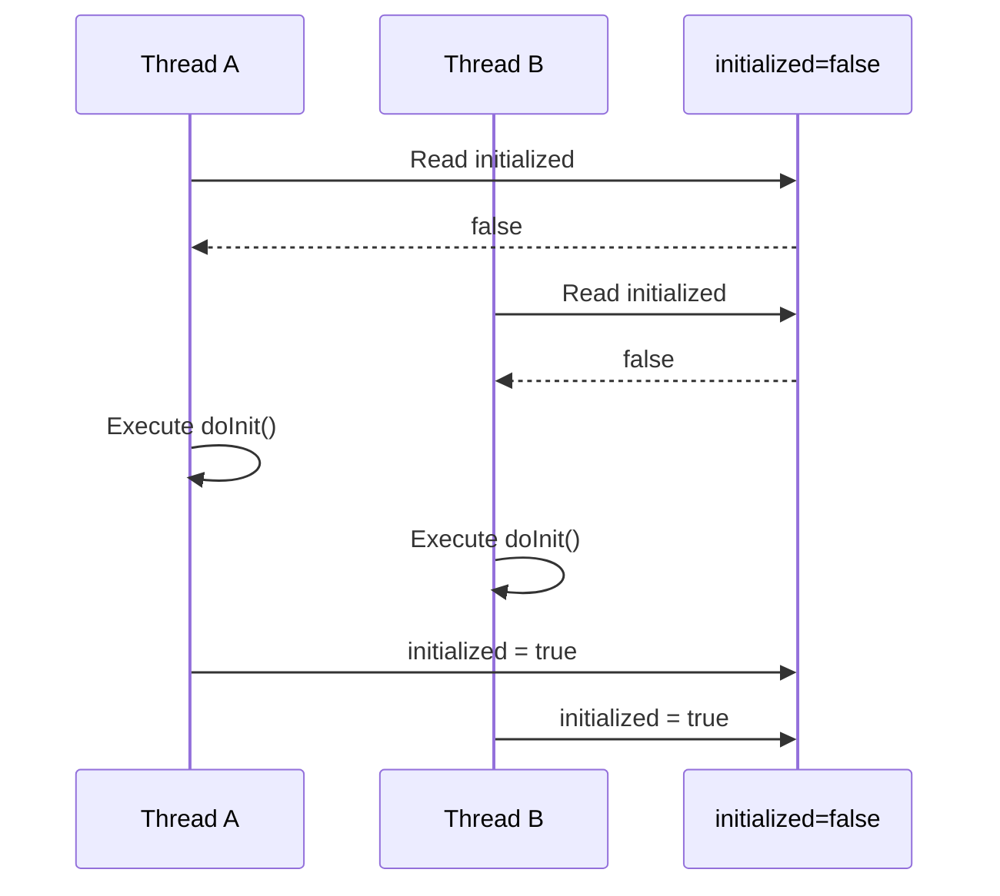
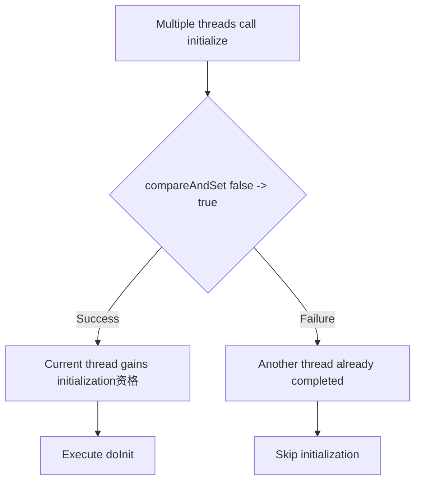
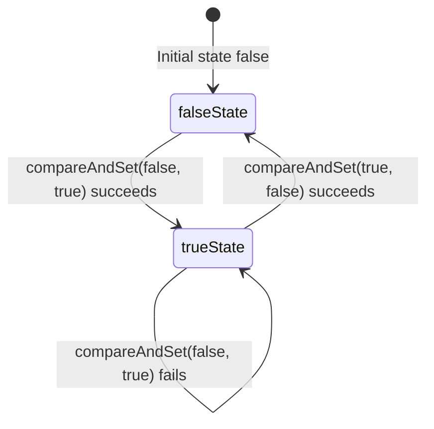
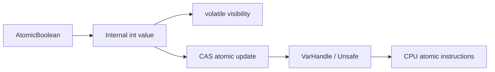
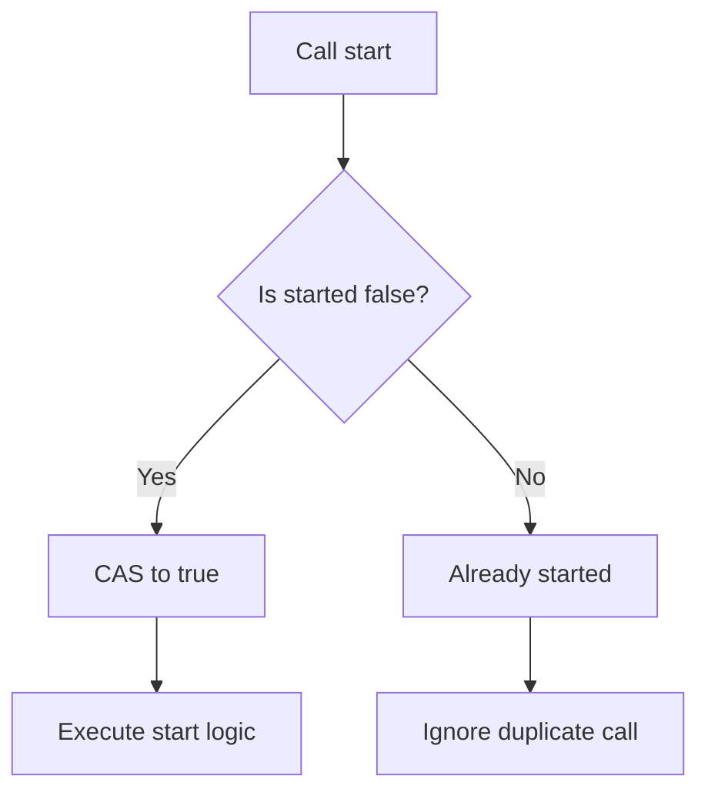
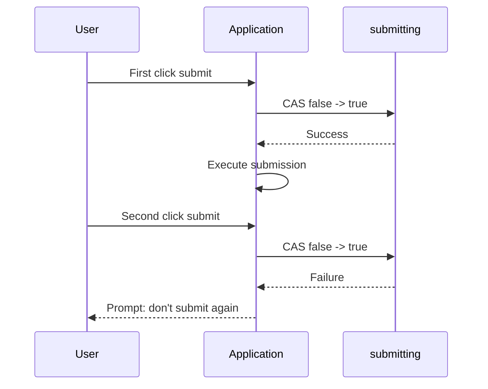
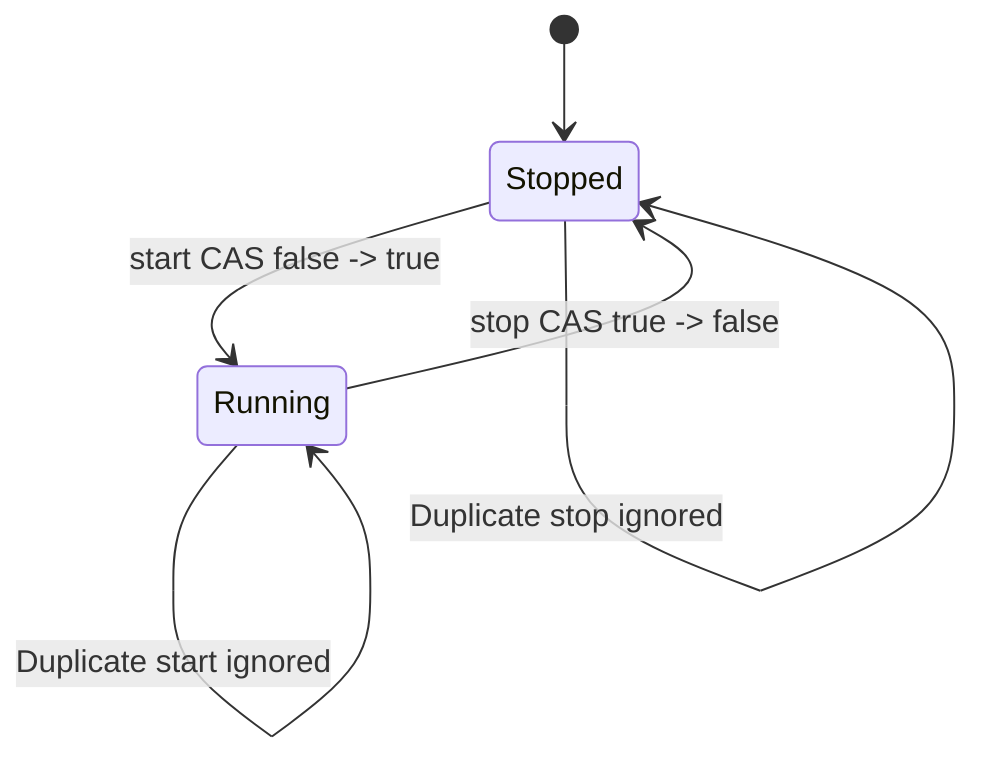
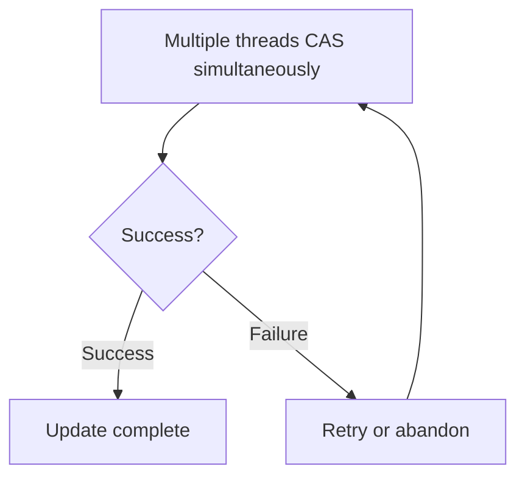
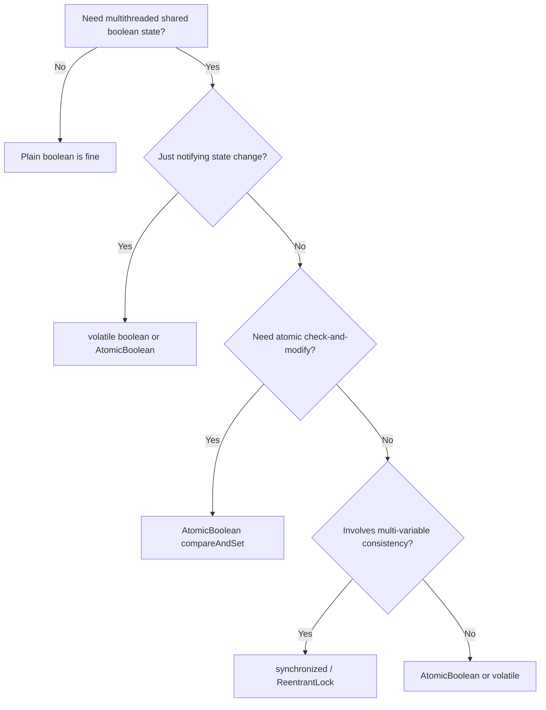

## 1. Introduction: Why Can a Simple boolean Have Concurrency Issues?

In Java multithreaded programming, we often need a simple status flag to control program flow, such as:

* Whether initialization has completed
* Whether a task has been cancelled
* Whether a switch has been turned on
* Whether a piece of logic should execute only once
* Whether a service is starting up or shutting down

In a single-threaded environment, a plain `boolean` field is sufficient.

```java
private boolean initialized = false;
```

But once we enter a multithreaded environment, things are no longer that simple.

A seemingly ordinary `boolean` can simultaneously involve three concurrency problems:

| Problem | Meaning | Consequence |
| ----- | --------------------- | ---------------- |
| Visibility | A thread modifies a variable, but other threads may not see it immediately | Threads read stale values |
| Atomicity | Checking and modifying are not an indivisible whole | Multiple threads pass the check simultaneously |
| Ordering | The CPU or compiler may reorder instructions | Execution order differs from code order |

`AtomicBoolean` is precisely the lightweight tool in Java's concurrency package designed to solve this kind of "shared boolean state" problem.

---

## 2. Concurrency Pitfall: Why Is a Plain boolean Insufficient?

Consider a very common initialization example.

```java
public class UnsafeInit {

    private boolean initialized = false;

    public void initialize() {
        if (!initialized) {
            // Perform some time-consuming initialization work
            doInit();

            initialized = true;
        }
    }

    private void doInit() {
        System.out.println("init...");
    }
}
```

This code works fine in a single thread, but has a classic race condition under multithreading.

### 2.1 Check-Then-Act Race Condition

**Check-Then-Act** means checking the state first, then acting based on the result.

```java
if (!initialized) {
    doInit();
    initialized = true;
}
```

The problem is:

> `if (!initialized)` and `initialized = true` are not an atomic operation.

Multiple threads may simultaneously see `initialized == false`, then all enter the initialization logic.



The result: initialization logic is executed multiple times.

---

## 3. Can volatile Solve This?

Many people would think of changing the field to `volatile`.

```java
public class VolatileInit {

    private volatile boolean initialized = false;

    public void initialize() {
        if (!initialized) {
            doInit();
            initialized = true;
        }
    }

    private void doInit() {
        System.out.println("init...");
    }
}
```

`volatile` guarantees:

* After a thread modifies the variable, other threads can see it as soon as possible
* It prohibits certain instruction reordering
* Reads and writes have volatile semantics

However, it cannot guarantee atomicity of compound operations.

That means:

```java
if (!initialized) {
    initialized = true;
}
```

is still not an indivisible whole.

### 3.1 volatile vs. AtomicBoolean

| Capability | volatile boolean | AtomicBoolean |
| ------------- | ---------------: | ------------: |
| Visibility guarantee | Yes | Yes |
| Single read/write atomicity | Yes | Yes |
| "Check-then-modify" atomicity | No | Yes |
| CAS support | No | Yes |
| Suitable for one-time state switch | Not suitable | Suitable |
| Suitable for complex critical section protection | Not suitable | Not suitable |

So, `volatile boolean` is good for "state notification" but not for "preemptive state transition".

---

## 4. synchronized Can Solve It, But May Not Always Be Optimal

Using `synchronized` guarantees only one thread enters the method at a time.

```java
public class SafeInit {

    private boolean initialized = false;

    public synchronized void initialize() {
        if (!initialized) {
            doInit();
            initialized = true;
        }
    }

    private void doInit() {
        System.out.println("init...");
    }
}
```

This is certainly correct.

But if we just want to protect a simple boolean status bit, using a lock may feel somewhat heavy.

Note that modern JVMs have heavily optimized `synchronized`; it's not necessarily "slow." The real issue is:

> When we only need a simple state transition, using a lock makes the solution unnecessarily complex.

In this case, `AtomicBoolean` is a lighter, more semantically fitting choice.

---

## 5. What Is AtomicBoolean?

`AtomicBoolean` is located in the Java concurrency package:

```java
java.util.concurrent.atomic.AtomicBoolean
```

It represents a boolean value that can be atomically updated.

Typical usage:

```java
import java.util.concurrent.atomic.AtomicBoolean;

public class AtomicInit {

    private final AtomicBoolean initialized = new AtomicBoolean(false);

    public void initialize() {
        if (initialized.compareAndSet(false, true)) {
            doInit();
        }
    }

    private void doInit() {
        System.out.println("init...");
    }
}
```

The core of this code is:

```java
initialized.compareAndSet(false, true)
```

It means:

> Only change the value to `true` if the current value is still `false`. Returns `true` on success; `false` otherwise.

When multiple threads execute simultaneously, only one can successfully complete this state transition.



---

## 6. The Underlying Idea: CAS

`AtomicBoolean`'s core capability comes from CAS.

CAS stands for:

> Compare-And-Swap.

It can be understood as an atomic operation:

```text
If current value == expected value:
    Update to new value
Else:
    Don't update
```

Mapped to `AtomicBoolean`:

```java
compareAndSet(expectedValue, newValue)
```

For example:

```java
flag.compareAndSet(false, true);
```

Meaning:

```text
If flag is currently false, change it to true.
Otherwise, do nothing.
```

The entire compare-and-modify process is atomic — no other thread can interleave.

### 6.1 CAS State Transition Diagram



---

## 7. Source Perspective: Why Does AtomicBoolean Use int for boolean?

In the JDK, `AtomicBoolean` doesn't directly use a plain `boolean` for atomic operations — it uses an integer value to represent the boolean state.

It can be abstractly understood as:

```java
private volatile int value;
```

Where:

```text
0 represents false
1 represents true
```

The reason is that underlying CPU CAS instructions typically operate more easily on integers or reference types.

Since Java 9, the JDK has extensively used `VarHandle` for atomic access and memory semantics control. In earlier versions, it relied mainly on `Unsafe`.



You can think of it as:

> `AtomicBoolean` is a high-level concurrency tool provided at the Java level, relying on atomic capabilities from the JVM and CPU underneath.

---

## 8. AtomicBoolean Method Guide

### 8.1 get()

Read the current value.

```java
boolean current = flag.get();
```

Suitable for checking current state.

```java
if (running.get()) {
    System.out.println("service is running");
}
```

---

### 8.2 set(boolean newValue)

Set a new value.

```java
flag.set(true);
```

`set` has volatile write semantics — other threads can see this change.

Suitable for normal state publishing.

```java
shutdown.set(true);
```

---

### 8.3 compareAndSet(boolean expectedValue, boolean newValue)

This is `AtomicBoolean`'s most core method.

```java
boolean success = flag.compareAndSet(false, true);
```

Suitable for one-time actions.

```java
public class OnceTask {

    private final AtomicBoolean executed = new AtomicBoolean(false);

    public void runOnce() {
        if (executed.compareAndSet(false, true)) {
            System.out.println("Execute only once");
        }
    }
}
```

---

### 8.4 getAndSet(boolean newValue)

Atomically set a new value and return the old value.

```java
boolean oldValue = flag.getAndSet(true);
```

Suitable for "preempt and know the previous state" scenarios.

```java
public class Worker {

    private final AtomicBoolean busy = new AtomicBoolean(false);

    public void work() {
        boolean wasBusy = busy.getAndSet(true);

        if (wasBusy) {
            System.out.println("Task already in progress");
            return;
        }

        try {
            System.out.println("Starting task");
        } finally {
            busy.set(false);
        }
    }
}
```

---

### 8.5 lazySet(boolean newValue)

`lazySet` sets a new value with weaker visibility requirements than `set`.

```java
flag.lazySet(false);
```

Suitable for "eventually visible is fine" scenarios, such as state reset or object recycling markers.

However, in normal business development, prefer `set` for clarity.

---

### 8.6 weakCompareAndSet Methods

`weakCompareAndSet` is a weakened version of CAS.

Its characteristics:

* Also attempts CAS
* May fail spuriously
* Usually used with loop retry
* Rarely used directly in normal business code

Generally, prefer:

```java
compareAndSet(expectedValue, newValue)
```

over weak CAS.

---

## 9. Method Comparison Table

| Method | Purpose | Atomic | Typical Scenario |
| ------------------------------- | --------- | ---: | ---------- |
| `get()` | Get current value | Yes | State checking |
| `set(value)` | Set new value | Yes | State publishing |
| `lazySet(value)` | Lazily set new value | Yes | Eventually-consistent state update |
| `compareAndSet(expect, update)` | Update when expected value matches | Yes | State preemption, one-time execution |
| `getAndSet(value)` | Set new value and return old | Yes | Preempt execution right, state swap |
| `weakCompareAndSet(...)` | Weak CAS | Yes | Low-level optimization, loop retry |

---

## 10. Typical Use Cases

### 10.1 Execute a Task Only Once

```java
public class StartOnceService {

    private final AtomicBoolean started = new AtomicBoolean(false);

    public void start() {
        if (!started.compareAndSet(false, true)) {
            System.out.println("Service already started, ignoring duplicate start");
            return;
        }

        System.out.println("Service starting...");
    }
}
```

State flow:



---

### 10.2 Task Cancellation Flag

```java
public class CancelableTask implements Runnable {

    private final AtomicBoolean cancelled = new AtomicBoolean(false);

    public void cancel() {
        cancelled.set(true);
    }

    @Override
    public void run() {
        while (!cancelled.get()) {
            // Execute task
            doWork();
        }

        System.out.println("Task cancelled");
    }

    private void doWork() {
        System.out.println("working...");
    }
}
```

In this scenario, `AtomicBoolean` serves as an inter-thread state notification.

Of course, for simple notification, `volatile boolean` also works.

---

### 10.3 Prevent Duplicate Submission

```java
public class SubmitGuard {

    private final AtomicBoolean submitting = new AtomicBoolean(false);

    public void submit() {
        if (!submitting.compareAndSet(false, true)) {
            System.out.println("Already submitting, please don't click again");
            return;
        }

        try {
            System.out.println("Submitting request...");
        } finally {
            submitting.set(false);
        }
    }
}
```

This pattern is excellent for preventing duplicate triggers.



---

### 10.4 Service Lifecycle Control

```java
public class LifecycleService {

    private final AtomicBoolean running = new AtomicBoolean(false);

    public void start() {
        if (running.compareAndSet(false, true)) {
            System.out.println("service started");
        }
    }

    public void stop() {
        if (running.compareAndSet(true, false)) {
            System.out.println("service stopped");
        }
    }

    public boolean isRunning() {
        return running.get();
    }
}
```

State machine:



---

## 11. AtomicBoolean vs. synchronized: Which to Choose?

### 11.1 Scenarios Suitable for AtomicBoolean

| Scenario | Suitable? |
| ----------- | ---: |
| One-time execution control | Suitable |
| Simple on/off state | Suitable |
| Task cancellation flag | Suitable |
| Service start/stop state | Suitable |
| Duplicate submission prevention | Suitable |
| Simple state machine transition | Suitable |

### 11.2 Scenarios Not Suitable for AtomicBoolean

| Scenario | Reason |
| ------------ | ------------------------------------------------ |
| Multi-variable consistency | AtomicBoolean only protects one boolean state |
| Complex critical section logic | Locks are clearer |
| Wait and notification needed | Use `wait/notify`, `Condition`, `CountDownLatch` etc. |
| Fairness required | CAS doesn't guarantee fairness |
| Continuous spinning under high contention | May waste CPU |

For example, this scenario is not suitable for just `AtomicBoolean`:

```java
if (flag.compareAndSet(false, true)) {
    balance = balance - amount;
    count++;
    log.add(record);
}
```

This involves consistency of multiple shared variables. Without extra protection, concurrency issues may still arise.

A more suitable approach might be:

```java
synchronized (this) {
    balance = balance - amount;
    count++;
    log.add(record);
}
```

---

## 12. Common Misconceptions

### 12.1 Myth 1: AtomicBoolean Can Replace All Locks

No.

`AtomicBoolean` is for simple state bits, not for protecting complex business critical sections.

If you need to maintain consistency across multiple variables, locks are often clearer and safer.

---

### 12.2 Myth 2: CAS Is Always Faster Than synchronized

Not necessarily.

Under low contention, CAS is typically lightweight.

But under high contention, many threads repeatedly failing CAS can cause CPU spinning.



If continuous spinning after failure, it consumes significant CPU.

So CAS's advantage lies in:

> Low contention, simple state updates, quick return or limited retries on failure.

---

### 12.3 Myth 3: AtomicBoolean Solves All Visibility Issues

`AtomicBoolean`'s own reads/writes have memory semantics, but it doesn't automatically guarantee thread safety of other plain variables.

For example:

```java
private String data;
private final AtomicBoolean ready = new AtomicBoolean(false);

public void write() {
    data = "hello";
    ready.set(true);
}

public void read() {
    if (ready.get()) {
        System.out.println(data);
    }
}
```

Such publish scenarios usually work, but if business is more complex, you still need careful analysis of variable publication, object escape, and memory visibility.

---

## 13. Practical Best Practices

### 13.1 Use final for AtomicBoolean Fields

Recommended:

```java
private final AtomicBoolean running = new AtomicBoolean(false);
```

Not recommended:

```java
private AtomicBoolean running = new AtomicBoolean(false);
```

Because we typically don't want the atomic object itself to be replaced.

---

### 13.2 Prefer compareAndSet for State Transitions

If your semantics are "only modify when current state meets conditions," prefer:

```java
compareAndSet(expectedValue, newValue)
```

Don't write:

```java
if (!flag.get()) {
    flag.set(true);
}
```

The latter is still Check-Then-Act — no overall atomicity.

---

### 13.3 Restore State in finally

If using `AtomicBoolean` for "currently executing," always consider exception recovery.

Recommended:

```java
if (!running.compareAndSet(false, true)) {
    return;
}

try {
    doWork();
} finally {
    running.set(false);
}
```

Otherwise, if `doWork()` throws an exception, the state may remain `true` forever.

---

### 13.4 Don't Over-Pursue Lock-Free

Lock-free is not the goal — correctness and maintainability are.

If business logic is complex, `synchronized` or `ReentrantLock` may be easier to get right.

---

## 14. AtomicBoolean Decision Flowchart



---

## 15. Complete Example: A Repeatedly Startable and Stoppable Service

```java
import java.util.concurrent.atomic.AtomicBoolean;

public class DemoService {

    private final AtomicBoolean running = new AtomicBoolean(false);

    public void start() {
        if (!running.compareAndSet(false, true)) {
            System.out.println("Service already running, no need to start again");
            return;
        }

        System.out.println("Service started successfully");
    }

    public void stop() {
        if (!running.compareAndSet(true, false)) {
            System.out.println("Service not running, no need to stop");
            return;
        }

        System.out.println("Service stopped successfully");
    }

    public boolean isRunning() {
        return running.get();
    }

    public static void main(String[] args) {
        DemoService service = new DemoService();

        service.start();
        service.start();

        service.stop();
        service.stop();
    }
}
```

Output:

```text
Service started successfully
Service already running, no need to start again
Service stopped successfully
Service not running, no need to stop
```

This example demonstrates `AtomicBoolean`'s typical value:

> It doesn't just store true or false — it manages state transitions atomically.

---

## 16. Summary

`AtomicBoolean` is a small yet practical component in Java's concurrency toolkit.

It's suited for expressing:

* One-time execution
* On/off state switches
* Cancellation flags
* Lifecycle control
* Duplicate submission prevention
* Simple state machine transitions

Its core capability comes from CAS:

```java
compareAndSet(expectedValue, newValue)
```

This enables atomic state switching without locking.

However, `AtomicBoolean` isn't万能的.

| Conclusion | Explanation |
| ------- | ---------------------- |
| Simple state bit | Prefer AtomicBoolean |
| Pure visibility notification | volatile boolean also works |
| Multi-variable consistency | Use synchronized or Lock |
| Complex concurrency coordination | Use more suitable JUC tools |
| High contention scenario | Watch for CAS failure and CPU spinning |

One sentence summary:

> `AtomicBoolean` is best for solving "one boolean state, multiple threads competing to modify it."

It lets us, at very small cost, gain clear, reliable, lock-free state management.