# AutoCloseable Notes: An Elegant Solution for Java Resource Management

In Java development, we frequently encounter various resources that require manual release:

- File streams: `FileInputStream`, `BufferedReader`
- Network connections: `Socket`
- Database connections: `Connection`, `Statement`, `ResultSet`
- Distributed resources: Redis connections, MQ connections, lock resources
- Custom resources: temporary files, thread pool wrappers, business contexts

These resources all share one thing in common: **they not only occupy JVM memory but may also consume operating system or external system resources**.

If resources are not released in a timely manner, the consequences range from memory leaks and connection leaks to exhausted file handles, saturated database connection pools, and unavailable production services.

Java 7 introduced `AutoCloseable` and `try-with-resources` precisely to solve this problem.

---

## 1. Why Is Plain try-finally Not Elegant Enough?

Before Java 7, resource closing typically relied on `try-finally`.

For example, reading a file:

```java
import java.io.FileInputStream;
import java.io.IOException;

public class UnsafeFileReadDemo {

    public static void main(String[] args) {
        FileInputStream fis = null;

        try {
            fis = new FileInputStream("data.txt");

            int data = fis.read();
            System.out.println(data);

        } catch (IOException e) {
            e.printStackTrace();

        } finally {
            if (fis != null) {
                try {
                    fis.close();
                } catch (IOException closeException) {
                    closeException.printStackTrace();
                }
            }
        }
    }
}
````

This code appears fine at first glance, but it has several obvious drawbacks.

| Problem | Description |
| ---- | -------------------------- |
| Verbose code | The actual business logic is only a few lines, but resource closing code takes up most of the space |
| Easy to miss | Developers may forget to write `finally`, or forget the null check |
| Nested complexity | `close()` itself may throw exceptions, requiring another catch |
| Exception masking | Exceptions in `finally` may override business exceptions |
| Multi-resource chaos | Multiple resources need to be closed in reverse order, causing complexity to skyrocket |

---

## 2. Traditional Resource Closing Flow

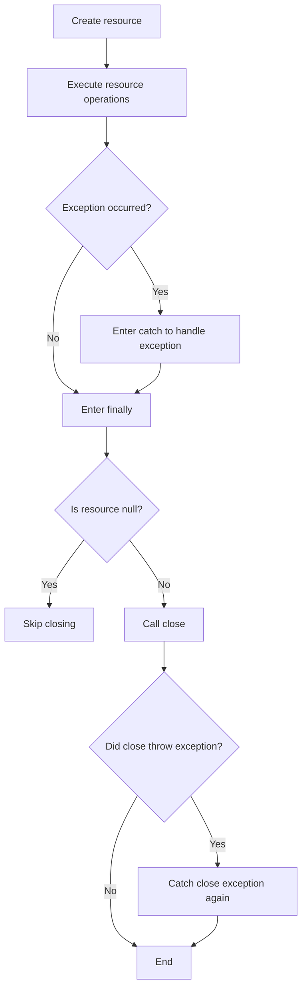

The core problem with the traditional approach is: **resource management logic invades business code**.

The more complex the code, the easier it is to make mistakes.

---

## 3. What Is AutoCloseable?

`AutoCloseable` is an interface introduced in Java 7, located in the `java.lang` package.

Its definition is very simple:

```java
public interface AutoCloseable {
    void close() throws Exception;
}
```

As long as a class implements `AutoCloseable`, its objects can be placed in a `try-with-resources` statement, and Java will automatically call the `close()` method.

---

## 4. Core Positioning of AutoCloseable

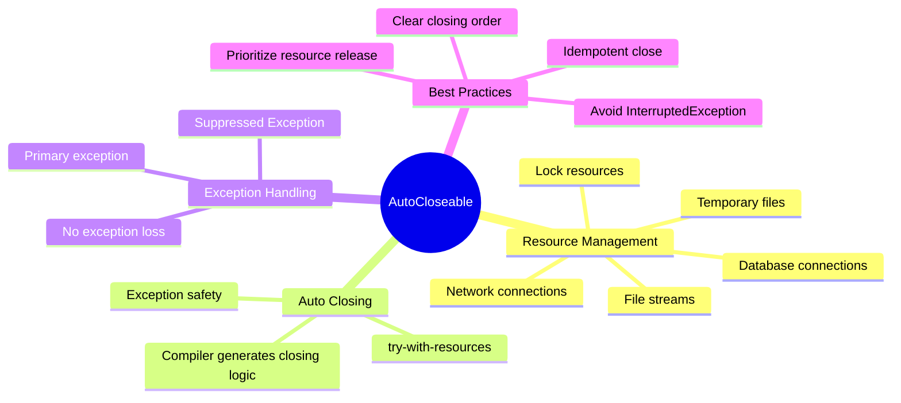

`AutoCloseable` itself is not complex; what makes it truly powerful is its combination with `try-with-resources`.

---

## 5. try-with-resources: Modern Java's Resource Management Approach

Using `try-with-resources`, the code can be simplified to:

```java
import java.io.FileInputStream;
import java.io.IOException;

public class SafeFileReadDemo {

    public static void main(String[] args) {
        try (FileInputStream fis = new FileInputStream("data.txt")) {
            int data = fis.read();
            System.out.println(data);
        } catch (IOException e) {
            e.printStackTrace();
        }
    }
}
```

No need to manually write `finally`, and no need to explicitly call `fis.close()`.

As long as the `try` block finishes executing — whether normally or via exception — the resource will be automatically closed.

---

## 6. Execution Flow of try-with-resources

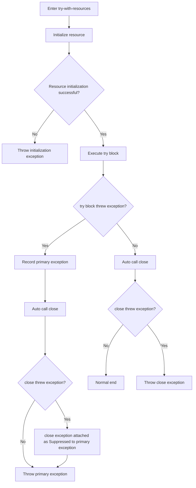

Core conclusion:

> `try-with-resources` automatically closes resources and preserves both business exceptions and closing exceptions, without simply and brutally overriding the original exception.

---

## 7. Multi-Resource Scenario: Closing Order Is Reversed

`try-with-resources` supports declaring multiple resources.

```java
try (
    ResourceA a = new ResourceA();
    ResourceB b = new ResourceB();
    ResourceC c = new ResourceC()
) {
    System.out.println("use resources");
}
```

Resource closing order:

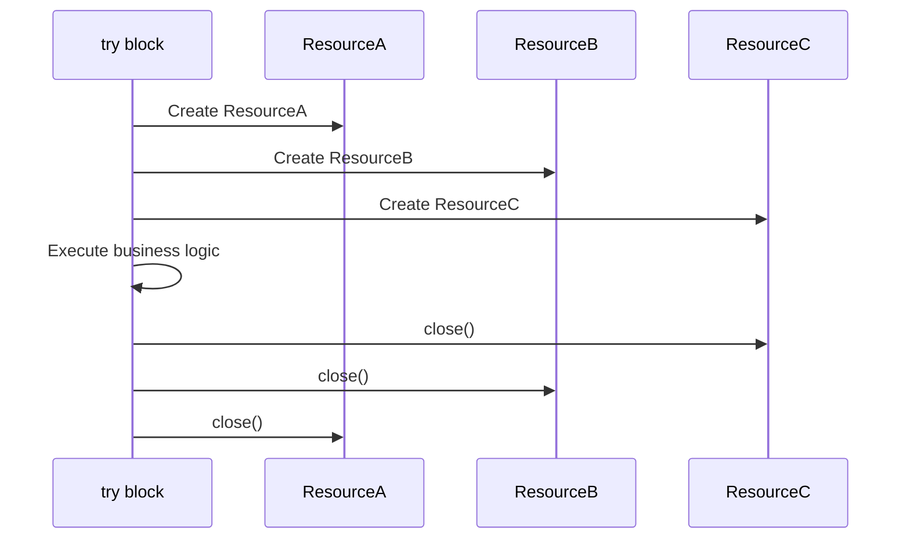

In other words:

> Resources are created in declaration order and closed in the reverse of declaration order.

This is consistent with a stack structure: **the resource created last is closed first**.

---

## 8. Why Should the Closing Order Be Reversed?

Suppose we have a wrapper stream:

```java
try (
    FileInputStream fis = new FileInputStream("data.txt");
    BufferedInputStream bis = new BufferedInputStream(fis)
) {
    int data = bis.read();
}
```

Here `bis` depends on `fis`.

If `fis` is closed first and then `bis` is closed, `bis` may not be able to properly flush or handle its internal state during closing.

So the correct order is:

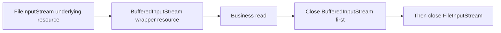

This is also why `try-with-resources` automatically adopts a reverse closing order.

---

## 9. Exception Masking: The Hidden Trap of try-finally

Let's look at a problem with traditional `try-finally`.

```java
public class FinallyExceptionDemo {

    public static void main(String[] args) throws Exception {
        try {
            throw new Exception("Business exception");
        } finally {
            throw new Exception("Closing exception");
        }
    }
}
```

The exception that is ultimately thrown:

```text
Exception in thread "main" java.lang.Exception: Closing exception
```

The truly important `"Business exception"` was overridden.

This is exception masking.

---

## 10. How Does try-with-resources Solve Exception Masking?

`try-with-resources` treats the exception from the `try` block as the primary exception and the exception from `close()` as a suppressed exception.

Example:

```java
class MyResource implements AutoCloseable {

    public void work() throws Exception {
        System.out.println("Resource working...");
        throw new Exception("Exception from work()");
    }

    @Override
    public void close() throws Exception {
        System.out.println("Resource closing...");
        throw new Exception("Exception from close()");
    }
}

public class SuppressedExceptionDemo {

    public static void main(String[] args) {
        try (MyResource resource = new MyResource()) {
            resource.work();
        } catch (Exception e) {
            System.out.println("Main exception: " + e.getMessage());

            for (Throwable suppressed : e.getSuppressed()) {
                System.out.println("Suppressed exception: " + suppressed.getMessage());
            }
        }
    }
}
```

Output:

```text
Resource working...
Resource closing...
Main exception: Exception from work()
Suppressed exception: Exception from close()
```

The exception relationship is as follows:

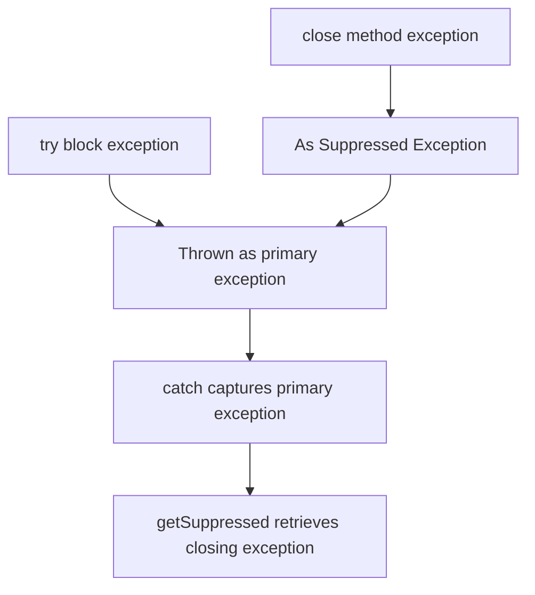

This is safer than traditional `try-finally` because it does not lose critical exception information.

---

## 11. The Relationship Between AutoCloseable and Closeable

Java also has another common interface: `java.io.Closeable`.

Its relationship with `AutoCloseable` is as follows:

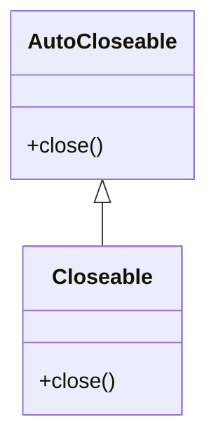

`Closeable` inherits from `AutoCloseable`.

The source code roughly looks like this:

```java
public interface Closeable extends AutoCloseable {
    void close() throws IOException;
}
```

---

## 12. AutoCloseable vs Closeable

| Comparison | AutoCloseable | Closeable |
| ---- | ------------------ | --------------------- |
| Package | `java.lang` | `java.io` |
| Introduced in | Java 7 | Java 5 |
| Scope | General resources | I/O resources |
| close exception | `throws Exception` | `throws IOException` |
| Inheritance relationship | Parent interface | Child interface |
| Idempotency requirement | Recommended idempotent | Required idempotent |
| Typical implementations | JDBC connections, business resources, lock wrappers | InputStream, OutputStream, Reader, Writer |

Summary:

> `AutoCloseable` is a more general resource closing protocol, while `Closeable` is a specialized version for I/O scenarios.

---

## 13. Which Classes Implement AutoCloseable?

Common implementations include:

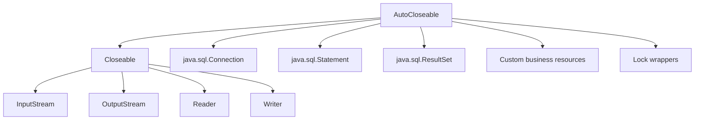

Common resource examples:

| Type | Example |
| ------- | ------------------------------- |
| File input | `FileInputStream` |
| File output | `FileOutputStream` |
| Character reading | `BufferedReader` |
| Character writing | `BufferedWriter` |
| Database connection | `Connection` |
| SQL executor | `Statement`, `PreparedStatement` |
| Query result set | `ResultSet` |
| Network resource | `Socket` |
| Custom resource | Business class implementing `AutoCloseable` |

---

## 14. Typical Usage in JDBC

Traditional JDBC code without `try-with-resources` can easily lead to connection leaks.

The recommended approach:

```java
import java.sql.Connection;
import java.sql.DriverManager;
import java.sql.PreparedStatement;
import java.sql.ResultSet;

public class JdbcDemo {

    public static void main(String[] args) throws Exception {
        String url = "jdbc:mysql://localhost:3306/test";
        String username = "root";
        String password = "123456";

        String sql = "select id, name from user where id = ?";

        try (
            Connection connection = DriverManager.getConnection(url, username, password);
            PreparedStatement statement = connection.prepareStatement(sql)
        ) {
            statement.setLong(1, 1L);

            try (ResultSet resultSet = statement.executeQuery()) {
                while (resultSet.next()) {
                    Long id = resultSet.getLong("id");
                    String name = resultSet.getString("name");

                    System.out.println(id + " - " + name);
                }
            }
        }
    }
}
```

Resource closing order:

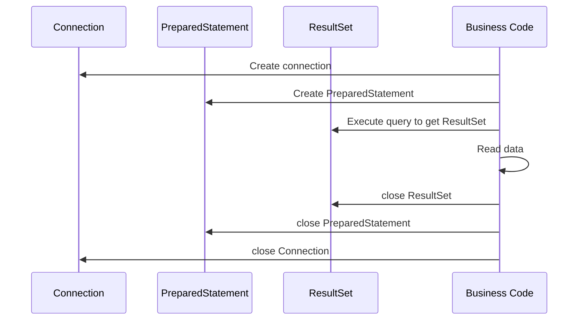

This kind of code is particularly well-suited for `try-with-resources` because JDBC resources have a clear hierarchical dependency relationship.

---

## 15. Custom AutoCloseable Resources

In real business scenarios, we can also implement `AutoCloseable` ourselves.

For example, wrapping a temporary directory:

```java
import java.io.IOException;
import java.nio.file.Files;
import java.nio.file.Path;

public class TempDirectory implements AutoCloseable {

    private final Path path;

    public TempDirectory() throws IOException {
        this.path = Files.createTempDirectory("demo-");
    }

    public Path getPath() {
        return path;
    }

    @Override
    public void close() throws IOException {
        Files.deleteIfExists(path);
        System.out.println("Temp directory deleted: " + path);
    }
}
```

Usage:

```java
public class TempDirectoryDemo {

    public static void main(String[] args) throws Exception {
        try (TempDirectory tempDirectory = new TempDirectory()) {
            Path path = tempDirectory.getPath();
            System.out.println("Use temp directory: " + path);
        }
    }
}
```

The benefit of this design is: **the resource lifecycle is confined within the try block**.

---

## 16. Production-Grade Implementation: The close Method Should Be Idempotent

Idempotent means that multiple calls produce the same result.

```java
resource.close();
resource.close();
resource.close();
```

Ideally, only the first call actually releases the resource; subsequent calls simply return without re-releasing or throwing unexpected exceptions.

Recommended approach:

```java
import java.util.concurrent.atomic.AtomicBoolean;

public class SafeResource implements AutoCloseable {

    private final AtomicBoolean closed = new AtomicBoolean(false);

    public void use() {
        if (closed.get()) {
            throw new IllegalStateException("Resource already closed");
        }

        System.out.println("Using resource...");
    }

    @Override
    public void close() {
        if (closed.compareAndSet(false, true)) {
            release();
        }
    }

    private void release() {
        System.out.println("Release resource...");
    }
}
```

Execution flow:

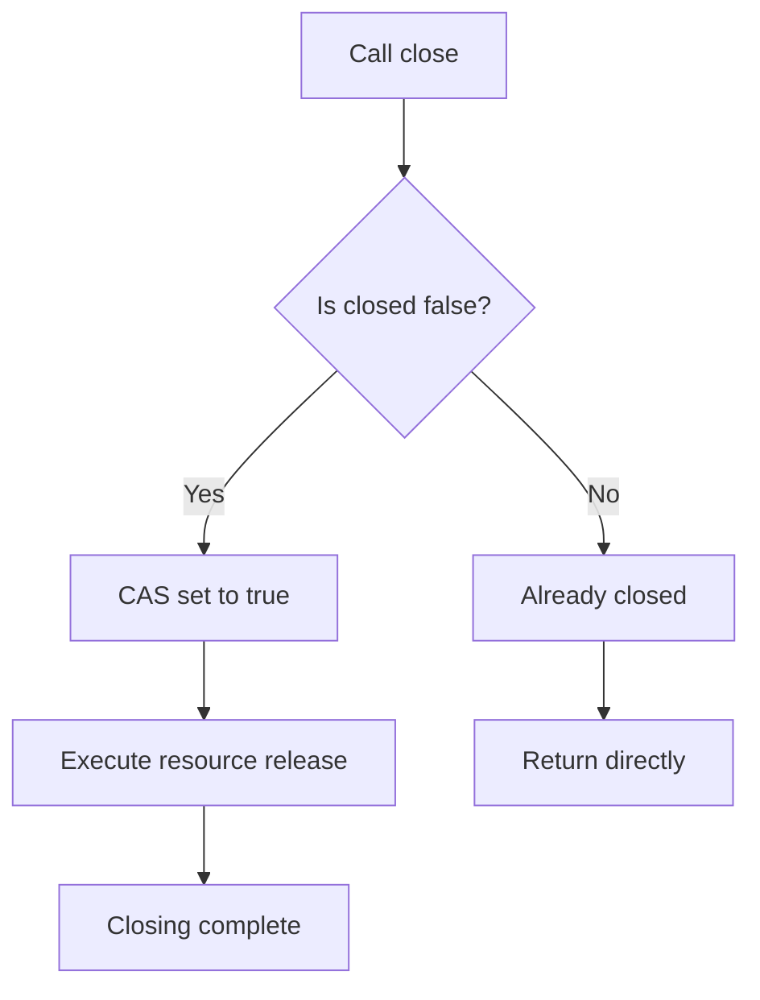

Why use `AtomicBoolean`?

Because resources may be closed by multiple threads in a concurrent environment. Using CAS avoids duplicate releases.

---

## 17. close Method Design Principles

In production environments, the `close()` method should not be written carelessly.

Follow these principles:

| Principle | Description |
| --------------------------- | ---------------------------- |
| Prefer idempotency | Multiple calls to `close()` should not release resources repeatedly |
| Prioritize releasing core resources | Even if subsequent cleanup fails, release the most important resources first |
| Avoid throwing `InterruptedException` | Prevent thread interrupt state from being interfered with by the exception suppression mechanism |
| Do not swallow critical exceptions | Closing failures need to be logged or thrown; avoid silent failures |
| Prohibit use after closing | Check whether the resource is already closed before using it |
| Mind the order for multi-resource closing | Close outer dependent resources first, then underlying resources |
| Avoid heavy business logic in close | `close()` should focus on releasing resources, not承担 complex business logic |

---

## 18. How Should Exceptions in close Be Handled?

This depends on the resource type.

### 1. Business-Perceptible Closing Failure

For example, when writing a file, closing the output stream may trigger a flush. If this fails, it means data may not have been fully written.

Such exceptions should be thrown:

```java
@Override
public void close() throws IOException {
    outputStream.close();
}
```

### 2. Cleanup-Type Resource Closing Failure

For example, failing to delete a temporary file may not affect the main flow, but it should be logged.

```java
@Override
public void close() {
    try {
        Files.deleteIfExists(tempFile);
    } catch (IOException e) {
        log.warn("Failed to delete temp file: {}", tempFile, e);
    }
}
```

### 3. Multiple Resource Closing Failures

You can manually collect exceptions:

```java
@Override
public void close() throws Exception {
    Exception mainException = null;

    try {
        resourceA.close();
    } catch (Exception e) {
        mainException = e;
    }

    try {
        resourceB.close();
    } catch (Exception e) {
        if (mainException != null) {
            mainException.addSuppressed(e);
        } else {
            mainException = e;
        }
    }

    if (mainException != null) {
        throw mainException;
    }
}
```

Exception merging model:

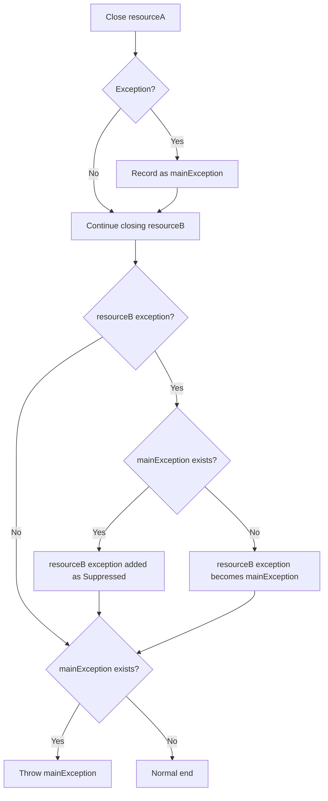

---

## 19. AutoCloseable Can Also Be Used for Lock Management

`try-with-resources` is not only for closing files and databases; it can also elegantly manage locks.

Standard approach:

```java
lock.lock();

try {
    // Critical section
} finally {
    lock.unlock();
}
```

Can be wrapped as:

```java
import java.util.concurrent.locks.Lock;

public class AutoLock implements AutoCloseable {

    private final Lock lock;

    public AutoLock(Lock lock) {
        this.lock = lock;
        this.lock.lock();
    }

    @Override
    public void close() {
        lock.unlock();
    }
}
```

Usage:

```java
import java.util.concurrent.locks.ReentrantLock;

public class AutoLockDemo {

    private final ReentrantLock lock = new ReentrantLock();

    public void update() {
        try (AutoLock ignored = new AutoLock(lock)) {
            System.out.println("Update safely...");
        }
    }
}
```

This makes the locking and unlocking code more consistent.

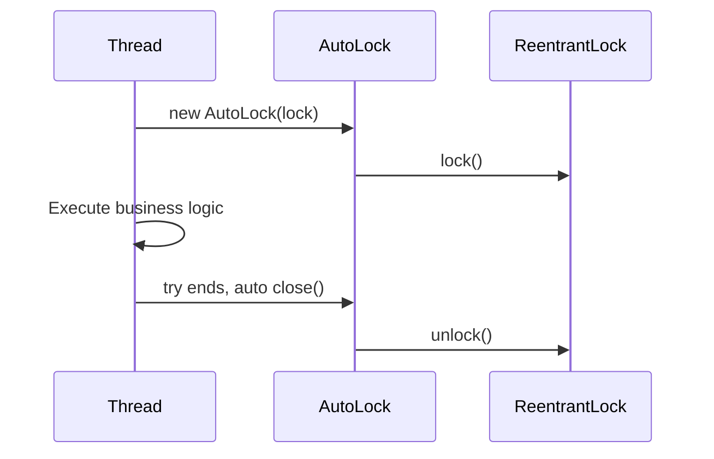

---

## 20. Applicable Scenarios for AutoCloseable

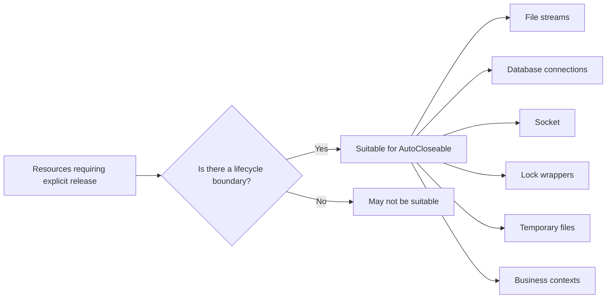

Scenarios recommended for `AutoCloseable`:

| Scenario | Recommended | Description |
| ----------- | ---: | ------------------------ |
| File read/write | Recommended | JDK already provides extensive support |
| JDBC connections | Recommended | Avoids connection leaks |
| Socket communication | Recommended | Network resources must be released |
| Temporary directories/files | Recommended | Suitable for cleanup after scope ends |
| Lock resource wrapping | Recommended | Reduces the risk of forgetting unlock |
| Thread pools | Use with caution | Thread pools typically have long lifecycles and are not suitable for frequent try-closing |
| Spring Beans | Use with caution | Prefer letting Spring lifecycle management handle them |

---

## 21. Do Not Abuse AutoCloseable

Although `AutoCloseable` is very useful, it does not mean every object should implement it.

Scenarios where it is not recommended:

```java
public class User implements AutoCloseable {
    private Long id;
    private String name;

    @Override
    public void close() {
        // No actual resource to release
    }
}
```

This design is meaningless.

To determine whether implementing `AutoCloseable` is appropriate, ask yourself three questions:

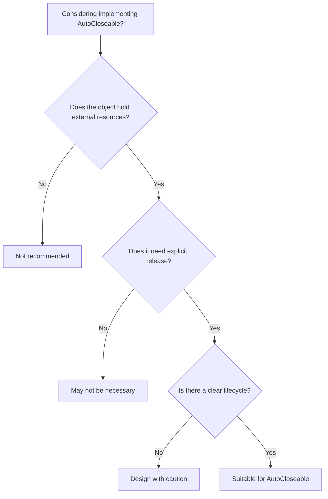

---

## 22. The Compiler Essence of try-with-resources

`try-with-resources` is syntactic sugar.

The following code:

```java
try (MyResource resource = new MyResource()) {
    resource.work();
}
```

Is roughly transformed by the compiler into a structure like:

```java
MyResource resource = new MyResource();
Throwable primaryException = null;

try {
    resource.work();
} catch (Throwable t) {
    primaryException = t;
    throw t;
} finally {
    if (resource != null) {
        if (primaryException != null) {
            try {
                resource.close();
            } catch (Throwable closeException) {
                primaryException.addSuppressed(closeException);
            }
        } else {
            resource.close();
        }
    }
}
```

This is also why it can handle Suppressed Exceptions.

---

## 23. Java 9 Enhancement: Already-Initialized Variables Can Be Used Directly

In Java 7, resources had to be declared inside `try()`:

```java
try (BufferedReader reader = new BufferedReader(new FileReader("data.txt"))) {
    System.out.println(reader.readLine());
}
```

Since Java 9, if the resource variable is final or effectively final, you can write:

```java
BufferedReader reader = new BufferedReader(new FileReader("data.txt"));

try (reader) {
    System.out.println(reader.readLine());
}
```

This syntax is more flexible, but note:

> The resource will be closed after the try block ends; even if the variable is still in scope, you should not continue using it.

---

## 24. Common Mistakes

### Mistake 1: Using the Resource After try Ends

```java
BufferedReader reader = new BufferedReader(new FileReader("data.txt"));

try (reader) {
    System.out.println(reader.readLine());
}

reader.readLine(); // Error: resource already closed
```

---

### Mistake 2: Non-Idempotent close Method

```java
public class BadResource implements AutoCloseable {

    private boolean closed = false;

    @Override
    public void close() {
        if (closed) {
            throw new IllegalStateException("Already closed");
        }

        closed = true;
        System.out.println("close");
    }
}
```

This causes exceptions on repeated closing.

A better approach:

```java
public class GoodResource implements AutoCloseable {

    private boolean closed = false;

    @Override
    public void close() {
        if (closed) {
            return;
        }

        closed = true;
        System.out.println("close");
    }
}
```

---

### Mistake 3: Swallowing All Exceptions in close

```java
@Override
public void close() {
    try {
        doClose();
    } catch (Exception ignored) {
    }
}
```

This makes troubleshooting very difficult.

At minimum, log the exception:

```java
@Override
public void close() {
    try {
        doClose();
    } catch (Exception e) {
        log.warn("Failed to close resource", e);
    }
}
```

---

### Mistake 4: Putting Long-Lived Objects in try-with-resources

```java
ExecutorService executorService = Executors.newFixedThreadPool(10);

try (executorService) {
    executorService.submit(task);
}
```

Thread pools are typically application-level resources and should not be casually closed within a local method.

---

## 25. Best Practices Summary

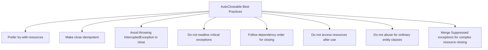

---

## 26. Interview Perspective Summary

If the interviewer asks: **What is AutoCloseable?**

You can answer:

> `AutoCloseable` is a resource closing interface introduced in Java 7 that defines a single `close()` method. Resources implementing this interface can be placed in `try-with-resources`, where the compiler automatically generates closing logic to ensure resources are released when the code block ends.

If they follow up: **What advantages does try-with-resources have over try-finally?**

You can answer:

> It reduces boilerplate code, prevents forgetting to close resources, and correctly handles both try block exceptions and close exceptions. When both occur simultaneously, the try block exception becomes the primary exception, and the close exception is attached via `addSuppressed` to the primary exception, rather than overriding the original exception as in traditional finally.

If they continue: **What is the difference between AutoCloseable and Closeable?**

You can answer:

> `Closeable` inherits from `AutoCloseable` and is primarily for I/O scenarios. `AutoCloseable.close()` can throw `Exception`, while `Closeable.close()` throws the more specific `IOException`. Additionally, `Closeable` requires closing operations to be idempotent, while `AutoCloseable` only recommends idempotency.

---

## 27. One Diagram to Summarize the Entire Article

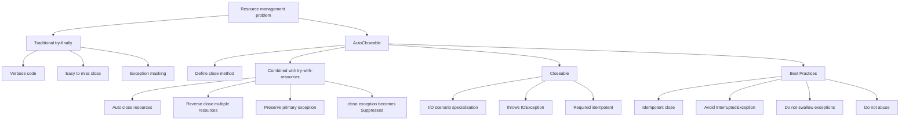

---

## 28. Conclusion

`AutoCloseable` is an important interface in Java's resource management system.

It is very simple in itself, with only a `close()` method, but combined with `try-with-resources`, it brings significant engineering value:

* Cleaner code
* More reliable resource release
* More complete exception information
* Safer multi-resource closing order
* Clearer custom resource lifecycles

In modern Java development, whenever you encounter a resource that requires explicit release, you should prefer:

```java
try (Resource resource = new Resource()) {
    // use resource
}
```

Rather than hand-writing complex `try-finally`.

One-sentence summary:

> `AutoCloseable` transforms resource release from "relying on developer discipline" to "guaranteed by language mechanism".
