## 1. Problem Background: Why Cache null?

In caching practice, we often encounter this scenario:

> A method queries the database and returns `null`, and this `null` itself is a meaningful query result.

For example:

```java
User user = userService.getById(10086L);
```

If no user with `id = 10086` exists in the database, the query result is `null`.

If this `null` is not cached, then every subsequent query for `id = 10086` will continue to hit the database:

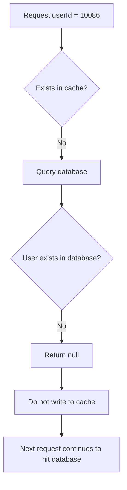

This type of problem is very dangerous in high-concurrency scenarios.

If a large number of requests all query non-existent data, such as non-existent products, users, or orders, the cache layer cannot intercept these requests, and the database will be continuously penetrated.

This is the classic **cache penetration** problem.

---

## 2. Cache Penetration: Non-existent Data Also Needs to Be Cached

The essence of cache penetration is:

> The requested data does not exist in the cache and does not exist in the database, causing every request to bypass the cache and directly access the database.

One solution is:

> Even if the database query result is `null`, cache this `null` result.

This way, when subsequent identical requests come in, `null` can be returned directly from the cache layer without accessing the database.

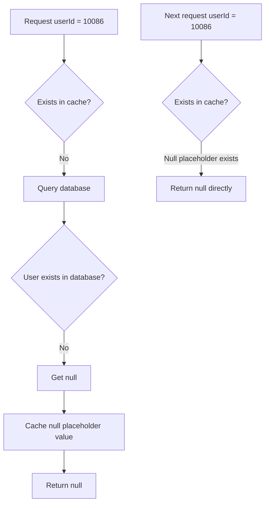

This seems simple, but a fundamental problem arises in actual implementation:

> Many cache implementations do not support directly storing `null`.

---

## 3. Why Do Underlying Caches Dislike null?

Different cache components handle `null` inconsistently.

### 1. ConcurrentHashMap Does Not Allow null

`ConcurrentHashMap` is one of the common local cache underlying structures in Java.

But it does not allow key or value to be `null`.

For example:

```java
ConcurrentHashMap<String, Object> map = new ConcurrentHashMap<>();

map.put("user:10086", null); // Throws NullPointerException
```

In other words, if Spring Cache's underlying implementation uses a structure like `ConcurrentHashMap`, you cannot directly write `null` into it.

---

### 2. Redis Has Ambiguous null Semantics

Redis itself can store empty strings, special marker values, etc.

But for many clients or cache abstraction layers:

```java
Object value = redis.get("user:10086");
```

If the return value is `null`, it could mean two things:

| Return Result | Possible Meaning                |
| ------------- | ------------------------------- |
| `null`        | Key does not exist              |
| `null`        | Key exists, but the business value is null |

This creates semantic ambiguity.

What the cache system really needs to express is:

> This key does exist, it's just that its corresponding business value is null.

Therefore, Spring Cache needs a unified mechanism to express this semantics.

---

## 4. Core Solution: Use NullValue Instead of Real null

Spring Cache's solution is to introduce a special object:

```java
org.springframework.cache.support.NullValue
```

Its core idea is:

> Instead of directly storing `null` in the cache, store `NullValue.INSTANCE` as a placeholder for null.

This is a classic **Null Object pattern**.

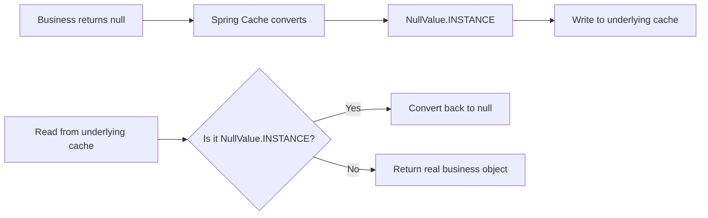

This conversion process can generally be abstracted into two methods:

| Phase        | Method Semantics     | Purpose                              |
| ------------ | -------------------- | ------------------------------------ |
| Write cache  | `toStoreValue`       | Convert business value to cache-storable value |
| Read cache   | `fromStoreValue`     | Convert cache value back to business value |

The pseudocode is as follows:

```java
protected Object toStoreValue(Object userValue) {
    if (userValue == null) {
        return NullValue.INSTANCE;
    }
    return userValue;
}

protected Object fromStoreValue(Object storeValue) {
    if (storeValue == NullValue.INSTANCE) {
        return null;
    }
    return storeValue;
}
```

Through this intermediate layer conversion, Spring Cache both preserves the business semantics of `null` and bypasses the limitation of underlying caches that cannot store `null`.

---

## 5. NullValue Source Code

The source code of `NullValue` is very short, but the design is very elegant:

```java
package org.springframework.cache.support;

import java.io.Serializable;

import org.springframework.lang.Nullable;

public final class NullValue implements Serializable {

    public static final Object INSTANCE = new NullValue();

    private static final long serialVersionUID = 1L;

    private NullValue() {
    }

    private Object readResolve() {
        return INSTANCE;
    }

    @Override
    public boolean equals(@Nullable Object other) {
        return (this == other || other == null);
    }

    @Override
    public int hashCode() {
        return NullValue.class.hashCode();
    }

    @Override
    public String toString() {
        return "null";
    }
}
```

This class looks like just a simple placeholder object, but it contains multiple important design points.

---

## 6. Design Detail 1: final Class, Preventing Inheritance

```java
public final class NullValue implements Serializable
```

`NullValue` is declared as `final`, meaning it cannot be inherited.

This has several benefits:

1. Prevents subclasses from breaking the semantics of `NullValue`.
2. Ensures there is only one standard null placeholder object globally.
3. Avoids complicating `equals`, `hashCode`, and serialization behavior due to inheritance.

For this kind of infrastructure class, semantic stability is more important than extensibility.

---

## 7. Design Detail 2: Singleton Pattern

The core of `NullValue` is a global singleton:

```java
public static final Object INSTANCE = new NullValue();

private NullValue() {
}
```

There are two key points here.

### 1. Private Constructor

```java
private NullValue() {
}
```

The constructor is private, so external code cannot create new objects via `new NullValue()`.

This ensures that external code can only use the single instance provided by the framework.

### 2. public static final INSTANCE

```java
public static final Object INSTANCE = new NullValue();
```

`INSTANCE` is the globally unique null placeholder object.

Its benefits are obvious:

| Design Point          | Value                                              |
| --------------------- | -------------------------------------------------- |
| Singleton object      | All null cache values reuse the same instance      |
| Reduced object creation | No large number of placeholder objects created due to caching many nulls |
| Supports `==` comparison | Reference comparison can be used, with better performance |
| Clear semantics       | All null cache values point to the same standard marker |

The diagram is as follows:

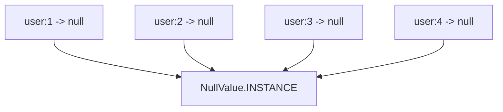

No matter how many business `null` values are cached, the underlying layer can reuse the same `NullValue.INSTANCE`.

---

## 8. Design Detail 3: Why Is INSTANCE Type Object?

This line in the source code is interesting:

```java
public static final Object INSTANCE = new NullValue();
```

It is not written as:

```java
public static final NullValue INSTANCE = new NullValue();
```

But as the `Object` type.

This is because external callers do not need to depend on the concrete type of `NullValue`.

It only needs to be treated as a special cache value object.

This weakens type exposure and emphasizes that it is just an internal placeholder.

Semantically:

```java
Object storeValue = NullValue.INSTANCE;
```

is closer to the design of the cache abstraction layer than:

```java
NullValue storeValue = NullValue.INSTANCE;
```

Because what is stored in the cache is inherently `Object`.

---

## 9. Design Detail 4: readResolve Ensures Singleton Consistency After Deserialization

One of the most critical designs in `NullValue` is:

```java
private Object readResolve() {
    return INSTANCE;
}
```

This method looks unremarkable, but it is very important.

### 1. Problem: Serialization Breaks the Singleton

In distributed cache scenarios, `NullValue.INSTANCE` may be serialized and written to Redis, Memcached, or other cache systems.

For example:

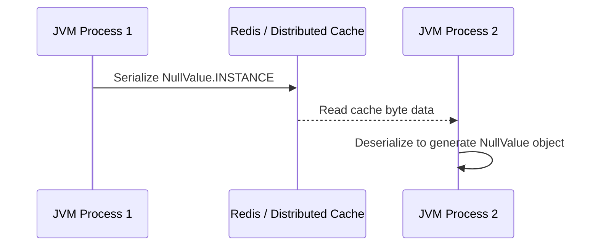

Without special handling, Java deserialization will create a new `NullValue` object.

This would cause:

```java
deserializedObject == NullValue.INSTANCE // false
```

Once this comparison fails, the cache layer may not be able to recognize this value as a null placeholder.

---

### 2. The Role of readResolve

`readResolve()` is a special hook in Java's serialization mechanism.

When object deserialization is complete, if the class defines a `readResolve()` method, what is ultimately returned to the caller is not the newly deserialized object, but the return value of `readResolve()`.

In `NullValue`:

```java
private Object readResolve() {
    return INSTANCE;
}
```

This means:

> No matter what object deserialization creates, it will ultimately be replaced by the globally unique `NullValue.INSTANCE`.

The diagram is as follows:

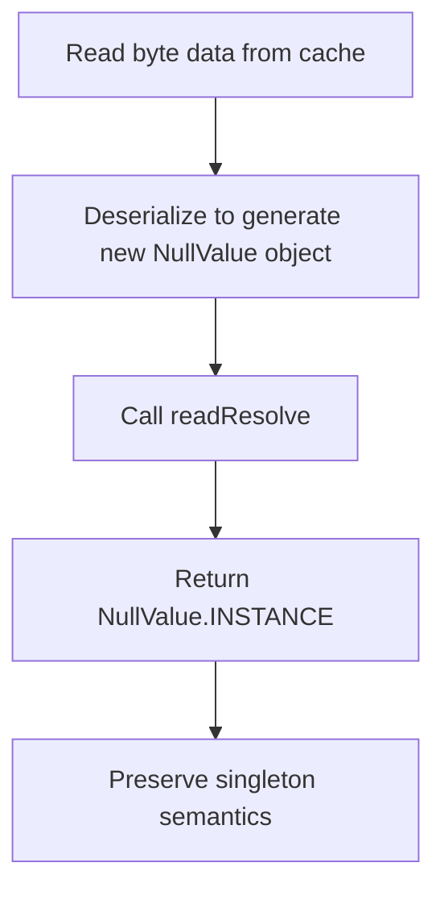

This ensures:

```java
deserializedObject == NullValue.INSTANCE // true
```

This is critical for distributed caching.

---

## 10. Design Detail 5: equals Makes NullValue Semantically Equivalent to null

The `equals` method of `NullValue` is also interesting:

```java
@Override
public boolean equals(@Nullable Object other) {
    return (this == other || other == null);
}
```

It expresses two semantics:

| Condition          | Meaning                                |
| ----------------- | -------------------------------------- |
| `this == other`   | Equal to itself                        |
| `other == null`   | Semantically equal to real null        |

So:

```java
NullValue.INSTANCE.equals(null); // true
```

This is a very clear semantic expression:

> NullValue is a stand-in for null, so it can logically be considered equivalent to null.

However, note that:

```java
null.equals(NullValue.INSTANCE); // NullPointerException
```

So this `equals` only enhances the semantics of `NullValue` itself; it does not mean that Java's `null` truly possesses object behavior.

In Spring Cache's internal judgments, reference comparison is more commonly used:

```java
storeValue == NullValue.INSTANCE
```

This has better performance and more accurate semantics.

---

## 11. Design Detail 6: hashCode Maintains Stability

There is also a `hashCode` in the source code:

```java
@Override
public int hashCode() {
    return NullValue.class.hashCode();
}
```

This implementation ensures that the hash value of `NullValue` is stable.

It does not use the default `hashCode` related to object address, but directly uses the `hashCode` of the class object.

This aligns with its singleton semantics:

> NullValue represents a fixed semantics, not some ordinary object instance.

---

## 12. Design Detail 7: toString Returns "null"

```java
@Override
public String toString() {
    return "null";
}
```

This implementation is mainly for logging, debugging, and readability.

When printing `NullValue.INSTANCE`:

```java
System.out.println(NullValue.INSTANCE);
```

The output is:

```text
null
```

This makes it look closer to the real `null` semantics in logs.

---

## 13. Overall Design Diagram of NullValue

The design of `NullValue` can be broken down into the following layers:

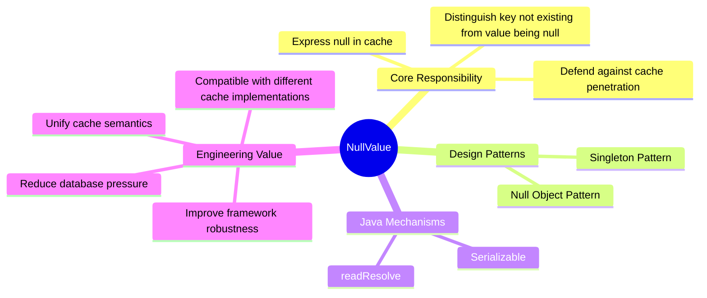

It is not a complex class, but it solves a very real engineering problem.

---

## 14. Comparison: Caching null vs. Not Caching null

| Approach          | Behavior                                    | Pros              | Cons                          |
| ----------------- | ------------------------------------------- | ----------------- | ----------------------------- |
| Don't cache null  | Every query for non-existent data hits database | Simple implementation | Prone to cache penetration   |
| Cache null directly | Try to write null into cache                | Intuitive semantics | Many cache implementations don't support it |
| Cache special string | e.g., store `"NULL"`                        | Simple and crude  | Easily pollutes business semantics |
| Use NullValue     | Use a unified object to represent null       | Clear semantics, framework-friendly | Requires conversion logic    |
| Use Optional      | Cache `Optional.empty()`                    | Clear type semantics | Intrudes on business return type |

The reason Spring Cache chooses `NullValue` is:

> It neither changes the return type of business methods, nor is it compatible with underlying cache implementations, while also maintaining consistency of the cache abstraction.

---

## 15. Complete Call Chain Illustration

Take a `@Cacheable` method as an example:

```java
@Cacheable(cacheNames = "user", key = "#id")
public User getUserById(Long id) {
    return userRepository.findById(id).orElse(null);
}
```

When the user does not exist, the call chain is roughly as follows:

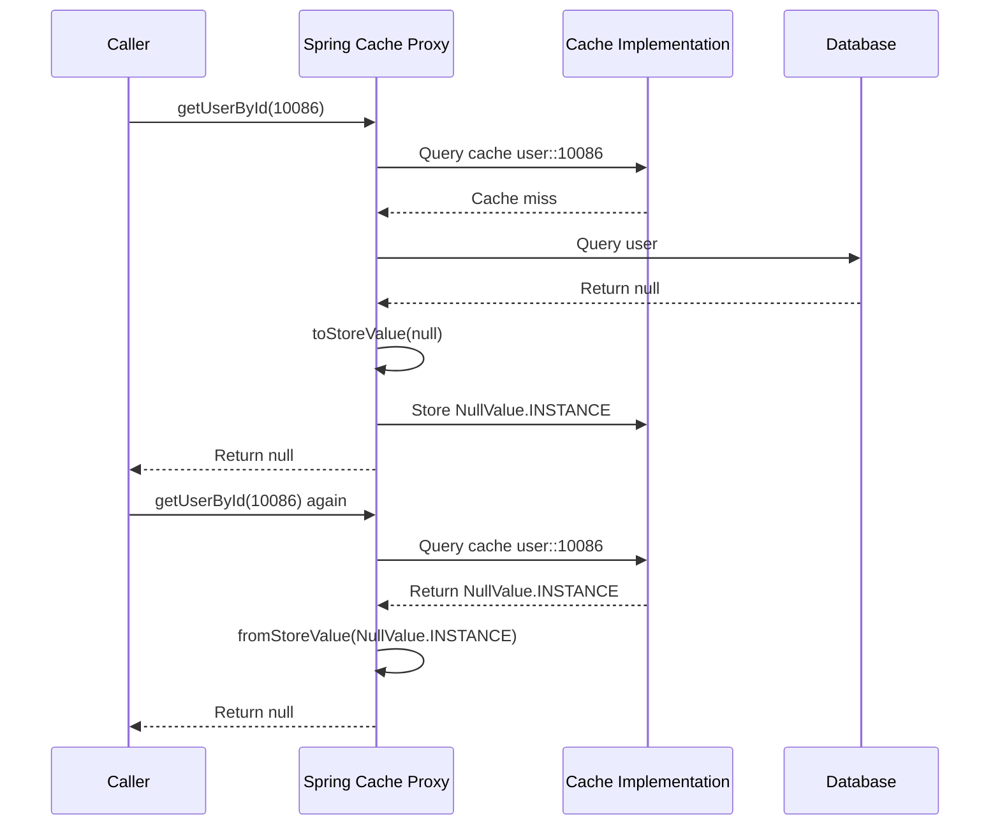

The key point of this chain is:

> What is stored in the cache is `NullValue.INSTANCE`, but what the business method sees is still `null`.

This is the value of the cache abstraction layer.

---

## 16. Engineering Practice: Always Set a Short TTL When Caching null

Although caching null can defend against cache penetration, it also has side effects.

Suppose the first query for `userId = 10086` finds that the user does not exist in the database, so null is cached.

If this user is later created, but the null in the cache has not yet expired, the query will still return null.

This causes short-term data inconsistency.

So in practice, it is generally recommended:

> Null caching can be done, but the TTL should be shorter than normal data.

For example:

| Cache Content       | Recommended TTL              |
| ------------------- | ---------------------------- |
| Normal user data    | 30 minutes                   |
| Null placeholder data | 1 to 5 minutes             |
| Hot data            | Can be appropriately longer  |
| Strongly consistent data | Cache cautiously or actively invalidate |

Diagram:

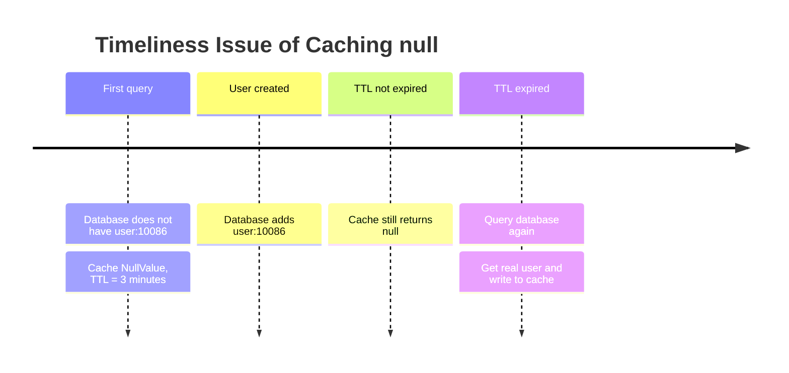

Therefore, the key to caching null is not "whether to cache", but:

> How long to cache, and how to invalidate when data changes.

---

## 17. Relationship with Bloom Filters

There is another common solution for defending against cache penetration: **Bloom filters**.

Bloom filters are typically used to determine whether a key might exist.

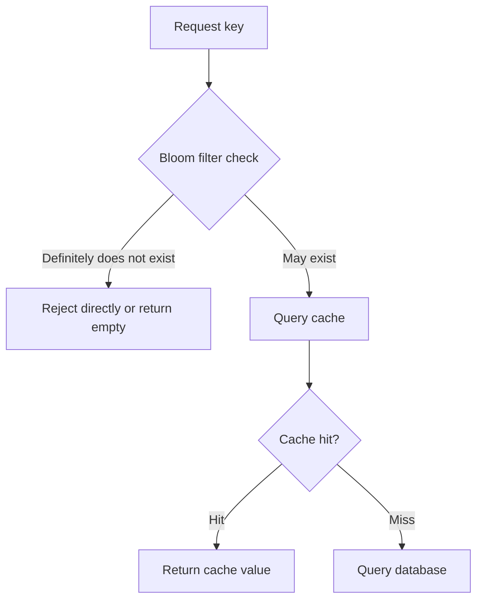

`NullValue` and Bloom filters are not mutually exclusive.

They focus on different things:

| Approach    | Primary Role                                         | Suitable Scenario          |
| ----------- | ---------------------------------------------------- | -------------------------- |
| NullValue   | Cache already-queried non-existent results           | Normal business caching    |
| Bloom filter | Intercept illegal keys before they reach cache/database | Large-scale malicious penetration defense |
| Parameter validation | Intercept obviously illegal requests            | ID format, range validation |
| Rate limiting | Control abnormal traffic                            | High-concurrency protection |

A more robust engineering solution is usually to combine them:

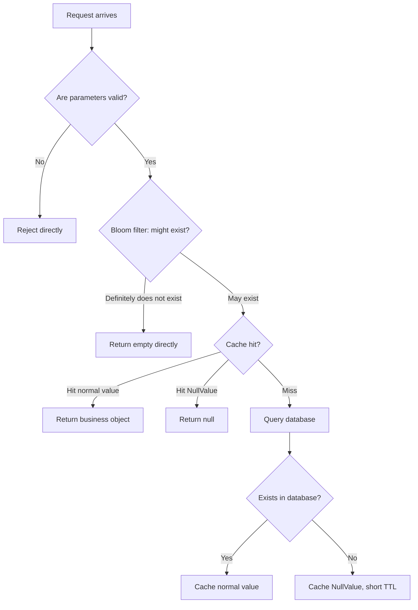

---

## 18. Implement a Simplified NullValue Yourself

Even without using Spring Cache, you can borrow this design.

For example:

```java
import java.io.Serializable;

public final class MyNullValue implements Serializable {

    public static final Object INSTANCE = new MyNullValue();

    private static final long serialVersionUID = 1L;

    private MyNullValue() {
    }

    private Object readResolve() {
        return INSTANCE;
    }

    @Override
    public boolean equals(Object other) {
        return this == other || other == null;
    }

    @Override
    public int hashCode() {
        return MyNullValue.class.hashCode();
    }

    @Override
    public String toString() {
        return "null";
    }
}
```

Then wrap the cache read/write logic:

```java
public class SimpleCacheAdapter {

    private final Map<String, Object> cache = new ConcurrentHashMap<>();

    public void put(String key, Object value) {
        cache.put(key, toStoreValue(value));
    }

    public Object get(String key) {
        Object value = cache.get(key);
        return fromStoreValue(value);
    }

    private Object toStoreValue(Object value) {
        return value == null ? MyNullValue.INSTANCE : value;
    }

    private Object fromStoreValue(Object value) {
        return value == MyNullValue.INSTANCE ? null : value;
    }
}
```

Test it:

```java
SimpleCacheAdapter cache = new SimpleCacheAdapter();

cache.put("user:10086", null);

Object value = cache.get("user:10086");

System.out.println(value); // null
```

What is actually stored in the underlying cache is `MyNullValue.INSTANCE`, but what external callers see is still `null`.

---

## 19. Common Misconceptions

### Misconception 1: Redis Can Store Empty Strings, So NullValue Is Unnecessary

An empty string is not the same as null.

```text
""     represents a real existing empty string
null   represents no value
```

Simply replacing null with an empty string would pollute business semantics.

For example, a username being an empty string and a user not existing are clearly not the same concept.

---

### Misconception 2: Caching null Is Always Good

Caching null can reduce database pressure, but it can also cause short-term data inconsistency.

So you need to control TTL and handle cache invalidation properly when data is created, updated, or deleted.

---

### Misconception 3: NullValue Is a Business Object

`NullValue` should not appear in the business layer.

It should only exist within the cache abstraction layer.

Business code should continue to work with real return values:

```java
User user = userService.getById(id);
```

Not:

```java
Object value = cache.get(key);
if (value == NullValue.INSTANCE) {
    // Business layer handles NullValue
}
```

If the business layer starts being aware of `NullValue`, it means the cache abstraction has leaked.

---

## 20. Interview Perspective: What Can NullValue Assess?

The `NullValue` class is very small, but it can assess many Java fundamentals and engineering capabilities.

| Assessment Point   | Description                                         |
| ------------------ | --------------------------------------------------- |
| Cache penetration  | Why non-existent data also needs to be cached       |
| Cache abstraction  | How to shield differences between underlying caches |
| Null Object pattern | Use a special object to replace null               |
| Singleton pattern  | Globally unique placeholder object                  |
| Java serialization | How `readResolve` ensures singleton                 |
| equals/hashCode    | Object equality and hash semantics                  |
| Engineering trade-offs | Null cache TTL, data consistency, side effects  |

If asked in an interview "How does Spring Cache cache null", you can answer like this:

> Spring Cache does not directly write null to the underlying cache. Instead, it uses `NullValue.INSTANCE` as a placeholder for null. When writing to the cache, `toStoreValue` converts null to `NullValue.INSTANCE`; when reading from the cache, `fromStoreValue` converts `NullValue.INSTANCE` back to null. This both accommodates underlying cache implementations that do not support null and expresses the semantics of "key exists but value is null". `NullValue` itself is a singleton, and through `readResolve` it ensures that it remains the same instance even after deserialization.

---

## 21. Summary

`NullValue` is a very small but highly representative design in Spring Cache.

The problem it solves is not complex:

> How to express null in a cache that does not support null?

But its solution is very engineering-oriented:


Its core value can be summarized in four points:

1. **Use the Null Object pattern to express null semantics**
   Instead of directly storing `null`, store a special placeholder object.

2. **Use the Singleton pattern to reduce cost**
   All null cache values reuse the same `NullValue.INSTANCE`.

3. **Use readResolve to ensure serialization safety**
   Even after serialization and deserialization through a distributed cache, it can be restored to the same singleton object.

4. **Use cache abstraction to shield underlying differences**
   The business layer still faces `null`, while the underlying cache stores identifiable placeholder values.

The excellence of `NullValue` lies not in code complexity, but in encapsulating an error-prone boundary problem in a way that is stable, clear, and reliable enough.

This is exactly what excellent framework code is worth learning from:

> Good design often does not make the problem more complex, but hides the complexity in the right place.
