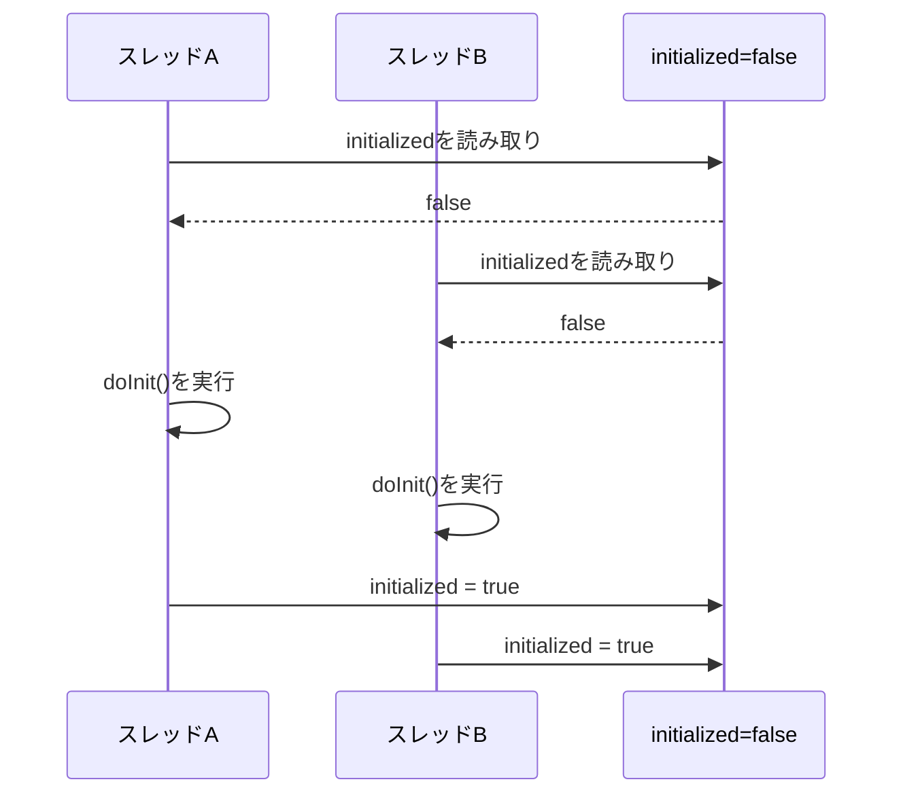
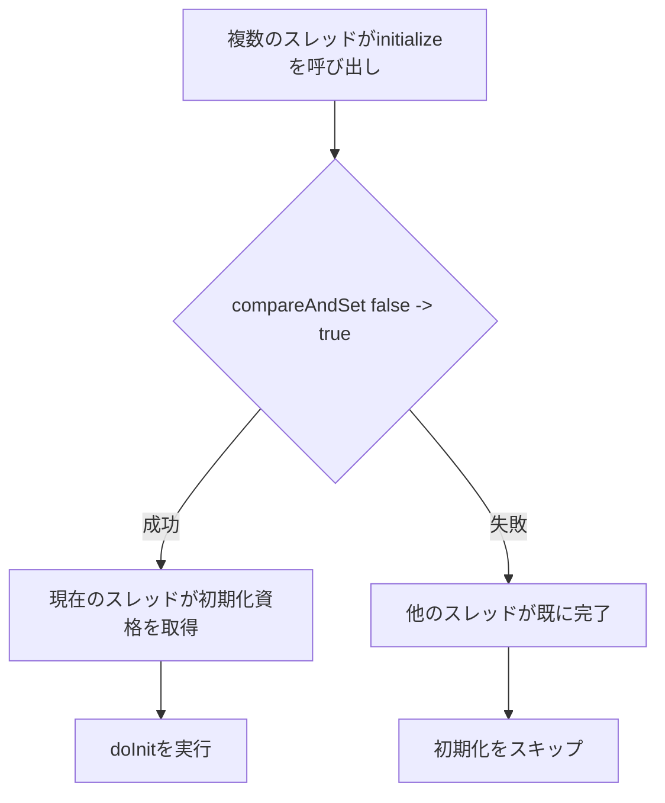
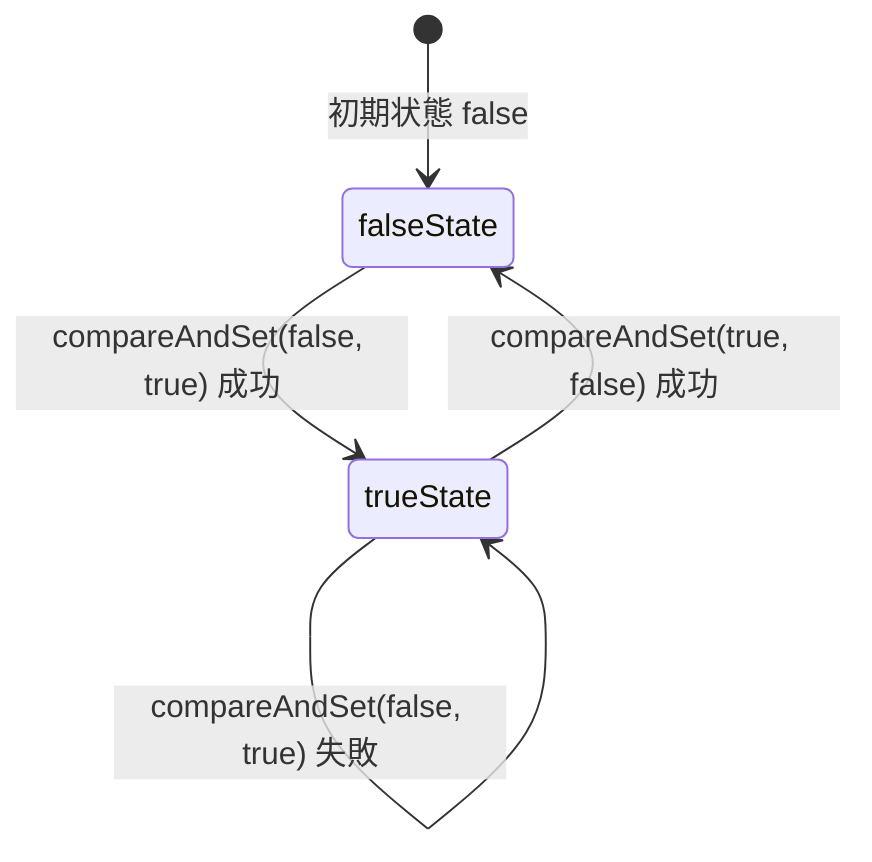
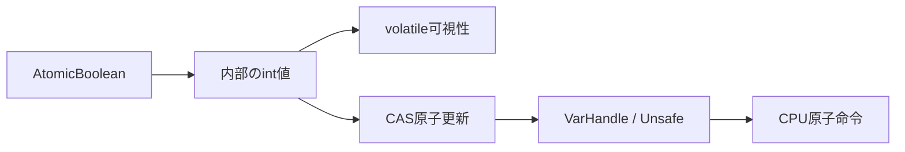
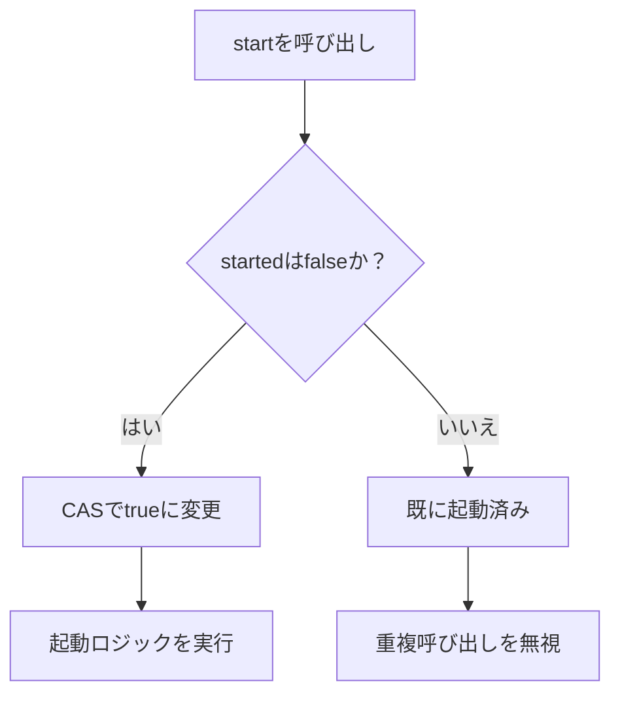
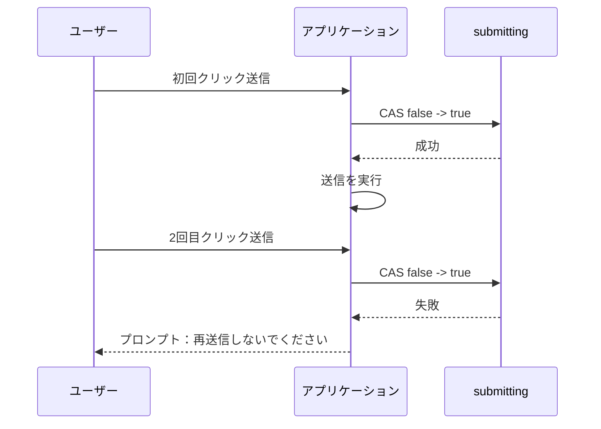
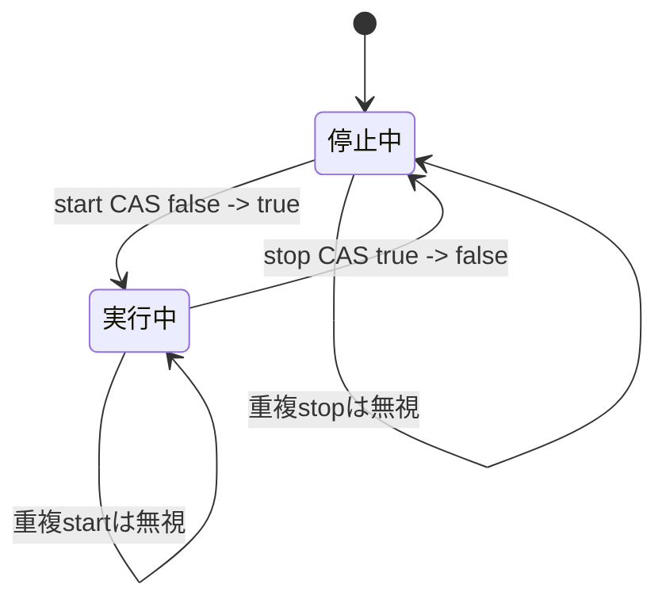
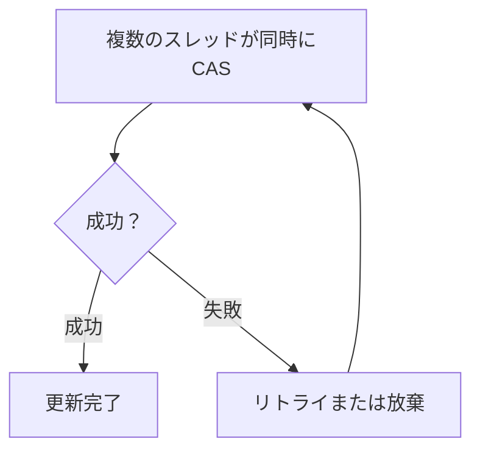
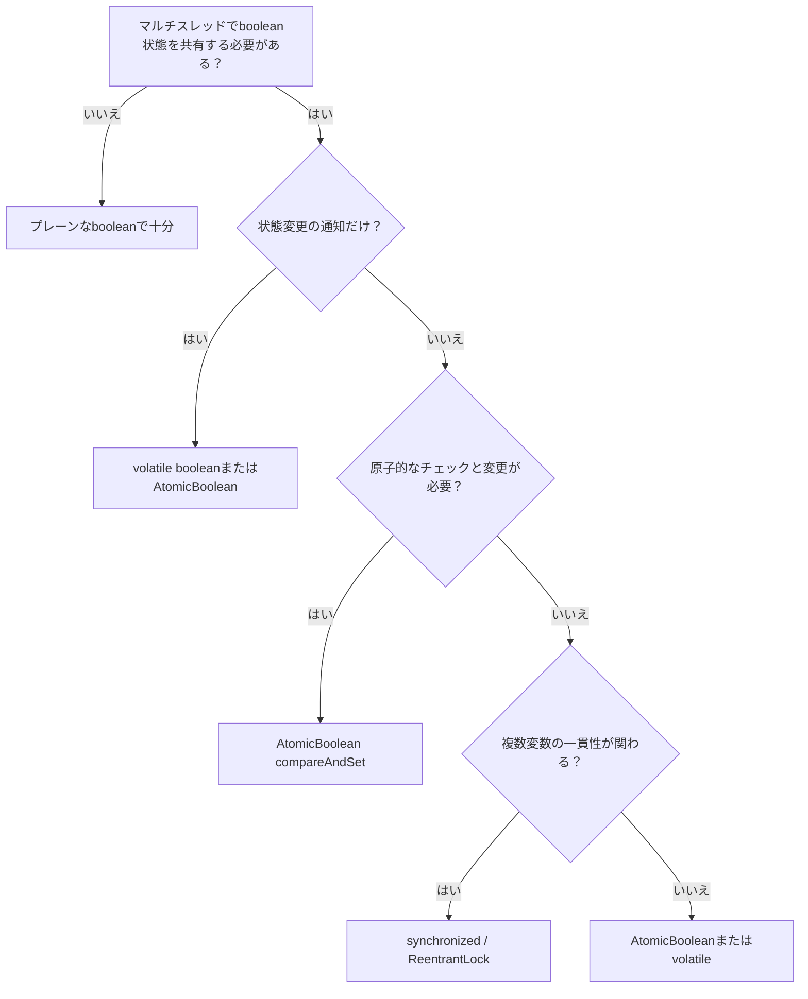

## 1. はじめに：なぜ単純なbooleanに並行性の問題が起きるのか？

Javaのマルチスレッドプログラミングでは、プログラムの流れを制御するためにシンプルなステータスフラグが必要になることがよくあります。例えば：

* 初期化が完了したかどうか
* タスクがキャンセルされたかどうか
* スイッチがオンになったかどうか
* 特定のロジックを一度だけ実行すべきかどうか
* サービスが起動中かシャットダウン中か

単一スレッド環境では、単純な`boolean`フィールドで十分です。

```java
private boolean initialized = false;
```

しかし、マルチスレッド環境に入ると、事態はそう単純ではありません。

一見普通の`boolean`が、同時に3つの並行性の問題を引き起こす可能性があります：

| 問題 | 意味 | 結果 |
| ----- | --------------------- | ---------------- |
| 可視性 | あるスレッドが変数を変更しても、他のスレッドがすぐに見られない可能性がある | スレッドが古い値を読み取る |
| 原子性 | チェックと変更が不可分な全体ではない | 複数のスレッドが同時にチェックを通過する |
| 順序性 | CPUやコンパイラが命令を並べ替える可能性がある | 実行順序がコードの順序と異なる |

`AtomicBoolean`は、まさにJava並行パッケージでこのような「共有boolean状態」の問題を解決するために設計された軽量ツールです。

---

## 2. 並行性の落とし穴：なぜ単純なbooleanでは不十分なのか？

非常に一般的な初期化の例を考えてみましょう。

```java
public class UnsafeInit {

    private boolean initialized = false;

    public void initialize() {
        if (!initialized) {
            // 時間のかかる初期化処理を実行
            doInit();

            initialized = true;
        }
    }

    private void doInit() {
        System.out.println("init...");
    }
}
```

このコードは単一スレッドでは正常に動作しますが、マルチスレッド下では古典的な競合状態があります。

### 2.1 Check-Then-Act競合状態

**Check-Then-Act**とは、まず状態をチェックし、その結果に基づいて行動することを意味します。

```java
if (!initialized) {
    doInit();
    initialized = true;
}
```

問題は：

> `if (!initialized)`と`initialized = true`は原子操作ではありません。

複数のスレッドが同時に`initialized == false`を見て、すべて初期化ロジックに入る可能性があります。



結果：初期化ロジックが複数回実行されます。

---

## 3. volatileはこの問題を解決できるか？

多くの人はフィールドを`volatile`に変更することを思いつくでしょう。

```java
public class VolatileInit {

    private volatile boolean initialized = false;

    public void initialize() {
        if (!initialized) {
            doInit();
            initialized = true;
        }
    }

    private void doInit() {
        System.out.println("init...");
    }
}
```

`volatile`は以下を保証します：

* スレッドが変数を変更した後、他のスレッドができるだけ早く見られるようにする
* 特定の命令の並べ替えを禁止する
* 読み書きにvolatileセマンティクスを持つ

しかし、複合操作の原子性は保証できません。

つまり：

```java
if (!initialized) {
    initialized = true;
}
```

は依然として不可分な全体ではありません。

### 3.1 volatileとAtomicBooleanの比較

| 機能 | volatile boolean | AtomicBoolean |
| ------------- | ---------------: | ------------: |
| 可視性保証 | あり | あり |
| 単一読み書きの原子性 | あり | あり |
| 「チェックしてから変更」の原子性 | なし | あり |
| CASサポート | なし | あり |
| 一回限りの状態切替に適する | 不適 | 適 |
| 複雑なクリティカルセクション保護に適する | 不適 | 不適 |

したがって、`volatile boolean`は「状態通知」には適していますが、「先取り状態遷移」には適していません。

---

## 4. synchronizedでも解決できるが、最適とは限らない

`synchronized`を使用すると、一度に1つのスレッドしかメソッドに入れないことを保証します。

```java
public class SafeInit {

    private boolean initialized = false;

    public synchronized void initialize() {
        if (!initialized) {
            doInit();
            initialized = true;
        }
    }

    private void doInit() {
        System.out.println("init...");
    }
}
```

これは確かに正しいです。

しかし、単純なbooleanステータスビットを保護したいだけの場合、ロックを使うのは少し重く感じるかもしれません。

現代のJVMは`synchronized`を大幅に最適化しており、必ずしも「遅い」わけではありません。本当の問題は：

> 単純な状態遷移が必要なだけの場合、ロックを使うとソリューションが不必要に複雑になる。

この場合、`AtomicBoolean`はより軽量で、セマンティクスに合った選択肢です。

---

## 5. AtomicBooleanとは何か？

`AtomicBoolean`はJava並行パッケージにあります：

```java
java.util.concurrent.atomic.AtomicBoolean
```

原子的に更新できるboolean値を表します。

典型的な使用法：

```java
import java.util.concurrent.atomic.AtomicBoolean;

public class AtomicInit {

    private final AtomicBoolean initialized = new AtomicBoolean(false);

    public void initialize() {
        if (initialized.compareAndSet(false, true)) {
            doInit();
        }
    }

    private void doInit() {
        System.out.println("init...");
    }
}
```

このコードの核心は：

```java
initialized.compareAndSet(false, true)
```

これは以下を意味します：

> 現在の値がまだ`false`の場合のみ、値を`true`に変更する。成功すれば`true`を返し、失敗すれば`false`を返す。

複数のスレッドが同時に実行すると、1つのスレッドだけがこの状態遷移を成功させることができます。



---

## 6. 基礎となる考え方：CAS

`AtomicBoolean`の核心的な能力はCASに由来します。

CASは以下の略称です：

> Compare-And-Swap。

これは原子操作として理解できます：

```text
現在の値 == 期待値の場合：
    新しい値に更新
それ以外の場合：
    更新しない
```

`AtomicBoolean`にマッピング：

```java
compareAndSet(expectedValue, newValue)
```

例えば：

```java
flag.compareAndSet(false, true);
```

意味：

```text
flagが現在falseの場合、trueに変更する。
それ以外の場合は何もしない。
```

比較と変更のプロセス全体が原子的であり、他のスレッドが割り込むことはありません。

### 6.1 CAS状態遷移図



---

## 7. ソースコードの観点：なぜAtomicBooleanはbooleanにintを使うのか？

JDKでは、`AtomicBoolean`は直接プレーンな`boolean`を使って原子操作を行うのではなく、整数値を使ってboolean状態を表現します。

抽象的には以下のように理解できます：

```java
private volatile int value;
```

ここで：

```text
0 は false を表す
1 は true を表す
```

理由は、基礎となるCPUのCAS命令が通常、整数や参照型に対してより簡単に操作できるためです。

Java 9以降、JDKは`VarHandle`を広く使用して原子アクセスとメモリセマンティクス制御を行っています。以前のバージョンでは主に`Unsafe`に依存していました。



次のように理解できます：

> `AtomicBoolean`はJavaレベルで提供される高レベルの並行ツールであり、基盤ではJVMとCPUの原子能力に依存している。

---

## 8. AtomicBooleanメソッドガイド

### 8.1 get()

現在の値を読み取る。

```java
boolean current = flag.get();
```

現在の状態をチェックするのに適しています。

```java
if (running.get()) {
    System.out.println("サービス実行中");
}
```

---

### 8.2 set(boolean newValue)

新しい値を設定する。

```java
flag.set(true);
```

`set`はvolatile書き込みセマンティクスを持ち、他のスレッドはこの変更を見ることができます。

通常の状態公開に適しています。

```java
shutdown.set(true);
```

---

### 8.3 compareAndSet(boolean expectedValue, boolean newValue)

これは`AtomicBoolean`の最も核心的なメソッドです。

```java
boolean success = flag.compareAndSet(false, true);
```

一回限りのアクションに適しています。

```java
public class OnceTask {

    private final AtomicBoolean executed = new AtomicBoolean(false);

    public void runOnce() {
        if (executed.compareAndSet(false, true)) {
            System.out.println("一度だけ実行");
        }
    }
}
```

---

### 8.4 getAndSet(boolean newValue)

原子的に新しい値を設定し、古い値を返す。

```java
boolean oldValue = flag.getAndSet(true);
```

「先取りして前の状態を知る」シナリオに適しています。

```java
public class Worker {

    private final AtomicBoolean busy = new AtomicBoolean(false);

    public void work() {
        boolean wasBusy = busy.getAndSet(true);

        if (wasBusy) {
            System.out.println("タスクは既に実行中");
            return;
        }

        try {
            System.out.println("タスク開始");
        } finally {
            busy.set(false);
        }
    }
}
```

---

### 8.5 lazySet(boolean newValue)

`lazySet`は`set`よりも弱い可視性要件で新しい値を設定します。

```java
flag.lazySet(false);
```

「最終的に見えればよい」シナリオに適しています。例えば、状態リセットやオブジェクトリサイクルマーカーなど。

ただし、通常のビジネス開発では明確さのために`set`を優先してください。

---

### 8.6 weakCompareAndSetメソッド群

`weakCompareAndSet`はCASの弱化版です。

特徴：

* 同様にCASを試みる
* 偽の失敗（spurious failure）の可能性がある
* 通常はループリトライと組み合わせて使用
* 通常のビジネスコードでは直接使用されることは稀

一般的には以下を優先：

```java
compareAndSet(expectedValue, newValue)
```

weak CASよりも優先してください。

---

## 9. メソッド比較表

| メソッド | 用途 | 原子性 | 典型的なシナリオ |
| ------------------------------- | --------- | ---: | ---------- |
| `get()` | 現在の値を取得 | あり | 状態チェック |
| `set(value)` | 新しい値を設定 | あり | 状態公開 |
| `lazySet(value)` | 遅延設定 | あり | 結果整合性のある状態更新 |
| `compareAndSet(expect, update)` | 期待値と一致時に更新 | あり | 状態先取り、一回限りの実行 |
| `getAndSet(value)` | 新しい値を設定し古い値を返す | あり | 実行権の先取り、状態交換 |
| `weakCompareAndSet(...)` | 弱CAS | あり | 低レベル最適化、ループリトライ |

---

## 10. 典型的なユースケース

### 10.1 タスクを一度だけ実行

```java
public class StartOnceService {

    private final AtomicBoolean started = new AtomicBoolean(false);

    public void start() {
        if (!started.compareAndSet(false, true)) {
            System.out.println("サービスは既に開始済み、重複起動を無視");
            return;
        }

        System.out.println("サービス起動中...");
    }
}
```

状態フロー：



---

### 10.2 タスクキャンセルフラグ

```java
public class CancelableTask implements Runnable {

    private final AtomicBoolean cancelled = new AtomicBoolean(false);

    public void cancel() {
        cancelled.set(true);
    }

    @Override
    public void run() {
        while (!cancelled.get()) {
            // タスクを実行
            doWork();
        }

        System.out.println("タスクがキャンセルされました");
    }

    private void doWork() {
        System.out.println("working...");
    }
}
```

このシナリオでは、`AtomicBoolean`はスレッド間の状態通知として機能します。

もちろん、単純な通知の場合は`volatile boolean`でも機能します。

---

### 10.3 重複送信の防止

```java
public class SubmitGuard {

    private final AtomicBoolean submitting = new AtomicBoolean(false);

    public void submit() {
        if (!submitting.compareAndSet(false, true)) {
            System.out.println("送信中です、もう一度クリックしないでください");
            return;
        }

        try {
            System.out.println("リクエストを送信中...");
        } finally {
            submitting.set(false);
        }
    }
}
```

このパターンは重複トリガーの防止に優れています。



---

### 10.4 サービスライフサイクル制御

```java
public class LifecycleService {

    private final AtomicBoolean running = new AtomicBoolean(false);

    public void start() {
        if (running.compareAndSet(false, true)) {
            System.out.println("サービス起動完了");
        }
    }

    public void stop() {
        if (running.compareAndSet(true, false)) {
            System.out.println("サービス停止完了");
        }
    }

    public boolean isRunning() {
        return running.get();
    }
}
```

状態機：



---

## 11. AtomicBooleanとsynchronized：どちらを選ぶか？

### 11.1 AtomicBooleanに適したシナリオ

| シナリオ | 適しているか？ |
| ----------- | ---: |
| 一回限りの実行制御 | 適 |
| 単純なオン/オフ状態 | 適 |
| タスクキャンセルフラグ | 適 |
| サービス起動/停止状態 | 適 |
| 重複送信防止 | 適 |
| 単純な状態機遷移 | 適 |

### 11.2 AtomicBooleanに適さないシナリオ

| シナリオ | 理由 |
| ------------ | ------------------------------------------------ |
| 多変数の一貫性 | AtomicBooleanは1つのboolean状態しか保護しない |
| 複雑なクリティカルセクションロジック | ロックの方が明確 |
| 待機と通知が必要 | `wait/notify`、`Condition`、`CountDownLatch`などを使用 |
| 公平性が必要 | CASは公平性を保証しない |
| 高競合下での連続スピン | CPUを浪費する可能性 |

例えば、このシナリオは`AtomicBoolean`だけでは不適切です：

```java
if (flag.compareAndSet(false, true)) {
    balance = balance - amount;
    count++;
    log.add(record);
}
```

これは複数の共有変数の一貫性に関わります。追加の保護がなければ、並行性の問題が発生する可能性があります。

より適切なアプローチ：

```java
synchronized (this) {
    balance = balance - amount;
    count++;
    log.add(record);
}
```

---

## 12. よくある誤解

### 12.1 誤解1：AtomicBooleanはすべてのロックを置き換えられる

いいえ。

`AtomicBoolean`は単純な状態ビット用であり、複雑なビジネスクリティカルセクションを保護するためのものではありません。

複数の変数間の一貫性を維持する必要がある場合、ロックの方が明確で安全です。

---

### 12.2 誤解2：CASは常にsynchronizedより速い

必ずしもそうではありません。

低競合では、CASは通常軽量です。

しかし、高競合では、多くのスレッドがCASに連続して失敗し、CPUスピンを引き起こす可能性があります。



失敗後に連続スピンすると、大量のCPUを消費します。

したがって、CASの利点は：

> 低競合、単純な状態更新、失敗時の迅速な復帰または限定リトライ。

---

### 12.3 誤解3：AtomicBooleanはすべての可視性の問題を解決する

`AtomicBoolean`自身の読み書きにはメモリセマンティクスがありますが、他のプレーン変数のスレッドセーフティを自動的に保証するわけではありません。

例えば：

```java
private String data;
private final AtomicBoolean ready = new AtomicBoolean(false);

public void write() {
    data = "hello";
    ready.set(true);
}

public void read() {
    if (ready.get()) {
        System.out.println(data);
    }
}
```

このような公開シナリオは通常機能しますが、ビジネスがより複雑な場合は、変数の公開、オブジェクトのエスケープ、メモリ可視性を慎重に分析する必要があります。

---

## 13. 実践的なベストプラクティス

### 13.1 AtomicBooleanフィールドにはfinalを使用

推奨：

```java
private final AtomicBoolean running = new AtomicBoolean(false);
```

非推奨：

```java
private AtomicBoolean running = new AtomicBoolean(false);
```

原子オブジェクト自体が置き換えられることを望まないためです。

---

### 13.2 状態遷移にはcompareAndSetを優先

セマンティクスが「現在の状態が条件を満たす場合のみ変更」なら、優先：

```java
compareAndSet(expectedValue, newValue)
```

次のように書かないでください：

```java
if (!flag.get()) {
    flag.set(true);
}
```

後者は依然としてCheck-Then-Actであり、全体の原子性がありません。

---

### 13.3 finallyで状態を復元

`AtomicBoolean`を「現在実行中」の制御に使用する場合、例外回復を常に考慮してください。

推奨：

```java
if (!running.compareAndSet(false, true)) {
    return;
}

try {
    doWork();
} finally {
    running.set(false);
}
```

そうしないと、`doWork()`が例外をスローした場合、状態が永遠に`true`のままになる可能性があります。

---

### 13.4 ロックフリーを過度に追求しない

ロックフリーは目的ではなく、正確性と保守性が目的です。

ビジネスロジックが複雑な場合、`synchronized`や`ReentrantLock`の方が正しく実装しやすいかもしれません。

---

## 14. AtomicBoolean意思決定フローチャート



---

## 15. 完全な例：繰り返し起動・停止可能なサービス

```java
import java.util.concurrent.atomic.AtomicBoolean;

public class DemoService {

    private final AtomicBoolean running = new AtomicBoolean(false);

    public void start() {
        if (!running.compareAndSet(false, true)) {
            System.out.println("サービスは既に実行中、再度起動する必要はありません");
            return;
        }

        System.out.println("サービス起動成功");
    }

    public void stop() {
        if (!running.compareAndSet(true, false)) {
            System.out.println("サービスは実行中ではありません、停止する必要はありません");
            return;
        }

        System.out.println("サービス停止成功");
    }

    public boolean isRunning() {
        return running.get();
    }

    public static void main(String[] args) {
        DemoService service = new DemoService();

        service.start();
        service.start();

        service.stop();
        service.stop();
    }
}
```

出力：

```text
サービス起動成功
サービスは既に実行中、再度起動する必要はありません
サービス停止成功
サービスは実行中ではありません、停止する必要はありません
```

この例は`AtomicBoolean`の典型的な価値を示しています：

> 単にtrueまたはfalseを格納するだけでなく、状態遷移を原子的に管理する。

---

## 16. まとめ

`AtomicBoolean`はJava並行ツールキットの小さくとも実用的なコンポーネントです。

以下の表現に適しています：

* 一回限りの実行
* オン/オフ状態のスイッチ
* キャンセルフラグ
* ライフサイクル制御
* 重複送信防止
* 単純な状態機遷移

核心的な能力はCASに由来します：

```java
compareAndSet(expectedValue, newValue)
```

これにより、ロックなしで原子的な状態切替が可能になります。

しかし、`AtomicBoolean`は万能ではありません。

| 結論 | 説明 |
| ------- | ---------------------- |
| 単純な状態ビット | AtomicBooleanを優先 |
| 純粋な可視性通知 | volatile booleanでも可 |
| 多変数の一貫性 | synchronizedまたはLockを使用 |
| 複雑な並行調整 | より適切なJUCツールを使用 |
| 高競合シナリオ | CAS失敗とCPUスピンに注意 |

一言でまとめると：

> `AtomicBoolean`は「1つのboolean状態、複数のスレッドが変更を競合する」問題を解決するのに最適。

非常に小さなコストで、明確で信頼性の高いロックフリー状態管理を実現できます。