# AutoCloseable 随筆：Java リソース管理のエレガントな解法

Java 開発において、手動で解放する必要がある様々なリソースに頻繁に触れます：

- ファイルストリーム：`FileInputStream`、`BufferedReader`
- ネットワーク接続：`Socket`
- データベース接続：`Connection`、`Statement`、`ResultSet`
- 分散リソース：Redis 接続、MQ 接続、ロックリソース
- カスタムリソース：一時ファイル、スレッドプールラッパー、ビジネスコンテキスト

これらのリソースには共通点があります：**JVM メモリを占有するだけでなく、OS や外部システムのリソースも占有する可能性があります**。

リソースが適切に解放されないと、メモリリークや接続リークが発生し、深刻な場合はファイルハンドルの枯渇、データベース接続プールの飽和、本番サービスの停止を引き起こす可能性があります。

Java 7 で導入された `AutoCloseable` と `try-with-resources` はまさにこの問題を解決するためのものです。

---

## 一、なぜ通常の try-finally では不十分なのか？

Java 7 より前では、リソースのクローズは通常 `try-finally` に依存していました。

例えば、ファイルを読み取る場合：

```java
import java.io.FileInputStream;
import java.io.IOException;

public class UnsafeFileReadDemo {

    public static void main(String[] args) {
        FileInputStream fis = null;

        try {
            fis = new FileInputStream("data.txt");

            int data = fis.read();
            System.out.println(data);

        } catch (IOException e) {
            e.printStackTrace();

        } finally {
            if (fis != null) {
                try {
                    fis.close();
                } catch (IOException closeException) {
                    closeException.printStackTrace();
                }
            }
        }
    }
}
````

このコードは一見問題なさそうに見えますが、実際にはいくつかの明らかな欠点があります。

| 問題       | 説明                         |
| -------- | -------------------------- |
| コードが冗長     | 本来のビジネスロジックは数行だが、リソースクローズコードが大部分を占める   |
| 見落としやすい     | 開発者が `finally` を書き忘れたり、null チェックを忘れたりする可能性がある |
| ネストが複雑     | `close()` 自体も例外をスローする可能性があり、再度キャッチが必要  |
| 例外のマスク     | `finally` 内の例外がビジネス例外を上書きする可能性がある     |
| 複数リソース场景はさらに混乱 | 複数のリソースを逆順でクローズする必要があり、コードの複雑さが急激に上昇する    |

---

## 二、従来のリソースクローズフロー

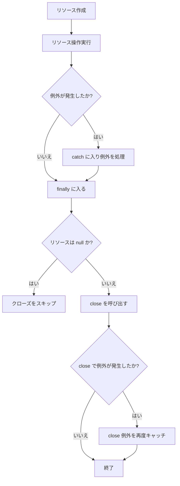

従来の書き方の核心的な問題は：**リソース管理ロジックがビジネスコードに侵入している**ことです。

コードが複雑になればなるほど、エラーが起きやすくなります。

---

## 三、AutoCloseable とは何か？

`AutoCloseable` は Java 7 で導入されたインターフェースで、`java.lang` パッケージにあります。

その定義は非常にシンプルです：

```java
public interface AutoCloseable {
    void close() throws Exception;
}
```

クラスが `AutoCloseable` を実装すれば、そのオブジェクトは `try-with-resources` 文に入れることができ、Java が自動的に `close()` メソッドを呼び出します。

---

## 四、AutoCloseable の核心的な位置づけ

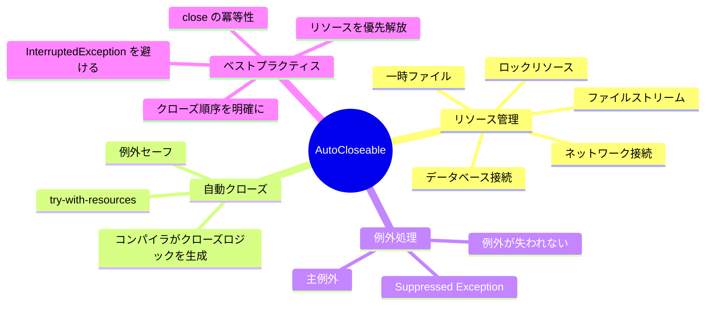

`AutoCloseable` 自体は複雑ではありません。本当に強力なのは `try-with-resources` との組み合わせです。

---

## 五、try-with-resources：モダン Java のリソース管理方法

`try-with-resources` を使用すると、コードは次のように簡素化できます：

```java
import java.io.FileInputStream;
import java.io.IOException;

public class SafeFileReadDemo {

    public static void main(String[] args) {
        try (FileInputStream fis = new FileInputStream("data.txt")) {
            int data = fis.read();
            System.out.println(data);
        } catch (IOException e) {
            e.printStackTrace();
        }
    }
}
```

手動で `finally` を書く必要がなく、明示的に `fis.close()` を呼び出す必要もありません。

`try` コードブロックの実行が終了すると、正常終了でも例外による終了でも、リソースは自動的にクローズされます。

---

## 六、try-with-resources の実行フロー

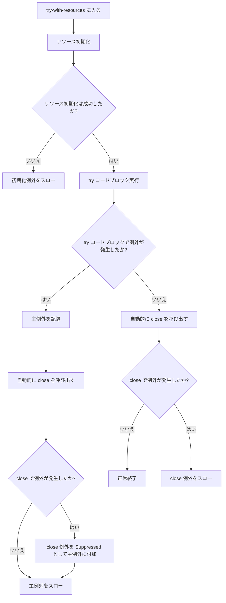

核心的な結論：

> `try-with-resources` は自動的にリソースをクローズし、ビジネス例外とクローズ例外の両方を保持でき、元の例外を単純に上書きすることはありません。

---

## 七、複数リソース场景：クローズ順序は逆順

`try-with-resources` は複数のリソースの宣言をサポートしています。

```java
try (
    ResourceA a = new ResourceA();
    ResourceB b = new ResourceB();
    ResourceC c = new ResourceC()
) {
    System.out.println("use resources");
}
```

リソースのクローズ順序は：

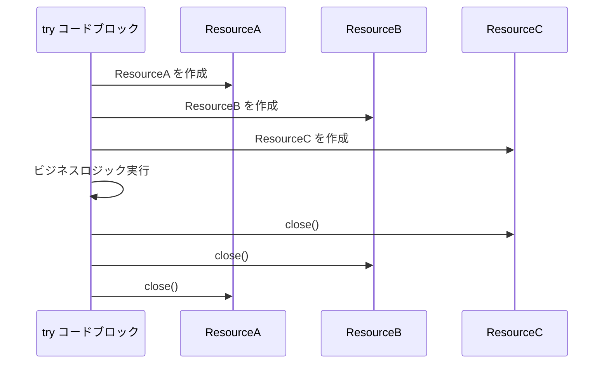

つまり：

> リソースは宣言順に作成され、宣言順の逆順でクローズされます。

これはスタック構造と一致します：**後で作成されたリソースが、先にクローズされます**。

---

## 八、なぜクローズ順序は逆順なのか？

ラッパーストリームがあると仮定します：

```java
try (
    FileInputStream fis = new FileInputStream("data.txt");
    BufferedInputStream bis = new BufferedInputStream(fis)
) {
    int data = bis.read();
}
```

ここで `bis` は `fis` に依存しています。

もし先に `fis` をクローズしてから `bis` をクローズすると、`bis` がクローズ時に内部状態を正しくフラッシュまたは処理できない可能性があります。

したがって、正しい順序は：

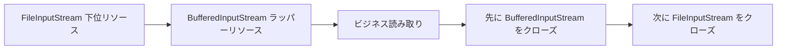

これが `try-with-resources` が自動的に逆順クローズを採用する理由です。

---

## 九、例外マスク問題：try-finally の隠れた罠

従来の `try-finally` の問題を見てみましょう。

```java
public class FinallyExceptionDemo {

    public static void main(String[] args) throws Exception {
        try {
            throw new Exception("ビジネス例外");
        } finally {
            throw new Exception("クローズ例外");
        }
    }
}
```

最終的にスローされる例外は：

```text
Exception in thread "main" java.lang.Exception: クローズ例外
```

本当に重要な「ビジネス例外」が上書きされました。

これが例外マスクです。

---

## 十、try-with-resources は例外マスクをどう解決するか？

`try-with-resources` は `try` ブロック内の例外を主例外とし、`close()` 内の例外を抑制例外として扱います。

例：

```java
class MyResource implements AutoCloseable {

    public void work() throws Exception {
        System.out.println("Resource working...");
        throw new Exception("Exception from work()");
    }

    @Override
    public void close() throws Exception {
        System.out.println("Resource closing...");
        throw new Exception("Exception from close()");
    }
}

public class SuppressedExceptionDemo {

    public static void main(String[] args) {
        try (MyResource resource = new MyResource()) {
            resource.work();
        } catch (Exception e) {
            System.out.println("Main exception: " + e.getMessage());

            for (Throwable suppressed : e.getSuppressed()) {
                System.out.println("Suppressed exception: " + suppressed.getMessage());
            }
        }
    }
}
```

出力結果：

```text
Resource working...
Resource closing...
Main exception: Exception from work()
Suppressed exception: Exception from close()
```

例外の関係は以下の通り：

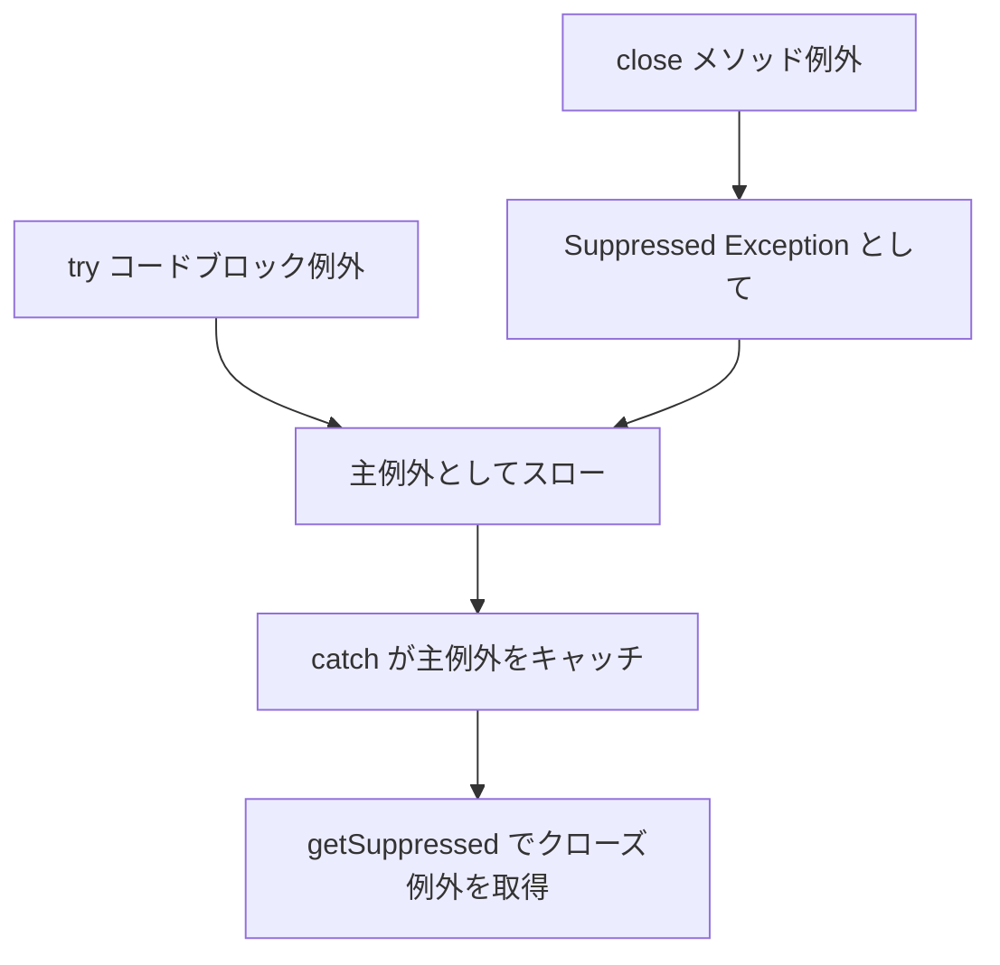

これは従来の `try-finally` よりも安全で、重要な例外情報を失いません。

---

## 十一、AutoCloseable と Closeable の関係

Java にはもう一つの一般的なインターフェースがあります：`java.io.Closeable`。

`AutoCloseable` との関係は以下の通り：

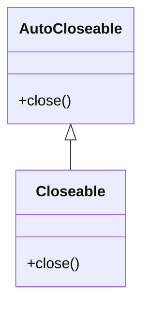

`Closeable` は `AutoCloseable` を継承しています。

ソースコードの形式は概ね以下の通り：

```java
public interface Closeable extends AutoCloseable {
    void close() throws IOException;
}
```

---

## 十二、AutoCloseable vs Closeable

| 比較項      | AutoCloseable      | Closeable             |
| -------- | ------------------ | --------------------- |
| 所属パッケージ      | `java.lang`        | `java.io`             |
| 導入バージョン     | Java 7             | Java 5                |
| 適用範囲     | 汎用リソース               | I/O リソース                |
| close 例外 | `throws Exception` | `throws IOException`  |
| 継承関係   | 親インターフェース                | 子インターフェース                   |
| 冪等性の要求     | 冪等性を推奨               | 冪等性を要求                  |
| 典型的な実装     | JDBC 接続、ビジネスリソース、ロックラッパー  | 入力ストリーム、出力ストリーム、Reader、Writer |

まとめ：

> `AutoCloseable` はより汎用的なリソースクローズプロトコルであり、`Closeable` は I/O シナリオでの特化版です。

---

## 十三、どのクラスが AutoCloseable を実装しているか？

一般的な実装には以下が含まれます：

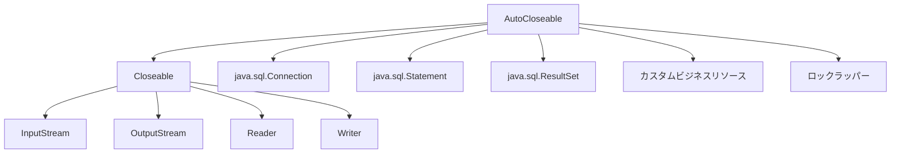

一般的なリソースの例：

| タイプ      | 例                              |
| ------- | ------------------------------- |
| ファイル入力    | `FileInputStream`               |
| ファイル出力    | `FileOutputStream`              |
| 文字読み取り    | `BufferedReader`                |
| 文字書き込み    | `BufferedWriter`                |
| データベース接続   | `Connection`                    |
| SQL 実行器 | `Statement`、`PreparedStatement` |
| クエリ結果セット   | `ResultSet`                     |
| ネットワークリソース    | `Socket`                        |
| カスタムリソース   | `AutoCloseable` を実装したビジネスクラス         |

---

## 十四、JDBC での典型的な使い方

従来の JDBC コードで `try-with-resources` を使用しない場合、接続リークが発生しやすいです。

推奨される書き方は以下の通り：

```java
import java.sql.Connection;
import java.sql.DriverManager;
import java.sql.PreparedStatement;
import java.sql.ResultSet;

public class JdbcDemo {

    public static void main(String[] args) throws Exception {
        String url = "jdbc:mysql://localhost:3306/test";
        String username = "root";
        String password = "123456";

        String sql = "select id, name from user where id = ?";

        try (
            Connection connection = DriverManager.getConnection(url, username, password);
            PreparedStatement statement = connection.prepareStatement(sql)
        ) {
            statement.setLong(1, 1L);

            try (ResultSet resultSet = statement.executeQuery()) {
                while (resultSet.next()) {
                    Long id = resultSet.getLong("id");
                    String name = resultSet.getString("name");

                    System.out.println(id + " - " + name);
                }
            }
        }
    }
}
```

リソースのクローズ順序：

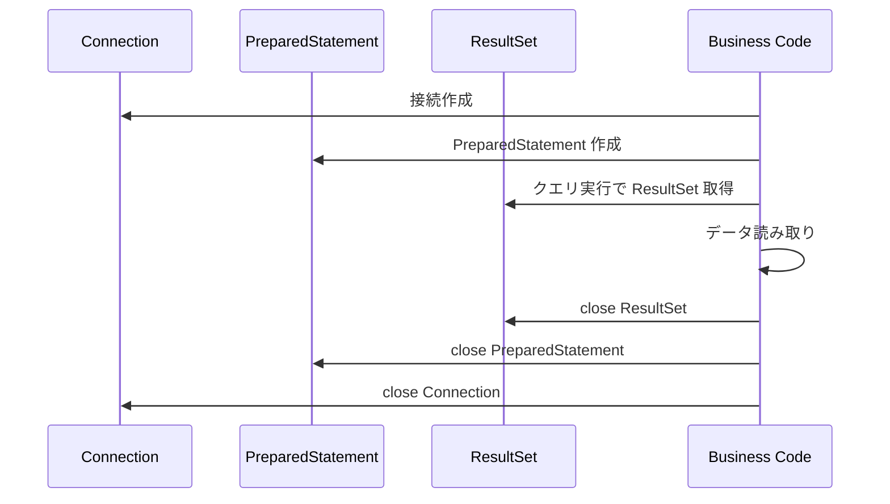

このようなコードは `try-with-resources` の使用に特に適しています。JDBC リソースには明確な階層依存関係があるからです。

---

## 十五、カスタム AutoCloseable リソース

実際のビジネスでは、自分で `AutoCloseable` を実装することもできます。

例えば、一時ディレクトリをカプセル化する場合：

```java
import java.io.IOException;
import java.nio.file.Files;
import java.nio.file.Path;

public class TempDirectory implements AutoCloseable {

    private final Path path;

    public TempDirectory() throws IOException {
        this.path = Files.createTempDirectory("demo-");
    }

    public Path getPath() {
        return path;
    }

    @Override
    public void close() throws IOException {
        Files.deleteIfExists(path);
        System.out.println("Temp directory deleted: " + path);
    }
}
```

使用方法：

```java
public class TempDirectoryDemo {

    public static void main(String[] args) throws Exception {
        try (TempDirectory tempDirectory = new TempDirectory()) {
            Path path = tempDirectory.getPath();
            System.out.println("Use temp directory: " + path);
        }
    }
}
```

この設計の利点は：**リソースのライフサイクルが try コードブロック内に制限される**ことです。

---

## 十六、本番級実装：close メソッドはできるだけ冪等に

冪等とは、複数回呼び出しても結果が一貫していることを意味します。

```java
resource.close();
resource.close();
resource.close();
```

理想的には、最初の呼び出しでのみリソースが解放され、後続の呼び出しは直接戻り、重複解放や奇妙な例外をスローすべきではありません。

推奨される書き方：

```java
import java.util.concurrent.atomic.AtomicBoolean;

public class SafeResource implements AutoCloseable {

    private final AtomicBoolean closed = new AtomicBoolean(false);

    public void use() {
        if (closed.get()) {
            throw new IllegalStateException("Resource already closed");
        }

        System.out.println("Using resource...");
    }

    @Override
    public void close() {
        if (closed.compareAndSet(false, true)) {
            release();
        }
    }

    private void release() {
        System.out.println("Release resource...");
    }
}
```

実行フロー：

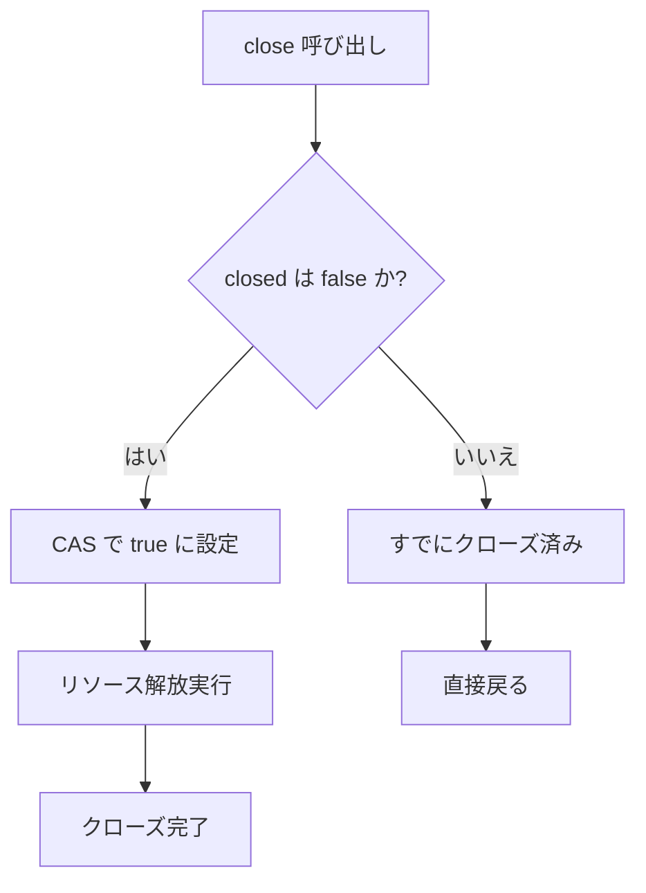

なぜ `AtomicBoolean` の使用が推奨されるのか？

リソースは並行環境で複数のスレッドによってクローズされる可能性があるからです。CAS を使用することで、重複解放を回避できます。

---

## 十七、close メソッドの設計原則

本番環境では、`close()` メソッドを適当に書くべきではありません。

以下の原則に従うことをお勧めします：

| 原則                          | 説明                           |
| --------------------------- | ---------------------------- |
| できるだけ冪等に                        | `close()` を複数回呼び出してもリソースを重複解放しない      |
| コアリソースを優先解放                    | 後続のクリーンアップが失敗しても、最も重要なリソースを先に解放する         |
| `InterruptedException` のスローを避ける | スレッドの中断状態が例外抑制メカニズムに干渉されないようにする            |
| 重要な例外を飲み込まない                    | クローズ失敗はログまたはスローが必要、サイレント失敗を避ける           |
| クローズ後の使用を禁止                   | リソース使用前にクローズ済みかチェックする                 |
| 複数リソースのクローズ順序に注意                   | 外側リソースを先にクローズ、下位リソースを後にクローズする            |
| close で重いビジネス処理を避ける             | `close()` はリソース解放に集中し、複雑なビジネスロジックを担うべきではない |

---

## 十八、close 内の例外はどう扱うべきか？

これはリソースタイプによります。

### 1. ビジネスが認識可能なクローズ失敗

例えば、ファイル書き込み時、出力ストリームのクローズが flush をトリガーする可能性があり、失敗した場合はデータが完全に書き込まれていない可能性があります。

このような例外はスローすべきです：

```java
@Override
public void close() throws IOException {
    outputStream.close();
}
```

### 2. クリーンアップ型リソースのクローズ失敗

例えば、一時ファイルの削除に失敗した場合、メインフローには影響しないかもしれませんが、ログに記録する必要があります。

```java
@Override
public void close() {
    try {
        Files.deleteIfExists(tempFile);
    } catch (IOException e) {
        log.warn("Failed to delete temp file: {}", tempFile, e);
    }
}
```

### 3. 複数リソースのクローズ失敗

手動で例外を収集できます：

```java
@Override
public void close() throws Exception {
    Exception mainException = null;

    try {
        resourceA.close();
    } catch (Exception e) {
        mainException = e;
    }

    try {
        resourceB.close();
    } catch (Exception e) {
        if (mainException != null) {
            mainException.addSuppressed(e);
        } else {
            mainException = e;
        }
    }

    if (mainException != null) {
        throw mainException;
    }
}
```

例外マージモデル：

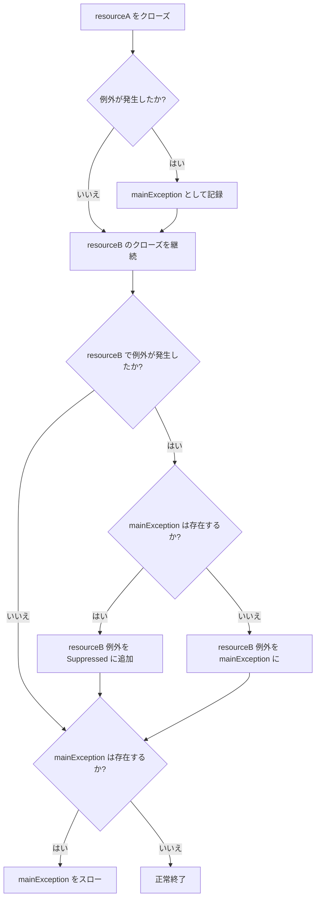

---

## 十九、AutoCloseable はロック管理にも使用可能

`try-with-resources` はファイルやデータベースをクローズするだけでなく、ロックもエレガントに管理できます。

通常の書き方：

```java
lock.lock();

try {
    // クリティカルセクション
} finally {
    lock.unlock();
}
```

次のようにカプセル化できます：

```java
import java.util.concurrent.locks.Lock;

public class AutoLock implements AutoCloseable {

    private final Lock lock;

    public AutoLock(Lock lock) {
        this.lock = lock;
        this.lock.lock();
    }

    @Override
    public void close() {
        lock.unlock();
    }
}
```

使用方法：

```java
import java.util.concurrent.locks.ReentrantLock;

public class AutoLockDemo {

    private final ReentrantLock lock = new ReentrantLock();

    public void update() {
        try (AutoLock ignored = new AutoLock(lock)) {
            System.out.println("Update safely...");
        }
    }
}
```

これにより、ロック取得と解放のコードがより統一されます。

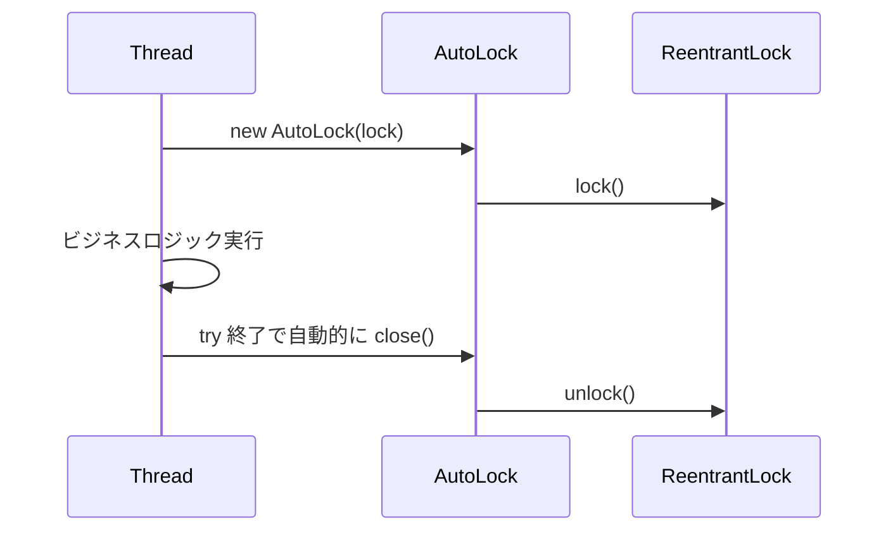

---

## 二十、AutoCloseable の適用シナリオ

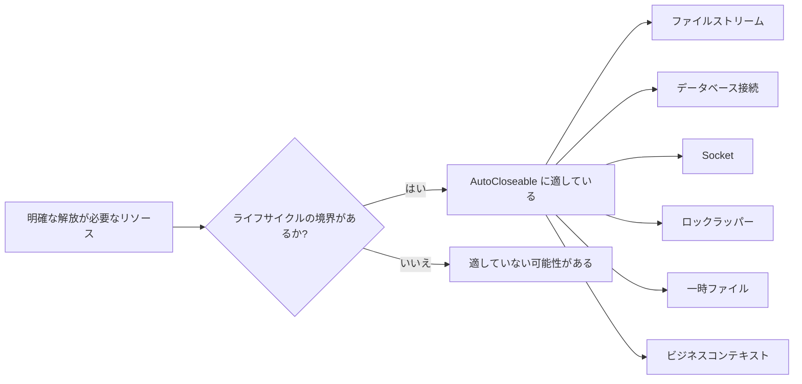

`AutoCloseable` の使用が推奨されるシナリオ：

| シナリオ          | 推奨与否 | 説明                       |
| ----------- | ---: | ------------------------ |
| ファイル読み書き        |   推奨 | JDK で大量にサポートされている                |
| JDBC 接続     |   推奨 | 接続リークを回避できる                  |
| Socket 通信   |   推奨 | ネットワークリソースは必ず解放する必要がある                 |
| 一時ディレクトリ/一時ファイル   |   推奨 | スコープ終了後のクリーンアップに適している               |
| ロックリソースラッパー       |   推奨 | unlock 忘れのリスクを減らせる         |
| スレッドプール         |   慎重 | スレッドプールは通常ライフサイクルが長く、頻繁な try クローズには適さない |
| Spring Bean |   慎重 | Spring ライフサイクル管理に任せるのが推奨      |

---

## 二十一、AutoCloseable を乱用しない

`AutoCloseable` は便利ですが、すべてのオブジェクトがそれを実装すべきという意味ではありません。

推奨されないシナリオ：

```java
public class User implements AutoCloseable {
    private Long id;
    private String name;

    @Override
    public void close() {
        // 実際に解放すべきリソースがない
    }
}
```

このような設計には意味がありません。

`AutoCloseable` の実装が適切かどうかを判断するには、3つの質問を自問できます：

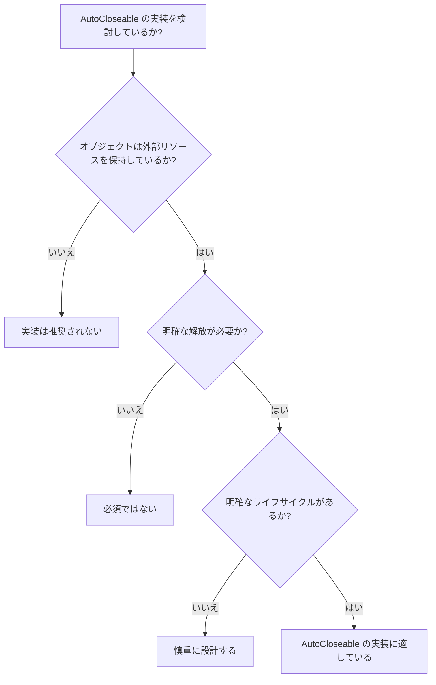

---

## 二十二、try-with-resources のコンパイラの本質

`try-with-resources` はシンタックスシュガーです。

次のコード：

```java
try (MyResource resource = new MyResource()) {
    resource.work();
}
```

コンパイラによって概ね以下の構造に変換されます：

```java
MyResource resource = new MyResource();
Throwable primaryException = null;

try {
    resource.work();
} catch (Throwable t) {
    primaryException = t;
    throw t;
} finally {
    if (resource != null) {
        if (primaryException != null) {
            try {
                resource.close();
            } catch (Throwable closeException) {
                primaryException.addSuppressed(closeException);
            }
        } else {
            resource.close();
        }
    }
}
```

これが Suppressed Exception を処理できる理由です。

---

## 二十三、Java 9 の拡張：初期化済み変数も直接使用可能

Java 7 では `try()` 内でリソースを宣言する必要がありました：

```java
try (BufferedReader reader = new BufferedReader(new FileReader("data.txt"))) {
    System.out.println(reader.readLine());
}
```

Java 9 以降、リソース変数が final または effectively final であれば、直接記述できます：

```java
BufferedReader reader = new BufferedReader(new FileReader("data.txt"));

try (reader) {
    System.out.println(reader.readLine());
}
```

この書き方はより柔軟ですが、注意が必要です：

> リソースは try 終了後にクローズされ、変数がスコープ内にあっても、使用し続けるべきではありません。

---

## 二十四、よくある誤った書き方

### 誤り 1：try 終了後にリソースを継続使用

```java
BufferedReader reader = new BufferedReader(new FileReader("data.txt"));

try (reader) {
    System.out.println(reader.readLine());
}

reader.readLine(); // 誤り：リソースはすでにクローズ済み
```

---

### 誤り 2：close メソッドが冪等でない

```java
public class BadResource implements AutoCloseable {

    private boolean closed = false;

    @Override
    public void close() {
        if (closed) {
            throw new IllegalStateException("Already closed");
        }

        closed = true;
        System.out.println("close");
    }
}
```

これにより、重複クローズ時に例外が発生します。

より良い書き方は：

```java
public class GoodResource implements AutoCloseable {

    private boolean closed = false;

    @Override
    public void close() {
        if (closed) {
            return;
        }

        closed = true;
        System.out.println("close");
    }
}
```

---

### 誤り 3：close ですべての例外を飲み込む

```java
@Override
public void close() {
    try {
        doClose();
    } catch (Exception ignored) {
    }
}
```

これにより、問題の調査が非常に困難になります。

少なくともログに記録することを推奨：

```java
@Override
public void close() {
    try {
        doClose();
    } catch (Exception e) {
        log.warn("Failed to close resource", e);
    }
}
```

---

### 誤り 4：長期オブジェクトを try-with-resources に入れる

```java
ExecutorService executorService = Executors.newFixedThreadPool(10);

try (executorService) {
    executorService.submit(task);
}
```

スレッドプールは通常アプリケーションレベルのリソースであり、ローカルメソッドで安易にクローズすべきではありません。

---

## 二十五、ベストプラクティスのまとめ

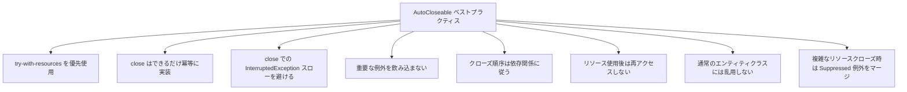

---

## 二十六、面接角度からのまとめ

面接官が「**AutoCloseable とは何か？**」と聞いた場合：

このように答えられます：

> `AutoCloseable` は Java 7 で導入されたリソースクローズインターフェースで、`close()` メソッドを定義しています。このインターフェースを実装したリソースは `try-with-resources` に入れることができ、コンパイラが自動的にクローズロジックを生成し、コードブロック終了時にリソースが解放されることを保証します。

さらに「**try-with-resources は try-finally より何が良いか？**」と聞かれた場合：

このように答えられます：

> ボイラープレートコードを削減し、リソースクローズ忘れを防ぎ、try ブロックの例外と close 例外を正しく処理できます。両者が同時に発生した場合、try ブロックの例外が主例外となり、close 例外は `addSuppressed` によって主例外に付加され、従来の finally のように元の例外を上書きすることはありません。

さらに「**AutoCloseable と Closeable の違いは何か？**」と聞かれた場合：

このように答えられます：

> `Closeable` は `AutoCloseable` を継承しており、主に I/O シナリオで使用されます。`AutoCloseable.close()` は `Exception` をスローできますが、`Closeable.close()` はより具体的な `IOException` をスローします。また、`Closeable` はクローズ操作の冪等性を要求しますが、`AutoCloseable` は冪等性を推奨するのみです。

---

## 二十七、一枚の図で全文をまとめる

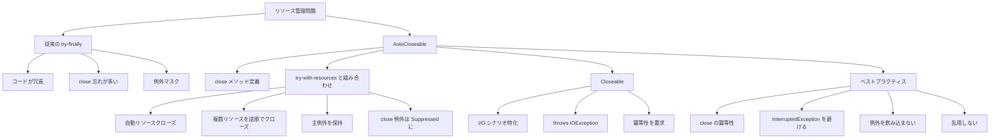

---

## 二十八、結び

`AutoCloseable` は Java リソース管理体系における重要なインターフェースです。

それ自体は非常にシンプルで、`close()` メソッドが1つだけですが、`try-with-resources` と組み合わせることで、非常に大きなエンジニアリング価値をもたらします：

* コードがより簡潔に
* リソース解放がより信頼性高く
* 例外情報がより完全に
* 複数リソースのクローズ順序がより安全に
* カスタムリソースのライフサイクルがより明確に

モダン Java 開発において、明確な解放が必要なリソースに遭遇したら、常に優先的に検討すべきです：

```java
try (Resource resource = new Resource()) {
    // use resource
}
```

複雑な `try-finally` を手書きするのではなく。

一言でまとめると：

> `AutoCloseable` はリソース解放を「開発者の自覚に頼る」から「言語メカニズムによる保証」へと変えました。
