## 一、問題背景：なぜ null をキャッシュするのか？

キャッシュの実践において、次のようなシナリオによく遭遇します：

> あるメソッドがデータベースを照会した後 `null` を返し、この `null` 自体が意味のある照会結果である場合。

例えば：

```java
User user = userService.getById(10086L);
```

データベースに `id = 10086` のユーザーが存在しない場合、照会結果は `null` になります。

この `null` がキャッシュされないと、`id = 10086` を照会するたびにデータベースにアクセスし続けることになります：

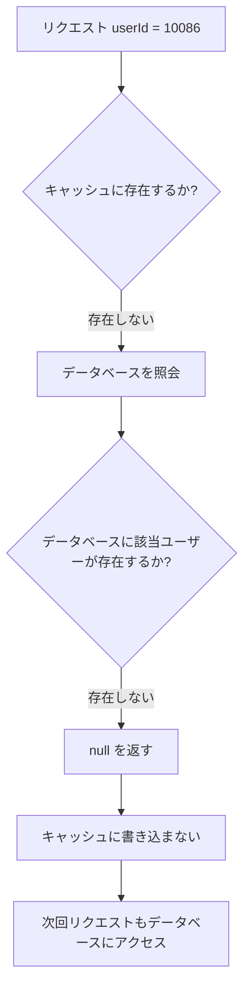

この種の問題は高同時アクセスのシナリオでは非常に危険です。

存在しない商品、存在しないユーザー、存在しない注文など、存在しないデータを大量のリクエストが照会すると、キャッシュ層がこれらのリクエストを遮断できず、データベースが継続的に貫通されます。

これが典型的な**キャッシュペネトレーション**問題です。

---

## 二、キャッシュペネトレーション：存在しないデータもキャッシュが必要

キャッシュペネトレーションの本質は：

> リクエストされたデータがキャッシュにもデータベースにも存在せず、毎回のリクエストがキャッシュをバイパスして直接データベースにアクセスしてしまうこと。

解決アプローチの一つは：

> データベースの照会結果が `null` であっても、この `null` 結果をキャッシュする。

これにより、後続の同じリクエストが再アクセスする際、キャッシュ層で直接 `null` を返すことができ、データベースにアクセスする必要がなくなります。

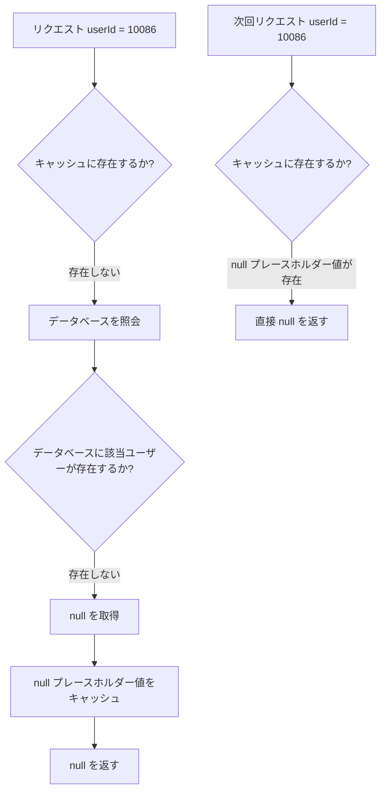

これはシンプルに見えますが、実際の実装では一つの基本的な問題に直面します：

> 多くのキャッシュ実装は `null` の直接保存をサポートしていません。

---

## 三、基盤キャッシュはなぜ null を好まないのか？

異なるキャッシュコンポーネントによる `null` の扱いは一貫していません。

### 1. ConcurrentHashMap は null を許可しない

`ConcurrentHashMap` は Java で一般的なローカルキャッシュの基盤構造の一つです。

しかし、key または value に `null` を許可しません。

例えば：

```java
ConcurrentHashMap<String, Object> map = new ConcurrentHashMap<>();

map.put("user:10086", null); // NullPointerException がスローされる
```

つまり、Spring Cache の基盤実装が `ConcurrentHashMap` のような構造を使用している場合、`null` を直接書き込むことはできません。

---

### 2. Redis の null セマンティクスには曖昧さがある

Redis 自体は空文字列や特殊なマーカー値などを保存できます。

しかし、多くのクライアントやキャッシュ抽象層にとって：

```java
Object value = redis.get("user:10086");
```

戻り値が `null` の場合、二つの意味を表す可能性があります：

| 戻り結果   | 可能な意味               |
| ------ | ------------------ |
| `null` | key が存在しない            |
| `null` | key は存在するが、ビジネス値が null |

これによりセマンティクスの曖昧さが生じます。

キャッシュシステムが本当に表現したいのは：

> この key は確かに存在するが、対応するビジネス値が null である。

そこで、Spring Cache はこのセマンティクスを表現するための統一的な仕組みが必要になりました。

---

## 四、コアソリューション：NullValue で本当の null を代用する

Spring Cache の解決策は、特殊なオブジェクトを導入することです：

```java
org.springframework.cache.support.NullValue
```

その核心思想は：

> `null` を直接キャッシュに保存するのではなく、`NullValue.INSTANCE` を null のプレースホルダーとして保存する。

これが典型的な**Null Object パターン**です。

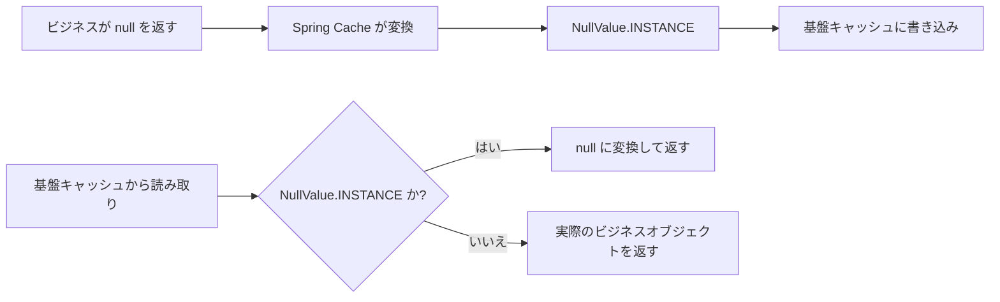

この変換プロセスは一般的に二つのメソッドに抽象化できます：

| 段階   | メソッドセマンティクス             | 役割            |
| ---- | ---------------- | ------------- |
| キャッシュ書き込み | `toStoreValue`   | ビジネス値をキャッシュ保存可能な値に変換 |
| キャッシュ読み取り | `fromStoreValue` | キャッシュ値をビジネス値に変換し直す    |

擬似コードは以下の通りです：

```java
protected Object toStoreValue(Object userValue) {
    if (userValue == null) {
        return NullValue.INSTANCE;
    }
    return userValue;
}

protected Object fromStoreValue(Object storeValue) {
    if (storeValue == NullValue.INSTANCE) {
        return null;
    }
    return storeValue;
}
```

この中間層の変換により、Spring Cache は `null` のビジネスセマンティクスを保持しつつ、基盤キャッシュが null を保存できない制限を回避できます。

---

## 五、NullValue ソースコード

`NullValue` のソースコードは非常に短いですが、設計は非常に精巧です：

```java
package org.springframework.cache.support;

import java.io.Serializable;

import org.springframework.lang.Nullable;

public final class NullValue implements Serializable {

    public static final Object INSTANCE = new NullValue();

    private static final long serialVersionUID = 1L;

    private NullValue() {
    }

    private Object readResolve() {
        return INSTANCE;
    }

    @Override
    public boolean equals(@Nullable Object other) {
        return (this == other || other == null);
    }

    @Override
    public int hashCode() {
        return NullValue.class.hashCode();
    }

    @Override
    public String toString() {
        return "null";
    }
}
```

このクラスは一見シンプルなプレースホルダーオブジェクトに過ぎませんが、複数の重要な設計ポイントが含まれています。

---

## 六、設計詳細一：final クラス、継承を禁止

```java
public final class NullValue implements Serializable
```

`NullValue` は `final` として宣言されており、継承が許可されていません。

これにはいくつかの利点があります：

1. サブクラスによる `NullValue` のセマンティクス破壊を防止する。
2. グローバルに唯一の標準的な null プレースホルダーオブジェクトであることを保証する。
3. 継承による `equals`、`hashCode`、シリアライズ動作の複雑化を回避する。

この種のインフラストラクチャクラスにとって、セマンティクスの安定性は拡張性よりも重要です。

---

## 七、設計詳細二：Singleton パターン

`NullValue` の核心はグローバルシングルトンです：

```java
public static final Object INSTANCE = new NullValue();

private NullValue() {
}
```

ここには二つの重要なポイントがあります。

### 1. private コンストラクタ

```java
private NullValue() {
}
```

コンストラクタはプライベートであり、外部から `new NullValue()` で新しいオブジェクトを作成することはできません。

これにより、外部はフレームワークが提供する唯一のインスタンスのみを使用することが保証されます。

### 2. public static final INSTANCE

```java
public static final Object INSTANCE = new NullValue();
```

`INSTANCE` はグローバルで唯一の null プレースホルダーオブジェクトです。

その利点は非常に明確です：

| 設計ポイント        | 価値                      |
| ---------- | ----------------------- |
| シングルトンオブジェクト       | すべての null キャッシュ値が同じインスタンスを再利用     |
| オブジェクト生成の削減     | 大量の null をキャッシュしても大量のプレースホルダーオブジェクトが生成されない |
| `==` 判定のサポート | 参照比較が可能で、パフォーマンスが高い           |
| セマンティクスの明確さ       | すべての null キャッシュ値が同じ標準マーカーを指す   |

イメージ図は以下の通りです：

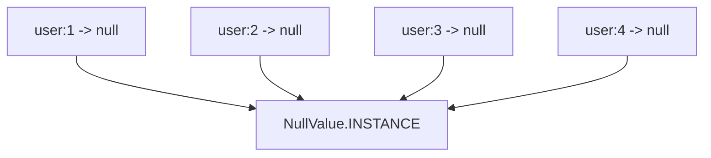

ビジネス上の `null` をいくつキャッシュしても、基盤では同じ `NullValue.INSTANCE` を再利用できます。

---

## 八、設計詳細三：なぜ INSTANCE の型は Object なのか？

ソースコードのこの行は非常に興味深いです：

```java
public static final Object INSTANCE = new NullValue();
```

次のように書かれていません：

```java
public static final NullValue INSTANCE = new NullValue();
```

`Object` 型として宣言されています。

これは、外部の呼び出し側にとって `NullValue` の具体的な型に依存する必要がないからです。

単に特殊なキャッシュ値オブジェクトとして扱うだけで十分です。

これにより型の露出を弱め、それが単なる内部プレースホルダーであることを強調できます。

セマンティクスの観点から：

```java
Object storeValue = NullValue.INSTANCE;
```

は、次の書き方よりもキャッシュ抽象層の設計に近いです：

```java
NullValue storeValue = NullValue.INSTANCE;
```

キャッシュに保存されるのは本来 `Object` だからです。

---

## 九、設計詳細四：readResolve がデシリアライズ後のシングルトン一貫性を保証する

`NullValue` で最も重要な設計の一つが：

```java
private Object readResolve() {
    return INSTANCE;
}
```

このメソッドは目立たないように見えますが、非常に重要です。

### 1. 問題：シリアライズはシングルトンを破壊する

分散キャッシュのシナリオでは、`NullValue.INSTANCE` がシリアライズされて Redis、Memcached、またはその他のキャッシュシステムに書き込まれる可能性があります。

例えば：

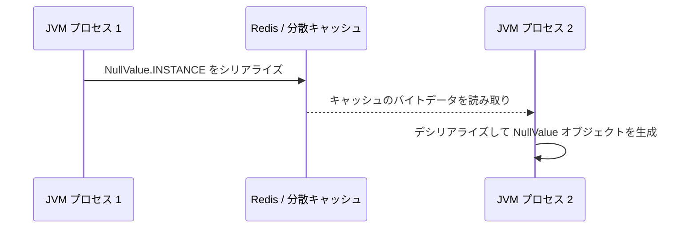

特別な処理がない場合、Java のデシリアライズは新しい `NullValue` オブジェクトを作成します。

これにより：

```java
deserializedObject == NullValue.INSTANCE // false
```

この判定が失敗すると、キャッシュ層はこの値が null プレースホルダーであることを識別できなくなる可能性があります。

---

### 2. readResolve の役割

`readResolve()` は Java シリアライズ機構の特殊なフックです。

オブジェクトのデシリアライズが完了した後、クラスに `readResolve()` メソッドが定義されている場合、呼び出し側に返されるのはデシリアライズされたばかりの新しいオブジェクトではなく、`readResolve()` の戻り値になります。

`NullValue` では：

```java
private Object readResolve() {
    return INSTANCE;
}
```

これは次のことを意味します：

> デシリアライズでどのようなオブジェクトが作成されても、最終的にはグローバルで唯一の `NullValue.INSTANCE` に置き換えられます。

イメージ図は以下の通りです：

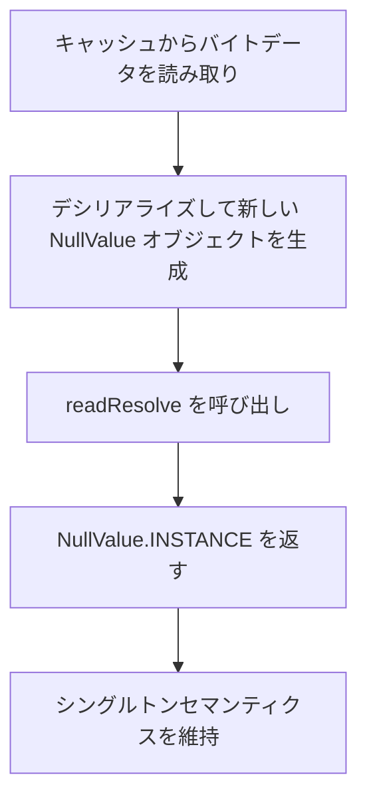

これにより保証されます：

```java
deserializedObject == NullValue.INSTANCE // true
```

これは分散キャッシュにとって非常に重要です。

---

## 十、設計詳細五：equals により NullValue はセマンティクス上 null と等価

`NullValue` の `equals` メソッドも非常に興味深いです：

```java
@Override
public boolean equals(@Nullable Object other) {
    return (this == other || other == null);
}
```

これは二つのセマンティクスを表現しています：

| 判定条件            | 意味               |
| --------------- | ---------------- |
| `this == other` | 自分自身と等しい            |
| `other == null` | 本当の null とセマンティクス上等しい |

したがって：

```java
NullValue.INSTANCE.equals(null); // true
```

これは非常に明確なセマンティクス表現です：

> NullValue は null の代替であり、論理的に null と等価と見なすことができる。

ただし注意点があります：

```java
null.equals(NullValue.INSTANCE); // NullPointerException
```

したがって、この `equals` は `NullValue` 自身のセマンティクスを強化するだけで、Java の `null` が本当にオブジェクトとしての振る舞いを持つことを意味するものではありません。

Spring Cache の内部判定では、参照比較を使用する方が一般的です：

```java
storeValue == NullValue.INSTANCE
```

こちらの方がパフォーマンスが良く、セマンティクスもより正確です。

---

## 十一、設計詳細六：hashCode の安定性を維持

ソースコードにはもう一つ `hashCode` があります：

```java
@Override
public int hashCode() {
    return NullValue.class.hashCode();
}
```

この実装により、`NullValue` のハッシュ値が安定することが保証されます。

オブジェクトアドレスに関連するデフォルトの `hashCode` を使用せず、クラスオブジェクトの `hashCode` を直接使用しています。

これはシングルトンのセマンティクスに合致します：

> NullValue が表すのは固定されたセマンティクスであり、ある普通のオブジェクトインスタンスではありません。

---

## 十二、設計詳細七：toString が "null" を返す

```java
@Override
public String toString() {
    return "null";
}
```

この実装は主にログ、デバッグ、可読性のためです。

`NullValue.INSTANCE` を出力する際：

```java
System.out.println(NullValue.INSTANCE);
```

出力結果は：

```text
null
```

これにより、ログ上で実際の `null` セマンティクスに近い見た目になります。

---

## 十三、NullValue の全体設計図

`NullValue` の設計は以下のいくつかの層に分解できます：

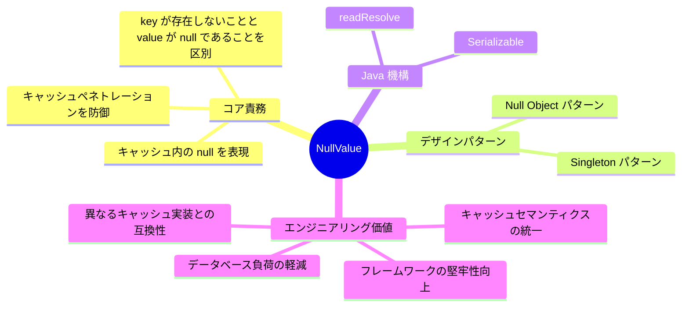

これは複雑なクラスではありませんが、非常に現実的なエンジニアリング問題を解決しています。

---

## 十四、null をキャッシュする場合としない場合の比較

| 方案           | 動作                    | 利点        | 欠点        |
| ------------ | --------------------- | --------- | --------- |
| null をキャッシュしない     | 存在しないデータの照会のたびにデータベースにアクセス       | 実装がシンプル      | キャッシュペネトレーションが発生しやすい  |
| null を直接キャッシュ    | null をキャッシュに書き込もうとする         | セマンティクスが直感的      | 多くのキャッシュ実装がサポートしていない |
| 特殊文字列をキャッシュ      | 例えば `"NULL"` を保存          | シンプルで強引      | ビジネスセマンティクスを汚染しやすい  |
| NullValue を使用 | 統一オブジェクトで null を表現          | セマンティクスが明確、フレームワークに優しい | 変換ロジックが必要    |
| Optional を使用  | `Optional.empty()` をキャッシュ | 型セマンティクスが明確    | ビジネスの戻り値型に侵入する  |

Spring Cache が `NullValue` を選択した理由は：

> ビジネスメソッドの戻り値型を変更せず、基盤キャッシュ実装との互換性を保ち、キャッシュ抽象の一貫性を維持できるからです。

---

## 十五、完全な呼び出しチェーンのイメージ

`@Cacheable` メソッドを例にします：

```java
@Cacheable(cacheNames = "user", key = "#id")
public User getUserById(Long id) {
    return userRepository.findById(id).orElse(null);
}
```

ユーザーが存在しない場合、呼び出しチェーンは概ね以下の通りです：

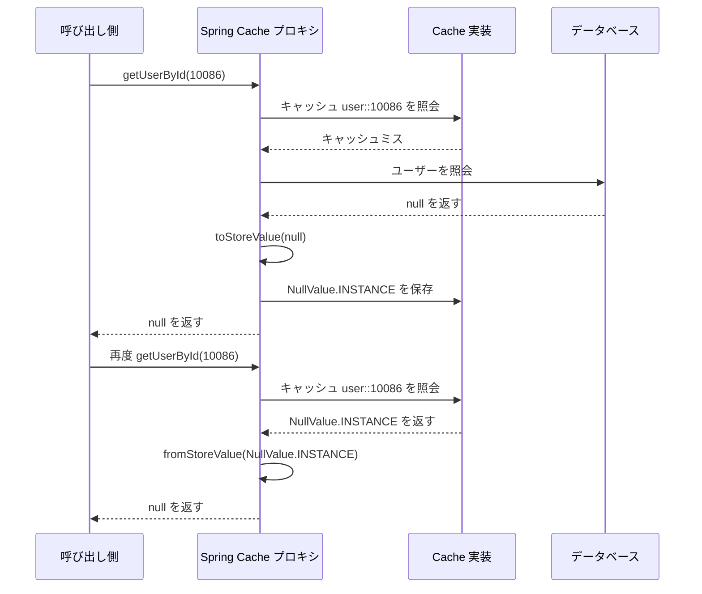

このチェーンの重要なポイントは：

> キャッシュに保存されているのは `NullValue.INSTANCE` ですが、ビジネスメソッドが見るのは依然として `null` です。

これがキャッシュ抽象層の価値です。

---

## 十六、エンジニアリング実践：null をキャッシュする際は必ず短い TTL を設定する

null をキャッシュすることでキャッシュペネトレーションを防御できますが、副作用もあります。

初回の照会で `userId = 10086` のユーザーがデータベースに存在しなかったため、null がキャッシュされたとします。

その後このユーザーが作成されても、キャッシュ内の null がまだ期限切れでなければ、照会は引き続き null を返します。

これにより短時間のデータ不整合が発生します。

したがって、実践では通常次のように推奨されます：

> null キャッシュは行うべきだが、TTL は通常データよりも短くすべきである。

例えば：

| キャッシュ内容      | 推奨 TTL    |
| --------- | --------- |
| 通常のユーザーデータ    | 30 分     |
| null プレースホルダーデータ | 1 ～ 5 分  |
| ホットデータ      | 適宜長くしてもよい     |
| 強一貫性データ     | キャッシュは慎重に、または能動的無効化 |

イメージ図：

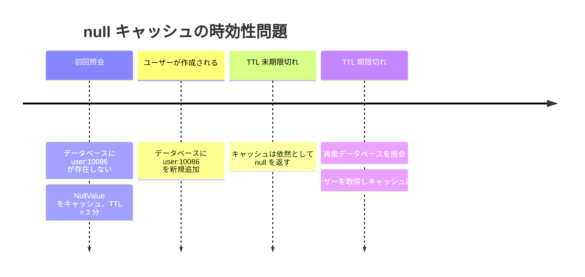

したがって、null キャッシュの重要なポイントは「キャッシュできるかどうか」ではなく：

> どのくらいキャッシュするか、そしてデータ変更後にどのように無効化するか。

---

## 十七、ブルームフィルターとの関係

キャッシュペネトレーション防御のもう一つの一般的なソリューションは**ブルームフィルター**です。

ブルームフィルターは通常、key が存在する可能性があるかどうかを判断するために使用されます。

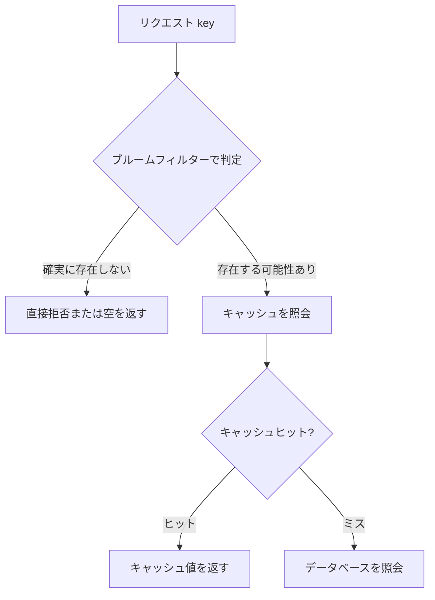

`NullValue` とブルームフィルターは互いに排他的な関係ではありません。

それぞれの関心事が異なります：

| 方案        | 主な役割                   | 適したシナリオ       |
| --------- | ---------------------- | ---------- |
| NullValue | すでに照会済みの存在しない結果をキャッシュ          | 通常のビジネスキャッシュ     |
| ブルームフィルター     | リクエストがキャッシュ/データベースに入る前に不正な key を事前に遮断 | 大規模な悪意あるペネトレーション防御  |
| パラメータ検証      | 明らかに不正なリクエストを遮断               | ID 形式、範囲の検証 |
| レート制限        | 異常トラフィックを制御                 | 高同時アクセス保護      |

より堅牢なエンジニアリングソリューションは通常、組み合わせて使用します：

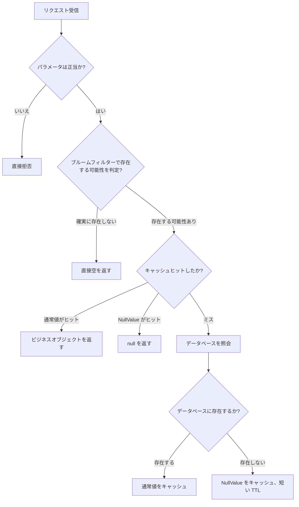

---

## 十八、簡易版 NullValue を自分で実装する

Spring Cache を使用しなくても、この設計を参考にできます。

例えば：

```java
import java.io.Serializable;

public final class MyNullValue implements Serializable {

    public static final Object INSTANCE = new MyNullValue();

    private static final long serialVersionUID = 1L;

    private MyNullValue() {
    }

    private Object readResolve() {
        return INSTANCE;
    }

    @Override
    public boolean equals(Object other) {
        return this == other || other == null;
    }

    @Override
    public int hashCode() {
        return MyNullValue.class.hashCode();
    }

    @Override
    public String toString() {
        return "null";
    }
}
```

さらにキャッシュの読み書きロジックをカプセル化します：

```java
public class SimpleCacheAdapter {

    private final Map<String, Object> cache = new ConcurrentHashMap<>();

    public void put(String key, Object value) {
        cache.put(key, toStoreValue(value));
    }

    public Object get(String key) {
        Object value = cache.get(key);
        return fromStoreValue(value);
    }

    private Object toStoreValue(Object value) {
        return value == null ? MyNullValue.INSTANCE : value;
    }

    private Object fromStoreValue(Object value) {
        return value == MyNullValue.INSTANCE ? null : value;
    }
}
```

テストしてみます：

```java
SimpleCacheAdapter cache = new SimpleCacheAdapter();

cache.put("user:10086", null);

Object value = cache.get("user:10086");

System.out.println(value); // null
```

基盤キャッシュに実際に保存されているのは `MyNullValue.INSTANCE` ですが、外部の呼び出し側が見るのは依然として `null` です。

---

## 十九、よくある誤解

### 誤解一：Redis は空文字列を保存できるから NullValue は不要

空文字列は null と同じではありません。

```text
""     実際に存在する空文字列を表す
null   値がないことを表す
```

null を単純に空文字列に置き換えると、ビジネスセマンティクスを汚染します。

例えば、ユーザー名が空文字列であることとユーザーが存在しないことは、明らかに同じ概念ではありません。

---

### 誤解二：null をキャッシュすれば必ず良い

null をキャッシュすることでデータベースの負荷を軽減できますが、短時間のデータ不整合を招く可能性もあります。

したがって、TTL を制御し、データの作成、更新、削除時にキャッシュの無効化を適切に行う必要があります。

---

### 誤解三：NullValue はビジネスオブジェクトである

`NullValue` はビジネス層に登場すべきではありません。

それはキャッシュ抽象層の内部にのみ存在すべきです。

ビジネスコードは引き続き実際の戻り値を扱うべきです：

```java
User user = userService.getById(id);
```

次のようにすべきではありません：

```java
Object value = cache.get(key);
if (value == NullValue.INSTANCE) {
    // ビジネス層で NullValue を処理
}
```

ビジネス層が `NullValue` を認知し始めたら、キャッシュ抽象が漏洩していることを示します。

---

## 二十、面接の視点：NullValue は何を評価できるか？

`NullValue` は非常に小さなクラスですが、その背後には多くの Java 基礎とエンジニアリング能力を評価できます。

| 評価ポイント             | 説明                    |
| --------------- | --------------------- |
| キャッシュペネトレーション            | なぜ存在しないデータもキャッシュする必要があるのか         |
| キャッシュ抽象            | 異なる基盤キャッシュの差異をどのように隠蔽するか          |
| Null Object パターン           | 特殊なオブジェクトで null を代用する          |
| Singleton パターン            | グローバルで唯一のプレースホルダーオブジェクト              |
| Java シリアライズ        | `readResolve` がどのようにシングルトンを保証するか  |
| equals/hashCode | オブジェクトの等価性とハッシュセマンティクス            |
| エンジニアリングのトレードオフ            | null キャッシュの TTL、データ一貫性、副作用 |

面接で「Spring Cache はどのように null をキャッシュするか」と聞かれた場合、次のように回答できます：

> Spring Cache は null を直接基盤キャッシュに書き込むのではなく、`NullValue.INSTANCE` を null のプレースホルダーとして使用します。キャッシュへの書き込み時、`toStoreValue` により null を `NullValue.INSTANCE` に変換し、キャッシュからの読み取り時、`fromStoreValue` により `NullValue.INSTANCE` を null に変換し直します。これにより、null をサポートしない基盤キャッシュ実装との互換性を保ちつつ、「key は存在するが value が null」というセマンティクスも表現できます。`NullValue` 自体はシングルトンであり、`readResolve` によりデシリアライズ後も同じインスタンスであることが保証されます。

---

## 二十一、まとめ

`NullValue` は Spring Cache において非常に小さいが非常に代表的な設計です。

解決する問題はそれほど複雑ではありません：

> null をサポートしないキャッシュで null をどのように表現するか？

しかし、その解決方法は非常にエンジニアリング的です：


そのコア価値は四点にまとめられます：

1. **Null Object パターンで null セマンティクスを表現**
   `null` を直接保存せず、特殊なプレースホルダーオブジェクトを保存する。

2. **Singleton パターンでコストを削減**
   すべての null キャッシュ値が同じ `NullValue.INSTANCE` を再利用する。

3. **readResolve でシリアライズ安全性を保証**
   分散キャッシュのシリアライズとデシリアライズを経ても、同じシングルトンオブジェクトに復元できる。

4. **キャッシュ抽象で基盤の差異を隠蔽**
   ビジネス層は引き続き `null` を扱い、基盤キャッシュは識別可能なプレースホルダー値を保存する。

`NullValue` の優秀さはコードの複雑さではなく、エラーが起きやすい境界問題を十分に安定、明確、かつ信頼性高くカプセル化している点にあります。

これこそが優れたフレームワークコードが学ぶ価値のある点です：

> 優れた設計とは、問題を複雑にすることではなく、複雑さを正しい位置に隠すことである。
