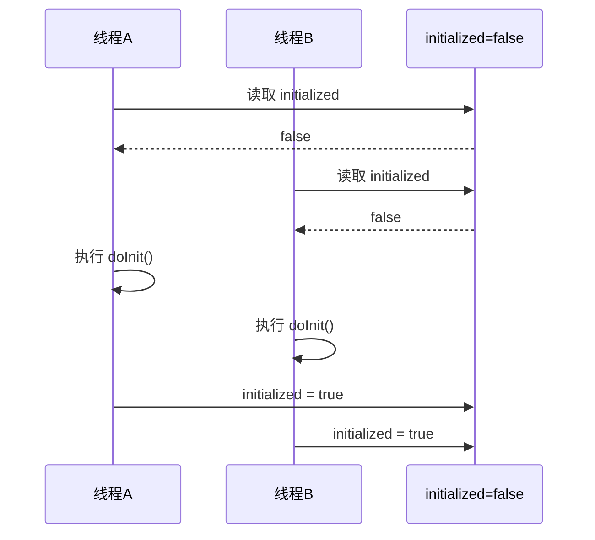
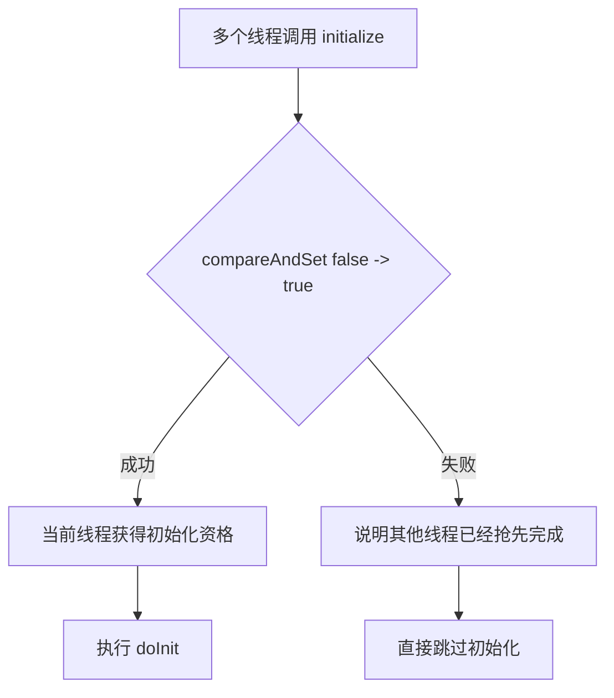
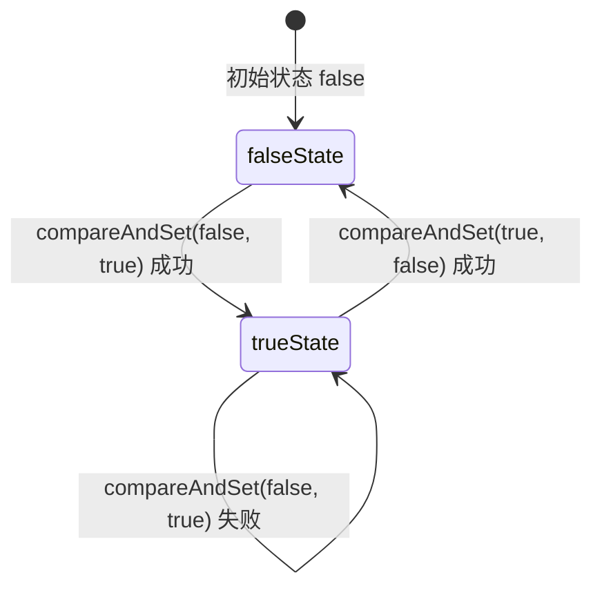
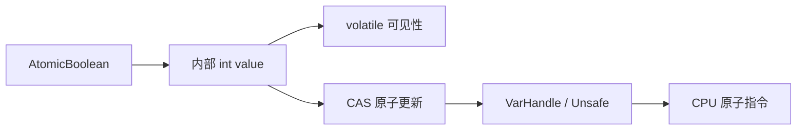
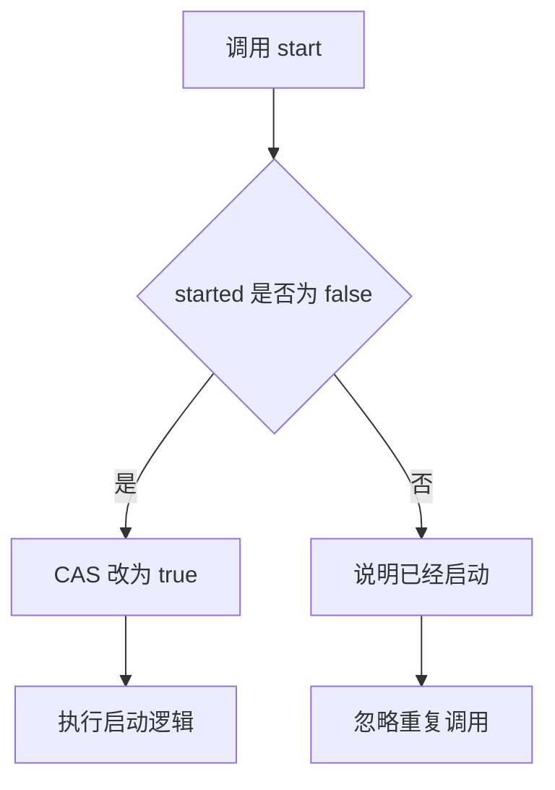
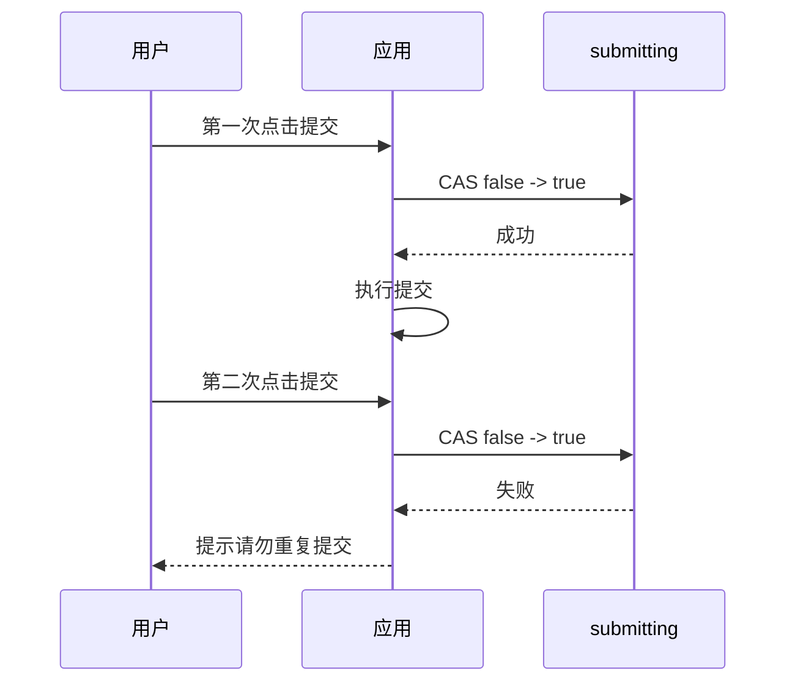
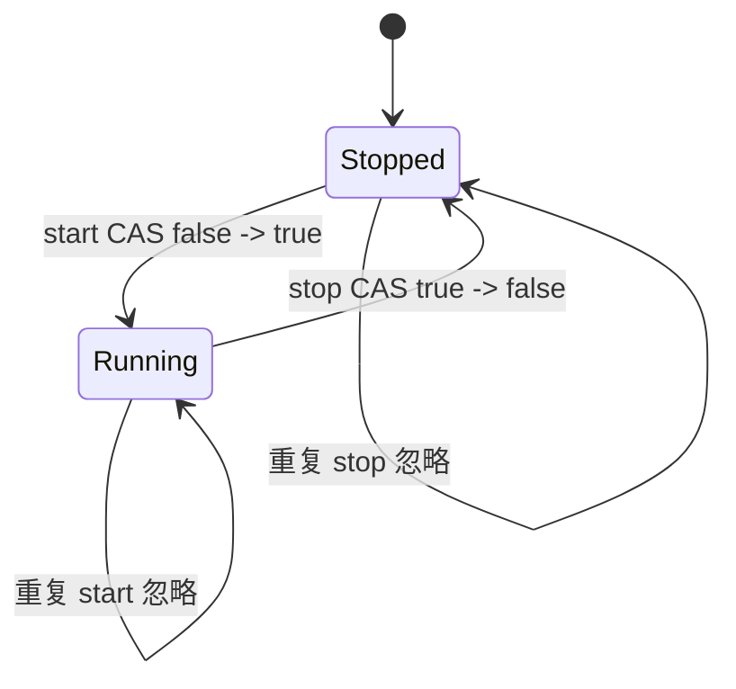
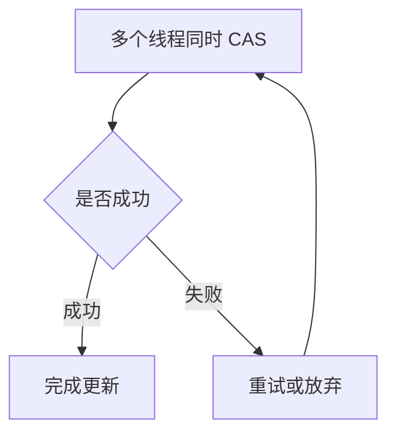
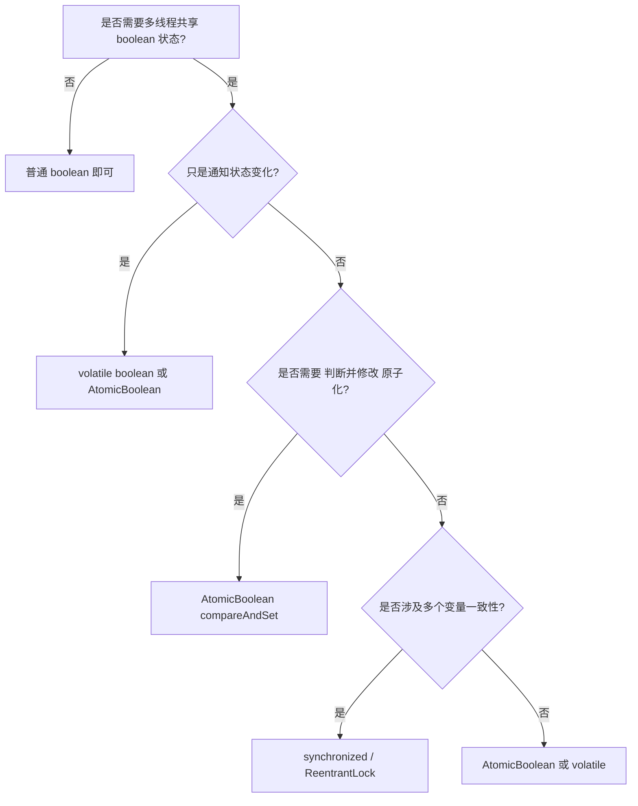

## 一、引言：为什么一个 boolean 也会有并发问题？

在 Java 多线程编程中，我们经常需要使用一个简单的状态标志来控制程序流程，例如：

* 初始化是否已经完成
* 任务是否已经取消
* 某个开关是否已经打开
* 某段逻辑是否只能执行一次
* 服务是否正在启动或关闭

在单线程环境中，一个普通的 `boolean` 字段就足够了。

```java
private boolean initialized = false;
```

但一旦进入多线程环境，事情就没有这么简单了。

一个看似普通的 `boolean`，可能同时涉及三个并发问题：

| 问题    | 含义                    | 后果               |
| ----- | --------------------- | ---------------- |
| 可见性问题 | 一个线程修改了变量，其他线程不一定立刻看到 | 线程读到旧值           |
| 原子性问题 | 判断和修改不是一个不可分割的整体      | 多个线程同时通过判断       |
| 有序性问题 | CPU 或编译器可能对指令做重排序     | 程序执行顺序与代码顺序不完全一致 |

`AtomicBoolean` 正是 Java 并发包中专门用于解决这类“共享布尔状态”的轻量级工具。

---

## 二、并发陷阱：普通 boolean 为什么不够？

先看一个非常常见的初始化示例。

```java
public class UnsafeInit {

    private boolean initialized = false;

    public void initialize() {
        if (!initialized) {
            // 执行一些耗时的初始化工作
            doInit();

            initialized = true;
        }
    }

    private void doInit() {
        System.out.println("init...");
    }
}
```

这段代码在单线程下没有问题，但在多线程下存在典型的竞态条件。

### 2.1 Check-Then-Act 竞态条件

所谓 **Check-Then-Act**，就是先检查状态，再根据检查结果执行动作。

```java
if (!initialized) {
    doInit();
    initialized = true;
}
```

问题在于：

> `if (!initialized)` 和 `initialized = true` 不是一个原子操作。

多个线程可能同时看到 `initialized == false`，然后同时进入初始化逻辑。



最终结果是：初始化逻辑被执行了多次。

---

## 三、volatile 能解决吗？

很多人会想到把字段改成 `volatile`。

```java
public class VolatileInit {

    private volatile boolean initialized = false;

    public void initialize() {
        if (!initialized) {
            doInit();
            initialized = true;
        }
    }

    private void doInit() {
        System.out.println("init...");
    }
}
```

`volatile` 可以保证：

* 一个线程修改变量后，其他线程能尽快看到
* 禁止部分指令重排序
* 读写具有 volatile 语义

但是它不能保证复合操作的原子性。

也就是说：

```java
if (!initialized) {
    initialized = true;
}
```

仍然不是一个不可分割的整体。

### 3.1 volatile 与 AtomicBoolean 的区别

| 能力            | volatile boolean | AtomicBoolean |
| ------------- | ---------------: | ------------: |
| 保证可见性         |                是 |             是 |
| 保证单次读写原子性     |                是 |             是 |
| 保证“判断后修改”的原子性 |                否 |             是 |
| 支持 CAS        |                否 |             是 |
| 适合一次性状态切换     |              不适合 |            适合 |
| 适合复杂临界区保护     |              不适合 |           不适合 |

所以，`volatile boolean` 适合表达“状态通知”，但不适合表达“抢占式状态转换”。

---

## 四、synchronized 可以解决，但不一定总是最优

使用 `synchronized` 可以保证同一时刻只有一个线程进入方法。

```java
public class SafeInit {

    private boolean initialized = false;

    public synchronized void initialize() {
        if (!initialized) {
            doInit();
            initialized = true;
        }
    }

    private void doInit() {
        System.out.println("init...");
    }
}
```

这当然是正确的。

但是，如果我们只是想保护一个简单的布尔状态位，使用锁可能显得有些重。

需要注意的是，现代 JVM 对 `synchronized` 已经做了大量优化，并不能简单地说它一定“很慢”。真正的问题在于：

> 当我们只需要完成一个简单的状态切换时，使用锁会把问题处理得过于复杂。

这时，`AtomicBoolean` 是一个更轻量、更贴合语义的选择。

---

## 五、AtomicBoolean 是什么？

`AtomicBoolean` 位于 Java 并发包中：

```java
java.util.concurrent.atomic.AtomicBoolean
```

它表示一个可以被原子更新的布尔值。

典型用法如下：

```java
import java.util.concurrent.atomic.AtomicBoolean;

public class AtomicInit {

    private final AtomicBoolean initialized = new AtomicBoolean(false);

    public void initialize() {
        if (initialized.compareAndSet(false, true)) {
            doInit();
        }
    }

    private void doInit() {
        System.out.println("init...");
    }
}
```

这段代码的核心在于：

```java
initialized.compareAndSet(false, true)
```

它表示：

> 只有当当前值还是 `false` 时，才把它改成 `true`。如果修改成功，返回 `true`；否则返回 `false`。

多个线程同时执行时，只有一个线程能成功完成这次状态转换。



---

## 六、AtomicBoolean 的底层思想：CAS

`AtomicBoolean` 的核心能力来自 CAS。

CAS 的全称是：

> Compare-And-Swap，比较并交换。

它可以理解为一个原子操作：

```text
如果当前值 == 期望值：
    更新为新值
否则：
    不更新
```

对应到 `AtomicBoolean`：

```java
compareAndSet(expectedValue, newValue)
```

例如：

```java
flag.compareAndSet(false, true);
```

含义就是：

```text
如果 flag 当前是 false，就把它改成 true。
否则什么也不做。
```

整个比较和修改的过程是原子的，中间不会被其他线程打断。

### 6.1 CAS 状态转换图



---

## 七、源码视角：AtomicBoolean 为什么用 int 表示 boolean？

在 JDK 中，`AtomicBoolean` 内部并不是直接用普通 `boolean` 来完成原子操作，而是使用整数值表示布尔状态。

可以抽象理解为：

```java
private volatile int value;
```

其中：

```text
0 表示 false
1 表示 true
```

这样做的原因是底层 CPU 的 CAS 指令通常更容易直接操作整数或引用类型。

从 Java 9 开始，JDK 内部大量使用 `VarHandle` 来完成变量的原子访问和内存语义控制。在更早的版本中，则主要依赖 `Unsafe`。



可以把它理解为：

> `AtomicBoolean` 是 Java 层提供的高级并发工具，底层依赖 JVM 和 CPU 提供的原子能力。

---

## 八、AtomicBoolean 常用方法详解

### 8.1 get()

读取当前值。

```java
boolean current = flag.get();
```

适合判断当前状态。

```java
if (running.get()) {
    System.out.println("service is running");
}
```

---

### 8.2 set(boolean newValue)

设置新值。

```java
flag.set(true);
```

`set` 具有 volatile 写语义，其他线程可以看到这个修改。

适合普通状态发布。

```java
shutdown.set(true);
```

---

### 8.3 compareAndSet(boolean expectedValue, boolean newValue)

这是 `AtomicBoolean` 最核心的方法。

```java
boolean success = flag.compareAndSet(false, true);
```

适合实现一次性动作。

```java
public class OnceTask {

    private final AtomicBoolean executed = new AtomicBoolean(false);

    public void runOnce() {
        if (executed.compareAndSet(false, true)) {
            System.out.println("只执行一次");
        }
    }
}
```

---

### 8.4 getAndSet(boolean newValue)

原子地设置新值，并返回旧值。

```java
boolean oldValue = flag.getAndSet(true);
```

适合“抢占并知道之前状态”的场景。

```java
public class Worker {

    private final AtomicBoolean busy = new AtomicBoolean(false);

    public void work() {
        boolean wasBusy = busy.getAndSet(true);

        if (wasBusy) {
            System.out.println("已有任务正在执行");
            return;
        }

        try {
            System.out.println("开始执行任务");
        } finally {
            busy.set(false);
        }
    }
}
```

---

### 8.5 lazySet(boolean newValue)

`lazySet` 用于设置新值，但它对可见性的要求比 `set` 更弱。

```java
flag.lazySet(false);
```

它适合“最终可见即可”的场景，例如某些状态复位、对象回收标记等。

不过在普通业务开发中，优先使用 `set` 更直观。

---

### 8.6 weakCompareAndSet 系列方法

`weakCompareAndSet` 是弱化版本的 CAS。

它的特点是：

* 也会尝试 CAS
* 可能出现伪失败
* 通常配合循环重试使用
* 普通业务代码很少直接使用

一般情况下，建议优先使用：

```java
compareAndSet(expectedValue, newValue)
```

而不是弱 CAS。

---

## 九、方法对比表

| 方法                              | 作用        | 是否原子 | 典型场景       |
| ------------------------------- | --------- | ---: | ---------- |
| `get()`                         | 获取当前值     |    是 | 判断状态       |
| `set(value)`                    | 设置新值      |    是 | 发布状态       |
| `lazySet(value)`                | 延迟设置新值    |    是 | 最终一致状态更新   |
| `compareAndSet(expect, update)` | 期望值匹配时更新  |    是 | 状态抢占、一次性执行 |
| `getAndSet(value)`              | 设置新值并返回旧值 |    是 | 抢占执行权、状态交换 |
| `weakCompareAndSet(...)`        | 弱 CAS     |    是 | 底层优化、循环重试  |

---

## 十、典型使用场景

### 10.1 只允许任务执行一次

```java
public class StartOnceService {

    private final AtomicBoolean started = new AtomicBoolean(false);

    public void start() {
        if (!started.compareAndSet(false, true)) {
            System.out.println("服务已经启动，忽略重复 start");
            return;
        }

        System.out.println("服务启动中...");
    }
}
```

状态流转如下：



---

### 10.2 任务取消标志

```java
public class CancelableTask implements Runnable {

    private final AtomicBoolean cancelled = new AtomicBoolean(false);

    public void cancel() {
        cancelled.set(true);
    }

    @Override
    public void run() {
        while (!cancelled.get()) {
            // 执行任务
            doWork();
        }

        System.out.println("任务已取消");
    }

    private void doWork() {
        System.out.println("working...");
    }
}
```

这种场景中，`AtomicBoolean` 用作线程间的状态通知。

当然，如果只是简单通知，也可以使用 `volatile boolean`。

---

### 10.3 防止重复提交

```java
public class SubmitGuard {

    private final AtomicBoolean submitting = new AtomicBoolean(false);

    public void submit() {
        if (!submitting.compareAndSet(false, true)) {
            System.out.println("正在提交，请勿重复点击");
            return;
        }

        try {
            System.out.println("提交请求...");
        } finally {
            submitting.set(false);
        }
    }
}
```

这个模式非常适合防止重复触发。



---

### 10.4 服务生命周期控制

```java
public class LifecycleService {

    private final AtomicBoolean running = new AtomicBoolean(false);

    public void start() {
        if (running.compareAndSet(false, true)) {
            System.out.println("service started");
        }
    }

    public void stop() {
        if (running.compareAndSet(true, false)) {
            System.out.println("service stopped");
        }
    }

    public boolean isRunning() {
        return running.get();
    }
}
```

状态机如下：



---

## 十一、AtomicBoolean 与 synchronized 如何选择？

### 11.1 适合使用 AtomicBoolean 的场景

| 场景          | 是否适合 |
| ----------- | ---: |
| 控制一次性执行     |   适合 |
| 简单开关状态      |   适合 |
| 任务取消标志      |   适合 |
| 服务启动 / 停止状态 |   适合 |
| 防止重复提交      |   适合 |
| 简单状态机切换     |   适合 |

### 11.2 不适合使用 AtomicBoolean 的场景

| 场景           | 原因                                               |
| ------------ | ------------------------------------------------ |
| 需要保护多个变量的一致性 | AtomicBoolean 只能保护一个布尔状态                         |
| 临界区逻辑很复杂     | 使用锁更清晰                                           |
| 需要等待和通知      | 应使用 `wait/notify`、`Condition`、`CountDownLatch` 等 |
| 需要公平性        | CAS 不保证公平                                        |
| 高竞争下持续自旋     | 可能浪费 CPU                                         |

例如下面这种场景就不适合只用 `AtomicBoolean`：

```java
if (flag.compareAndSet(false, true)) {
    balance = balance - amount;
    count++;
    log.add(record);
}
```

这里涉及多个共享变量的一致性。如果没有额外保护，依然可能出现并发问题。

更合适的方式可能是：

```java
synchronized (this) {
    balance = balance - amount;
    count++;
    log.add(record);
}
```

---

## 十二、AtomicBoolean 的常见误区

### 12.1 误区一：AtomicBoolean 可以替代所有锁

不能。

`AtomicBoolean` 适合处理简单状态位，不适合保护复杂业务临界区。

如果你要维护多个变量之间的一致性，锁往往更清晰、更安全。

---

### 12.2 误区二：CAS 一定比 synchronized 快

不一定。

在低竞争下，CAS 通常很轻量。

但在高竞争下，大量线程反复 CAS 失败，可能会造成 CPU 空转。



如果失败后不断自旋，就会消耗大量 CPU。

所以 CAS 的优势在于：

> 竞争不严重、状态更新简单、失败可以快速返回或少量重试。

---

### 12.3 误区三：AtomicBoolean 能解决所有可见性问题

`AtomicBoolean` 本身的读写具有内存语义，但它不能自动保证其他普通变量的线程安全。

例如：

```java
private String data;
private final AtomicBoolean ready = new AtomicBoolean(false);

public void write() {
    data = "hello";
    ready.set(true);
}

public void read() {
    if (ready.get()) {
        System.out.println(data);
    }
}
```

这类发布场景通常可以工作，但如果业务更复杂，仍然需要谨慎分析变量发布、对象逃逸和内存可见性。

---

## 十三、实战最佳实践

### 13.1 用 final 修饰 AtomicBoolean 字段

推荐：

```java
private final AtomicBoolean running = new AtomicBoolean(false);
```

不推荐：

```java
private AtomicBoolean running = new AtomicBoolean(false);
```

原因是我们通常不希望这个原子对象本身被替换。

---

### 13.2 状态转换优先使用 compareAndSet

如果你的语义是“只有当前状态满足条件时才修改”，优先使用：

```java
compareAndSet(expectedValue, newValue)
```

不要写成：

```java
if (!flag.get()) {
    flag.set(true);
}
```

后者仍然是 Check-Then-Act，不具备整体原子性。

---

### 13.3 finally 中恢复状态

如果用 `AtomicBoolean` 表示“正在执行”，一定要考虑异常恢复。

推荐：

```java
if (!running.compareAndSet(false, true)) {
    return;
}

try {
    doWork();
} finally {
    running.set(false);
}
```

否则一旦 `doWork()` 抛出异常，状态可能永远停留在 `true`。

---

### 13.4 不要过度追求无锁

无锁不是目的，正确性和可维护性才是目的。

如果业务逻辑复杂，使用 `synchronized` 或 `ReentrantLock` 反而更容易写对。

---

## 十四、AtomicBoolean 决策流程图



---

## 十五、完整示例：一个可重复启动和关闭的服务

```java
import java.util.concurrent.atomic.AtomicBoolean;

public class DemoService {

    private final AtomicBoolean running = new AtomicBoolean(false);

    public void start() {
        if (!running.compareAndSet(false, true)) {
            System.out.println("服务已经在运行，无需重复启动");
            return;
        }

        System.out.println("服务启动成功");
    }

    public void stop() {
        if (!running.compareAndSet(true, false)) {
            System.out.println("服务尚未运行，无需停止");
            return;
        }

        System.out.println("服务停止成功");
    }

    public boolean isRunning() {
        return running.get();
    }

    public static void main(String[] args) {
        DemoService service = new DemoService();

        service.start();
        service.start();

        service.stop();
        service.stop();
    }
}
```

输出结果类似：

```text
服务启动成功
服务已经在运行，无需重复启动
服务停止成功
服务尚未运行，无需停止
```

这个例子体现了 `AtomicBoolean` 的典型价值：

> 它不是单纯存储 true 或 false，而是用原子方式管理状态转换。

---

## 十六、总结

`AtomicBoolean` 是 Java 并发工具中一个小而实用的组件。

它适合用来表达：

* 一次性执行
* 状态开关
* 取消标志
* 生命周期控制
* 防止重复提交
* 简单状态机流转

它的核心能力来自 CAS：

```java
compareAndSet(expectedValue, newValue)
```

这使得我们可以在不加锁的情况下完成简单状态的原子切换。

不过，`AtomicBoolean` 并不是万能的。

| 结论      | 说明                     |
| ------- | ---------------------- |
| 简单状态位   | 优先考虑 AtomicBoolean     |
| 单纯可见性通知 | volatile boolean 也可以   |
| 多变量一致性  | 使用 synchronized 或 Lock |
| 复杂并发协作  | 使用 JUC 中更合适的工具         |
| 高竞争场景   | 注意 CAS 失败和 CPU 空转      |

最后可以用一句话概括：

> `AtomicBoolean` 最适合解决“一个布尔状态，多个线程竞争修改”的问题。

它让我们用非常小的成本，获得清晰、可靠、无锁的状态管理能力。
