# AutoCloseable 随笔：Java 资源管理的优雅解法

在 Java 开发中，我们经常会接触到各种需要手动释放的资源：

- 文件流：`FileInputStream`、`BufferedReader`
- 网络连接：`Socket`
- 数据库连接：`Connection`、`Statement`、`ResultSet`
- 分布式资源：Redis 连接、MQ 连接、锁资源
- 自定义资源：临时文件、线程池包装器、业务上下文

这些资源都有一个共同点：**它们不仅占用 JVM 内存，还可能占用操作系统或外部系统资源**。

如果资源没有被及时释放，轻则造成内存泄漏、连接泄漏，重则导致文件句柄耗尽、数据库连接池打满、线上服务不可用。

Java 7 引入的 `AutoCloseable` 与 `try-with-resources` 正是为了解决这个问题。

---

## 一、为什么普通的 try-finally 不够优雅？

在 Java 7 之前，资源关闭通常依赖 `try-finally`。

例如读取一个文件：

```java
import java.io.FileInputStream;
import java.io.IOException;

public class UnsafeFileReadDemo {

    public static void main(String[] args) {
        FileInputStream fis = null;

        try {
            fis = new FileInputStream("data.txt");

            int data = fis.read();
            System.out.println(data);

        } catch (IOException e) {
            e.printStackTrace();

        } finally {
            if (fis != null) {
                try {
                    fis.close();
                } catch (IOException closeException) {
                    closeException.printStackTrace();
                }
            }
        }
    }
}
````

这段代码看似没问题，但实际存在几个明显缺点。

| 问题       | 说明                         |
| -------- | -------------------------- |
| 代码冗长     | 真正业务逻辑只有几行，但资源关闭代码占了大量篇幅   |
| 容易遗漏     | 开发者可能忘记写 `finally`，也可能忘记判空 |
| 嵌套复杂     | `close()` 本身也可能抛异常，需要再次捕获  |
| 异常屏蔽     | `finally` 中的异常可能覆盖业务异常     |
| 多资源场景更混乱 | 多个资源需要按相反顺序关闭，代码复杂度急剧上升    |

---

## 二、传统资源关闭流程

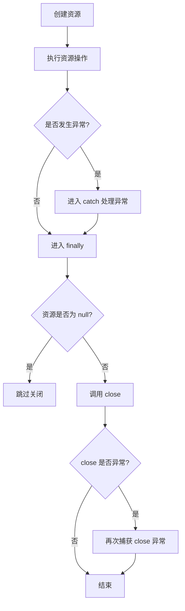

传统写法的核心问题是：**资源管理逻辑侵入了业务代码**。

代码越复杂，越容易出错。

---

## 三、AutoCloseable 是什么？

`AutoCloseable` 是 Java 7 引入的接口，位于 `java.lang` 包下。

它的定义非常简单：

```java
public interface AutoCloseable {
    void close() throws Exception;
}
```

只要一个类实现了 `AutoCloseable`，它的对象就可以被放入 `try-with-resources` 语句中，由 Java 自动调用 `close()` 方法。

---

## 四、AutoCloseable 的核心定位

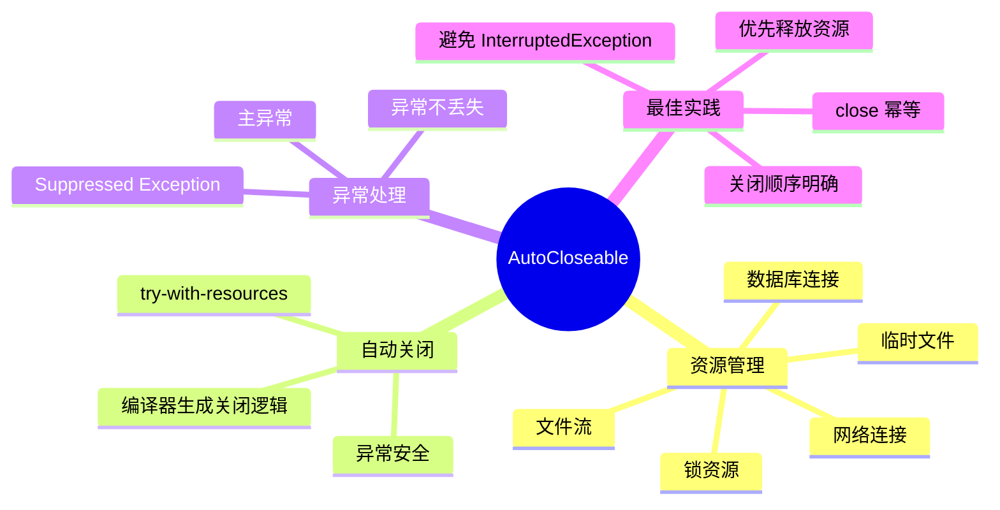

`AutoCloseable` 本身不复杂，真正强大的是它和 `try-with-resources` 的结合。

---

## 五、try-with-resources：现代 Java 的资源管理方式

使用 `try-with-resources` 后，代码可以简化为：

```java
import java.io.FileInputStream;
import java.io.IOException;

public class SafeFileReadDemo {

    public static void main(String[] args) {
        try (FileInputStream fis = new FileInputStream("data.txt")) {
            int data = fis.read();
            System.out.println(data);
        } catch (IOException e) {
            e.printStackTrace();
        }
    }
}
```

不再需要手动写 `finally`，也不再需要显式调用 `fis.close()`。

只要 `try` 代码块执行结束，不论是正常结束还是异常退出，资源都会被自动关闭。

---

## 六、try-with-resources 的执行流程

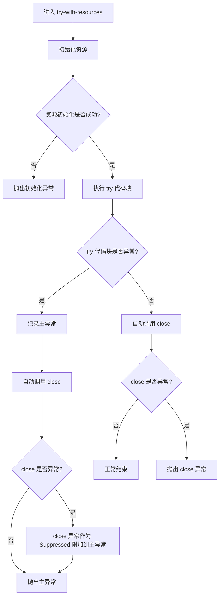

核心结论：

> `try-with-resources` 自动关闭资源，并且能保留业务异常与关闭异常，不会简单粗暴地覆盖原始异常。

---

## 七、多资源场景：关闭顺序是反向的

`try-with-resources` 支持声明多个资源。

```java
try (
    ResourceA a = new ResourceA();
    ResourceB b = new ResourceB();
    ResourceC c = new ResourceC()
) {
    System.out.println("use resources");
}
```

资源关闭顺序是：

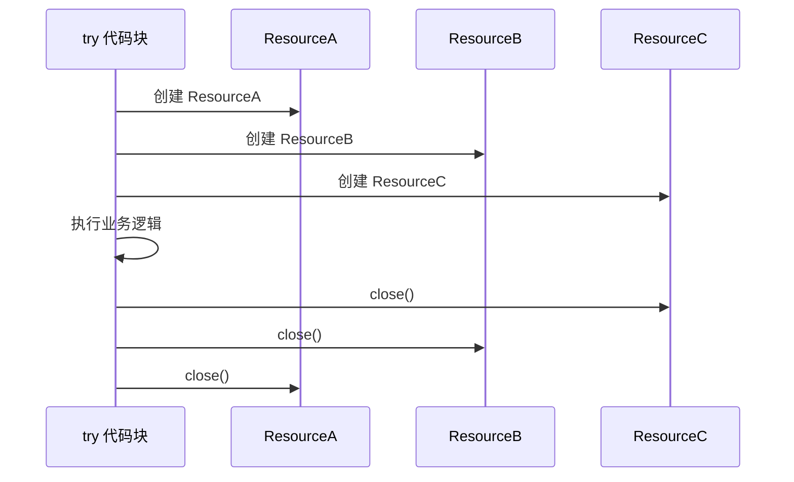

也就是说：

> 资源按照声明顺序创建，按照声明顺序的反方向关闭。

这与栈结构一致：**后创建的资源，先关闭**。

---

## 八、为什么关闭顺序要反向？

假设我们有一个包装流：

```java
try (
    FileInputStream fis = new FileInputStream("data.txt");
    BufferedInputStream bis = new BufferedInputStream(fis)
) {
    int data = bis.read();
}
```

这里 `bis` 依赖 `fis`。

如果先关闭 `fis`，再关闭 `bis`，可能导致 `bis` 在关闭时无法正确刷新或处理内部状态。

所以正确顺序是：

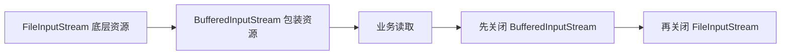

这也是 `try-with-resources` 自动采用反向关闭顺序的原因。

---

## 九、异常屏蔽问题：try-finally 的隐藏陷阱

来看一个传统 `try-finally` 的问题。

```java
public class FinallyExceptionDemo {

    public static void main(String[] args) throws Exception {
        try {
            throw new Exception("业务异常");
        } finally {
            throw new Exception("关闭异常");
        }
    }
}
```

最终抛出的异常是：

```text
Exception in thread "main" java.lang.Exception: 关闭异常
```

真正重要的 `"业务异常"` 被覆盖了。

这就是异常屏蔽。

---

## 十、try-with-resources 如何解决异常屏蔽？

`try-with-resources` 会把 `try` 块中的异常作为主异常，把 `close()` 中的异常作为被抑制异常。

示例：

```java
class MyResource implements AutoCloseable {

    public void work() throws Exception {
        System.out.println("Resource working...");
        throw new Exception("Exception from work()");
    }

    @Override
    public void close() throws Exception {
        System.out.println("Resource closing...");
        throw new Exception("Exception from close()");
    }
}

public class SuppressedExceptionDemo {

    public static void main(String[] args) {
        try (MyResource resource = new MyResource()) {
            resource.work();
        } catch (Exception e) {
            System.out.println("Main exception: " + e.getMessage());

            for (Throwable suppressed : e.getSuppressed()) {
                System.out.println("Suppressed exception: " + suppressed.getMessage());
            }
        }
    }
}
```

输出结果：

```text
Resource working...
Resource closing...
Main exception: Exception from work()
Suppressed exception: Exception from close()
```

异常关系如下：

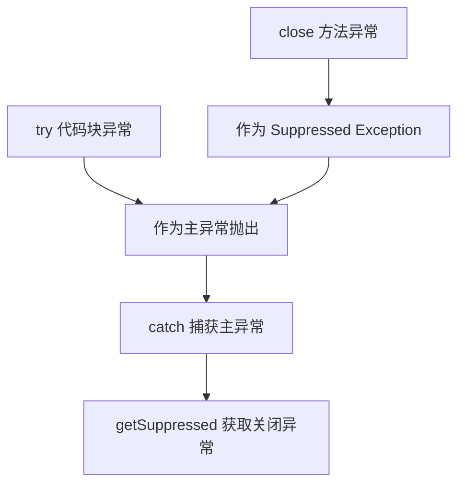

这比传统 `try-finally` 更安全，因为它不会丢失关键异常信息。

---

## 十一、AutoCloseable 与 Closeable 的关系

Java 中还有一个常见接口：`java.io.Closeable`。

它和 `AutoCloseable` 的关系如下：

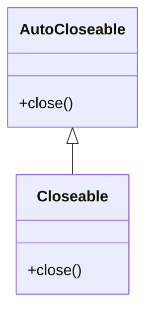

`Closeable` 继承自 `AutoCloseable`。

源码形式大致如下：

```java
public interface Closeable extends AutoCloseable {
    void close() throws IOException;
}
```

---

## 十二、AutoCloseable vs Closeable

| 对比项      | AutoCloseable      | Closeable             |
| -------- | ------------------ | --------------------- |
| 所属包      | `java.lang`        | `java.io`             |
| 引入版本     | Java 7             | Java 5                |
| 适用范围     | 通用资源               | I/O 资源                |
| close 异常 | `throws Exception` | `throws IOException`  |
| 是否继承关系   | 父接口                | 子接口                   |
| 幂等要求     | 建议幂等               | 要求幂等                  |
| 典型实现     | JDBC 连接、业务资源、锁包装器  | 输入流、输出流、Reader、Writer |

总结：

> `AutoCloseable` 是更通用的资源关闭协议，`Closeable` 是 I/O 场景下的特化版本。

---

## 十三、哪些类实现了 AutoCloseable？

常见实现包括：

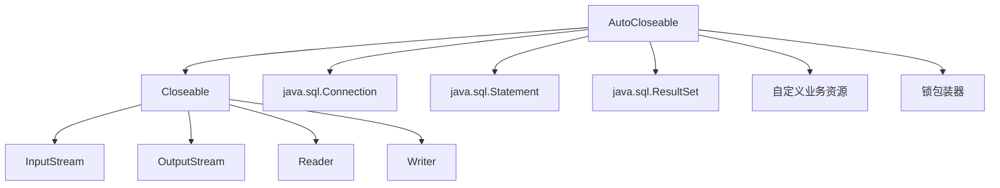

常见资源示例：

| 类型      | 示例                              |
| ------- | ------------------------------- |
| 文件输入    | `FileInputStream`               |
| 文件输出    | `FileOutputStream`              |
| 字符读取    | `BufferedReader`                |
| 字符写入    | `BufferedWriter`                |
| 数据库连接   | `Connection`                    |
| SQL 执行器 | `Statement`、`PreparedStatement` |
| 查询结果集   | `ResultSet`                     |
| 网络资源    | `Socket`                        |
| 自定义资源   | 实现 `AutoCloseable` 的业务类         |

---

## 十四、JDBC 中的典型用法

传统 JDBC 代码如果不使用 `try-with-resources`，很容易出现连接泄漏。

推荐写法如下：

```java
import java.sql.Connection;
import java.sql.DriverManager;
import java.sql.PreparedStatement;
import java.sql.ResultSet;

public class JdbcDemo {

    public static void main(String[] args) throws Exception {
        String url = "jdbc:mysql://localhost:3306/test";
        String username = "root";
        String password = "123456";

        String sql = "select id, name from user where id = ?";

        try (
            Connection connection = DriverManager.getConnection(url, username, password);
            PreparedStatement statement = connection.prepareStatement(sql)
        ) {
            statement.setLong(1, 1L);

            try (ResultSet resultSet = statement.executeQuery()) {
                while (resultSet.next()) {
                    Long id = resultSet.getLong("id");
                    String name = resultSet.getString("name");

                    System.out.println(id + " - " + name);
                }
            }
        }
    }
}
```

资源关闭顺序：

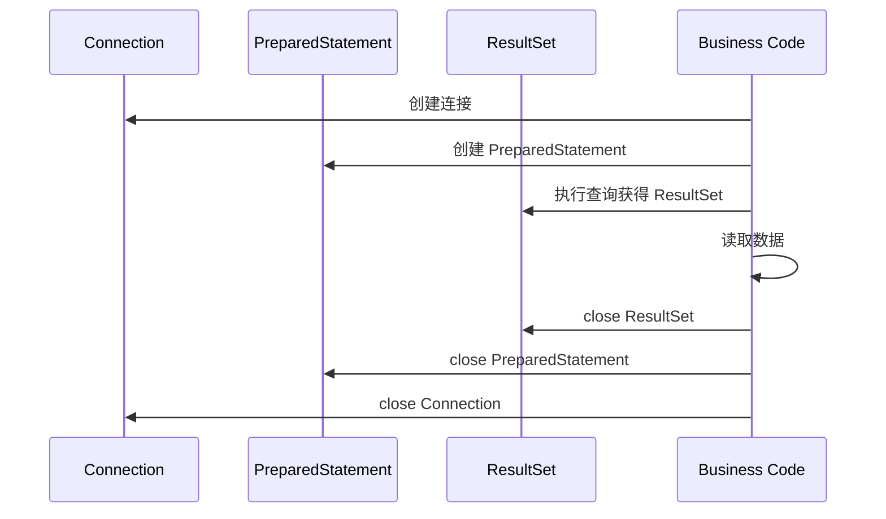

这类代码特别适合使用 `try-with-resources`，因为 JDBC 资源具有明显的层级依赖关系。

---

## 十五、自定义 AutoCloseable 资源

在实际业务中，我们也可以自己实现 `AutoCloseable`。

例如封装一个临时目录：

```java
import java.io.IOException;
import java.nio.file.Files;
import java.nio.file.Path;

public class TempDirectory implements AutoCloseable {

    private final Path path;

    public TempDirectory() throws IOException {
        this.path = Files.createTempDirectory("demo-");
    }

    public Path getPath() {
        return path;
    }

    @Override
    public void close() throws IOException {
        Files.deleteIfExists(path);
        System.out.println("Temp directory deleted: " + path);
    }
}
```

使用方式：

```java
public class TempDirectoryDemo {

    public static void main(String[] args) throws Exception {
        try (TempDirectory tempDirectory = new TempDirectory()) {
            Path path = tempDirectory.getPath();
            System.out.println("Use temp directory: " + path);
        }
    }
}
```

这类设计的好处是：**资源生命周期被限制在 try 代码块内**。

---

## 十六、生产级实现：close 方法要尽量幂等

所谓幂等，就是多次调用结果一致。

```java
resource.close();
resource.close();
resource.close();
```

理想情况下，只有第一次真正释放资源，后续调用直接返回，不应该重复释放，也不应该抛出奇怪异常。

推荐写法：

```java
import java.util.concurrent.atomic.AtomicBoolean;

public class SafeResource implements AutoCloseable {

    private final AtomicBoolean closed = new AtomicBoolean(false);

    public void use() {
        if (closed.get()) {
            throw new IllegalStateException("Resource already closed");
        }

        System.out.println("Using resource...");
    }

    @Override
    public void close() {
        if (closed.compareAndSet(false, true)) {
            release();
        }
    }

    private void release() {
        System.out.println("Release resource...");
    }
}
```

执行流程：

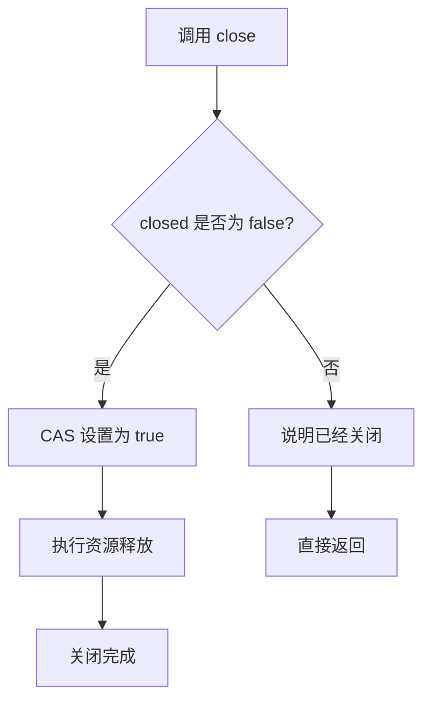

为什么推荐使用 `AtomicBoolean`？

因为资源可能在并发环境下被多个线程关闭。使用 CAS 可以避免重复释放。

---

## 十七、close 方法设计原则

生产环境中，`close()` 方法不应该随便写。

建议遵循以下原则：

| 原则                          | 说明                           |
| --------------------------- | ---------------------------- |
| 尽量幂等                        | 多次调用 `close()` 不应重复释放资源      |
| 优先释放核心资源                    | 即使后续清理失败，也要先释放最重要的资源         |
| 避免抛出 `InterruptedException` | 防止线程中断状态被异常抑制机制干扰            |
| 不要吞掉关键异常                    | 关闭失败需要日志或抛出，避免静默失败           |
| 关闭后禁止继续使用                   | 使用资源前检查是否已关闭                 |
| 多资源关闭注意顺序                   | 依赖外层资源先关闭，底层资源后关闭            |
| 避免在 close 中做重业务             | `close()` 应专注释放资源，不应承担复杂业务逻辑 |

---

## 十八、close 中异常应该怎么处理？

这取决于资源类型。

### 1. 业务可感知的关闭失败

例如写文件时，关闭输出流可能触发 flush，如果失败，意味着数据可能没有完整写入。

这类异常应该抛出：

```java
@Override
public void close() throws IOException {
    outputStream.close();
}
```

### 2. 清理型资源关闭失败

例如删除临时文件失败，可能不影响主流程，但需要记录日志。

```java
@Override
public void close() {
    try {
        Files.deleteIfExists(tempFile);
    } catch (IOException e) {
        log.warn("Failed to delete temp file: {}", tempFile, e);
    }
}
```

### 3. 多个资源关闭失败

可以手动收集异常：

```java
@Override
public void close() throws Exception {
    Exception mainException = null;

    try {
        resourceA.close();
    } catch (Exception e) {
        mainException = e;
    }

    try {
        resourceB.close();
    } catch (Exception e) {
        if (mainException != null) {
            mainException.addSuppressed(e);
        } else {
            mainException = e;
        }
    }

    if (mainException != null) {
        throw mainException;
    }
}
```

异常合并模型：

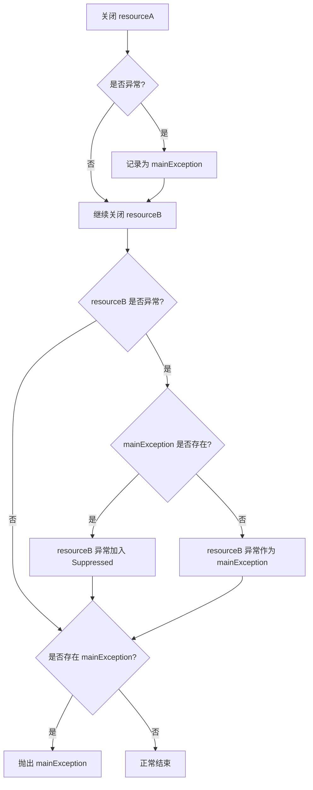

---

## 十九、AutoCloseable 也可以用于锁管理

`try-with-resources` 不只能关闭文件、数据库，也能优雅管理锁。

普通写法：

```java
lock.lock();

try {
    // 临界区
} finally {
    lock.unlock();
}
```

可以封装成：

```java
import java.util.concurrent.locks.Lock;

public class AutoLock implements AutoCloseable {

    private final Lock lock;

    public AutoLock(Lock lock) {
        this.lock = lock;
        this.lock.lock();
    }

    @Override
    public void close() {
        lock.unlock();
    }
}
```

使用方式：

```java
import java.util.concurrent.locks.ReentrantLock;

public class AutoLockDemo {

    private final ReentrantLock lock = new ReentrantLock();

    public void update() {
        try (AutoLock ignored = new AutoLock(lock)) {
            System.out.println("Update safely...");
        }
    }
}
```

这样可以让加锁和释放锁的代码更加统一。

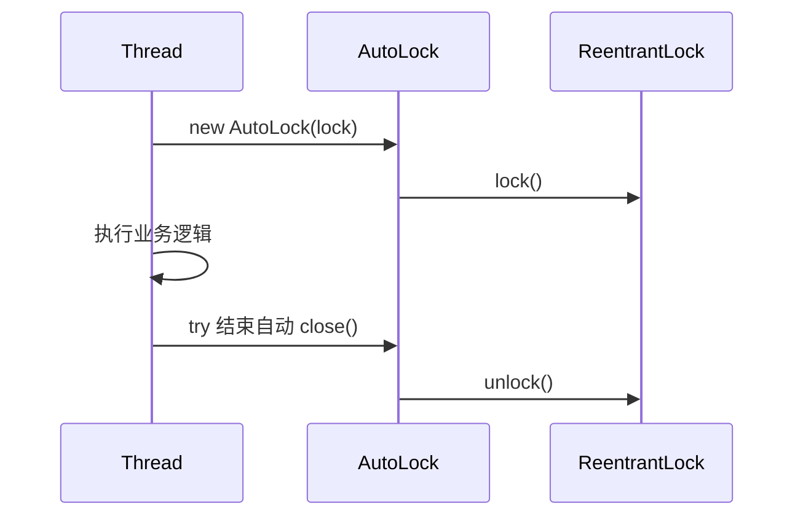

---

## 二十、AutoCloseable 的适用场景

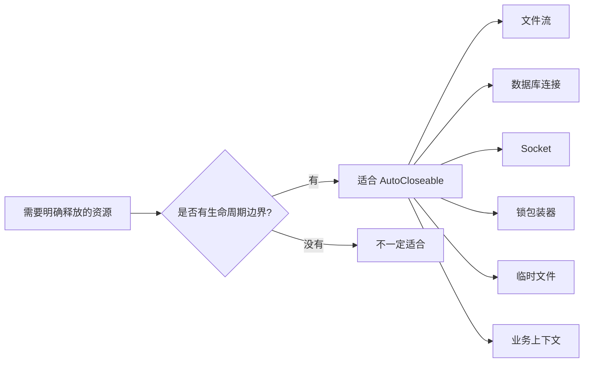

推荐使用 `AutoCloseable` 的场景：

| 场景          | 是否推荐 | 说明                       |
| ----------- | ---: | ------------------------ |
| 文件读写        |   推荐 | JDK 已大量支持                |
| JDBC 连接     |   推荐 | 可避免连接泄漏                  |
| Socket 通信   |   推荐 | 网络资源必须释放                 |
| 临时目录/临时文件   |   推荐 | 适合作用域结束后清理               |
| 锁资源包装       |   推荐 | 可减少忘记 unlock 的风险         |
| 线程池         |   谨慎 | 线程池通常生命周期较长，不适合频繁 try 关闭 |
| Spring Bean |   谨慎 | 更推荐交给 Spring 生命周期管理      |

---

## 二十一、不要滥用 AutoCloseable

虽然 `AutoCloseable` 很好用，但并不意味着所有对象都应该实现它。

不建议的场景：

```java
public class User implements AutoCloseable {
    private Long id;
    private String name;

    @Override
    public void close() {
        // 没有实际资源需要释放
    }
}
```

这种设计没有意义。

判断是否适合实现 `AutoCloseable`，可以问自己三个问题：

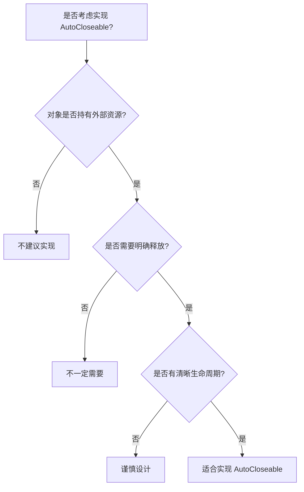

---

## 二十二、try-with-resources 的编译器本质

`try-with-resources` 是语法糖。

下面代码：

```java
try (MyResource resource = new MyResource()) {
    resource.work();
}
```

大致会被编译器转换成类似结构：

```java
MyResource resource = new MyResource();
Throwable primaryException = null;

try {
    resource.work();
} catch (Throwable t) {
    primaryException = t;
    throw t;
} finally {
    if (resource != null) {
        if (primaryException != null) {
            try {
                resource.close();
            } catch (Throwable closeException) {
                primaryException.addSuppressed(closeException);
            }
        } else {
            resource.close();
        }
    }
}
```

这也是为什么它能处理 Suppressed Exception。

---

## 二十三、Java 9 的增强：已初始化变量也能直接使用

Java 7 中必须在 `try()` 里声明资源：

```java
try (BufferedReader reader = new BufferedReader(new FileReader("data.txt"))) {
    System.out.println(reader.readLine());
}
```

Java 9 之后，如果资源变量是 final 或 effectively final，可以直接写：

```java
BufferedReader reader = new BufferedReader(new FileReader("data.txt"));

try (reader) {
    System.out.println(reader.readLine());
}
```

这种写法更灵活，但需要注意：

> 资源在 try 结束后会被关闭，即使变量还在作用域内，也不应该继续使用它。

---

## 二十四、常见错误写法

### 错误 1：try 结束后继续使用资源

```java
BufferedReader reader = new BufferedReader(new FileReader("data.txt"));

try (reader) {
    System.out.println(reader.readLine());
}

reader.readLine(); // 错误：资源已经关闭
```

---

### 错误 2：close 方法不幂等

```java
public class BadResource implements AutoCloseable {

    private boolean closed = false;

    @Override
    public void close() {
        if (closed) {
            throw new IllegalStateException("Already closed");
        }

        closed = true;
        System.out.println("close");
    }
}
```

这会导致重复关闭时出现异常。

更好的写法是：

```java
public class GoodResource implements AutoCloseable {

    private boolean closed = false;

    @Override
    public void close() {
        if (closed) {
            return;
        }

        closed = true;
        System.out.println("close");
    }
}
```

---

### 错误 3：在 close 中吞掉所有异常

```java
@Override
public void close() {
    try {
        doClose();
    } catch (Exception ignored) {
    }
}
```

这会让排查问题变得非常困难。

建议至少记录日志：

```java
@Override
public void close() {
    try {
        doClose();
    } catch (Exception e) {
        log.warn("Failed to close resource", e);
    }
}
```

---

### 错误 4：把长期对象放进 try-with-resources

```java
ExecutorService executorService = Executors.newFixedThreadPool(10);

try (executorService) {
    executorService.submit(task);
}
```

线程池通常是应用级资源，不应该在局部方法里随意关闭。

---

## 二十五、最佳实践总结

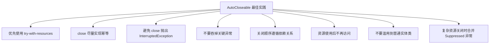

---

## 二十六、面试角度总结

如果面试官问：**AutoCloseable 是什么？**

可以这样回答：

> `AutoCloseable` 是 Java 7 引入的资源关闭接口，定义了一个 `close()` 方法。实现该接口的资源可以被放入 `try-with-resources` 中，由编译器自动生成关闭逻辑，确保资源在代码块结束时被释放。

如果继续问：**try-with-resources 比 try-finally 好在哪里？**

可以回答：

> 它可以减少样板代码，避免忘记关闭资源，并且能正确处理 try 块异常和 close 异常。当两者同时发生时，try 块异常作为主异常，close 异常会通过 `addSuppressed` 挂载到主异常上，不会像传统 finally 那样覆盖原始异常。

如果继续问：**AutoCloseable 和 Closeable 有什么区别？**

可以回答：

> `Closeable` 继承自 `AutoCloseable`，主要用于 I/O 场景。`AutoCloseable.close()` 可以抛出 `Exception`，而 `Closeable.close()` 抛出更具体的 `IOException`。此外，`Closeable` 要求关闭操作是幂等的，而 `AutoCloseable` 是建议幂等。

---

## 二十七、一张图总结全文

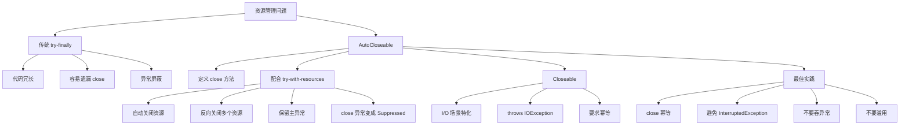

---

## 二十八、结语

`AutoCloseable` 是 Java 资源管理体系中的一个重要接口。

它本身非常简单，只有一个 `close()` 方法，但与 `try-with-resources` 结合之后，带来了非常大的工程价值：

* 代码更简洁
* 资源释放更可靠
* 异常信息更完整
* 多资源关闭顺序更安全
* 自定义资源生命周期更清晰

在现代 Java 开发中，只要遇到需要明确释放的资源，都应该优先考虑：

```java
try (Resource resource = new Resource()) {
    // use resource
}
```

而不是手写复杂的 `try-finally`。

一句话总结：

> `AutoCloseable` 让资源释放从“靠开发者自觉”变成了“由语言机制保障”。
