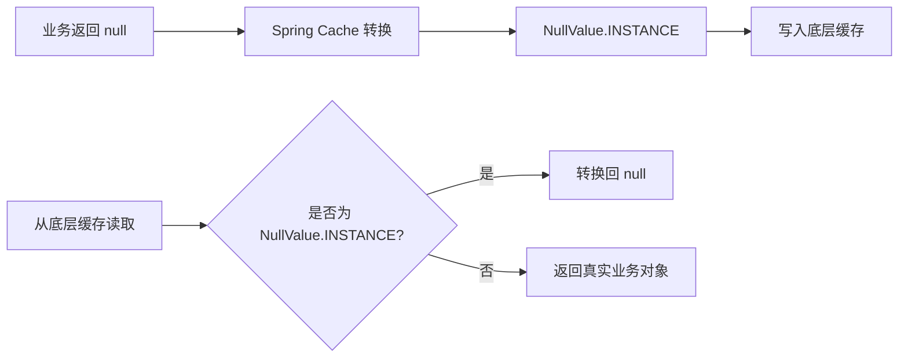
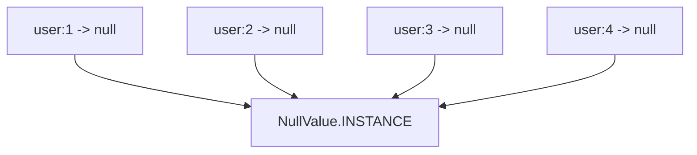
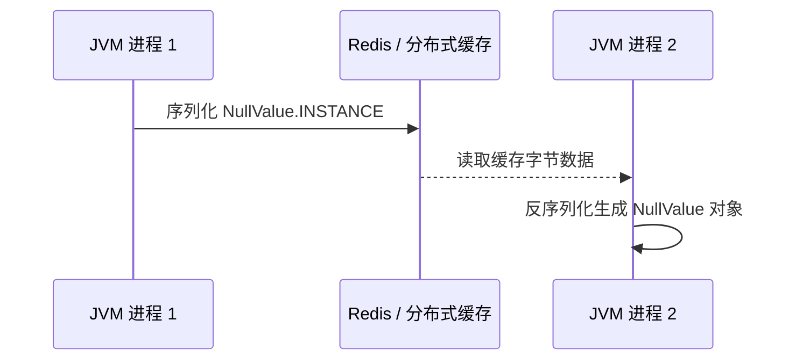
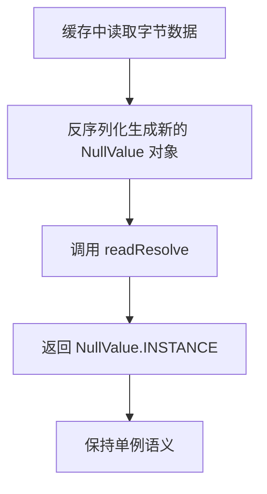
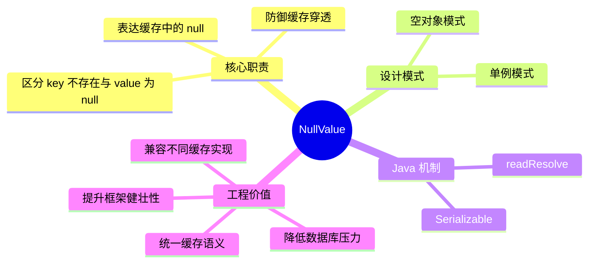
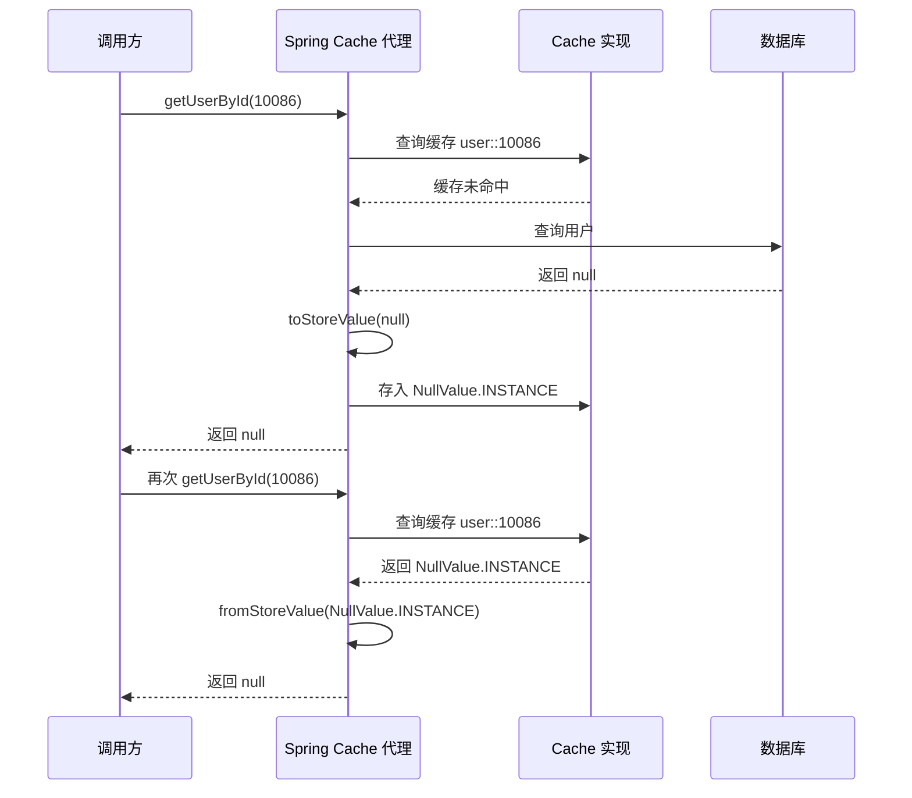
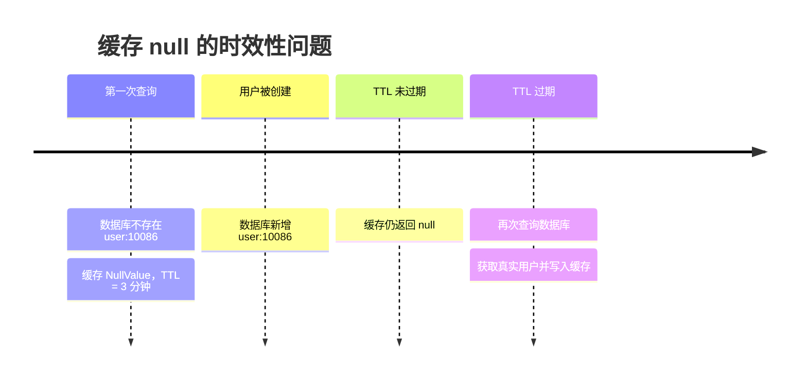
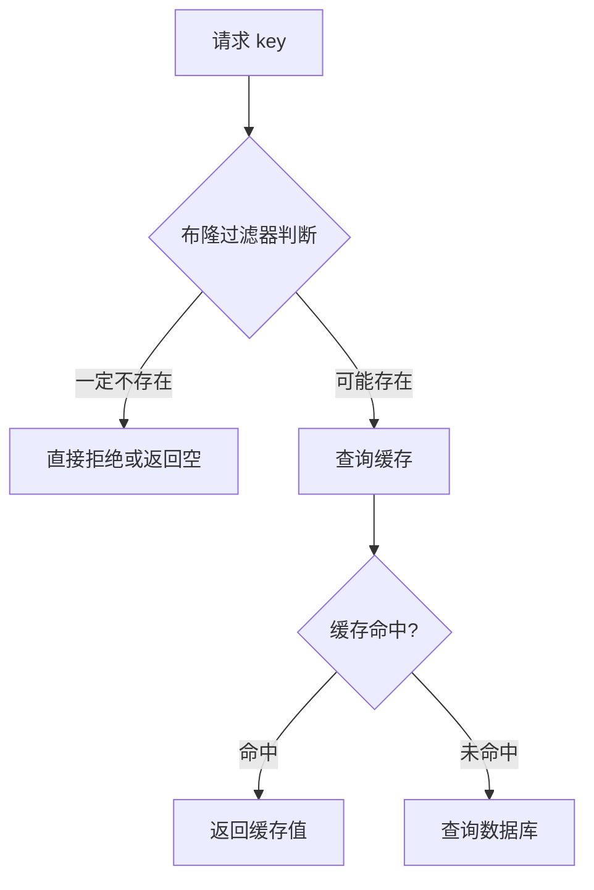
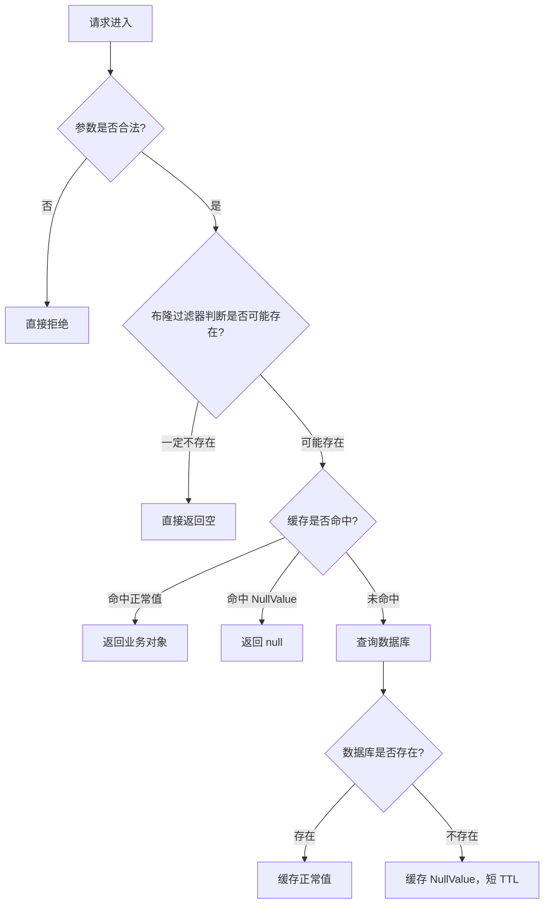
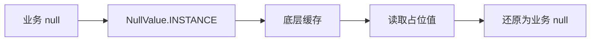

## 二、缓存穿透：不存在的数据也需要缓存

缓存穿透的本质是：

> 请求的数据在缓存中不存在，在数据库中也不存在，导致每次请求都绕过缓存直接访问数据库。

解决思路之一就是：

> 即使数据库查询结果是 `null`，也把这个 `null` 结果缓存起来。

这样后续相同请求再次访问时，就可以直接在缓存层返回 `null`，不再访问数据库。



这看起来很简单，但真正实现时会遇到一个基础问题：

> 很多缓存实现并不支持直接存储 `null`。

---

## 三、底层缓存为什么不喜欢 null？

不同缓存组件对 `null` 的处理并不一致。

### 1. ConcurrentHashMap 不允许 null

`ConcurrentHashMap` 是 Java 中常见的本地缓存底层结构之一。

但是它不允许 key 或 value 为 `null`。

例如：

```java
ConcurrentHashMap<String, Object> map = new ConcurrentHashMap<>();

map.put("user:10086", null); // 抛出 NullPointerException
```

也就是说，如果 Spring Cache 的底层实现使用类似 `ConcurrentHashMap` 的结构，就不能直接把 `null` 写进去。

---

### 2. Redis 的 null 语义存在歧义

Redis 本身可以存储空字符串、特殊标记值等。

但对于很多客户端或缓存抽象层来说：

```java
Object value = redis.get("user:10086");
```

如果返回值是 `null`，它可能表示两种含义：

| 返回结果   | 可能含义               |
| ------ | ------------------ |
| `null` | key 不存在            |
| `null` | key 存在，但业务值就是 null |

这会产生语义歧义。

缓存系统真正需要表达的是：

> 这个 key 确实存在，只是它对应的业务值为 null。

于是，Spring Cache 需要一种统一机制来表达这个语义。

---

## 四、核心方案：用 NullValue 代替真正的 null

Spring Cache 的解决方案是引入一个特殊对象：

```java
org.springframework.cache.support.NullValue
```

它的核心思想是：

> 不直接把 `null` 存入缓存，而是把 `NullValue.INSTANCE` 作为 null 的占位符存进去。

这就是典型的**空对象模式**。



这个转换过程一般可以抽象为两个方法：

| 阶段   | 方法语义             | 作用            |
| ---- | ---------------- | ------------- |
| 写入缓存 | `toStoreValue`   | 将业务值转换成缓存可存储值 |
| 读取缓存 | `fromStoreValue` | 将缓存值转换回业务值    |

伪代码如下：

```java
protected Object toStoreValue(Object userValue) {
    if (userValue == null) {
        return NullValue.INSTANCE;
    }
    return userValue;
}

protected Object fromStoreValue(Object storeValue) {
    if (storeValue == NullValue.INSTANCE) {
        return null;
    }
    return storeValue;
}
```

通过这个中间层转换，Spring Cache 既保留了 `null` 的业务语义，又绕开了底层缓存不能存 `null` 的限制。

---

## 五、NullValue 源码

`NullValue` 的源码非常短，但设计非常精巧：

```java
package org.springframework.cache.support;

import java.io.Serializable;

import org.springframework.lang.Nullable;

public final class NullValue implements Serializable {

    public static final Object INSTANCE = new NullValue();

    private static final long serialVersionUID = 1L;

    private NullValue() {
    }

    private Object readResolve() {
        return INSTANCE;
    }

    @Override
    public boolean equals(@Nullable Object other) {
        return (this == other || other == null);
    }

    @Override
    public int hashCode() {
        return NullValue.class.hashCode();
    }

    @Override
    public String toString() {
        return "null";
    }
}
```

这个类看起来只是一个简单的占位对象，但里面包含了多个重要设计点。

---

## 六、设计细节一：final 类，禁止继承

```java
public final class NullValue implements Serializable
```

`NullValue` 被声明为 `final`，说明它不允许被继承。

这样做有几个好处：

1. 防止子类破坏 `NullValue` 的语义。
2. 保证全局只有一种标准的 null 占位对象。
3. 避免因为继承导致 `equals`、`hashCode`、序列化行为变复杂。

对于这种基础设施类来说，语义稳定比扩展性更重要。

---

## 七、设计细节二：单例模式

`NullValue` 的核心是一个全局单例：

```java
public static final Object INSTANCE = new NullValue();

private NullValue() {
}
```

这里有两个关键点。

### 1. private 构造函数

```java
private NullValue() {
}
```

构造函数是私有的，外部无法通过 `new NullValue()` 创建新对象。

这可以保证外部只能使用框架提供的唯一实例。

### 2. public static final INSTANCE

```java
public static final Object INSTANCE = new NullValue();
```

`INSTANCE` 是全局唯一的 null 占位对象。

它的好处非常明显：

| 设计点        | 价值                      |
| ---------- | ----------------------- |
| 单例对象       | 所有 null 缓存值都复用同一个实例     |
| 减少对象创建     | 不会因为缓存大量 null 而创建大量占位对象 |
| 支持 `==` 判断 | 可以使用引用比较，性能更高           |
| 语义明确       | 所有 null 缓存值都指向同一个标准标记   |

示意图如下：



无论缓存多少个业务上的 `null`，底层都可以复用同一个 `NullValue.INSTANCE`。

---

## 八、设计细节三：为什么 INSTANCE 类型是 Object？

源码中这一行很有意思：

```java
public static final Object INSTANCE = new NullValue();
```

它没有写成：

```java
public static final NullValue INSTANCE = new NullValue();
```

而是写成了 `Object` 类型。

这是因为对于外部调用者来说，并不需要依赖 `NullValue` 的具体类型。

它只需要被当成一个特殊的缓存值对象即可。

这样可以弱化类型暴露，强调它只是一个内部占位符。

从语义上看：

```java
Object storeValue = NullValue.INSTANCE;
```

比下面这种更贴近缓存抽象层的设计：

```java
NullValue storeValue = NullValue.INSTANCE;
```

因为缓存中存的本来就是 `Object`。

---

## 九、设计细节四：readResolve 保证反序列化后的单例一致性

`NullValue` 中最关键的设计之一是：

```java
private Object readResolve() {
    return INSTANCE;
}
```

这个方法看起来不起眼，但它非常重要。

### 1. 问题：序列化会破坏单例

在分布式缓存场景中，`NullValue.INSTANCE` 可能会被序列化后写入 Redis、Memcached 或其他缓存系统。

例如：



如果没有特殊处理，Java 反序列化会创建一个新的 `NullValue` 对象。

这会导致：

```java
deserializedObject == NullValue.INSTANCE // false
```

一旦这个判断失败，缓存层可能无法识别这个值是 null 占位符。

---

### 2. readResolve 的作用

`readResolve()` 是 Java 序列化机制中的特殊钩子。

当对象反序列化完成后，如果类中定义了 `readResolve()` 方法，那么最终返回给调用方的不是刚刚反序列化出来的新对象，而是 `readResolve()` 的返回值。

在 `NullValue` 中：

```java
private Object readResolve() {
    return INSTANCE;
}
```

这意味着：

> 无论反序列化创建出了什么对象，最后都会被替换成全局唯一的 `NullValue.INSTANCE`。

示意图如下：



这样就保证了：

```java
deserializedObject == NullValue.INSTANCE // true
```

这对于分布式缓存非常关键。

---

## 十、设计细节五：equals 让 NullValue 在语义上等价于 null

`NullValue` 的 `equals` 方法也很有意思：

```java
@Override
public boolean equals(@Nullable Object other) {
    return (this == other || other == null);
}
```

它表达了两个语义：

| 判断条件            | 含义               |
| --------------- | ---------------- |
| `this == other` | 和自己相等            |
| `other == null` | 和真正的 null 在语义上相等 |

所以：

```java
NullValue.INSTANCE.equals(null); // true
```

这是一种非常明确的语义表达：

> NullValue 是 null 的替身，因此它在逻辑上可以被认为等价于 null。

不过要注意：

```java
null.equals(NullValue.INSTANCE); // NullPointerException
```

所以这个 `equals` 只是增强了 `NullValue` 自身的语义，不代表 Java 中的 `null` 真正具备对象行为。

在 Spring Cache 的内部判断中，更常见的还是使用引用比较：

```java
storeValue == NullValue.INSTANCE
```

这样性能更好，语义也更准确。

---

## 十一、设计细节六：hashCode 保持稳定

源码中还有一个 `hashCode`：

```java
@Override
public int hashCode() {
    return NullValue.class.hashCode();
}
```

这个实现保证了 `NullValue` 的哈希值稳定。

它没有使用对象地址相关的默认 `hashCode`，而是直接使用类对象的 `hashCode`。

这符合它的单例语义：

> NullValue 代表的是一种固定语义，而不是某个普通对象实例。

---

## 十二、设计细节七：toString 返回 "null"

```java
@Override
public String toString() {
    return "null";
}
```

这个实现主要是为了日志、调试和可读性。

当打印 `NullValue.INSTANCE` 时：

```java
System.out.println(NullValue.INSTANCE);
```

输出结果是：

```text
null
```

这样可以让它在日志中看起来更接近真实的 `null` 语义。

---

## 十三、NullValue 的整体设计图

可以把 `NullValue` 的设计拆成下面几个层次：



它不是一个复杂类，但它解决的是一个非常真实的工程问题。

---

## 十四、缓存 null 与不缓存 null 的对比

| 方案           | 行为                    | 优点        | 缺点        |
| ------------ | --------------------- | --------- | --------- |
| 不缓存 null     | 每次查询不存在数据都访问数据库       | 实现简单      | 容易产生缓存穿透  |
| 直接缓存 null    | 尝试把 null 写入缓存         | 语义直观      | 很多缓存实现不支持 |
| 缓存特殊字符串      | 例如存 `"NULL"`          | 简单粗暴      | 容易污染业务语义  |
| 使用 NullValue | 用统一对象代表 null          | 语义清晰，框架友好 | 需要转换逻辑    |
| 使用 Optional  | 缓存 `Optional.empty()` | 类型语义明确    | 侵入业务返回类型  |

Spring Cache 选择 `NullValue` 的原因在于：

> 它既不改变业务方法的返回类型，又能兼容底层缓存实现，还能保持缓存抽象的一致性。

---

## 十五、完整调用链示意

以一个 `@Cacheable` 方法为例：

```java
@Cacheable(cacheNames = "user", key = "#id")
public User getUserById(Long id) {
    return userRepository.findById(id).orElse(null);
}
```

当用户不存在时，调用链大致如下：



这条链路的关键点是：

> 缓存中存的是 `NullValue.INSTANCE`，但业务方法看到的仍然是 `null`。

这就是缓存抽象层的价值。

---

## 十六、工程实践：缓存 null 时一定要设置较短 TTL

虽然缓存 null 可以防御缓存穿透，但它也有副作用。

假设第一次查询 `userId = 10086` 时数据库中不存在该用户，于是缓存了 null。

如果后来这个用户被创建了，但缓存里的 null 还没有过期，那么查询仍然会返回 null。

这会造成短时间的数据不一致。

所以实践中通常建议：

> null 缓存可以做，但 TTL 应该比正常数据短。

例如：

| 缓存内容      | 建议 TTL    |
| --------- | --------- |
| 正常用户数据    | 30 分钟     |
| null 占位数据 | 1 到 5 分钟  |
| 热点数据      | 可适当更长     |
| 强一致数据     | 谨慎缓存或主动失效 |

示意图：



因此，缓存 null 的关键不是“能不能缓存”，而是：

> 缓存多久，以及数据变化后如何失效。

---

## 十七、和布隆过滤器的关系

防御缓存穿透还有一种常见方案：**布隆过滤器**。

布隆过滤器通常用于判断一个 key 是否可能存在。



`NullValue` 和布隆过滤器并不是互斥关系。

它们关注点不同：

| 方案        | 主要作用                   | 适合场景       |
| --------- | ---------------------- | ---------- |
| NullValue | 缓存已经查询过的不存在结果          | 普通业务缓存     |
| 布隆过滤器     | 在请求进入缓存/数据库前提前拦截非法 key | 大规模恶意穿透防御  |
| 参数校验      | 拦截明显非法请求               | ID 格式、范围校验 |
| 限流        | 控制异常流量                 | 高并发保护      |

更稳妥的工程方案通常是组合使用：



---

## 十八、自己实现一个简化版 NullValue

即使不使用 Spring Cache，也可以借鉴这个设计。

例如：

```java
import java.io.Serializable;

public final class MyNullValue implements Serializable {

    public static final Object INSTANCE = new MyNullValue();

    private static final long serialVersionUID = 1L;

    private MyNullValue() {
    }

    private Object readResolve() {
        return INSTANCE;
    }

    @Override
    public boolean equals(Object other) {
        return this == other || other == null;
    }

    @Override
    public int hashCode() {
        return MyNullValue.class.hashCode();
    }

    @Override
    public String toString() {
        return "null";
    }
}
```

再封装缓存读写逻辑：

```java
public class SimpleCacheAdapter {

    private final Map<String, Object> cache = new ConcurrentHashMap<>();

    public void put(String key, Object value) {
        cache.put(key, toStoreValue(value));
    }

    public Object get(String key) {
        Object value = cache.get(key);
        return fromStoreValue(value);
    }

    private Object toStoreValue(Object value) {
        return value == null ? MyNullValue.INSTANCE : value;
    }

    private Object fromStoreValue(Object value) {
        return value == MyNullValue.INSTANCE ? null : value;
    }
}
```

测试一下：

```java
SimpleCacheAdapter cache = new SimpleCacheAdapter();

cache.put("user:10086", null);

Object value = cache.get("user:10086");

System.out.println(value); // null
```

底层缓存中实际存储的是 `MyNullValue.INSTANCE`，但外部调用者看到的仍然是 `null`。

---

## 十九、常见误区

### 误区一：Redis 能存空字符串，所以不需要 NullValue

空字符串不等于 null。

```text
""     表示一个真实存在的空字符串
null   表示没有值
```

如果把 null 简单替换成空字符串，会污染业务语义。

例如用户名为空字符串和用户不存在，显然不是同一个概念。

---

### 误区二：缓存 null 一定是好事

缓存 null 可以减少数据库压力，但也可能导致短时间数据不一致。

所以要控制 TTL，并且在数据创建、更新、删除时做好缓存失效。

---

### 误区三：NullValue 是业务对象

`NullValue` 不应该出现在业务层。

它应该只存在于缓存抽象层内部。

业务代码应该继续面对真实的返回值：

```java
User user = userService.getById(id);
```

而不是：

```java
Object value = cache.get(key);
if (value == NullValue.INSTANCE) {
    // 业务层处理 NullValue
}
```

如果业务层开始感知 `NullValue`，说明缓存抽象泄漏了。

---

## 二十、面试视角：NullValue 能考察什么？

`NullValue` 这个类很小，但它背后能考察很多 Java 基础和工程能力。

| 考察点             | 说明                    |
| --------------- | --------------------- |
| 缓存穿透            | 为什么不存在的数据也要缓存         |
| 缓存抽象            | 如何屏蔽不同底层缓存差异          |
| 空对象模式           | 用特殊对象替代 null          |
| 单例模式            | 全局唯一占位对象              |
| Java 序列化        | `readResolve` 如何保证单例  |
| equals/hashCode | 对象相等性与哈希语义            |
| 工程权衡            | null 缓存 TTL、数据一致性、副作用 |

如果面试中被问到“Spring Cache 如何缓存 null”，可以这样回答：

> Spring Cache 不会直接把 null 写到底层缓存，而是使用 `NullValue.INSTANCE` 作为 null 的占位符。写入缓存时，通过 `toStoreValue` 将 null 转换成 `NullValue.INSTANCE`；读取缓存时，通过 `fromStoreValue` 再把 `NullValue.INSTANCE` 转换回 null。这样既能兼容不支持 null 的底层缓存实现，也能表达“key 存在但 value 为 null”的语义。`NullValue` 本身是单例，并通过 `readResolve` 保证反序列化后仍然是同一个实例。

---

## 二十一、总结

`NullValue` 是 Spring Cache 中一个非常小但非常有代表性的设计。

它解决的问题并不复杂：

> 如何在不支持 null 的缓存中表达 null？

但它的解决方式非常工程化：

```mermaid
flowchart LR
    A[业务 null] --> B[NullValue.INSTANCE]
    B --> C[底层缓存]
    C --> D[读取占位值]
    D --> E[还原为业务 null]
```

它的核心价值可以总结为四点：

1. **用空对象模式表达 null 语义**
   不直接存储 `null`，而是存储一个特殊占位对象。

2. **用单例模式降低成本**
   所有 null 缓存值都复用同一个 `NullValue.INSTANCE`。

3. **用 readResolve 保证序列化安全**
   即使经过分布式缓存的序列化和反序列化，也能恢复为同一个单例对象。

4. **用缓存抽象屏蔽底层差异**
   业务层仍然面对 `null`，底层缓存则存储可识别的占位值。

`NullValue` 的优秀之处不在于代码复杂，而在于它把一个容易出错的边界问题封装得足够稳定、清晰和可靠。

这正是优秀框架代码值得学习的地方：

> 好的设计，往往不是把问题变复杂，而是把复杂性藏在正确的位置。
