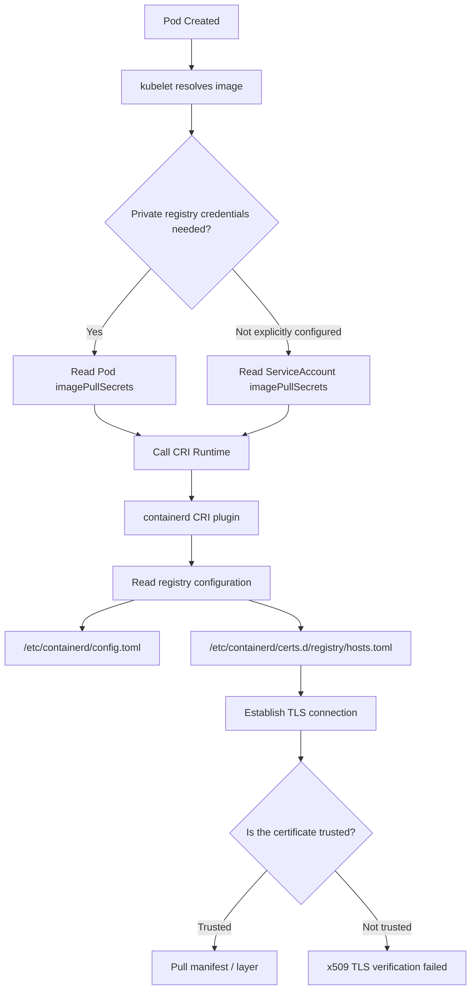
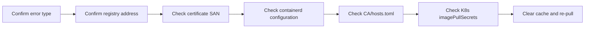
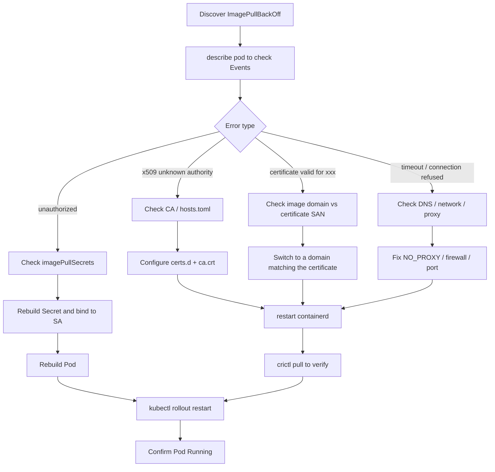

## 1. Background: Why Does containerd Fail to Pull Images?

When using private image registries such as Harbor, Nexus, or Docker Registry in a Kubernetes cluster, you often encounter errors like:

```text
failed to pull image "harbor.example.com/project/app:v1":
rpc error: code = Unknown desc = failed to pull and unpack image:
failed to resolve reference:
failed to do request:
Head "https://harbor.example.com/v2/project/app/manifests/v1":
tls: failed to verify certificate: x509: certificate signed by unknown authority
```

These problems appear to be "TLS certificate verification failures," but the root causes typically fall into these categories:

| Problem Type | Typical Symptom | Root Cause |
| -------- | ----------------------------------------------- | -------------------------------------------- |
| Untrusted CA | `x509: certificate signed by unknown authority` | Private registry uses a self-signed certificate; the node does not trust that CA |
| Domain Mismatch | `certificate is valid for xxx, not yyy` | Image address does not match the certificate SAN |
| Configuration Not Applied | Changed config but still getting errors | containerd did not read `hosts.toml` or `config.toml` |
| Port/Path Error | Registry with port has no effect | `certs.d` directory name is missing the port |
| K8s Credential Error | Still `unauthorized` after TLS is fixed | `imagePullSecrets` or ServiceAccount is bound to stale credentials |
| Node Cache Interference | Manual pull succeeds, Pod still fails | kubelet/containerd cache or stale image layers remain |

---

## 2. Understanding the Chain: What Layers Does a Pod Go Through to Pull an Image?



Therefore, solving the problem requires looking beyond just the Kubernetes YAML or just the containerd config. The correct troubleshooting order should be:



---

## 3. Quick Fix: Temporarily Skip TLS Verification

> Applicable scenarios: test environments, temporary demo environments, short-lived internal registries.
> Not recommended for production, as it bypasses certificate validation and exposes you to man-in-the-middle attacks.

### 1. Check the containerd Version

```bash
containerd --version
```

Typical output:

```text
containerd github.com/containerd/containerd 1.7.x
```

You can also check the configuration file version:

```bash
sudo head -n 20 /etc/containerd/config.toml
```

---

### 2. Recommended Approach: Use `certs.d + hosts.toml`

Newer versions of containerd recommend reading per-registry configuration via `config_path`.

#### containerd 1.x Configuration

Edit `/etc/containerd/config.toml`:

```toml
version = 2

[plugins."io.containerd.grpc.v1.cri".registry]
  config_path = "/etc/containerd/certs.d"
```

#### containerd 2.x Configuration

The CRI plugin path differs in containerd 2.x:

```toml
version = 3

[plugins."io.containerd.cri.v1.images".registry]
  config_path = "/etc/containerd/certs.d"
```

---

### 3. Create the Registry Configuration Directory

Assuming the private registry address is:

```text
harbor.example.com
```

Create the directory:

```bash
sudo mkdir -p /etc/containerd/certs.d/harbor.example.com
```

If the registry uses a port, for example:

```text
harbor.example.com:8443
```

The directory must also include the port:

```bash
sudo mkdir -p /etc/containerd/certs.d/harbor.example.com:8443
```

---

### 4. Write `hosts.toml` to Skip Verification

Example without a port:

```toml
server = "https://harbor.example.com"

[host."https://harbor.example.com"]
  capabilities = ["pull", "resolve", "push"]
  skip_verify = true
```

Example with a port:

```toml
server = "https://harbor.example.com:8443"

[host."https://harbor.example.com:8443"]
  capabilities = ["pull", "resolve", "push"]
  skip_verify = true
```

Complete command:

```bash
sudo tee /etc/containerd/certs.d/harbor.example.com/hosts.toml > /dev/null <<'EOF'
server = "https://harbor.example.com"

[host."https://harbor.example.com"]
  capabilities = ["pull", "resolve", "push"]
  skip_verify = true
EOF
```

---

### 5. Restart containerd

```bash
sudo systemctl daemon-reload
sudo systemctl restart containerd
sudo systemctl status containerd --no-pager
```

Verify:

```bash
sudo crictl pull harbor.example.com/project/app:v1
```

Watch logs in real time:

```bash
sudo journalctl -u containerd -f -n 100
```

---

## 4. Production Recommendation: Configure a Trusted CA Certificate

Skipping TLS verification is only a temporary measure. In production, nodes should trust the private registry's CA.

### 1. Obtain the Registry CA Certificate

Typically exported from the Harbor/Nexus admin console, named:

```text
ca.crt
```

You can also export the certificate chain from the server:

```bash
openssl s_client -showcerts -connect harbor.example.com:443 < /dev/null
```

Check the certificate subject and SAN:

```bash
openssl x509 -in ca.crt -noout -subject -issuer -dates
```

---

### 2. Place It in the containerd Certificate Directory

```bash
sudo mkdir -p /etc/containerd/certs.d/harbor.example.com
sudo cp ca.crt /etc/containerd/certs.d/harbor.example.com/ca.crt
```

For a registry with a port:

```bash
sudo mkdir -p /etc/containerd/certs.d/harbor.example.com:8443
sudo cp ca.crt /etc/containerd/certs.d/harbor.example.com:8443/ca.crt
```

---

### 3. Write a Production-Grade `hosts.toml`

Do not skip TLS verification:

```toml
server = "https://harbor.example.com"

[host."https://harbor.example.com"]
  capabilities = ["pull", "resolve", "push"]
  ca = "ca.crt"
```

Complete command:

```bash
sudo tee /etc/containerd/certs.d/harbor.example.com/hosts.toml > /dev/null <<'EOF'
server = "https://harbor.example.com"

[host."https://harbor.example.com"]
  capabilities = ["pull", "resolve", "push"]
  ca = "ca.crt"
EOF
```

The directory structure should look like:

```text
/etc/containerd/certs.d/
└── harbor.example.com
    ├── ca.crt
    └── hosts.toml
```

---

### 4. Sync to the System Trust Store

This step is not required by containerd, but is strongly recommended so that `curl`, `openssl`, and system services all trust the same CA.

#### Debian / Ubuntu

```bash
sudo cp ca.crt /usr/local/share/ca-certificates/harbor.example.com.crt
sudo update-ca-certificates
```

#### RHEL / CentOS / Rocky Linux / AlmaLinux

```bash
sudo cp ca.crt /etc/pki/ca-trust/source/anchors/harbor.example.com.crt
sudo update-ca-trust
```

#### Arch Linux

```bash
sudo trust anchor --store ca.crt
sudo update-ca-trust
```

---

### 5. Restart and Verify

```bash
sudo systemctl restart containerd
sudo crictl pull harbor.example.com/project/app:v1
```

If this succeeds, containerd is correctly reading the CA configuration.

---

## 5. Legacy Configuration: Why `registry.configs` Is No Longer Recommended

Many older tutorials modify `/etc/containerd/config.toml` directly:

```toml
[plugins."io.containerd.grpc.v1.cri".registry.configs."harbor.example.com".tls]
  insecure_skip_verify = true
```

This approach works in older versions, but newer versions recommend using:

```toml
[plugins."io.containerd.grpc.v1.cri".registry]
  config_path = "/etc/containerd/certs.d"
```

Then managing each registry's TLS, CA, mirrors, headers, and capabilities through:

```text
/etc/containerd/certs.d/<registry>/hosts.toml
```

Comparison of the two approaches:

| Configuration Method | Applicability | Advantages | Disadvantages |
| -------------------- | ----- | ------------- | -------------------- |
| `registry.configs` | Legacy version compatibility | Simple and direct | No longer recommended; bloats the main config |
| `certs.d/hosts.toml` | Recommended for new versions | Per-registry independent config; clean structure | Slightly more complex initial setup |
| System CA Trust | General enhancement | System tools can also verify | containerd still needs correct config to read it |

---

## 6. Kubernetes Layer: Cleaning Up Stale imagePullSecrets

After resolving TLS issues, if you still see:

```text
unauthorized: authentication required
```

or:

```text
pull access denied
```

the problem has shifted from "certificate trust" to "registry authentication."

---

### 1. Check the Pod's ServiceAccount

```bash
kubectl get pod <pod-name> -n <namespace> -o jsonpath='{.spec.serviceAccountName}'
```

If not explicitly specified, the default is:

```text
default
```

---

### 2. Check Whether the ServiceAccount Is Bound to a Stale Secret

```bash
kubectl get sa default -n <namespace> -o yaml
```

Look for:

```yaml
imagePullSecrets:
  - name: old-registry-secret
```

If a stale Secret is bound here, Pods may keep using incorrect credentials.

---

### 3. Clear Stale Credentials from the default ServiceAccount

```bash
kubectl patch sa default -n <namespace> -p '{"imagePullSecrets": []}'
```

A better approach is to bind the correct Secret:

```bash
kubectl patch sa default -n <namespace> -p '{"imagePullSecrets": [{"name": "harbor-secret"}]}'
```

---

### 4. Recreate the Correct docker-registry Secret

```bash
kubectl delete secret harbor-secret -n <namespace> --ignore-not-found
```

```bash
kubectl create secret docker-registry harbor-secret \
  --docker-server=harbor.example.com \
  --docker-username='<username>' \
  --docker-password='<password>' \
  --docker-email='admin@example.com' \
  -n <namespace>
```

Declare it explicitly in the Pod:

```yaml
apiVersion: v1
kind: Pod
metadata:
  name: test-private-image
spec:
  imagePullSecrets:
    - name: harbor-secret
  containers:
    - name: app
      image: harbor.example.com/project/app:v1
```

Or inherit it uniformly through a ServiceAccount:

```yaml
apiVersion: v1
kind: ServiceAccount
metadata:
  name: app-sa
imagePullSecrets:
  - name: harbor-secret
```

---

## 7. Node Layer: Clearing containerd / kubelet Cache

If you have fixed both TLS and credentials but the Pod still fails, clear the node-side cache.

### 1. Delete Failed Image Cache

```bash
sudo crictl images | grep harbor.example.com
```

Delete a specific image:

```bash
sudo crictl rmi <IMAGE_ID>
```

Or delete by image name:

```bash
sudo crictl rmi harbor.example.com/project/app:v1
```

---

### 2. Check Whether containerd Can Pull Directly

```bash
sudo crictl pull harbor.example.com/project/app:v1
```

If `crictl pull` succeeds but the Pod fails, prioritize investigating Kubernetes Secret, ServiceAccount, namespace, and image name.

If `crictl pull` fails, prioritize investigating containerd TLS, CA, hosts.toml, proxy, and DNS.

---

### 3. Check for kubelet Residual Configuration

Some environments may have leftover kubelet or historical Docker configuration:

```bash
sudo ls -al /var/lib/kubelet/
sudo ls -al /root/.docker/
```

Common residual files:

```text
/root/.docker/config.json
/var/lib/kubelet/config.json
```

Clean them carefully:

```bash
sudo rm -f /root/.docker/config.json
sudo rm -f /var/lib/kubelet/config.json
```

Then restart the services:

```bash
sudo systemctl restart containerd
sudo systemctl restart kubelet
```

---

## 8. Proxy Issues: Internal Registry Incorrectly Forwarded

If the node is configured with a proxy, containerd's access to the internal Harbor may be forwarded to an external proxy, causing certificate or connection errors.

### 1. Check the containerd Service Proxy

```bash
systemctl show containerd --property=Environment
```

Check the systemd drop-in:

```bash
sudo systemctl cat containerd
```

You may find:

```ini
Environment="HTTP_PROXY=http://proxy.example.com:7890"
Environment="HTTPS_PROXY=http://proxy.example.com:7890"
Environment="NO_PROXY=localhost,127.0.0.1"
```

---

### 2. Add the Internal Registry to NO_PROXY

```ini
[Service]
Environment="HTTP_PROXY=http://proxy.example.com:7890"
Environment="HTTPS_PROXY=http://proxy.example.com:7890"
Environment="NO_PROXY=localhost,127.0.0.1,10.0.0.0/8,192.168.0.0/16,harbor.example.com"
```

Reload:

```bash
sudo systemctl daemon-reload
sudo systemctl restart containerd
```

---

## 9. Complete Troubleshooting Command Checklist

### 1. Basic Information

```bash
containerd --version
crictl version
kubectl version --client
```

```bash
systemctl status containerd --no-pager
systemctl status kubelet --no-pager
```

---

### 2. Check containerd Configuration

```bash
sudo grep -n "config_path" /etc/containerd/config.toml
sudo grep -n "registry" /etc/containerd/config.toml
```

```bash
sudo tree /etc/containerd/certs.d
```

If `tree` is not available:

```bash
sudo find /etc/containerd/certs.d -maxdepth 3 -type f -print
```

---

### 3. Check Certificates

```bash
openssl s_client -showcerts -connect harbor.example.com:443 < /dev/null
```

```bash
openssl x509 -in /etc/containerd/certs.d/harbor.example.com/ca.crt -noout -subject -issuer -dates
```

---

### 4. Check Kubernetes Events

```bash
kubectl describe pod <pod-name> -n <namespace>
```

```bash
kubectl get events -n <namespace> --sort-by=.lastTimestamp
```

---

### 5. Check Secrets

```bash
kubectl get secret -n <namespace>
```

```bash
kubectl get secret harbor-secret -n <namespace> -o yaml
```

---

### 6. Check ServiceAccounts

```bash
kubectl get sa default -n <namespace> -o yaml
```

```bash
kubectl get sa app-sa -n <namespace> -o yaml
```

---

### 7. Check containerd Logs

```bash
sudo journalctl -u containerd -n 200 --no-pager
```

Watch in real time:

```bash
sudo journalctl -u containerd -f -n 100
```

---

## 10. Recommended Fix Workflow



---

## 11. Production Deployment Recommendations

### 1. Do Not Use `skip_verify` Long-Term in Production

`skip_verify = true` skips TLS verification. While it quickly resolves pull failures, it also means the node will not validate the certificate source, creating a security risk.

In production, use:

```toml
ca = "ca.crt"
```

Instead of:

```toml
skip_verify = true
```

---

### 2. Use a Consistent Registry Domain; Do Not Mix IP and Domain

Incorrect example:

```yaml
image: 192.168.1.10/project/app:v1
```

But the certificate is issued to:

```text
harbor.example.com
```

This will cause certificate validation to fail.

Recommended: use consistently:

```yaml
image: harbor.example.com/project/app:v1
```

---

### 3. Registry with Port Must Keep Paths Consistent

If the image address is:

```text
harbor.example.com:8443/project/app:v1
```

Then the directory must be:

```text
/etc/containerd/certs.d/harbor.example.com:8443/
```

Not:

```text
/etc/containerd/certs.d/harbor.example.com/
```

---

### 4. Configure Every Node

containerd runs on every Worker node. Configuring CA only on the Master node is pointless; every node that actually pulls images must be configured with:

```text
/etc/containerd/config.toml
/etc/containerd/certs.d/<registry>/hosts.toml
/etc/containerd/certs.d/<registry>/ca.crt
```

Consider using Ansible, SaltStack, Terraform, cloud-init, or a DaemonSet for automated distribution.

---

## 12. Final Recommended Directory Structure

Using `harbor.example.com` as an example:

```text
/etc/containerd/
├── config.toml
└── certs.d
    └── harbor.example.com
        ├── ca.crt
        └── hosts.toml
```

`config.toml`:

```toml
version = 2

[plugins."io.containerd.grpc.v1.cri".registry]
  config_path = "/etc/containerd/certs.d"
```

`hosts.toml`:

```toml
server = "https://harbor.example.com"

[host."https://harbor.example.com"]
  capabilities = ["pull", "resolve", "push"]
  ca = "ca.crt"
```

---

## 13. One-Click Check Script

Save as:

```bash
check-containerd-registry.sh
```

Contents:

```bash
#!/usr/bin/env bash
set -euo pipefail

REGISTRY="${1:-}"

if [[ -z "$REGISTRY" ]]; then
  echo "Usage: $0 <registry-host[:port]>"
  echo "Example: $0 harbor.example.com"
  echo "Example: $0 harbor.example.com:8443"
  exit 1
fi

echo "========== containerd Version =========="
containerd --version || true

echo
echo "========== containerd Service Status =========="
systemctl status containerd --no-pager || true

echo
echo "========== config_path Configuration =========="
sudo grep -n "config_path" /etc/containerd/config.toml || echo "config_path not found"

echo
echo "========== Registry Configuration Directory =========="
CONF_DIR="/etc/containerd/certs.d/${REGISTRY}"
if [[ -d "$CONF_DIR" ]]; then
  sudo find "$CONF_DIR" -maxdepth 2 -type f -print
else
  echo "Directory does not exist: $CONF_DIR"
fi

echo
echo "========== hosts.toml =========="
if [[ -f "$CONF_DIR/hosts.toml" ]]; then
  sudo cat "$CONF_DIR/hosts.toml"
else
  echo "$CONF_DIR/hosts.toml not found"
fi

echo
echo "========== CA Certificate =========="
if [[ -f "$CONF_DIR/ca.crt" ]]; then
  openssl x509 -in "$CONF_DIR/ca.crt" -noout -subject -issuer -dates || true
else
  echo "$CONF_DIR/ca.crt not found"
fi

echo
echo "========== TLS Handshake Test =========="
HOST="${REGISTRY%%:*}"
PORT="443"
if [[ "$REGISTRY" == *:* ]]; then
  PORT="${REGISTRY##*:}"
fi

openssl s_client -connect "${HOST}:${PORT}" -servername "$HOST" < /dev/null 2>/dev/null | \
  openssl x509 -noout -subject -issuer -dates || true

echo
echo "========== Recent containerd Logs =========="
sudo journalctl -u containerd -n 50 --no-pager || true
```

Run:

```bash
chmod +x check-containerd-registry.sh
./check-containerd-registry.sh harbor.example.com
```

---

## 14. Pitfall Summary

| Pitfall | Symptom | Solution |
| --------------------- | -------------- | ------------------------------- |
| Pulling by IP, but certificate is issued to a domain | Certificate domain mismatch | Change image address to the domain in the certificate |
| `certs.d` directory missing the port | Configuration has no effect | Directory name must exactly match the registry host |
| Only configured Master, not Worker | Pod still fails to pull | Every node that schedules Pods must be configured |
| Forgot to restart containerd | No change after modification | `systemctl restart containerd` |
| Secret in wrong namespace | `unauthorized` | Secret must be in the same namespace as the Pod |
| default SA bound to stale Secret | Keeps using old credentials | Patch ServiceAccount or recreate Secret |
| System proxy configured | Connection timeout or certificate error | Configure `NO_PROXY` |
| Stale image layers remain | Retry still fails | `crictl rmi` to clear image cache |

---

## 15. Conclusion

containerd TLS certificate verification issues cannot be simply dismissed as "certificate errors." They typically span three layers:

1. **Runtime layer**: Whether containerd reads the correct `config_path`, `hosts.toml`, and `ca.crt`.
2. **System layer**: Whether the node system trusts the private CA; whether proxy, DNS, and ports are functioning correctly.
3. **Kubernetes layer**: Whether Pods, ServiceAccounts, and imagePullSecrets use the correct credentials.

For test environments, you can use:

```toml
skip_verify = true
```

as a quick fix.

For production, use:

```toml
ca = "ca.crt"
```

to establish a complete trust chain.

The ultimate validation criterion is simply:

```bash
sudo crictl pull harbor.example.com/project/app:v1
```

If `crictl pull` succeeds, the containerd layer is working; if the Pod still fails, continue checking Kubernetes Secret, ServiceAccount, and namespace bindings.

Following the "certificate -> containerd -> credentials -> cache -> Pod" troubleshooting order will reliably resolve TLS and authentication issues when pulling from private image registries.
