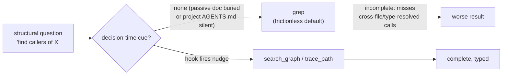
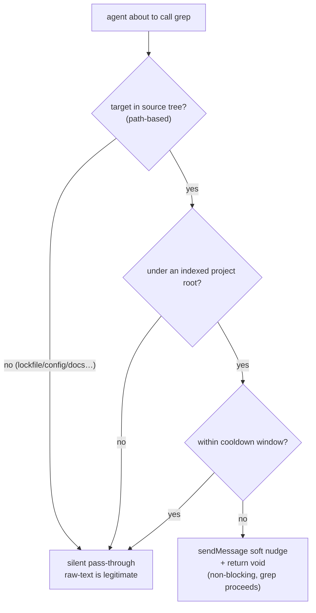

# Graph-First over Grep: A Decision-Time Nudge Hook for Tool Choice

When you equip a coding agent with a structural code-knowledge-graph (codebase-memory-mcp, built on hybrid LSP and able to resolve functions, classes, callers, callees, routes, and cross-service edges), a default assumption creeps in: **the agent will reach for it.** It does not. On a fully indexed project where the graph was fresh and strictly better than text search, the agent touched it in only 4 of 30 sessions — and called `grep` 158 times.

The index was not the problem. It was fresh, complete, and reachable. The real problem: **at the instant the agent decided to "search," nothing cued it that a better tool existed.** Passive documentation ("use the graph first, grep is forbidden") does not hold — 26 of 30 sessions ignored it.

This article documents a fix that runs in production: **a non-blocking `PreToolUse` hook that injects a one-line nudge at the `grep` decision point.** It is not a tool tutorial — it focuses on *diagnosis and flow*: why capability goes unactivated, why strengthening rules is the wrong intervention layer, how the soft nudge is designed, how to detect structural lookups by path rather than pattern, and how to verify the fix from probe to runtime.

> Suggested reading order: grasp the puzzle and the data first, then the root cause and "why rules fail," and finally keep the hook design, API contract, and verification as a reusable engineering pattern.

---

## 1. The Puzzle: Capability Present, Activation Absent

`codebase-memory-mcp` indexes a project into a hybrid-LSP knowledge graph. For structural questions — *find definition, who calls X, what does X call, dead code, module boundaries* — it is strictly faster and more complete than `grep`, because it resolves cross-file type relationships that text search cannot see.

The audited project was fully indexed. Yet across 30 sessions the agent behaved as if the graph did not exist. The index itself was fine:

| Check | Result |
| --- | --- |
| Indexed? | Yes — **34,361 nodes / 120,215 edges / 82 MB** |
| Fresh? | Yes — the graph's `head_sha` **exactly equals** the live `git HEAD`, status `ready` |
| Reachable? | Yes — surfaces as the `xd://mcp__codebase_memory_mcp_*` device family |

So the question was never *"can the agent use it?"* but *"**why doesn't it?**"*



---

## 2. The Audit: Real grep vs Graph Usage

Instrumenting the session transcripts (each tool call recorded as a `tool_execution_start` event carrying `toolName` and args) gave an unambiguous answer:

| Metric | Count |
| --- | --- |
| `grep` calls | **158** |
| `codebase-memory` calls | **22** |
| `grep` that was **structural** (find def / callers / callees / usage) | **~80% (116–128)** |
| `grep` that was legitimately **raw-text** (lockfiles, i18n, config, docs, migrations) | ~10–15% |
| Sessions that used the graph **at all** | **4 / 30** |
| Of those 22 graph calls, how many were in a *single* architecture-exploration session | **18** |

**The concentration is the tell.** The graph was reached during one deliberate architecture pass and then forgotten for 26 sessions — including heavy refactors that ran 16–28 `grep` calls each, almost all structural: *"find all callers of some Mapper,"* *"find the buildErrorMessage definition,"* *"find all Promise.all usages in the management layer."* Each was a job `trace_path` / `search_graph` does better.

---

## 3. Root Cause: Passive Docs Lose to the Pretrained Prior

Ranked by impact:

1. **No decision-time enforcement (dominant).** The anti-grep mandate lived only as *passive prose* — in the global `AGENTS.md`, plus an *on-demand* managed skill whose frontmatter carried neither `globs` nor `alwaysApply` (so it never auto-fires; it must be invoked by name). Worse, the *project* `AGENTS.md` — the doc actually consulted — was **literally silent** on codebase-memory. So at the "find callers" instant, the only active cue was the model's pretrained prior toward `grep`. The data shows passive prose does not override that prior.
2. **Tool-surface friction (contributing).** `grep` is one first-class call with a single `pattern` argument. A graph query is *hand-build a JSON object → write it to an `xd://` device*. Higher activation cost reliably loses to the path of least resistance.
3. **Staleness / unindexed — ruled out** (see the table above).

---

## 4. Why "Just Write a Better Rule" Fails

The instinct is to strengthen the `AGENTS.md` wording or add an `alwaysApply` TTSR rule. For *this* problem, both are the wrong layer:

- **Rules inject per-turn or per-file-path, not per-tool-call.** An `alwaysApply` rule re-injects the reminder *every turn* — exactly the "passive doc repeated" that the data shows gets tuned out. A `globs`-scoped rule fires when a matching file is *edited/read*, not when a `grep` is about to run.
- **The defect is at the tool-decision instant**, and only a `PreToolUse` hook sits there. 26 of 30 sessions ignoring explicit *"forbidden"* prose is the proof that more prose is not the intervention.

The right unit of enforcement is: *"when the agent is about to call `grep` on a source tree, surface the better option — without blocking."*

---

## 5. The Fix: A Soft PreToolUse Hook

### 5.1 Surface decision — soft, not hard

omp's `tool_call` event (the `PreToolUse` equivalent) supports **two** channels, and they are easy to conflate:

| Channel | Mechanism | Effect |
| --- | --- | --- |
| **Hard** (return type) | `return { block, reason }` | Blocks the call; the agent must retry past it. Risk: false-positive blocks on legitimate `grep`. |
| **Soft** (side-effect) | `pi.sendMessage({ customType, content, display, attribution })` **+ `return void`** | Injects a message that **participates in LLM context**; the call proceeds. Zero false-positive risk. |

The soft channel is the non-obvious one. The `ToolCallEventResult` return type is block-oriented, so a naive reading concludes "PreToolUse can only block." But `pi.sendMessage()` sits on the base `HookAPI`, callable from *any* event including `tool_call`, and is explicitly *"for when you want the LLM to see the message content."* Returning `void` means "no block — proceed." That combination is a true non-blocking nudge.

We chose **soft**: it honours "remind, don't block," never breaks a legitimate raw-text `grep`, and the worst case is a silent no-op, never a stuck tool.

### 5.2 Detection — path-based, not pattern-based

The first predicate draft required a code file extension or a non-empty pattern. The unit test caught it immediately: it flagged only **59** of the structural greps and *silenced 73 that were the exact anti-pattern* — because real anti-pattern greps scope to a **source directory** (`backend-spring/src`) with **no file extension** and frequently an **empty `pattern`** field. Correct detection is **path-based**: a `grep` scoped to a source tree *is* the structural signal.

| Predicate version | Structural flagged | Verdict |
| --- | --- | --- |
| extension OR pattern required | 59 / 158 | **broken** — misses directory-scoped greps |
| **path-to-source-tree AND not raw-text** | **116 / 158** | matches the manual baseline (~127); the gap is conservative (whole-repo / module-root-without-`src`) |

### 5.3 The allowlist

| `grep` target | Behaviour |
| --- | --- |
| `backend-spring/src`, `console/src`, `management/src`, `shared/*/src` | **Nudge** (structural) |
| `**/pnpm-lock.yaml`, `**/*.json/yaml/toml`, `**/*.md`, `migrations/`, `locales/`, `i18n/`, `wiki/`, `dist/build/target/`, `node_modules/`, `.omp/`, `*.log`, `*.css/scss`, `pom.xml`, `docker-compose*`, `tsconfig*`, `vite.config*` | **Silent** (raw-text is legitimate) |

Raw-text wins even *inside* a source tree (e.g. `management/src/i18n/locales` → silent). The nudge also carries a 10-minute cooldown (anti-spam) and is scoped to indexed project roots only.



---

## 6. Implementation: Hook Code and API Contract

The hook deploys at `hooks/pre/graph-first-nudge.ts` (omp auto-loads `hooks/pre/*.ts` at **session start** — not hot-reloaded, so a newly added hook is invisible to a running session and must be verified in a fresh one). Below is a public, sanitized implementation: indexed roots are discovered from the CLI at runtime, with no machine-specific paths hardcoded.

```ts
import type { HookAPI } from "@oh-my-pi/pi-coding-agent/extensibility/hooks";

// One-line reminder: prefer the graph for structural lookups, grep only as raw-text fallback.
const REMINDER =
  "codebase-memory nudge: this project is indexed in the code knowledge graph. " +
  "For STRUCTURAL lookups — find definition, callers, callees, references, type, " +
  "module/package boundary — use the graph FIRST, then grep only as a raw-text fallback:\n" +
  "  - xd://mcp__codebase_memory_mcp_search_graph    (query or name_pattern -> qualified_name)\n" +
  "  - xd://mcp__codebase_memory_mcp_trace_path       (function_name + direction inbound/outbound)\n" +
  "  - xd://mcp__codebase_memory_mcp_get_architecture (clusters / layers / packages)\n" +
  "Raw-text grep on lockfiles, config, docs, i18n, migrations, logs, or generated output is fine.";

// Path-based: a grep scoped to a source tree IS the structural signal.
// Adjust these source-tree prefixes to your project layout.
const SOURCE_TREE_RE = /(backend-spring[\\/]src|console[\\/]src|management[\\/]src|shared[\\/].*?[\\/]src)/;
const RAW_TEXT_RE =
  /(lock|\.json|\.yaml|\.yml|\.toml|\.env|\.mdx?|migrations|locales|i18n|wiki|[\\/]dist[\\/]|[\\/]build[\\/]|[\\/]target[\\/]|node_modules|\.omp|sessions|\.log|\.css|\.scss|pom\.xml|docker-compose|tsconfig|vite\.config|\.sh$)/;

let indexedRoots: string[] = [];   // filled at runtime from cli list_projects
let lastNudgeAt = 0;
const COOLDOWN_MS = 10 * 60 * 1000;

function norm(p: string) {
  return p.replace(/\\/g, "/").replace(/^~/, process.env.HOME ?? "~");
}
function isUnderIndexedRoot(cwd: string) {
  const c = norm(cwd);
  return indexedRoots.some(r => { const root = norm(r); return c === root || c.startsWith(root + "/"); });
}
function isStructuralGrep(input: Record<string, unknown>) {
  const path = norm(String(input.path ?? "")), pattern = String(input.pattern ?? "");
  if (!SOURCE_TREE_RE.test(path)) return false;
  if (RAW_TEXT_RE.test(path) || RAW_TEXT_RE.test(pattern)) return false;
  return true;
}

export default function graphFirstNudge(pi: HookAPI) {
  // Refresh indexed roots on session start (no hardcoded machine paths)
  pi.on("session_start", async () => {
    try {
      const res = await pi.exec("codebase-memory-mcp", ["cli", "list_projects"]);
      const roots = [...String(res.stdout ?? "").matchAll(/"root_path"\s*:\s*"([^"]+)"/g)].map(m => m[1]);
      if (roots.length) indexedRoots = roots;
    } catch { /* keep empty list; the hook degrades to no-op */ }
  });

  pi.on("tool_call", async (event, ctx) => {
    try {
      if (event.toolName !== "grep") return;
      if (!isStructuralGrep(event.input)) return;
      if (!isUnderIndexedRoot(ctx.cwd)) return;
      if (Date.now() - lastNudgeAt < COOLDOWN_MS) return;
      lastNudgeAt = Date.now();
      pi.sendMessage({                     // SOFT: participates in LLM context, non-blocking
        customType: "graph-first-nudge",
        content: REMINDER, display: true, attribution: "agent",
      });
      // return void -> grep proceeds normally
    } catch { /* NEVER let the nudge break grep */ }
  });
}
```

### 6.1 The hook API contract (verified against the type definitions)

| Symbol | Shape | Source |
| --- | --- | --- |
| `ToolCallEvent` | `{ type:"tool_call", toolName, toolCallId, input: Record<string,unknown> }` | `hooks/types.d.ts` |
| `HookContext.cwd` | `string` — project root | `hooks/types.d.ts` |
| `ToolCallEventResult` | `{ block?, reason? }` — the **hard** path | `shared-events.d.ts` |
| `HookAPI.sendMessage` | injects a `CustomMessageEntry` that **participates in LLM context**; `triggerTurn` defaults `false` (safe mid-loop) | `hooks/types.d.ts` |
| Hook location | `hooks/{pre,post}/*.ts` (global) / `.omp/hooks/{pre,post}/*.ts` (project); loaded at session start | `hooks/loader.d.ts` |

Two findings that are easy to get wrong: (1) `sendMessage` from `tool_call` is the **soft** channel — it is canonical in the package, not untested; (2) hooks load at **startup**, so a newly added hook is invisible to the running session and must be verified in a fresh one.

---

## 7. Verification: From Probe to Runtime

The fix must be proven in three layers, none skippable:

```bash
# 1. Premise proof: the graph instantly returns what grep was hunting
#    (example: search a Mapper symbol, get qualified results with file + line range)
codebase-memory-mcp cli search_graph '{"project":"PROJECT","query":"SomeMapper"}'

# 2. Logic proof: a mock-pi self-probe asserts against synthetic events
bun /tmp/graph-first-nudge.probe.mjs   # expect: 6/6 PASS

# 3. Runtime proof: in a fresh session, grep a source tree and confirm the nudge renders
#    and grep still returns (non-blocking end-to-end confirmation)
```

1. **Mock-pi self-probe** — imports the factory, registers handlers against a mock `pi`, fires six synthetic `tool_call` events. Result: **6 / 6 PASS** (structural → nudge; lockfile / i18n-under-source / non-grep / unindexed-cwd / cooldown-repeat → silent).
2. **Premise proof** — calling `search_graph` on a Mapper symbol returned **106** qualified results instantly (file + line range), the exact information three historical `grep` calls were hunting.
3. **Live runtime test** — in a fresh session, running `grep class.*Service` against `backend-spring/src` triggered the hook: the `graph-first-nudge` block rendered (`[P] graph-first-nudge`) **and** the full grep results came through underneath — non-blocking confirmed end-to-end.

---

## 8. Lessons and Conclusion

The hardest part of this fix was not writing the hook — it was recognizing that **capability is not activation.** Five lessons worth keeping:

- **Capability ≠ activation.** A superior, fresh, reachable tool is worthless if nothing cues it at the decision instant. Measure *usage*, not *availability*.
- **Decision-time hooks beat passive docs.** When the model's pretrained prior points one way, prose — even *"forbidden"* prose — does not hold (26 / 30 sessions). Put the cue where the decision is made.
- **Prefer the soft channel unless you need teeth.** `sendMessage` + `return void` steers without ever risking a false-positive block. Reach for `{block, reason}` only when a wrong call is genuinely unrecoverable.
- **Detect on the stable signal.** For "is this `grep` structural?" the stable signal is the *path scope*, not the pattern text or file extension — real anti-pattern greps name a directory and leave the pattern empty.
- **Verify by execution, then by runtime.** A mock-pi probe proves logic; only a real session proves load + delivery. Ship fail-soft so the gap between them is harmless.

> The pattern generalizes beyond "graph over grep." Anywhere the model has a stronger tool but keeps retreating to a weaker default — LSP navigation over text search, running tests before commit, type-aware refactor over hand edits — the same decision-time soft nudge applies. The unit of intervention is always *the instant the decision is made*.
