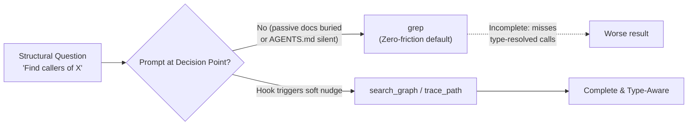

# Knowledge Graph Over Grep: Correcting Tool Selection with Decision-Point Soft-Nudge Hooks

When we equip a coding Agent with a structured codebase knowledge graph (`codebase-memory-mcp`, built on hybrid LSP capable of parsing functions, classes, callers, callees, routes, and cross-service edges), we often assume a default question: **Will the Agent actively use it?** The answer is surprisingly no. In a fully indexed, fresh project where the graph is strictly superior to text search, the Agent accessed the graph only 4 times across 30 sessions while invoking `grep` 158 times.

The problem was not the index. The index was fresh, complete, and reachable. The real issue: **at the moment the Agent decided to "search", nothing prompted it that a better tool existed.** Passive documentation ("Please prefer graph, do not grep") fails to hold up—26 out of 30 sessions completely ignored it.

This post documents a production-ready fix: **using a non-blocking `PreToolUse` hook to inject a soft-nudge line at the `grep` decision point**.

---

## 1. The Puzzle: Capabilities Ready, Yet Unused

`codebase-memory-mcp` indexes a project into a hybrid LSP knowledge graph. For structural questions—*find definitions, who calls X, what X calls, dead code, module boundaries*—it is strictly faster and more complete than `grep` because it resolves cross-file type relationships invisible to text search.

The audited project was fully indexed. Yet across 30 sessions, the Agent acted as if the graph did not exist:

| Check Item | Result |
| --- | --- |
| Is it indexed? | Yes—**34,361 nodes / 120,215 edges / 82 MB** |
| Is it fresh? | Yes—graph `head_sha` **exactly matched** live `git HEAD`, status `ready` |
| Is it reachable? | Yes—exposed via the `xd://mcp__codebase_memory_mcp_*` device family |

So the question was never "Can the Agent use it?", but **"Why isn't it using it?"**

```mermaid
flowchart LR
  Q["Structural Question<br/>'Find callers of X'"] --> DEC{"Prompt at Decision Point?"}
  DEC -- "No (passive docs buried<br/>or AGENTS.md silent)" --> GRP["grep<br/>(Zero-friction default)"]
  DEC -- "Hook triggers soft nudge" --> GPH["search_graph / trace_path"]
  GRP -. "Incomplete: misses<br/>type-resolved calls" .-> R1["Worse result"]
  GPH --> R2["Complete & Type-Aware"]
```

---

## 2. Data Audit: Real Usage of grep vs. Knowledge Graph

Instrumentation of session transcripts (logging every tool invocation as a `tool_execution_start` event with `toolName` and args) yielded an unambiguous answer:

| Metric | Count |
| --- | --- |
| `grep` invocations | **158** |
| `codebase-memory` invocations | **22** |
| Proportion of **structural** grep (definitions/callers/usages) | **~80% (116–128 times)** |
| Proportion of valid **raw text** grep (lockfiles, i18n, configs, docs) | ~10–15% |
| Sessions using the graph | **4 / 30** |
| Concentration of graph calls in a **single** architecture session | **18 times** |

**Concentration is the key signal.** The graph was only accessed during a deliberate architecture audit, and subsequently forgotten in 26 sessions—including major refactoring tasks that ran 16–28 `grep` calls each for purely structural queries: *"Find all callers of Mapper X"*, *"Find definition of buildErrorMessage"*. Every single one was a task `trace_path` / `search_graph` was built for.

---

## 3. Root Cause: Passive Documentation Cannot Defeat Pre-training Priors

Ranking root causes by impact:

1. **Lack of enforcement at decision points (Primary Cause).** Requirements to avoid grep existed only as *passive prose* in global `AGENTS.md`, plus an *on-demand* managed skill with no `globs` or `alwaysApply`. In the project-level `AGENTS.md`—the one actually read—codebase-memory was **never mentioned**.
2. **Tool surface friction (Secondary Cause).** `grep` is a first-class call with a single `pattern` argument. Graph queries required constructing a JSON payload directed to `xd://` devices.
3. **Stale/Unindexed—Excluded**.

---

## 4. Why "Writing a Better Rule" Fails

The intuitive reaction is strengthening `AGENTS.md` wording or adding an `alwaysApply` TTSR rule. For this issue, both are at the wrong layer:

- **Rules inject per-turn or per-file-path, not per-tool-call.** An `alwaysApply` rule re-injects every turn—the exact passive prose data proved model tuning ignores. A `globs`-scoped rule triggers when files are *read or edited*, not when `grep` is about to execute.
- **The flaw occurs at the moment of tool decision**, where only a `PreToolUse` hook resides.

The correct unit of intervention: *"When the Agent is about to invoke `grep` on the source tree, surface better options—without blocking."*

---

## 5. Solution: A Soft PreToolUse Hook

### 5.1 Channel Selection: Soft, Not Hard

OMP's `tool_call` event supports two channels:

| Channel | Mechanism | Effect |
| --- | --- | --- |
| **Hard** (Return Type) | `return { block, reason }` | Blocks invocation; Agent must retry. Risk: false positives blocking valid raw-text `grep`. |
| **Soft** (Side Effect) | `pi.sendMessage(...)` + `return void` | Injects a message into LLM context; execution continues normally. Zero false-positive risk. |

We chose **Soft**: it respects the philosophy of "prompting rather than blocking", never interrupting valid raw-text greps while ensuring the LLM receives the guidance.

### 5.2 Path-Based Detection Over Pattern Matching

Predicates filtering by file extensions miss searches scoped to source directories (`backend-spring/src`) without explicit extensions or with empty pattern fields. Proper detection relies on **path-based scoping**: a `grep` restricted to a source tree is intrinsically a structural search signal.

---

## 6. Summary

This pattern extends beyond "Graph over Grep". Whenever an Agent relies on a weaker default despite having a superior tool, a decision-point soft-nudge hook offers a non-disruptive, highly effective intervention mechanism.
