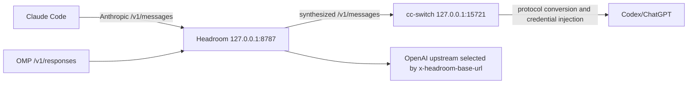

This page records the coexistence contract of one specific Headroom provider proxy deployment: Claude Code does not hand requests directly to cc-switch; they pass through Headroom first. OMP's Responses path still enters the same Headroom entry and is routed by request-level upstream selection. The conclusion is that **a request can have only one synthesis owner**: Headroom owns compression and synthesis, while cc-switch only performs Anthropic↔OpenAI protocol conversion and credential injection. This page is a version-dependent `provisional` synthesis, not the default behavior of every Headroom or cc-switch release.

## Chain and responsibility boundary



| Path | Protocol and entry | Headroom's responsibility | Downstream stage | What must not be inferred |
| --- | --- | --- | --- | --- |
| OMP | OpenAI `/v1/responses`, entry `127.0.0.1:8787` | Synthesizes and routes by request-level information | The OpenAI upstream specified by `x-headroom-base-url` | OMP discovery is necessarily taken over by Headroom |
| Claude Code | Anthropic `/v1/messages`, entry `127.0.0.1:8787` | Synthesizes request content | cc-switch `127.0.0.1:15721` performs protocol conversion and credential injection | cc-switch handles compression |

Therefore, no other application-level compression bridge may be layered on the same provider. Otherwise a request would be synthesized twice in sequence, and savings, cache prefixes, and failure reasons become hard to attribute.

## cc-switch reconciler

cc-switch proxy mode writes `ANTHROPIC_BASE_URL` in `~/.claude/settings.json` to `http://127.0.0.1:15721`. With `HEADROOM_CC_SWITCH_RECONCILE=1` enabled, the reconciler builds the following recovery chain:

1. Read the `15721` written by cc-switch and save it as Headroom's current Anthropic upstream; this upstream is read per request and does not require a proxy restart.
2. Rewrite `ANTHROPIC_BASE_URL` back to `http://127.0.0.1:8787`, keeping the other environment fields, hooks, and plugin configuration.
3. Skip the write when already 8787, avoiding watcher self-triggering.
4. When switching to Claude Official (`{"env":{}}`), allow direct connections by default to protect OAuth; requests are forced through Headroom only when `HEADROOM_CC_SWITCH_ROUTE_OFFICIAL=1` is explicitly set.

Credentials pass through unchanged from Claude Code → Headroom → cc-switch; Headroom neither reads nor stores real Codex credentials. OMP's `/v1/responses` and Claude Code's `/v1/messages` use different protocol routes and do not share Anthropic upstream state.

## systemd security trade-off

The original unit used `ProtectHome=tmpfs` to hide the user home; to let the reconciler rewrite `settings.json`, add:

```ini
BindPaths=%h/.claude
```

`BindPaths` is a writable bind by default, so the real `~/.claude` is mapped into the service's mount namespace. The cost is that the proxy service can read session history, `.mcp.json`, and other files in that directory. The service still runs as the current user and keeps restrictions such as `NoNewPrivileges`, `ProtectSystem=strict`, `PrivateDevices`, and `UMask=0077`; this is not a privilege escalation, but it is a genuine reduction in defense-in-depth relative to `ProtectHome=tmpfs`.

### Rollback

1. Stop new Claude Code requests so the reconciler is not triggered again during rollback.
2. Remove `HEADROOM_CC_SWITCH_RECONCILE=1` from the configuration.
3. Remove the unit's `BindPaths=%h/.claude`, reinstall/reload the user unit, and restart the service.
4. Restore the original `ANTHROPIC_BASE_URL` (`http://127.0.0.1:15721`) in `~/.claude/settings.json` from a configuration backup.

Keep a configuration backup before rolling back; do not overwrite the user's hooks, plugins, or other environment fields with an empty object.

## Minimal verification

Verification must cover both the runtime upstream and the real request chain:

```bash
curl --fail --silent http://127.0.0.1:8787/admin/upstream
```

The expected core result is `cc_switch_reconcile=true` with `anthropic` and `captured_upstream` both pointing to `http://127.0.0.1:15721`. Then confirm that both of the following exist in `var/headroom/logs/proxy.log`:

```text
path=http://127.0.0.1:15721/v1/messages
path=/v1/messages status=200
```

Seeing only `/health` or a single HTTP 200 is not enough to prove the request reached cc-switch; reading `settings.json` alone cannot replace runtime upstream evidence either. The project's `./bin/validate` should also end with `PASS validation`.

## Evidence and uncertainty

- **Source facts**: pinned project commits and same-day deidentified runtime observations confirm the two paths, the reconciler's rewrite direction, the security cost of `BindPaths`, and the successful `/v1/messages → 127.0.0.1:15721` request chain.
- **This page's synthesis**: reduces the coexistence problem to "Headroom single synthesis + cc-switch protocol/credential conversion", and verifies static configuration, runtime upstream, actual requests, and systemd isolation separately.
- **Uncertainty**: ports, environment variables, settings schema, log fields, and the rewrite timing of Headroom/cc-switch may change across versions; this page claims no cross-version compatibility and does not generalize a single deployment's evidence into an official default contract.

## Related pages

- [Headroom single-port synthesis](/en/note/headroom-single-port-evolution)
- [Headroom route persistence synthesis](/en/note/omp-headroom-persistence)
- [Headroom 0.34 compression and retrieval contract](/en/note/headroom-compress-retrieve-contract)
