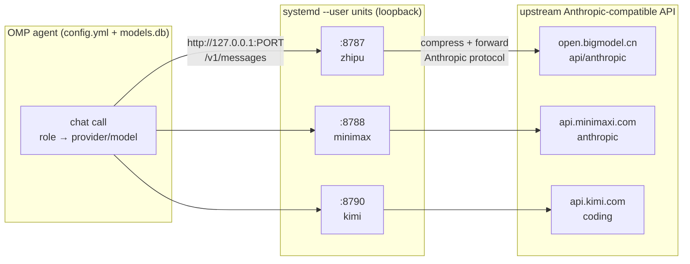
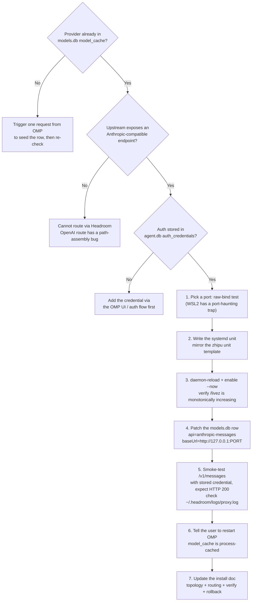

# Headroom × OMP: Onboarding and Governing Custom Model Providers

When you orchestrate multiple large-language-model providers through an agent framework, you quickly hit an awkward reality: protocols, auth, and caching capabilities vary wildly across providers. The CN-region providers (Zhipu, MiniMax, Kimi) mostly expose Anthropic-compatible endpoints, but their support for prompt caching, context compression, and tool-result caching is uneven; sending traffic directly to the upstream means giving up a middle layer where you could enforce uniform governance.

This article documents a setup that runs in production: **routing custom model providers into the OMP (Oh My Pi) agent harness through a Headroom compression proxy layer**. It is not an install guide — it focuses on the *flow*: how to onboard, route, constrain, operate, and where the traps are.

> Suggested reading order: grasp the overall architecture and the four artifacts first, then walk the onboarding flow, and finally keep the constraint-enforcement and operations traps as a day-to-day reference.

---

## 1. Background: Why a Compression Proxy Layer?

OMP is an agent orchestration framework that routes requests to different provider/model pairs based on *roles*. Ideally, every provider would offer:

- **Prompt caching** — repeated system prompts and tool definitions stop being re-billed;
- **Context compression** — over-long conversations auto-compress while keeping the signal;
- **Tool-result caching** — identical tool calls reuse results, cutting latency and cost.

In practice, not every upstream supports these natively. Headroom fills the gap: it is a local reverse proxy that transparently compresses, caches, and normalizes the protocol for every byte that passes through, so the OMP side never has to care about per-provider capability differences.

The key design principle: **only the providers that need governance go through the proxy; everything else stays direct.** In this setup, only three CN-region providers pass through Headroom; every other provider (Vertex Claude, local Ollama, LM Studio, llama.cpp, etc.) is untouched and direct. This unifies capabilities while keeping the proxy's complexity and blast radius to a minimum.

---

## 2. Overall Architecture: Four Artifacts and Their Responsibilities

OMP routes three CN-region providers through per-provider Headroom compression proxies; every other provider goes direct.



The key to understanding this architecture is knowing **what each of the four artifacts owns — and what it does not**. Once responsibilities blur, troubleshooting goes nowhere.

| Layer | Artifact (file/object) | Owns | Does NOT own |
| --- | --- | --- | --- |
| **1. Role → model binding** | `config.yml` (`modelRoles`, `task.agentModelOverrides`, `retry.fallbackChains`) | Which provider/model each OMP role uses; the fallback graph when a model fails | Network routing |
| **2. Model → route binding** | `models.db` table `model_cache` (`provider_id`, `models[].api`, `models[].baseUrl`) | For each provider's models: protocol (`anthropic-messages` / `openai-completions`) + base URL | Auth, role assignment |
| **3. Proxy process** | systemd unit `headroom-proxy-*.service` (one per provider) | Listening port, upstream URL, provider name, proxy env, restart policy | Which models exist |
| **4. Upstream API** | the provider's Anthropic-compatible endpoint | Actual model inference | Whether Headroom exists |

Beyond these four layers, there are two **orthogonal** concerns:

- **Credential store** (`agent.db` table `auth_credentials`): Headroom only forwards the auth headers OMP sends (`x-api-key` or `Authorization: Bearer`); it **never injects auth itself**. OAuth rows store `{access, refresh, expires}`; api_key rows store `{"key":"..."}`.
- **CLI profiles** (`~/.config/claude-profile/*.json`): used only by the standalone `claude` CLI; OMP itself does not read them.

> The first step in troubleshooting any routing issue is to locate which layer the symptom belongs to: a wrong binding (layer 1), a wrong route (layer 2), a dead proxy (layer 3), or an unavailable upstream (layer 4).

---

## 3. End-to-End Onboarding Flow: Adding a New Custom Provider

Onboarding a new provider is, at its core, putting each of the four artifacts in place in turn. The decision tree below shows the full flow, and every step is annotated with which layer it resolves.



A few points in this flow are **error-prone but not expanded in the tree** — they deserve a callout:

### 3.1 Port selection: do a raw-bind test first

You cannot pick a port just because `ss` or `/proc/net/tcp` reports it free. Under WSL2 mirrored networking, you can hit a situation where "the system thinks the port is free, but binding actually throws `EADDRINUSE`." The correct approach is a raw-bind test in Python:

```python
import socket
s = socket.socket(socket.AF_INET, socket.SOCK_STREAM)
s.bind(("127.0.0.1", PORT))  # only counts as usable if it does not throw
s.close()
```

In particular, some ports are "phantom-occupied" by Windows-side daemons — they are invisible to the WSL network stack, but when you actually send a request the auth gets stripped. When this happens, just move to a port at or above 8790.

### 3.2 The models.db patch must be idempotent

When patching a `model_cache` row in `models.db`, make the patch **idempotent** (safe to re-run with no side effects) and set the `authoritative` field to `1`. If you leave it `0`, OMP will, at some point, re-fetch the provider from its bundled static registry and **silently revert `baseUrl` and `api`** — at which point Headroom receives no traffic and raises no error. That is the hardest silent failure to diagnose.

### 3.3 You must restart OMP after patching

`model_cache` is an **in-process** cache in OMP. After you patch `models.db`, the running OMP process does not notice the change; you must restart for it to take effect. And an agent cannot self-restart — that step must be handed to the user.

---

## 4. Model-Constraint Enforcement: Making a Provider "Use Only Specific Models"

This is the most overlooked and error-prone part of the whole setup. When a business policy says "this provider may only use specific models" (for example: the Zhipu provider may only use `glm-5.2`; the MiniMax provider is unrestricted), **three surfaces** in `config.yml` must all be compliant — and **order matters**.

### 4.1 The three model-reference surfaces

| Surface | Purpose | Default state |
| --- | --- | --- |
| `modelRoles` | The primary model per role (default/slow/plan/smol/commit/vision/advisor/designer/tiny/task) | Usually already compliant — primary roles are explicit choices |
| `task.agentModelOverrides` | Per-subagent overrides (scout/sonic/cavecrew/reviewer/architect/planner/task) | Usually already compliant |
| `retry.fallbackChains` | Per-role **and** per-model fallback lists | **The usual violation site** — accumulates forbidden refs over time |

The first two surfaces are explicit config and rarely cause trouble. **The real minefield is `retry.fallbackChains`**: when you move a primary role to the allowed model, the corresponding fallback chain may still carry stale, forbidden model references. These never fire in normal operation (fallbacks only run when the primary fails), so they are extremely well hidden.

### 4.2 Rewrite rules: how to replace each forbidden reference

For each type of "forbidden reference," there is a matching replacement strategy:

| Forbidden reference type | Replace with |
| --- | --- |
| Same-provider text model (e.g. `glm-5.1`, `glm-4.7`) | The allowed primary at the same or a higher thinking tier (e.g. `glm-5.2:max`) |
| Same-provider vision model (e.g. `glm-5v-turbo`) | **An auxiliary provider only** — never the non-vision allowed primary (`glm-5.2` has no native vision capability) |
| Same-provider small/fast model (e.g. `glm-4.5-air`) | The auxiliary provider's fast tier (e.g. `minimax-code-cn/MiniMax-M2.5-highspeed:low`) |
| Dead chain key that no role references anymore | Delete the entire chain block |

Two extra rules:

- **Circular-fallback rule**: if a chain key is itself `provider/allowed-model:`, its fallback list **must not contain** `provider/allowed-model:` again — use the auxiliary provider instead.
- **Wildcard chains** (`provider/*:`) are fallback *targets*, not model references; keep them as safety nets.

### 4.3 The mandatory verification triple

After editing `config.yml`, you must run these three checks in order — all three, no skipping:

```bash
# 1. YAML parses cleanly
python3 -c "import yaml; yaml.safe_load(open('config.yml')); print('YAML OK')"

# 2. Zero forbidden refs (pattern adjusts to the active constraint)
grep -nE "zhipu-coding-plan/(glm-5\.1|glm-5:|glm-4\.5-air|glm-4\.7|glm-5v-turbo|glm-5-turbo)" config.yml
# must return empty

# 3. Surgical diff (in theory only retry.fallbackChains should change)
diff config.yml.bak config.yml
```

> **Effect timing**: OMP loads `config.yml` per session — changes apply **automatically in the next session**, no restart; the current session keeps the old config.

---

## 5. Daily Operations: Service Control and Health Probes

### 5.1 Service control

All three proxy units are `systemd --user` services and share the same operating pattern:

```bash
# status
systemctl --user status  headroom-proxy-zhipu headroom-proxy-minimax headroom-proxy-kimi

# restart / stop
systemctl --user restart headroom-proxy-zhipu headroom-proxy-minimax headroom-proxy-kimi
systemctl --user stop    headroom-proxy-zhipu headroom-proxy-minimax headroom-proxy-kimi

# tail one unit's logs live
journalctl --user -u headroom-proxy-kimi -f
```

### 5.2 Health and stats probes

Each proxy exposes two key endpoints: `/livez` (liveness) and `/stats` (compression / cost / latency stats).

```bash
# batch liveness
for port in 8787 8788 8790; do
  echo "$port: $(curl -fsS http://127.0.0.1:$port/livez)"
done

# detailed stats for a single proxy (jq pretty-prints the JSON)
curl -fsS http://127.0.0.1:8787/stats | jq .
# top-level keys: summary, agent_usage, savings, requests, tokens, latency,
# overhead, ttfb, prefix_cache, cost, persistent_savings, display_session
```

A CLI alternative exists: `headroom doctor --port 8787`.

### 5.3 Per-request log trail

`~/.headroom/logs/proxy.log` records every request. To confirm "routing correct + compression engaged," look for two lines:

```text
event=proxy_inbound_request path=/v1/messages   ← Headroom received the request
[hr_…] PERF model=<model-id> total_ms=…         ← forwarded + compressed
```

On repeated requests, if you see `transforms=none` + `cache_hit_pct=100`, the cache pipeline is hitting.

### 5.4 Do not be fooled by `/readyz`

`/readyz` **always reports `unhealthy`** for the `upstream` check, because that probe hits the default Anthropic URL, not the configured upstream. **Trust `/livez` + actual request flow only** — ignore `/readyz`.

---

## 6. Known Traps and Lessons Learned

The table below condenses traps hit in production. Each one has caused a hard-to-diagnose incident; treat it as a pre-launch checklist.

| Trap | Symptom | Mitigation |
| --- | --- | --- |
| **WSL2 mirrored-net port haunting** | `ss`/`/proc/net/tcp` show the port free, but Headroom bind crashes with `EADDRINUSE` | Raw-bind test with Python `socket.bind(("127.0.0.1", PORT))`. Ports like 8789 are held by Windows-side daemons; use 8790+ for new proxies |
| **Headroom OpenAI-route path bug** | `/paas/v4` or `/coding/v1` bases get misassembled → 404 | All providers use `api: anthropic-messages`. If the upstream lacks an Anthropic endpoint, it cannot route through Headroom |
| **`RestartSec=3` crash-loops** | Unit enters a 50+ restart loop after a stop/restart | `RestartSec=8`, giving TCP TIME_WAIT enough time to clear |
| **OMP caches `model_cache` in memory** | Routing patch doesn't take effect for the running OMP process | Tell the user to restart OMP; an agent cannot self-restart |
| **`authoritative=0` silent rollback** | OMP refetches the provider from the static registry, silently reverting `baseUrl` + `api`; Headroom stops receiving traffic with no error | Set `authoritative` to `1` in the patch |
| **Phantom Windows-side proxy on 8789** | `/livez` returns 200 but every real request 401s (auth stripped) | Use `ss -tlnp` to confirm the bound PID is your systemd unit's MainPID; don't trust `/livez` alone |
| **context-mode + Headroom double compression** | Overly terse model output, missing context | Disable one layer at a time to isolate: stop Headroom units, or disable the `context-mode` plugin |
| **OAuth shape in agent.db** | Code expecting `access_token`/`refresh_token` finds nothing | Rows store `{access, refresh, expires}` (no `_token` suffix); api_key rows store `{"key":"..."}` |

---

## 7. Conclusion

Unifying multiple heterogeneous LLM providers is never hard at the "make it connect" step — the hard part is **governance**:

- **Onboarding** rests on a clear four-layer responsibility split — knowing what each artifact owns locates half of any problem;
- **Governance** rests on all three model-reference surfaces being compliant at once, especially the easily forgotten fallback chains;
- **Stability** rests on crystallizing traps into a checklist rather than relying on "it didn't break this time."

Hold the three lines — *layered ownership, closed-loop constraints, checklist-ized traps* — and onboarding custom providers stops being a black art you re-debug every time, and becomes a reusable, auditable engineering capability.

> This article focuses on *flow* and *lessons*. The concrete step-by-step commands (port selection, systemd template, idempotent models.db patch, end-to-end smoke test) belong in a separate executable SOP that complements this handbook.
