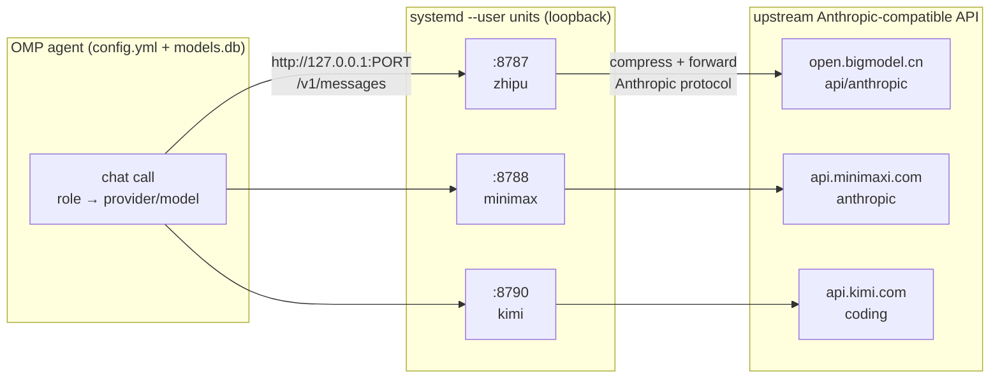
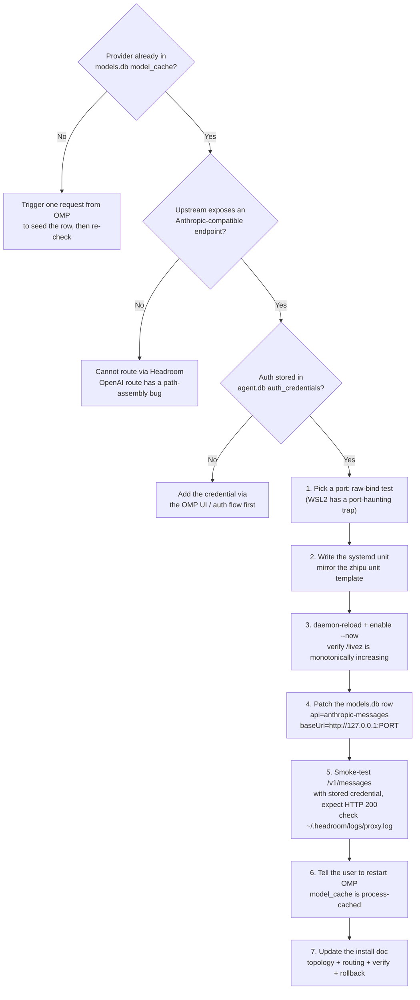
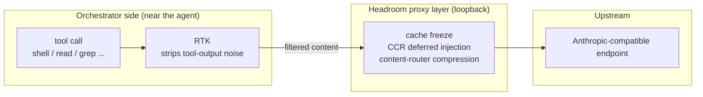

# Headroom × OMP: Onboarding, Governance, and Runtime Audit Master Guide

When you orchestrate multiple large-language-model providers through an agent framework, you quickly hit an awkward reality: protocols, auth, and caching capabilities vary wildly across providers. The CN-region providers (Zhipu, MiniMax, Kimi) mostly expose Anthropic-compatible endpoints, but their support for prompt caching, context compression, and tool-result caching is uneven; sending traffic directly to the upstream means giving up a middle layer where you could enforce uniform governance.

This article documents a setup that runs in production: **routing custom model providers into the OMP (Oh My Pi) agent harness through a Headroom compression proxy layer**. It consolidates the original onboarding flow and the runtime-measured audit into a single, day-to-day reference.

---

## 1. Background: Why a Compression Proxy Layer?

OMP is an agent orchestration framework that routes requests to different provider/model pairs based on *roles*. Ideally, every provider would offer:

- **Prompt caching** — repeated system prompts and tool definitions stop being re-billed;
- **Context compression** — over-long conversations auto-compress while keeping the signal;
- **Tool-result caching** — identical tool calls reuse results, cutting latency and cost.

In practice, not every upstream supports these natively. Headroom fills the gap: it is a local reverse proxy that transparently compresses, caches, and normalizes the protocol for every byte that passes through, so the OMP side never has to care about per-provider capability differences.

The key design principle: **only the providers that need governance go through the proxy; everything else stays direct.** In this setup, only three CN-region providers pass through Headroom; every other provider (Vertex Claude, local Ollama, LM Studio, llama.cpp, etc.) is untouched and direct. This unifies capabilities while keeping the proxy's complexity and blast radius to a minimum.

### 1.1 The value picture: RTK is the workhorse, not compression
Runtime measurement of all traffic crossing the proxy by "how many tokens it saved" yields:
- **RTK CLI filtering** contributes roughly **86.7% of savings** (tens of millions of tokens) by stripping tool-output noise;
- **Prefix-cache stability** holds a **~100% hit rate** under `--mode cache` by freezing prior turns;
- **Active compression** contributes **under 1%** of savings (only non-Read bodies).

Headroom is best described as a "cache stabilizer + protocol normalizer" whose own compression is deliberately deprioritized; the tool-output noise reduction that yields the real savings is done by RTK.

---

## 2. Overall Architecture: Four Artifacts and Their Responsibilities

OMP routes three CN-region providers through per-provider Headroom compression proxies; every other provider goes direct.


```mermaid
flowchart LR
  subgraph OMP["OMP agent (config.yml + models.db)"]
    A["chat call<br/>role → provider/model"]
  end
  subgraph Headroom["systemd --user units (loopback)"]
    Z[":8787<br/>zhipu"]
    M[":8788<br/>minimax"]
    K[":8790<br/>kimi"]
  end
  subgraph Upstream["upstream Anthropic-compatible API"]
    U1["open.bigmodel.cn<br/>api/anthropic"]
    U2["api.minimaxi.com<br/>anthropic"]
    U3["api.kimi.com<br/>coding"]
  end
  A -->|"http://127.0.0.1:PORT<br/>/v1/messages"| Z
  A --> M
  A --> K
  Z -->|"compress + forward<br/>Anthropic protocol"| U1
  M --> U2
  K --> U3
```

The key to understanding this architecture is knowing **what each of the four artifacts owns — and what it does not**:

| Layer | Artifact (file/object) | Owns | Does NOT own |
| --- | --- | --- | --- |
| **1. Role → model binding** | `config.yml` (`modelRoles`, `task.agentModelOverrides`, `retry.fallbackChains`) | Which provider/model each OMP role uses; the fallback graph when a model fails | Network routing |
| **2. Model → route binding** | `models.db` table `model_cache` (`provider_id`, `models[].api`, `models[].baseUrl`) | For each provider's models: protocol (`anthropic-messages`) + base URL | Auth, role assignment |
| **3. Proxy process** | systemd unit `headroom-proxy-*.service` (one per provider) | Listening port, upstream URL, provider name, proxy env, restart policy | Which models exist |
| **4. Upstream API** | the provider's Anthropic-compatible endpoint | Actual model inference | Whether Headroom exists |

Two further orthogonal concerns:
- **Credential store** (`agent.db` table `auth_credentials`): Headroom only forwards the auth headers OMP sends (`x-api-key` or `Authorization: Bearer`); it **never injects auth itself**.
- **CLI profiles** (`~/.config/claude-profile/*.json`): used only by the standalone `claude` CLI; OMP itself does not read them.

---

## 3. End-to-End Onboarding Flow: Adding a New Custom Provider

Onboarding a new provider is, at its core, putting each of the four artifacts in place in turn:


```mermaid
flowchart TD
  Q1{"Provider already in<br/>models.db model_cache?"}
  Q1 -- No --> T1["Trigger one request from OMP<br/>to seed the row, then re-check"]
  Q1 -- Yes --> Q2{"Upstream exposes an<br/>Anthropic-compatible endpoint?"}
  Q2 -- No --> STOP["Cannot route via Headroom<br/>OpenAI route has a path-assembly bug"]
  Q2 -- Yes --> Q3{"Auth stored in<br/>agent.db auth_credentials?"}
  Q3 -- No --> SEED["Add the credential via<br/>the OMP UI / auth flow first"]
  Q3 -- Yes --> P1["1. Pick a port: raw-bind test<br/>(WSL2 has a port-haunting trap)"]
  P1 --> P2["2. Write the systemd unit<br/>mirror the zhipu unit template"]
  P2 --> P3["3. daemon-reload + enable --now<br/>verify /livez is monotonically increasing"]
  P3 --> P4["4. Patch the models.db row<br/>api=anthropic-messages<br/>baseUrl=http://127.0.0.1:PORT"]
  P4 --> P5["5. Smoke-test /v1/messages<br/>with stored credential, expect HTTP 200<br/>check ~/.headroom/logs/proxy.log"]
  P5 --> P6["6. Tell the user to restart OMP<br/>model_cache is process-cached"]
  P6 --> P7["7. Update the install doc<br/>topology + routing + verify + rollback"]
```

### 3.1 Port selection: do a raw-bind test first
Under WSL2 mirrored networking you may hit "the system thinks the port is free, but binding throws `EADDRINUSE`." Verify with Python:

```python
import socket
s = socket.socket(socket.AF_INET, socket.SOCK_STREAM)
s.bind(("127.0.0.1", PORT))  # only counts as usable if it does not throw
s.close()
```

### 3.2 The models.db patch must be idempotent
When patching a `model_cache` row in `models.db`, make the patch **idempotent** (safe to re-run with no side effects) and set the `authoritative` field to `1`. If you leave it `0`, OMP will, at some point, re-fetch the provider from its bundled static registry and **silently revert `baseUrl` and `api`** — Headroom then receives no traffic and raises no error, which is the hardest silent failure to diagnose.

### 3.3 You must restart OMP after patching
`model_cache` is an **in-process** cache in OMP. After you patch `models.db`, the running OMP process does not notice the change; you must restart for it to take effect. An agent cannot self-restart — that step must be handed to the user.

---

## 4. Three-Level Routing Verification

Verifying that traffic actually traverses the proxy requires **three levels of evidence in sequence**; a bare-proxy smoke (L2) is not enough.

| Level | Verification means | What it proves | What it does not prove |
| --- | --- | --- | --- |
| **L1 Config** | read `models.db` `baseUrl` pointing at loopback | the orchestrator, **if** it resolves this model, **must** use the proxy | whether the orchestrator actually selects this model at runtime |
| **L2 Bare-proxy** | send `/v1/messages` directly to the loopback port | the proxy starts, the protocol works, credential passthrough succeeds | whether the orchestrator's own routing logic sends traffic here |
| **L3 Orchestrator-native** | check `proxy.log` `PERF` lines + live connections (`ss`) | the orchestrator actually sent native traffic to the proxy | (the only level that proves end-to-end routing) |

L3 only passes when `PERF model=<target model>` appears **and** `ss` shows the orchestrator connecting to the loopback proxy port. A subtle failure mode: the orchestrator's **subagent model overrides** are not honored on some call paths — the subagent inherits the parent session's model, and the failure is silent (no error, no proxy traffic). Investigation must reach L3.

```bash
# L3 verification
tail -f ~/.headroom/logs/proxy.log | grep 'PERF model='
ss -tnp state established | grep <OMP_PID>
# Key: outbound destination must be 127.0.0.1:<proxy port>, not an external IP
```

---

## 5. RTK and Headroom: Independent but Composed

The runtime-measured view is that **RTK and Headroom are two independent tools, with Headroom invoking RTK at runtime as its context tool** — not "RTK is a built-in plugin of Headroom."


```mermaid
flowchart LR
  subgraph Edge["Orchestrator side (near the agent)"]
    T["tool call<br/>shell / read / grep ..."]
    R["RTK<br/>strips tool-output noise"]
  end
  subgraph Proxy["Headroom proxy layer (loopback)"]
    H["cache freeze<br/>CCR deferred injection<br/>content-router compression"]
  end
  subgraph Up["Upstream"]
    U["Anthropic-compatible endpoint"]
  end
  T --> R
  R -->|"filtered content"| H
  H --> U
```

Two distinct "output was rewritten" phenomena appear during measurement, and they are caused by **different components**:
- **bash inline HTTP** (curl/urllib/...) redirected to sandbox tools → the orchestrator's **context-mode** plugin;
- **large command output** redirected to a tee directory → **RTK**.

When troubleshooting "why did my command output change," first identify which layer it was — do not blindly blame Headroom.

---

## 6. Daily Operations: Service Control and Health Probes

### 6.1 Service control
All three proxy units are `systemd --user` services:

```bash
# status
systemctl --user status  headroom-proxy-zhipu headroom-proxy-minimax headroom-proxy-kimi

# restart / stop
systemctl --user restart headroom-proxy-zhipu headroom-proxy-minimax headroom-proxy-kimi
systemctl --user stop    headroom-proxy-zhipu headroom-proxy-minimax headroom-proxy-kimi

# tail one unit's logs live
journalctl --user -u headroom-proxy-kimi -f
```

### 6.2 Health, stats, and deeper CLI probes
Each proxy exposes `/livez` (liveness) and `/stats` (compression / cost / latency stats). `/livez` is the only probe to trust; `/readyz` always reports `unhealthy` because it probes the default Anthropic URL instead of the configured upstream.

```bash
# batch liveness
for port in 8787 8788 8790; do
  echo "$port: $(curl -fsS http://127.0.0.1:$port/livez)"
done

# detailed stats (jq pretty-prints the JSON)
curl -fsS http://127.0.0.1:8787/stats | jq .
# top-level keys: summary, agent_usage, savings, requests, tokens, latency,
# overhead, ttfb, prefix_cache, cost, persistent_savings, display_session

# deeper CLI probes beyond /livez
headroom doctor --port 8787     # health + whether routing / budget is set
headroom perf                   # compression strategy, cache hits, transform breakdown, recommendations
headroom savings                # durable 30-day savings ledger
headroom audit-reads            # quantifies "how many tokens are still on the table"
```

Two fields in `/stats` are especially worth monitoring routinely:
- **`cli_filtering`**: RTK's contribution (savings percentage, command count) — the real-time number of the true value workhorse.
- **`prefix_cache`**: cache-hit detail (read/write tokens, bust count) — whether `--mode cache` is actually preserving cache.

---

## 7. Model-Constraint Enforcement: Making a Provider "Use Only Specific Models"

The most overlooked and error-prone part of the whole setup. When a business policy says "this provider may only use specific models" (for example: the Zhipu provider may only use `glm-5.2`; the MiniMax provider is unrestricted), **three surfaces** in `config.yml` must all be compliant — and **order matters**.

### 7.1 The three model-reference surfaces
| Surface | Purpose | Default state |
| --- | --- | --- |
| `modelRoles` | The primary model per role (default/slow/plan/smol/commit/vision/advisor/designer/tiny/task) | Usually already compliant — primary roles are explicit choices |
| `task.agentModelOverrides` | Per-subagent overrides (scout/sonic/cavecrew/reviewer/architect/planner/task) | Usually already compliant |
| `retry.fallbackChains` | Per-role **and** per-model fallback lists | **The usual violation site** — accumulates forbidden refs over time |

The first two surfaces rarely cause trouble. **The real minefield is `retry.fallbackChains`**: when you move a primary role to the allowed model, the corresponding fallback chain may still carry stale, forbidden model references. These never fire in normal operation, so they are extremely well hidden.

### 7.2 The mandatory verification triple
After editing `config.yml`, run all three checks — no skipping:

```bash
# 1. YAML parses cleanly
python3 -c "import yaml; yaml.safe_load(open('config.yml')); print('YAML OK')"

# 2. Zero forbidden refs (pattern adjusts to the active constraint)
grep -nE "zhipu-coding-plan/(glm-5\.1|glm-5:|glm-4\.5-air|glm-4\.7|glm-5v-turbo|glm-5-turbo)" config.yml
# must return empty

# 3. Surgical diff (in theory only retry.fallbackChains should change)
diff config.yml.bak config.yml
```

> **Effect timing**: OMP loads `config.yml` per session — changes apply **automatically in the next session**, no restart; the current session keeps the old config.

---

## 8. Known Traps and Lessons Learned

| Trap | Symptom | Mitigation |
| --- | --- | --- |
| **WSL2 mirrored-net port haunting** | `ss`/`/proc/net/tcp` show the port free, but Headroom bind crashes with `EADDRINUSE` | Raw-bind test with Python `socket.bind(("127.0.0.1", PORT))`. Ports like 8789 are held by Windows-side daemons; use 8790+ for new proxies |
| **Headroom OpenAI-route path bug** | `/paas/v4` or `/coding/v1` bases get misassembled → 404 | All providers use `api: anthropic-messages`. If the upstream lacks an Anthropic endpoint, it cannot route through Headroom |
| **`RestartSec=3` crash-loops** | Unit enters a 50+ restart loop after a stop/restart | `RestartSec=8`, giving TCP TIME_WAIT enough time to clear |
| **OMP caches `model_cache` in memory** | Routing patch doesn't take effect for the running OMP process | Tell the user to restart OMP; an agent cannot self-restart |
| **`authoritative=0` silent rollback** | OMP refetches the provider from the static registry, silently reverting `baseUrl` + `api`; Headroom stops receiving traffic with no error | Set `authoritative` to `1` in the patch |
| **Phantom Windows-side proxy on 8789** | `/livez` returns 200 but every real request 401s (auth stripped) | Use `ss -tlnp` to confirm the bound PID is your systemd unit's MainPID; don't trust `/livez` alone |
| **Subagent model override silently ignored** | A scout / sonic / etc. subagent uses the parent's model instead of the configured one | Reach L3 in verification (`proxy.log` + `ss`); the orchestrator does not error |
| **context-mode + Headroom double compression** | Overly terse model output, missing context | Disable one layer at a time to isolate: stop Headroom units, or disable the `context-mode` plugin |
| **OAuth shape in agent.db** | Code expecting `access_token`/`refresh_token` finds nothing | Rows store `{access, refresh, expires}` (no `_token` suffix); api_key rows store `{"key":"..."}` |

---

## 9. Conclusion

Unifying multiple heterogeneous LLM providers is never hard at the "make it connect" step — the hard part is **governance** and **verification**:

- **Onboarding** rests on a clear four-layer responsibility split — knowing what each artifact owns locates half of any problem.
- **Governance** rests on all three model-reference surfaces being compliant at once, especially the easily forgotten fallback chains.
- **Verification** rests on three levels of evidence (L1 config / L2 bare-proxy / L3 orchestrator-native). L2 alone is the most common source of "configured but not actually routing" misdiagnoses.
- **Value** is delivered primarily by RTK's tool-output filtering, with Headroom acting as a cache stabilizer and protocol normalizer. Tune RTK's pattern library, not compression's keep-ratio.

Hold these four lines, and onboarding custom providers stops being a black art you re-debug every time, and becomes a reusable, auditable engineering capability.
