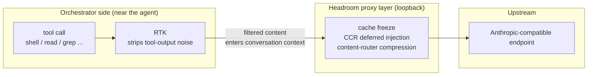

# Headroom Runtime Audit: Value Engine, Routing Verification, and the RTK Composition

Once a compression proxy layer is deployed using the *Headroom × OMP Onboarding and Governance Flow*, an intuitive belief sets in: **if it is called a "compression proxy," then saving tokens must be its job.** A full runtime audit overturns that intuition — on a real production deployment, active compression contributes under 1% of the savings, while the real value engine is a component that is easy to overlook.

This post is the **runtime-measured companion** to that onboarding flow. It does not repeat the onboarding steps; instead it answers three questions that only surface after deployment — where the value actually comes from, how to verify traffic really traverses the proxy, and what the relationship between RTK and Headroom actually is.

> Recommended reading order: read the *Onboarding and Governance Flow* first to understand the four-artifact architecture, then read this post to see how runtime measurement corrects design intuition.

---

## 1. The value picture: RTK is the workhorse, not compression

Break down all traffic crossing the proxy by "how many tokens it saved," and you get a table that overturns the intuition:

| Value vector | Share | Mechanism | State |
| --- | --- | --- | --- |
| **RTK CLI filtering** | **~86.7% / tens of millions of tokens** | a tool-output pattern library identifies and strips noise from tool results | the real workhorse |
| Prefix-cache stability | cache hit rate 100% | cache mode freezes prior turns; CCR defers tool injection | design objective met |
| Active compression | under 1% | body compression of non-Read content | deliberately deprioritized |

In other words: **the heavy lifting is done by RTK, not by compression.** The name "Headroom" makes it tempting to credit "compression," but in the measured data active compression saves almost nothing — its role is closer to "cache stabilizer + protocol normalizer," while the thing stripping hundreds of thousands of tokens of noise from tool outputs is RTK.

This correction matters: **if you only tune compression ratios, you miss the real value lever.** What deserves optimization is RTK's filtering pattern library, not compression's keep-ratio.

---

## 2. The compression-vs-cache tradeoff: the design philosophy of cache mode

Why is active compression's share so low? Because the proxy defaults to `--mode cache` (not `token`):

- **`token` mode**: prioritizes compression, rewriting prior turns for maximum savings — but this **breaks the prefix cache**, cratering the provider-side prompt-cache hit rate;
- **`cache` mode** (default): **freezes prior turns**, foregoing compression to preserve prefix-cache hits.

In measurement, cache mode approaches a 100% hit rate, and cache-read depth grows steadily as the conversation progresses — exactly the design goal. The cost is that active compression steps aside, so its low share is a **deliberate tradeoff, not a malfunction**.

> Takeaway: decide first whether you want "tokens saved" or "cache-hit money saved." Cache mode suits long conversations with prompt-cache-capable upstreams; token mode suits one-shot short requests or upstreams without cache support.

---

## 3. Routing verification: three levels of evidence (do not be fooled by a smoke test)

"The proxy is configured, so traffic should go through it" — this inference is the most dangerous assumption in the whole deployment. Measurement shows that verifying whether routing actually takes effect requires **three levels of evidence in sequence**; missing any one can produce a misdiagnosis:

| Level | Verification means | What it proves | What it does not prove |
| --- | --- | --- | --- |
| **L1 Config** | read `models.db` `baseUrl` pointing at loopback | the orchestrator, **if** it resolves this model, **must** use the proxy | whether the orchestrator actually selects this model at runtime |
| **L2 Bare-proxy** | send `/v1/messages` directly to the loopback port | the proxy starts, the protocol works, credential passthrough succeeds | whether the orchestrator's own routing logic sends traffic here |
| **L3 Orchestrator-native** | check `proxy.log` `PERF` lines + live connections (`ss`) | the orchestrator actually sent native traffic to the proxy | (the only level that proves end-to-end routing) |

**The most common misdiagnosis**: running only L2 (direct-to-proxy smoke) and declaring "routing works." But L2 bypasses the orchestrator and hits the proxy directly — it proves the proxy is healthy, not that the orchestrator routes traffic to it. The difference is fatal during troubleshooting.

### 3.1 Subagent model overrides may not be honored

A subtler phenomenon was also observed: the orchestrator's **subagent model overrides** (e.g., configuring `scout → some-provider model`) are **not honored** on some call paths — the subagent inherits the parent session's model instead of the configured one. The symptom: a subagent that should traverse provider A's proxy port produces only the parent session model's traffic in `proxy.log`.

This means: **even with correct L1 config and healthy L2 proxy, L3 can still fail**, and the failure is silent (the orchestrator does not error; the proxy simply sees no traffic). The only way to investigate is L3 — `proxy.log` plus `ss -tnp` live connections — checking whether the orchestrator process's outbound goes to the loopback proxy port or directly to an external upstream IP.

### 3.2 A clean L3 verification flow

```bash
# 1. Trigger one request to the target model (send a message)
# 2. Immediately watch for the matching PERF line in proxy.log
tail -f ~/.headroom/logs/proxy.log | grep 'PERF model='

# 3. In parallel, watch the orchestrator process's live outbound connections
ss -tnp state established | grep <orchestrator pid>
# Key judgment: is it connecting to 127.0.0.1:<proxy port>, or directly to an external IP?
```

L3 passes only when `PERF model=<target model>` appears **and** `ss` shows the orchestrator connecting to the loopback proxy port. If either is missing, routing is not actually in effect.

---

## 4. RTK and Headroom: independent but composed

Since RTK is the value workhorse, what is its relationship to Headroom? Measurement shows the accurate framing is **two independent tools, with Headroom invoking RTK at runtime as its context tool** — not "RTK is a built-in plugin of Headroom."



Key understanding (strictly separating verified from unconfirmed):

- **Observed facts**: the proxy startup log explicitly names RTK as the active context tool; RTK has its own independent config directory (`~/.config/rtk/`, with tracking / tee / filters / limits sections); the orchestrator's plugin manifest contains only context-mode, with no standalone RTK plugin.
- **Documentation claims (not verified as runtime integration on this deployment)**: the upstream README states Headroom ships with the RTK binary and auto-selects RTK as its context tool — this is a documentation claim, and the startup log alone cannot reverse-engineer the "auto-selection" mechanism details.
- **Unconfirmed**: the exact injection hook / IPC mechanism by which Headroom invokes RTK, the precise way to disable RTK, and the true data source of RTK's `/stats` fields — all three are marked unknown and should not be written as confirmed conclusions.

### 4.1 Two different interceptions — do not conflate them

During measurement you bump into two distinct "output was rewritten" phenomena, done by **different components**:

- **bash inline HTTP (curl/urllib/...) redirected to sandbox tools** → this is the orchestrator's **context-mode** plugin;
- **large command output redirected to a tee directory** → this is **RTK**.

Their responsibilities differ. When troubleshooting "why did my command output change," first identify which layer it was — do not blindly blame Headroom.

---

## 5. Operations in depth: beyond `/livez`

`/livez` only tells you "the proxy process is alive," but **alive ≠ working ≠ working correctly**. Headroom ships a set of deeper CLI probes worth learning after deployment:

```bash
# Official health check (beyond /livez — also reports whether claude/codex/shell route through the proxy, whether a budget is set)
headroom doctor --port 8787

# Design-internals view: compression strategy, cache hits, transform breakdown, TOIN learning status, actionable recommendations
headroom perf

# Durable 30-day savings ledger
headroom savings

# Audit Read-tool traffic for compression opportunities (quantifies "how many tokens are still on the table")
headroom audit-reads
```

### 5.1 The overlooked gems in `/stats`

Beyond `summary`, the JSON returned by `/stats` has several fields worth monitoring routinely:

- **`cli_filtering`**: RTK's contribution (savings percentage, command count) — the real-time numbers of the true value workhorse;
- **`config`**: the proxy's **runtime-resolved** compression policy (e.g., `compress_user_messages=true`, `compress_system_messages=false` — protecting the system prompt, compressing only user turns). These are Headroom-internal defaults invisible in the unit file;
- **`prefix_cache`**: cache-hit detail (read/write tokens, bust count) — whether cache mode is actually preserving cache.

### 5.2 Do not be fooled by `/readyz`

`/readyz` **always reports unhealthy** for the upstream check, because it probes the default Anthropic URL rather than the configured upstream. **Trust only `/livez` + actual request flow.**

---

## 6. Conclusion

Deploying the compression proxy layer is only the beginning. Runtime measurement corrects three intuitions that are easy to hold before deployment:

- **Value source**: not compression, but RTK. Tuning compression ratios is the wrong direction;
- **Routing verification**: a bare-proxy smoke passing ≠ orchestrator-native routing passing. You must reach the `proxy.log` + live-connections layer for it to count, and subagent model overrides can fail silently;
- **Component relationship**: RTK and Headroom are a composition of independent tools, not containment. The two interceptions (context-mode and RTK) have different responsibilities — identify the layer first when troubleshooting.

Hold these three lines, and "the compression proxy layer is deployed" will not remain the illusion of "it is configured so it must be working," but become an observable, verifiable, optimizable engineering capability.

> This post is the runtime-measured companion to the *Headroom × OMP Onboarding and Governance Flow*. The former explains "how to onboard"; this post explains "what it is actually doing after onboarding, and how to verify it is really doing it."
