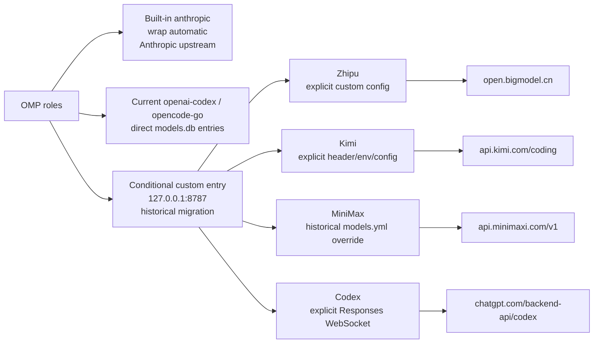

# Headroom Single-Port Evolution: Routing Zhipu, Kimi, MiniMax, and Codex through 8787

This article records a historical single-port migration. The official `headroom wrap omp` path has a narrower automatic scope: it injects only OMP's built-in `anthropic` provider into the wrapper-managed configuration. The current `openai-codex` and `opencode-go` roles remain direct entries in `models.db`; wrap does not automatically retarget them to loopback.

The Zhipu, Kimi, MiniMax, and Codex loopback routes documented below are historical migration evidence. They require explicit custom provider configuration and are not the default result of `headroom wrap omp`.

For today's startup, use the [official Headroom README](https://github.com/headroomlabs-ai/headroom/blob/main/README.md) and its wrapper rather than a persistent service:

```bash
# Install the official CLI once (Python 3.13+)
uv tool install --python 3.13 "headroom-ai[all]"

# Recommended entry point: wrap the OMP session and its local proxy
headroom wrap omp

# In another terminal while the wrapped session is running
headroom doctor
headroom perf
headroom dashboard
```

`headroom wrap omp` launches OMP and manages the local proxy required by that session. It is the only recommended startup entry point for OMP. Normally, do not create or maintain the legacy `~/.config/systemd/user/headroom-proxy.service`, enable provider-specific units, or start `headroom proxy --port 8787` manually. Those systemd and direct-proxy paths are historical, not recommended daily startup paths.

```text
Historical custom-provider topology (not the wrap-only default; automatic wrap scope: built-in `anthropic` only)
OMP (launched by `headroom wrap omp`)
      │
      ├─ built-in `anthropic` → wrapper-managed route (automatic; Anthropic upstream)
      ├─ current `openai-codex` / `opencode-go` → direct `models.db` upstream
      │
      ▼
Conditional custom Headroom entry (historical migration; 127.0.0.1:8787)
      ├─ Zhipu    → https://open.bigmodel.cn/api/coding/paas/v4/chat/completions
      ├─ Kimi     → https://api.kimi.com/coding/v1/messages
      ├─ MiniMax  → https://api.minimaxi.com/v1/chat/completions
      └─ Codex WS → wss://chatgpt.com/backend-api/codex/responses
```

The wrapper owns the active session lifecycle, but process exit does not automatically restore the route state. When finished, explicitly run `headroom unwrap omp`; by default it removes the wrapper-managed route state and stops the local proxy. Use `headroom unwrap omp --no-stop-proxy` only when intentionally keeping the proxy alive, otherwise a loopback route may remain.

## 1. Why move from multiple ports to one

The earlier design started a separate Headroom systemd service for each provider. That legacy topology is obsolete and not recommended: it made fixed `*_TARGET_API_URL` values easy to reason about, but also created several problems:

- More systemd units, ports, log files, and lifecycles;
- Different loopback addresses for OMP and Kimi CLI to remember;
- Provider-specific restart, proxy, and SOCKS settings could drift apart;
- The port encoded the route instead of the request carrying the provider fact.

The current design separates the responsibilities again:

1. **The client** selects the provider and writes the upstream information through model metadata or custom headers;
2. **Headroom** handles protocol detection, compression, caching, and forwarding;
3. **`headroom wrap omp`** manages the local proxy lifecycle for the OMP session.

The port now means “the local Headroom entry point”, not “one fixed supplier”.

## 2. The final single-port architecture



The routes below are historical or conditional custom-provider routes, not four routes that `headroom wrap omp` creates automatically. Wrap-only automatically covers the built-in `anthropic` provider and leaves its configured Anthropic upstream as the default. The current `openai-codex` and `opencode-go` entries remain direct unless explicitly configured otherwise:

| Provider | Client-side routing | Headroom upstream result |
| --- | --- | --- |
| Built-in `anthropic` | Automatic wrapper-managed route; no implicit Kimi target | The configured Anthropic upstream |
| `openai-codex` / `opencode-go` | Current direct `models.db` entries; no automatic loopback rewrite | Their configured direct upstream |
| Zhipu | Historical custom provider route; explicit `x-headroom-*` configuration required | `/v4/chat/completions` |
| Kimi | Historical custom provider route; an explicit header, environment variable, or provider config is required | `/coding/v1/messages` |
| MiniMax | Historical `models.yml` override and custom route; not required by wrap | `/v1/chat/completions` |
| Codex | Historical custom provider route; explicit Responses WebSocket configuration required | Codex Responses WebSocket |

Do not infer current routing from these historical `models.db` or provider entries. Verify the active configuration first, and never hand-edit the database as daily startup.

## 3. Official wrap startup and lifecycle

Use the README's `wrap` path for every normal OMP session:

```bash
uv tool install --python 3.13 "headroom-ai[all]"
headroom wrap omp
```

While that wrapped session is active, verify it from another terminal:

```bash
headroom doctor
headroom perf
headroom dashboard
```

The wrapper manages the local proxy needed by the current session. Wrap-only does not rewrite non-Anthropic provider rows into loopback; manual `~/.config/systemd/user/headroom-proxy.service`, per-provider systemd units, or a standalone `headroom proxy --port 8787` process remain legacy migration paths and are not recommended for normal operation.


## 4. Overriding the built-in MiniMax provider (Historical Migration Evidence)

An earlier migration used `models.yml` to override the built-in provider. The following block is retained only as historical evidence: current `headroom wrap omp` does not require it. Process exit does not restore `models.yml`; after the wrapped session, explicitly run `headroom unwrap omp` (default: stop the local proxy) or use `--no-stop-proxy` only when intentionally keeping the proxy alive. Do not add this override as a daily startup step:

```yaml
# Historical migration evidence only; not required by the current wrap lifecycle.
providers:
  minimax-code-cn:
    baseUrl: http://127.0.0.1:8787/v1
    headers:
      x-headroom-base-url: https://api.minimaxi.com/v1
      x-headroom-original-path: /chat/completions
```

The two headers solve different problems:

- `x-headroom-base-url` selects the real upstream;
- `x-headroom-original-path` preserves `/chat/completions` and prevents `/v1` from being duplicated.

The final log must show the real upstream, not only a loopback request:

```text
event=outbound_request forwarder=streaming
path=https://api.minimaxi.com/v1/chat/completions

event=proxy_inbound_response ... status=200
```

## 5. Kimi's dual protocol and default-target boundary

Kimi traffic appears in two forms:

- Anthropic Messages requests from OMP/Kimi CLI: `/v1/messages`;
- OpenAI-compatible Chat Completions requests from some clients: `/v1/chat/completions`.

The Kimi CLI provider was pointed at the unified port in the historical migration and retained dynamic headers:

```toml
[providers."managed:kimi-code"]
type = "kimi"
api_key = ""
base_url = "http://127.0.0.1:8787/v1"
custom_headers = { "x-headroom-base-url" = "https://api.kimi.com/coding", "x-headroom-original-path" = "/v1/messages" }

[providers."managed:kimi-code".oauth]
storage = "file"
key = "oauth/kimi-code"
```

There is one practical boundary in that historical custom `kimi-code` path: some requests arrived at 8787 without `x-headroom-base-url`. In the legacy service topology this default was supplied through a systemd environment variable. That is migration history, not a daily startup requirement. `headroom wrap omp` does not automatically create this Kimi route; use it only with explicit provider configuration.

The historical default-target override (explicit extra configuration only):

```text
# Legacy configuration; headroom wrap omp does not set this variable.
ANTHROPIC_TARGET_API_URL=https://api.kimi.com/coding
```


### Important: this historical default is not side-effect-free transparent routing

Any Anthropic `/v1/messages` request **without a dynamic routing header** was sent to Kimi instead of the official Anthropic endpoint in the historical custom setup. This was a trade-off of that migration, not the automatic wrap-only behavior. The plain `headroom wrap omp` path does not set `ANTHROPIC_TARGET_API_URL`; its default remains the configured Anthropic upstream. If a custom 8787 entry is used, one of these choices is required:

- Use a separate entry point for Claude;
- Make the client send the correct `x-headroom-base-url` explicitly; or
- Set `ANTHROPIC_TARGET_API_URL=https://api.kimi.com/coding` explicitly, or add conditional routing based on client identity.

Do not describe this historical default as transparent compatibility for every Anthropic client.

## 6. Why Codex must not use a normal OpenAI target

Codex subscription traffic is not ordinary OpenAI Chat Completions traffic. The historical custom route used the Responses API over WebSocket:

```text
/v1/responses
→ wss://chatgpt.com/backend-api/codex/responses
```

For the current `openai-codex` role, keep the direct configured route unless you explicitly add custom provider configuration. A custom loopback route must not set a generic OpenAI target that would override Codex's Responses WebSocket route:

```ini
OPENAI_TARGET_API_URL=...
```

In the historical custom setup, Headroom detected the ChatGPT OAuth credentials and used its built-in `chatgpt_subscription` route. The decisive verification evidence was:

```text
WS /v1/responses connecting to wss://chatgpt.com/backend-api/codex/responses
WS /v1/responses completed
last_upstream_type=response.completed
```

## 7. Legacy provider services: migration-only, not recommended

The old per-provider systemd units and the persistent `headroom-proxy.service` are obsolete. They are mentioned here only to explain the historical migration; do not create, enable, or maintain them for a normal OMP session. A machine that still has those legacy units should remove the stale installation as a one-time cleanup, then use the `headroom wrap omp` block in section 3 as the only startup path.

The desired post-migration state is not “one enabled service”. It is an active wrapped OMP session whose local proxy is managed by the wrapper.

## 8. Three-layer verification: do not stop at HTTP 200

A single-port migration needs three layers of evidence.

### L1: Configuration

First distinguish automatic, current-direct, and historical custom state:

```text
Wrap-only automatic:
anthropic → wrapper-managed route for the built-in Anthropic provider
             (default upstream remains Anthropic; no implicit Kimi target)

Current direct models.db entries:
openai-codex → configured direct upstream (no automatic loopback rewrite)
opencode-go  → configured direct upstream (no automatic loopback rewrite)

Historical/conditional custom routes (only if explicitly configured):
zhipu-coding-plan → http://127.0.0.1:8787/v1
kimi-code         → http://127.0.0.1:8787/v1
minimax-code-cn   → http://127.0.0.1:8787/v1
openai-codex      → http://127.0.0.1:8787/v1 (custom override only)
```

### L2: Protocol

Send the smallest request for each protocol to the active wrapped session with an existing credential and confirm that the upstream response is returned. A successful `/health` or a loopback HTTP 200 alone does not prove the correct upstream was selected.

### L3: Native orchestrator traffic

The following four-selector loop is historical migration evidence, not a wrap-only smoke test. Run it only from another terminal while an already-running wrapped session is active **and only when every selector has explicit custom provider configuration**. In the current configuration, `openai-codex` and `opencode-go` are direct unless you deliberately configure otherwise:

```bash
# Conditional historical/custom-provider smoke; not the default wrap topology.
for selector in \
  zhipu-coding-plan/glm-4.7 \
  kimi-code/k3 \
  minimax-code-cn/MiniMax-M3 \
  openai-codex/gpt-5.6-luna; do
  env -u ALL_PROXY -u all_proxy -u HTTP_PROXY -u HTTPS_PROXY \
    omp --no-session --no-tools --no-skills --no-rules --no-extensions \
      --mode=json --model "$selector" -p 'Reply with exactly PONG'
done
```

Then inspect `~/.headroom/logs/proxy.log` for the real upstream:

| Provider | Decisive evidence | Result |
| --- | --- | --- |
| Zhipu | `path=https://open.bigmodel.cn/api/coding/paas/v4/chat/completions` | `status=200` |
| Kimi | `path=https://api.kimi.com/coding/v1/messages` | `status=200` |
| MiniMax | `path=https://api.minimaxi.com/v1/chat/completions` | `status=200` |
| Codex | `wss://chatgpt.com/backend-api/codex/responses` | `response.completed` |

## 9. Runtime checks and rollback

Run the official checks while the wrapped session is active:

```bash
headroom doctor
headroom perf
headroom dashboard
```

The generic Claude, Codex, shell-env, or budget warnings from `headroom doctor` are not equivalent to a forwarding failure. Real selectors, the final upstream URLs, and `~/.headroom/logs/proxy.log` are the authoritative evidence. A loopback HTTP 200 alone is never sufficient.

Do not make manual `models.db` edits, a reconciler run, or a systemd unit restart part of daily startup. Those are legacy recovery techniques; `headroom wrap omp` manages the session-local proxy and its automatic built-in `anthropic` route, but it does not retarget non-Anthropic provider rows or send unmarked Anthropic requests to Kimi without explicit custom configuration.

## 10. Principles from the migration

1. **One entry point does not mean one fixed upstream**: single-port routing depends on request-level provider data.
2. **Model cache and provider overrides are part of the client contract**: keep their declarations, but do not hand-edit `models.db` as normal startup.
3. **Codex is a special protocol**: do not override its Responses WebSocket with a normal OpenAI target.
4. **The historical Kimi default target documents its boundary**: untagged Anthropic requests went to Kimi only when the legacy `ANTHROPIC_TARGET_API_URL` or equivalent custom routing was explicitly configured; plain `headroom wrap omp` keeps the Anthropic upstream.
5. **Verify the upstream URL**: a 200 from `127.0.0.1:8787` only proves that the proxy received the request.
6. **The wrapper owns lifecycle**: legacy systemd units and a persistent `headroom-proxy.service` are not the recommended OMP startup path.
