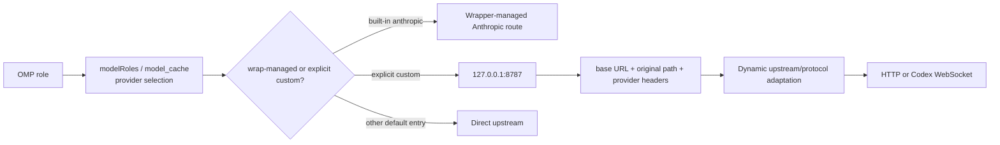

This page synthesizes one migration conclusion: a single port does not mean that every provider is automatically rewritten to 8787. It means explicitly configured custom providers can share one loopback entry, while request-level data selects the real upstream. The current `headroom wrap omp` automatic scope, OMP model selection, derived `models.db` state, and Headroom lifecycle must be considered separately; historical routes are not current defaults.

## Core mechanism

### 1. Single-port routing causal chain



| Selector / route type | Default or historical state | Requirement for the single port | Key boundary |
| --- | --- | --- | --- |
| Built-in `anthropic` | `headroom wrap omp` may manage it automatically | An active wrapped session | Automatic scope is not every provider; the default target remains Anthropic upstream |
| `openai-codex`, `opencode-go` | Usually direct entries in the current `models.db` | An explicit custom provider is required for loopback | Wrap does not rewrite ordinary entries to 8787 |
| Zhipu / Kimi / MiniMax | Historical custom routes | Provider config, loopback base URL, and request headers must all exist | A legacy Kimi target override can silently send headerless Anthropic requests to the wrong upstream |
| Codex Responses | Historical explicit custom route | WebSocket target and protocol must stay aligned | Do not assume a normal OpenAI Chat Completions route can cover Responses WebSocket |

### 2. Why converge from multiple ports

- **Configuration**: OMP can declare one loopback base URL for providers that need governance; upstream host, original path, and protocol differences remain request-level data.
- **Operations**: No per-provider proxy process or port unit is needed, reducing port collisions and unit drift; the trade-off is a single-port failure affecting every routed provider.
- **Protocol**: HTTP Chat Completions, Anthropic Messages, and Codex Responses WebSocket cannot be distinguished by port alone; provider, original path, and protocol metadata must be preserved.
- **Lifecycle**: The current recommendation is for `headroom wrap omp` to start and own the active proxy; persistent services and manual `headroom proxy` belong to migration history.

### 3. Three layers of route evidence

1. **L1 configuration**: distinguish wrapper-managed built-in `anthropic`, direct `models.db` entries, and explicit custom entries.
2. **L2 protocol**: in the active wrapped session, send a minimal protocol request for a declared selector and confirm loopback reachability, header forwarding, and a valid protocol response.
3. **L3 upstream**: observe proxy inbound/outbound logs and the final HTTP URL or WebSocket `response.completed`; this is the evidence that the intended upstream received the request.

## Applicable conditions

- Several explicitly configured providers need shared local proxy capabilities such as compression, caching, protocol normalization, or unified observation.
- A migration must decouple the port topology from provider count while preserving each provider's path and protocol differences.
- You need to answer separately “what did the role select?”, “which entry did the request use?”, and “which upstream received it?”
- You can accept a wrapper-scoped lifecycle and explicitly clean route state when the session ends.

## Not applicable and risks

| Misuse | Result | Boundary and response |
| --- | --- | --- |
| Treating 8787 as the global default | Direct roles bypass the proxy and the diagnosis is wrong | Check the selector's model/cache entry and whether custom configuration exists |
| Checking only `/health` or HTTP 200 | Only loopback reachability is proven | Perform L2 protocol and L3 final-upstream checks |
| Enabling legacy provider units alongside wrap | Port contention, stale headers, or misleading logs | Use only `headroom wrap omp` daily; treat old services as migration residue to remove |
| Applying an HTTP route to Codex WebSocket | Handshake or Responses events fail | Preserve the WebSocket URL, path, and completion-event evidence |
| Relying on an old Kimi/Anthropic override | Headerless requests silently use the wrong upstream | Remove the legacy override or use an explicit custom-provider route |
| Equating proxy traversal with compression savings | A short request reports zero savings and is judged unproxied | Observe loopback, proxy logs, and compression statistics separately |
| Treating manual `models.db` edits as persistence | The process keeps an old cache and rebuilds it after restart | Treat the cache as derived state and validate a new wrapped session |

## Minimal verification

```bash
# Recommended current session entry; use the official version/install guidance
headroom wrap omp
```

While the wrapped session is running, execute `headroom doctor` and `headroom perf` from another terminal, then check L1 → L2 → L3. Probe loopback and the final upstream only when a selector has an explicit custom provider; check default direct selectors against their direct upstream separately. At the end, explicitly run `headroom unwrap omp` unless intentionally keeping the proxy.

## Evidence and uncertainty

- **Source facts**: `legacy-headroom-single-port-evolution` records the historical convergence to 127.0.0.1:8787, dynamic headers, the MiniMax override, the Kimi/Anthropic target trap, and Codex WebSocket; `legacy-omp-config-and-rules-guide` separates role-to-model, model-to-entry, request-level routing, and wrapper lifecycle; `legacy-omp-headroom-persistence` describes `models.db` as derived cache.
- **This page's synthesis**: defining a single port as a shared entry for explicit custom routes, then using L1/L2/L3, keeps configuration, protocol, and final-upstream evidence separate.
- **Unconfirmed**: the provider set currently covered automatically by the wrapper, header names, log fields, provider protocol adapters, and whether 8787 is a default all vary with Headroom/OMP versions; historical Zhipu, Kimi, MiniMax, and Codex routes are not default guarantees.

## Related pages

- [OMP configuration layers](/en/note/omp-config-and-rules-guide)
- [Headroom route persistence](/en/note/omp-headroom-persistence)
- [OMP Hook extension](/en/note/omp-hook-extension-guide)
- [LLM wiki pattern](/en/note/llm-wiki-pattern)
