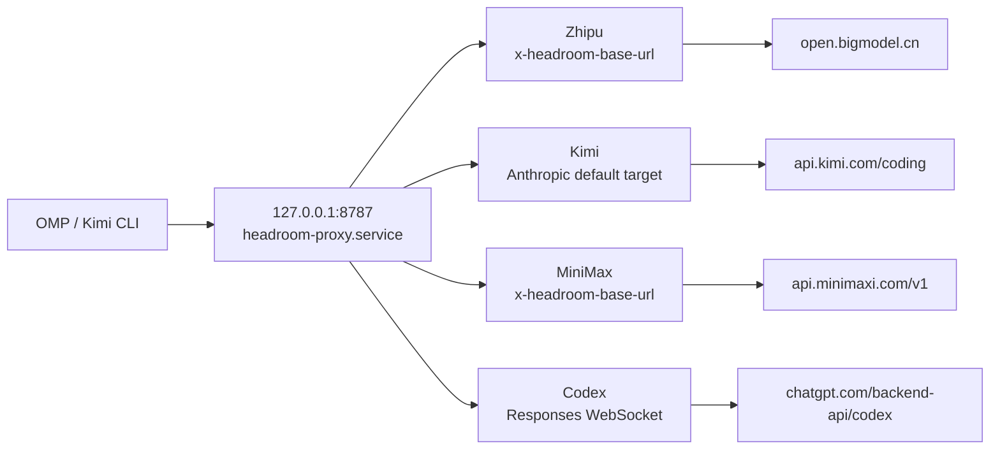

# Headroom Single-Port Evolution: Routing Zhipu, Kimi, MiniMax, and Codex through 8787

This was not a matter of changing several port numbers to the same value. It was a change to the client-side routing model: **Headroom keeps one loopback proxy process, while OMP identifies the upstream provider in the request and the proxy forwards it according to the protocol.**

The final topology is:

```text
OMP / Kimi CLI
      │
      ▼
127.0.0.1:8787
headroom-proxy.service
      ├─ Zhipu    → https://open.bigmodel.cn/api/coding/paas/v4/chat/completions
      ├─ Kimi     → https://api.kimi.com/coding/v1/messages
      ├─ MiniMax  → https://api.minimaxi.com/v1/chat/completions
      └─ Codex WS → wss://chatgpt.com/backend-api/codex/responses
```

## 1. Why move from multiple ports to one

The earlier design started a separate Headroom systemd service for each provider. That made fixed `*_TARGET_API_URL` values easy to reason about, but it also created several problems:

- More systemd units, ports, log files, and lifecycles;
- Different loopback addresses for OMP and Kimi CLI to remember;
- Provider-specific restart, proxy, and SOCKS settings could drift apart;
- The port encoded the route instead of the request carrying the provider fact.

The single-port design separates the responsibilities again:

1. **The client** selects the provider and writes the upstream information through model metadata or custom headers;
2. **Headroom** handles protocol detection, compression, caching, and forwarding;
3. **systemd** manages only one proxy process.

The port now means “the local Headroom entry point”, not “one fixed supplier”.

## 2. The final single-port architecture



The OMP provider routes now fall into two groups:

| Provider | Client-side routing | Headroom upstream result |
| --- | --- | --- |
| Zhipu | `models.db` `baseUrl` plus `x-headroom-*` headers | `/v4/chat/completions` |
| Kimi | `models.db` / Kimi CLI configuration; untagged Anthropic requests use the default target | `/coding/v1/messages` |
| MiniMax | `~/.omp/agent/models.yml` override of the built-in provider with `x-headroom-*` headers | `/v1/chat/completions` |
| Codex | `models.db` points to 8787; Headroom detects ChatGPT subscription automatically | Codex Responses WebSocket |

## 3. The unified systemd service

The service currently on disk contains no provider API key. It deliberately does not set `OPENAI_TARGET_API_URL`, because that would interfere with Codex's special WebSocket route:

```ini
[Unit]
Description=Headroom Unified Context Optimization Proxy
After=network-online.target
Wants=network-online.target

[Service]
Type=simple
Environment=HOME=%h
Environment=HEADROOM_HOST=127.0.0.1
Environment=ANTHROPIC_TARGET_API_URL=https://api.kimi.com/coding
Environment=ALL_PROXY=
Environment=LITELLM_PROXY=
Environment=all_proxy=
Environment=SOCKS_PROXY=
Environment=socks_proxy=
ExecStart=/home/davidhlp/.local/bin/headroom proxy --port 8787
RestartSec=8
StandardOutput=append:%h/.headroom/logs/headroom-proxy.log
StandardError=append:%h/.headroom/logs/headroom-proxy.log

[Install]
WantedBy=default.target
```

`RestartSec=8` is operationally important. Headroom needs time for TCP `TIME_WAIT` sockets to clear after a restart; a shorter interval can create false port conflicts or a restart loop.

## 4. Overriding the built-in MiniMax provider

MiniMax is an OMP built-in provider. Its dynamic `model_cache` row was not a durable place to insert by hand, so the final setup uses the supported `models.yml` provider override:

```yaml
# Managed local override: route the built-in MiniMax provider through Headroom.
providers:
  minimax-code-cn:
    baseUrl: http://127.0.0.1:8787/v1
    headers:
      x-headroom-base-url: https://api.minimaxi.com/v1
      x-headroom-original-path: /chat/completions
```

The two headers solve different problems:

- `x-headroom-base-url` selects the real upstream;
- `x-headroom-original-path` preserves `/chat/completions` and prevents `/v1` from being duplicated.

The final log must show the real upstream, not only a loopback request:

```text
event=outbound_request forwarder=streaming
path=https://api.minimaxi.com/v1/chat/completions

event=proxy_inbound_response ... status=200
```

## 5. Kimi's dual protocol and default-target boundary

Kimi traffic appears in two forms:

- Anthropic Messages requests from OMP/Kimi CLI: `/v1/messages`;
- OpenAI-compatible Chat Completions requests from some clients: `/v1/chat/completions`.

The Kimi CLI provider now points to the unified port and keeps its dynamic headers:

```toml
[providers."managed:kimi-code"]
type = "kimi"
api_key = ""
base_url = "http://127.0.0.1:8787/v1"
custom_headers = { "x-headroom-base-url" = "https://api.kimi.com/coding", "x-headroom-original-path" = "/v1/messages" }

[providers."managed:kimi-code".oauth]
storage = "file"
key = "oauth/kimi-code"
```

There is one practical boundary in the OMP `kimi-code` path: some requests arrive at 8787 without `x-headroom-base-url`. The unified service therefore contains:

```ini
Environment=ANTHROPIC_TARGET_API_URL=https://api.kimi.com/coding
```

### Important: this is not a side-effect-free transparent default

Any Anthropic `/v1/messages` request **without a dynamic routing header** is sent to Kimi instead of the official Anthropic endpoint. This solves the single-port Kimi integration, but if ordinary Claude traffic is later sent directly to 8787, one of these choices is required:

- Use a separate entry point for Claude;
- Make the client send the correct `x-headroom-base-url` explicitly; or
- Add conditional routing based on client identity in the proxy layer.

This default must not be described as transparent compatibility for every Anthropic client.

## 6. Why Codex must not use a normal OpenAI target

Codex subscription traffic is not ordinary OpenAI Chat Completions traffic. It uses the Responses API over WebSocket:

```text
/v1/responses
→ wss://chatgpt.com/backend-api/codex/responses
```

The unified service therefore does not set:

```ini
OPENAI_TARGET_API_URL=...
```

Headroom detects the ChatGPT OAuth credentials and uses its built-in `chatgpt_subscription` route. The decisive verification evidence is:

```text
WS /v1/responses connecting to wss://chatgpt.com/backend-api/codex/responses
WS /v1/responses completed
last_upstream_type=response.completed
```

## 7. Removing the old provider services

After switching to one port, stopping the old processes is not enough. Drop-in directories and enable state must be removed as well:

```bash
systemctl --user disable --now \
  headroom-proxy-zhipu.service \
  headroom-proxy-kimi.service \
  headroom-proxy-minimax.service \
  headroom-proxy-codex.service \
  headroom-proxy-webui.service || true

rm -rf ~/.config/systemd/user/headroom-proxy-zhipu.service.d
rm -rf ~/.config/systemd/user/headroom-proxy-kimi.service.d
rm -rf ~/.config/systemd/user/headroom-proxy-minimax.service.d
rm -rf ~/.config/systemd/user/headroom-proxy-codex.service.d
rm -rf ~/.config/systemd/user/headroom-proxy-webui.service.d

systemctl --user daemon-reload
systemctl --user enable --now headroom-proxy.service
```

After cleanup, both the service list and port list should have exactly one target:

```bash
systemctl --user list-unit-files | grep '^headroom'
ss -tlnp | grep -E '127\.0\.0\.1:(8787|8788|8790|8791|8800)'
```

Expected result:

```text
headroom-proxy.service enabled
127.0.0.1:8787 LISTEN
```

## 8. Three-layer verification: do not stop at HTTP 200

A single-port migration needs three layers of evidence.

### L1: Configuration

Confirm that each provider resolves to loopback:

```text
zhipu-coding-plan → http://127.0.0.1:8787/v1
kimi-code         → http://127.0.0.1:8787/v1
openai-codex      → http://127.0.0.1:8787/v1
minimax-code-cn   → ~/.omp/agent/models.yml → 127.0.0.1:8787/v1
```

### L2: Protocol

Send the smallest request for each protocol to 8787 with an existing credential and confirm that the upstream response is returned. A successful `/health` or a loopback HTTP 200 alone does not prove the correct upstream was selected.

### L3: Native orchestrator traffic

Run real OMP selectors:

```bash
for selector in \
  zhipu-coding-plan/glm-4.7 \
  kimi-code/k3 \
  minimax-code-cn/MiniMax-M3 \
  openai-codex/gpt-5.6-luna; do
  env -u ALL_PROXY -u all_proxy -u HTTP_PROXY -u HTTPS_PROXY \
    omp --no-session --no-tools --no-skills --no-rules --no-extensions \
      --mode=json --model "$selector" -p 'Reply with exactly PONG'
done
```

Then inspect `~/.headroom/logs/proxy.log` for the real upstream:

| Provider | Decisive evidence | Result |
| --- | --- | --- |
| Zhipu | `path=https://open.bigmodel.cn/api/coding/paas/v4/chat/completions` | `status=200` |
| Kimi | `path=https://api.kimi.com/coding/v1/messages` | `status=200` |
| MiniMax | `path=https://api.minimaxi.com/v1/chat/completions` | `status=200` |
| Codex | `wss://chatgpt.com/backend-api/codex/responses` | `response.completed` |

## 9. Runtime checks and rollback

Use these checks for the final state:

```bash
systemctl --user is-active headroom-proxy.service
ss -tlnp | grep '127.0.0.1:8787'
headroom doctor --port 8787
headroom perf
headroom savings
```

The generic Claude, Codex, shell-env, or budget warnings from `headroom doctor` are not equivalent to a forwarding failure. Real selectors, upstream URLs, and `proxy.log` are the authoritative evidence.

Before changing `models.db`, the Kimi configuration, or the systemd unit, keep a copy:

```bash
cp ~/.omp/agent/models.db ~/.omp/agent/models.db.pre-unified-single-port-$(date +%Y%m%dT%H%M%S)
cp ~/.kimi-code/config.toml ~/.kimi-code/config.toml.pre-unified-single-port-$(date +%Y%m%dT%H%M%S)
cp ~/.config/systemd/user/headroom-proxy.service ~/.config/systemd/user/headroom-proxy.service.pre-unified-single-port-$(date +%Y%m%dT%H%M%S)
```

To roll back, restore the files, run `systemctl --user daemon-reload`, and restart the single `headroom-proxy.service`. Do not restore the old topology by re-enabling retired provider units.

## 10. Principles from the migration

1. **One entry point does not mean one fixed upstream**: single-port routing depends on request-level provider data.
2. **Model cache and provider overrides are part of the client contract**: changing only systemd does not make OMP use the proxy.
3. **Codex is a special protocol**: do not override its Responses WebSocket with a normal OpenAI target.
4. **The Kimi default target must document its boundary**: untagged Anthropic requests go to Kimi.
5. **Verify the upstream URL**: a 200 from `127.0.0.1:8787` only proves that the proxy received the request.
6. **Service cleanup is part of the migration**: old units, drop-ins, enable state, and log entry points must be checked together.
