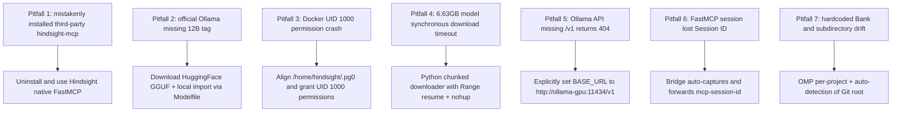

This page systematically archives the Vectorize Hindsight memory system's **runtime-local deployment** on Linux (daily inference and memory access fully backed by offline/local models; the first deployment and model-weight downloads require networking or pre-caching), as well as the ground practice of providing cross-tool unified memory support for the terminal agents **OMP (Oh-My-Pi)** and **Codex CLI**. It focuses on environment configuration, protocol adaptation, the debugging process, and 7 core "pitfall" lessons with prevention measures.

---

## 1. System Architecture and Runtime Topology

The whole local memory system consists of three parts: a compute foundation, a memory hub, and the Agent access layer. All ports and traffic are strictly confined to the local loopback (`127.0.0.1`):

```mermaid
flowchart TD
  subgraph Agent_Layer["Agent Client Access Layer"]
    OMP["OMP (Oh-My-Pi)<br/>Native memory.backend: hindsight<br/>+ FastMCP stdio bridge"]
    Codex["Codex CLI<br/>FastMCP stdio bridge<br/>(hindsight-bridge.mjs)"]
  end

  subgraph Hindsight_Core["Hindsight Memory Core (Docker)"]
    API["Hindsight Core (pinned v0.9.1)<br/>API: :8888 | UI: :9999<br/>Data persistence: $HOME/.hindsight/data"]
    FastMCP_EP["Streamable FastMCP endpoint<br/>/mcp/{project_bank}/"]
    PG0["Embedded pg0 (PostgreSQL + pgvector)<br/>Fact extraction / entity graph / vector index"]
  end

  subgraph Local_Inference["Local Inference Engine (runtime-local)"]
    OLLAMA["GPU LLM: Ollama ROCm (:11434)<br/>Model: gemma4:12b (Q4_K_M GGUF)<br/>Hardware: AMD Radeon RX 6800/6900 XT"]
    EMBED["CPU Embedding: Local Provider<br/>Model: BAAI/bge-m3<br/>Hardware: Intel CPU (multithreaded inference)"]
  end

  OMP -->|auto Recall / Retain / Reflect| API
  OMP -.->|MCP tool calls| FastMCP_EP
  Codex -->|MCP JSON-RPC (stdio)| FastMCP_EP
  API --> FastMCP_EP
  API --> PG0
  API -->|LLM fact extraction & reflection| OLLAMA
  API -->|vector embedding & rerank| EMBED
```

### Core design principles

1. **Precise allocation of compute**:
   - **GPU focused on the LLM**: Load the 12B-parameter `gemma4:12b` (Q4_K_M) into AMD GPU VRAM, dedicated to fact extraction during conversation and mental-model synthesis (Reflection).
   - **CPU focused on Embedding**: Force `BAAI/bge-m3` to run on the CPU, avoiding precious GPU VRAM and guaranteeing stable LLM context inference.
2. **Multi-project adaptive isolation (Dynamic Workspace Routing)**:
   - Drop the globally hardcoded single Bank (e.g., hardcoding `ulticode`); instead, a Git-repository-root detection mechanism automatically routes different projects to their dedicated Bank (e.g., `ulticode`, `resicache`), preventing context contamination.
3. **Full-lifecycle local data**:
   - All vectors, entity relations, transcripts, and model caches are uniformly located under `$HOME/.hindsight/`.

---

## 2. Deployment and Integration Implementation Steps

### 1. Persistent Directory Planning and Permission Management

The Hindsight container runs as the non-root user `hindsight` (UID 1000), so the mounted host directories must ensure UID 1000 has write permission:

```bash
mkdir -p ~/.hindsight/data ~/.hindsight/models ~/.hindsight/ollama

# Recommended safe permission setup: assign the data and model directories to the container UID 1000 (or grant the container user group write permission)
sudo chown -R 1000:1000 ~/.hindsight/data ~/.hindsight/models
chmod -R u+rwX,g+rwX ~/.hindsight/data ~/.hindsight/models
```

### 2. Docker Compose Orchestration (`~/.hindsight/docker-compose.yml`)

> **Note**: In the Compose file, host paths should use `${HOME}` or absolute paths, avoiding reliance on Shell tilde `~` expansion in non-interactive environments.

```yaml
services:
  # GPU LLM service: load the model via Ollama ROCm
  ollama-gpu:
    image: ollama/ollama:rocm
    container_name: hindsight-ollama-gpu
    restart: unless-stopped
    ports:
      - "127.0.0.1:11434:11434"
    environment:
      - HSA_OVERRIDE_GFX_VERSION=10.3.0  # AMD RDNA2 (gfx1030)
      - ROCR_VISIBLE_DEVICES=0
      - OLLAMA_KEEP_ALIVE=-1
    devices:
      - "/dev/kfd:/dev/kfd"
      - "/dev/dri:/dev/dri"
    volumes:
      - ${HOME}/.hindsight/ollama:/root/.ollama
      - ${HOME}/.hindsight/models:/models:ro

  # Hindsight core server (pinned Vectorize.io version)
  hindsight:
    image: ghcr.io/vectorize-io/hindsight:v0.9.1
    container_name: hindsight-server
    restart: unless-stopped
    ports:
      - "127.0.0.1:8888:8888"   # API & MCP endpoint
      - "127.0.0.1:9999:9999"   # Web UI console
    environment:
      # --- LLM driver (GPU) ---
      - HINDSIGHT_API_LLM_PROVIDER=ollama
      - HINDSIGHT_API_LLM_BASE_URL=http://ollama-gpu:11434/v1
      - HINDSIGHT_API_LLM_MODEL=gemma4:12b
      # --- Embedding driver (CPU) ---
      - HINDSIGHT_API_EMBEDDINGS_PROVIDER=local
      - HINDSIGHT_API_EMBEDDINGS_LOCAL_MODEL=BAAI/bge-m3
      - HINDSIGHT_API_EMBEDDINGS_LOCAL_FORCE_CPU=true
      # --- Model weight download config (first pull needs network; can go offline after pre-caching) ---
      - HF_ENDPOINT=https://huggingface.co
      - HINDSIGHT_API_LOG_LEVEL=info
    volumes:
      - ${HOME}/.hindsight/data:/home/hindsight/.pg0
      - ${HOME}/.hindsight/models:/home/hindsight/.cache/huggingface
    depends_on:
      - ollama-gpu
```

### 3. GGUF Model Import and Alias Registration

Write `~/.hindsight/models/Modelfile`:
```dockerfile
FROM /models/gemma-4-12b-it-Q4_K_M.gguf
TEMPLATE """{{ if .System }}<start_of_turn>system
{{ .System }}<end_of_turn>
{{ end }}{{ if .Prompt }}<start_of_turn>user
{{ .Prompt }}<end_of_turn>
{{ end }}<start_of_turn>model
{{ .Response }}<end_of_turn>
"""
PARAMETER stop "<start_of_turn>"
PARAMETER stop "<end_of_turn>"
PARAMETER num_ctx 8192
```

Import and verify:
```bash
docker exec -i hindsight-ollama-gpu ollama create gemma4:12b -f /models/Modelfile
docker exec hindsight-ollama-gpu ollama list
```

### 4. Dynamic Multi-Project FastMCP Bridge (`~/.hindsight/hindsight-bridge.mjs`)

To let stdio clients (such as the Codex CLI and OMP sub-agents) connect to HTTP FastMCP and automatically route the Bank based on the current Git repository, a generic bridge script was written:

```javascript
#!/usr/bin/env node
/**
 * Dynamic Multi-Project FastMCP Bridge for Hindsight
 * Resolves Git repository root to accurately derive project bank ID even from subdirectories.
 */
import readline from 'node:readline';
import path from 'node:path';
import { execSync } from 'node:child_process';
import fs from 'node:fs';

function findProjectRoot() {
  try {
    const gitRoot = execSync('git rev-parse --show-toplevel', {
      stdio: ['pipe', 'pipe', 'ignore'],
      encoding: 'utf-8',
    }).trim();
    if (gitRoot && fs.existsSync(gitRoot)) return gitRoot;
  } catch {}

  let curr = process.cwd();
  while (curr && curr !== path.dirname(curr)) {
    if (fs.existsSync(path.join(curr, '.git'))) return curr;
    curr = path.dirname(curr);
  }
  return process.cwd();
}

function getDynamicBankId() {
  if (process.env.HINDSIGHT_BANK_ID?.trim()) {
    return process.env.HINDSIGHT_BANK_ID.trim();
  }
  const root = findProjectRoot();
  const baseName = path.basename(root);
  if (!baseName || baseName === '/' || baseName === '.' || baseName === 'root') {
    return 'default';
  }
  return baseName.toLowerCase().replace(/[^a-z0-9_-]/g, '_');
}

const BANK_ID = getDynamicBankId();
const BASE_URL = process.env.HINDSIGHT_API_BASE_URL || 'http://127.0.0.1:8888';
const TARGET_URL = `${BASE_URL.replace(/\/+$/, '')}/mcp/${BANK_ID}/`;

let sessionId = null;

const rl = readline.createInterface({
  input: process.stdin,
  output: process.stdout,
  terminal: false,
});

rl.on('line', async (line) => {
  const trimmed = line.trim();
  if (!trimmed) return;

  try {
    const payload = JSON.parse(trimmed);
    const headers = {
      'Content-Type': 'application/json',
      'Accept': 'application/json, text/event-stream',
    };
    if (sessionId) headers['mcp-session-id'] = sessionId;

    const res = await fetch(TARGET_URL, {
      method: 'POST',
      headers,
      body: JSON.stringify(payload),
    });

    const returnedSessionId = res.headers.get('mcp-session-id');
    if (returnedSessionId) sessionId = returnedSessionId;

    const contentType = res.headers.get('content-type') || '';
    if (contentType.includes('text/event-stream')) {
      const text = await res.text();
      for (const l of text.split('\n')) {
        if (l.startsWith('data:')) {
          const data = l.slice(5).trim();
          if (data && data !== '[DONE]') process.stdout.write(data + '\n');
        }
      }
    } else {
      const json = await res.json();
      process.stdout.write(JSON.stringify(json) + '\n');
    }
  } catch (err) {
    try {
      const parsed = JSON.parse(trimmed);
      if (parsed.id !== undefined) {
        process.stdout.write(
          JSON.stringify({
            jsonrpc: '2.0',
            id: parsed.id,
            error: { code: -32603, message: `Hindsight Bridge Error: ${err.message}` },
          }) + '\n'
        );
      }
    } catch {}
  }
});
```

### 5. OMP and Codex Client Access Configuration

> **Path note**: Node processes and native clients do not automatically expand a tilde `~` into the Home directory when resolving `args` paths. Use the real absolute path in actual configuration (e.g., `/home/<username>/.hindsight/hindsight-bridge.mjs`) or environment-specific variables.

#### OMP configuration (`~/.omp/agent/config.yml` and `~/.omp/agent/mcp.json`)
```yaml
# config.yml
memory:
  backend: hindsight

hindsight:
  apiUrl: http://127.0.0.1:8888
  scoping: per-project                  # auto-assign an independent Bank per project, aligned with the Codex mirror
  autoRecall: true                      # auto-query and inject memory in the first turn of a session
  autoRetain: true                      # auto-distill and sediment at the end of a session
  mentalModelsEnabled: true             # enable mental models
  mentalModelAutoSeed: true             # auto-generate seed mental models
  recallBudget: mid

autolearn:
  enabled: true
  autoContinue: true
```

```json
// mcp.json (replace <USER_HOME> with the real absolute path, e.g. /home/user)
{
  "mcpServers": {
    "hindsight": {
      "type": "stdio",
      "command": "node",
      "args": ["<USER_HOME>/.hindsight/hindsight-bridge.mjs"]
    }
  }
}
```

#### Codex configuration (`~/.codex/config.toml`)
```toml
# config.toml (replace <USER_HOME> with the real absolute path, e.g. /home/user)
[mcp_servers.hindsight]
command = "node"
args = [
    "<USER_HOME>/.hindsight/hindsight-bridge.mjs",
]

[mcp_servers.hindsight.env]
HINDSIGHT_API_BASE_URL = "http://127.0.0.1:8888"
# Note: do not hardcode HINDSIGHT_BANK_ID; the bridge resolves it automatically from the Git root
```

---

## 3. Deep Pitfall Log and Root-Cause Troubleshooting Guide

During this deployment and tuning, 7 key architecture and configuration defects were investigated and resolved:



### Pitfall 1: Mistakenly installed a third-party npm package with the same name (`hindsight-mcp`)
- **Error symptom**: After installing with `npm install -g hindsight-mcp`, its README shows it defaults to requesting `https://api.hindsight-ai.com`, requires a PAT Token and an Agent UUID, defines tools such as `create_memory_block`, and cannot connect to the Vectorize open-source version.
- **Root cause**: A third-party legacy package with the same name exists in the npm registry; it is not an official artifact of the Vectorize open-source project. Vectorize Hindsight itself embeds a FastMCP service.
- **Solution**: Completely uninstall that npm package and connect directly through the `/mcp/{bank}/` endpoint built into the Hindsight server.
- **Prevention**: Before introducing tools surrounding an open-source project, first inspect the exported protocols and the integration directory (`hindsight-integrations/`) in the official source repo.

---

### Pitfall 2: The `gemma4:12b` tag does not exist in the official public Ollama library
- **Error symptom**: On Hindsight startup, the LLM connectivity check reports:
  `APIStatusError (ollama/gemma4:12b): HTTP 404: {"message": "model 'gemma4:12b' not found"}`.
- **Root cause**: The official Ollama Registry currently only hosts `gemma4:31b`; the 12B version is mainly hosted on HuggingFace in GGUF format by the open-source community (e.g., `unsloth`, `bartowski`).
- **Solution**: Pull `gemma-4-12b-it-Q4_K_M.gguf` from the HuggingFace repo (`unsloth/gemma-4-12b-it-GGUF`), then import it locally with `ollama create gemma4:12b -f /models/Modelfile` via a volume mount and `Modelfile`.
- **Prevention**: For non-standard/community-quantized models, do not rely on `ollama pull <tag>`; the local GGUF + Modelfile build mode is the most reliable.

---

### Pitfall 3: Rootless Docker container volume permission error (UID 1000)
- **Error symptom**: Hindsight fails to start; the container log outputs:
  `❌ The embedded database directory /home/hindsight/.pg0 is not writable by this container (UID 1000).`
- **Root cause**: For security, the Hindsight image runs as the non-root user `hindsight` (UID 1000). If directories created on the host by root or the current user have restricted permissions, the in-container pg0 database process cannot initialize.
- **Solution**:
  1. Mount paths must map into the container user's home directory: `${HOME}/.hindsight/data:/home/hindsight/.pg0` and `${HOME}/.hindsight/models:/home/hindsight/.cache/huggingface`.
  2. On the host, assign the directories to UID 1000: `sudo chown -R 1000:1000 ~/.hindsight/data ~/.hindsight/models`.
- **Prevention**: For any container image running as non-root, explicitly verify the target UID's read/write permission when mounting host paths; avoid blindly using world-wide 777.

---

### Pitfall 4: Oversized model file (6.63GB) synchronous download timeout
- **Error symptom**: Running the download command synchronously inside an agent tool causes a 300-second timeout abort and orphaned temporary files.
- **Root cause**: Large model weight files take a long time due to cross-border network bandwidth, and synchronous blocking calls are easily force-killed by the process manager or the CLI watchdog.
- **Solution**: Write a dedicated Python download script that uses `urllib.request` with the HTTP `Range` header for **resume support**, keep it running in the background with `nohup python3 ... > download.log 2>&1 &`, and confirm completion by polling the log.
- **Prevention**: Any model file over 1GB should be pulled with a background daemon + resume mechanism.

---

### Pitfall 5: The Ollama API Base URL path lacks `/v1`
- **Error symptom**: The connection fails when Hindsight is configured with `HINDSIGHT_API_LLM_BASE_URL=http://ollama-gpu:11434`.
- **Root cause**: Hindsight's internal `llm_wrapper.py` sends OpenAI-compatible requests for the `ollama` provider and by default appends an endpoint based on `/v1` (i.e., `http://localhost:11434/v1`). When using a custom container domain, omitting `/v1` leads to a path 404.
- **Solution**: Explicitly specify a URL containing `/v1` in the Docker Compose environment variables:
  `HINDSIGHT_API_LLM_BASE_URL=http://ollama-gpu:11434/v1`.
- **Prevention**: Any system talking to Ollama through the OpenAI-compatible protocol should explicitly append `/v1` in the URL.

---

### Pitfall 6: FastMCP protocol missing Session ID causes `Bad Request (-32600)`
- **Error symptom**: When writing a minimal stdio bridge, the first `initialize` packet succeeds, but subsequent `tools/list` or `tools/call` calls report `Bad Request: Missing session ID`.
- **Root cause**: Hindsight uses the Streamable FastMCP architecture: after the initial `initialize` handshake succeeds, the server returns `mcp-session-id` in the response header. Every subsequent JSON-RPC POST must carry this Session ID in the HTTP header.
- **Solution**: Add lightweight state management to the Node.js bridge:
  ```javascript
  const returnedSessionId = res.headers.get('mcp-session-id');
  if (returnedSessionId) sessionId = returnedSessionId;
  if (sessionId) headers['mcp-session-id'] = sessionId;
  ```
- **Prevention**: When implementing an HTTP-to-stdio MCP proxy, the handshake Session Header must be strictly handled and forwarded.

---

### Pitfall 7: Globally hardcoded Bank and subdirectory routing drift (Subdirectory Drift)
- **Error symptom**:
  1. Hardcoding `bank: ulticode` causes cross-project fact contamination when developing other projects.
  2. Deriving the project name only from `process.cwd()` misidentifies the subdirectory name when a developer enters a project subdirectory, fragmenting and breaking memory.
- **Root cause**: In monolith/multi-module (Monorepo) projects, the working directory (CWD) is often at the submodule level, so taking the current path name directly cannot represent the owning Git repository entity; moreover, OMP's `per-project-tagged` mode and Codex's independent Bank have routing-semantics mismatches.
- **Solution**:
  1. Configure OMP `hindsight.scoping: per-project` so its native logic also uses the Git root as the independent Bank.
  2. The bridge script traces upward to the repository root with `git rev-parse --show-toplevel`, using the root directory name as the unique Bank identifier.
- **Prevention**: Multi-project dynamic memory routing must uniformly use the **Git root path** as the naming anchor; never rely on relative CWD.

---

## 4. Verification Results and Measured Metrics

End-to-end measurement was performed in a multi-module subdirectory:

```bash
# 1. Cross-tool memory write (Codex MCP Bridge -> GPU Fact Extraction)
# Write: "Backend uses Java 17 and Spring Boot 3.2.5 with three owner services: auth 9101, admin 9102, app 9103."
# Extraction result: successfully generated 3 Fact entities and completed BAAI/bge-m3 vector indexing

# 2. Cross-tool memory recall (OMP / Codex Recall)
# Query: "What port does the auth service use?"
# Result: hit "Backend has three owner services: auth (9101), admin (9102), and app (9103)"
# Metrics: Reranker score 0.965, semantic score 0.668, retrieval response time 0.059s
```

---

## 5. Developer Quick-Reference Checklist

| Check item | Expected status | Troubleshooting command |
| :--- | :--- | :--- |
| **GPU inference container** | Up (:11434) | `docker logs hindsight-ollama-gpu` |
| **GPU VRAM model** | `gemma4:12b` (7.1 GB) | `docker exec hindsight-ollama-gpu ollama list` |
| **Hindsight service** | Up (:8888, :9999) | `docker logs hindsight-server` |
| **Persistent data** | `$HOME/.hindsight/data` (pg0) | `ls -la ~/.hindsight/data` |
| **Generic bridge** | `node $HOME/.hindsight/hindsight-bridge.mjs` | `grep hindsight ~/.codex/config.toml` |
| **OMP memory config** | `backend: hindsight`, `scoping: per-project` | `omp config get memory` |

---

## 6. Session Full-Process Evolution and Technical Decision Chain

| Stage | Core task | Obstacles and troubleshooting details | Final decision and output |
| :--- | :--- | :--- | :--- |
| **Stage 1: requirement intake and architecture design** | The user requires a fully local Hindsight deployment: Gemma-4 12B on the GPU, BGE-M3 on the CPU, unified integration for OMP and Codex. | Initially tried to find a third-party npm package that could bridge directly. | Established the two-container Docker Compose architecture: Ollama ROCm (GPU) + Hindsight Core (CPU pg0/BGE-M3). |
| **Stage 2: protocol truth-seeking** | Investigate the installed `hindsight-mcp` npm package. | Found it points to `api.hindsight-ai.com`, requires a PAT Token, and is a third-party legacy package. | Decisively uninstalled it and adopted the Vectorize Hindsight native Streamable FastMCP `/mcp/{bank}/` endpoint. |
| **Stage 3: base container and model preparation** | Start the Docker containers and pull the models. | 1. The container reports UID 1000 has no write permission; 2. official Ollama lacks the `gemma4:12b` tag; 3. the 6.63GB model synchronous download times out. | 1. Granted the directories UID 1000 read/write permission; 2. wrote a background Python downloader with Range resume; 3. successfully imported the GGUF into Ollama via Modelfile. |
| **Stage 4: protocol stack and communication fixes** | Establish Hindsight-Ollama communication and the Codex bridge. | 1. Hindsight's LLM check reports 404; 2. the FastMCP bridge reports `Missing session ID (-32600)` on the second packet. | 1. Explicitly appended `/v1` to BASE_URL; 2. added a state machine to the bridge that auto-extracts and forwards the `mcp-session-id` header. |
| **Stage 5: memory isolation and routing architecture evolution** | Handle OMP and Codex memory sharing and isolation. | Hardcoding `ulticode` causes cross-project contamination, while using `process.cwd()` directly causes Bank-name drift under the `services/app/` subdirectory. | 1. Set OMP `scoping: per-project`; 2. the bridge prefers `git rev-parse --show-toplevel` to trace the root. |
| **Stage 6: cleanup of discarded temp space and canonical archiving** | Clean up leftover test Banks and perform full deposition. | Cleaned the `codex` and `omp` temporary Banks; per the KB constitution, supplemented raw snapshots, updated the Index/Log, and passed all static checks. | Knowledge base fully verified (`pnpm kb:lint`, `pnpm check`, `pnpm build` all passed). |
