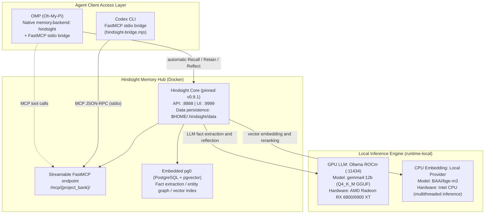

This page archives the **compute-allocation architecture and containerized deployment plan** for the Vectorize Hindsight memory system in Linux. Daily inference and memory access run fully offline and locally; the focus is coordinating heterogeneous compute (GPU LLM plus CPU embedding), data-persistence permissions, and service lifecycle orchestration.

---

## 1. System Architecture and Runtime Topology

The local memory system consists of a compute foundation, a memory hub, and an Agent access layer. All ports and traffic are strictly confined to the local loopback (`127.0.0.1`):



### Core design principles

1. **Precise compute allocation**:
    - **GPU dedicated to the LLM**: Load the 12B-parameter `gemma4:12b` (Q4_K_M) into AMD GPU VRAM, dedicated to fact extraction from conversations and mental-model synthesis (Reflection).
    - **CPU dedicated to Embedding**: Force `BAAI/bge-m3` to run on the CPU, avoiding valuable GPU VRAM usage and keeping LLM context inference stable.
2. **Full-lifecycle local data**:
    - Store all vectors, entity relations, transcripts, and model caches under `$HOME/.hindsight/`.

---

## 2. Deployment Steps

### 1. Persistent Directory Planning and Permission Management

The Hindsight container runs as the non-root user `hindsight` (UID 1000), so mounted host directories must give UID 1000 write permission:

```bash
mkdir -p ~/.hindsight/data ~/.hindsight/models ~/.hindsight/ollama

# Safe permission setup: assign ownership of the data and model directories to container UID 1000
sudo chown -R 1000:1000 ~/.hindsight/data ~/.hindsight/models
chmod -R u+rwX,g+rwX ~/.hindsight/data ~/.hindsight/models
```

### 2. Docker Compose Orchestration (`~/.hindsight/docker-compose.yml`)

Use `${HOME}` or an absolute path for host paths, avoiding reliance on Shell tilde `~` expansion in non-interactive environments:

```yaml
services:
    # GPU LLM service: load the model through Ollama ROCm
    ollama-gpu:
        image: ollama/ollama:rocm
        container_name: hindsight-ollama-gpu
        restart: unless-stopped
        ports:
            - "127.0.0.1:11434:11434"
        environment:
            - HSA_OVERRIDE_GFX_VERSION=10.3.0 # AMD RDNA2 (gfx1030)
            - ROCR_VISIBLE_DEVICES=0
            - OLLAMA_KEEP_ALIVE=-1
        devices:
            - "/dev/kfd:/dev/kfd"
            - "/dev/dri:/dev/dri"
        volumes:
            - ${HOME}/.hindsight/ollama:/root/.ollama
            - ${HOME}/.hindsight/models:/models:ro

    # Hindsight core server (pinned Vectorize.io version)
    hindsight:
        image: ghcr.io/vectorize-io/hindsight:v0.9.1
        container_name: hindsight-server
        restart: unless-stopped
        ports:
            - "127.0.0.1:8888:8888" # API and MCP endpoint
            - "127.0.0.1:9999:9999" # Web UI console
        environment:
            # --- LLM driver (GPU) ---
            - HINDSIGHT_API_LLM_PROVIDER=ollama
            - HINDSIGHT_API_LLM_BASE_URL=http://ollama-gpu:11434/v1
            - HINDSIGHT_API_LLM_MODEL=gemma4:12b
            # --- Embedding driver (CPU) ---
            - HINDSIGHT_API_EMBEDDINGS_PROVIDER=local
            - HINDSIGHT_API_EMBEDDINGS_LOCAL_MODEL=BAAI/bge-m3
            - HINDSIGHT_API_EMBEDDINGS_LOCAL_FORCE_CPU=true
            # --- Model weight download config (first pull needs network; pre-caching allows offline operation) ---
            - HF_ENDPOINT=https://huggingface.co
            - HINDSIGHT_API_LOG_LEVEL=info
        volumes:
            - ${HOME}/.hindsight/data:/home/hindsight/.pg0
            - ${HOME}/.hindsight/models:/home/hindsight/.cache/huggingface
        depends_on:
            - ollama-gpu
```

### 3. GGUF Model Import and Alias Registration

Write `~/.hindsight/models/Modelfile`:

```dockerfile
FROM /models/gemma-4-12b-it-Q4_K_M.gguf
TEMPLATE """{{ if .System }}<start_of_turn>system
{{ .System }}<end_of_turn>
{{ end }}{{ if .Prompt }}<start_of_turn>user
{{ .Prompt }}<end_of_turn>
{{ end }}<start_of_turn>model
{{ .Response }}<end_of_turn>
"""
PARAMETER stop "<start_of_turn>"
PARAMETER stop "<end_of_turn>"
PARAMETER num_ctx 8192
```

Import and verify it:

```bash
docker exec -i hindsight-ollama-gpu ollama create gemma4:12b -f /models/Modelfile
docker exec hindsight-ollama-gpu ollama list
```

---

## 3. Applicability and Boundaries

- **Hardware**: An AMD GPU with ROCm support (such as an RX 6800/6900 XT or the same generation and newer), at least 16 GB of VRAM, and a multi-core CPU for BGE-M3 vector extraction.
- **Network boundary**: All service endpoints must bind to the `127.0.0.1` loopback interface; never expose them to the public network without authentication.
- **Cold start**: Initial model-weight downloads require an external network connection or pre-cached files under `~/.hindsight/models`.

---

## 4. Minimal Verification

1. **Container status**: Run `docker ps` and confirm that `hindsight-server` and `hindsight-ollama-gpu` are Up.
2. **GPU VRAM**: Run `docker exec hindsight-ollama-gpu ollama ps` and confirm that `gemma4:12b` is fully loaded into GPU VRAM.
3. **Health endpoint**: `curl -I http://127.0.0.1:8888/health` should return HTTP 200.

---

## 5. Evidence and Uncertainty

- **Source facts**: Based on the verified `hindsight-local-deployment-and-agent-integration` deployment; the Ollama ROCm container maps `/dev/kfd` and `/dev/dri`, and Hindsight uses the pinned v0.9.1 image.
- **Synthesis in this page**: The compute split, directory permissions, and Compose orchestration are consolidated as an independent Concept specification.
- **Unconfirmed**: ROCm kernel-driver installation differs by Linux distribution (for example Ubuntu versus Fedora/Arch) and must be adapted to the host environment.

---

## 6. Related Pages

- [Hindsight Unified Memory Access: FastMCP Bridge and Dynamic Multi-Project Routing](/note/hindsight-omp-codex-integration)
- [Hindsight Runtime Troubleshooting Matrix and Failure Modes](/note/hindsight-troubleshooting)
- [MCP Codebase Memory Workflow](/note/mcp-codebase-memory-workflow)
