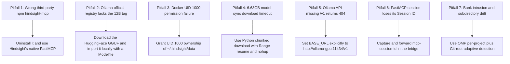

This page systematically summarizes **seven core failure modes, root causes, solutions, and preventive measures** from the local deployment and unified Agent integration of Vectorize Hindsight. It also provides a production-oriented quick inspection SOP and a staged decision path.

---

## 1. Seven Typical Failure Modes and Troubleshooting Matrix



### 1. Installing the wrong package with the same name (`hindsight-mcp`)

- **Symptom**: After `npm install -g hindsight-mcp`, its README requests `https://api.hindsight-ai.com`, a PAT Token, and an Agent UUID, and defines tools such as `create_memory_block`; it cannot connect to the Vectorize open-source endpoint.
- **Root cause**: The npm registry contains a legacy third-party package with the same name; it is not an official Vectorize Hindsight artifact. Vectorize Hindsight embeds its own FastMCP service.
- **Solution**: Uninstall the npm package and connect directly to the native `/mcp/{bank}/` endpoint exposed by Hindsight.
- **Prevention**: Before adding ecosystem tools around an open-source project, verify the exported protocol and integration directory (such as `hindsight-integrations`) in the official repository.

### 2. The Ollama official registry does not provide the `gemma4:12b` tag

- **Symptom**: Hindsight reports an LLM connectivity error at startup: `ApiStatusError(ollama/gemma4:12b): HTTP 404: {"message": "model 'gemma4:12b' not found"}`.
- **Root cause**: At the time, the official Ollama Registry provided only `gemma4:31b`; the 12B version was mainly hosted by the open-source community (such as `unsloth` and `bartowski`) as a GGUF on HuggingFace.
- **Solution**: Download `gemma-4-12b-it-Q4_K_M.gguf` from HuggingFace, then import it with `ollama create gemma4:12b -f /models/Modelfile`.
- **Prevention**: Do not blindly depend on `ollama pull <tag>` for non-standard or community-quantized models; local GGUF plus a locally built Modelfile is more reliable.

### 3. Rootless Docker volume permission failure (UID 1000)

- **Symptom**: Hindsight exits automatically and the container log says: `[FAIL] The embedded database directory /home/hindsight/.pg0 is not writable by this container (UID 1000).`.
- **Root cause**: The Hindsight image runs as the non-root user `hindsight` (UID 1000) for security. A host directory created automatically or by the current user may not be writable by the embedded pg0 database process inside the container.
- **Solution**: Map `${HOME}/.hindsight/data:/home/hindsight/.pg0` and `${HOME}/.hindsight/models:/home/hindsight/.cache/huggingface`; explicitly grant the host directories to UID 1000 with `sudo chown -R 1000:1000 ~/.hindsight/data ~/.hindsight/models`.
- **Prevention**: For any non-root container image, verify the container UID or grant the required permission when mounting a host path; do not blindly use global `777` permissions.

### 4. Oversized model file (6.63GB) download timeout

- **Symptom**: Running the download synchronously through an Agent tool exceeds the 300-second timeout, leaving an orphaned temporary file.
- **Root cause**: Model weights are large and cross-border bandwidth can be limited; a synchronous blocking request is easily killed by the process manager or CLI client timeout.
- **Solution**: Use a dedicated Python downloader with `urllib.request` and HTTP `Range` headers for resumable downloads, and run it as a background process with `nohup python3 ... > download.log 2>&1 &`.
- **Prevention**: Always use a background daemon and resumable transfer for model files larger than 1GB.

### 5. Ollama API Base URL is missing `/v1`

- **Symptom**: Hindsight cannot connect when configured with `HINDSIGHT_API_LLM_BASE_URL=http://ollama-gpu:11434`.
- **Root cause**: Hindsight's `llm_wrapper.py` follows the OpenAI-compatible protocol for the `ollama` provider and builds requests below `/v1` by default. Omitting `/v1` with a custom container hostname produces a 404.
- **Solution**: Set the complete URL explicitly in Docker Compose: `HINDSIGHT_API_LLM_BASE_URL=http://ollama-gpu:11434/v1`.
- **Prevention**: Always include `/v1` in URLs for systems that connect to Ollama through the OpenAI-compatible protocol.

### 6. Missing FastMCP Session ID causes `Bad Request (-32600)`

- **Symptom**: A simple stdio bridge completes the first `initialize` request, but later `tools/list` or `tools/call` requests return `Bad Request: Missing session ID`.
- **Root cause**: Hindsight uses Streamable FastMCP. After the initial `initialize` handshake succeeds, the server returns `mcp-session-id` in the response headers; every later JSON-RPC POST must forward that Session ID in its HTTP headers.
- **Solution**: Add lightweight state management to the Node.js bridge: capture `mcp-session-id` from the first response and send it on subsequent requests.
- **Prevention**: An HTTP-to-stdio MCP proxy must explicitly handle and forward the handshake Session header.

### 7. Global hard-coded Bank and subdirectory routing drift

- **Symptom**: Hard-coding `bank: ulticode` contaminates facts when working on another project; deriving the name only from `process.cwd()` misidentifies a project when the developer is inside a subdirectory, splitting its memory.
- **Root cause**: A monorepo or multi-module project often runs with a working directory deep inside a submodule, so the current directory name does not represent the Git repository. OMP's `per-project-tagged` mode also has different routing semantics from Codex's independent Bank.
- **Solution**: Set `hindsight.scoping: per-project` in OMP so its native logic also uses one Bank per Git root; make the bridge run `git rev-parse --show-toplevel` to walk back to the repository root and derive the unique Bank name there.
- **Prevention**: Anchor multi-project dynamic memory routing to the Git root path; never depend on the relative CWD.

---

## 2. Quick Health Check SOP

Run these commands in order to inspect the infrastructure and Agent state:

```bash
# 1. Check the GPU inference container
docker logs hindsight-ollama-gpu | tail -n 20

# 2. Check the GPU memory/model mapping
docker exec hindsight-ollama-gpu ollama list

# 3. Check Hindsight core logs and health
docker logs hindsight-server | tail -n 20
curl -I http://127.0.0.1:8888/health

# 4. Verify ownership of the persistent data directory
ls -la ~/.hindsight/data/

# 5. Verify the FastMCP stdio bridge
node ~/.hindsight/hindsight-bridge.mjs
```

---

## 3. Six-Stage Evolution and Technical Decisions

| Stage | Core task | Violation or failure found | Final resolution and output |
| :--- | :--- | :--- | :--- |
| **Stage 1: Requirements and architecture** | The user required a fully local Hindsight deployment, Gemma-4 12B on the GPU, BGE-M3 on the CPU, and unified OMP/Codex integration. | Initially investigated whether a third-party npm package could provide the bridge directly. | Established a two-container Docker Compose architecture (Ollama ROCm (GPU) + Hindsight Core (CPU pg0/BGE-M3)). |
| **Stage 2: Separating fact from fiction** | Investigated the installed `hindsight-mcp` npm package. | It pointed to `api.hindsight-ai.com` and required a PAT Token; it was a legacy third-party package. | Uninstalled it and adopted Vectorize Hindsight's native Streamable FastMCP `/mcp/{bank}/` endpoint. |
| **Stage 3: Container and model preparation** | Started the Docker containers and pulled the model. | 1. The container failed because UID 1000 lacked write permission; 2. the official Ollama registry lacked the `gemma4:12b` tag; 3. a 6.63GB synchronous download timed out. | 1. Granted UID 1000 ownership; 2. wrote a resumable background downloader; 3. built the GGUF import through a Modelfile. |
| **Stage 4: Unifying the communication channels** | Connected Hindsight to Ollama and built the Codex bridge. | 1. Hindsight's LLM check returned 404; 2. the FastMCP bridge reported `Missing session ID (-32600)` after the handshake. | 1. Added `/v1` to BASE_URL; 2. made the bridge capture and forward the `mcp-session-id` header. |
| **Stage 5: Memory isolation and routing evolution** | Shared and isolated memory between OMP and Codex. | Hard-coded `ulticode` contaminated projects, while direct `process.cwd()` naming drifted inside `/services/app/` subdirectories. | 1. Set OMP `scoping: per-project`; 2. made the bridge resolve the Git root with `git rev-parse --show-toplevel`. |
| **Stage 6: Removing temporary spaces and archiving the rules** | Removed test Banks and ran the full validation. | Cleaned temporary `codex` and `omp` Banks; added raw snapshots and updated the Index/Log according to the KB constitution. | Full knowledge-base validation passed (`pnpm kb:lint`, `pnpm check`, and `pnpm build`). |

---

## 4. Evidence and Uncertainty

- **Source facts**: The `hindsight-local-deployment-and-agent-integration` raw record contains the seven troubleshooting logs, Docker state, Session ID handshake behavior, and Git toplevel script verification.
- **Synthesis in this page**: The troubleshooting logs and experience are distilled into a standard failure-mode matrix and decision-evolution table.
- **Unconfirmed**: If a future Hindsight version changes the MCP layer to an SSE-based persistent connection or changes the header format, the bridge's capture logic must be updated.

---

## 5. Related Pages

- [Hindsight Local Compute Allocation and Dockerized Deployment](/note/hindsight-local-deployment)
- [Hindsight Unified Memory Access: FastMCP Bridge and Dynamic Multi-Project Routing](/note/hindsight-omp-codex-integration)
- [OMP Hook Extension Guide](/note/omp-hook-extension-guide)
