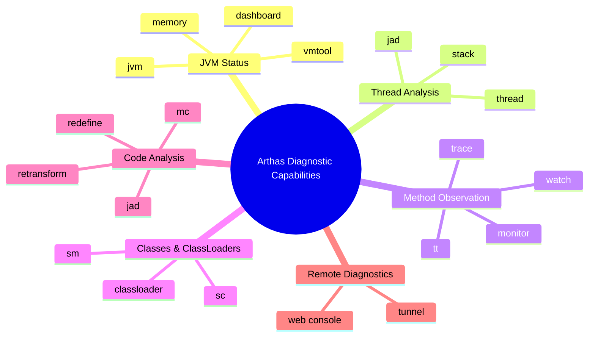
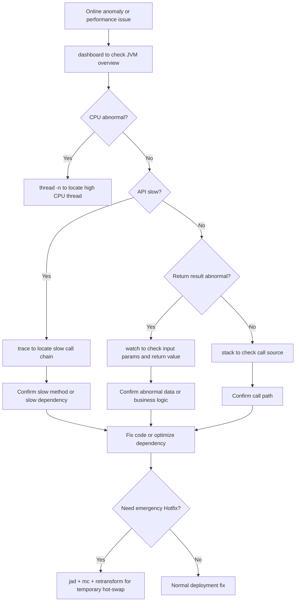
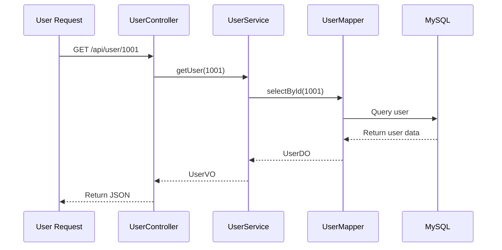
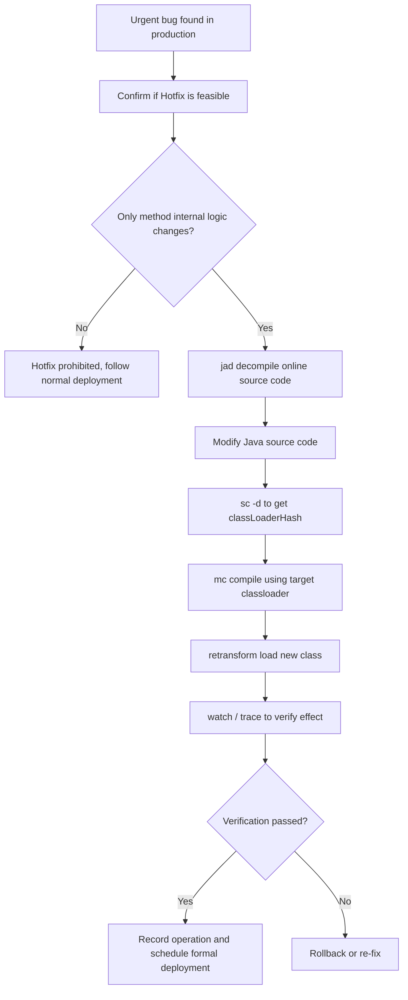
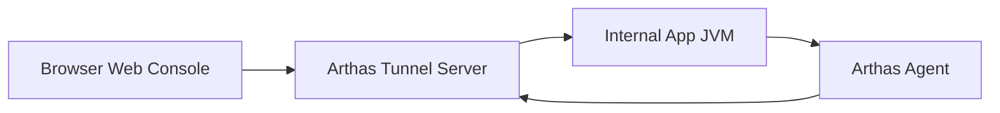
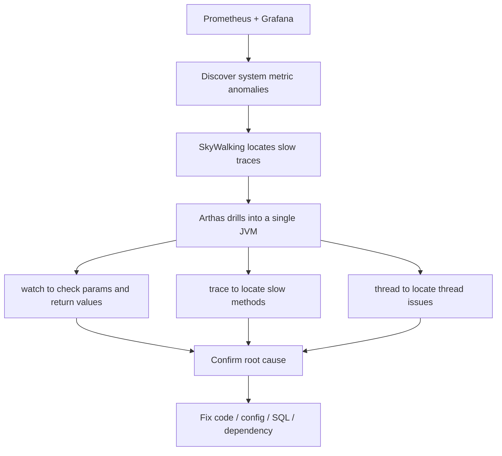
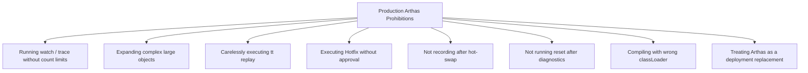
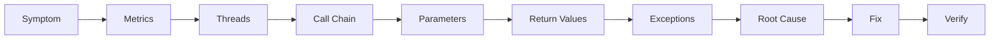

# Arthas in Practice: From Getting Started to Online Code Hot-Swapping

## 1. Introduction: Why Can't Java Online Troubleshooting Do Without Arthas?

In Java production environments, the most painful problems are often not "the code is wrong," but rather:

* No complete debugging environment in production;
* Logs are missing at critical points;
* Issues only occur intermittently under specific traffic;
* Services cannot be restarted casually;
* `jstack` and `jmap` only provide static snapshots, making it hard to observe dynamic call processes.

Traditional JVM tools, while powerful, are more oriented toward "post-mortem analysis." Arthas's value lies in:

**It can directly enter a running JVM and perform real-time observation of method calls, parameters, return values, exceptions, execution time, class loading, and thread states.**

In a nutshell:

> Arthas is the "microscope + scalpel" for Java online troubleshooting.

---

## 2. What Problems Can Arthas Solve?

Arthas is not just a JVM tool; it's more like an online diagnostic platform.



### Common Use Cases

| Scenario | Traditional Approach | Arthas Approach |
| ------------ | -------------------- | ------------------------------ |
| Sudden API slowdown | Check logs, review monitoring, guess SQL or RPC | `trace` to directly locate the slow method |
| Abnormal parameters | Add logs, redeploy | `watch` to observe input parameters in real time |
| Return value not as expected | Debug or add logs | `watch` to inspect the return object |
| Exception thrown in production but insufficient logs | Search exception stack traces | `watch -e` to capture exceptions |
| CPU spike | `top` + `jstack` | `thread -n` to quickly locate hot threads |
| Minor bug in production code | Deploy and restart | `jad + mc + retransform` for temporary hotfix |

---

## 3. Overall Arthas Troubleshooting Workflow

Don't jump straight to `watch` or `trace` when an online issue appears. Follow a "coarse to fine" approach.



---

## 4. Basic Command Quick Reference

Arthas has many commands, but the following are the most commonly used in practice.

| Command | Purpose | Typical Use |
| ------------- | --------------- | --------------- |
| `dashboard` | View JVM real-time status | CPU, memory, GC, thread overview |
| `thread` | View thread status | Troubleshoot CPU spikes, deadlocks, blocking |
| `jad` | Decompile online class | View currently running code |
| `sc` | Search Class | Find class info, classloader |
| `sm` | Search Method | Find method signatures |
| `watch` | Observe method params, return values, exceptions | Troubleshoot business data anomalies |
| `trace` | Trace internal method call timing | Locate slow APIs |
| `stack` | View method call stack | Find who called this method |
| `monitor` | Method call statistics | Count QPS, success rate, average latency |
| `tt` | Time Tunnel | Record method call context, supports replay |
| `classloader` | View classloaders | Resolve class loading, compilation, hot-swap issues |
| `mc` | Memory Compiler | Compile Java files online |
| `retransform` | Retransform class bytecode | Online hot-swap |

---

## 5. Core Commands Advanced: The Power of OGNL

Much of Arthas's power comes from OGNL.

OGNL stands for **Object-Graph Navigation Language**, which can be understood as:

> An expression language that can access Java object properties, methods, collections, and arrays at runtime.

In Arthas, OGNL is commonly used to:

* View method parameters;
* View return values;
* View exception objects;
* Filter specific requests;
* Access object fields;
* Invoke object methods;
* Compose complex output structures.

---

## 6. Watch: More Than Just "Viewing Parameters"

`watch` is one of the most frequently used commands in Arthas, suitable for observing a method's:

* Input parameters;
* Return value;
* Exceptions;
* Current object (target);
* Method execution time.

### 1. Basic Syntax

```bash
watch class_name method_name expression condition
```

Example:

```bash
watch com.example.UserService getUser "{params, returnObj}" -x 2
```

Meaning:

* `params`: method parameters;
* `returnObj`: method return value;
* `-x 2`: object expansion depth of 2.

---

### 2. Observe Input Parameters and Return Values

```bash
watch com.example.OrderService createOrder "{params, returnObj}" -x 3 -n 5
```

Explanation:

* `-x 3`: expand objects to 3 levels;
* `-n 5`: only observe 5 times to avoid flooding the terminal in production.

---

### 3. Observe Only Exceptions

```bash
watch com.example.UserService getUser "{params, throwExp}" -e -x 2 -n 5
```

Explanation:

* `-e`: only trigger when the method throws an exception;
* `throwExp`: the exception object.

---

### 4. Filter by Execution Time

```bash
watch com.example.OrderService createOrder "{params, returnObj}" "#cost > 100" -x 2 -n 5
```

Meaning:
Only observe calls that take longer than `100ms`.

---

### 5. Filter by Parameter

Assume the method parameter is an object, and the first parameter has an `id` field:

```bash
watch com.example.UserService updateUser "{params, returnObj}" "params[0].id == 1001" -x 3 -n 5
```

Meaning:
Only observe requests where `id = 1001`.

---

### 6. Access Object Fields

```bash
watch com.example.UserService getUser "target.userCache" -x 2 -n 5
```

Explanation:

* `target`: the current instance object;
* `target.userCache`: access an instance field.

---

## 7. Trace: Locating the Real Bottleneck of Slow APIs

`trace` is used to trace the timing of internal method call chains.
When an API is slow but logs don't reveal the cause, `trace` is very useful.

### 1. Basic Example

```bash
trace com.example.OrderController createOrder -n 5
```

Output typically looks like:

```text
`---ts=2026-02-25 10:00:00;thread_name=http-nio-8080-exec-1;id=25;is_daemon=true;priority=5;TCCL=...
    `---[320.112ms] com.example.OrderController:createOrder()
        +---[12.331ms] com.example.OrderService:checkParam()
        +---[250.442ms] com.example.OrderService:saveOrder()
        +---[45.221ms] com.example.PaymentClient:prePay()
```

From the result, you can quickly see:

```text
OrderService.saveOrder() took 250ms, which is the main bottleneck.
```

---

### 2. Only View Slow Requests

```bash
trace com.example.OrderController createOrder '#cost > 200' -n 5
```

Meaning:
Only trace requests that take longer than `200ms`.

---

### 3. Trace JDK Methods

By default, Arthas skips JDK methods.
If you need to observe JDK internal calls, add:

```bash
trace com.example.OrderController createOrder '#cost > 200' --skipJDKMethod false -n 5
```

Note:
Use with caution in production; JDK method call chains can be very long.

---

## 8. Stack: Who Called This Method?

Sometimes we know a method is being called, but don't know who is calling it.
In this case, use `stack`.

```bash
stack com.example.UserService getUser -n 5
```

Suitable for troubleshooting:

* Why a particular method is being called so frequently;
* Which entry point a piece of logic is coming from;
* Whether scheduled tasks, async threads, or message consumers are triggering abnormal logic.

---

## 9. Monitor: Method Call Statistics

`monitor` is suitable for observing call statistics of a method over a period of time.

```bash
monitor com.example.OrderService createOrder -c 5
```

Meaning:
Collect method call statistics every 5 seconds.

Typical output includes:

| Field | Meaning |
| --------- | ---- |
| timestamp | Statistics time |
| class | Class name |
| method | Method name |
| total | Call count |
| success | Success count |
| fail | Failure count |
| avg-rt | Average latency |
| fail-rate | Failure rate |

Suitable for determining:

* Whether a method is being called heavily;
* Whether the failure rate is abnormal;
* Whether the average latency has suddenly increased.

---

## 10. TT: Record the Scene, Replay the Call

`tt` stands for Time Tunnel, which can record the context of method calls.

### 1. Record Method Calls

```bash
tt -t com.example.UserService getUser -n 5
```

### 2. View Record List

```bash
tt -l
```

### 3. View Details of a Specific Call

```bash
tt -i 1000
```

### 4. Replay a Call

```bash
tt -i 1000 -p
```

Note:
`tt -p` will re-execute the method; use with extreme caution in production.
If the method involves side effects such as database writes, inventory deductions, message sends, or coupon issuance, replay is not recommended.

---

## 11. Practical Troubleshooting: Abnormal API Return Value

### Scenario

Online users report:

> The user info query API returns a null nickname, but the database clearly has a nickname.

Target API:

```text
GET /api/user/1001
```

Corresponding method:

```java
com.example.UserService#getUser
```

---

### Troubleshooting Steps



### 1. Observe Input Parameters and Return Values

```bash
watch com.example.UserService getUser "{params, returnObj}" "params[0] == 1001" -x 3 -n 5
```

If you find:

```text
params[0] = 1001
returnObj.nickname = null
```

The problem may be caused by:

* Database query result is empty;
* Field lost during DO to VO conversion;
* Business code explicitly setting it to null;
* Interception or processing before serialization.

---

### 2. Trace Internal Calls

```bash
trace com.example.UserService getUser '#cost > 0' -n 5
```

If the output shows:

```text
+---[5ms] UserMapper.selectById()
+---[1ms] UserConverter.toVO()
```

The next step is to observe the conversion method:

```bash
watch com.example.UserConverter toVO "{params, returnObj}" -x 3 -n 5
```

If `params[0].nickname` has a value but `returnObj.nickname` is null, you can basically confirm the conversion logic is the issue.

---

## 12. Advanced Practice: Online Code Hot-Swapping (Hotfix)

One of Arthas's most dangerous yet powerful capabilities is online code hot-swapping.

It can load a modified `.class` into a running JVM without restarting the service.

But it must be clear:

> Arthas Hotfix is more suitable for temporary止血 (stopping the bleeding); it should not replace the normal deployment process.

---

## 13. Hotfix Applicability Boundaries

### Scenarios Suitable for Hotfix

| Scenario | Suitable? |
| ---------- | ---- |
| Adding simple null checks | Suitable |
| Modifying simple conditional logic | Suitable |
| Fixing obviously incorrect constants | Suitable |
| Temporarily disabling an exception branch | Use with caution |
| Modifying a small amount of logic inside a method | Use with caution |

### Scenarios NOT Suitable for Hotfix

| Scenario | Reason |
| --------- | ----------------- |
| Adding new fields | JVM loaded class structure does not support arbitrary changes |
| Adding new methods | Prone to failure or unpredictable behavior |
| Modifying method signatures | Callers won't match |
| Modifying inheritance relationships | Extremely high risk from class structure changes |
| Large-scale business refactoring | Uncontrollable |
| Involving transaction boundary changes | May cause data inconsistency |
| Involving multi-service protocol changes | Upstream/downstream incompatibility |

---

## 14. Hotfix Workflow Diagram



---

## 15. Hotfix Practice: Fixing a NullPointerException

### Scenario

Production code has a null pointer risk:

```java
public String getUserName(User user) {
    return user.getName().trim();
}
```

When `user` or `user.getName()` is null, a `NullPointerException` will be thrown.

Goal:
Temporarily add null checks.

---

### Step 1: Decompile Online Code

```bash
jad --source-only com.example.UserService > /tmp/UserService.java
```

Note:
You must use the code currently running in the online JVM as the basis; do not blindly modify local code.

---

### Step 2: Modify the Source Code

Modify `/tmp/UserService.java`:

```java
public String getUserName(User user) {
    if (user == null || user.getName() == null) {
        return "";
    }
    return user.getName().trim();
}
```

---

### Step 3: Find the ClassLoader

```bash
sc -d com.example.UserService
```

Focus on the output field:

```text
classLoaderHash   xxxxxxxx
```

You can also use:

```bash
sc -d com.example.UserService | grep classLoaderHash
```

---

### Step 4: Compile with mc

```bash
mc -c <classLoaderHash> /tmp/UserService.java -d /tmp
```

Explanation:

* `-c`: specify the classloader;
* `/tmp/UserService.java`: the modified source code;
* `-d /tmp`: output directory for the compiled `.class` file.

---

### Step 5: Load the New Bytecode

```bash
retransform /tmp/com/example/UserService.class
```

After `retransform` succeeds, the new method logic takes effect in the current JVM.

---

### Step 6: Verify the Fix

```bash
watch com.example.UserService getUserName "{params, returnObj, throwExp}" -x 2 -n 5
```

Verification focus:

* Whether `NullPointerException` is still thrown;
* Whether the return value matches expectations;
* Whether normal user requests are affected.

---

## 16. Hotfix Rollback Plan

Always prepare a rollback plan for online hot-swapping.

### Option 1: Retransform with the Original Class

If you backed up the original `.class` in advance:

```bash
retransform /tmp/backup/com/example/UserService.class
```

### Option 2: Redeploy to Override

The most reliable approach:

1. Sync the Hotfix to the code repository;
2. Follow the normal testing process;
3. Redeploy the service;
4. Override the Arthas temporary change.

### Option 3: Restart the Service

Arthas hot-swapping only affects the class in the current JVM's memory.
If the code was not persistently modified, the service will revert to the original version after restart.

---

## 17. retransform vs redefine Comparison

| Dimension | retransform | redefine |
| -------- | ----------- | -------- |
| Recommendation level | More recommended | Less commonly used |
| Supports multiple modifications | Better support | Easily restricted |
| User experience | More stable | Higher risk |
| Applicable scenario | Method internal logic fix | Simple class redefinition |
| Production advice | Use with caution | Use with even more caution |

General recommendation:

```text
Prefer retransform; avoid frequent use of redefine.
```

---

## 18. Remote Diagnostics: Arthas Tunnel

In real enterprise environments, many servers are on internal networks and cannot be directly accessed via SSH.
In this case, you can use Arthas Tunnel for remote diagnostics.



### 1. Start the Tunnel Server

Start on a publicly accessible machine:

```bash
java -jar arthas-tunnel-server.jar
```

Default ports typically include:

```text
7777: WebSocket communication
8080: Web console
```

Actual ports depend on your startup configuration.

---

### 2. Client Connects to Tunnel Server

Execute on the target application machine:

```bash
java -jar arthas-boot.jar \
  --tunnel-server 'ws://public-ip:7777/ws' \
  --agent-id my-app-001
```

Parameter explanation:

| Parameter | Meaning |
| ----------------- | ---------------- |
| `--tunnel-server` | Tunnel Server address |
| `--agent-id` | Current application instance ID |
| `my-app-001` | Custom instance identifier |

---

### 3. Web Interface for Managing Multiple Instances

Through the Arthas Web Console, you can select application instances with different `agent-id`s for diagnostics.

Suitable scenarios:

* Unified diagnostics across multiple servers;
* Container environment troubleshooting;
* Internal network machines without direct SSH access;
* Ops team unified management of Java processes.

---

## 19. Arthas vs Common Monitoring Tools Comparison

| Dimension | Arthas | SkyWalking | Prometheus + Grafana |
| ----------- | ----------- | ----------- | -------------------- |
| Core positioning | Single JVM deep diagnostics | Distributed tracing | Metrics monitoring and alerting |
| Granularity | Method-level, object-level, thread-level | Service-level, API-level, trace-level | Metric-level, instance-level |
| Timeliness | Real-time interactive | Near real-time | Near real-time |
| Intrusiveness | Low, on-demand enhancement | Low, requires Agent | Medium, requires Exporter or instrumentation |
| Usage pattern | Temporary troubleshooting | Long-term observation | Long-term monitoring |
| Suitable problems | Online疑难杂症 (hard-to-diagnose issues) | Slow traces, service dependency anomalies | CPU, memory, QPS, error rate |
| Supports Hotfix | Yes | No | No |

---

## 20. How Do the Three Types of Tools Work Together?



Recommended combination:

```text
Prometheus + Grafana: Responsible for discovering problems
SkyWalking: Responsible for locating traces
Arthas: Responsible for drilling into the JVM to confirm root cause
```

---

## 21. Production Environment Best Practices

### 1. Always Limit watch / trace Execution Count

In production, always use `-n`:

```bash
watch com.example.OrderService createOrder "{params, returnObj}" -x 2 -n 5
```

Do NOT run:

```bash
watch com.example.OrderService createOrder "{params, returnObj}" -x 5
```

Reasons:

* Massive output volume under high concurrency;
* May freeze the terminal;
* May cause additional CPU and I/O overhead;
* Deep expansion levels may trigger extensive object access.

---

### 2. Control Object Expansion Depth

Recommendations:

| Scenario | Recommended Expansion Depth |
| ------ | ------ |
| Simple parameters | `-x 1` |
| Normal DTOs | `-x 2` |
| Nested objects | `-x 3` |
| Complex object graphs | Use with caution |

Do not casually use large `-x` values.

---

### 3. Keep OGNL Expressions Simple

Not recommended:

```bash
watch com.example.Service method "params[0].getA().getB().getC().getD().calculate()" -x 5
```

Recommended:

```bash
watch com.example.Service method "{params[0].id, params[0].status}" -x 2 -n 5
```

Principle:

```text
Only observe necessary fields in production; do not perform complex computations.
```

---

### 4. Reset After Diagnostics

Arthas's enhancement logic remains in the JVM.
After diagnostics, it's recommended to execute:

```bash
reset
```

Or when exiting:

```bash
stop
```

Difference:

| Command | Effect |
| ------- | ---------------------- |
| `reset` | Reset all enhanced classes |
| `stop` | Shut down Arthas Server and reset enhancements |

---

### 5. Avoid High-Cost Commands During Peak Hours

The following commands should be used with caution in production:

| Command | Risk |
| ------------- | ----------- |
| `trace` | High overhead when call chain is long |
| `watch -x 5` | Object expansion too deep |
| `tt -t` | Records call context, consumes memory |
| `tt -p` | May re-execute business logic |
| `heapdump` | May cause disk and memory pressure |
| `retransform` | Modifies production code, high risk |

---

## 22. Production Environment Prohibition Checklist



### Prohibition Summary

1. Do not blindly `trace` during production peak hours.
2. Do not use deep `-x` on large objects.
3. Do not execute `tt -p` on methods with side effects.
4. Do not perform Hotfix without a backup.
5. Do not hot-swap to add new fields, methods, or inheritance relationships.
6. Do not forget to execute `reset` or `stop`.
7. Do not treat Arthas as a long-term fix solution.

---

## 23. Common Command Templates

### 1. View JVM Overview

```bash
dashboard
```

### 2. View High CPU Threads

```bash
thread -n 5
```

### 3. View a Specific Thread's Stack

```bash
thread <threadId>
```

### 4. Decompile a Class

```bash
jad com.example.UserService
```

### 5. Search for a Class

```bash
sc -d com.example.UserService
```

### 6. Search for Methods

```bash
sm -d com.example.UserService
```

### 7. Observe Method Input Parameters and Return Values

```bash
watch com.example.UserService getUser "{params, returnObj}" -x 2 -n 5
```

### 8. Observe Only Exceptions

```bash
watch com.example.UserService getUser "{params, throwExp}" -e -x 2 -n 5
```

### 9. Filter by Execution Time

```bash
watch com.example.UserService getUser "{params, returnObj}" "#cost > 100" -x 2 -n 5
```

### 10. Trace Slow Methods

```bash
trace com.example.UserController getUser '#cost > 200' -n 5
```

### 11. View Call Source

```bash
stack com.example.UserService getUser -n 5
```

### 12. Method Call Statistics

```bash
monitor com.example.UserService getUser -c 5
```

### 13. Reset Enhancements

```bash
reset
```

### 14. Stop Arthas

```bash
stop
```

---

## 24. Arthas Troubleshooting Methodology

Arthas is not about "randomly trying commands"; it's about forming a stable problem-locating methodology.



Recommended troubleshooting order:

1. First observe the symptom: slow API, errors, high CPU, high memory.
2. Then check metrics: `dashboard`, monitoring platform.
3. Then check threads: `thread -n`.
4. Then check call chains: `trace`.
5. Then check data: `watch`.
6. Then check call sources: `stack`.
7. Finally decide: normal deployment, configuration adjustment, SQL optimization, or temporary Hotfix.

---

## 25. Conclusion

Arthas's value is not just "being able to view online parameters," but helping us build stronger online troubleshooting capabilities.

It can accomplish:

* Use `dashboard` to view overall JVM status;
* Use `thread` to locate high CPU threads;
* Use `trace` to find slow methods within slow APIs;
* Use `watch` to view input parameters, return values, and exceptions;
* Use `stack` to find method call sources;
* Use `jad` to confirm the actual code running in production;
* Use `mc + retransform` to perform emergency Hotfix;
* Use Tunnel for remote JVM diagnostics.

But also remember:

> Arthas is an online diagnostic tool, not a万能补丁 (universal patch) tool that replaces the deployment system.

The truly mature way to use it is:

```text
Monitoring discovers problems → Tracing narrows scope → Arthas drills into JVM → Confirm root cause → Temporary止血 (stop the bleeding) → Formal deployment fix
```

Mastering Arthas is not just about learning a few more commands; it's about evolving from "only being able to write code" to a Java engineer who "can locate problems, handle incidents, and safeguard production stability."
