# From Round One to Round Two: Java Backend Internship Interview Retrospective

> **One-sentence summary:** Round one verifies "did you actually build the project," while round two assesses "do you have the awareness to take it to production."

This article is compiled from retrospectives of two rounds of Java backend internship interviews. It's not just a list of interview questions, but a structured upgrade from "having a running project" to "articulating engineering thinking."

If you're preparing for a Java backend internship, campus recruitment, or packaging your project as a resume highlight, this article can help you answer three core questions:

1. What are interviewers really probing with their follow-up questions?
2. How should you present your project without sounding like you're just stacking tech buzzwords?
3. How do you discuss Redis, Docker, Kafka, WebSocket, and JVM troubleshooting with an engineering mindset?

---

## 1. Interview Overview: Differences Between Round One and Round Two

The differences between the two rounds are quite clear:

- **Round one focuses on fundamentals and authenticity**: Did you actually write the project? Can you explain the core flow clearly? Do you genuinely understand Java collections, caching, and Docker?
- **Round two focuses on engineering thinking and production awareness**: Why did you design it this way? What happens on failure? How do you troubleshoot in production? Do you have monitoring, alerting, retries, and degradation?

| Dimension | Round One | Round Two | Trend |
|---|---|---|---|
| Duration | ~30 minutes | ~45 minutes | Deeper probing in round two |
| Interview style | Verify project authenticity | Assess engineering potential | From "have done" to "have owned" |
| Technical focus | Redis, Docker, Java collections, API troubleshooting | Kafka, WebSocket, Docker liveness, JWT, JVM troubleshooting | Increased technical depth |
| Question type | "How did you implement it?" | "Why this design? What if it fails?" | Closer to real production |
| Exposed gaps | Unfamiliar with Dubbo, collection details need reinforcement | Insufficient production troubleshooting experience, lack of engineering safeguards | Need to improve engineering articulation |

### Interview Question Escalation Path

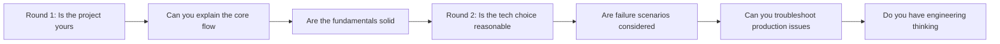

---

## 2. Capability Radar: How Interview Focus Escalates

> Below is a subjective retrospective based on question density and follow-up depth across both rounds.

| Capability | Round 1 Intensity | Round 2 Intensity | Notes |
|---|---:|---:|---|
| Project depth | 8 | 9 | Both rounds kept probing the project |
| Java fundamentals | 7 | 5 | Round one focused more on collections, strings, Maven |
| Middleware understanding | 7 | 8 | Redis, Docker, and Kafka were all asked about |
| Architecture design | 5 | 8 | Round two started probing design rationale |
| Troubleshooting ability | 6 | 9 | Round two heavily tested CPU spike diagnosis |
| Engineering thinking | 5 | 9 | The real differentiator in round two |

## 3. Round One Retrospective: Project Authenticity and Fundamentals

Round one was moderately difficult overall. The core intent wasn't to trip you up, but to confirm four things:

1. Did you actually build the project?
2. Can you trace the technical path from entry point to exit?
3. Are there obvious gaps in your Java fundamentals?
4. Do you have a basic troubleshooting approach for everyday issues?

---

### 3.1 Spring Cache Extension: How to Solve the Three Major Caching Problems

The interviewer specifically asked how the Spring Cache extension tool handles cache penetration, cache stampede, and cache avalanche.

| Problem | Typical Risk | Common Solutions | High-Quality Articulation |
|---|---|---|---|
| Cache penetration | Non-existent data repeatedly hits the DB | Bloom filter, null value caching, parameter validation | "Pre-filter invalid keys + short TTL null result fallback" |
| Cache stampede | Hot key expires, causing a flood of requests to the source | Distributed lock, local lock, SingleFlight | "Allow only one thread to fetch from source; others wait or return stale values" |
| Cache avalanche | Mass key expiration causes sudden DB pressure | TTL jitter, warm-up, rate limiting, degradation | "Stagger expiration times + async renewal for hot keys + degradation protection" |

#### Cache Protection Pipeline

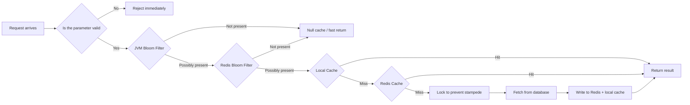

#### Recommended Answer Template

> I added a Bloom filter and parameter validation at the front of the cache pipeline to intercept obviously non-existent or invalid keys. For data that genuinely doesn't exist in the database, I write a short-TTL null value cache entry to prevent requests from repeatedly hitting the DB. For hot key invalidation, I use a local lock or Redis distributed lock to implement a SingleFlight mechanism, allowing only one thread to fetch from the source while others wait, retry, or return stale values. For avalanche prevention, I add random jitter to TTLs and combine it with hot key warm-up, async renewal, and rate-limited degradation.

---

### 3.2 OJ Code Sandbox: How Docker Runs User Code

The core problem with the OJ project is: **user-submitted code must not be executed directly on the host machine.**

Running user code directly introduces several risks:

- Malicious code could delete files or read sensitive directories;
- Infinite loops could consume all CPU;
- Large objects could exhaust memory;
- Resource usage is uncontrolled when multiple submissions run concurrently.

#### Code Sandbox Execution Flow

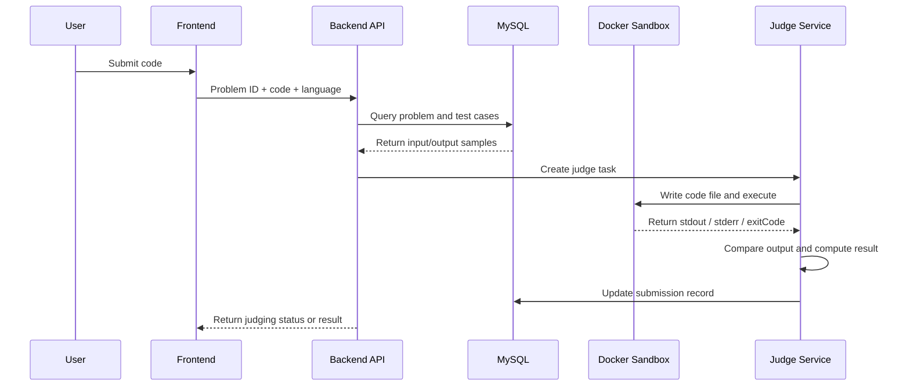

#### What the Docker Sandbox Must Restrict

| Restriction | Purpose | Example |
|---|---|---|
| CPU | Prevent infinite loops from consuming the machine | `--cpus=1` |
| Memory | Prevent OOM from affecting the host | `--memory=256m` |
| Execution time | Prevent tasks from running indefinitely | Backend periodically kills the process |
| File system | Prevent writing to dangerous directories | Mount only a temp directory |
| Network | Prevent access to external networks | `--network=none` |
| Process count | Prevent fork bombs | Limit PID count |

#### Recommended Answer Template

> I don't execute user code directly on the host. Instead, I create a restricted container using a pre-built language image. The backend writes the user's code and test cases to a temporary directory, then mounts it into the container for execution via a script. On the container side, I restrict CPU, memory, execution time, network, and file access scope. After execution, the backend collects stdout, stderr, and exitCode, compares them against expected output, and updates the submission result.

---

### 3.3 Frontend Button Not Responding: How to Troubleshoot from the Backend

This question seems simple but is highly practical. Don't just answer "check the logs" -- troubleshoot layer by layer.

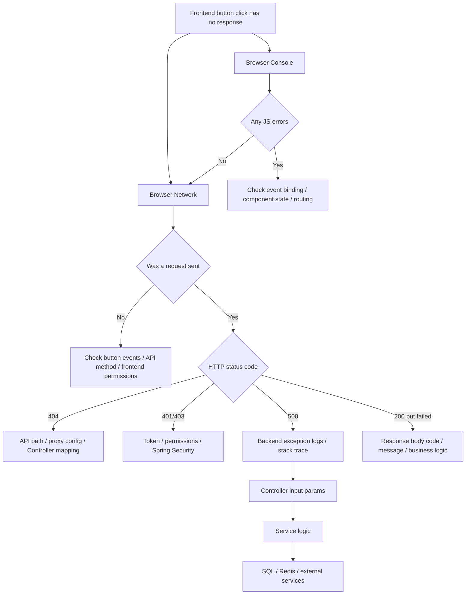

#### Recommended Answer Template

> I'd start by opening the browser Console and Network panels. First, check for any JS errors on the frontend, then see whether a request was actually sent. If the request wasn't sent, prioritize investigating the button event handler, API wrapper, frontend permissions, or routing. If the request was sent, diagnose based on the status code: 404 means check the path and proxy; 401/403 means check the token and permissions; 500 means check backend logs and stack traces. If it's 200 but the business logic failed, examine the business code and message in the response body, then trace through the Controller, Service, and SQL layers.

---

### 3.4 HashSet Custom Object Deduplication: Why Override Both equals and hashCode

| Method | Purpose |
|---|---|
| `equals()` | Determines whether two objects are logically equal |
| `hashCode()` | Determines the bucket position in a hash table |
| Problem with only overriding `equals()` | Two logically equal objects may end up in different buckets, causing deduplication to fail |
| Correct approach | `equals()` and `hashCode()` must be consistent |

Example code:

```java
import java.util.Objects;

public class User {
    private Long id;
    private String username;

    @Override
    public boolean equals(Object o) {
        if (this == o) return true;
        if (!(o instanceof User user)) return false;
        return Objects.equals(id, user.id);
    }

    @Override
    public int hashCode() {
        return Objects.hash(id);
    }
}
```

#### Key Points for Interview Articulation

> HashSet is backed by HashMap. When adding an element, it first uses hashCode to locate the bucket, then uses equals to check for equality. If you only override equals without overriding hashCode, two logically equal objects may have different hashCodes, landing in different buckets, ultimately causing HashSet deduplication to fail.

---

## 4. Round Two Retrospective: Technology Selection and Engineering Thinking

Round two questions were noticeably closer to real production environments. The interviewer was no longer satisfied with "what did you use" -- they kept pushing:

- Why use it?
- Can you not use it?
- What are the trade-offs?
- What happens when it fails?
- Do you have monitoring, alerting, retries, and degradation?

---

### 4.1 Why WebSocket Cannot Replace HTTP

WebSocket and HTTP are not replacements for each other -- they suit different scenarios.

| Comparison | HTTP | WebSocket |
|---|---|---|
| Communication model | Request-response | Full-duplex persistent connection |
| Server push | Not natively supported; typically polling or SSE | Natively supports server-initiated push |
| Connection cost | Resources released quickly after request completes | Must maintain connection, heartbeat, and reconnection |
| Suitable scenarios | CRUD, queries, form submissions, file uploads | Chat, collaborative editing, real-time notifications, judge result push |
| Main concern | Weak real-time capability | Persistent connections consume resources; governance is complex |

#### WebSocket Communication State Diagram

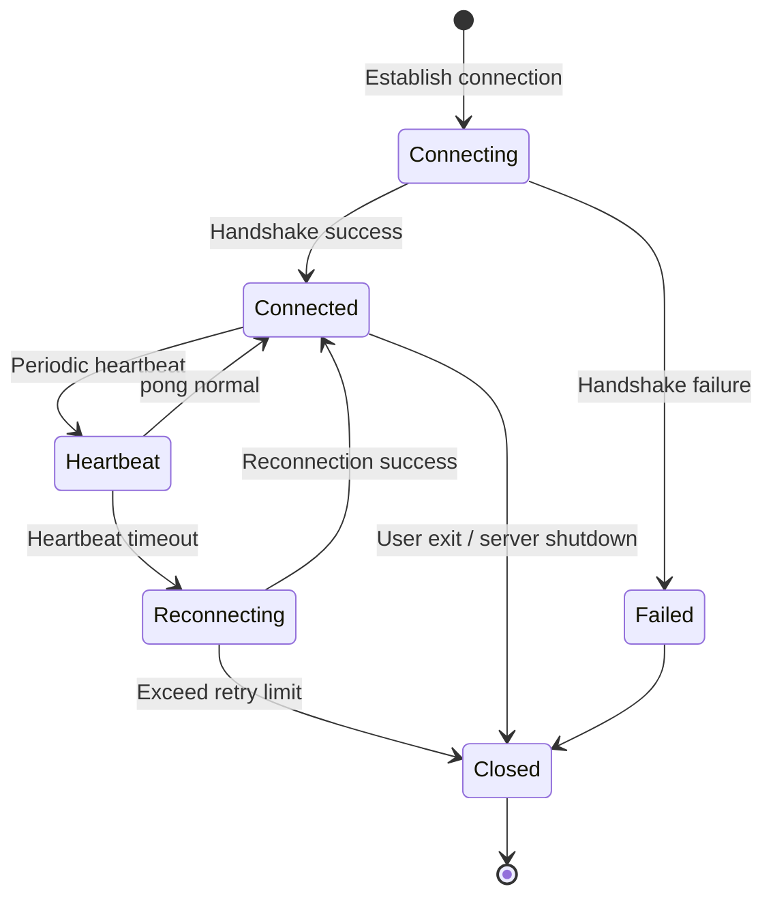

#### Recommended Answer Template

> WebSocket is suitable for real-time push but not for replacing all HTTP requests. Since WebSocket is a persistent connection, it requires maintaining connection state, heartbeats, reconnection logic, connection count limits, and memory usage. Most CRUD requests are naturally one-request-one-response, where HTTP is simpler and better suited for gateways, caching, load balancing, and monitoring systems. In my project, WebSocket is only used for judge result push or chat message push; regular API calls still go through HTTP.

---

### 4.2 Why the OJ System Introduced Kafka

OJ judging is a classic time-consuming task. If code is judged synchronously after submission, peak periods can easily cause:

- API threads being occupied for long durations;
- Docker execution resources being exhausted;
- User request timeouts;
- The judge service and API service affecting each other.

#### Kafka Async Judging Architecture

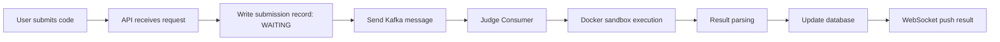

#### Value of Kafka in OJ

| Value | Description |
|---|---|
| Peak shaving | Queue submissions during peak periods; consumers process at their own capacity |
| Decoupling | The API service only receives submissions; the judge service independently handles execution |
| Async processing | Users don't have to block waiting for Docker execution to complete |
| Recoverability | Failed consumption can be retried, avoiding direct task loss |
| Scalability | Multiple judge consumers can scale horizontally |

#### Recommended Answer Template

> I introduced Kafka not to pad the tech stack, but because judging is a time-consuming task. The API service only receives submissions, persists them as WAITING status, then sends a Kafka message. The judge consumer processes tasks at its own capacity, executes the Docker sandbox, updates the result, and pushes it via WebSocket. This enables peak shaving, decoupling, and async processing, and also makes it easier to horizontally scale judge consumers later.

---

### 4.3 What to Do When a Docker Container Goes Down

Just answering `restart: always` isn't enough. It's basic liveness, but production design also needs health checks, failure thresholds, container rebuilding, alerting, and degradation.

#### Container Liveness and Failure Handling Flow

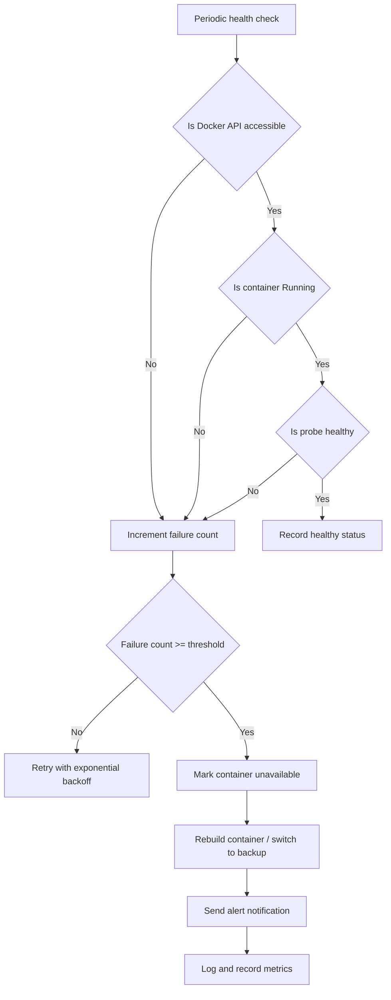

#### Engineering Supplement Points

| Direction | Description |
|---|---|
| Resource limits | Restrict CPU, memory, process count, execution time |
| Health checks | Periodically check container status and probe results |
| Failure retry | Brief failures should trigger backoff and retry before declaring failure |
| Container rebuild | Destroy and rebuild the container after multiple failures |
| Alert notifications | Record failure rate, abnormal exit codes, stderr |
| Degradation strategy | When the container pool is unavailable, set submission status to `JUDGE_DELAYED` |

#### Recommended Answer Template

> `restart: always` only handles automatic restarts when the container process exits. In real scenarios, you also need health checks. I periodically check container status via the Docker API and execute probe tasks to confirm the container can properly run code. If consecutive failures reach the threshold, I mark the container as unavailable, rebuild it or switch to a backup, and simultaneously log, record metrics, and send alerts. If the entire container pool is unavailable, I mark the submission status as delayed judging to avoid outright task failure.

---

### 4.4 Chain of Responsibility Pattern: How to Avoid Designing for the Sake of Design Patterns

Round two asked about using the Chain of Responsibility pattern for the cache middleware. The key isn't reciting the design pattern definition, but explaining whether it actually solved a problem.

#### Cache Chain of Responsibility Design

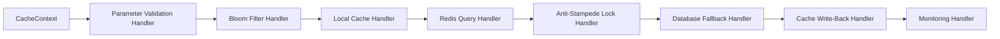

| Design Benefit | Concrete Manifestation |
|---|---|
| Extensibility | Future nodes for rate limiting, canary releases, degradation, monitoring can be plugged in |
| Observability | Each Handler can track latency, hit rate, and failure rate |
| Replaceability | DB fallback, Redis query, and local cache can all be replaced independently |
| Low invasiveness | Avoids piling all logic into one oversized Service method |

#### Proactively State the Boundaries

> If the pipeline only has two or three steps, a regular Service or template method is sufficient. The Chain of Responsibility is appropriate when there are many steps, pluggable behavior, and a need for monitoring and extensibility. Using it just to apply a design pattern adds unnecessary comprehension cost.

This answer is much more mature than simply saying "I used the Chain of Responsibility pattern."

---

### 4.5 JWT Authentication: You Can't Just Say "Stateless"

JWT is a high-frequency topic. Just answering "JWT is stateless, Session is stateful" isn't enough -- you need to address revocation control and security concerns.

| Comparison | Session | JWT |
|---|---|---|
| State storage | Server stores session | Token is self-contained with user info |
| Distributed support | Requires shared Session or Redis | Naturally suited for distributed systems |
| Server-side control | Easy to invalidate proactively | Proactive revocation is more difficult |
| Security risk | Session ID leak | Token leak allows use within validity period |
| Common approach | Redis Session | Access Token + Refresh Token + blacklist |

#### JWT Authentication Flow

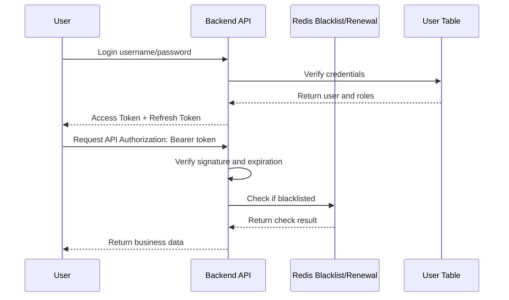

#### Recommended Answer Template

> JWT's advantage is being stateless, which suits distributed systems since the server doesn't need to store sessions. But the problem is that once issued, a token is difficult to revoke proactively before it expires. So in production, we typically set a short Access Token validity period, combined with a Refresh Token for renewal. If a user logs out, changes their password, or their account is banned, we can put the token's jti into a Redis blacklist and check the blacklist during API authentication.

---

## 5. Production Troubleshooting: How to Diagnose a CPU Spike

The most critical question in round two was:

> A machine in Linux has extremely high load -- how do you figure out which process is causing it? Once you have the process ID, how do you drill down further?

Answering "just `kill -9`" would be extremely dangerous in a real production environment.

---

### 5.1 Why You Shouldn't Just kill -9

| Risk | Description |
|---|---|
| Data inconsistency | In-progress transactions, file writes, and message consumption may be forcibly interrupted |
| Lost forensic evidence | Thread stacks, heap info, and GC state are gone before being collected |
| Escalated failure | Killing a core service may cause mass request failures |
| No post-mortem possible | Without an evidence chain, it's very hard to locate the root cause later |

The correct approach is: **preserve the scene first, then diagnose the problem, and finally decide on the remediation.**

---

### 5.2 CPU Spike Troubleshooting Flow

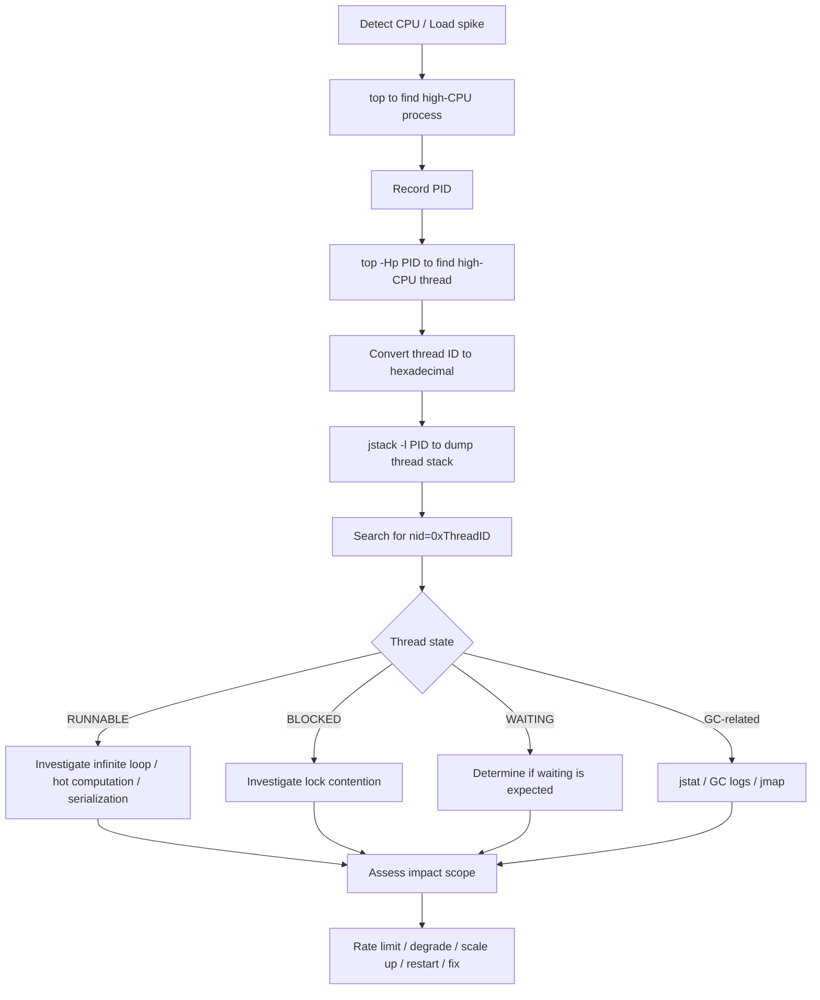

---

### 5.3 Common Command Reference

```bash
# 1. View overall load and high-CPU processes
top

# 2. View per-thread CPU usage within a Java process
top -Hp <pid>

# 3. Convert decimal thread ID to hexadecimal
printf "%x\n" <tid>

# 4. Dump Java thread stack
jstack -l <pid> > jstack.log

# 5. Search for the corresponding thread in jstack output
 grep -n "nid=0x<hex_tid>" jstack.log

# 6. View GC usage statistics
jstat -gcutil <pid> 1000 10

# 7. View heap memory summary
jmap -heap <pid>

# 8. View open files and ports for a process
lsof -p <pid>

# 9. Trace system calls
strace -p <pid>
```

---

### 5.4 Interview Answer Template

> I wouldn't kill the process immediately. Instead, I'd preserve the scene first. I'd use `top` to find the high-CPU Java process, then `top -Hp <pid>` to identify the specific high-CPU thread, convert the thread ID to hexadecimal, and use `jstack` to dump the thread stack. Then I'd locate the corresponding thread in the stack file by searching for `nid`. Next, I'd examine the thread state: if `RUNNABLE`, I'd focus on infinite loops, complex computations, or frequent serialization in hot code paths; if `BLOCKED`, I'd investigate lock contention; if there's frequent GC, I'd analyze further with `jstat`, GC logs, and heap dumps. After confirming the cause, I'd choose rate limiting, degradation, scaling, restart, or a code fix based on the impact scope.

---

## 6. High-Frequency Question Categorized Summary

### 6.1 Project-Related Questions

| Question | Assessment Focus | Key to Answering |
|---|---|---|
| What was your most challenging project | Project depth | Business complexity + technical difficulty + your specific ownership |
| How is the OJ code sandbox implemented | Docker practical experience | Images, containers, scripts, resource limits, security isolation |
| What problem does Kafka solve in your project | Async architecture | Peak shaving, decoupling, retries, consumer scaling |
| Why use WebSocket | Real-time communication | Judge result push, persistent connection cost, comparison with HTTP |
| What happens when a container goes down | Engineering safeguards | Health checks, exponential backoff, rebuild, alerting |

### 6.2 Fundamentals Questions

| Question | Standard Answer Direction |
|---|---|
| ArrayList vs LinkedList | Dynamic array vs doubly-linked list; query, insert, delete complexity; ArrayList is more commonly used in practice |
| HashSet custom object deduplication | Override both equals and hashCode |
| String reversal | Two pointers, StringBuilder reverse, reverse iteration |
| Common Maven commands | clean, compile, test, package, install, deploy |
| Dubbo vs Spring Cloud | RPC framework vs microservice ecosystem; communication protocol, service governance, use cases |

### 6.3 Engineering Questions

| Question | High-Quality Answer Keywords |
|---|---|
| How to troubleshoot a frontend button error | Console, Network, status code, logs, breakpoints, distributed tracing |
| How to troubleshoot production CPU spike | top, top -Hp, jstack, nid, thread state, GC |
| JWT vs Session | Stateless, distributed, blacklist, renewal, token revocation control |
| Excel export performance optimization | Async tasks, streaming writes, paginated queries, rate limiting, duplicate submission prevention |
| Is the design pattern over-engineering | Scenario boundaries, extensibility, observability, complexity-to-benefit ratio |

---

## 7. Project Presentation Upgrade: How to Repackage the OJ Project

Many students have solid projects, but their interview presentation often boils down to:

> I used Spring Boot, Redis, Docker, Kafka, and WebSocket.

The problem with this statement is: **you're just listing tech buzzwords without explaining the business problem or the technical value delivered.**

A better way to present it:

> I built a LeetCode-like online judge system. The core challenges were safely executing user-submitted code, handling async judging during peak periods, pushing results in real time, and ensuring the stability and observability of judging containers.

---

### 7.1 Project Architecture Diagram

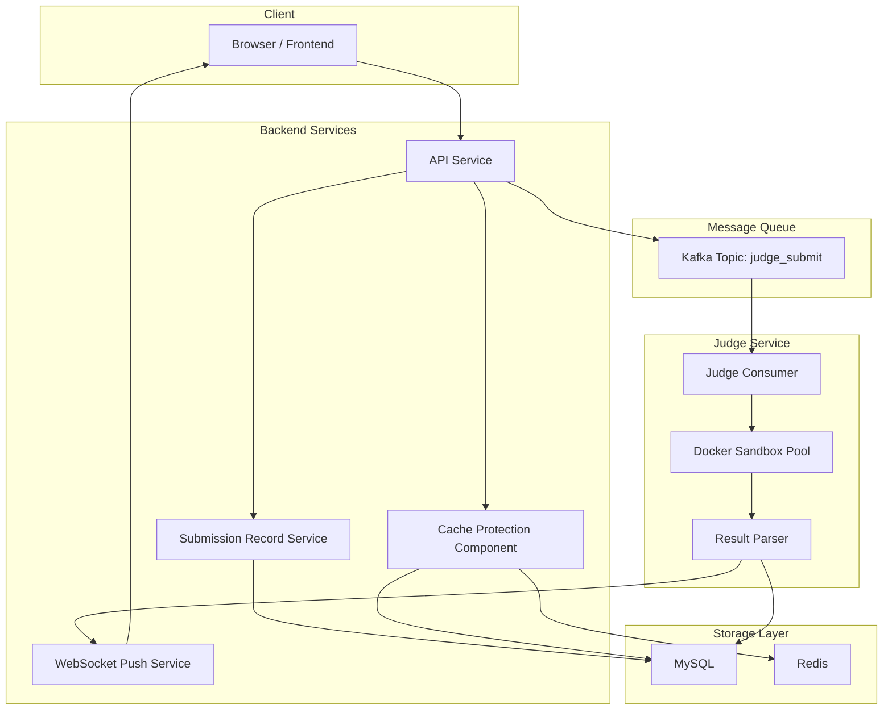

---

### 7.2 Project Highlight Expression Table

| Highlight | Immature Expression | Mature Expression |
|---|---|---|
| Docker sandbox | I used Docker to run code | I use Docker to isolate user code execution environments, restricting CPU, memory, time, network, and file system permissions |
| Kafka | I used Kafka | I use Kafka to decouple submission requests from judge execution, solving the thread blocking problem caused by synchronous judging during peak periods |
| WebSocket | I used WebSocket | I use WebSocket to push judging results, avoiding frequent frontend polling and improving user experience |
| Redis | I used Redis for caching | I use Redis + local cache + Bloom filter to protect hot data, handling penetration, stampede, and avalanche issues |
| Monitoring safeguards | I did error handling | I record container execution latency, failure rate, exit codes, and stderr; on anomalies, I retry, degrade, and send alerts |

---

### 7.3 Interview Project Presentation Structure

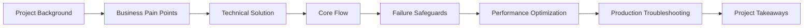

Present in this recommended order:

1. **Project background**: What system is this, and what problem does it solve.
2. **Business pain points**: Slow synchronous judging, unsafe user code, high traffic during peaks.
3. **Technical solution**: Docker sandbox, Kafka async, WebSocket push, Redis caching.
4. **Core flow**: The complete path from user code submission to final result return.
5. **Failure safeguards**: Timeouts, container failures, message consumption failures, duplicate submissions.
6. **Performance optimization**: Caching, async processing, rate limiting, container pooling.
7. **Production troubleshooting**: Logs, metrics, thread stacks, GC, container status.
8. **Project takeaways**: Going from "features that run" to "production-ready thinking."

---

## 8. Pre-Interview Improvement Roadmap

If you want to upgrade from a "student project" to a "production-ready project," follow this sequence.

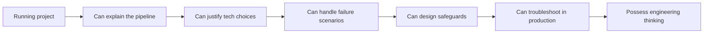

| Stage | Goal | Recommended Improvements |
|---|---|---|
| Stage 1 | Clearly explain the project pipeline | Request entry points, core flow, database tables, key APIs |
| Stage 2 | Articulate technology selection rationale | Why Redis, Docker, Kafka, WebSocket |
| Stage 3 | Cover failure scenarios completely | Timeouts, failures, retries, idempotency, rate limiting, degradation |
| Stage 4 | Demonstrate professional production troubleshooting | top, jstack, jmap, jstat, Arthas, log-based diagnosis |
| Stage 5 | Mature engineering articulation | Monitoring, alerting, canary releases, disaster recovery, capacity planning, load testing |

---

## 9. Final Summary

The biggest takeaway from these two interview rounds is:

> Round one determines whether you have the fundamentals; round two determines whether you have engineering potential.

In round one, as long as the project is authentic, your fundamentals are solid, and your troubleshooting approach is clear, you can generally hold the conversation. In round two, the interviewer gradually pushes questions toward real production scenarios:

- What happens when a container goes down?
- Why use Kafka?
- Why shouldn't WebSocket be overused?
- How to diagnose a production CPU spike?
- Is the design pattern over-engineering?

What truly differentiates candidates isn't "how many tech buzzwords you know," but these five things:

1. **You can present the project pipeline as a closed loop**: From request entry to result return, who's responsible for each step and how data flows.
2. **You can explain technology selection rationale**: Why this component, what problem it solves, what trade-offs it introduces.
3. **You can consider failure scenarios**: Timeouts, exceptions, retries, idempotency, resource exhaustion, service degradation.
4. **You can preserve the production scene**: Diagnose first, collect evidence, assess impact, then decide whether to restart or mitigate.
5. **You demonstrate respect for production**: Production isn't your personal server -- you can't just `kill -9` on a hunch.

One final piece of advice for those preparing for Java backend internships:

> A project isn't about stacking tech buzzwords -- it's about clearly articulating the business problem, the technical solution, the failure safeguards, and the production troubleshooting. If you can explain these four things well, your interview competitiveness will improve significantly.

---

## Appendix: Pre-Interview Self-Check List

| Self-Check Item | Can You Answer |
|---|---|
| Can you introduce the project background and core challenges in 1 minute | ☐ |
| Can you draw the core project architecture diagram | ☐ |
| Can you explain the complete pipeline of a single request | ☐ |
| Can you describe how you handle Redis cache penetration, stampede, and avalanche | ☐ |
| Can you explain the security restrictions of the Docker sandbox | ☐ |
| Can you describe the peak-shaving, decoupling, and retry value of Kafka | ☐ |
| Can you explain the applicable boundaries of WebSocket vs HTTP | ☐ |
| Can you explain how to proactively revoke a JWT | ☐ |
| Can you walk through the complete CPU spike troubleshooting process | ☐ |
| Can you identify the failure safeguards and monitoring points in your project | ☐ |