# Java Online Performance Troubleshooting Guide: From CPU Spikes to Arthas Hot-Swapping

When a production server's CPU suddenly spikes to 90% or even 100%, it typically comes with API timeouts, SSH lag, log flooding, thread pool saturation, and service unavailability.

Many people's first instinct is to run:

```bash
kill -9 <PID>
# or simply restart the service / reboot the machine
```

However, this is often one of the most dangerous approaches. It destroys the scene, making it impossible to determine afterwards whether the cause was a business logic infinite loop, a GC storm, thread pool exhaustion, a kernel interrupt anomaly, or a cascade triggered by insufficient memory.

At the same time, Java online troubleshooting faces another dimension of challenges:

* No complete debugging environment in production;
* Logs are missing at critical points;
* Issues only occur intermittently under specific traffic;
* `jstack` and `jmap` only provide static snapshots, making it hard to observe dynamic call processes.

This article follows the "mitigate → preserve evidence → diagnose → recover → review" main thread, while diving deep into Arthas as the Java online diagnostic tool, providing a complete troubleshooting methodology:

> Mitigate first, then preserve evidence; diagnose first, then recover; review first, then prevent. Use Arthas as the "microscope + scalpel" for the JVM.

---

## 1. Overall Troubleshooting Approach: Four-Phase Methodology

When facing high CPU on Linux, don't rush to reboot. Follow these four phases instead.

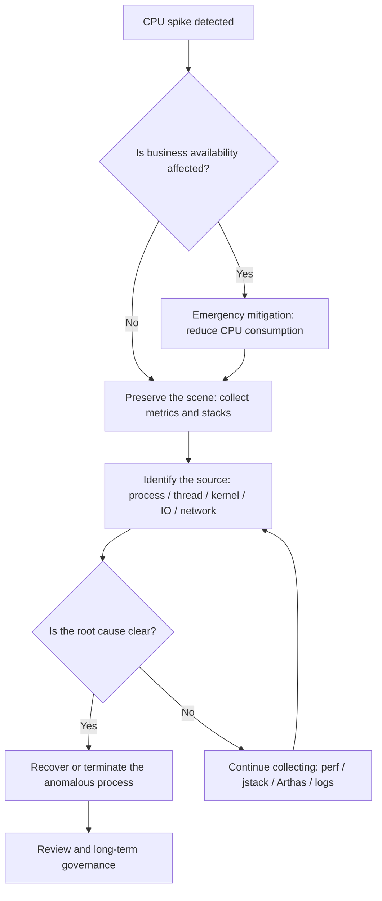

Core principles:

| Phase | Goal | What NOT to do | Recommended action |
| -- | ----------- | ------------ | ---------------------- |
| Mitigate | Restore the machine to an operable state | Directly `kill -9` | `kill -STOP` to pause the anomalous process |
| Preserve Evidence | Retain the fault scene | Analyze only after reboot | Save `top`, `ps`, threads, stacks, logs |
| Diagnose | Find the source of CPU consumption | Look only at process-level CPU | Drill down to threads, functions, system resources |
| Recover | Control the blast radius | Blindly restore all traffic | Gradual recovery, canary validation |
| Prevent | Avoid recurrence | Write only "fixed" in the ticket | Add resource limits, monitoring, load testing, code fixes |

For Java applications, introducing Arthas can significantly accelerate the "diagnose" phase. We'll first cover system-level mitigation and evidence preservation, then gradually dive into Arthas usage.

---

## 2. Quick Mitigation and Evidence Preservation

### 2.1 First Check If the System Is Still Operable

If you can still type commands on the machine, start by checking the overall load:

```bash
uptime
```

Focus on:

```text
load average: 12.34, 10.21, 8.90
```

On a 4-core machine, a sustained load above 4 is a warning sign; on an 8-core machine, a sustained load above 8 indicates significant queuing.

Check the number of CPU cores:

```bash
nproc
```

Check overall CPU, memory, and process status:

```bash
top
```

If `top` itself is lagging, use a snapshot-style command:

```bash
ps -eo pid,ppid,user,stat,cmd,%cpu,%mem --sort=-%cpu | head -n 15
```

Example output:

```text
  PID  PPID USER  STAT CMD                         %CPU %MEM
12345     1 app   Sl   java -jar order-service.jar 389  42.1
22331     1 root  R    nginx: worker process        78   1.2
```

The key things to identify here are:

* Which process has the highest CPU;
* Whether it's a single process with high CPU, or multiple processes together;
* Whether the high CPU is from a business process or a system process.

---

### 2.2 Use STOP to Pause the Process, Don't KILL It Directly

If a business process has saturated the CPU and the machine has become unresponsive, you can pause it first:

```bash
sudo kill -STOP <PID>
```

`SIGSTOP` causes the process to pause execution. It does not release memory or destroy the process context, making it ideal for "mitigate + preserve the scene."

Comparison of common signals:

| Signal | Command | Effect | Preserves the scene? | Use case |
| ---- | ------------------ | ---- | ------ | ----------- |
| STOP | `kill -STOP <PID>` | Pause the process | Yes | Emergency mitigation for high CPU |
| CONT | `kill -CONT <PID>` | Resume the process | Yes | Resume for validation after evidence collection |
| TERM | `kill -TERM <PID>` | Graceful termination | Partially | Normal service shutdown |
| KILL | `kill -9 <PID>` | Force kill | No | Last resort when the process cannot exit normally |

> In production environments, `kill -9` should be the last resort, not the first.

---

### 2.3 Preserve the Evidence

After CPU has come down, don't rush to restore the service. The most important thing now is to save the scene.

It's recommended to save everything to a single directory:

```bash
mkdir -p /tmp/cpu-debug-$(date +%F-%H%M%S)
cd /tmp/cpu-debug-*
```

Collect system snapshots:

```bash
date > date.txt
uptime > uptime.txt
nproc > cpu_count.txt
free -h > memory.txt
df -h > disk.txt
ps -eo pid,ppid,user,stat,cmd,%cpu,%mem --sort=-%cpu > ps_cpu.txt
top -b -n 1 > top.txt
```

If `vmstat`, `pidstat`, and `mpstat` are available, continue collecting:

```bash
vmstat 1 10 > vmstat.txt
mpstat -P ALL 1 5 > mpstat.txt
pidstat -u -p ALL 1 5 > pidstat.txt
```

---

### 2.4 Identify the CPU Type: user, system, iowait, softirq

The CPU line in `top` typically looks like:

```text
%Cpu(s): 85.0 us,  8.0 sy,  0.0 ni,  5.0 id,  1.0 wa,  0.0 hi,  1.0 si,  0.0 st
```

Meaning of each field:

| Field | Meaning | Common causes |
| -- | ------- | ------------------- |
| us | User-space CPU | Business code computation, infinite loops, serialization, encryption/compression |
| sy | Kernel-space CPU | Frequent syscalls, network stack, filesystem operations |
| wa | I/O wait | Slow disk, slow database, log flushing, swap |
| hi | Hard interrupts | Hardware interrupt anomalies |
| si | Soft interrupts | Excessive network packets, DDoS, small-packet storms |
| st | Steal time (virtualization) | Cloud VM resource contention |
| id | Idle | CPU idle percentage |

Diagnostic direction:

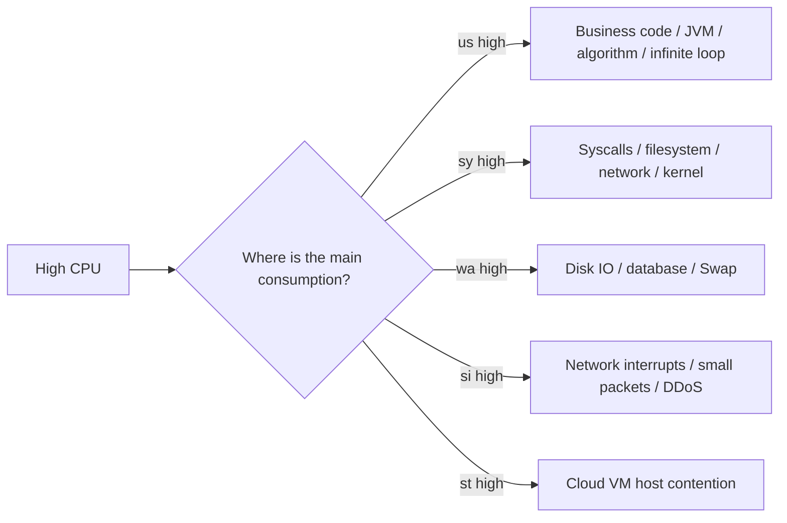

---

## 3. Arthas: The Java Online Diagnostic Tool

### 3.1 Why Can't Java Online Troubleshooting Do Without Arthas?

Traditional JVM tools, while powerful, are more oriented toward "post-mortem analysis." Arthas's value lies in:

**It can directly enter a running JVM and perform real-time observation of method calls, parameters, return values, exceptions, execution time, class loading, and thread states.**

In a nutshell:

> Arthas is the "microscope + scalpel" for Java online troubleshooting.

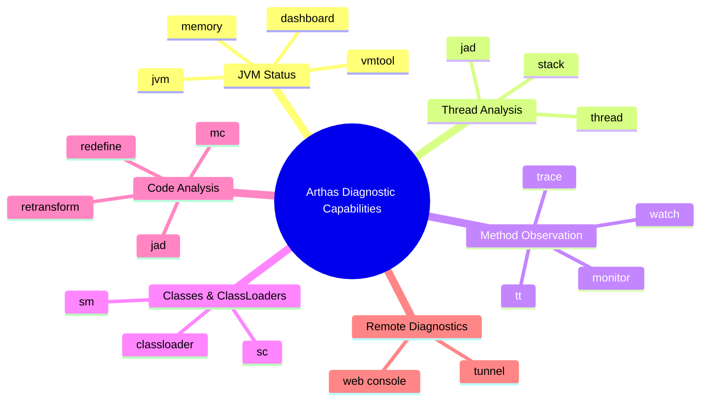

### 3.2 Arthas Core Command Quick Reference

| Command | Purpose | Typical Use |
| ------------- | --------------- | --------------- |
| `dashboard` | View JVM real-time status | CPU, memory, GC, thread overview |
| `thread` | View thread status | Troubleshoot CPU spikes, deadlocks, blocking |
| `jad` | Decompile online class | View currently running code |
| `sc` | Search Class | Find class info, classloader |
| `sm` | Search Method | Find method signatures |
| `watch` | Observe method params, return values, exceptions | Troubleshoot business data anomalies |
| `trace` | Trace internal method call timing | Locate slow APIs |
| `stack` | View method call stack | Find who called this method |
| `monitor` | Method call statistics | Count QPS, success rate, average latency |
| `tt` | Time Tunnel | Record method call context, supports replay |
| `classloader` | View classloaders | Resolve class loading, compilation, hot-swap issues |
| `mc` | Memory Compiler | Compile Java files online |
| `retransform` | Retransform class bytecode | Online hot-swap |

### 3.3 Overall Arthas Troubleshooting Workflow

Don't jump straight to `watch` or `trace` when an online issue appears. Follow a "coarse to fine" approach.

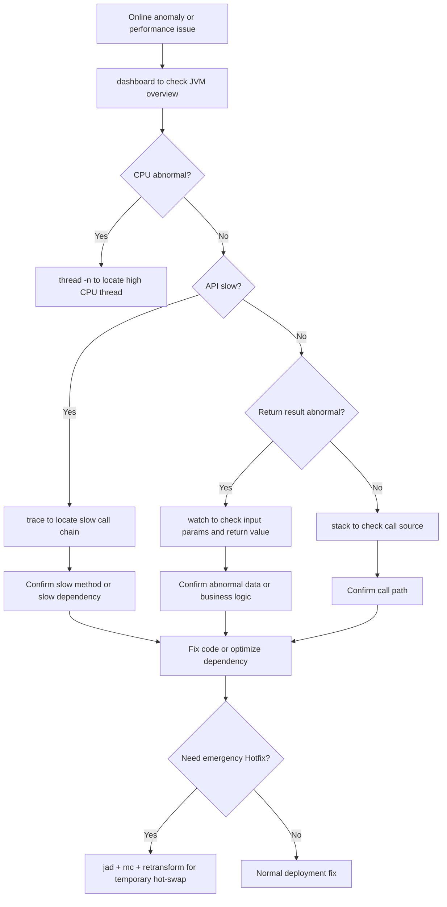

---

## 4. Thread-Level Diagnosis: Deep Dive into CPU Spike Scenarios

### 4.1 Identify the Most CPU-Intensive Process

```bash
ps -eo pid,ppid,user,stat,cmd,%cpu,%mem --sort=-%cpu | head -n 15
```

Suppose you find a Java process consuming very high CPU:

```text
12345 app java -jar order-service.jar 389% 42.1%
```

389% means it's using roughly 4 CPU cores.

---

### 4.2 Identify the Most CPU-Intensive Thread Within a Process

For multi-threaded programs like Java, C++, or Go, knowing just the PID is not enough — you need to drill down to the thread level.

```bash
top -Hp <PID>
```

Example:

```bash
top -Hp 12345
```

In the output, focus on the thread IDs:

```text
PID     USER  PR NI VIRT RES SHR S %CPU COMMAND
12367   app   20  0  ... ... ... R 99.9 java
12368   app   20  0  ... ... ... R 98.7 java
```

Here `12367` and `12368` are thread IDs.

Thread IDs in Java stack traces are typically in hexadecimal, so you need to convert:

```bash
printf "%x\n" 12367
```

For example, the output:

```text
304f
```

Then search in the `jstack` output:

```bash
jstack -l 12345 > jstack.txt
grep -n "304f" jstack.txt
```

---

### 4.3 Java High CPU Common Causes and Diagnosis Path

The most common causes of high CPU in Java services:

| Type | Typical symptoms | Diagnostic tools | Common root causes |
| ------ | ---------------------- | -------------------- | ------------------ |
| Infinite loop | One or a few threads at 100% | `top -Hp` + `jstack` | while loop, recursion, state machine error |
| GC storm | High CPU, throughput drop, frequent GC in logs | `jstat` + GC logs | Insufficient memory, excessive object creation |
| Thread pool exhaustion | Request backlog, growing queue | Thread pool monitoring + dump | Slow downstream, unreasonable rejection policy |
| Serialization/compression | High CPU but threads running normally | Flame graph / async-profiler | Oversized JSON, frequent compression |
| Lock contention | Many BLOCKED / WAITING threads | `jstack` | Oversized synchronized lock scope |

Java thread diagnosis flow:

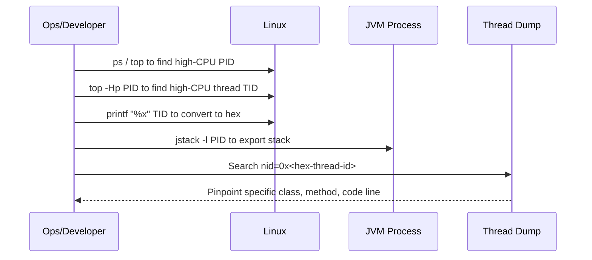

### 4.4 Accelerating with Arthas thread

In addition to the traditional `top -Hp` + `jstack` combination, Arthas provides more direct thread analysis capabilities:

```bash
# View overall JVM thread overview
dashboard

# List the top N threads by CPU consumption
thread -n 5

# View the stack of a specific thread
thread <threadId>
```

`thread -n 5` can directly output the stacks of the top 5 CPU-consuming threads, eliminating the need to manually convert to hexadecimal and search jstack.

Common JVM diagnostic commands:

```bash
# View JVM flags
jcmd <PID> VM.flags

# View JVM system properties
jcmd <PID> VM.system_properties

# Export thread stack
jstack -l <PID> > /tmp/jstack-$(date +%F-%H%M%S).txt

# View GC status
jstat -gcutil <PID> 1000 10

# Export heap information
jmap -heap <PID>
```

If high CPU is accompanied by frequent GC, you can further examine GC logs or capture an object histogram on the fly:

```bash
jmap -histo:live <PID> | head -n 30
```

> Note: `jmap -histo:live` may trigger a Full GC. Use with caution in production.

---

### 4.5 Flame Graphs to Identify Hotspot Functions

When `jstack` and Arthas `thread` show threads are running but can't identify the actual hotspots, flame graphs come in handy.

For Java, async-profiler is recommended:

```bash
./profiler.sh -d 30 -e cpu -f /tmp/cpu-flame.html <PID>
```

| Parameter | Meaning |
| -------- | --------- |
| `-d 30` | Sample for 30 seconds |
| `-e cpu` | Sample CPU events |
| `-f` | Output file |
| `<PID>` | Target process |

How to read a flame graph:

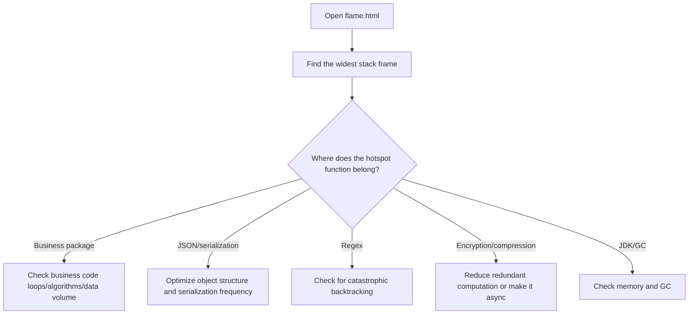

---

## 5. Method Observation and Exception Capture: watch/trace/stack in Practice

After thread-level diagnosis, you typically need to go deeper to the method level. Arthas's `watch`, `trace`, and `stack` are the three core commands for method-level observation.

### 5.1 Watch: More Than Just "Viewing Parameters"

`watch` is one of the most frequently used commands in Arthas, suitable for observing a method's input parameters, return values, exceptions, current object, and execution time.

#### Basic Syntax

```bash
watch class_name method_name expression condition
```

Example:

```bash
watch com.example.UserService getUser "{params, returnObj}" -x 2
```

* `params`: method parameters;
* `returnObj`: method return value;
* `-x 2`: object expansion depth of 2.

#### Observe Input Parameters and Return Values

```bash
watch com.example.OrderService createOrder "{params, returnObj}" -x 3 -n 5
```

* `-x 3`: expand objects to 3 levels;
* `-n 5`: only observe 5 times to avoid flooding the terminal in production.

#### Observe Only Exceptions

```bash
watch com.example.UserService getUser "{params, throwExp}" -e -x 2 -n 5
```

* `-e`: only trigger when the method throws an exception;
* `throwExp`: the exception object.

#### Filter by Execution Time

```bash
watch com.example.OrderService createOrder "{params, returnObj}" "#cost > 100" -x 2 -n 5
```

Only observe calls that take longer than `100ms`.

#### Filter by Parameter

```bash
watch com.example.UserService updateUser "{params, returnObj}" "params[0].id == 1001" -x 3 -n 5
```

Only observe requests where `id = 1001`.

#### Access Object Fields

```bash
watch com.example.UserService getUser "target.userCache" -x 2 -n 5
```

* `target`: the current instance object;
* `target.userCache`: access an instance field.

---

### 5.2 Trace: Locating the Real Bottleneck of Slow APIs

`trace` is used to trace the timing of internal method call chains. When an API is slow but logs don't reveal the cause, `trace` is very useful.

#### Basic Example

```bash
trace com.example.OrderController createOrder -n 5
```

Output typically looks like:

```text
`---ts=2026-02-25 10:00:00;thread_name=http-nio-8080-exec-1;id=25;is_daemon=true;priority=5;TCCL=...
    `---[320.112ms] com.example.OrderController:createOrder()
        +---[12.331ms] com.example.OrderService:checkParam()
        +---[250.442ms] com.example.OrderService:saveOrder()
        +---[45.221ms] com.example.PaymentClient:prePay()
```

From the result, you can quickly see: `OrderService.saveOrder()` took 250ms, which is the main bottleneck.

#### Only View Slow Requests

```bash
trace com.example.OrderController createOrder '#cost > 200' -n 5
```

Only trace requests that take longer than `200ms`.

#### Trace JDK Methods

By default, Arthas skips JDK methods. If you need to observe JDK internal calls:

```bash
trace com.example.OrderController createOrder '#cost > 200' --skipJDKMethod false -n 5
```

> Note: Use with caution in production; JDK method call chains can be very long.

---

### 5.3 Stack: Who Called This Method?

Sometimes we know a method is being called, but don't know who is calling it. In this case, use `stack`.

```bash
stack com.example.UserService getUser -n 5
```

Suitable for troubleshooting:

* Why a particular method is being called so frequently;
* Which entry point a piece of logic is coming from;
* Whether scheduled tasks, async threads, or message consumers are triggering abnormal logic.

---

### 5.4 Monitor: Method Call Statistics

`monitor` is suitable for observing call statistics of a method over a period of time.

```bash
monitor com.example.OrderService createOrder -c 5
```

Collect method call statistics every 5 seconds. Typical output includes:

| Field | Meaning |
| --------- | ---- |
| timestamp | Statistics time |
| class | Class name |
| method | Method name |
| total | Call count |
| success | Success count |
| fail | Failure count |
| avg-rt | Average latency |
| fail-rate | Failure rate |

---

### 5.5 TT: Record the Scene, Replay the Call

`tt` stands for Time Tunnel, which can record the context of method calls.

```bash
# Record method calls
tt -t com.example.UserService getUser -n 5

# View record list
tt -l

# View details of a specific call
tt -i 1000

# Replay a call (use with extreme caution in production!)
tt -i 1000 -p
```

> `tt -p` will re-execute the method; use with extreme caution in production. If the method involves side effects such as database writes, inventory deductions, message sends, or coupon issuance, replay is not recommended.

---

### 5.6 Practical Troubleshooting: Abnormal API Return Value

#### Scenario

Online users report: The user info query API returns a null nickname, but the database clearly has a nickname.

```text
GET /api/user/1001
```

Corresponding method: `com.example.UserService#getUser`

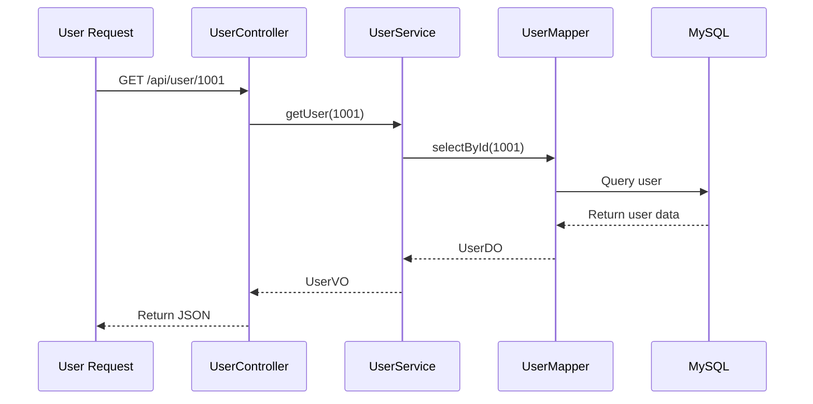

#### Troubleshooting Steps

Step 1: Observe input parameters and return values:

```bash
watch com.example.UserService getUser "{params, returnObj}" "params[0] == 1001" -x 3 -n 5
```

If `returnObj.nickname = null`, the problem may be caused by: empty database query result, field lost during DO to VO conversion, business code explicitly setting it to null, or interception before serialization.

Step 2: Trace internal calls:

```bash
trace com.example.UserService getUser '#cost > 0' -n 5
```

If the output shows `UserConverter.toVO()` with very short time, observe the conversion method:

```bash
watch com.example.UserConverter toVO "{params, returnObj}" -x 3 -n 5
```

If `params[0].nickname` has a value but `returnObj.nickname` is null, you can basically confirm the conversion logic is the issue.


---

## 6. Code Hot-Swapping (Hotfix)

### 6.1 Applicability Boundaries

One of Arthas's most dangerous yet powerful capabilities is online code hot-swapping. It can load a modified `.class` into a running JVM without restarting the service.

But it must be clear:

> Arthas Hotfix is more suitable for temporary mitigation; it should not replace the normal deployment process.

#### Scenarios Suitable for Hotfix

| Scenario | Suitable? |
| ---------- | ---- |
| Adding simple null checks | Suitable |
| Modifying simple conditional logic | Suitable |
| Fixing obviously incorrect constants | Suitable |
| Temporarily disabling an exception branch | Use with caution |
| Modifying a small amount of logic inside a method | Use with caution |

#### Scenarios NOT Suitable for Hotfix

| Scenario | Reason |
| --------- | ----------------- |
| Adding new fields | JVM loaded class structure does not support arbitrary changes |
| Adding new methods | Prone to failure or unpredictable behavior |
| Modifying method signatures | Callers won't match |
| Modifying inheritance relationships | Extremely high risk from class structure changes |
| Large-scale business refactoring | Uncontrollable |
| Involving transaction boundary changes | May cause data inconsistency |
| Involving multi-service protocol changes | Upstream/downstream incompatibility |

### 6.2 Hotfix Workflow

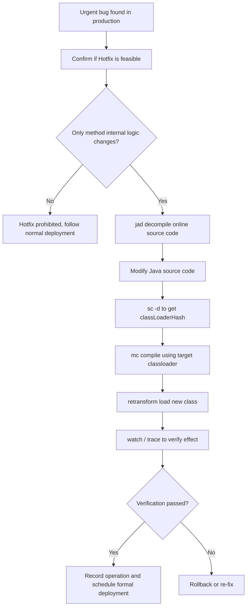

### 6.3 Practice: Fixing a NullPointerException

#### Scenario

Production code has a null pointer risk:

```java
public String getUserName(User user) {
    return user.getName().trim();
}
```

When `user` or `user.getName()` is null, a `NullPointerException` will be thrown. Goal: temporarily add null checks.

#### Step 1: Decompile Online Code

```bash
jad --source-only com.example.UserService > /tmp/UserService.java
```

You must use the code currently running in the online JVM as the basis; do not blindly modify local code.

#### Step 2: Modify the Source Code

Modify `/tmp/UserService.java`:

```java
public String getUserName(User user) {
    if (user == null || user.getName() == null) {
        return "";
    }
    return user.getName().trim();
}
```

#### Step 3: Find the ClassLoader

```bash
sc -d com.example.UserService | grep classLoaderHash
```

Focus on the `classLoaderHash` in the output.

#### Step 4: Compile with mc

```bash
mc -c <classLoaderHash> /tmp/UserService.java -d /tmp
```

#### Step 5: Load the New Bytecode

```bash
retransform /tmp/com/example/UserService.class
```

After `retransform` succeeds, the new method logic takes effect in the current JVM.

#### Step 6: Verify the Fix

```bash
watch com.example.UserService getUserName "{params, returnObj, throwExp}" -x 2 -n 5
```

### 6.4 Hotfix Rollback Plan

#### Option 1: Retransform with the Original Class

```bash
retransform /tmp/backup/com/example/UserService.class
```

#### Option 2: Redeploy to Override

1. Sync the Hotfix to the code repository;
2. Follow the normal testing process;
3. Redeploy the service;
4. Override the Arthas temporary change.

#### Option 3: Restart the Service

Arthas hot-swapping only affects the class in the current JVM's memory. The service will revert to the original version after restart.

### 6.5 retransform vs redefine Comparison

| Dimension | retransform | redefine |
| -------- | ----------- | -------- |
| Recommendation level | More recommended | Less commonly used |
| Supports multiple modifications | Better support | Easily restricted |
| User experience | More stable | Higher risk |
| Applicable scenario | Method internal logic fix | Simple class redefinition |
| Production advice | Use with caution | Use with even more caution |

General recommendation: Prefer `retransform`; avoid frequent use of `redefine`.

---

## 7. System-Level High CPU Special Scenarios

Not all high CPU comes from business processes. The following system-level scenarios are also very common.

### 7.1 `kswapd0` High CPU: Insufficient Memory or Swap Thrashing

If you see `kswapd0` consuming significant CPU:

```bash
ps -eo pid,comm,%cpu,%mem --sort=-%cpu | head
```

It may indicate that the system is low on memory and the kernel is frequently reclaiming memory pages.

Check memory:

```bash
free -h
vmstat 1 10
```

Focus on these `vmstat` fields:

| Field | Meaning | Abnormal sign |
| -- | -------- | -------------------- |
| si | swap in | Consistently above 0 means frequent reads from Swap |
| so | swap out | Consistently above 0 means frequent writes to Swap |
| r | Run queue | Sustained above CPU core count means CPU queuing |
| wa | I/O wait | High indicates slow disk or storage |

Longer-term solutions: fix memory leaks; adjust JVM heap size; increase machine memory; configure `MemoryMax` / `MemoryLimit`; split overly heavy workloads.

---

### 7.2 High softirq: Network Interrupts or Small-Packet Storms

If `si` is high in `top`, suspect network interrupts.

```bash
watch -n 1 "cat /proc/softirqs"
ss -antp | head
ss -ant state established | wc -l
sar -n DEV 1 5
```

Possible causes:

| Symptom | Possible cause | Remediation direction |
| -------------- | -------------- | ------------------------ |
| High `si` | Excessive small packets | Check inbound traffic, rate limiting, firewall |
| Connection count surge | Crawlers / attacks / connection leaks | Nginx rate limiting, connection pool governance |
| Single core unusually high | NIC interrupts concentrated on one core | IRQ affinity, RSS/RPS tuning |
| Nginx worker high | Excessive requests or reverse proxy anomaly | Access log, upstream latency analysis |

---

### 7.3 High iowait: Slow Disk or Downstream Storage

If `wa` is high, the CPU is waiting on I/O.

```bash
iostat -x 1 5
```

| Field | Meaning | Interpretation |
| --------------- | ------ | ------------- |
| `%util` | Device busyness | Near 100% means the disk is busy |
| `await` | Average wait time | High indicates large I/O latency |
| `r/s`, `w/s` | Read/write per second | Read/write pressure |

Find which process is doing heavy I/O:

```bash
iotop -oPa
```

Common causes: log flooding; large file transfers; slow database queries; excessive temp files; container logs not rotated; insufficient disk space.

---

## 8. Recovery Decisions and Incident Review Template

### 8.1 Recovery Decision

After collecting evidence, decide how to recover.

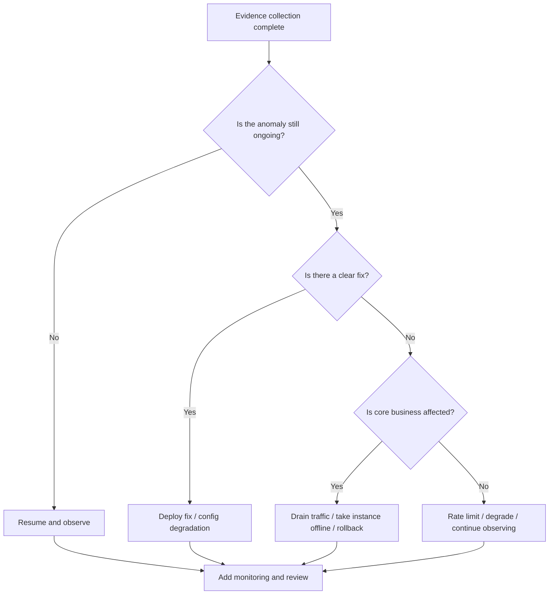

Common recovery actions:

| Action | Command / Method | Applicable situation |
| ------ | ------------------- | --------------- |
| Resume paused process | `kill -CONT <PID>` | Evidence collected, observe if issue recurs |
| Graceful termination | `kill -TERM <PID>` | Service can be restarted, allows clean exit |
| Force kill | `kill -9 <PID>` | Process unresponsive, TERM ineffective |
| Drain traffic | Nginx / gateway / service registry removal | Avoid continued user impact |
| Rollback version | Deployment platform rollback | Clearly caused by new version |
| Rate limit / degrade | Gateway, config center | Slow downstream, burst traffic, hotspot API |

After recovery, observe at minimum:

```bash
top
uptime
free -h
ss -antp | wc -l
journalctl -u <service> -n 200 --no-pager
```

---

### 8.2 Long-Term Governance

#### Using systemd to Limit CPU and Memory

```ini
[Unit]
Description=My Application
After=network.target

[Service]
User=app
WorkingDirectory=/opt/myapp
ExecStart=/usr/bin/java -jar /opt/myapp/app.jar
Restart=on-failure
RestartSec=5
CPUQuota=50%
MemoryMax=2G
LimitNOFILE=65535

[Install]
WantedBy=multi-user.target
```

#### Container Resource Limits

Docker example:

```bash
docker run -d \
  --name myapp \
  --cpus="1.5" \
  --memory="2g" \
  --memory-swap="2g" \
  myapp:latest
```

Docker Compose example:

```yaml
services:
  myapp:
    image: myapp:latest
    container_name: myapp
    deploy:
      resources:
        limits:
          cpus: "1.5"
          memory: 2G
    restart: unless-stopped
```

---

### 8.3 Monitoring Metric Design

| Metric | Recommended threshold | Description |
| ------------ | ----------: | --------- |
| CPU utilization | 5 min > 85% | Overall pressure |
| Load Average | Sustained > CPU cores | CPU queuing |
| iowait | 5 min > 20% | Slow disk/storage |
| softirq | Noticeably abnormal | Network interrupts |
| Memory utilization | > 90% | Memory pressure |
| Swap In/Out | Sustained > 0 | Memory thrashing |
| Process CPU | Single > 300% | Anomalous service |
| JVM GC time | Sustained increase | GC storm |
| Thread count | Exceeds baseline | Thread leak |
| API P95/P99 | Exceeds SLA | Business impact |

Prometheus query examples:

```promql
# CPU utilization
100 - (avg by(instance) (rate(node_cpu_seconds_total{mode="idle"}[5m])) * 100)
```

```promql
# iowait ratio
avg by(instance) (rate(node_cpu_seconds_total{mode="iowait"}[5m])) * 100
```

---

### 8.4 Case Study: Java Service at 400% CPU

#### Symptoms

An order service experienced massive API timeouts:

| Metric | Value |
| ------------ | ---: |
| CPU utilization | 96% |
| Load Average | 18 |
| Machine cores | 4 |
| Java process CPU | 390% |
| P99 latency | 8s |

#### Troubleshooting Steps

Step 1: Find the process → `12345 app java -jar order-service.jar 390% 45%`

Step 2: Pause → `sudo kill -STOP 12345`

Step 3: Capture threads → `top -Hp 12345` → thread `12367` at 99%

Step 4: Convert → `printf "%x\n" 12367` → `304f`

Step 5: Export stack → `jstack -l 12345 | grep "304f"` → discount rule calculation in infinite loop

#### Root Cause

Circular dependency in discount rule configuration: Rule A → Rule B → Rule C → Rule A. No `visited` set check in code.

#### Fix

```java
public Result calculateRule(Rule rule, Set<Long> visited) {
    if (visited.contains(rule.getId())) {
        throw new BizException("Circular dependency detected in rules: " + rule.getId());
    }
    visited.add(rule.getId());
    for (Rule dependency : rule.getDependencies()) {
        calculateRule(dependency, visited);
    }
    visited.remove(rule.getId());
    return doCalculate(rule);
}
```

---

### 8.5 Incident Review Template

```markdown
# High CPU Load Incident Review

## 1. Basic Information
- Incident time:
- Affected service:
- Impact scope:
- Detection method: Monitoring / User report / Routine inspection
- Handler:

## 2. Timeline
- 10:00 Monitoring alert: CPU exceeds 90%
- 10:03 Logged into the machine to check processes
- 10:05 Paused the anomalous process and collected stack traces
- 10:10 Identified the anomalous thread
- 10:20 Completed temporary recovery
- 11:30 Deployed the fix

## 3. Scene Evidence
- top snapshot:
- ps snapshot:
- jstack file:
- GC logs:
- Application logs:
- Monitoring screenshots:

## 4. Root Cause Analysis
- Direct cause:
- Underlying cause:
- Why wasn't this caught in the test environment:
- Why didn't monitoring catch it earlier:

## 5. Fix Measures
- Code fix:
- Configuration fix:
- Capacity fix:
- Monitoring fix:

## 6. Follow-up Actions
- [ ] Add unit tests
- [ ] Add load testing scenarios
- [ ] Add CPU/thread/GC alerts
- [ ] Add service resource limits
- [ ] Complete knowledge base documentation
```

---

## 9. Remote Diagnostics Tunnel and Production Best Practices

### 9.1 Arthas Tunnel for Remote Diagnostics

In real enterprise environments, many servers are on internal networks and cannot be directly accessed via SSH. Arthas Tunnel enables remote diagnostics.

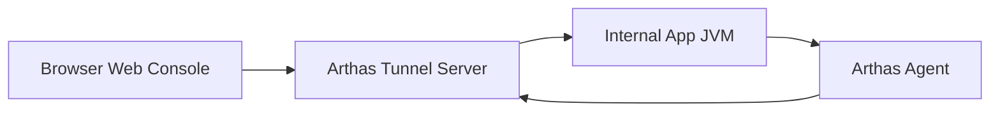

#### Start the Tunnel Server

```bash
java -jar arthas-tunnel-server.jar
```

Default ports: `7777` (WebSocket), `8080` (Web console). Actual ports depend on your configuration.

#### Client Connects to Tunnel Server

```bash
java -jar arthas-boot.jar \
  --tunnel-server 'ws://public-ip:7777/ws' \
  --agent-id my-app-001
```

| Parameter | Meaning |
| ----------------- | ---------------- |
| `--tunnel-server` | Tunnel Server address |
| `--agent-id` | Current application instance ID |

#### Web Interface for Managing Multiple Instances

Suitable scenarios: unified multi-server diagnostics; container troubleshooting; internal machines without SSH access; unified Java process management.

---

### 9.2 Arthas vs Common Monitoring Tools

| Dimension | Arthas | SkyWalking | Prometheus + Grafana |
| ----------- | ----------- | ----------- | -------------------- |
| Core positioning | Single JVM deep diagnostics | Distributed tracing | Metrics monitoring and alerting |
| Granularity | Method/object/thread level | Service/API/trace level | Metric/instance level |
| Timeliness | Real-time interactive | Near real-time | Near real-time |
| Intrusiveness | Low, on-demand | Low, Agent needed | Medium, Exporter needed |
| Usage pattern | Temporary troubleshooting | Long-term observation | Long-term monitoring |
| Supports Hotfix | Yes | No | No |

How the three types of tools work together:

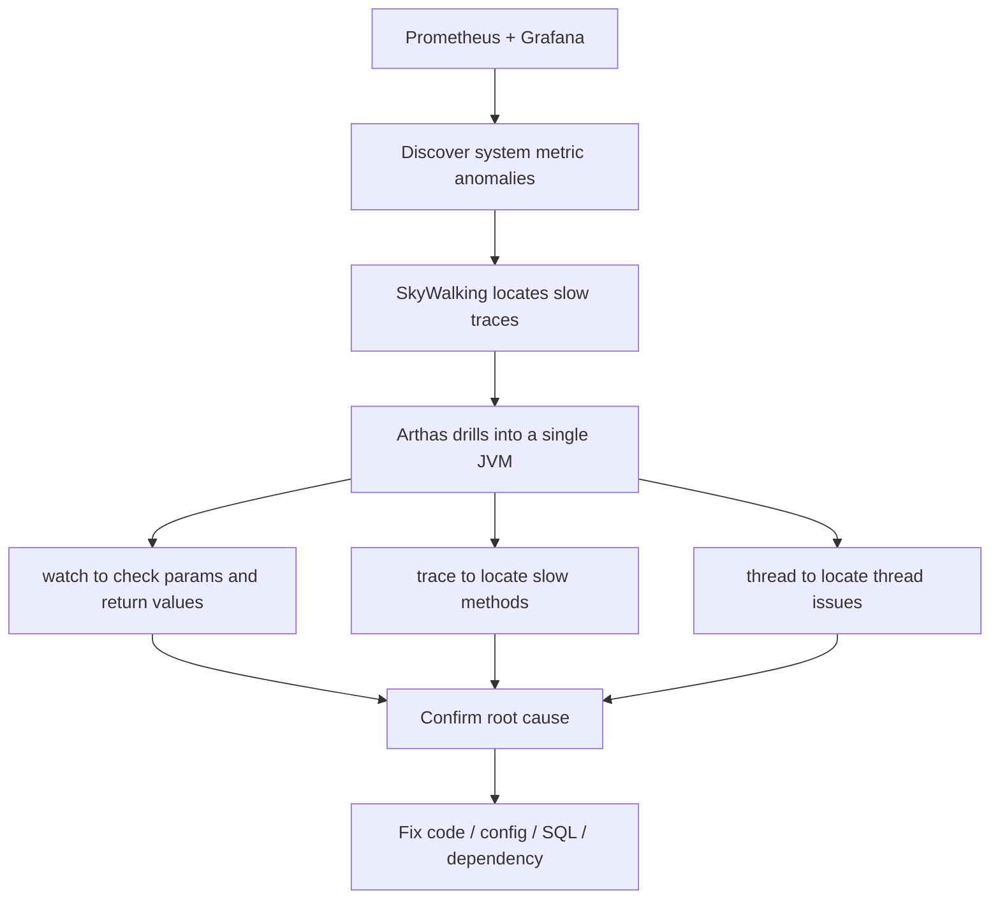

Recommended combination:

```text
Prometheus + Grafana: Responsible for discovering problems
SkyWalking: Responsible for locating traces
Arthas: Responsible for drilling into the JVM to confirm root cause
```

---

### 9.3 Production Best Practices

#### Always Limit watch / trace Count

Always use `-n` in production:

```bash
watch com.example.OrderService createOrder "{params, returnObj}" -x 2 -n 5
```

#### Control Object Expansion Depth

| Scenario | Recommended Depth |
| ------ | ------ |
| Simple parameters | `-x 1` |
| Normal DTOs | `-x 2` |
| Nested objects | `-x 3` |
| Complex object graphs | Use with caution |

#### Keep OGNL Expressions Simple

Recommended:

```bash
watch com.example.Service method "{params[0].id, params[0].status}" -x 2 -n 5
```

Principle: Only observe necessary fields in production; do not perform complex computations.

#### Reset After Diagnostics

```bash
reset   # Reset all enhanced classes
stop    # Shut down Arthas Server and reset enhancements
```

#### Avoid High-Cost Commands During Peak Hours

| Command | Risk |
| ------------- | ----------- |
| `trace` | High overhead with long call chains |
| `watch -x 5` | Object expansion too deep |
| `tt -t` | Records call context, consumes memory |
| `tt -p` | May re-execute business logic |
| `heapdump` | May cause disk and memory pressure |
| `retransform` | Modifies production code, high risk |

---

### 9.4 Production Prohibition Checklist

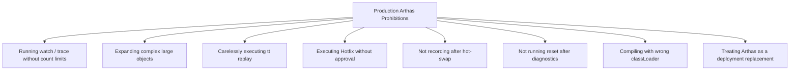

Prohibition summary:

1. Do not blindly `trace` during peak hours.
2. Do not use deep `-x` on large objects.
3. Do not execute `tt -p` on methods with side effects.
4. Do not perform Hotfix without a backup.
5. Do not hot-swap to add new fields, methods, or inheritance relationships.
6. Do not forget to execute `reset` or `stop`.
7. Do not treat Arthas as a long-term fix solution.

---

## 10. Production Troubleshooting Command Cheat Sheet

### 10.1 Basic Identification

```bash
uptime
nproc
top
ps -eo pid,ppid,user,stat,cmd,%cpu,%mem --sort=-%cpu | head -n 15
```

### 10.2 Thread Identification

```bash
top -Hp <PID>
printf "%x\n" <TID>
jstack -l <PID> > /tmp/jstack.txt
grep -n "<hex_tid>" /tmp/jstack.txt
```

### 10.3 Arthas Common Commands

```bash
dashboard
thread -n 5
thread <threadId>
watch com.example.Service method "{params, returnObj}" -x 2 -n 5
watch com.example.Service method "{params, throwExp}" -e -x 2 -n 5
trace com.example.Controller method '#cost > 200' -n 5
stack com.example.Service method -n 5
monitor com.example.Service method -c 5
jad com.example.Service
sc -d com.example.Service
reset
stop
```

### 10.4 Memory and Swap

```bash
free -h
vmstat 1 10
ps -eo pid,user,cmd,%mem,%cpu --sort=-%mem | head -n 15
```

### 10.5 Disk I/O

```bash
df -h
iostat -x 1 5
iotop -oPa
pidstat -d 1 5
```

### 10.6 Network and Connections

```bash
ss -antp | head
ss -ant state established | wc -l
sar -n DEV 1 5
watch -n 1 "cat /proc/softirqs"
```

---

## 11. Conclusion

The key to Java online performance troubleshooting is not "whether you can reboot," but whether you can achieve the following in the shortest time possible:

1. Quick mitigation to restore the machine to an operable state;
2. Preserve the scene to avoid destroying root cause evidence;
3. Use `jstack`, Arthas, and flame graphs to pinpoint threads, methods, system resources, or external traffic;
4. Use `watch`/`trace`/`stack` to drill into method-level root causes;
5. Use Hotfix for temporary mitigation when necessary, but ultimately fix through normal deployment;
6. Prevent recurrence through rate limiting, isolation, monitoring, load testing, and code fixes.

Ultimately, this should become an engineering habit:

> The fault scene is evidence, not garbage; rebooting is a recovery method, not root cause analysis.

Mastering Arthas and system-level troubleshooting methods is not just about learning a few more commands; it's about evolving from "only being able to write code" to a Java engineer who "can locate problems, handle incidents, and safeguard production stability."

The recommended complete troubleshooting closed loop:

```text
Monitoring discovers problems → Quick mitigation → Preserve evidence → OS-level diagnosis → Arthas drills into JVM → Confirm root cause → Temporary Hotfix → Formal deployment fix → Review and long-term governance
```

As long as you follow the closed loop of "mitigate → preserve evidence → diagnose → recover → review → govern," Java online performance issues won't remain at the level of "temporary fixes" — they will truly become part of the team's stability capability.
