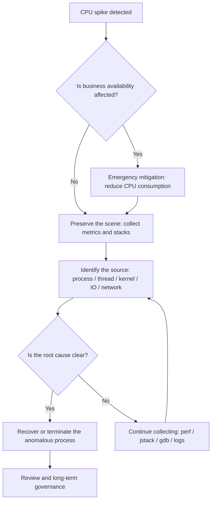
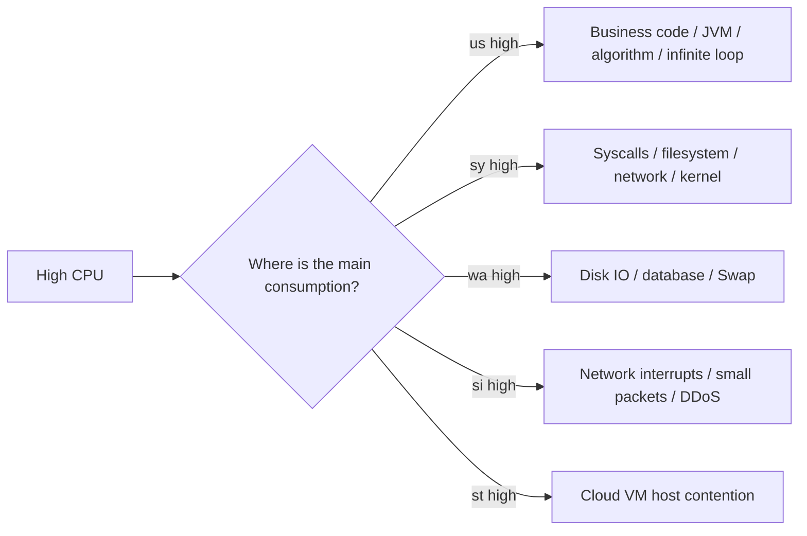
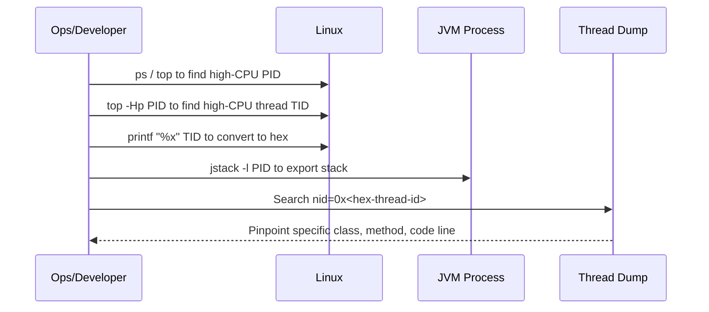
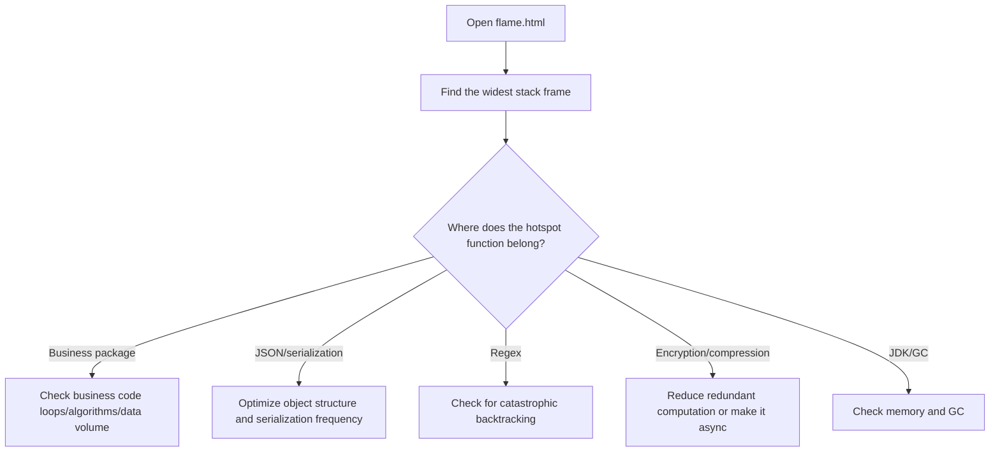
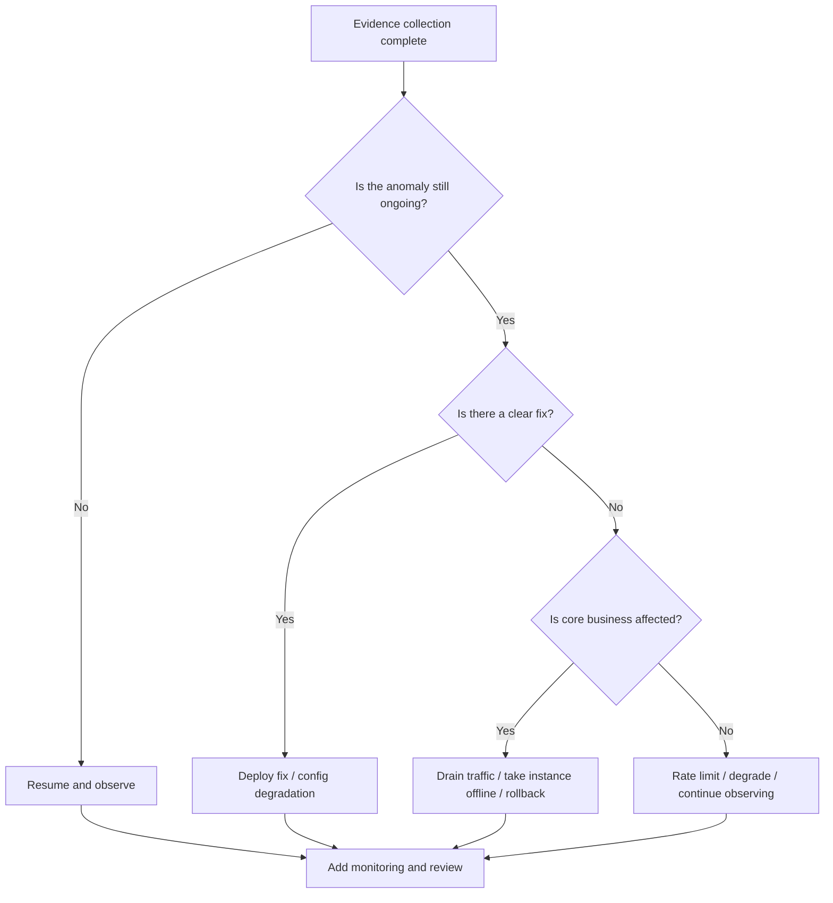

# Linux High CPU Emergency Troubleshooting Guide — From Quick Mitigation to Root Cause Review

When a production server's CPU suddenly spikes to 90% or even 100%, it typically comes with API timeouts, SSH lag, log flooding, thread pool saturation, and service unavailability.

Many people's first instinct is to run:

```bash
kill -9 <PID>
# or simply restart the service / reboot the machine
```

However, this is often one of the most dangerous approaches. It destroys the scene, making it impossible to determine afterwards whether the cause was a business logic infinite loop, a GC storm, thread pool exhaustion, a kernel interrupt anomaly, or a cascade triggered by insufficient memory.

This article provides a more prudent approach:

> Mitigate first, then preserve evidence; diagnose first, then recover; review first, then prevent.

---

## 1. Overall Troubleshooting Approach

When facing high CPU on Linux, don't rush to reboot. Follow these four phases instead.



Core principles:

| Phase | Goal | What NOT to do | Recommended action |
| -- | ----------- | ------------ | ---------------------- |
| Mitigate | Restore the machine to an operable state | Directly `kill -9` | `kill -STOP` to pause the anomalous process |
| Preserve Evidence | Retain the fault scene | Analyze only after reboot | Save `top`, `ps`, threads, stacks, logs |
| Diagnose | Find the source of CPU consumption | Look only at process-level CPU | Drill down to threads, functions, system resources |
| Recover | Control the blast radius | Blindly restore all traffic | Gradual recovery, canary validation |
| Prevent | Avoid recurrence | Write only "fixed" in the ticket | Add resource limits, monitoring, load testing, code fixes |

---

## 2. Phase 1: Quick Mitigation — Don't Destroy the Scene

### 2.1 First Check If the System Is Still Operable

If you can still type commands on the machine, start by checking the overall load:

```bash
uptime
```

Focus on:

```text
load average: 12.34, 10.21, 8.90
```

On a 4-core machine, a sustained load above 4 is a warning sign; on an 8-core machine, a sustained load above 8 indicates significant queuing.

Check the number of CPU cores:

```bash
nproc
```

Check overall CPU, memory, and process status:

```bash
top
```

If `top` itself is lagging, use a snapshot-style command:

```bash
ps -eo pid,ppid,user,stat,cmd,%cpu,%mem --sort=-%cpu | head -n 15
```

Example output:

```text
  PID  PPID USER  STAT CMD                         %CPU %MEM
12345     1 app   Sl   java -jar order-service.jar 389  42.1
22331     1 root  R    nginx: worker process        78   1.2
```

The key things to identify here are:

* Which process has the highest CPU;
* Whether it's a single process with high CPU, or multiple processes together;
* Whether the high CPU is from a business process or a system process.

---

### 2.2 Use STOP to Pause the Process, Don't KILL It Directly

If a business process has saturated the CPU and the machine has become unresponsive, you can pause it first:

```bash
sudo kill -STOP <PID>
```

For example:

```bash
sudo kill -STOP 12345
```

`SIGSTOP` causes the process to pause execution. It does not release memory or destroy the process context, making it ideal for "mitigate + preserve the scene."

Comparison of common signals:

| Signal | Command | Effect | Preserves the scene? | Use case |
| ---- | ------------------ | ---- | ------ | ----------- |
| STOP | `kill -STOP <PID>` | Pause the process | Yes | Emergency mitigation for high CPU |
| CONT | `kill -CONT <PID>` | Resume the process | Yes | Resume for validation after evidence collection |
| TERM | `kill -TERM <PID>` | Graceful termination | Partially | Normal service shutdown |
| KILL | `kill -9 <PID>` | Force kill | No | Last resort when the process cannot exit normally |

> In production environments, `kill -9` should be the last resort, not the first.

---

## 3. Phase 2: Preserve the Evidence

After CPU has come down, don't rush to restore the service. The most important thing now is to save the scene.

### 3.1 Save Basic System Information

It's recommended to save everything to a single directory:

```bash
mkdir -p /tmp/cpu-debug-$(date +%F-%H%M%S)
cd /tmp/cpu-debug-*
```

Collect system snapshots:

```bash
date > date.txt
uptime > uptime.txt
nproc > cpu_count.txt
free -h > memory.txt
df -h > disk.txt
ps -eo pid,ppid,user,stat,cmd,%cpu,%mem --sort=-%cpu > ps_cpu.txt
top -b -n 1 > top.txt
```

If `vmstat`, `pidstat`, and `mpstat` are available, continue collecting:

```bash
vmstat 1 10 > vmstat.txt
mpstat -P ALL 1 5 > mpstat.txt
pidstat -u -p ALL 1 5 > pidstat.txt
```

---

### 3.2 Identify the CPU Type: user, system, iowait, softirq

The CPU line in `top` typically looks like:

```text
%Cpu(s): 85.0 us,  8.0 sy,  0.0 ni,  5.0 id,  1.0 wa,  0.0 hi,  1.0 si,  0.0 st
```

Meaning of each field:

| Field | Meaning | Common causes |
| -- | ------- | ------------------- |
| us | User-space CPU | Business code computation, infinite loops, serialization, encryption/compression |
| sy | Kernel-space CPU | Frequent syscalls, network stack, filesystem operations |
| wa | I/O wait | Slow disk, slow database, log flushing, swap |
| hi | Hard interrupts | Hardware interrupt anomalies |
| si | Soft interrupts | Excessive network packets, DDoS, small-packet storms |
| st | Steal time (virtualization) | Cloud VM resource contention |
| id | Idle | CPU idle percentage |

Diagnostic direction:



---

## 4. Phase 3: Pinpoint the Specific Process and Thread

### 4.1 Identify the Most CPU-Intensive Process

```bash
ps -eo pid,ppid,user,stat,cmd,%cpu,%mem --sort=-%cpu | head -n 15
```

Suppose you find a Java process consuming very high CPU:

```text
12345 app java -jar order-service.jar 389% 42.1%
```

389% means it's using roughly 4 CPU cores.

---

### 4.2 Identify the Most CPU-Intensive Thread Within a Process

For multi-threaded programs like Java, C++, or Go, knowing just the PID is not enough — you need to drill down to the thread level.

```bash
top -Hp <PID>
```

Example:

```bash
top -Hp 12345
```

In the output, focus on the thread IDs:

```text
PID     USER  PR NI VIRT RES SHR S %CPU COMMAND
12367   app   20  0  ... ... ... R 99.9 java
12368   app   20  0  ... ... ... R 98.7 java
```

Here `12367` and `12368` are thread IDs.

Thread IDs in Java stack traces are typically in hexadecimal, so you need to convert:

```bash
printf "%x\n" 12367
```

For example, the output:

```text
304f
```

Then search in the `jstack` output:

```bash
jstack -l 12345 > jstack.txt
grep -n "304f" jstack.txt
```

---

### 4.3 Java High CPU Troubleshooting Path

The most common causes of high CPU in Java services:

| Type | Typical symptoms | Diagnostic tools | Common root causes |
| ------ | ---------------------- | -------------------- | ------------------ |
| Infinite loop | One or a few threads at 100% | `top -Hp` + `jstack` | while loop, recursion, state machine error |
| GC storm | High CPU, throughput drop, frequent GC in logs | `jstat` + GC logs | Insufficient memory, excessive object creation |
| Thread pool exhaustion | Request backlog, growing queue | Thread pool monitoring + dump | Slow downstream, unreasonable rejection policy |
| Serialization/compression | High CPU but threads running normally | Flame graph / async-profiler | Oversized JSON, frequent compression |
| Lock contention | Many BLOCKED / WAITING threads | `jstack` | Oversized synchronized lock scope |

Java thread diagnosis flow:



Common commands:

```bash
# View JVM flags
jcmd <PID> VM.flags

# View JVM system properties
jcmd <PID> VM.system_properties

# Export thread stack
jstack -l <PID> > /tmp/jstack-$(date +%F-%H%M%S).txt

# View GC status
jstat -gcutil <PID> 1000 10

# Export heap information
jmap -heap <PID>
```

If high CPU is accompanied by frequent GC, you can further examine GC logs or capture an object histogram on the fly:

```bash
jmap -histo:live <PID> | head -n 30
```

> Note: `jmap -histo:live` may trigger a Full GC. Use with caution in production.

---

## 5. Phase 4: System-Level High CPU Special Scenarios

Not all high CPU comes from business processes. The following system-level scenarios are also very common.

### 5.1 `kswapd0` High CPU: Insufficient Memory or Swap Thrashing

If you see `kswapd0` consuming significant CPU:

```bash
ps -eo pid,comm,%cpu,%mem --sort=-%cpu | head
```

It may indicate that the system is low on memory and the kernel is frequently reclaiming memory pages.

Check memory:

```bash
free -h
vmstat 1 10
```

Focus on these `vmstat` fields:

| Field | Meaning | Abnormal sign |
| -- | -------- | -------------------- |
| si | swap in | Consistently above 0 means frequent reads from Swap |
| so | swap out | Consistently above 0 means frequent writes to Swap |
| r | Run queue | Sustained above CPU core count means CPU queuing |
| wa | I/O wait | High indicates slow disk or storage |

Remediation suggestions:

```bash
# View processes consuming the most memory
ps -eo pid,user,cmd,%mem,%cpu --sort=-%mem | head -n 15
```

If cache usage is high, do not clear it arbitrarily; if you confirm it's non-critical cache or need emergency mitigation, you can cautiously run:

```bash
sync
sudo sysctl vm.drop_caches=3
```

Longer-term solutions:

* Fix memory leaks;
* Adjust JVM heap size;
* Increase machine memory;
* Configure `MemoryMax` / `MemoryLimit` for the service;
* Split overly heavy workloads.

---

### 5.2 High softirq: Network Interrupts or Small-Packet Storms

If `si` is high in `top`, suspect network interrupts.

Check soft interrupts:

```bash
watch -n 1 "cat /proc/softirqs"
```

Check hard interrupts:

```bash
watch -n 1 "cat /proc/interrupts"
```

Check network connections:

```bash
ss -antp | head
ss -ant state established | wc -l
```

Check NIC traffic:

```bash
sar -n DEV 1 5
```

Possible causes:

| Symptom | Possible cause | Remediation direction |
| -------------- | -------------- | ------------------------ |
| High `si` | Excessive small packets | Check inbound traffic, rate limiting, firewall |
| Connection count surge | Crawlers / attacks / connection leaks | Nginx rate limiting, connection pool governance |
| Single core unusually high | NIC interrupts concentrated on one core | IRQ affinity, RSS/RPS tuning |
| Nginx worker high | Excessive requests or reverse proxy anomaly | Access log, upstream latency analysis |

---

### 5.3 High iowait: Slow Disk or Downstream Storage

If `wa` is high, the CPU is waiting on I/O.

Check disks:

```bash
iostat -x 1 5
```

Focus on:

| Field | Meaning | Interpretation |
| --------------- | ------ | ------------- |
| `%util` | Device busyness | Near 100% means the disk is busy |
| `await` | Average wait time | High indicates large I/O latency |
| `r/s`, `w/s` | Read/write operations per second | Indicates read/write pressure |
| `rkB/s`, `wkB/s` | Read/write throughput per second | Indicates throughput pressure |

Find which process is doing heavy I/O:

```bash
iotop -oPa
```

Or:

```bash
pidstat -d 1 5
```

Common causes:

* Log flooding to disk;
* Large file uploads or downloads;
* Slow database queries;
* Excessive temporary files;
* Container logs not rotated;
* Insufficient disk space causing system anomalies.

---

## 6. Phase 5: Flame Graphs to Identify Hotspot Functions

When `jstack` shows threads are running but can't identify the actual hotspots, flame graphs come in handy.

### 6.1 Java: Recommended — async-profiler

Example:

```bash
./profiler.sh -d 30 -e cpu -f /tmp/cpu-flame.html <PID>
```

Parameter meanings:

| Parameter | Meaning |
| -------- | --------- |
| `-d 30` | Sample for 30 seconds |
| `-e cpu` | Sample CPU events |
| `-f` | Output file |
| `<PID>` | Target process |

How to read a flame graph:



---

## 7. Recovery Decision: Continue, Restart, or Take Offline?

After collecting evidence, you need to decide how to recover.



Common recovery actions:

| Action | Command / Method | Applicable situation |
| ------ | ------------------- | --------------- |
| Resume paused process | `kill -CONT <PID>` | Evidence collected, need to observe if issue recurs |
| Graceful termination | `kill -TERM <PID>` | Service can be restarted, allows clean exit |
| Force kill | `kill -9 <PID>` | Process unresponsive, TERM ineffective |
| Drain traffic | Nginx / gateway / service registry removal | Avoid continued user impact |
| Rollback version | Deployment platform rollback | Clearly caused by new version |
| Rate limit / degrade | Gateway, config center | Slow downstream, burst traffic, hotspot API |

After recovery, observe at minimum:

```bash
top
uptime
free -h
ss -antp | wc -l
journalctl -u <service> -n 200 --no-pager
```

---

## 8. Long-Term Governance: Prevent One Service from Taking Down the Entire Machine

### 8.1 Using systemd to Limit CPU and Memory

In production, a non-critical service should never be allowed to saturate CPU without limits.

Edit the service file:

```bash
sudo vim /etc/systemd/system/myapp.service
```

Example:

```ini
[Unit]
Description=My Application
After=network.target

[Service]
User=app
WorkingDirectory=/opt/myapp
ExecStart=/usr/bin/java -jar /opt/myapp/app.jar
Restart=on-failure
RestartSec=5

# Use at most 50% of a single core; 200% means at most ~2 cores
CPUQuota=50%

# Limit maximum memory
MemoryMax=2G

# Limit number of open files
LimitNOFILE=65535

[Install]
WantedBy=multi-user.target
```

Reload:

```bash
sudo systemctl daemon-reload
sudo systemctl restart myapp
```

Verify the limits are in effect:

```bash
systemctl show myapp | grep -E "CPUQuota|MemoryMax|LimitNOFILE"
```

---

### 8.2 Container Environment Resource Limits

Docker example:

```bash
docker run -d \
  --name myapp \
  --cpus="1.5" \
  --memory="2g" \
  --memory-swap="2g" \
  myapp:latest
```

Docker Compose example:

```yaml
services:
  myapp:
    image: myapp:latest
    container_name: myapp
    deploy:
      resources:
        limits:
          cpus: "1.5"
          memory: 2G
    restart: unless-stopped
```

---

### 8.3 Monitoring Metric Design

It's recommended to monitor at least the following metrics:

| Metric | Recommended threshold | Description |
| ------------ | ----------: | --------- |
| CPU utilization | 5 min > 85% | Judge overall pressure |
| Load Average | Sustained > CPU core count | Judge CPU queuing |
| iowait | 5 min > 20% | Judge slow disk/storage |
| softirq | Noticeably abnormal increase | Judge network interrupt issues |
| Memory utilization | > 90% | Judge memory pressure |
| Swap In/Out | Sustained > 0 | Judge memory thrashing |
| Process CPU | Single process > 300% | Judge anomalous service |
| JVM GC time | Sustained increase | Judge GC storm |
| Thread count | Exceeds baseline | Judge thread leak |
| API P95/P99 | Exceeds SLA | Judge business impact |

Prometheus query examples:

```promql
# CPU utilization
100 - (avg by(instance) (rate(node_cpu_seconds_total{mode="idle"}[5m])) * 100)
```

```promql
# iowait ratio
avg by(instance) (rate(node_cpu_seconds_total{mode="iowait"}[5m])) * 100
```

```promql
# 1-minute load average
node_load1
```

```promql
# Available memory ratio
node_memory_MemAvailable_bytes / node_memory_MemTotal_bytes * 100
```

---

## 9. Production Troubleshooting Command Cheat Sheet

### 9.1 Basic Identification

```bash
uptime
nproc
top
ps -eo pid,ppid,user,stat,cmd,%cpu,%mem --sort=-%cpu | head -n 15
```

### 9.2 Thread Identification

```bash
top -Hp <PID>
printf "%x\n" <TID>
jstack -l <PID> > /tmp/jstack.txt
grep -n "<hex_tid>" /tmp/jstack.txt
```

### 9.3 Memory and Swap

```bash
free -h
vmstat 1 10
ps -eo pid,user,cmd,%mem,%cpu --sort=-%mem | head -n 15
```

### 9.4 Disk I/O

```bash
df -h
iostat -x 1 5
iotop -oPa
pidstat -d 1 5
```

### 9.5 Network and Connections

```bash
ss -antp | head
ss -ant state established | wc -l
sar -n DEV 1 5
watch -n 1 "cat /proc/softirqs"
watch -n 1 "cat /proc/interrupts"
```

### 9.6 systemd Services

```bash
systemctl status <service>
journalctl -u <service> -n 200 --no-pager
systemctl show <service> | grep -E "CPUQuota|MemoryMax|LimitNOFILE"
```

---

## 10. Case Study: Java Service at 400% CPU

### 10.1 Symptoms

An order service experienced massive API timeouts. Monitoring showed:

| Metric | Value |
| ------------ | ---: |
| CPU utilization | 96% |
| Load Average | 18 |
| Machine core count | 4 cores |
| Java process CPU | 390% |
| P99 latency | 8s |

### 10.2 Troubleshooting Steps

Step 1: Find the process:

```bash
ps -eo pid,ppid,user,cmd,%cpu,%mem --sort=-%cpu | head
```

Discovered:

```text
12345 app java -jar order-service.jar 390% 45%
```

Step 2: Pause for mitigation:

```bash
sudo kill -STOP 12345
```

Step 3: Capture thread info:

```bash
top -Hp 12345
```

Found thread `12367` sustained at 99%.

Step 4: Convert to hexadecimal:

```bash
printf "%x\n" 12367
# 304f
```

Step 5: Export the stack and search:

```bash
jstack -l 12345 > /tmp/jstack.txt
grep -n "304f" /tmp/jstack.txt
```

Identified a discount rule calculation method stuck in a loop.

### 10.3 Root Cause

A circular dependency appeared in the discount rule configuration:

```text
Rule A depends on Rule B
Rule B depends on Rule C
Rule C depends on Rule A
```

The code had no `visited` set check, causing an infinite loop.

### 10.4 Fix

* Add cycle detection to the rule dependency graph;
* Add maximum recursion depth for rule calculation;
* Add timeout and degradation for the API;
* Add pre-release validation for anomalous configurations;
* Add unit test coverage for circular dependency scenarios.

Example pseudocode:

```java
public Result calculateRule(Rule rule, Set<Long> visited) {
    if (visited.contains(rule.getId())) {
        throw new BizException("Circular dependency detected in rules: " + rule.getId());
    }
    visited.add(rule.getId());

    for (Rule dependency : rule.getDependencies()) {
        calculateRule(dependency, visited);
    }

    visited.remove(rule.getId());
    return doCalculate(rule);
}
```

---

## 11. Incident Review Template

After resolving a high CPU incident, use the following template to document the review.

```markdown
# High CPU Load Incident Review

## 1. Basic Information
- Incident time:
- Affected service:
- Impact scope:
- Detection method: Monitoring / User report / Routine inspection
- Handler:

## 2. Timeline
- 10:00 Monitoring alert: CPU exceeds 90%
- 10:03 Logged into the machine to check processes
- 10:05 Paused the anomalous process and collected stack traces
- 10:10 Identified the anomalous thread
- 10:20 Completed temporary recovery
- 11:30 Deployed the fix

## 3. Scene Evidence
- top snapshot:
- ps snapshot:
- jstack file:
- GC logs:
- Application logs:
- Monitoring screenshots:

## 4. Root Cause Analysis
- Direct cause:
- Underlying cause:
- Why wasn't this caught in the test environment:
- Why didn't monitoring catch it earlier:

## 5. Fix Measures
- Code fix:
- Configuration fix:
- Capacity fix:
- Monitoring fix:

## 6. Follow-up Actions
- [ ] Add unit tests
- [ ] Add load testing scenarios
- [ ] Add CPU/thread/GC alerts
- [ ] Add service resource limits
- [ ] Complete knowledge base documentation
```

---

## 12. Summary

The key to Linux high CPU issues is not "whether you can reboot," but whether you can achieve the following in the shortest time possible:

1. Quick mitigation to restore the machine to an operable state;
2. Preserve the scene to avoid destroying root cause evidence;
3. Pinpoint the thread, function, system resource, or external traffic responsible;
4. Make the right recovery decision instead of blindly rebooting;
5. Prevent recurrence through rate limiting, isolation, monitoring, load testing, and code fixes.

Ultimately, this should become an engineering habit:

> The fault scene is evidence, not garbage; rebooting is a recovery method, not root cause analysis.

As long as you follow the closed loop of "mitigate → preserve evidence → diagnose → recover → review → govern," high CPU issues won't remain at the level of "temporary fixes" — they will truly become part of the team's stability capability.
