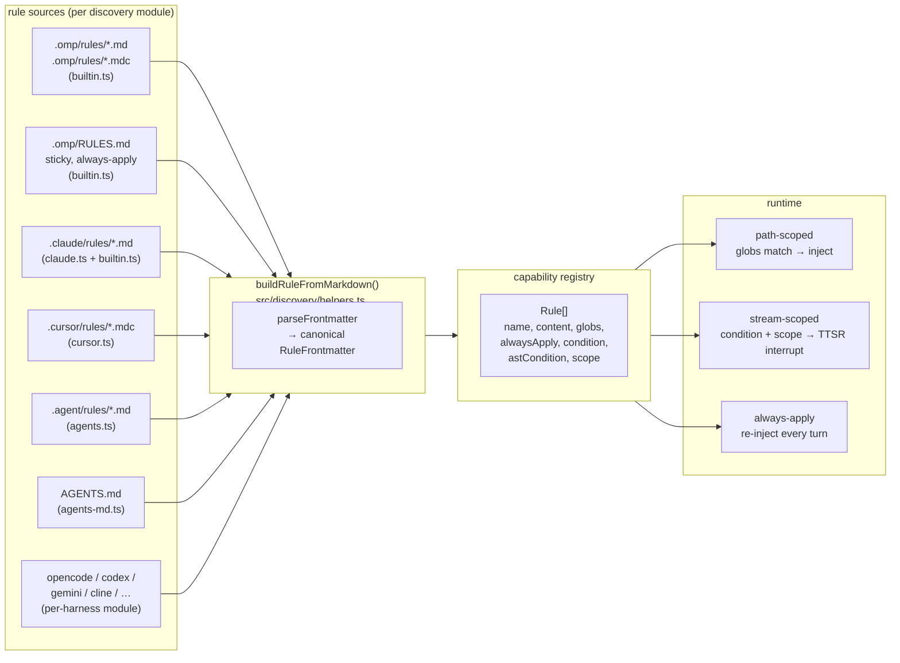
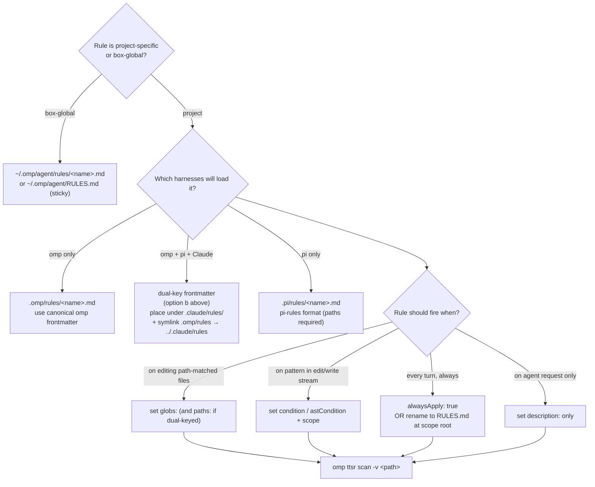

# OMP Agent Rules: Multi-Source Discovery, Three Injection Modes, and the Silent paths/globs Failure

When you do real engineering with an AI agent framework, *rules* are the mechanism that turns team conventions into code-level constraints: they tell the agent what it MUST do when editing a class of files, what it MUST NEVER do in a given context, and which constraints need repeating every turn. The hard part of rules is never "write one rule" — it is "will this rule actually be loaded, and will it actually be injected at the right moment?"

This article breaks down the full rules configuration surface of OMP Agent (`@oh-my-pi/pi-coding-agent`) — the multi-source discovery chain, the unified normalization pipeline, the three injection modes — and then dissects a source-verified silent-failure trap: the `paths:` vs `globs:` key mismatch when porting rules from pi-rules or Claude Code.

> Reading order: grasp the overall architecture and the three injection modes first, then the discovery chain and canonical frontmatter, then keep the paths/globs trap and the checklist as a day-to-day reference.

---

## 1. Background: Rules Are Configuration

An agent orchestration framework needs a context-sensitive constraint layer: the same agent follows one set of rules when editing Java backends and another when writing frontend. Rules are the carrier for that layer.

Done well, a rules system answers three questions:

- **Where do they come from?** Multiple harnesses (omp, Claude Code, Cursor, pi, …) each have their own rules directory — how do you unify them?
- **How are they normalized?** Different sources carry different frontmatter shapes — how do you collapse them into one structure?
- **When are they injected?** Is a rule injected on path match, on edit-stream pattern, or every turn?

OMP's approach: each source has its own discovery module, and every discovered rule funnels through a single `buildRuleFromMarkdown()` that forces one canonical shape, then routes by frontmatter into one of three injection modes.

---

## 2. Architecture: Multi-Source Discovery to Unified Injection

OMP merges rules from many sources into one capability registry. Each source has its own discovery module, but every rule passes through `buildRuleFromMarkdown()`, which enforces a single canonical shape.



### The three rule injection modes

Every loaded rule is routed into exactly one runtime mode based on its frontmatter:

| Mode | Trigger | Effective behavior |
| --- | --- | --- |
| **Path-scoped** | `globs: [...]` matches the file being edited/read | Rule body injected into context only when a candidate path matches |
| **Stream-scoped (TTSR)** | `condition:` / `astCondition:` + `scope:` (e.g. `tool:edit(*.ts)`) | Fires as a **mid-stream interrupt** when the pattern matches edit/write/read content |
| **Always-apply (sticky)** | `alwaysApply: true`, OR a top-level `RULES.md` file | Re-injected near the current turn every turn — survives long conversations |

A rule with **none** of these keys degrades to an **agent-requested** rule: indexed by `description:` for on-demand retrieval, never auto-injected.

---

## 3. The Discovery Chain: What Actually Gets Scanned

Verified by reading `src/discovery/index.ts` (the module registry) and each module's `loadRules` equivalent. **Every rule file ends up at `buildRuleFromMarkdown()`** regardless of which module found it.

### Native omp paths (builtin.ts — `loadRules`)

| Path (walked from cwd up) | Scope | Behavior |
| --- | --- | --- |
| `.omp/rules/*.md` and `*.mdc` | project | Standard rule files — frontmatter decides injection mode |
| `~/.omp/agent/rules/*.md` and `*.mdc` | user | Same — applies to every project on this box |
| `.omp/RULES.md` (nearest, walking up to repo root) | project | **Sticky always-apply** — forced regardless of frontmatter |
| `~/.omp/agent/RULES.md` | user | **Sticky always-apply** — global baseline |

The walk-up stops at `os.homedir()` — `~/.omp/` is the user-level root, not a project root. The first `.omp/` directory found wins; if none, omp falls back to the git root.

### Cross-harness paths (each module registers itself)

| Module | Paths scanned | Format notes |
| --- | --- | --- |
| `agents-md.ts` | `AGENTS.md` (nearest, walk-up) + nested subtree `AGENTS.md` | Domain guidance, not path-scoped rules |
| `claude.ts` | `~/.claude/` + `<cwd>/.claude/` | Scans `rules/`, `commands/`, `tools/`, `skills/`, etc. Rules go through the same `buildRuleFromMarkdown` |
| `cursor.ts` | `.cursor/rules/*.mdc` + legacy `.cursorrules` | MDC frontmatter: `description`, `globs`, `alwaysApply` |
| `agents.ts` | `.agent/rules/`, `.agents/rules/` (walk-up + user home) | Generic agent-ecosystem dir convention |
| `codex.ts`, `gemini.ts`, `opencode.ts`, `cline.ts`, … | per-harness dirs | Each registers itself; same canonical rule shape at the end |

### What is NOT scanned

| Path | Why |
| --- | --- |
| `.pi/rules/` | pi-only convention. omp has no `pi.ts` discovery module — **this is why the symlink bridge exists** |
| `rules:` key in `mcp.json` | No-op. `mcp-schema.json` declares `additionalProperties: false` at top level — unknown keys are silently dropped |
| `rules:` block in `config.yml` | No such config key exists. omp has `memory.*`, `advisor.*`, `modelRoles.*`, `retry.*` — never `rules.*` |

---

## 4. Canonical Frontmatter: RuleFrontmatter

Verified against `src/capability/rule.ts` (`RuleFrontmatter`) and `src/discovery/helpers.ts` (`buildRuleFromMarkdown`).

```yaml
---
# Canonical omp frontmatter (any subset; all optional)
description: One sentence for agent-requested lookup. Required if no globs/condition.
globs:
  - "backend-spring/src/**/*.java"
  - "docker/sandbox/harness/java/src/**/*.java"
alwaysApply: false        # true → sticky, re-injected every turn
condition:                # regex(es) that trigger TTSR interrupt
  - "^import\s+java\.util\.Date$"
astCondition:             # ast-grep pattern(s); edit/write streams only
  - "new $T($$$ARGS)"
scope:                    # TTSR stream scope tokens
  - "tool:edit(*.java)"
  - "tool:write(*.java)"
interruptMode: prose-only # never | prose-only | tool-only | always
---

# Rule body — Markdown

- Concrete, actionable constraints phrased as MUST / SHOULD / NEVER.
- Read order: parent describes WHEN to enter, child describes HOW.
```

### Frontmatter key source of truth

| Key | omp reads it? | Notes |
| --- | --- | --- |
| `description` | ✅ | Used for agent-requested lookup when no scope matches |
| `globs` | ✅ | **The only path-scope key omp honors** |
| `alwaysApply` | ✅ | `true` → sticky always-apply |
| `condition` / `ttsr_trigger` / `ttsrTrigger` | ✅ | All three aliases accepted |
| `astCondition` | ✅ | ast-grep patterns; edit/write streams only |
| `scope` | ✅ | Stream tokens like `text`, `thinking`, `tool:edit(*.ts)` |
| `interruptMode` | ✅ | Per-rule override of `ttsr.interruptMode` |
| **`paths`** | ❌ **NOT READ** | See the trap below — pi-rules / Claude Code format |
| **`kind`** | ❌ ignored | pi-rules marker (`kind: rules`) — omp does not key on it |
| **`summary`** | ❌ ignored | pi-rules summary — falls into `[key: string]: unknown` |
| **`triggers`** | ❌ ignored | pi-rules triggers — same |

---

## 5. The paths vs globs Interop Trap (Source-Verified)

**This is the single most common silent-failure mode for rule sets ported from pi-rules or Claude Code into omp.**

### The mechanism

`buildRuleFromMarkdown()` reads only `frontmatter.globs`:

```ts
let globs: string[] | undefined;
if (Array.isArray(frontmatter.globs)) {
  globs = frontmatter.globs.filter((item): item is string => typeof item === "string");
} else if (typeof frontmatter.globs === "string") {
  globs = [frontmatter.globs];
}
```

No discovery module (`builtin.ts`, `claude.ts`, `cursor.ts`, `agents.ts`, …) post-processes the frontmatter to translate `paths:` → `globs:`. Verified by `grep -rEn "paths.*globs|frontmatter\.paths" src/discovery/` — zero hits.

### The symptom

A rule file written as:

```yaml
---
paths:
  - "backend-spring/src/**/*.java"
---
```

is loaded by omp, but `globs` resolves to `undefined`. The rule then degrades to **agent-requested** (description-based lookup) — never auto-injected on path match. There is **no warning, no log line, no error**. The rule simply doesn't fire when you edit `*.java` files.

### Two fixes (pick one per repo)

**(a) Author rule files in omp-canonical format** — use `globs:` instead of `paths:`. Works everywhere except pi (which requires `paths:`).

```yaml
---
globs:
  - "backend-spring/src/**/*.java"
description: Java 17 backend source rules.
---
```

**(b) Dual-key the frontmatter** — keep both keys; each harness reads the one it honors. Slight duplication, zero interop risk:

```yaml
---
kind: rules                 # pi-rules marker (ignored by omp, required by pi)
paths:                      # pi-rules / Claude Code path scope
  - "backend-spring/src/**/*.java"
globs:                      # omp canonical path scope
  - "backend-spring/src/**/*.java"
summary: Java backend rules. # pi-rules summary (ignored by omp)
description: Java backend rules. # omp lookup key (ignored by pi)
---
```

> **Recommended for shared trees (`.claude/rules/`, `.pi/rules/`)**: option (b). The 4-key duplication is mechanical and survives any harness swap.

### Verification

```bash
# What omp actually loaded (rule names + sources)
cd <repo> && omp ttsr list

# Dry-run a specific rule against a candidate file (bypasses project loading)
omp ttsr test --rule .omp/rules/no-any.md --source tool --path src/foo.ts 'const x: any = 1'

# Scan a directory against the active rule set
omp ttsr scan -r .omp/rules/no-any.md src/

# Show every evaluated rule, not just triggered ones
omp ttsr scan -v src/
```

If a rule you expect to see is absent from `omp ttsr list`, it has **no TTSR metadata** — that's expected for pure path-scoped rules. Use the verbose flag on `ttsr scan` to confirm path-scoped rules are attaching.

---

## 6. The End-to-End Onboarding Flow

Decision tree for adding a **new** rule. Each step has a concrete command or file edit.



### The pi-rules → omp bridge (one-time per repo)

If a repo's canonical rule tree is `.pi/rules/` (pi convention) and you want omp to load the same files, use a **directory** symlink — not per-file links:

```bash
# From the repo root
mkdir -p .omp
ln -s ../.pi/rules .omp/rules
```

Per-file links break the moment a new rule file is added. The directory symlink is progressive. **Important**: bridging makes the files *visible* to omp's scanner, but does NOT translate `paths:` → `globs:`. Combine the bridge with the dual-key fix above or the rules will silently degrade.

---

## 7. The Three Authoring Laws

These are harness-agnostic and apply to any rules system.

1. **Breadth before depth.** Parent files describe *when* to enter a child — not how to work there. A reader who enters the wrong subtree should know from the parent's summary, not after reading the child.
2. **No duplication.** If a fact lives in a child file, the parent must not repeat it. If a fact lives in the parent, the child must not restate it. Duplication drifts; drift breaks trust.
3. **Descriptions are decisions.** Every frontmatter `description` / `summary` must answer: *when should an agent enter here?* Not just what exists, but *when it's relevant*. A description that says "Java rules" is weak; one that says "Java 17 backend source rules — enter when editing `.java` under `backend-spring/`" is strong.

### Concrete phrasing rules

- Use `MUST` / `SHOULD` / `NEVER` (RFC 2119) — omp's system prompt honors them.
- One constraint per bullet. Multi-clause bullets get skimmed.
- Cite the canonical path / pattern by name (`backend-spring/src/**`) — never "the relevant directory".
- Negative constraints (`NEVER`, `MUST NOT`) pair with the **why** — `NEVER store plaintext refresh tokens (HttpOnly cookies only; hash-only DB flow)`.

---

## 8. Known Traps and Lessons Learned

| Trap | Symptom | Mitigation |
| --- | --- | --- |
| **`paths:` vs `globs:` mismatch** | Rule loads but never fires on path match; no error logged | Use `globs:` (omp) or dual-key frontmatter (shared trees) |
| **`rules:` key in `mcp.json`** | Silently dropped; rules never appear | `mcp-schema.json` forbids unknown top-level keys. Use `~/.omp/agent/rules/` or `.omp/rules/` files instead |
| **`.pi/rules/` not loaded by omp** | pi-only convention; omp has no `pi.ts` discovery module | Symlink bridge: `.omp/rules → ../.pi/rules` |
| **Top-level `RULES.md` ignored at depth** | Sticky rule not applying in nested subtrees | `RULES.md` walks up from cwd to repoRoot — place at repo root, not in subdirs |
| **`alwaysApply: true` flooding context** | Every rule re-injected every turn; context bloat | Reserve `alwaysApply` for genuine global constraints. Prefer path-scoped (`globs:`) or TTSR (`condition:` + `scope:`) for the 95% case |
| **Symlinked `.omp/rules/` goes stale** | New file added to source tree doesn't appear | Directory symlink (not per-file) auto-picks new files. Verify with `omp ttsr list` after adding |
| **`AGENTS.md` vs `rules/*.md` duplication** | Same constraint stated in both; drift inevitable | `AGENTS.md` is for *boundaries and flow* (architectural); `rules/*.md` is for *path-scoped constraints*. Don't port one into the other verbatim |
| **Mixed harness frontmatter in one file** | Reader can't tell which harness honors which key | Comment-tag each key: `# omp canonical`, `# pi-rules`, `# Claude Code` — or split into per-harness files |

---

## 9. Verification Checklist (Re-runnable)

After any change to rule files, symlinks, or frontmatter, run through:

- [ ] `cd <repo> && omp ttsr list` shows the expected rule count (TTSR rules only)
- [ ] `omp ttsr scan -v <candidate-path>` shows path-scoped rules attaching
- [ ] `omp ttsr test --rule <rule-file> --source tool --path <path> <snippet>` fires for a positive snippet and is silent for a negative one
- [ ] For shared trees: grep confirms dual-key frontmatter — `grep -L "globs:" <repo>/.omp/rules/*.md` returns empty when `paths:` is present
- [ ] For symlink bridges: `readlink .omp/rules` resolves; `find -L .omp/rules -type f | wc -l` matches source
- [ ] Top-level `RULES.md` (if any) parses as Markdown; one sticky rule per scope
- [ ] No `rules:` key in `mcp.json` (silently dropped — don't rely on it)

---

## 10. Conclusion

The value of a rules system depends on whether the constraints you wrote actually take effect at the right moment — and there are far more ways to make a constraint *silently* fail than to make it work:

- **Unification** rests on a single normalization point — all sources funnel through `buildRuleFromMarkdown`;
- **Routing** rests on three injection modes each doing one job;
- **Trust** rests on crystallizing silent traps like `paths:`/`globs:` into a checklist rather than relying on "it worked last time."

Hold the three lines — *unified normalization, distinct modes, checklist-ized traps* — and rules stop being a black box written into files but with no idea whether they fire, and become a verifiable, auditable engineering capability.

> This article focuses on *flow* and *lessons*. The concrete step-by-step operations (directory symlink bridging, per-harness module self-registration, reading the TS schema) belong in a separate executable SOP that complements this handbook.
