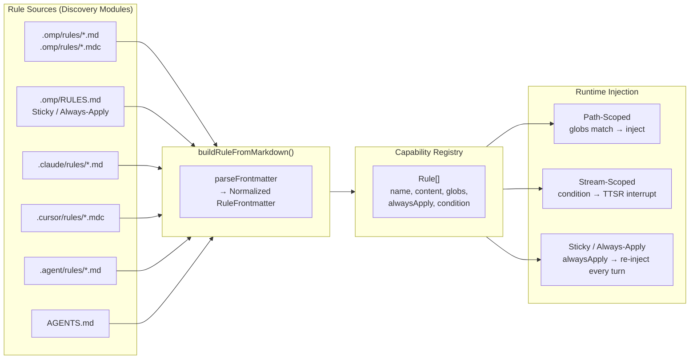

# OMP Agent Rules System Deep Dive: Discovery Pipeline, Three Injection Modes, and the Silent paths/globs Pitfall

When engineering with AI Agent frameworks, "rules" serve as the essential layer translating team conventions into code-level constraints. They dictate what the Agent must follow when editing specific files, what it must never do under given scenarios, and which constraints need persistent reminding across conversation turns. However, the difficulty in rule engineering is rarely writing a rule—it lies in ensuring **whether, when, and how the rule will actually be injected**.

This article systematically dissects the rule configuration architecture of OMP Agent (`@oh-my-pi/pi-coding-agent`), covering its multi-source discovery chain, unified normalization pipeline, three injection modes, and a source-verified silent failure pitfall: key incompatibility between `paths:` and `globs:` when migrating rules from pi-rules or Claude Code.

---

## 1. Background: Rules as Configuration

An Agent orchestration framework requires a context-aware constraint layer. The same Agent must respect Java backend rules when editing Java, and frontend conventions when working on TypeScript/Svelte. Rules act as the vehicle for these context-bound constraints.

A rule system must resolve three core challenges:
- **Where rules originate**: Unifying rule discovery across multiple harnesses (`omp`, `Claude Code`, `Cursor`, `pi`, etc.).
- **How rules are normalized**: Standardizing disparate frontmatter formats into a single schema.
- **When rules are injected**: Routing rules to path-matched, edit-stream, or persistent injection modes.

OMP addresses this by equipping each source with a discovery module, passing all discovered rules into a unified `buildRuleFromMarkdown()` function, and routing them based on normalized frontmatter attributes.

---

## 2. Global Architecture: Multi-Source Discovery to Unified Injection

OMP consolidates rules from multiple discovery modules into a unified capability registry:


```mermaid
flowchart LR
  subgraph Sources["Rule Sources (Discovery Modules)"]
    B[".omp/rules/*.md<br/>.omp/rules/*.mdc"]
    R[".omp/RULES.md<br/>Sticky / Always-Apply"]
    C[".claude/rules/*.md"]
    CU[".cursor/rules/*.mdc"]
    A[".agent/rules/*.md"]
    AG["AGENTS.md"]
  end
  subgraph Build["buildRuleFromMarkdown()"]
    P["parseFrontmatter<br/>→ Normalized RuleFrontmatter"]
  end
  subgraph Reg["Capability Registry"]
    R1["Rule[]<br/>name, content, globs,<br/>alwaysApply, condition"]
  end
  subgraph Inject["Runtime Injection"]
    CTX["Path-Scoped<br/>globs match → inject"]
    TTSR["Stream-Scoped<br/>condition → TTSR interrupt"]
    STICKY["Sticky / Always-Apply<br/>alwaysApply → re-inject every turn"]
  end
  B --> Build
  R --> Build
  C --> Build
  CU --> Build
  A --> Build
  AG --> Build
  Build --> Reg
  Reg --> CTX
  Reg --> TTSR
  Reg --> STICKY
```

### Three Injection Modes
Every loaded rule is dynamically routed based on its normalized frontmatter:

| Mode | Trigger Condition | Runtime Behavior |
| --- | --- | --- |
| **Path-Scoped** | `globs: [...]` matches current target file | Injected into LLM context only when editing/reading matching target paths. |
| **Stream-Scoped (TTSR)** | `condition:` / `astCondition:` + `scope:` | Triggers as a stream interrupt when tool edit/write/read streams match patterns. |
| **Sticky (Always-Apply)** | `alwaysApply: true` or top-level `RULES.md` | Re-injected near the active turn on every conversation round. |

If a rule lacks all three keys, it degrades to an **Agent-Requested** rule, indexed by `description:` for explicit retrieval rather than automatic injection.

---

## 3. Discovery Chain: Scanned Locations

OMP scans project trees and user home directories across multiple harness conventions:

### Native OMP Paths
- `.omp/rules/*.md` and `*.mdc`: Project-scoped rules.
- `~/.omp/agent/rules/*.md`: User-scoped global rules.
- `.omp/RULES.md`: Sticky always-apply rules for the active repository.
- `~/.omp/agent/RULES.md`: Global baseline always-apply rules.

---

## 4. Frontmatter Schema & Normalization

OMP normalizes rule frontmatter into the following interface:

```typescript
interface RuleFrontmatter {
  description?: string;
  globs?: string | string[];
  alwaysApply?: boolean;
  condition?: string;
  astCondition?: string;
  scope?: "read" | "write" | "edit";
}
```

---

## 5. The Silent Failure Pitfall: `paths` vs. `globs`

When migrating rules from **Claude Code** or **pi-rules** into OMP, a common issue arises:

- **Claude Code / pi-rules schema**: Uses `paths: ["src/**/*.ts"]`
- **OMP / Cursor schema**: Expects `globs: ["src/**/*.ts"]`

### Source Analysis & Root Cause
In `buildRuleFromMarkdown()`, OMP parses frontmatter strictly looking for `globs`. If a rule specifies `paths: ["src/**/*.ts"]` without `globs`:
1. `parseFrontmatter` ignores `paths`.
2. `globs` evaluates to `undefined`.
3. `alwaysApply` evaluates to `undefined`.
4. The rule silently drops into **Agent-Requested** mode, completely failing to inject during file edits!

### The Dual-Key Resolution SOP
To ensure rules work seamlessly across OMP, Claude Code, Cursor, and pi-rules without maintenance drift, specify **both keys** in rule frontmatter:

```yaml
---
description: "TypeScript type safety enforcement"
globs:
  - "src/**/*.ts"
paths:
  - "src/**/*.ts"
---

Rule content...
```

---

## 6. Verification Checklist

To verify rule loading and active injection:

1. **Check Loaded Rules**: Use OMP rule inspection commands to verify registered rules.
2. **Path Matching Verification**: Confirm file edits on target paths trigger expected rule inclusion in session context logs.
3. **Dual-Key Enforcement**: Audit legacy `.claude/rules` and `.omp/rules` files for `paths` vs `globs` compatibility.
