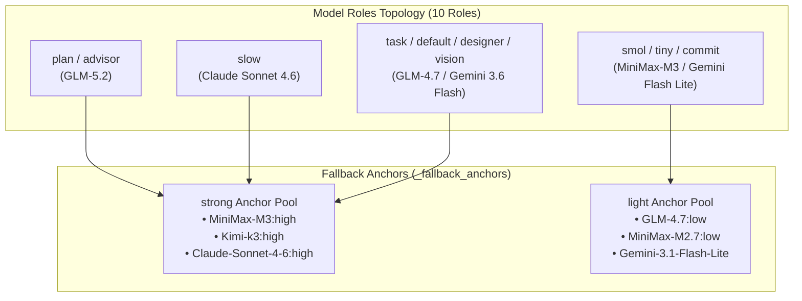
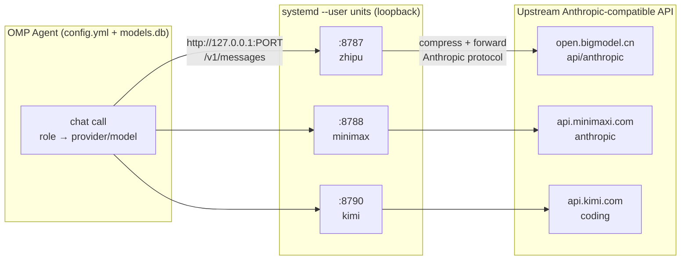
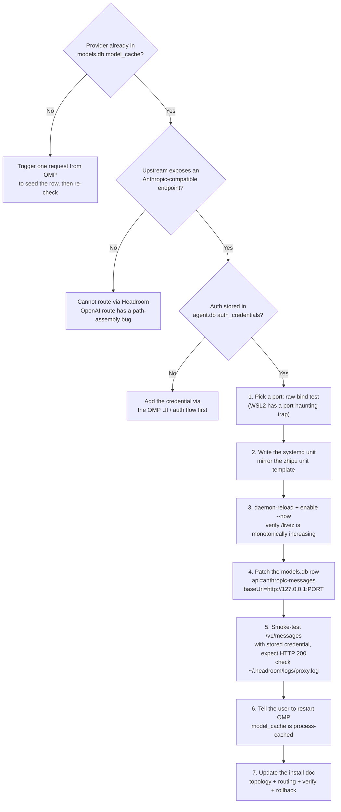
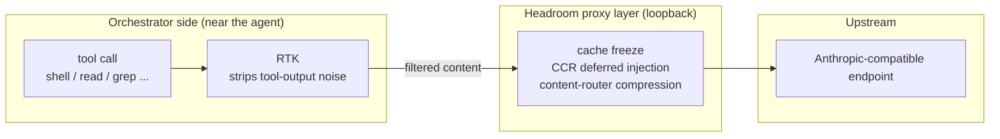
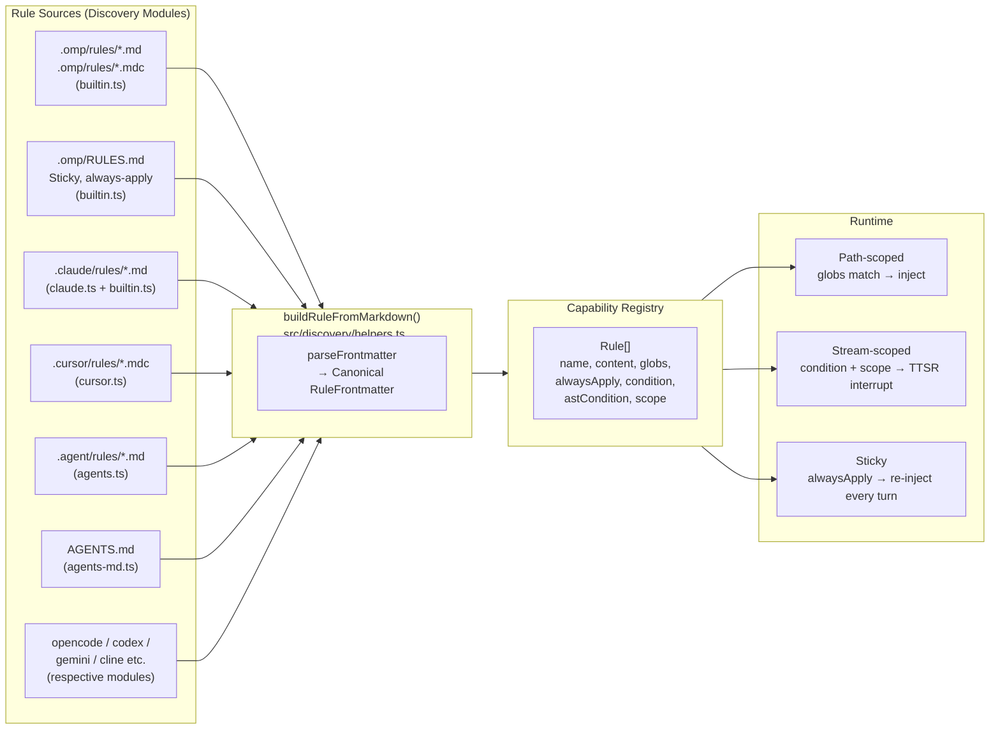
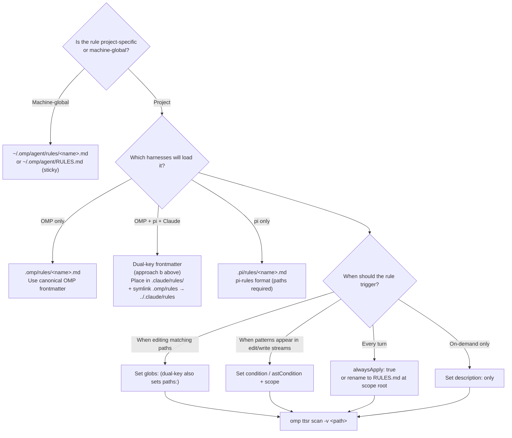

# OMP Configuration & Rules Master Guide: Global Config, Headroom Proxy, and Agent Rules System

OMP (Oh My Pi) is a highly customizable AI Agent orchestration framework. Running it stably in production requires mastering three dimensions simultaneously: **global configuration** determines model routing and fault tolerance, the **proxy layer** governs traffic management and cost optimization, and the **rules system** dictates what constraints the Agent follows in which scenarios.

This article is a consolidated version of three OMP专题 articles, building a complete narrative of the OMP configuration ecosystem — from global config to the proxy layer to the rules system.

---

## 1. OMP Configuration Ecosystem Overview & Design Philosophy

The OMP configuration ecosystem revolves around three core concerns:

1. **Model Routing & Fault Tolerance**: Via `~/.omp/agent/config.yml`, define 10 model roles, fallback anchor pools, and all-role fallback chains to achieve a fine-grained balance between capability and cost.
2. **Traffic Governance**: Via the Headroom compression proxy layer, uniformly integrate custom model providers into OMP, applying transparent compression, caching, and protocol normalization to all passing traffic.
3. **Constraint Injection**: Via the Rules system's multi-source discovery, unified normalization, and three injection modes, translate team conventions into code-level constraints.

The relationship between the three: global config decides "which model to use," Headroom decides "how traffic flows," and the rules system decides "how the Agent behaves." Understanding these three layers lets you master OMP's complete lifecycle from installation to operations.

---

## 2. Global Configuration: Model Roles, Fallback Chains, and Runtime Control

### 2.1 Complete Global Configuration Snapshot

Below is the complete, active configuration snapshot from `~/.omp/agent/config.yml`:

```yaml
setupVersion: 1
modelRoles: 
  plan: zhipu-coding-plan/glm-5.2:max
  advisor: zhipu-coding-plan/glm-5.2
  slow: google-antigravity/claude-sonnet-4-6:high
  task: zhipu-coding-plan/glm-4.7:high
  designer: google-antigravity/gemini-3.6-flash-high
  smol: minimax-code-cn/MiniMax-M3:low
  tiny: zhipu-coding-plan/glm-4.7:low
  commit: google-antigravity/gemini-3.1-flash-lite
  vision: google-antigravity/gemini-3.6-flash-high
  default: google-antigravity/gemini-3.6-flash:medium

_fallback_anchors: 
  strong: 
    - minimax-code-cn/MiniMax-M3:high
    - kimi-code/k3:high
    - google-antigravity/claude-sonnet-4-6:high
  light: 
    - zhipu-coding-plan/glm-4.7:low
    - minimax-code-cn/MiniMax-M2.7:low
    - google-antigravity/gemini-3.1-flash-lite

retry: 
  enabled: true
  maxRetries: 5
  baseDelayMs: 2000
  fallbackRevertPolicy: cooldown-expiry
  fallbackChains: 
    slow: 
      - kimi-code/k3:high
      - minimax-code-cn/MiniMax-M3:high
      - google-antigravity/claude-sonnet-4-6:high
    plan: 
      - minimax-code-cn/MiniMax-M3:high
      - kimi-code/k3:high
      - google-antigravity/claude-sonnet-4-6:high
    advisor: 
      - minimax-code-cn/MiniMax-M3:high
      - kimi-code/k3:high
      - google-antigravity/claude-sonnet-4-6:high
    default: 
      - kimi-code/kimi-for-coding:high
      - zhipu-coding-plan/glm-4.7:high
      - google-antigravity/gemini-3.6-flash-high
    task: 
      - zhipu-coding-plan/glm-4.7:high
      - kimi-code/kimi-for-coding:high
      - google-antigravity/gemini-3.6-flash-high
    designer: 
      - google-antigravity/gemini-3.6-flash-high
      - kimi-code/k3:high
      - minimax-code-cn/MiniMax-M3:high
    vision: 
      - kimi-code/k3:high
      - minimax-code-cn/MiniMax-M3:high
      - google-antigravity/gemini-3.6-flash-high
    smol: 
      - zhipu-coding-plan/glm-4.7:low
      - google-antigravity/gemini-3.1-flash-lite
    tiny: 
      - kimi-code/kimi-for-coding:low
      - google-antigravity/gemini-3.1-flash-lite
    commit: 
      - zhipu-coding-plan/glm-4.7:low
      - kimi-code/kimi-for-coding:low
  usageAwareFallback: true
  usageReservePolicy: auto
  usageReservePct: 10

advisor: 
  enabled: true
  subagents: true
symbolPreset: ascii
theme: 
  dark: dark-volcanic
  light: light
disabledExtensions: []
memory: 
  backend: hindsight
hindsight: 
  apiUrl: http://localhost:42888
autolearn: 
  enabled: true
  autoContinue: true
defaultThinkingLevel: auto
dev: 
  autoqaConsent: granted
prewalk: 
  enabled: true
display: 
  showTokenUsage: true
compaction: 
  idleEnabled: true
  idleThresholdTokens: 200000
task: 
  prewalk: true
  eager: preferred
goal: 
  continuationModes: 
    - interactive
branchSummary: 
  enabled: true
snapcompact: 
  systemPrompt: none
  toolResults: true
ttsr: 
  interruptMode: prose-only
checkpoint: 
  enabled: false
computer: 
  enabled: false
statusLine: 
  showHookStatus: false
```

### 2.2 Model Roles Topology & Fallback Anchors

OMP dispatches agent workloads to specialized models via `modelRoles` and establishes resilience pools using `_fallback_anchors`.



#### 10 Model Roles Breakdown

- **Planning & Architecture (`plan` / `advisor`)**: Powered by `zhipu-coding-plan/glm-5.2` for global architecture design and advisory.
- **Deep Reasoning (`slow`)**: Uses `google-antigravity/claude-sonnet-4-6:high` for complex debugging and critical refactoring.
- **Standard Workers (`task` / `default` / `designer` / `vision`)**: Driven by `GLM-4.7:high` and `Gemini 3.6 Flash` for high-throughput coding, UI design, and multimodal processing.
- **Fast Scans (`smol` / `tiny` / `commit`)**: Managed by `MiniMax-M3:low` and `Gemini 3.1 Flash Lite` for rapid Git commits and quick file scans.

#### Decoupled Fallback Anchor Pools (`_fallback_anchors`)

The `_fallback_anchors` section abstracts underlying models into two tier pools:
- **`strong` Anchor Pool**: Includes `MiniMax-M3:high`, `Kimi-k3:high`, and `Claude-Sonnet-4-6:high`. Designed as backups for reasoning-heavy roles.
- **`light` Anchor Pool**: Includes `GLM-4.7:low`, `MiniMax-M2.7:low`, and `Gemini-3.1-Flash-Lite`. Serves as low-cost fallbacks for lightweight tasks.

### 2.3 All 9 Role Fallback Chains (`fallbackChains`) & Usage Awareness

When API rate limits (RPM/TPM) or transient outages occur, OMP activates explicit fallback routes for **all 9 core roles**:

1. **Heavy Reasoning & Planning (`slow`, `plan`, `advisor`)**: Fallback route `Kimi-k3:high` → `MiniMax-M3:high` → `Claude-Sonnet-4-6:high`.
2. **Standard Workers & UI Vision (`default`, `task`, `designer`, `vision`)**: Priority fallback to `Kimi-for-coding` / `GLM-4.7:high` / `Gemini 3.6 Flash High`.
3. **Lightweight Quick Scans (`smol`, `tiny`, `commit`)**: Fallback from lightweight models to `GLM-4.7:low` / `Gemini 3.1 Flash Lite` / `Kimi-for-coding:low`.

#### Auto Revert & Quota Reserve Policies

- **`fallbackRevertPolicy: cooldown-expiry`**: Automatically reverts to the primary model once its cooldown period expires.
- **`usageAwareFallback: true` & `usageReservePct: 10`**: Proactively triggers fallback switches when approaching rate limits, reserving a 10% buffer.

### 2.4 Fine-Grained Execution Control Flags

#### Thinking & Exploration Switches

- **`defaultThinkingLevel: auto`**: Dynamically adjusts Chain-of-Thought (CoT) depth based on task complexity.
- **`task.prewalk: true` & `prewalk.enabled: true`**: Mandates pre-exploration of dependency graphs before code modifications.
- **`task.eager: preferred`**: Prioritizes parallel dispatching when modular sub-tasks are identified.

#### Interaction & Interrupt Modes

- **`goal.continuationModes: [interactive]`**: Uses interactive continuation mode to prevent Agent detachment.
- **`ttsr.interruptMode: prose-only`**: Restricts Turn-To-Speak interrupts to natural prose only.
- **`branchSummary.enabled: true`**: Automatically generates structured Git branch change summaries.
- **`snapcompact.toolResults: true`**: Cleans raw tool outputs during 200k Token idle context compaction.

#### Developer & Experimental Options

- **`dev.autoqaConsent: granted`**: Grants consent for automated QA testing in development environments.
- **`checkpoint.enabled: false` & `computer.enabled: false`**: Explicitly disables experimental Checkpoint snapshotting and Computer Use desktop interaction.

### 2.5 Long-Term Memory & Hard Guardrails

1. **Hindsight Long-term Memory (`backend: hindsight`)**: Connects to the local Hindsight daemon (`http://localhost:42888`) to persist architectural insights, lessons learned, and user preferences across sessions.
2. **Autolearn (`autolearn.enabled: true`)**: Automatically extracts reusable lessons/skills into `~/.omp/agent/managed-skills/`.
3. **Pre-Tool-Call Guardrail (GitHub Write Gate)**: Via `~/.omp/agent/hooks/pre/github-write-gate.ts`, physically blocks `git push`, `gh pr`, and other write operations unless explicitly confirmed by the user or `OMPGATE_OFF=1` is set.

---

## 3. Headroom Compression Proxy: Custom Provider Onboarding

Global config decides "which model to use"; Headroom solves "how traffic flows."

### 3.1 Why a Compression Proxy Layer?

OMP routes requests to different provider/model pairs based on roles. Ideally, every provider would offer prompt caching, context compression, and tool-result caching. In practice, not every upstream supports these natively. Headroom fills the gap: as a local reverse proxy, it transparently compresses, caches, and normalizes the protocol for every byte that passes through.

**Proxy coverage principle: only providers that need governance go through the proxy; everything else stays direct.** In this setup, only three CN-region providers pass through Headroom; every other provider (Vertex Claude, local Ollama, LM Studio, llama.cpp, etc.) is untouched and direct.

#### The Value Picture: RTK Is the Workhorse

Runtime measurement by "how many tokens it saved":
- **RTK CLI filtering** contributes roughly **86.7% of savings** (stripping tool-output noise);
- **Prefix-cache stability** holds a **~100% hit rate** under `--mode cache`;
- **Active compression** contributes **under 1%** (only non-Read bodies).

Headroom is best described as a "cache stabilizer + protocol normalizer"; the real savings come from RTK's tool-output noise reduction.

### 3.2 Overall Architecture: Four Artifacts and Responsibilities

OMP routes three CN-region providers through per-provider Headroom compression proxies; every other provider goes direct.



The key to understanding this architecture is knowing **what each of the four artifacts owns — and what it does not**:

| Layer | Artifact (file/object) | Owns | Does NOT own |
| --- | --- | --- | --- |
| **1. Role → model binding** | `config.yml` (`modelRoles`, `task.agentModelOverrides`, `retry.fallbackChains`) | Which provider/model each OMP role uses; the fallback graph | Network routing |
| **2. Model → route binding** | `models.db` table `model_cache` (`provider_id`, `models[].api`, `models[].baseUrl`) | Protocol (`anthropic-messages`) + base URL per provider's models | Auth, role assignment |
| **3. Proxy process** | systemd unit `headroom-proxy-*.service` (one per provider) | Listening port, upstream URL, provider name, restart policy | Which models exist |
| **4. Upstream API** | The provider's Anthropic-compatible endpoint | Actual model inference | Whether Headroom exists |

Two further orthogonal concerns:
- **Credential store** (`agent.db` table `auth_credentials`): Headroom only forwards auth headers from OMP; it never injects auth itself.
- **CLI profiles** (`~/.config/claude-profile/*.json`): Used only by the standalone `claude` CLI; OMP does not read them.

### 3.3 End-to-End Onboarding Flow

Onboarding a new provider means putting each of the four artifacts in place:



#### Port Selection: Python Raw-Bind Test

Under WSL2 mirrored networking, the system may report the port as free but binding throws `EADDRINUSE`. Verify with Python:

```python
import socket
s = socket.socket(socket.AF_INET, socket.SOCK_STREAM)
s.bind(("127.0.0.1", PORT))
s.close()
```

#### Idempotent `models.db` Patch

When patching a `model_cache` row in `models.db`, set `authoritative` to `1`. If left at `0`, OMP may re-fetch from its bundled static registry and silently revert `baseUrl`, causing traffic to bypass the proxy.

#### Restart OMP After Patching

`model_cache` is an in-process cache. After patching `models.db`, you must restart OMP for changes to take effect.

### 3.4 Three-Level Routing Verification

Verifying that traffic actually traverses the proxy requires three levels of evidence in sequence:

| Level | Verification means | What it proves | What it does not prove |
| --- | --- | --- | --- |
| **L1 Config** | Read `models.db` `baseUrl` pointing at loopback | If the orchestrator resolves this model, it must use the proxy | Whether the orchestrator actually selects this model at runtime |
| **L2 Bare-proxy** | Send `/v1/messages` directly to the loopback port | Proxy starts, protocol works, credential passthrough succeeds | Whether the orchestrator's routing sends traffic here |
| **L3 Orchestrator-native** | Check `proxy.log` `PERF` lines + live connections (`ss`) | The orchestrator actually sent native traffic to the proxy | — |

**L3 verification commands:**

```bash
# 1. Monitor PERF lines for the target model
tail -f ~/.headroom/logs/proxy.log | grep 'PERF model='

# 2. Check outbound connections from the orchestrator process
ss -tnp state established | grep <OMP_PID>
```

Confirm the connection destination is `127.0.0.1:<PORT>`, not a direct connection to the upstream IP.

### 3.5 RTK and Headroom: Independent but Composed

RTK and Headroom are two independent components: RTK filters CLI/tool output noise near the Agent end; Headroom maintains prefix caching and context compression at the network layer.



#### Interception Distinction

- **Inline HTTP redirection** (e.g., `curl` intercepted): Handled by the orchestrator's `context-mode` plugin.
- **Large command output redirection** (e.g., log truncation): Handled by RTK.

### 3.6 Daily Operations & Probes

#### Service Control

```bash
# Status
systemctl --user status headroom-proxy-zhipu headroom-proxy-minimax headroom-proxy-kimi

# Restart / stop
systemctl --user restart headroom-proxy-zhipu headroom-proxy-minimax headroom-proxy-kimi

# Tail live logs
journalctl --user -u headroom-proxy-zhipu -f
```

#### CLI Probes

```bash
# Health check
headroom doctor --port 8787

# Performance & cache metrics
headroom perf

# Token savings statistics
headroom savings
```

#### Probe Notes

- `/livez` reflects real-time proxy process status;
- `/readyz` probes the default Anthropic URL and reports unhealthy — **this is normal**. Trust `/livez` and actual traffic logs.

---

## 4. Rules System: Multi-Source Discovery, Three Injection Modes, and the paths/globs Pitfall

Global config decides "which model to use," Headroom decides "how traffic flows," and the rules system decides "how the Agent behaves."

### 4.1 Background: Rules as Configuration

An Agent orchestration framework needs a "context-aware constraint layer." The same Agent must respect one set of rules when editing Java backends and another when writing frontend code. Rules are the vehicle for these context-bound constraints.

A rule system must resolve three things:

- **Where rules come from**: Multiple harnesses (omp, Claude Code, Cursor, pi, etc.) each have their own rule directories — how to unify them;
- **How rules are normalized**: Different frontmatter fields — how to standardize into one structure;
- **When rules are injected**: Path-matched, edit-stream, or every-turn injection.

OMP's approach: each source has a discovery module, all discovered rules flow into a single `buildRuleFromMarkdown()`, forced into one canonical shape, then routed to one of three injection modes based on frontmatter.

### 4.2 Global Architecture: Multi-Source Discovery to Unified Injection



#### Three Rule Injection Modes

Every loaded rule is routed to exactly one of three runtime modes based on its frontmatter:

| Mode | Trigger Condition | Runtime Behavior |
| --- | --- | --- |
| **Path-scoped** | `globs: [...]` matches the file being edited/read | Rule body injected into context only when the candidate path matches |
| **Stream-scoped (TTSR)** | `condition:` / `astCondition:` + `scope:` (e.g., `tool:edit(*.ts)`) | Triggers as a **stream interrupt** when patterns match edit/write/read content |
| **Sticky (always-apply)** | `alwaysApply: true`, or top-level `RULES.md` file | Re-injected near the current turn every round — never lost in long conversations |

A rule lacking all three keys degrades to an **agent-requested** rule: indexed by `description:` for on-demand retrieval, never auto-injected.

### 4.3 Discovery Chain: Which Paths Are Scanned

#### Native OMP Paths (builtin.ts `loadRules`)

| Path (traversed upward from cwd) | Scope | Behavior |
| --- | --- | --- |
| `.omp/rules/*.md` and `*.mdc` | Project | Standard rule files — frontmatter determines injection mode |
| `~/.omp/agent/rules/*.md` and `*.mdc` | User | Same — applies to all projects on this machine |
| `.omp/RULES.md` (nearest, upward to repo root) | Project | **Sticky always-apply** — ignores frontmatter, forced on |
| `~/.omp/agent/RULES.md` | User | **Sticky always-apply** — global baseline |

Upward traversal stops at `os.homedir()`. The first `.omp/` directory found takes effect; if none, OMP falls back to the git root.

#### Cross-Harness Paths

| Module | Scanned paths | Format notes |
| --- | --- | --- |
| `agents-md.ts` | `AGENTS.md` (nearest, upward) + nested subtrees | Domain guidance, not path-scoped rules |
| `claude.ts` | `~/.claude/` + `<cwd>/.claude/` | Scans `rules/`, `commands/`, `tools/`, `skills/` etc. |
| `cursor.ts` | `.cursor/rules/*.mdc` + legacy `.cursorrules` | MDC frontmatter: `description`, `globs`, `alwaysApply` |
| `agents.ts` | `.agent/rules/`, `.agents/rules/` (upward + user home) | Generic agent ecosystem directory convention |
| `codex.ts`, `gemini.ts`, `opencode.ts`, `cline.ts` etc. | Each harness's own directory | Each registers, all normalize to the same canonical rule shape |

#### Which Paths Are **NOT** Scanned

| Path | Reason |
| --- | --- |
| `.pi/rules/` | pi-specific convention. OMP has no `pi.ts` discovery module — **this is why symlink bridging exists** |
| `rules:` key in `mcp.json` | No-op. `mcp-schema.json` declares `additionalProperties: false` at top level — unknown keys are silently dropped |
| `rules:` block in `config.yml` | This config key doesn't exist. OMP has `memory.*`, `advisor.*`, `modelRoles.*`, `retry.*` — but no `rules.*` |

### 4.4 Canonical Frontmatter: RuleFrontmatter

Verified against `src/capability/rule.ts` (`RuleFrontmatter`) and `src/discovery/helpers.ts` (`buildRuleFromMarkdown`).

```yaml
---
# Canonical OMP frontmatter (any subset, all optional)
description: "One-liner for on-demand retrieval. Required when no globs/condition."
globs:
  - "backend-spring/src/**/*.java"
  - "docker/sandbox/harness/java/src/**/*.java"
alwaysApply: false        # true → sticky, re-inject every turn
condition:                # Regex triggering TTSR interrupt
  - "^import\\s+java\\.util\\.Date$"
astCondition:             # ast-grep pattern; edit/write streams only
  - "new $T($$$ARGS)"
scope:                    # TTSR stream-scoped token
  - "tool:edit(*.java)"
  - "tool:write(*.java)"
interruptMode: prose-only # never | prose-only | tool-only | always
---

# Rule body — Markdown

- Specific, actionable constraints using MUST / SHOULD / NEVER.
- Reading order: parent file describes WHEN to enter; child file describes HOW.
```

#### Authoritative Frontmatter Key Reference

| Key | Does OMP read it? | Notes |
| --- | --- | --- |
| `description` | ✅ | Used for on-demand retrieval when no scope match |
| `globs` | ✅ | **OMP's only recognized path-scoped key** |
| `alwaysApply` | ✅ | `true` → sticky always-apply |
| `condition` / `ttsr_trigger` / `ttsrTrigger` | ✅ | Three aliases accepted |
| `astCondition` | ✅ | ast-grep pattern; edit/write streams only |
| `scope` | ✅ | Stream token, e.g., `text`, `thinking`, `tool:edit(*.ts)` |
| `interruptMode` | ✅ | Per-rule override of `ttsr.interruptMode` |
| **`paths`** | ❌ **Not read** | See pitfall below — pi-rules / Claude Code format |
| **`kind`** | ❌ Ignored | pi-rules marker (`kind: rules`), OMP doesn't distinguish by this key |
| **`summary`** | ❌ Ignored | pi-rules summary, falls into `[key: string]: unknown` |
| **`triggers`** | ❌ Ignored | pi-rules trigger, same as above |

### 4.5 The paths vs. globs Interop Pitfall (Source-Verified)

**This is the most common silent failure mode when migrating rule sets from pi-rules or Claude Code to OMP.**

#### Mechanism

`buildRuleFromMarkdown()` only reads `frontmatter.globs`:

```ts
let globs: string[] | undefined;
if (Array.isArray(frontmatter.globs)) {
  globs = frontmatter.globs.filter((item): item is string => typeof item === "string");
} else if (typeof frontmatter.globs === "string") {
  globs = [frontmatter.globs];
}
```

No discovery module post-processes frontmatter to translate `paths:` into `globs:`.

#### Symptom

A rule written with `paths:` gets loaded by OMP, but `globs` resolves to `undefined`. The rule degrades to **agent-requested** mode — **it will never auto-inject on path match**. And there is **no warning, no log, no error**. The rule simply won't trigger when you edit `*.java` files.

#### Two Fixes (pick one per repo)

**(a) Use OMP canonical format** — replace `paths:` with `globs:`:

```yaml
---
globs:
  - "backend-spring/src/**/*.java"
description: "Java 17 backend source rules."
---
```

**(b) Dual-key frontmatter** — keep both keys, each harness reads what it recognizes:

```yaml
---
kind: rules                 # pi-rules marker (OMP ignores, pi requires)
paths:                      # pi-rules / Claude Code path scope
  - "backend-spring/src/**/*.java"
globs:                      # OMP canonical path scope
  - "backend-spring/src/**/*.java"
summary: Java backend rules. # pi-rules summary (OMP ignores)
description: "Java backend rules. # OMP retrieval key (pi ignores)"
---
```

> **Shared directories (`.claude/rules/`, `.pi/rules/`) recommend approach (b)**. The 4-key redundancy is mechanical and survives any harness switch.

### 4.6 Rule Onboarding Decision Tree & Bridging



#### pi-rules → OMP Bridging (once per repo)

If the repo's canonical rule tree is `.pi/rules/`, bridge with a **directory symlink**:

```bash
# At repo root
mkdir -p .omp
ln -s ../.pi/rules .omp/rules
```

> **Note**: Bridging only makes files "visible" to OMP's scanner — it does **not** translate `paths:` to `globs:`. Must be combined with the dual-key fix above.

### 4.7 Three Laws of Rule Writing

1. **Breadth before depth.** Parent files describe *when* to enter child files — not *how* to do things there.
2. **No repetition.** If a fact is in a child file, the parent shouldn't restate it. Repetition drifts; drift erodes trust.
3. **Description as decision.** Each `description` must answer: *When should the Agent enter here?* Not just "what's here," but *when it's relevant*.

#### Specific Wording Rules

- Use `MUST` / `SHOULD` / `NEVER` (RFC 2119).
- One constraint per bullet.
- Use canonical path/pattern names.
- Negative constraints (`NEVER`, `MUST NOT`) must include a **reason**.

---

## 5. End-to-End Verification Checklist

Consolidating verification content from all three articles into a unified verification manual.

### Global Configuration Verification

- [ ] `config.yml` parses correctly with a YAML parser
- [ ] Every role in `modelRoles` has a corresponding model definition
- [ ] `fallbackChains` contains no references to disabled or unavailable models
- [ ] `usageReservePct` is set reasonably (recommended: 10%)

### Headroom Proxy Verification

- [ ] Each proxy port's `/livez` returns healthy status
- [ ] `models.db` `baseUrl` points to loopback address
- [ ] L3 verification: `proxy.log` shows `PERF model=` lines, and `ss` shows connection destination as `127.0.0.1:<PORT>`
- [ ] `headroom doctor` and `headroom perf` output is normal

### Rules System Verification

- [ ] `cd <repo> && omp ttsr list` shows the expected number of rules (TTSR rules only)
- [ ] `omp ttsr scan -v <candidate path>` shows path-scoped rules are attached
- [ ] `omp ttsr test --rule <rule file> --source tool --path <path> <snippet>` triggers for positive snippets, silent for negative ones
- [ ] Shared directories: grep confirms dual-key frontmatter — when `paths:` exists, `grep -L "globs:" <repo>/.omp/rules/*.md` should return empty
- [ ] Symlink bridging: `readlink .omp/rules` resolves; `find -L .omp/rules -type f | wc -l` matches source
- [ ] Top-level `RULES.md` (if present) parses as Markdown; one sticky rule per scope
- [ ] No `rules:` key in `mcp.json` (silently dropped, don't rely on it)

---

## 6. Known Traps & Lessons Learned

Consolidating pitfall records from all three articles into a unified experience manual.

### Global Configuration Traps

| Trap | Symptom | Mitigation |
| --- | --- | --- |
| **`fallbackChains` retains disabled models** | Primary model works, but fallback hits a disabled model | After changing primary roles, grep-check model references in `fallbackChains` |
| **`config.yml` changes not immediately effective** | Current session behavior unchanged | OMP loads config per session; next session auto-applies, no restart needed |

### Headroom Proxy Traps

| Trap | Symptom | Mitigation |
| --- | --- | --- |
| **WSL2 mirrored-net port haunting** | `ss`/`/proc/net/tcp` show port free, but bind crashes with `EADDRINUSE` | Raw-bind test with Python `socket.bind(("127.0.0.1", PORT))`. Avoid 8789; use 8790+ |
| **Headroom OpenAI-route path bug** | `/paas/v4` or `/coding/v1` bases get misassembled → 404 | All providers use `api: anthropic-messages`. If upstream lacks Anthropic endpoint, cannot route through Headroom |
| **`RestartSec=3` crash-loops** | Unit enters 50+ restart loop | Set `RestartSec=8`, giving TCP TIME_WAIT time to clear |
| **`authoritative=0` silent rollback** | `baseUrl` reverts to default after a while | Force `authoritative=1` when patching `models.db` |
| **OMP caches `model_cache` in memory** | Config doesn't take effect after DB change | Tell user to restart OMP after modifying `models.db` |
| **Phantom Windows proxy on 8789** | `/livez` returns 200 but real requests get 401 | Use `ss -tlnp` to confirm bound PID is your systemd unit's MainPID |
| **Subagent model override silently ignored** | Subagent uses parent's model instead of configured one | Verification must reach L3 (`proxy.log` + `ss`) |
| **context-mode + Headroom double compression** | Model output too terse, missing context | Disable one layer at a time to isolate: stop Headroom or disable `context-mode` plugin |

### Rules System Traps

| Trap | Symptom | Mitigation |
| --- | --- | --- |
| **`paths:` vs `globs:` mismatch** | Rule loaded but never triggers on path match; no error logs | Use `globs:` (OMP) or dual-key frontmatter (shared directories) |
| **`rules:` key in `mcp.json`** | Silently dropped; rule never appears | `mcp-schema.json` forbids unknown top-level keys. Use rule files instead |
| **`.pi/rules/` not loaded by OMP** | pi-specific convention; OMP has no `pi.ts` discovery module | Symlink bridge: `.omp/rules → ../.pi/rules` |
| **Top-level `RULES.md` ignored in deep subtrees** | Sticky rules don't apply in nested subtrees | Place `RULES.md` at repo root, not subdirectories |
| **`alwaysApply: true` fills context** | Every rule re-injected every turn, context bloats | Reserve `alwaysApply` for true global constraints. 95% of cases prefer `globs:` or TTSR |
| **Symlinked `.omp/rules/` goes stale** | New files in source tree don't appear | Use directory symlinks (not per-file). Verify with `omp ttsr list` after additions |
| **`AGENTS.md` and `rules/*.md` duplicate** | Same constraint on both sides inevitably drifts | `AGENTS.md` writes *boundaries & process*; `rules/*.md` writes *path-scoped constraints* |
| **Mixed multi-harness frontmatter in one file** | Readers can't tell which harness recognizes which key | Add comment labels per key, or split into separate files by harness |

---

By "clarifying global config layers, enforcing three-level routing verification, unifying rule normalization, and maintaining tool composition," you can build an efficient, stable, and auditable OMP Agent governance architecture in production.
