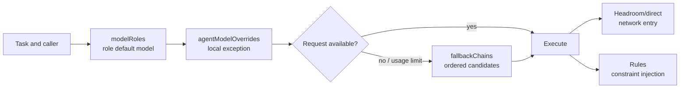

This page answers one configuration question: when OMP has role routing, sub-agent overrides, fallback policy, proxying, and rules, which layer decides what? The working model is: select the role default, apply an explicit local override, and only then use the fallback chain when failure or usage policy requires it. Network entry and behavioral rules are separate responsibilities.

## Core mechanism

### 1. Configuration layers and causal chain



| Layer | Answers | Explicitly does not answer |
| --- | --- | --- |
| `modelRoles` | The default provider/model and capability tier for roles such as `plan`, `task`, or `slow` | Whether a request traverses a proxy or how credentials are created |
| `task.agentModelOverrides` | A model exception for one Agent or subtask | A replacement for the role default or a failure-recovery mechanism |
| `retry.fallbackChains` | Ordered candidates after failure, throttling, or a usage policy trigger | Repairing provider configuration or guaranteeing that a candidate is usable |
| Runtime controls (retry, usage-aware policy, etc.) | When to retry, cool down, reserve usage, or return to the preferred model | Redefining what a role means |
| Headroom / `models.db` | The provider-to-network route and proxy lifecycle | Selecting an OMP role or injecting Agent rules |
| Rule discovery and injection | Applying constraints by `globs`, conditions, or `alwaysApply` | Changing model routing or translating `paths` into `globs` automatically |

### 2. Boundaries between selection and recovery

- Put capability and cost intent in the role default; do not encode a temporary upstream URL in the role meaning.
- Use an override only for a real sub-agent exception. If its key or scope is unsupported by the current release, behavior can fall back to the parent role or default; confirm with runtime evidence.
- A fallback chain is an ordered candidate graph, not a health checker. Every candidate still needs to exist in the current model catalog and pass authentication.
- `fallbackRevertPolicy`, usage-aware fallback, and retry counts change recovery timing; they do not turn a direct provider into a Headroom provider.
- `globs`, conditions, and `alwaysApply` describe rule injection. There is no substitute `rules` switch in the configuration file that replaces rule discovery.

### 3. Validate configuration, routing, then behavior

1. **Structure**: parse the configuration and check key types, role names, override targets, and fallback references.
2. **Decision**: start a fresh session, invoke one normal role and one overridden sub-agent, and record the final selector; do not inspect text alone.
3. **Recovery**: with a controlled unavailable or throttled candidate, verify fallback order, cooldown return, and usage reservation while preserving the original error.
4. **Entry**: if Headroom is enabled, separately check the `models.db`/explicit custom provider, request headers, and the active wrapped session; a 200 or `/health` only proves reachability.
5. **Rules**: use `omp ttsr list` and `omp ttsr scan -v <candidate>` to check discovery and path attachment.

## Applicable conditions

- You need to balance planning, execution, design, and fast-scan workloads within one OMP installation.
- You need to change the model for one sub-agent without copying the complete global configuration.
- You need to diagnose API throttling, exhausted usage, and model-selection errors separately.
- You need to operate proxy routes and rule files together while retaining evidence for each layer.

## Not applicable and risks

| Symptom | Tempting misdiagnosis | Boundary and response |
| --- | --- | --- |
| A sub-agent still uses the parent model | Assuming the override key must work | Field names, scope, and inheritance vary by release; verify the final selector in a new session |
| The primary works but fallback fails | Assuming fallback discovers new models | Fallback only walks declared candidates; remove disabled, stale, or unauthenticated entries |
| A config edit changes nothing | Assuming hot reload | Session-loaded behavior must be checked in a new session; an old process is not evidence |
| A rule loads but never matches a path | Using `paths` without `globs` | OMP reads `globs`; shared directories may carry both keys, but automatic translation is not implied |
| Only loopback or HTTP 200 is visible | Treating reachability as the whole route | Inspect inbound/outbound logs and final upstream; role selection, entry routing, and compression savings are different facts |
| Making every rule `alwaysApply` | Assuming repetition is safer | Sticky rules expand context every turn; path or stream conditions fit most constraints better |

## Minimal verification

```text
Parse config → role default → override hit → fallback order
            → (if enabled) actual entry/upstream → rule discovery/path hit
```

The smallest useful evidence set contains: the final selector for one default role, the final selector for one overridden sub-agent, the ordered candidates from one controlled fallback, and the rule entries reported by a scan. Any item inferred only from static YAML does not prove runtime behavior.

## Evidence and uncertainty

- **Source facts**: `legacy-omp-config-and-rules-guide` records `modelRoles`, `task.agentModelOverrides`, `retry.fallbackChains`, rule normalization, the silent `paths`/`globs` failure, and the distinction between role-to-model, model-to-entry, and request-level routing.
- **This page's synthesis**: the order “default → local override → recovery → network entry → rule injection” keeps symptoms from different layers from being conflated.
- **Unconfirmed**: role counts, CLI output, exact override precedence, usage thresholds, and `models.db` fields may change with OMP/Headroom versions; this page does not treat an old machine snapshot as a current default.

## Related pages

- [Headroom single-port evolution](/en/note/headroom-single-port-evolution)
- [Headroom route persistence](/en/note/omp-headroom-persistence)
- [OMP Hook extension](/en/note/omp-hook-extension-guide)
- [LLM wiki pattern](/en/note/llm-wiki-pattern)
