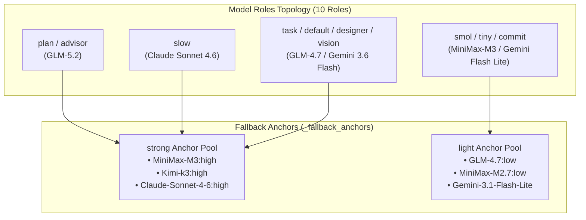

# Global OMP Configuration Deep Dive: Model Roles, Fallback Chains, and Guardrails Practice

In complex software engineering and daily AI-assisted development, a single AI model struggles to simultaneously satisfy **latency requirements**, **deep reasoning needs**, and **API cost budgets**. OMP (`@oh-my-pi/pi-coding-agent`) provides a highly customizable global configuration architecture via `~/.omp/agent/config.yml` to manage agent behaviors, model routing, high-availability fallback, long-term memory, and security guardrails.

This post presents a systematic analysis of the **currently active** global `config.yml` configuration, exploring its underlying design philosophy, fallback anchor pools, all-role fallback chains, fine-grained execution flags, and operational best practices.

---

## 1. Complete Global Configuration Snapshot

Below is the complete, active configuration snapshot from `~/.omp/agent/config.yml`:

```yaml
setupVersion: 1
modelRoles: 
  plan: zhipu-coding-plan/glm-5.2:max
  advisor: zhipu-coding-plan/glm-5.2
  slow: google-antigravity/claude-sonnet-4-6:high
  task: zhipu-coding-plan/glm-4.7:high
  designer: google-antigravity/gemini-3.6-flash-high
  smol: minimax-code-cn/MiniMax-M3:low
  tiny: zhipu-coding-plan/glm-4.7:low
  commit: google-antigravity/gemini-3.1-flash-lite
  vision: google-antigravity/gemini-3.6-flash-high
  default: google-antigravity/gemini-3.6-flash:medium

_fallback_anchors: 
  strong: 
    - minimax-code-cn/MiniMax-M3:high
    - kimi-code/k3:high
    - google-antigravity/claude-sonnet-4-6:high
  light: 
    - zhipu-coding-plan/glm-4.7:low
    - minimax-code-cn/MiniMax-M2.7:low
    - google-antigravity/gemini-3.1-flash-lite

retry: 
  enabled: true
  maxRetries: 5
  baseDelayMs: 2000
  fallbackRevertPolicy: cooldown-expiry
  fallbackChains: 
    slow: 
      - kimi-code/k3:high
      - minimax-code-cn/MiniMax-M3:high
      - google-antigravity/claude-sonnet-4-6:high
    plan: 
      - minimax-code-cn/MiniMax-M3:high
      - kimi-code/k3:high
      - google-antigravity/claude-sonnet-4-6:high
    advisor: 
      - minimax-code-cn/MiniMax-M3:high
      - kimi-code/k3:high
      - google-antigravity/claude-sonnet-4-6:high
    default: 
      - kimi-code/kimi-for-coding:high
      - zhipu-coding-plan/glm-4.7:high
      - google-antigravity/gemini-3.6-flash-high
    task: 
      - zhipu-coding-plan/glm-4.7:high
      - kimi-code/kimi-for-coding:high
      - google-antigravity/gemini-3.6-flash-high
    designer: 
      - google-antigravity/gemini-3.6-flash-high
      - kimi-code/k3:high
      - minimax-code-cn/MiniMax-M3:high
    vision: 
      - kimi-code/k3:high
      - minimax-code-cn/MiniMax-M3:high
      - google-antigravity/gemini-3.6-flash-high
    smol: 
      - zhipu-coding-plan/glm-4.7:low
      - google-antigravity/gemini-3.1-flash-lite
    tiny: 
      - kimi-code/kimi-for-coding:low
      - google-antigravity/gemini-3.1-flash-lite
    commit: 
      - zhipu-coding-plan/glm-4.7:low
      - kimi-code/kimi-for-coding:low
  usageAwareFallback: true
  usageReservePolicy: auto
  usageReservePct: 10

advisor: 
  enabled: true
  subagents: true
symbolPreset: ascii
theme: 
  dark: dark-volcanic
  light: light
disabledExtensions: []
memory: 
  backend: hindsight
hindsight: 
  apiUrl: http://localhost:42888
autolearn: 
  enabled: true
  autoContinue: true
defaultThinkingLevel: auto
dev: 
  autoqaConsent: granted
prewalk: 
  enabled: true
display: 
  showTokenUsage: true
compaction: 
  idleEnabled: true
  idleThresholdTokens: 200000
task: 
  prewalk: true
  eager: preferred
goal: 
  continuationModes: 
    - interactive
branchSummary: 
  enabled: true
snapcompact: 
  systemPrompt: none
  toolResults: true
ttsr: 
  interruptMode: prose-only
checkpoint: 
  enabled: false
computer: 
  enabled: false
statusLine: 
  showHookStatus: false
```

---

## 2. Model Roles Topology & Fallback Anchors

OMP dispatches agent workloads to specialized models via `modelRoles` and establishes resilience pools using `_fallback_anchors`.



### 1. 10 Model Roles Breakdown
- **Planning & Architecture (`plan` / `advisor`)**: Powered by `zhipu-coding-plan/glm-5.2` for logical structure building.
- **Deep Reasoning (`slow`)**: Uses `google-antigravity/claude-sonnet-4-6:high` for complex debugging and refactoring.
- **Standard Workers (`task` / `default` / `designer` / `vision`)**: Driven by `GLM-4.7:high` and `Gemini 3.6 Flash` for high-throughput coding, UI design, and vision processing.
- **Fast Scans (`smol` / `tiny` / `commit`)**: Managed by `MiniMax-M3:low` and `Gemini 3.1 Flash Lite` for rapid Git commits and log checks.

### 2. Decoupled Fallback Anchor Pools (`_fallback_anchors`)
The `_fallback_anchors` section abstracts underlying models into two tier pools:
- **`strong` Anchor Pool**: Includes `MiniMax-M3:high`, `Kimi-k3:high`, and `Claude-Sonnet-4-6:high`. Designed as backups for reasoning-heavy roles.
- **`light` Anchor Pool**: Includes `GLM-4.7:low`, `MiniMax-M2.7:low`, and `Gemini-3.1-Flash-Lite`. Serves as low-cost fallbacks for lightweight tasks.

---

## 3. All 9 Role Fallback Chains (`fallbackChains`) & Usage Awareness

When API rate limits (RPM/TPM) or transient outages occur, OMP activates explicit fallback routes for **all 9 core roles**:

1. **Heavy Reasoning & Planning (`slow`, `plan`, `advisor`)**:
   - Fallback Route: `Kimi-k3:high` → `MiniMax-M3:high` → `Claude-Sonnet-4-6:high`.
2. **Standard Workers & UI Vision (`default`, `task`, `designer`, `vision`)**:
   - Fallback Route: `Kimi-for-coding` / `GLM-4.7:high` / `Gemini 3.6 Flash High`.
3. **Lightweight Quick Scans (`smol`, `tiny`, `commit`)**:
   - Fallback Route: `GLM-4.7:low` / `Gemini 3.1 Flash Lite` / `Kimi-for-coding:low`.

### Auto Revert & Quota Reserve Policies:
- **`fallbackRevertPolicy: cooldown-expiry`**: Automatically reverts to the primary model once its cooldown period expires.
- **`usageAwareFallback: true` & `usageReservePct: 10`**: Proactively triggers fallback switches when approaching rate limits, reserving a 10% buffer.

---

## 4. Fine-Grained Execution Control Flags

The active configuration configures several granular operational switches:

### 1. Thinking & Exploration Switches
- **`defaultThinkingLevel: auto`**: Dynamically adjusts Chain-of-Thought (CoT) depth based on task complexity.
- **`task.prewalk: true` & `prewalk.enabled: true`**: Mandates pre-exploration of dependency graphs before code modifications.
- **`task.eager: preferred`**: Prioritizes parallel dispatching when modular sub-tasks are identified.

### 2. Interaction & Interrupt Modes
- **`goal.continuationModes: [interactive]`**: Uses interactive continuation mode in goal-driven tasks to prevent unexpected detachment.
- **`ttsr.interruptMode: prose-only`**: Restricts Turn-To-Speak interrupts to natural prose only, preventing code snippets from interrupting reasoning.
- **`branchSummary.enabled: true`**: Automatically generates structured Git branch change summaries.
- **`snapcompact.toolResults: true`**: Cleans raw tool outputs during 200k Token idle context compaction via snapshotting.

### 3. Developer & Experimental Options
- **`dev.autoqaConsent: granted`**: Grants consent for automated QA testing in development environments.
- **`checkpoint.enabled: false` & `computer.enabled: false`**: Explicitly disables experimental Checkpoint snapshotting and Computer Use desktop interaction to ensure system stability.

---

## 5. Long-Term Memory & Hard Guardrails

1. **Hindsight Long-term Memory (`backend: hindsight`)**: Connects to `http://localhost:42888` to persist architectural insights across sessions.
2. **Autolearn (`autolearn.enabled: true`)**: Synthesizes lessons into Managed Skills (`~/.omp/agent/managed-skills/`).
3. **Pre-Tool-Call Guardrail (GitHub Write Gate)**: Physically blocks sensitive operations (`git push`, `gh pr`) via `~/.omp/agent/hooks/pre/github-write-gate.ts` unless explicit confirmation is provided.

---

## 6. Summary

This active OMP configuration demonstrates a modern, high-availability AI coding framework:
- **10 Model Roles & `_fallback_anchors`**: Achieves optimal balance between latency and reasoning depth.
- **All-Role Fallback Chains & 10% Reserve**: Prevents outage-induced stalls with intelligent fallback chains.
- **Strict Security & Memory**: Combines Hindsight long-term memory with command-level pre-tool-call guardrails.
