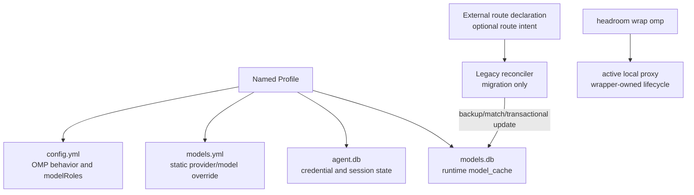

This page answers how route intent, user state, and runtime model cache can avoid contaminating one another after an OMP update, and how a damaged legacy route can be recovered safely. The model is: isolate configuration and authentication with a Named Profile, keep route intent in an external declaration when needed, treat `models.db` `model_cache` as rebuildable derived state, and keep the reconciler as migration evidence rather than a normal `headroom wrap omp` startup step.

## Core mechanism

### 1. Separate intent, user state, and derived state



| Artifact                    | Role                                                            | Safe conclusion                                                 | What must not be inferred                                        |
| --------------------------- | --------------------------------------------------------------- | --------------------------------------------------------------- | ---------------------------------------------------------------- |
| Named Profile               | Isolates a set of OMP config, credentials, history, and cache   | Updating one profile need not contaminate another               | The profile automatically repairs routes or hides credentials    |
| `config.yml`                | User behavior, `modelRoles`, retries, tools, and related intent | It selects roles and runtime controls                           | The selected provider must use a particular base URL             |
| `models.yml`                | Static provider/model override layer                            | It can express an override intent                               | An existing authoritative cache row will certainly be taken over |
| `models.db` / `model_cache` | Runtime derived state after discovery/merge                     | It can be rebuilt and must be checked in the live runtime       | It is a safe long-term hand-editing contract                     |
| External route declaration  | Optional route intent outside the OMP directory                 | It can provide recovery input after an update                   | It can store credentials or replace the provider catalog         |
| Reconciler                  | Controlled recovery tool from the old migration                 | It can back up, match, and transactionally update existing rows | It should run before every normal startup                        |

### 2. Safe recovery chain for the legacy reconciler

Keep this historical flow only in an isolated migration environment:

1. Validate the target profile and external declaration without reading or copying tokens or API keys.
2. Back up the current `models.db`, then match existing cache rows by stable provider identity and API.
3. Fail loudly when no row matches; do not guess an INSERT for a new provider/model or rebuild the entire catalog.
4. Update only declared route fields such as `baseUrl` and dynamic headers; preserve metadata, fingerprint, version, and the `authoritative=1` meaning.
5. Commit in one transaction; roll back on failure and report `changed`, match status, and cache version.
6. Validate the final entry and upstream in a new session; an old process's in-memory config is not recovery proof.

### 3. Current recommended lifecycle

For daily use, let the official `headroom wrap omp` manage the active proxy. During the session, `headroom doctor`, `headroom perf`, and `headroom dashboard` provide observations. After the session, explicitly run `headroom unwrap omp`; use `--no-stop-proxy` only when intentionally keeping the proxy. Legacy systemd units, manual proxy commands, and the reconciler are not the recommended startup chain.

## Applicable conditions

- An OMP update rebuilds `model_cache` while the team still needs auditable route intent.
- Multiple OMP profiles must isolate credentials, session history, and runtime model catalogs.
- A migration must restore an explicit custom provider from a backup without hand-rebuilding OMP's catalog.
- You need to distinguish correct configuration, rebuilt cache, and an actually working proxy.

## Not applicable and risks

| Risk                                        | Misdiagnosis or symptom                                                              | Boundary and response                                                                     |
| ------------------------------------------- | ------------------------------------------------------------------------------------ | ----------------------------------------------------------------------------------------- |
| Treating `models.yml` as a strong override  | A new base URL is written but an authoritative cache still uses the old entry        | Check the live `model_cache` and final upstream for the release; do not promise takeover  |
| Hand-editing `models.db`                    | The process keeps old memory and the next restart rebuilds the change away           | Only do this in isolated migration evidence with a backup and transaction result          |
| Putting the reconciler in normal startup    | Every startup rewrites cache and hides catalog or version changes                    | Use the wrapper daily; limit the reconciler to legacy migration recovery                  |
| Treating `agent.db` as configuration        | Credentials or session state leak into Git, logs, or the external declaration        | Keep profile state private; keep route declarations credential-free and audit permissions |
| Inserting when no row matches               | A provider OMP never discovered is fabricated and later updates become unpredictable | Fail loudly and inspect the current catalog and release first                             |
| Checking only loopback or 200               | Route and recovery are reported as successful without upstream evidence              | Combine proxy inbound/outbound, final URL/WebSocket, and a new-session check              |
| Assuming normal exit cleans route state     | The next session inherits an unexpected loopback or stale headers                    | Explicitly run `headroom unwrap omp` unless intentionally keeping the proxy               |
| Leaving double compression or old overrides | Savings/output anomalies cannot be attributed                                        | Disable context-mode, legacy overrides, and proxy layers one at a time and remeasure      |

## Minimal verification

Minimal observation for the current lifecycle:

```text
Fresh session: headroom wrap omp
  → doctor/perf (proxy availability)
  → L1 inspect profile, models.yml, model_cache
  → L2 send a minimal request for an explicit route
  → L3 inspect proxy logs and final upstream
  → headroom unwrap omp
```

If the legacy reconciler must be tested, use a temporary database copy and non-production credentials: introduce a controlled `baseUrl`/header/authoritative mismatch, then verify backup creation, row restoration, preserved `cache_version`, transactional rollback on failure, and `changed=false` on the second run. This proves reconciler idempotence; it does not prove that the current wrapper runs it automatically.

## Evidence and uncertainty

- **Source facts**: `legacy-omp-headroom-persistence` records Named Profiles, the `config.yml`/`models.yml`/`agent.db`/`models.db` layers, external declarations, the legacy reconciler's backup/match/transaction semantics, and recovery output; `legacy-headroom-single-port-evolution` records single-port and protocol checks; `legacy-omp-config-and-rules-guide` separates role selection, entry routing, and wrapper lifecycle.
- **This page's synthesis**: decoupling route intent from `model_cache`, then separating current-wrapper verification from migration-only reconciler verification, prevents a historical script from becoming a product startup contract.
- **Unconfirmed**: the Named Profile CLI, database schema, authoritative-override rules, when the wrapper writes or clears `models.yml`, process-exit memory behavior, and provider protocol behavior depend on OMP/Headroom versions; cross-version compatibility is not claimed.

## Related pages

- [Headroom single-port synthesis](/en/note/headroom-single-port-evolution)
- [OMP configuration layers](/en/note/omp-config-and-rules-guide)
- [OMP Hook extension](/en/note/omp-hook-extension-guide)
- [LLM wiki pattern](/en/note/llm-wiki-pattern)
