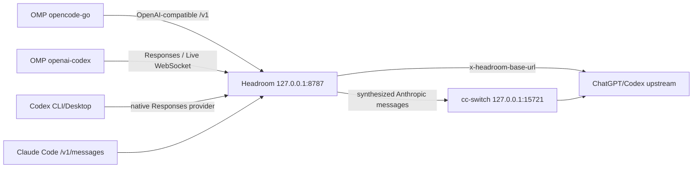

`omp-headroom-provider-proxy` is an external routing controller and Headroom deployment project: it preserves the ownership boundaries of OMP, Codex, and client authentication, does not modify OMP/Headroom source, does not copy credentials or `models.db`, and connects multiple clients to the same loopback Headroom entry through explicit configuration, a systemd user service, state validation, and rollback-safe operations. This page is a `provisional` entity page for the current Headroom 0.34/OMP/Codex environment; implementation sources and runtime evidence are in `sources`.

## What problem it solves

The project separates three easily confused problems:

1. **Entry**: Headroom is managed by `systemd --user` and listens only on `127.0.0.1:8787`.
2. **Routing**: the OMP provider route and the Codex native Responses provider enter Headroom through exact prefix, API, header, and upstream constraints.
3. **Lifecycle**: `bin/omp-routes` and `bin/codex-routes` explicitly own apply/check/restore; starting or stopping a service does not implicitly rewrite user routes.

Headroom is the compression owner; no second application-level compression bridge may be layered on the same request. When Claude Code coexists, cc-switch only performs Anthropic↔OpenAI protocol conversion and credential injection; it does not handle compression.

## Routing topology



| Caller | Entry and responsibility | Facts that must not be inferred from this path |
| --- | --- | --- |
| `opencode-go` | OpenAI-compatible provider route enters the Headroom prefix | Other providers are automatically taken over |
| `openai-codex` | Responses/Live WebSocket enters Headroom; headers select the ChatGPT upstream | model discovery, login, or realtime voice go through the proxy |
| Codex CLI/Desktop | Native provider sharing the user-level `$CODEX_HOME/config.toml` | `HTTP_PROXY`/CONNECT is a necessary solution |
| Claude Code | With `HEADROOM_CC_SWITCH_RECONCILE=1`, passes through Headroom first, then cc-switch conversion | cc-switch handles compression, or the two protocol paths share state |

## Codex native provider

Codex CLI and Desktop share the same user configuration, so the project neither starts another proxy nor impersonates a system-level HTTP proxy. The key provider semantics declared in `config/codex-headroom.toml` are:

- `model_provider = "headroom"`;
- `wire_api = "responses"`;
- `base_url` uses the existing loopback Headroom prefix;
- `requires_openai_auth = true` and `supports_websockets = true` preserve Codex's OAuth/Live WebSocket semantics;
- `x-headroom-base-url = https://chatgpt.com/backend-api` acts as the request-level upstream hint;
- auth files, tokens, and OMP-owned databases stay in their respective owners' user directories and never enter the project.

`bin/codex-routes` is the only real user-config write entry. It maintains a root-safe TOML managed marker and checks target identity, mode, content hash, backup hash, and the state journal before and after apply. `flock`, atomic write/exchange, prepared restore, mode-drift and target-drift checks together guarantee that when the user hand-edits configuration, an external writer, or an abnormal exit occurs, the controller stops rather than guessing and overwriting.

## OMP routing and project persistence

`bin/omp-routes` only explicitly applies/checks/restores the allowed `opencode-go` and `openai-codex` providers; the provider API, the exact loopback prefix, the upstream header, and the path are static contracts. Project state and Headroom workspace/log/savings persistence directories live under the project `var/`, but OMP credentials, `models.db`, and user route ownership are not copied into the project.

Therefore, each of these must be verified separately:

- whether the OMP configuration is correct;
- whether the Headroom service is healthy/ready;
- whether requests actually reach the loopback proxy;
- whether the proxy finally connects to the expected HTTP/WebSocket upstream.

Seeing only client success, `/health`, or HTTP 200 is not enough to prove the compression route is active; proxy inbound/outbound logs and response completion events must be combined.

## Real verification

Current delivery evidence includes:

```text
./bin/validate                  PASS
./bin/headroom-ponytail-check  PASS
./bin/omp-routes check          PASS
./bin/codex-routes check        PASS
systemctl --user ...            active
```

A fresh Codex CLI process returns `CODEX_HEADROOM_CLI_SMOKE_OK`; a fresh Desktop local-thread returns `CODEX_HEADROOM_DESKTOP_SMOKE_OK_2`. Both proxy logs show loopback Responses requests, the ChatGPT OAuth Codex WebSocket, and `response.completed`. This proves the real inference path in the current environment and does not extend into a general compatibility claim for discovery, cloud threads, or voice.

## Rollback

1. Stop all Codex CLI/Desktop writers.
2. Run `./bin/codex-routes restore --force`.
3. Confirm the backup/state hash and target mode with `./bin/codex-routes check`.
4. When you need to re-enable, explicitly `apply` again; do not edit the user configuration directly to bypass the controller.

OMP routes use the corresponding `bin/omp-routes restore`; rolling back the Claude Code/cc-switch coexistence also requires removing the reconciler and `BindPaths=%h/.claude` and restoring the original `ANTHROPIC_BASE_URL`. All rollbacks should first stop the actual writers and keep a backup.

## Version and evidence boundaries

- **Source facts**: pinned project commits, project documentation, controller contracts, isolated lifecycle smoke tests, and fresh CLI/Desktop proxy evidence.
- **This page's synthesis**: combines "single compression owner, native Codex provider, explicit route transactions, real proxy evidence" into a reusable project model.
- **Uncertainty**: provider schema, Desktop configuration reading, log fields, WebSocket behavior, and Headroom/OMP version boundaries may change; the route controller in the current working tree has not yet produced a new public commit, so the commit must be re-pinned and verification rerun before release.

## Related pages

- [Headroom single-port synthesis](/en/note/headroom-single-port-evolution)
- [Headroom route persistence synthesis](/en/note/omp-headroom-persistence)
- [Headroom with cc-switch / Claude Code coexistence](/en/note/headroom-cc-switch-coexistence)
- [Headroom 0.34 compression and retrieval contract](/en/note/headroom-compress-retrieve-contract)
