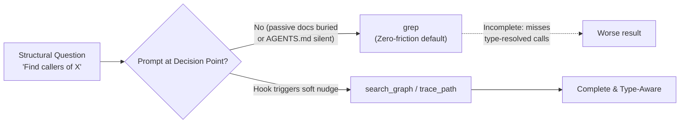
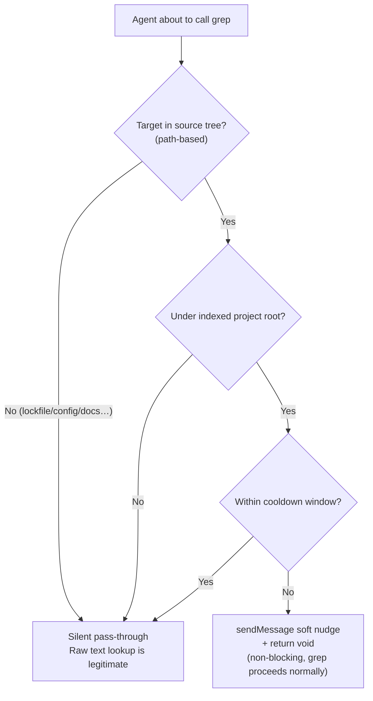

# OMP Hook Extension in Practice: From Decision-Point Soft Nudges to Statusline Integration

OMP (Oh My Pi)'s Extension Hook system provides a powerful extensibility mechanism: developers can inject custom logic at key lifecycle points (`session_start`, `tool_call`, etc.), influence the LLM context via `pi.sendMessage()`, or publish status text through `ctx.ui.setStatus()`. This article walks through two real cases that systematically demonstrate Hook extension diagnosis, design, and verification.

- **Case 1**: A fresh, complete code knowledge graph—strictly superior to grep for structural lookups—was used only 4 times across 30 sessions while grep was invoked 158 times. The problem wasn't indexing but the absence of prompts at the decision point. The fix: a non-blocking `PreToolUse` hook injecting a soft nudge at the grep decision instant.
- **Case 2**: Displaying the GitHub write-gate status on OMP's statusline. The real answer lay scattered across four layers: a rendering channel that was already working but overlooked, a hardcoded segment whitelist, a rejected "false need" workaround, and a five-file upstream patch.

---

## 1. Case 1: Knowledge Graph Over Grep—Decision-Point Soft-Nudge Hook

### 1.1 The Puzzle: Capabilities Ready, Yet Unused

`codebase-memory-mcp` indexes a project into a hybrid LSP knowledge graph. For structural questions—*find definitions, who calls X, what X calls, dead code, module boundaries*—it is strictly faster and more complete than `grep`. The audited project was fully indexed, yet across 30 sessions, the Agent acted as if the graph did not exist:

| Check Item | Result |
| --- | --- |
| Is it indexed? | Yes—**34,361 nodes / 120,215 edges / 82 MB** |
| Is it fresh? | Yes—graph `head_sha` **exactly matched** live `git HEAD`, status `ready` |
| Is it reachable? | Yes—exposed via the `xd://mcp__codebase_memory_mcp_*` device family |

So the question was never "Can the Agent use it?" but **"Why isn't it using it?"**



### 1.2 Data Audit: Real Usage of grep vs. Knowledge Graph

Instrumentation of session transcripts yielded an unambiguous answer:

| Metric | Count |
| --- | --- |
| `grep` invocations | **158** |
| `codebase-memory` invocations | **22** |
| Proportion of **structural** grep (definitions/callers/usages) | **~80% (116–128 times)** |
| Proportion of valid **raw text** grep (lockfiles, i18n, configs, docs) | ~10–15% |
| Sessions using the graph | **4 / 30** |
| Concentration of graph calls in a **single** architecture session | **18 times** |

**Concentration is the key signal.** The graph was only accessed during a deliberate architecture audit and subsequently forgotten in 26 sessions—including major refactoring tasks running 16–28 `grep` calls each for purely structural queries.

### 1.3 Root Cause: Passive Documentation Cannot Defeat Pre-training Priors

Ranking root causes by impact:

1. **Lack of enforcement at decision points (Primary Cause).** Anti-grep requirements existed only as *passive prose* in global `AGENTS.md`, plus an *on-demand* managed skill with no `globs` or `alwaysApply`. The project-level `AGENTS.md`—the one actually read—**never mentioned** codebase-memory.
2. **Tool surface friction (Secondary Cause).** `grep` is a first-class call with a single `pattern` argument. Graph queries required constructing a JSON payload directed to `xd://` devices.
3. **Stale/Unindexed—Excluded** (see table above).

### 1.4 Why "Writing a Better Rule" Fails

- **Rules inject per-turn or per-file-path, not per-tool-call.** An `alwaysApply` rule re-injects every turn—the exact passive prose data proved model tuning ignores.
- **The flaw occurs at the moment of tool decision**, where only a `PreToolUse` hook resides. 26 out of 30 sessions ignored explicit "do not" prose—evidence that "adding more prose" is not an effective intervention.

The correct unit of intervention: *"When the Agent is about to invoke `grep` on the source tree, surface better options—without blocking."*

### 1.5 Solution: A Soft PreToolUse Hook

#### Channel Selection: Soft, Not Hard

OMP's `tool_call` event supports two channels:

| Channel | Mechanism | Effect |
| --- | --- | --- |
| **Hard** (Return Type) | `return { block, reason }` | Blocks invocation; Agent must retry. Risk: false positives blocking valid raw-text `grep`. |
| **Soft** (Side Effect) | `pi.sendMessage({ customType, content, display, attribution })` **+ `return void`** | Injects a message into LLM context; execution continues normally. Zero false-positive risk. |

The soft channel is the non-obvious one. `ToolCallEventResult` is oriented toward blocking, but `pi.sendMessage()` hangs off the base `HookAPI` and can be called from *any* event. Returning `void` means "don't block—continue."

We chose **soft**: it respects "prompting rather than blocking", never interrupting a valid raw-text grep. Worst case is a silent no-op.

#### Detection: Path-Based, Not Pattern-Based

The first predicate required a code file extension or non-empty pattern. Unit tests immediately caught the problem: it flagged only **59** structural greps but *missed 73 that were exactly the anti-pattern*. Correct detection is **path-based**: a `grep` scoped to a source tree is intrinsically a structural signal.

| Predicate Version | Structural Greps Flagged | Verdict |
| --- | --- | --- |
| Require extension or pattern | 59 / 158 | **Bad**—misses directory-scoped lookups |
| **Path points to source tree AND not raw text** | **116 / 158** | Matches manual baseline (~127) |

#### Allowlist

| `grep` Target | Behavior |
| --- | --- |
| `backend-spring/src`, `console/src`, `management/src`, `shared/*/src` | **Nudge** (structural) |
| `**/pnpm-lock.yaml`, `**/*.json/yaml/toml`, `**/*.md`, `migrations/`, `locales/`, `i18n/`, `wiki/`, `dist/build/target/`, `node_modules/`, `.omp/`, `*.log`, `*.css/scss`, `pom.xml`, `docker-compose*`, `tsconfig*`, `vite.config*` | **Silent** (raw text is legitimate) |



### 1.6 Implementation: Hook Code & API Contract

The hook is deployed at `hooks/pre/graph-first-nudge.ts` (OMP auto-loads `hooks/pre/*.ts` at **session start**—not hot-reloaded; new hooks are invisible to running sessions and must be verified in a new session).

```ts
import type { HookAPI } from "@oh-my-pi/pi-coding-agent/extensibility/hooks";

const REMINDER =
  "codebase-memory nudge: this project is indexed in the code knowledge graph. " +
  "For STRUCTURAL lookups — find definition, callers, callees, references, type, " +
  "module/package boundary — use the graph FIRST, then grep only as a raw-text fallback:\n" +
  "  - xd://mcp__codebase_memory_mcp_search_graph    (query or name_pattern -> qualified_name)\n" +
  "  - xd://mcp__codebase_memory_mcp_trace_path       (function_name + direction inbound/outbound)\n" +
  "  - xd://mcp__codebase_memory_mcp_get_architecture (clusters / layers / packages)\n" +
  "Raw-text grep on lockfiles, config, docs, i18n, migrations, logs, or generated output is fine.";

const SOURCE_TREE_RE = /(backend-spring[\\/]src|console[\\/]src|management[\\/]src|shared[\\/].*?[\\/]src)/;
const RAW_TEXT_RE =
  /(lock|\.json|\.yaml|\.yml|\.toml|\.env|\.mdx?|migrations|locales|i18n|wiki|[\\/]dist[\\/]|[\\/]build[\\/]|[\\/]target[\\/]|node_modules|\.omp|sessions|\.log|\.css|\.scss|pom\.xml|docker-compose|tsconfig|vite\.config|\.sh$)/;

let indexedRoots: string[] = [];
let lastNudgeAt = 0;
const COOLDOWN_MS = 10 * 60 * 1000;

function norm(p: string) {
  return p.replace(/\\/g, "/").replace(/^~/, process.env.HOME ?? "~");
}
function isUnderIndexedRoot(cwd: string) {
  const c = norm(cwd);
  return indexedRoots.some(r => { const root = norm(r); return c === root || c.startsWith(root + "/"); });
}
function isStructuralGrep(input: Record<string, unknown>) {
  const path = norm(String(input.path ?? "")), pattern = String(input.pattern ?? "");
  if (!SOURCE_TREE_RE.test(path)) return false;
  if (RAW_TEXT_RE.test(path) || RAW_TEXT_RE.test(pattern)) return false;
  return true;
}

export default function graphFirstNudge(pi: HookAPI) {
  pi.on("session_start", async () => {
    try {
      const res = await pi.exec("codebase-memory-mcp", ["cli", "list_projects"]);
      const roots = [...String(res.stdout ?? "").matchAll(/"root_path"\s*:\s*"([^"]+)"/g)].map(m => m[1]);
      if (roots.length) indexedRoots = roots;
    } catch { /* keep empty list; hook degrades to no-op */ }
  });

  pi.on("tool_call", async (event, ctx) => {
    try {
      if (event.toolName !== "grep") return;
      if (!isStructuralGrep(event.input)) return;
      if (!isUnderIndexedRoot(ctx.cwd)) return;
      if (Date.now() - lastNudgeAt < COOLDOWN_MS) return;
      lastNudgeAt = Date.now();
      pi.sendMessage({
        customType: "graph-first-nudge",
        content: REMINDER, display: true, attribution: "agent",
      });
    } catch { /* never let the nudge break grep */ }
  });
}
```

#### Hook API Contract Reference

| Symbol | Shape | Source |
| --- | --- | --- |
| `ToolCallEvent` | `{ type:"tool_call", toolName, toolCallId, input: Record<string,unknown> }` | `hooks/types.d.ts` |
| `HookContext.cwd` | `string`—project root | `hooks/types.d.ts` |
| `ToolCallEventResult` | `{ block?, reason? }`—**hard** path | `shared-events.d.ts` |
| `HookAPI.sendMessage` | Injects a `CustomMessageEntry` that **participates in LLM context**; `triggerTurn` defaults `false` | `hooks/types.d.ts` |
| Hook location | `hooks/{pre,post}/*.ts` (global) / `.omp/hooks/{pre,post}/*.ts` (project); loaded at session start | `hooks/loader.d.ts` |

### 1.7 Verification: From Probe to Runtime

The fix must be proven at three layers, all required:

```bash
# 1. Premise proof: the graph can instantly return what grep struggles to find
codebase-memory-mcp cli search_graph '{"project":"PROJECT","query":"SomeMapper"}'

# 2. Logic proof: mock-pi self-probe, assert on synthetic events
bun /tmp/graph-first-nudge.probe.mjs   # Expected: 6/6 PASS

# 3. Runtime proof: in a fresh session, grep the source tree, confirm nudge renders and grep still returns
```

1. **mock-pi self-probe**—Import factory function, register handlers on a mock `pi`, fire six synthetic `tool_call` events. Result: **6 / 6 passed**.
2. **Premise proof**—Calling `search_graph` on a Mapper symbol instantly returns **106** qualified results with file and line ranges.
3. **Live run test**—In a brand-new session, running `grep class.*Service` on `backend-spring/src` triggers the hook: the `graph-first-nudge` block renders, **and** full grep results follow below—non-blocking confirmed end-to-end.

---

## 2. Case 2: Bringing Hook Status to the OMP Top Bar

OMP's extension hooks can publish status text via `ctx.ui.setStatus(key, text)`. My `github-write-gate` hook (a hard gate intercepting write operations like `git push` and `gh pr create`) publishes `GH-gate armed · blocks git push / gh pr / API writes` during `session_start`. The requirement: **display it on the statusline**.

### 2.1 The Misdiagnosis: Status Was Already Rendering

The initial assumption was that `setStatus` failed. However, source tracing (`runner.ts` → `extension-ui-controller.ts` → `component.ts`'s `#hookStatuses` map) proved the data flow was intact. The actual rendering target was a **standalone line above the editor**, gated by `statusLine.showHookStatus` (default `true`)—not the top statusline border the user expected.

#### Methodology: Headless tmux In Lieu of Manual Screenshots

TUI rendering verification traditionally relies on human screenshots. We used a fully scriptable alternative:

```bash
tmux new-session -d -s probe -x 220 -y 50 'omp' && sleep 25 \
  && tmux capture-pane -t probe -p | grep -n 'GH-gate'
tmux kill-session -t probe
```

- `-d` detached with fixed 220×50 dimensions ensures reproducible layout rendering.
- `capture-pane -p` outputs plain text frames; `grep -n` pinpoints the exact line number to distinguish top border versus standalone line.
- Environment variable prefixes (`OMPGATE_OFF=1`) cover bypass branches.

### 2.2 The Dead-End: Top Border Segment Union is Closed

While `statusLine.leftSegments/rightSegments` appear configurable, schema-level `StatusLineSegmentId` is a **closed union of 24 items** with no slot for `hook`.

**Conclusion: Pure configuration cannot inject hook status into the top border.** The value of identifying dead-ends is止损—stopping further investment in config.

### 2.3 Rejected Workaround: Hijacking `session_name`

Investigation revealed `setSessionName()` in the extension API, and the default preset's `rightSegments` includes `session_name`. A probe confirmed writing session name rendered it on the far right of the top border.

However, this workaround was rejected for three reasons:

1. **Polluting the resume picker**—session selection menus would display gate status strings.
2. **Racing with auto-naming**—writing at `session_start` overrides user provenance.
3. **Redundancy**—the standalone line was already displaying the same information.

Lesson: **After proving "it can be done", still ask "is it worth it".** The 30-second probe avoided full investment in the wrong direction.

### 2.4 The Proper Fix: An Upstream `hook` Segment

Since the union was closed, the proper fix was to open it. The patch spanned 10 files (5 source + 5 test fixtures):

| File | Change |
|---|---|
| `settings-schema.ts` | Added `"hook"` to the union |
| `types.ts` | Injected `hookStatuses: ReadonlyMap<string, string>` into `SegmentContext`; added `hook.maxLength` to `StatusLineSegmentOptions` |
| `component.ts` | `#buildSegmentContext` unconditionally injects existing `#hookStatuses` map |
| `segments.ts` | New `hookSegment`: sorted keys, dot-delimited, muted styling, default 32-char truncation; `visible: false` when map is empty |
| `presets.ts` | Added `"hook"` to default preset's `rightSegments` |

Any hook that writes `setStatus` (gate, RTK, future ones) automatically gets border display with zero hook-side changes.

#### Boundary Discovery 1: Border Budget Eats Its Own First

Switching to daily directories (border with long branch names + PR IDs), the new segment **disappeared**. The border builder omits segments from the right when space is constrained.

The fix: **make the segment compact enough**—`segmentOptions.hook.maxLength` (default 32). The 53-character gate status truncated to `GH-gate armed · blocks git push…` renders stably under full 220-column layout load. Full text remains on the standalone line—**short text goes to border, long text stays on standalone line**, each serving its purpose.

#### Boundary Discovery 2: Two Channels Should Decouple Their Gates

The initial design had both border segment and standalone line gated by `showHookStatus`. A user requesting "no standalone line" exposed the coupling error. After decoupling:

- `showHookStatus: true` (default): both channels coexist.
- `showHookStatus: false`: **border only**—the target form.

#### Verification Stack

`biome check` ✅ → `tsgo --noEmit` ✅ → 55/55 unit tests (including 7 new hookSegment cases) ✅ → tmux four-quadrant runtime verification ✅ → `git fetch` confirms 0-behind ✅ → clean worktree `git am` confirms applicability ✅.

### 2.5 Installation & Rollback Pitfall

Local installation uses PATH replacement strategy. Rollback seems like one command, but there's a trap: border-only mode sets `showHookStatus` to `false`, and stock OMP has no border segment—rolling back only the binary causes **total status loss**. Correct rollback requires two commands:

```bash
mv -f ~/.local/bin/omp.stock ~/.local/bin/omp
omp config set statusLine.showHookStatus true
```

**Configuration changes create conditions for "reversible operations" to lose reversibility**—rollback checklists must cover the configuration layer, not just the file layer.

---

## 3. Hook Development Methodology & Lessons Learned

The two cases span different Hook events and channels, but the methodology they produce is highly consistent.

### 3.1 Unit of Intervention: Act Where Decisions Happen

- **Capability ≠ Activation.** A better, fresh, reachable tool is worthless if nothing cues it at the decision moment. Measure *usage rate*, not *availability*.
- **Decision-point hooks beat passive documentation.** When the model's pre-training prior points one way, prose—even "prohibited" prose—can't hold (26 / 30 sessions). Put the cue where the decision happens.
- **Falsify "it's not working" before building.** Case 2 spent half its time confirming "it was actually working, just not where you thought."

### 3.2 Channel Selection: Prefer Soft

- **Unless you need teeth, prefer the soft channel.** `sendMessage` + `return void` guides without ever risking false-positive blocking. Only reach for `{block, reason}` when a wrong call is truly unrecoverable.
- **Make hooks fail-soft.** All hook code wraps in `try/catch`; worst case is silent degradation, never blocking normal tool flow.

### 3.3 Detection Design: Judge on Stable Signals

- **Detect on stable signals.** For "is this `grep` structural?", the stable signal is *path scope*, not pattern text or file extension.
- **Probe to verify feasibility, deliberate to decide.** The session_name workaround was proven in 30 seconds and rejected in three minutes.

### 3.4 Verification Strategy: Multi-Layer Proof, Real Conditions

- **Verify by execution first, then by runtime.** Mock-pi probes prove logic; only real sessions prove loading and delivery.
- **Boundary discoveries come from real conditions, not ideal ones.** Budget truncation and gate coupling—both critical issues—only surfaced under "daily directory + full-load border + real user preferences."
- **Re-run after any change in verification tool consumption scope.** Don't skip just because "it was green last time."

> This pattern is not limited to these specific cases. Any scenario where "the model has a stronger tool but keeps defaulting to a weaker one," or where "Hook status needs visibility," can be addressed with the same OMP Hook extension framework. The unit of intervention is always *the moment the decision happens*; the key to visibility is always *the line the user actually looks at*.
