## 1. Problem Background: Why Can't Endpoint Plugin Management Simply Be "Send a Task"?

In security, monitoring, operations, and data collection scenarios, endpoints typically run multiple plugins. For example:

- Security scanning plugins
- Behavior monitoring plugins
- Log collection plugins
- Network probing plugins
- Kernel-level protection plugins
- Rule execution plugins

These plugins are not one-time installations that end there. They require long-running operation, continuous upgrades, rule updates, anomaly recovery, and state tracking.

When the endpoint scale grows from thousands to millions or even tens of millions, plugin lifecycle management becomes a classic distributed control plane problem.

The difficulty is not "can we send an install command," but rather:

1. How to handle high-frequency heartbeats from massive numbers of endpoints?
2. How to avoid duplicate installations and upgrades caused by network jitter?
3. How to prevent an erroneous plugin from being deployed to all endpoints, causing large-scale crashes?
4. How to identify incompatible environments such as containers, lack of kernel privileges, and special OSes?
5. How to ensure eventual consistency of state, commands, and receipts?
6. How to maintain low latency and high reliability under high concurrency?

This article designs a plugin lifecycle management system for millions or tens of millions of endpoints.

---

## 2. Core Business Objectives

The system needs to manage the plugin lifecycle on distributed endpoints, covering the following capabilities:

| Lifecycle Stage | Core Objective | Typical Action |
| :--- | :--- | :--- |
| Keep-alive | Determine if a plugin is online | Heartbeat reporting, state refresh, timeout offline |
| Installation | Install a specified plugin on an endpoint | Canary check, environment filtering, send install command |
| Upgrade | Upgrade a plugin to a target version | Version comparison, idempotent dispatch, failure circuit breaker |
| Uninstallation | Remove a plugin from an endpoint | Uninstallation canary, receipt confirmation, set state to offline |
| Rule Push | Update plugin runtime rules | Rule generation, channel push, result confirmation |
| Receipt Closure | Track execution results | Success recording, failure statistics, blocking policy |

The overall objective can be summarized in one sentence:

> Under massive endpoint conditions, safely, stably, and with low latency complete plugin state awareness, command dispatch, and result closure.

---

## 3. System Design Principles

In a large-scale endpoint control system, the following design principles should be prioritized.

### 1. Build Defenses First, Then Business Logic

Plugin installation, upgrade, and uninstallation are not ordinary business operations. Kernel-level plugins in particular, once they encounter compatibility issues, can cause endpoint blue screens, crashes, loss of connectivity, or business disruption.

Therefore, the system should prioritize implementing:

- Canary release
- Automatic circuit breaking
- Distributed lock deduplication
- OS blacklist
- Special environment filtering
- High-risk plugin secondary verification

You cannot first build a "deploy to all" version and then add stability capabilities later.

### 2. Decouple Heartbeats from Commands

Endpoint heartbeats are a high-frequency link that must be lightweight, fast, and discardable.

Heartbeat processing should not synchronously wait for installation, upgrade, or uninstallation results. It should only be responsible for:

- Receiving plugin state
- Refreshing online status
- Generating pending actions
- Triggering async dispatch

The actual command dispatch, execution results, and failure retries should go through an independent link.

### 3. Eventual Consistency of State, Not Strong Consistency

Endpoint network environments are complex and may experience:

- Network disconnection
- Reboots
- Proxy anomalies
- Heartbeat delays
- Lost receipts
- Duplicate reports
- Version state lag

The system should not pursue strong consistency at every second, but should achieve eventual consistency through heartbeats, receipts, periodic compensation, and state machine constraints.

### 4. High-Frequency Links Can Degrade, Dangerous Links Must Block

Losing some heartbeats is acceptable, but deploying an erroneous plugin to all endpoints is not.

Therefore:

- The heartbeat link can be rate-limited, discarded, or downsampled.
- The install/upgrade link must use canary release, circuit breaking, idempotency, and deduplication.
- Kernel-level plugins must have stricter release gates than ordinary plugins.

---

## 4. Overall Architecture Design

The system can be divided into five layers:

1. Endpoint-side Agent
2. Ingestion and Dispatch Layer
3. Core Logic and Stability Defense Layer
4. Command Dispatch Layer
5. Receipt and Background Governance Layer

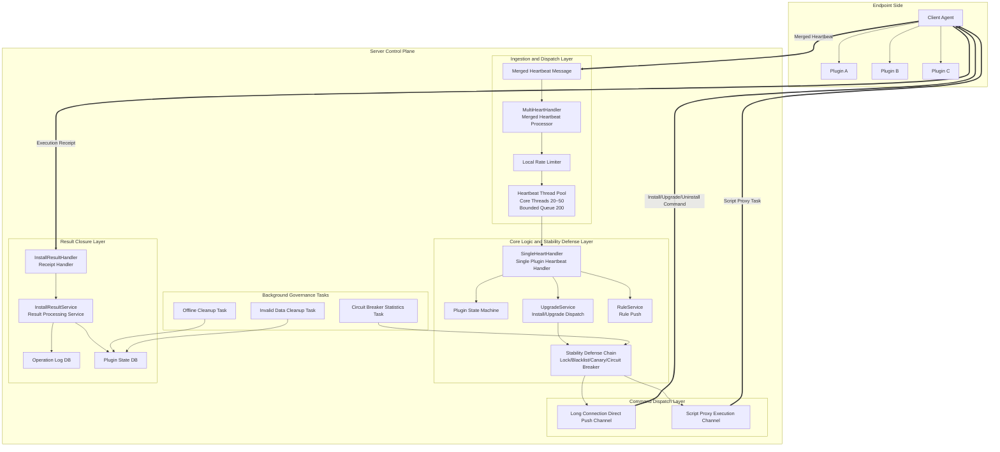

---

## 5. Core Data Model Design

### 1. Endpoint Table

Records basic information about endpoints.

| Field | Description |
| :--- | :--- |
| `uuid` | Endpoint unique identifier |
| `ip` | Endpoint IP |
| `hostname` | Hostname |
| `os_type` | Operating system type |
| `os_version` | Operating system version |
| `arch` | CPU architecture |
| `env_type` | Environment type, e.g., physical machine, virtual machine, container |
| `last_heartbeat_time` | Last heartbeat time |
| `status` | Endpoint status |

### 2. Plugin State Table

Records the running state of a specific plugin on a specific endpoint.

| Field | Description |
| :--- | :--- |
| `uuid` | Endpoint UUID |
| `plugin_code` | Plugin code |
| `plugin_version` | Current version |
| `target_version` | Target version |
| `status` | Plugin status |
| `last_heartbeat_time` | Last plugin heartbeat time |
| `last_op_time` | Last operation time |
| `uninstall_flag` | Whether marked for uninstallation |
| `fail_count` | Consecutive failure count |
| `updated_at` | Update time |

### 3. Operation Log Table

Records actions such as installation, upgrade, uninstallation, and rule push.

| Field | Description |
| :--- | :--- |
| `cmd_id` | Command ID |
| `uuid` | Endpoint UUID |
| `plugin_code` | Plugin code |
| `op_type` | Operation type |
| `target_version` | Target version |
| `status` | Execution status |
| `error_code` | Error code |
| `error_msg` | Error message |
| `created_at` | Creation time |
| `finished_at` | Completion time |

---

## 6. Plugin State Machine Design

The plugin lifecycle should not be expressed with a simple `Online/Offline` field, or subsequent installation, upgrade, uninstallation, and failure retry logic will become chaotic.

It is recommended to design an explicit state machine.

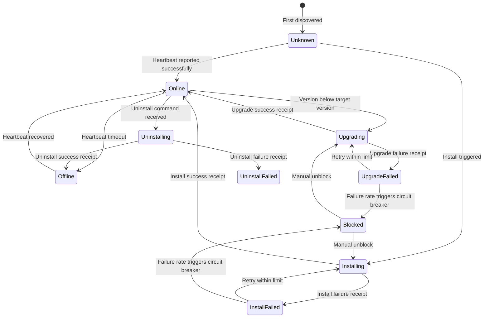

### State Descriptions

| State | Meaning |
| :--- | :--- |
| `Unknown` | First discovered, real plugin state not yet confirmed |
| `Online` | Plugin is online with normal heartbeats |
| `Offline` | No heartbeat within timeout, logically offline |
| `Installing` | Install command dispatched, awaiting receipt |
| `Upgrading` | Upgrade command dispatched, awaiting receipt |
| `Uninstalling` | Uninstall command dispatched, awaiting receipt |
| `InstallFailed` | Installation failed |
| `UpgradeFailed` | Upgrade failed |
| `UninstallFailed` | Uninstallation failed |
| `Blocked` | Circuit-broken or manually blocked |

---

## 7. Merged Heartbeat Design: The First Line of Performance Defense

### 1. Why Merge Heartbeats?

If an endpoint has 10 plugins and each reports its heartbeat separately, then:

```text
1 million endpoints x 10 plugins x 1 per minute = 10 million requests per minute
```

This significantly increases:

- Network IO
- Server connection pressure
- Gateway QPS
- Database write pressure
- Log volume
- Thread context switching

A more reasonable approach is for the endpoint Agent to aggregate multiple plugin states and report them in a single request.

```json
{
  "uuid": "client-001",
  "ip": "10.1.2.3",
  "osType": "linux",
  "osVersion": "5.15.0",
  "envType": "host",
  "plugins": [
    {
      "pluginCode": "security-agent",
      "version": "1.2.0",
      "status": "running",
      "lastError": null
    },
    {
      "pluginCode": "log-agent",
      "version": "2.0.1",
      "status": "running",
      "lastError": null
    }
  ]
}
```

### 2. Merged Heartbeat Processing Flow

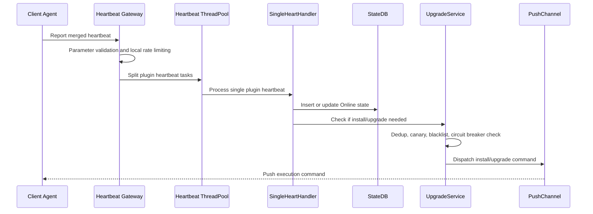

### 3. Heartbeat Thread Pool Recommendations

Heartbeats are high-frequency traffic. You cannot create unlimited threads or allow unbounded queue growth.

Recommendations:

| Parameter | Recommended Value | Description |
| :--- | :--- | :--- |
| Core thread count | 20~50 | Adjust based on CPU cores, business latency, deployment scale |
| Max thread count | 50~100 | Prevent burst traffic from overwhelming the node |
| Queue length | 200~1000 | Must be bounded to prevent OOM |
| Rejection policy | Rate limit/Discard/Degrade | Heartbeats can be discarded; cannot drag down the main service |
| Timeout | Short timeout | Prevent slow tasks from filling the thread pool |

Example pseudocode:

```java
ThreadPoolExecutor heartbeatExecutor = new ThreadPoolExecutor(
    20,
    50,
    60,
    TimeUnit.SECONDS,
    new ArrayBlockingQueue<>(200),
    new ThreadPoolExecutor.DiscardPolicy()
);
```

Using a bounded queue here is critical. If heartbeat tasks accumulate without limit, they will eventually bring down the entire service node.

---

## 8. Deduplication Dispatch Design: Avoiding Duplicate Installations and Concurrency Conflicts

In real network environments, endpoints may trigger duplicate installations for the following reasons:

- Duplicate heartbeat reports
- Network retries
- Server-side duplicate consumption
- Multiple nodes concurrently processing the same endpoint
- Receipt delays causing state to not update in time
- User repeatedly clicking the upgrade button

Therefore, installation/upgrade must have idempotency and deduplication capabilities.

### 1. Deduplication Key Design

It is recommended to use endpoint, plugin, operation type, and target version as the deduplication dimensions.

```text
plugin:op:lock:{uuid}:{pluginCode}:{opType}:{targetVersion}
```

Example:

```text
plugin:op:lock:client-001:security-agent:upgrade:1.3.0
```

### 2. Deduplication Flow

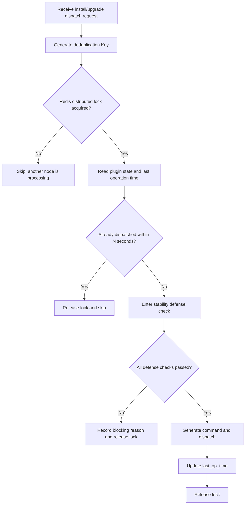

### 3. Dual-Layer Protection

Relying solely on Redis locks is not enough. It is recommended to use two layers of deduplication:

1. Redis distributed lock: Prevents concurrent processing across multiple nodes.
2. Database timestamp validation: Prevents lock expiration, duplicate consumption, and abnormal retries.

Pseudocode:

```java
String lockKey = buildLockKey(uuid, pluginCode, opType, targetVersion);

boolean locked = redis.tryLock(lockKey, 30, TimeUnit.SECONDS);
if (!locked) {
    return DispatchResult.skipped("duplicate operation");
}

try {
    PluginState state = pluginStateRepository.get(uuid, pluginCode);

    if (state.getLastOpTime() != null &&
        Duration.between(state.getLastOpTime(), now()).getSeconds() < 60) {
        return DispatchResult.skipped("operation too frequent");
    }

    DefenseResult defenseResult = defenseChain.check(context);
    if (!defenseResult.isAllowed()) {
        return DispatchResult.blocked(defenseResult.getReason());
    }

    pushCommand(context);
    pluginStateRepository.updateLastOpTime(uuid, pluginCode, now());

    return DispatchResult.success();
} finally {
    redis.unlock(lockKey);
}
```

---

## 9. Stability Defense Design

Plugin deployment is a high-risk action. It is recommended to abstract all stability checks into a defense chain.

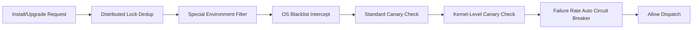

### 1. Special Environment Filtering

Some endpoint environments are inherently unsuitable for installing certain plugins. For example:

| Environment | Risk |
| :--- | :--- |
| Container environment | No complete systemd, no kernel module privileges, restricted filesystem |
| No root privilege environment | Cannot install drivers or system services |
| Read-only filesystem | Cannot write plugin files |
| Serverless environment | Short lifecycle, unsuitable for resident plugins |
| Security-hardened environment | Script execution may be intercepted |

It is recommended to maintain a plugin whitelist.

```text
container_env_allowed_plugins = [
  "log-collector",
  "metrics-agent"
]
```

If an endpoint is in a container environment, non-whitelisted plugins should skip installation and keep-alive logic entirely.

### 2. OS Incompatibility Blacklist

When a certain OS explicitly does not support a plugin, the system should not repeatedly attempt installation on every heartbeat.

It is recommended to write to a distributed cache blacklist.

```text
plugin:os:blacklist:{pluginCode}:{osType}:{osVersion}:{arch}
```

The expiration time should be set to 7 days or longer.

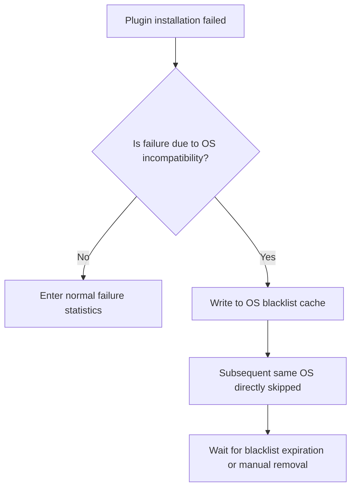

### 3. Canary Release Control

Canary release is a core capability of plugin lifecycle management.

Common canary dimensions include:

| Canary Dimension | Description |
| :--- | :--- |
| UUID whitelist | Designate specific endpoints for early testing |
| IP range | Canary by network segment |
| Region | Canary by data center, city, or area |
| Organization | Canary by tenant, department, or business line |
| Percentage | Roll out by hash percentage |
| OS type | Release only to specified OS |
| Plugin version | Upgrade from specified version to target version |

For percentage-based canary, it is recommended to use stable hashing to ensure consistent results for the same endpoint across multiple evaluations.

```java
int bucket = Math.abs(uuid.hashCode()) % 100;
boolean allowed = bucket < grayPercent;
```

### 4. Kernel-Level Plugin High-Risk Canary

Kernel-level plugins, driver plugins, and system hook plugins must be treated differently from ordinary plugins.

When an ordinary plugin fails, the consequence may only be unavailable functionality.

When a kernel-level plugin fails, it can cause:

- System crash
- Network disconnection
- Inability to boot
- Large-scale endpoint loss of connectivity

Therefore, kernel-level plugins should have separate canary strategies.

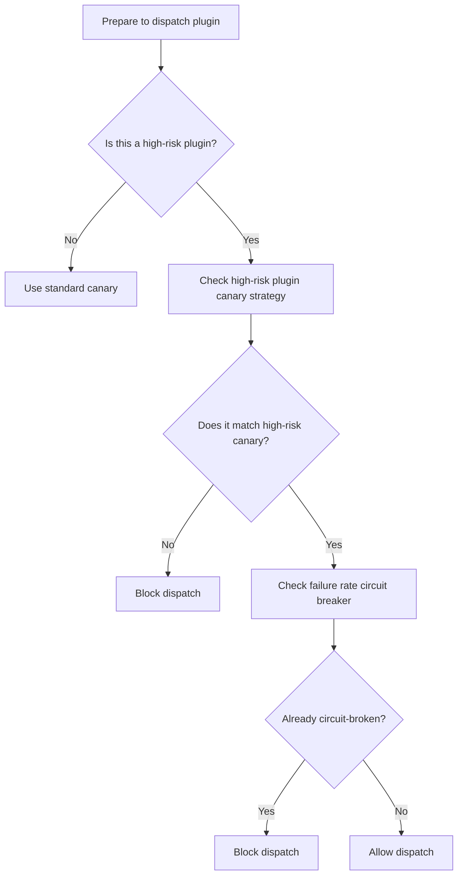

### 5. Automatic Circuit Breaking

If a plugin version has an excessively high failure rate within a short period, the system must automatically stop further deployments.

It is recommended to track failure rates by plugin, version, operation type, and OS dimension.

```text
plugin:breaker:{pluginCode}:{version}:{opType}:{osType}
```

Circuit breaker rule examples:

| Metric | Threshold |
| :--- | :--- |
| Sample size | Install count in last 5 minutes >= 100 |
| Failure rate | Failure rate >= 20% |
| Consecutive failures | Consecutive failures >= 30 |
| Critical error | Kernel crash type error triggers immediate block |

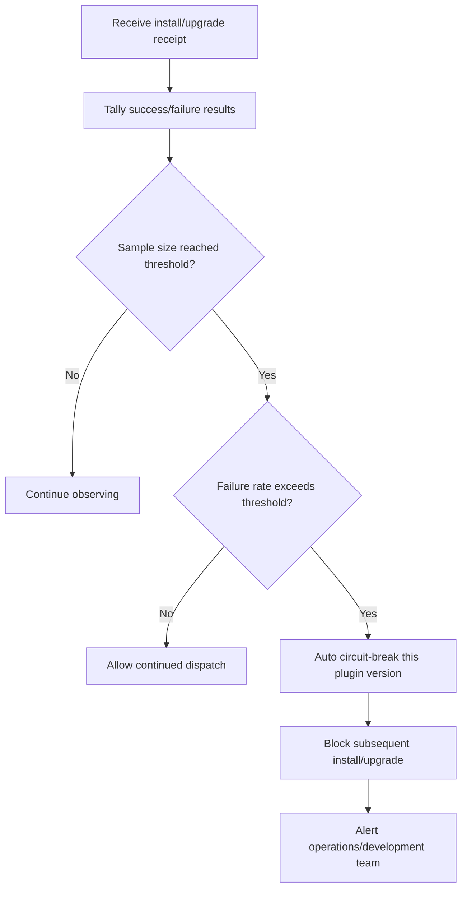

---

## 10. Command Dispatch Design: Dual-Channel Push

Different plugins have different execution methods. It is recommended to use dual-channel dispatch.

| Channel | Suitable Scenarios | Characteristics |
| :--- | :--- | :--- |
| Long connection direct push | Lightweight commands, script plugins, rule updates | Low latency, suitable for real-time push |
| Script proxy execution | Heavy installation, hybrid cloud proxy, complex commands | Highly controllable, suitable for complex operations |

### 1. Long Connection Direct Push

Suitable for:

- Python script plugins
- Rule updates
- Lightweight restarts
- Configuration refresh
- Status queries

Advantages:

- Low latency
- Short link path
- Good real-time performance

Disadvantages:

- Depends on long connection stability
- Not suitable for complex installation flows

### 2. Script Proxy Execution

Suitable for:

- Large plugin installations
- Multi-step upgrades
- Hybrid cloud environments
- Scenarios requiring file download, hash verification, and script execution

Advantages:

- Supports complex flows
- Easy to audit
- Unified execution environment

Disadvantages:

- Longer link path
- Higher latency
- Requires additional proxy capability

---

## 11. Receipt Closure Design

Command dispatch is not the end. Only when the endpoint receipt is received does the result enter closure.

### 1. Receipt Types

| Receipt Type | Description |
| :--- | :--- |
| Install success | Update plugin version and state |
| Install failure | Record failure reason, enter failure statistics |
| Upgrade success | Update current version |
| Upgrade failure | Record failure reason, may trigger circuit breaker |
| Uninstall success | Set state to Offline or Removed |
| Uninstall failure | Record failure reason, await retry or manual handling |
| Rule push success | Update rule version |
| Rule push failure | Record failure reason, await retry |

### 2. Receipt Processing Flow

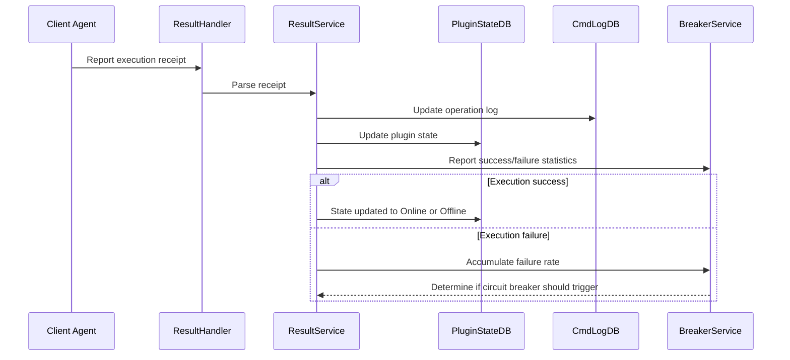

---

## 12. Offline Cleanup Design

Endpoint plugin state cannot grow indefinitely. Background tasks are needed for governance.

It is recommended to use a two-step cleanup:

1. Logical offline: No heartbeat within timeout, first mark as `Offline`.
2. Physical deletion: After being offline beyond the retention period, delete invalid records.

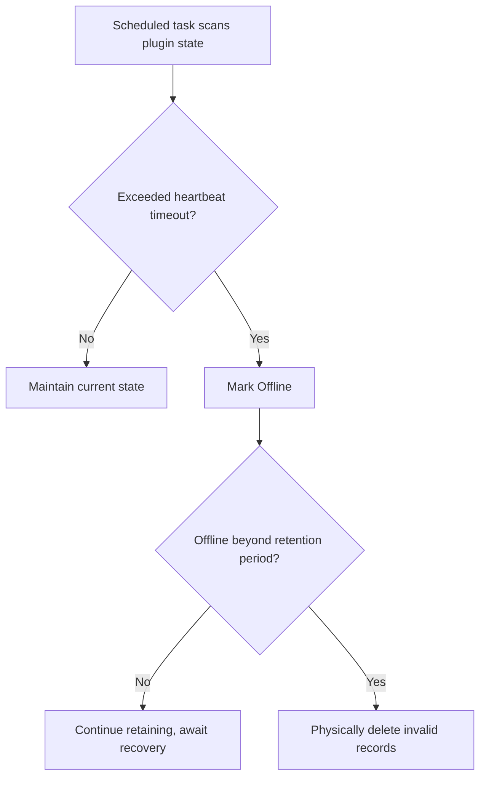

Recommended configuration:

| Item | Recommended Value |
| :--- | :--- |
| Heartbeat interval | 30 seconds ~ 60 seconds |
| Offline determination | Exceeds 3 heartbeat intervals |
| Logical offline retention | 7 days |
| Physical deletion cycle | Daily during off-peak hours |
| Deletion method | Batch paginated deletion, avoid large transactions |

---

## 13. High Concurrency and Capacity Design

### 1. QPS Estimation

Assumptions:

- Endpoint count: 1 million
- Heartbeat interval per endpoint: 60 seconds
- Each heartbeat merges 10 plugin states

Then the heartbeat QPS is approximately:

```text
1,000,000 / 60 ≈ 16,667 QPS
```

Without merged heartbeats:

```text
1,000,000 × 10 / 60 ≈ 166,667 QPS
```

Merged heartbeats can reduce request volume by approximately 10x.

### 2. Write Pressure Optimization

Plugin state updates are high-frequency write operations. Writing to the database in full on every heartbeat should be avoided.

Available optimization strategies:

| Strategy | Description |
| :--- | :--- |
| Redis buffer | Write heartbeat to cache first, then batch persist to DB |
| State-change-only writes | Only write to DB when state, version, or error code changes |
| Time window merge | Only update DB once per plugin within N seconds |
| Sharding | Shard by UUID hash |
| Batch writes | Background batch upsert |
| Hot-cold separation | Online state via cache, historical state to database |

### 3. Recommended Data Path

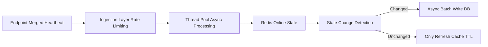

---

## 14. Rule Push Design

Rule push is different from plugin installation.

Plugin installation is typically a low-frequency, high-risk action. Rule push is typically a medium-frequency action, but it can also affect business stability.

Rule push should support:

- Rule version number
- Rule canary release
- Rule rollback
- Rule signature verification
- Rule compatibility check
- Rule push receipt
- Rule effective state confirmation

Rule push flow:

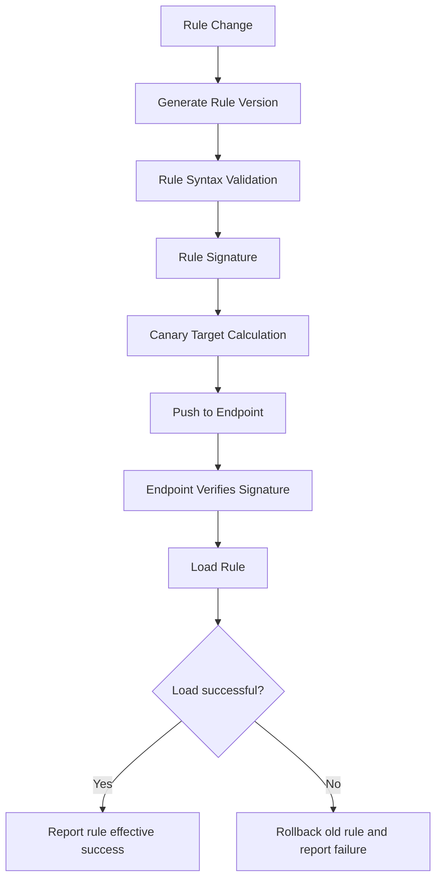

---

## 15. Anomaly Scenarios and Response Strategies

| Anomaly Scenario | Risk | Response Strategy |
| :--- | :--- | :--- |
| Heartbeat surge | Service nodes overwhelmed | Local rate limiting, bounded queue, discard policy |
| Duplicate heartbeats | Duplicate install/upgrade | Redis lock + last_op_time |
| Lost receipts | State inconsistency | Heartbeat compensation + periodic reconciliation |
| Plugin install failure | Functionality unavailable | Failure retry + circuit breaker |
| OS incompatibility | Repeated failures | OS blacklist cache |
| Container environment unsupported | Installation anomaly | Environment detection + whitelist |
| Canary strategy error | Excessive rollout scope | Percentage cap + manual approval |
| Kernel plugin anomaly | Endpoint crash | High-risk canary + failure rate circuit breaker |
| Excessive DB writes | DB pressure too high | Redis buffer + batch persistence |
| Duplicate command execution | Endpoint state chaos | cmd_id idempotency + operation state machine |

---

## 16. Core Link Pseudocode

### 1. Merged Heartbeat Entry Point

```java
public void handleMultiHeartbeat(MultiHeartbeatReq req) {
    if (!rateLimiter.tryAcquire()) {
        return;
    }

    validateClient(req);

    for (PluginHeartbeat plugin : req.getPlugins()) {
        HeartbeatTask task = new HeartbeatTask(req.getClientInfo(), plugin);

        try {
            heartbeatExecutor.execute(task);
        } catch (RejectedExecutionException ex) {
            log.warn("heartbeat task rejected, uuid={}, plugin={}",
                    req.getUuid(), plugin.getPluginCode());
        }
    }
}
```

### 2. Single Plugin Heartbeat Handler

```java
public void handleSingleHeartbeat(ClientInfo client, PluginHeartbeat plugin) {
    checkParam(client, plugin);

    if (checkUninstallMarked(client.getUuid(), plugin.getPluginCode())) {
        return;
    }

    pluginStateService.insertOrUpdateOnline(
        client.getUuid(),
        plugin.getPluginCode(),
        plugin.getVersion()
    );

    if (needUpgrade(client, plugin)) {
        upgradeService.dispatchUpgrade(client, plugin);
    }

    if (needPushRule(client, plugin)) {
        ruleService.pushRule(client, plugin);
    }
}
```

### 3. Install/Upgrade Dispatch

```java
public DispatchResult dispatchUpgrade(ClientInfo client, PluginHeartbeat plugin) {
    DispatchContext context = buildContext(client, plugin);

    String lockKey = buildLockKey(context);
    boolean locked = redisLock.tryLock(lockKey, 30, TimeUnit.SECONDS);

    if (!locked) {
        return DispatchResult.skipped("duplicate dispatch");
    }

    try {
        if (recentlyDispatched(context)) {
            return DispatchResult.skipped("dispatch too frequent");
        }

        DefenseResult defense = defenseChain.check(context);
        if (!defense.isAllowed()) {
            return DispatchResult.blocked(defense.getReason());
        }

        Command command = commandService.createInstallCommand(context);
        pushService.push(command);

        pluginStateService.updateLastOpTime(context);

        return DispatchResult.success();
    } finally {
        redisLock.unlock(lockKey);
    }
}
```

### 4. Stability Defense Chain

```java
public DefenseResult check(DispatchContext context) {
    List<DefenseChecker> checkers = List.of(
        duplicateChecker,
        envWhiteListChecker,
        osBlackListChecker,
        grayReleaseChecker,
        kernelGrayChecker,
        autoBreakerChecker
    );

    for (DefenseChecker checker : checkers) {
        DefenseResult result = checker.check(context);
        if (!result.isAllowed()) {
            return result;
        }
    }

    return DefenseResult.allowed();
}
```

---

## 17. Observability Design

A large-scale endpoint system must have comprehensive observability capabilities.

### 1. Core Metrics

| Metric | Description |
| :--- | :--- |
| Heartbeat QPS | Ingestion layer pressure |
| Heartbeat rejections | Rate limiting and queue full conditions |
| Plugin online count | Plugin running scale |
| Plugin offline count | Anomaly trend |
| Install success rate | Installation quality |
| Upgrade success rate | Upgrade quality |
| Uninstall success rate | Uninstallation quality |
| Command dispatch latency | Control plane real-time performance |
| Receipt latency | Endpoint execution time |
| Circuit breaker triggers | Stability risk |
| Blacklist hit count | Compatibility issues |
| Canary hit count | Release scope |

### 2. Alert Recommendations

| Alert Item | Recommended Rule |
| :--- | :--- |
| Heartbeat QPS surge | Increase exceeds 100% within 5 minutes |
| Heartbeat rejection rate too high | Rejection rate exceeds 5% |
| Plugin failure rate too high | Failure rate exceeds 20% in last 5 minutes |
| Kernel plugin failure | Alert immediately on critical error |
| Receipt latency too high | P95 exceeds 5 minutes |
| Offline count surge | Sudden increase in offline count for a plugin |
| Circuit breaker triggered | Notify immediately when any plugin version triggers circuit breaker |

---

## 18. System Implementation Priority

If building from scratch, it is not recommended to build everything at once. Instead, implement incrementally by priority.

### Phase 1: Core Closure

Must implement first:

1. Merged heartbeats
2. Plugin state table
3. Install/upgrade/uninstall commands
4. Receipt processing
5. Basic state machine
6. Operation logs

Goal: The system can run through the complete lifecycle.

### Phase 2: Stability Defense

Must add as early as possible:

1. Redis distributed lock deduplication
2. last_op_time timestamp deduplication
3. Canary release
4. OS blacklist
5. Automatic circuit breaking
6. Special environment filtering

Goal: The system will not cause large-scale incidents from erroneous commands.

### Phase 3: High Concurrency Optimization

Continue to enhance:

1. Local rate limiting
2. Bounded thread pool
3. Redis online state cache
4. Batch persistence
5. Sharding
6. Async queue peak shaving

Goal: Support million-level/ten-million-level endpoint scale.

### Phase 4: Governance and Observability

Final refinements:

1. Metric monitoring
2. Alert strategies
3. Offline cleanup
4. Failure statistics
5. Canary dashboard
6. Plugin version dashboard
7. Manual blocking and unblocking

Goal: Make the system operable, troubleshootable, and sustainably evolvable.

---

## 19. Complete Link Summary

The final system link is as follows:

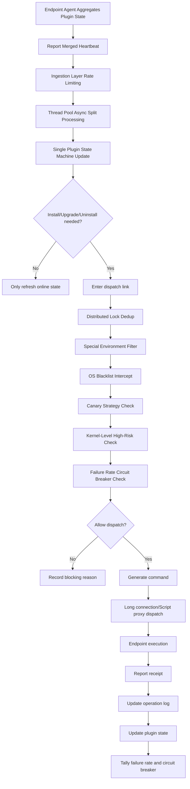

---

## 20. Conclusion

A plugin lifecycle management system for millions or tens of millions of endpoints is essentially not a simple task dispatch system, but a high-concurrency, high-reliability, risk-controlled distributed control plane system.

Its key design points include:

1. **Merged heartbeats**: Reduce request volume, the foundation of performance.
2. **Thread pool and rate limiting**: Protect service nodes, prevent burst traffic from overwhelming the system.
3. **State machine**: Make the plugin lifecycle controllable and trackable.
4. **Deduplication dispatch**: Avoid duplicate installations caused by network jitter and concurrent processing.
5. **Canary release**: Control impact scope, prevent full-scale incidents.
6. **Kernel-level high-risk defense**: Apply stricter release constraints to high-risk plugins.
7. **Automatic circuit breaking**: Automatically block when failure rates are abnormal, prevent cascading failures.
8. **Environment adaptation**: Identify special environments such as containers, OS incompatibility, and insufficient privileges.
9. **Receipt closure**: Execution results must be tracked after command dispatch.
10. **Offline cleanup and observability**: Enable the system to run stably over the long term.

For this type of system, the most important question is not "can we dispatch commands," but rather:

> When encountering erroneous plugins, abnormal environments, network jitter, or traffic surges, can the system automatically protect itself and avoid amplifying a local problem into a global incident.

This is the core engineering value in designing large-scale endpoint control systems.
