# Enhanced UISA: High-Reliability Information Sync Architecture Design for Hybrid Cloud and Heterogeneous Nodes

## Abstract

With the parallel development of cloud-native, hybrid cloud, and edge computing, node types in enterprise infrastructure are becoming increasingly complex: cloud ECS, IDC physical servers, edge gateways, container hosts, and private cloud nodes often coexist. How to enable these heterogeneous nodes to complete asset information, status telemetry, configuration commands, and task result synchronization in a stable, low-cost, and auditable manner is a core problem that infrastructure platforms must solve.

Common issues with traditional synchronization solutions include:

* Node identity relies on static credentials, posing risks of forgery and leakage;
* Synchronization links lack idempotency and version control, prone to duplicate writes and data overwrites;
* Tasks are lost after nodes go offline, and status becomes untraceable after recovery;
* Large-scale heartbeats and asset reports overwhelm databases, with insufficient peak-shaving capacity;
* Audit logs are missing, making it difficult to trace back after failures occur.

This paper proposes an enhanced general-purpose information synchronization architecture: **Enhanced UISA (Enhanced Universal Information Sync Architecture)**. It is built on the core principles of "trusted identity, secure links, recoverable tasks, eventual data consistency, and auditable changes," suitable for various infrastructure scenarios such as cloud host asset synchronization, physical server inspection, edge device management, configuration distribution, and status telemetry.

---

## 1. Design Goals

Enhanced UISA is not a single business system, but an architectural foundation that can be reused across multiple node synchronization scenarios.

| Goal | Description | Key Design |
| :-- | :-------------------- | :-------------------------- |
| High Reliability | Tasks not lost during node offline, gateway anomalies, or network jitter | Offline queue, task state machine, retry mechanism |
| High Security | Prevent node forgery, Token leakage, and data tampering | Mutual authentication, short-term tokens, Payload Hash, signature verification |
| High Performance | Support massive node heartbeats and incremental sync | MQ peak-shaving, batch consumption, Hash quick comparison |
| Scalability | Support different collection sources like ECS, physical servers, edge nodes | Agent plugin-based, protocol conversion, asset type abstraction |
| Consistency | Avoid concurrent overwrites, duplicate writes, and dirty data entry | Idempotent Task ID, optimistic locking, version numbers |
| Auditability | All critical changes can be traced and replayed | Audit logs, snapshots, change diffs |

---

## 2. Overall Architecture

Enhanced UISA is divided into four layers by responsibility: Edge Layer, Access Layer, Core Layer, and Data Layer. Each layer focuses only on its core responsibilities, decoupled through clear protocols and event flows.

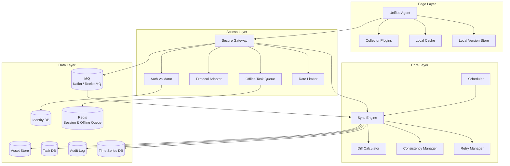

### 2.1 Layer Responsibilities

| Layer | Core Components | Main Responsibilities | Design Focus |
| :-- | :-------------------------------- | :--------------------- | :-------------- |
| Edge Layer | Unified Agent | Identity holding, data collection, task execution, local caching | Plugin-based, resume from breakpoint, local version management |
| Access Layer | Secure Gateway | Authentication, protocol conversion, rate limiting, task forwarding, offline caching | Secure entry point, peak-shaving, connection governance |
| Core Layer | Sync Engine | Scheduling, Diff calculation, state machine progression, consistency control | Idempotency, retry, transaction control |
| Data Layer | Asset Store / Task DB / Audit Log | State storage, asset snapshots, task records, audit tracing | Multi-tenant isolation, version rollback, hot/cold separation |

---

## 3. Core Design Principles

### 3.1 Do Not Trust Any Single Point of Input

Data reported by Agent must pass Token verification, signature verification, timestamp verification, and Payload Hash verification before entering the core processing pipeline.

This prevents the following risks:

* Illegal nodes forging UUID to report data;
* Man-in-the-middle tampering with asset content;
* Old requests being resubmitted to form replay attacks;
* Tokens remaining usable for long periods after leakage.

### 3.2 Tasks Persist First, Then Execute

Synchronization tasks should not exist only in memory. Any task that needs to be delivered to a node should first generate a `task_id` and be written to the task database, then be pushed for execution by the gateway or scheduler.

This ensures:

* Tasks are not lost after gateway restart;
* Tasks can be recovered after node goes offline;
* Execution results can be audited;
* Retry counts and failure reasons can be tracked.

### 3.3 Prefer Incremental Over Full Sync

Asset synchronization must prioritize using version numbers and Hash for quick judgment, only transmitting Diff data when necessary.

Full synchronization should only occur in the following situations:

* Node first registration;
* Hash verification failure;
* Multiple incremental retry failures;
* Version chain breakage;
* Manual trigger by administrator for repair.

### 3.4 Eventual Consistency, Not Strong Synchronous Blocking

In massive node scenarios, all node states cannot always be strongly consistent. The system should pursue "observable, recoverable, convergent" eventual consistency.

Core approach:

* Write path is idempotent;
* State machine is replayable;
* Conflicts are detectable;
* Failures are retryable;
* Results are auditable.

---

## 4. Identity and Security Model

Enhanced UISA uses a "dual identity + short-term token + signature verification" security model.

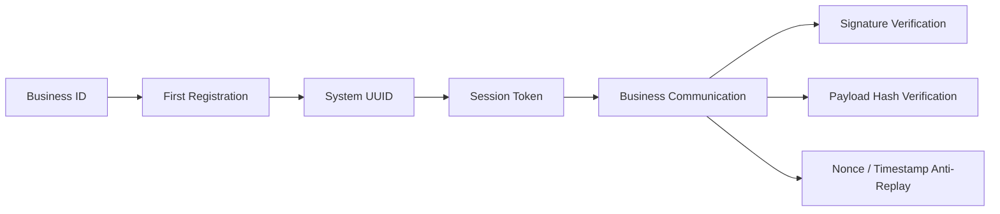

### 4.1 Dual Identity Identifiers

| Identity Type | Usage Phase | Long-term Use | Description |
| :---------- | :------- | :----- | :------------------------- |
| Business ID | First registration | No | Can come from machine code, cloud instance ID, user business ID, pre-provisioned credentials |
| System UUID | Full lifecycle after registration | Yes | System-generated globally unique identity, used for all subsequent communications |

Business ID is only responsible for proving "who you are," while System UUID is the node identity actually used internally by the system.

### 4.2 Communication Security Stack

| Phase | Security Mechanism | Purpose |
| :------- | :---------------- | :-------- |
| Registration Phase | PSK / Asymmetric Signature | Prevent forged registration |
| Token Issuance | Short-term Session Token | Reduce credential leakage risk |
| Normal Requests | Bearer Token + Signature | Verify request source |
| Critical Payloads | Payload Hash | Prevent content tampering |
| Anti-Replay | Nonce + Timestamp | Prevent old requests from being resubmitted |

### 4.3 Recommended Request Headers

```http
Authorization: Bearer <session_token>
X-Node-UUID: <system_uuid>
X-Timestamp: 1711324800000
X-Nonce: 8f5a2b1c9d
X-Payload-Hash: sha256:<hash>
X-Signature: <signature>
```

---

## 5. Secure Registration Flow

The registration flow aims to establish a trusted identity and bind the business identity to a system identity.

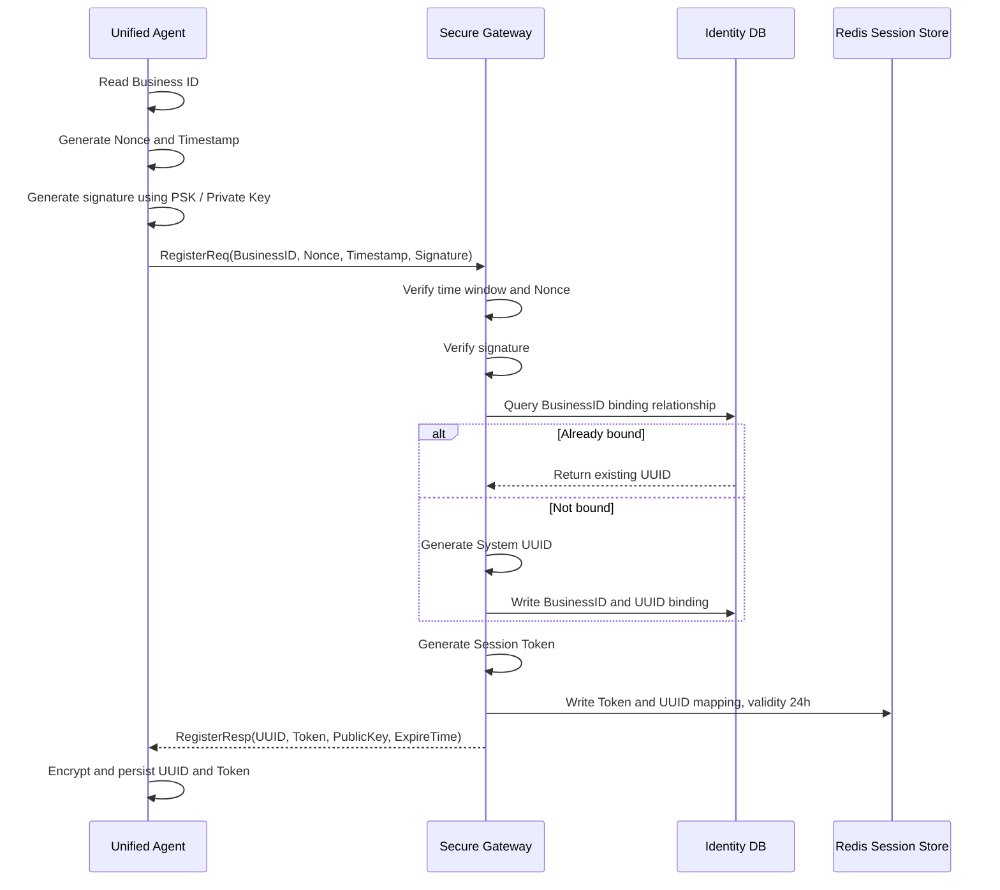

### 5.1 Registration Request Suggestion

```json
{
  "businessId": "ecs-i-xxxxxx",
  "nonce": "8f5a2b1c9d",
  "timestamp": 1711324800000,
  "signature": "base64-signature",
  "agentVersion": "1.3.0",
  "capabilities": ["asset", "heartbeat", "command"]
}
```

### 5.2 Registration Response Suggestion

```json
{
  "uuid": "node-9d2e4b62-8f1a-4c92-a941-xxxxxx",
  "token": "eyJhbGciOi...",
  "expireAt": "2026-03-26T00:00:00Z",
  "serverPublicKey": "-----BEGIN PUBLIC KEY-----...",
  "heartbeatIntervalSeconds": 30
}
```

---

## 6. Heartbeat and Status Telemetry Design

Heartbeat is not simply "online detection," but the entry point for the entire system's scheduling, offline recovery, task wake-up, and health assessment.

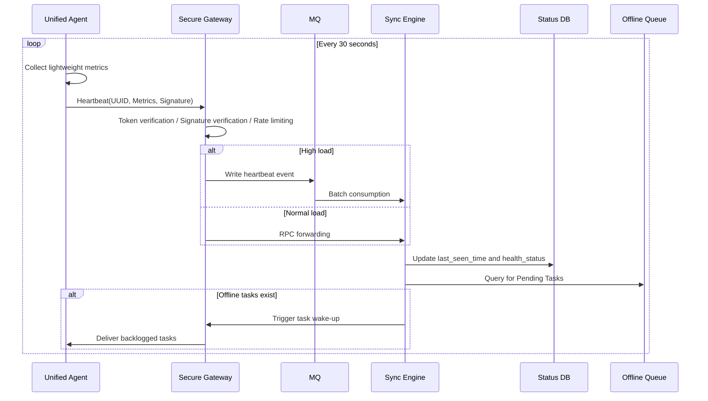

### 6.1 Heartbeat Data Suggestion

| Field | Type | Description |
| :--------------- | :----- | :--------- |
| uuid | string | Node system identity |
| timestamp | long | Agent local time |
| cpu_usage | double | CPU usage rate |
| memory_usage | double | Memory usage rate |
| disk_usage | double | Disk usage rate |
| agent_version | string | Agent version |
| network_status | string | Network status |
| running_task_ids | array | Currently executing tasks |

### 6.2 Online Status Judgment

| Status | Judgment Condition | System Action |
| :------- | :-------------- | :-------- |
| Online | Normal report within last 1 heartbeat cycle | Normal task scheduling |
| Unstable | 2 consecutive cycles abnormal or delayed | Reduce delivery frequency |
| Offline | No report for over 3 cycles | Tasks enter offline queue |
| Disabled | Administrator disabled or security risk | Reject tasks and data writes |

---

## 7. Asset Incremental Sync Flow

Asset synchronization is the core capability of UISA. It achieves low-cost, recoverable consistent synchronization through "version number + Hash + Diff + optimistic locking."

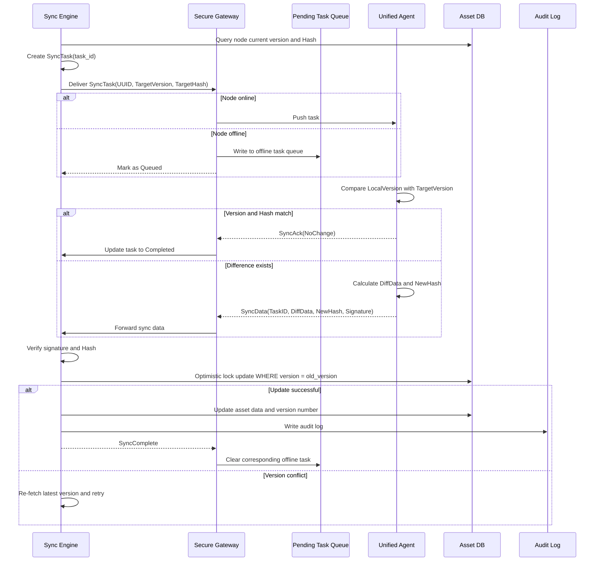

### 7.1 Asset Sync Strategy Comparison

| Strategy | Applicable Scenarios | Pros | Cons |
| :--------- | :---------------- | :------ | :------- |
| Full Sync | First registration, disaster recovery, Hash error | Simple and reliable | High transmission cost |
| Incremental Sync | Routine asset changes | Less transmission, faster | Requires version management |
| Hash Quick Compare | Large fields, list-type assets | Fast judgment, low cost | Cannot express specific changes |
| Diff Patch | Configuration, software packages, disk lists | Precise synchronization | Complex implementation |

### 7.2 Diff Calculation Suggestion

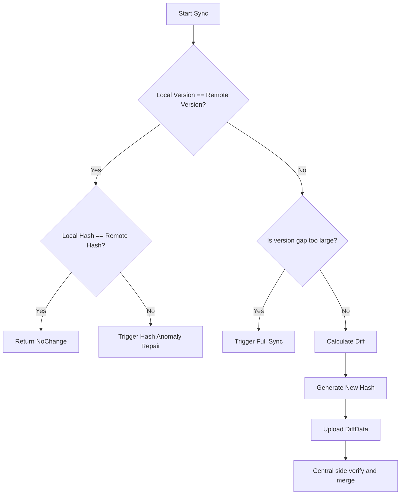

### 7.3 Asset Unique Key Design

Asset data must have stable unique keys, otherwise UPSERT becomes duplicate insertion.

| Asset Type | Recommended asset_key | Example |
| :-------- | :-------------------- | :---------------- |
| CPU | cpu_index or socket_id | cpu-0 |
| Disk | Disk serial number / Device path | /dev/sda |
| NIC | MAC address | 00:16:3e:xx:xx:xx |
| Software | Package name + architecture | nginx:x86_64 |
| Process | pid + start_time | 1123:1711324800 |
| Container | container_id | 1f2a3b4c |

---

## 8. Offline Task Queue Design

Offline nodes are the norm in infrastructure management, not an exception. UISA treats offline as part of the task lifecycle.

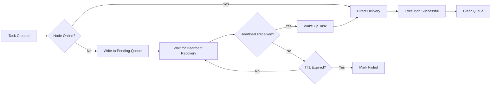

### 8.1 Queue Structure Suggestion

The following structure can be used in Redis:

```text
pending_task:{uuid} -> List<TaskID>
task_detail:{task_id} -> TaskPayload
task_lock:{task_id} -> distributed lock
task_retry:{task_id} -> retry count
task_deadline:{task_id} -> expire timestamp
```

### 8.2 Offline Task Strategy

| Strategy | Suggestion |
| :----- | :------------------------------ |
| TTL | Default 7 days, critical tasks can be extended |
| Max Backlog | Single node limit 1000, merge similar tasks when exceeded |
| Similar Task Merge | Multiple asset sync tasks only keep the latest one |
| Wake-up Method | Heartbeat returns Pending Task summary, Agent actively pulls |
| Execution Order | Configuration changes first, asset collection second, routine inspection last |

---

## 9. Task State Machine

The task state machine is key to ensuring system recoverability, traceability, and auditability.

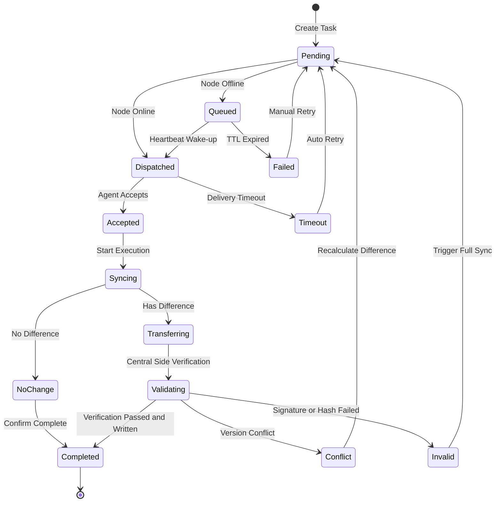

### 9.1 Status Field Suggestion

| Field | Description |
| :---------- | :------------------------------ |
| task_id | Globally unique task ID |
| uuid | Target node |
| task_type | Task type, e.g., ASSET_SYNC / CONFIG_PUSH |
| status | Current status |
| retry_count | Retry count so far |
| max_retry | Max retry count |
| last_error | Most recent failure reason |
| created_at | Creation time |
| updated_at | Update time |
| expire_at | Expiration time |

---

## 10. Data Consistency Guarantee

Enhanced UISA's consistency goal is not single-request strong consistency, but eventual consistency ensured through multiple layers of protection.

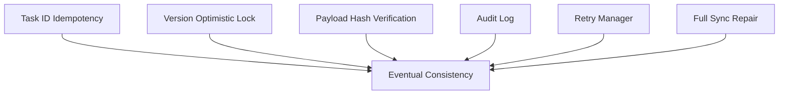

### 10.1 Idempotency Control

Each task must carry a globally unique `task_id`. The central side checks whether the task has already been processed before processing.

```sql
SELECT status FROM sync_task WHERE task_id = ?;
```

If the task is already `Completed`, duplicate requests return success directly without writing to the asset table again.

### 10.2 Optimistic Lock Control

Asset updates must include version conditions.

```sql
UPDATE asset_info
SET content = ?,
    version = version + 1,
    content_hash = ?,
    update_time = NOW()
WHERE uuid = ?
  AND asset_type = ?
  AND asset_key = ?
  AND version = ?;
```

If affected rows is 0, it indicates a concurrent conflict, requiring re-fetching the latest version and recalculating the Diff.

### 10.3 Audit Log

Each change is written to the audit log, preserving before-change, after-change, and diff details.

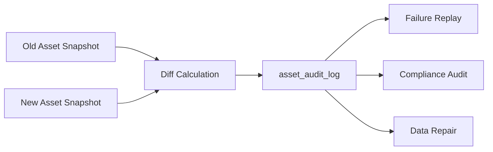

---

## 11. Core Data Models

### 11.1 Node Identity Table: node_identity

| Field | Type | Description |
| :------------- | :----------- | :-------------------------- |
| uuid | varchar(64) | System unique identity, primary key |
| business_id | varchar(128) | Business identity |
| public_key | text | Node public key |
| status | varchar(32) | ONLINE / OFFLINE / DISABLED |
| last_seen_time | datetime | Most recent heartbeat time |
| agent_version | varchar(64) | Agent version |
| created_at | datetime | Creation time |
| updated_at | datetime | Update time |

### 11.2 Asset Information Table: asset_info

| Field | Type | Description |
| :----------- | :----------- | :------ |
| id | bigint | Primary key |
| uuid | varchar(64) | Node UUID |
| asset_type | varchar(64) | Asset type |
| asset_key | varchar(128) | Asset internal unique key |
| content | json | Asset content |
| version | bigint | Version number |
| content_hash | varchar(128) | Content Hash |
| update_time | datetime | Update time |

Recommended unique index:

```sql
UNIQUE KEY uk_asset_node_type_key (uuid, asset_type, asset_key)
```

### 11.3 Sync Task Table: sync_task

| Field | Type | Description |
| :---------- | :---------- | :------- |
| task_id | varchar(64) | Task ID, primary key |
| uuid | varchar(64) | Target node |
| task_type | varchar(64) | Task type |
| status | varchar(32) | Task status |
| payload | json | Task content |
| retry_count | int | Retry count |
| max_retry | int | Max retry count |
| last_error | text | Failure reason |
| expire_at | datetime | Expiration time |
| created_at | datetime | Creation time |
| updated_at | datetime | Update time |

### 11.4 Audit Log Table: asset_audit_log

| Field | Type | Description |
| :-------------- | :----------- | :----------------------- |
| log_id | bigint | Primary key |
| task_id | varchar(64) | Associated task |
| uuid | varchar(64) | Node UUID |
| action | varchar(32) | CREATE / UPDATE / DELETE |
| asset_type | varchar(64) | Asset type |
| asset_key | varchar(128) | Asset key |
| before_snapshot | json | Pre-change snapshot |
| after_snapshot | json | Post-change snapshot |
| diff_detail | json | Change diff |
| operator | varchar(64) | Operator |
| created_at | datetime | Creation time |

---

## 12. Exception Handling and Disaster Recovery Strategy

| Exception Scenario | Detection Method | Handling Strategy | Recovery Method |
| :-------- | :--------------- | :------------------ | :------------------ |
| Network Interruption | Heartbeat timeout, RPC failure | Mark Offline, tasks enter offline queue | Re-deliver after heartbeat recovery |
| Agent Crash | Heartbeat loss | Pause task scheduling | Agent actively pulls unfinished tasks after restart |
| Gateway Crash | Health check failure | LB switches to backup gateway | Token and queue state stored in Redis |
| MQ Backlog | Consumption delay monitoring | Scale consumers, degrade non-core telemetry | Batch consumption to catch up |
| Hash Verification Failure | Payload Hash mismatch | Discard data, log security event | Force full sync |
| Optimistic Lock Conflict | UPDATE affected rows is 0 | Re-fetch version, recalculate Diff | Auto retry |
| Database Failure | Write failure, connection exception | Task remains Pending | Retry after DB recovery |
| Token Expired | Authentication failure | Request Agent to refresh Token | Re-register or Refresh Token |

---

## 13. Observability Design

A synchronization system without observability is difficult to locate root causes when data inconsistency occurs. UISA should build observation capabilities from four directions: metrics, logs, tracing, and audit.

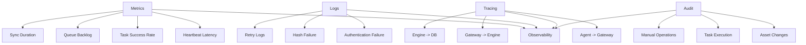

### 13.1 Core Metrics

| Metric | Description | Alert Suggestion |
| :----------------------------- | :---------- | :------------- |
| heartbeat_delay_seconds | Heartbeat latency | Alert if P95 exceeds 60s |
| node_offline_count | Offline node count | Alert on sudden increase |
| sync_task_success_rate | Sync task success rate | Alert if below 99% |
| pending_task_count | Backlogged task count | Alert on continuous growth |
| sync_duration_seconds | Sync duration | Alert on P95 / P99 anomaly |
| hash_validation_failed_total | Hash verification failure count | Alert on any sudden increase |
| optimistic_lock_conflict_total | Optimistic lock conflict count | Alert on continuous growth |

---

## 14. Performance Optimization Suggestions

### 14.1 Heartbeat Link Peak-Shaving

High-frequency heartbeats should not write directly to the database. Recommended path:

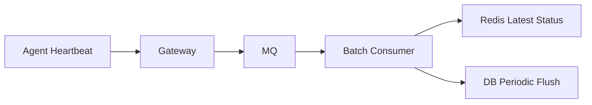

Optimization suggestions:

* Latest online status writes to Redis;
* Database only periodically persists;
* Telemetry metrics go to time-series database;
* Heartbeat events batch consumed;
* Offline detection by scheduled task scanning Redis / DB.

### 14.2 Asset Data Hot/Cold Separation

| Data Type | Storage Suggestion |
| :----- | :-------------------------------------- |
| Current Asset Status | MySQL / PostgreSQL |
| Historical Change Audit | Object storage + index table |
| High-Frequency Telemetry Metrics | Prometheus / VictoriaMetrics / InfluxDB |
| Offline Task Queue | Redis / MQ |
| Large Asset Snapshots | Object storage |

### 14.3 Task Merge Strategy

If multiple asset sync tasks are generated for the same node in a short time, they can be merged.

| Task Type | Merge Rule |
| :----------- | :------------- |
| ASSET_SYNC | Keep only the latest one |
| CONFIG_PUSH | Cannot merge arbitrarily, must execute by version |
| COMMAND_EXEC | Usually cannot merge |
| HEARTBEAT | Keep only latest status |
| TELEMETRY | Can batch compress write |

---

## 15. Engineering Implementation Suggestions

### 15.1 Recommended Technology Stack

| Module | Recommended Technology |
| :------ | :---------------------------------- |
| Agent | Go / Rust / Java |
| Gateway | Spring Boot / Go Gateway / Envoy Extension |
| MQ | Kafka / RocketMQ |
| Cache | Redis Cluster |
| Asset Store | MySQL / PostgreSQL |
| Time-Series Data | Prometheus / VictoriaMetrics |
| Tracing | OpenTelemetry |
| Config Center | Nacos / Apollo / Consul |
| Deployment | Kubernetes / systemd / Ansible |

### 15.2 Recommended Deployment Topology

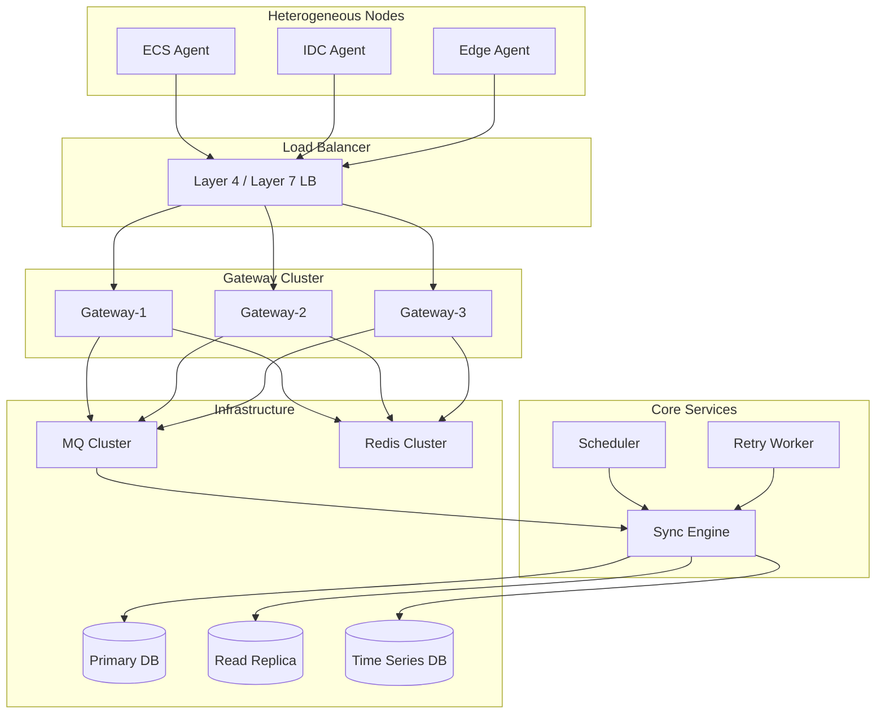

### 15.3 Phased Construction Roadmap

| Phase | Construction Focus | Goal |
| :------ | :----------------- | :----- |
| Phase 1 | Agent registration, heartbeat, asset full report | Complete minimum closed loop |
| Phase 2 | Incremental sync, version numbers, Hash verification | Reduce sync cost |
| Phase 3 | Offline queue, task state machine, retry | Improve reliability |
| Phase 4 | Audit logs, observability, alerting | Support production troubleshooting |
| Phase 5 | Multi-tenancy, permissions, security hardening | Enterprise-grade deployment |
| Phase 6 | Canary release, plugin marketplace, cross-region sync | Platform expansion |

---

## 16. Common Design Pitfalls

### 16.1 Using Machine Code as Long-term Primary Key

Machine code, instance ID, and hostname can all change, making them unsuitable as system long-term primary keys. The correct approach is to generate a System UUID during first registration, and use UUID for all subsequent internal logic.

### 16.2 Heartbeat Writes Directly to Database

Massive nodes writing to the database every 30 seconds creates high-frequency write pressure. Should use MQ, Redis, batch persistence, and time-series database for layered processing.

### 16.3 Missing Task State Machine

If tasks only have success / failed states, offline, retry, conflict, and timeout are difficult to express. The clearer the task state machine, the easier the system is to recover.

### 16.4 Missing Idempotent Design

Network retries cause the same request to be submitted multiple times. Without Task ID idempotency control, duplicate writes and version disorder may occur.

### 16.5 Only Version Numbers, No Hash

Version numbers can determine if changes occurred, but cannot guarantee content integrity. Hash can help detect data corruption, transmission anomalies, and abnormal overwrites.

---

## 17. Summary

The core idea of Enhanced UISA can be summarized in one sentence:

> Upgrade the heterogeneous node synchronization problem from "simple data reporting" to an infrastructure capability with "trusted identity, reliable tasks, incremental data, eventual consistency, and full-link auditability."

It achieves responsibility decoupling through a four-layer architecture, ensures security through dual identity and signature mechanisms, reduces sync costs through version numbers and Hash, solves network instability through offline queues and task state machines, guarantees consistency through idempotency and optimistic locking, and supports production troubleshooting through audit logs and observability.

For platforms that need to manage large numbers of ECS, IDC physical servers, edge nodes, or hybrid cloud assets, Enhanced UISA can serve as a stable general-purpose synchronization foundation. It is not only suitable for asset information synchronization, but can also be extended to configuration distribution, command execution, inspection tasks, patch management, compliance collection, and other scenarios.

---

## Appendix: Core Capability Checklist

| Check Item | Required | Description |
| :----------- | :--: | :-------------- |
| System UUID | Yes | Avoid system disorder from business identity changes |
| Short-term Token | Yes | Reduce credential leakage risk |
| Request Signature | Yes | Prevent forged requests |
| Payload Hash | Yes | Prevent data tampering and corruption |
| Task ID Idempotency | Yes | Prevent duplicate writes |
| Optimistic Lock | Yes | Prevent concurrent overwrites |
| Offline Queue | Yes | Tasks not lost when nodes go offline |
| Task State Machine | Yes | Support recovery, retry, and audit |
| Audit Log | Yes | Support tracing and compliance |
| Observability Metrics | Yes | Support production troubleshooting |
| MQ Peak-Shaving | Recommended | Must-have for large-scale node scenarios |
| Time-Series Database | Recommended | High-frequency telemetry data should be stored separately |
| Multi-tenant Isolation | Recommended | Essential for enterprise-grade platforms |
| Canary Mechanism | Recommended | Essential for Agent upgrades and configuration delivery |
