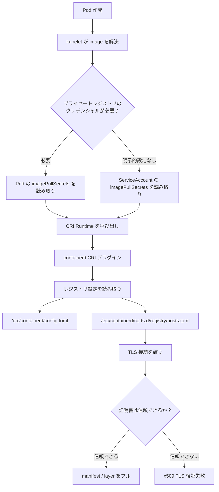
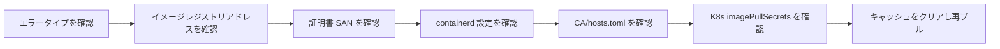
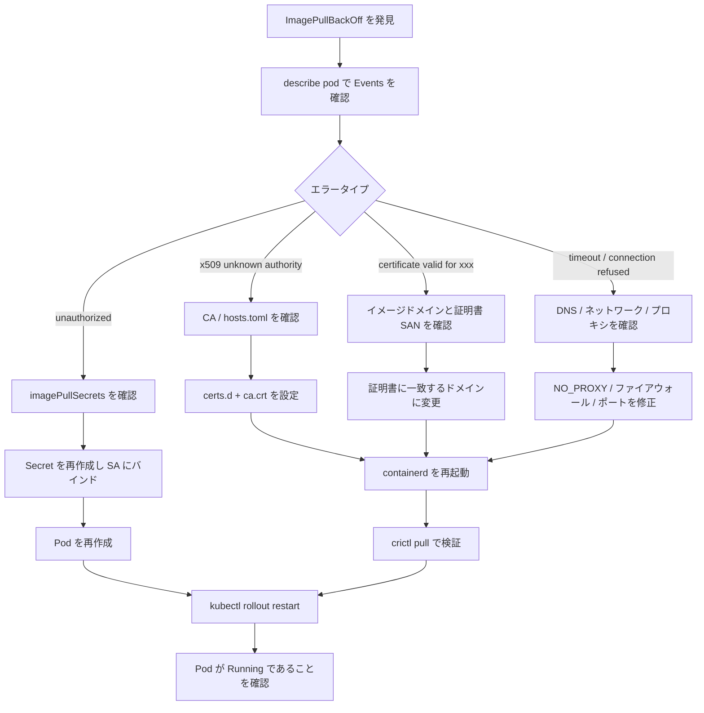

---

title: containerd TLS 証明書検証問題の解決：検証スキップから信頼設定まで
timestamp: 2026-02-25 00:00:00+08:00
tags: [Kubernetes, containerd, TLS, Harbor, 運用, トラブルシューティング]
description: containerd でプライベートイメージレジストリからイメージをプルする際の TLS 証明書検証メカニズムを深く解説し、一時的な検証スキップから本番環境向け CA 信頼設定までの完全なソリューションを提供。さらに、Kubernetes クレデンシャルのクリーンアップ、ランタイムキャッシュのリセット、トラブルシューティングのクロージャーまで網羅。
---

## 一、問題の背景：なぜ containerd はイメージのプルに失敗するのか？

Kubernetes クラスタで Harbor、Nexus、Docker Registry などのプライベートイメージレジストリを使用する際、次のようなエラーによく遭遇します：

```text
failed to pull image "harbor.example.com/project/app:v1":
rpc error: code = Unknown desc = failed to pull and unpack image:
failed to resolve reference:
failed to do request:
Head "https://harbor.example.com/v2/project/app/manifests/v1":
tls: failed to verify certificate: x509: certificate signed by unknown authority
```

この問題は表面的には「TLS 証明書検証失敗」ですが、本質的には通常、以下のいずれかの原因によります：

| 問題タイプ     | 典型的な症状                                            | 根本原因                                           |
| -------- | ----------------------------------------------- | -------------------------------------------- |
| CA が信頼されていない   | `x509: certificate signed by unknown authority` | プライベートレジストリが自己署名証明書を使用しており、ノードがその CA を信頼していない                        |
| ドメイン名の不一致    | `certificate is valid for xxx, not yyy`         | イメージアドレスと証明書の SAN が一致しない                              |
| 設定が反映されていない    | 設定を変更したのにエラーが続く                                       | containerd が `hosts.toml` または `config.toml` を読み取っていない |
| ポート・パスの誤り   | ポート付きレジストリの設定が無効                                       | `certs.d` ディレクトリ名にポートが欠落                            |
| K8s クレデンシャルの誤り | TLS 修正後も `unauthorized`                         | `imagePullSecrets` または ServiceAccount に古いクレデンシャルがバインドされている   |
| ノードキャッシュの干渉   | 手動 pull は成功するが、Pod は失敗                              | kubelet/containerd のキャッシュや古いイメージレイヤの残留                 |

---

## 二、まず経路を理解する：Pod がイメージをプルする際に通るレイヤーは？



したがって、問題解決は Kubernetes YAML だけを見ても、containerd だけを変更しても不十分です。正しいトラブルシューティングの順序は次の通りです：



---

## 三、迅速な応急処置：TLS 検証の一時的スキップ

> 適用シナリオ：テスト環境、一時的なデモ環境、社内ネットワークの一時レジストリ。
> 本番環境での使用は推奨されません。証明書の検証をバイパスするため、中間者攻撃のリスクがあります。

### 1. containerd バージョンの確認

```bash
containerd --version
```

一般的な出力：

```text
containerd github.com/containerd/containerd 1.7.x
```

設定ファイルのバージョンを確認することも可能です：

```bash
sudo head -n 20 /etc/containerd/config.toml
```

---

### 2. 推奨方式：`certs.d + hosts.toml` の使用

新しいバージョンの containerd では、`config_path` を通じて各レジストリの個別設定を読み取ることが推奨されています。

#### containerd 1.x 設定

`/etc/containerd/config.toml` を編集：

```toml
version = 2

[plugins."io.containerd.grpc.v1.cri".registry]
  config_path = "/etc/containerd/certs.d"
```

#### containerd 2.x 設定

containerd 2.x の CRI プラグインパスは異なります：

```toml
version = 3

[plugins."io.containerd.cri.v1.images".registry]
  config_path = "/etc/containerd/certs.d"
```

---

### 3. レジストリ設定ディレクトリの作成

プライベートレジストリのアドレスが次の通りだと仮定します：

```text
harbor.example.com
```

ディレクトリを作成：

```bash
sudo mkdir -p /etc/containerd/certs.d/harbor.example.com
```

レジストリにポートが付いている場合、例えば：

```text
harbor.example.com:8443
```

ディレクトリにもポートを含める必要があります：

```bash
sudo mkdir -p /etc/containerd/certs.d/harbor.example.com:8443
```

---

### 4. `hosts.toml` で検証をスキップ

ポートなしの例：

```toml
server = "https://harbor.example.com"

[host."https://harbor.example.com"]
  capabilities = ["pull", "resolve", "push"]
  skip_verify = true
```

ポート付きの例：

```toml
server = "https://harbor.example.com:8443"

[host."https://harbor.example.com:8443"]
  capabilities = ["pull", "resolve", "push"]
  skip_verify = true
```

完全なコマンド：

```bash
sudo tee /etc/containerd/certs.d/harbor.example.com/hosts.toml > /dev/null <<'EOF'
server = "https://harbor.example.com"

[host."https://harbor.example.com"]
  capabilities = ["pull", "resolve", "push"]
  skip_verify = true
EOF
```

---

### 5. containerd の再起動

```bash
sudo systemctl daemon-reload
sudo systemctl restart containerd
sudo systemctl status containerd --no-pager
```

検証：

```bash
sudo crictl pull harbor.example.com/project/app:v1
```

リアルタイムでログを確認：

```bash
sudo journalctl -u containerd -f -n 100
```

---

## 四、本番推奨ソリューション：信頼された CA 証明書の設定

TLS 検証のスキップは一時的な手段に過ぎず、本番環境ではノードにプライベートレジストリの CA を信頼させるべきです。

### 1. レジストリ CA 証明書の取得

通常、Harbor/Nexus の管理画面から CA 証明書をエクスポートし、次のように名前を付けます：

```text
ca.crt
```

サーバー側から証明書チェーンをエクスポートすることも可能です：

```bash
openssl s_client -showcerts -connect harbor.example.com:443 < /dev/null
```

証明書のサブジェクトと SAN を確認：

```bash
openssl x509 -in ca.crt -noout -subject -issuer -dates
```

---

### 2. containerd 証明書ディレクトリに配置

```bash
sudo mkdir -p /etc/containerd/certs.d/harbor.example.com
sudo cp ca.crt /etc/containerd/certs.d/harbor.example.com/ca.crt
```

ポート付きレジストリの場合：

```bash
sudo mkdir -p /etc/containerd/certs.d/harbor.example.com:8443
sudo cp ca.crt /etc/containerd/certs.d/harbor.example.com:8443/ca.crt
```

---

### 3. 本番向け `hosts.toml` の作成

TLS 検証をスキップしません：

```toml
server = "https://harbor.example.com"

[host."https://harbor.example.com"]
  capabilities = ["pull", "resolve", "push"]
  ca = "ca.crt"
```

完全なコマンド：

```bash
sudo tee /etc/containerd/certs.d/harbor.example.com/hosts.toml > /dev/null <<'EOF'
server = "https://harbor.example.com"

[host."https://harbor.example.com"]
  capabilities = ["pull", "resolve", "push"]
  ca = "ca.crt"
EOF
```

ディレクトリ構造は次のようになります：

```text
/etc/containerd/certs.d/
└── harbor.example.com
    ├── ca.crt
    └── hosts.toml
```

---

### 4. システム信頼チェーンへの同期

この手順は containerd に必須ではありませんが、`curl`、`openssl`、システムサービスがその CA を統一的に信頼できるよう強く推奨されます。

#### Debian / Ubuntu

```bash
sudo cp ca.crt /usr/local/share/ca-certificates/harbor.example.com.crt
sudo update-ca-certificates
```

#### RHEL / CentOS / Rocky Linux / AlmaLinux

```bash
sudo cp ca.crt /etc/pki/ca-trust/source/anchors/harbor.example.com.crt
sudo update-ca-trust
```

#### Arch Linux

```bash
sudo trust anchor --store ca.crt
sudo update-ca-trust
```

---

### 5. 再起動と検証

```bash
sudo systemctl restart containerd
sudo crictl pull harbor.example.com/project/app:v1
```

成功すれば、containerd が CA 設定を正しく読み取ったことを意味します。

---

## 五、旧設定方式：`registry.configs` が推奨されない理由

多くの古いチュートリアルでは `/etc/containerd/config.toml` を直接変更しています：

```toml
[plugins."io.containerd.grpc.v1.cri".registry.configs."harbor.example.com".tls]
  insecure_skip_verify = true
```

この書き方は旧バージョンでは動作しますが、新バージョンでは次の使用が推奨されています：

```toml
[plugins."io.containerd.grpc.v1.cri".registry]
  config_path = "/etc/containerd/certs.d"
```

その後、次のパスを通じて：

```text
/etc/containerd/certs.d/<registry>/hosts.toml
```

各レジストリの TLS、CA、ミラー、ヘッダー、ケイパビリティを管理します。

2 つの方式の比較：

| 設定方式                 | 適用性   | メリット            | デメリット                   |
| -------------------- | ----- | ------------- | -------------------- |
| `registry.configs`   | 旧バージョン互換 | シンプルで直接的          | 非推奨、メイン設定が肥大化           |
| `certs.d/hosts.toml` | 新バージョン推奨 | 各レジストリの独立設定、構造が明確 | 初回設定がやや複雑              |
| システム CA 信頼             | 汎用的な強化  | システムツールでも検証可能      | containerd が正しく設定を読み取る必要あり |

---

## 六、Kubernetes レイヤ：誤った imagePullSecrets のクリーンアップ

TLS 問題が解決した後も、次のエラーが出る場合：

```text
unauthorized: authentication required
```

または：

```text
pull access denied
```

問題が「証明書の信頼」から「レジストリの認証」に移行したことを意味します。

---

### 1. Pod が使用する ServiceAccount の確認

```bash
kubectl get pod <pod-name> -n <namespace> -o jsonpath='{.spec.serviceAccountName}'
```

明示的に指定されていない場合、デフォルトで使用されるのは：

```text
default
```

---

### 2. ServiceAccount に古い Secret がバインドされていないか確認

```bash
kubectl get sa default -n <namespace> -o yaml
```

重点的に確認：

```yaml
imagePullSecrets:
  - name: old-registry-secret
```

ここに古い Secret がバインドされていると、Pod は誤ったクレデンシャルを使い続ける可能性があります。

---

### 3. default ServiceAccount の古いクレデンシャルをクリア

```bash
kubectl patch sa default -n <namespace> -p '{"imagePullSecrets": []}'
```

より推奨されるのは、正しい Secret をバインドすることです：

```bash
kubectl patch sa default -n <namespace> -p '{"imagePullSecrets": [{"name": "harbor-secret"}]}'
```

---

### 4. 正しい docker-registry Secret の再作成

```bash
kubectl delete secret harbor-secret -n <namespace> --ignore-not-found
```

```bash
kubectl create secret docker-registry harbor-secret \
  --docker-server=harbor.example.com \
  --docker-username='<username>' \
  --docker-password='<password>' \
  --docker-email='admin@example.com' \
  -n <namespace>
```

Pod で明示的に宣言：

```yaml
apiVersion: v1
kind: Pod
metadata:
  name: test-private-image
spec:
  imagePullSecrets:
    - name: harbor-secret
  containers:
    - name: app
      image: harbor.example.com/project/app:v1
```

または ServiceAccount を通じて統一的に継承：

```yaml
apiVersion: v1
kind: ServiceAccount
metadata:
  name: app-sa
imagePullSecrets:
  - name: harbor-secret
```

---

## 七、ノードレイヤ：containerd / kubelet キャッシュのクリーンアップ

TLS とクレデンシャルの両方を修正したにもかかわらず、Pod が依然として失敗する場合、ノード側のキャッシュのクリーンアップを推奨します。

### 1. 失敗したイメージキャッシュの削除

```bash
sudo crictl images | grep harbor.example.com
```

指定イメージの削除：

```bash
sudo crictl rmi <IMAGE_ID>
```

またはイメージ名で削除：

```bash
sudo crictl rmi harbor.example.com/project/app:v1
```

---

### 2. containerd が直接プルできるか確認

```bash
sudo crictl pull harbor.example.com/project/app:v1
```

`crictl pull` が成功するのに Pod が失敗する場合、Kubernetes 側の Secret、ServiceAccount、namespace、イメージ名を優先的に調査します。

`crictl pull` が失敗する場合、containerd 側の TLS、CA、hosts.toml、プロキシ、DNS を優先的に調査します。

---

### 3. kubelet の残留設定の確認

一部の環境では、kubelet や過去の Docker の残留設定が存在する可能性があります：

```bash
sudo ls -al /var/lib/kubelet/
sudo ls -al /root/.docker/
```

よくある残留ファイル：

```text
/root/.docker/config.json
/var/lib/kubelet/config.json
```

慎重にクリーンアップ：

```bash
sudo rm -f /root/.docker/config.json
sudo rm -f /var/lib/kubelet/config.json
```

その後サービスを再起動：

```bash
sudo systemctl restart containerd
sudo systemctl restart kubelet
```

---

## 八、プロキシ問題：社内レジストリが誤って転送される

ノードにプロキシが設定されている場合、containerd が社内 Harbor にアクセスする際、外部プロキシに転送され、証明書や接続の異常が発生する可能性があります。

### 1. containerd サービスのプロキシ設定を確認

```bash
systemctl show containerd --property=Environment
```

systemd drop-in を確認：

```bash
sudo systemctl cat containerd
```

次のような設定が存在する可能性があります：

```ini
Environment="HTTP_PROXY=http://proxy.example.com:7890"
Environment="HTTPS_PROXY=http://proxy.example.com:7890"
Environment="NO_PROXY=localhost,127.0.0.1"
```

---

### 2. 社内レジストリを NO_PROXY に追加

```ini
[Service]
Environment="HTTP_PROXY=http://proxy.example.com:7890"
Environment="HTTPS_PROXY=http://proxy.example.com:7890"
Environment="NO_PROXY=localhost,127.0.0.1,10.0.0.0/8,192.168.0.0/16,harbor.example.com"
```

再読み込み：

```bash
sudo systemctl daemon-reload
sudo systemctl restart containerd
```

---

## 九、完全なトラブルシューティングコマンド一覧

### 1. 基本情報

```bash
containerd --version
crictl version
kubectl version --client
```

```bash
systemctl status containerd --no-pager
systemctl status kubelet --no-pager
```

---

### 2. containerd 設定の確認

```bash
sudo grep -n "config_path" /etc/containerd/config.toml
sudo grep -n "registry" /etc/containerd/config.toml
```

```bash
sudo tree /etc/containerd/certs.d
```

`tree` がない場合：

```bash
sudo find /etc/containerd/certs.d -maxdepth 3 -type f -print
```

---

### 3. 証明書の確認

```bash
openssl s_client -showcerts -connect harbor.example.com:443 < /dev/null
```

```bash
openssl x509 -in /etc/containerd/certs.d/harbor.example.com/ca.crt -noout -subject -issuer -dates
```

---

### 4. Kubernetes イベントの確認

```bash
kubectl describe pod <pod-name> -n <namespace>
```

```bash
kubectl get events -n <namespace> --sort-by=.lastTimestamp
```

---

### 5. Secret の確認

```bash
kubectl get secret -n <namespace>
```

```bash
kubectl get secret harbor-secret -n <namespace> -o yaml
```

---

### 6. ServiceAccount の確認

```bash
kubectl get sa default -n <namespace> -o yaml
```

```bash
kubectl get sa app-sa -n <namespace> -o yaml
```

---

### 7. containerd ログの確認

```bash
sudo journalctl -u containerd -n 200 --no-pager
```

リアルタイム確認：

```bash
sudo journalctl -u containerd -f -n 100
```

---

## 十、推奨修復フロー



---

## 十一、本番環境への導入アドバイス

### 1. 本番環境で `skip_verify` を長期使用しない

`skip_verify = true` の役割は TLS 検証のスキップです。プル失敗を迅速に解決できますが、ノードが証明書の出所を検証しなくなるため、セキュリティリスクがあります。

本番環境では次の使用を推奨：

```toml
ca = "ca.crt"
```

次ではなく：

```toml
skip_verify = true
```

---

### 2. レジストリドメイン名を統一し、IP とドメイン名を混用しない

誤った例：

```yaml
image: 192.168.1.10/project/app:v1
```

しかし証明書は次に発行されている：

```text
harbor.example.com
```

これでは証明書検証が失敗します。

統一的に次を使用することを推奨：

```yaml
image: harbor.example.com/project/app:v1
```

---

### 3. ポート付きレジストリはパスの一致が必須

イメージアドレスが次の場合：

```text
harbor.example.com:8443/project/app:v1
```

ディレクトリは次でなければなりません：

```text
/etc/containerd/certs.d/harbor.example.com:8443/
```

次ではありません：

```text
/etc/containerd/certs.d/harbor.example.com/
```

---

### 4. 各ノードで設定が必要

containerd は各 Worker ノードで動作しています。Master ノードだけで CA を設定しても意味がなく、実際にイメージをプルするノードすべてで次を設定する必要があります：

```text
/etc/containerd/config.toml
/etc/containerd/certs.d/<registry>/hosts.toml
/etc/containerd/certs.d/<registry>/ca.crt
```

Ansible、SaltStack、Terraform、cloud-init、または DaemonSet を使用した自動配布を推奨します。

---

## 十二、最終推奨ディレクトリ構造

`harbor.example.com` を例にします：

```text
/etc/containerd/
├── config.toml
└── certs.d
    └── harbor.example.com
        ├── ca.crt
        └── hosts.toml
```

`config.toml`：

```toml
version = 2

[plugins."io.containerd.grpc.v1.cri".registry]
  config_path = "/etc/containerd/certs.d"
```

`hosts.toml`：

```toml
server = "https://harbor.example.com"

[host."https://harbor.example.com"]
  capabilities = ["pull", "resolve", "push"]
  ca = "ca.crt"
```

---

## 十三、ワンコマンドチェックスクリプト

次の名前で保存できます：

```bash
check-containerd-registry.sh
```

内容は以下の通り：

```bash
#!/usr/bin/env bash
set -euo pipefail

REGISTRY="${1:-}"

if [[ -z "$REGISTRY" ]]; then
  echo "使い方: $0 <registry-host[:port]>"
  echo "例: $0 harbor.example.com"
  echo "例: $0 harbor.example.com:8443"
  exit 1
fi

echo "========== containerd バージョン =========="
containerd --version || true

echo
echo "========== containerd サービス状態 =========="
systemctl status containerd --no-pager || true

echo
echo "========== config_path 設定 =========="
sudo grep -n "config_path" /etc/containerd/config.toml || echo "config_path が見つかりません"

echo
echo "========== レジストリ設定ディレクトリ =========="
CONF_DIR="/etc/containerd/certs.d/${REGISTRY}"
if [[ -d "$CONF_DIR" ]]; then
  sudo find "$CONF_DIR" -maxdepth 2 -type f -print
else
  echo "ディレクトリが存在しません: $CONF_DIR"
fi

echo
echo "========== hosts.toml =========="
if [[ -f "$CONF_DIR/hosts.toml" ]]; then
  sudo cat "$CONF_DIR/hosts.toml"
else
  echo "$CONF_DIR/hosts.toml が見つかりません"
fi

echo
echo "========== CA 証明書 =========="
if [[ -f "$CONF_DIR/ca.crt" ]]; then
  openssl x509 -in "$CONF_DIR/ca.crt" -noout -subject -issuer -dates || true
else
  echo "$CONF_DIR/ca.crt が見つかりません"
fi

echo
echo "========== TLS ハンドシェイクテスト =========="
HOST="${REGISTRY%%:*}"
PORT="443"
if [[ "$REGISTRY" == *:* ]]; then
  PORT="${REGISTRY##*:}"
fi

openssl s_client -connect "${HOST}:${PORT}" -servername "$HOST" < /dev/null 2>/dev/null | \
  openssl x509 -noout -subject -issuer -dates || true

echo
echo "========== 直近の containerd ログ =========="
sudo journalctl -u containerd -n 50 --no-pager || true
```

実行：

```bash
chmod +x check-containerd-registry.sh
./check-containerd-registry.sh harbor.example.com
```

---

## 十四、よくある落とし穴のまとめ

| 落とし穴                    | 症状             | 解決策                            |
| --------------------- | -------------- | ------------------------------- |
| IP でプルしているが、証明書はドメインに発行       | 証明書ドメイン不一致        | イメージアドレスを証明書内のドメインに変更                    |
| `certs.d` ディレクトリにポートが欠落      | 設定が反映されない          | ディレクトリ名はレジストリホストと完全に一致させる必要あり       |
| Master だけ変更し、Worker を変更していない  | Pod が依然としてプルに失敗     | 実際にスケジュールされる各ノードで設定が必要                    |
| containerd の再起動を忘れた       | 変更後に変化なし         | `systemctl restart containerd`  |
| Secret が誤った namespace にある  | `unauthorized` | Secret は Pod と同じ namespace に配置する必要あり    |
| default SA に古い Secret がバインド | 古いクレデンシャルを使い続ける        | ServiceAccount を patch または Secret を再作成 |
| システムプロキシが設定されている                | 接続タイムアウトや証明書異常      | `NO_PROXY` を設定                   |
| 古いイメージレイヤの残留                | 再試行しても失敗          | `crictl rmi` でイメージキャッシュをクリア             |

---

## 十五、結論

containerd の TLS 証明書検証問題は、単に「証明書エラー」と理解すべきではありません。通常、3 つのレイヤーにまたがっています：

1. **ランタイムレイヤ**：containerd が正しい `config_path`、`hosts.toml`、`ca.crt` を読み取っているか。
2. **システムレイヤ**：ノードのシステムがプライベート CA を信頼しているか、プロキシ、DNS、ポートが正常か。
3. **Kubernetes レイヤ**：Pod、ServiceAccount、imagePullSecrets が正しいクレデンシャルを使用しているか。

テスト環境では次を使用して：

```toml
skip_verify = true
```

迅速な応急処置が可能です。

本番環境では次を使用すべきです：

```toml
ca = "ca.crt"
```

完全な信頼チェーンを構築します。

最終的な判断基準は一つだけです：

```bash
sudo crictl pull harbor.example.com/project/app:v1
```

`crictl pull` が成功すれば、containerd レイヤは解決済みです。Pod が依然として失敗する場合は、Kubernetes 側の Secret、ServiceAccount、namespace のバインド関係を引き続き確認します。

「証明書 → containerd → クレデンシャル → キャッシュ → Pod」の順序でトラブルシューティングを行えば、プライベートイメージレジストリのプルにおける TLS と認証の問題は概ね安定して解決できます。
