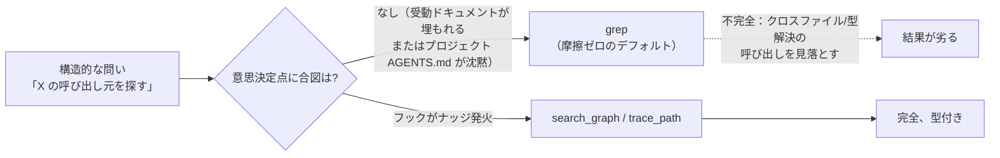
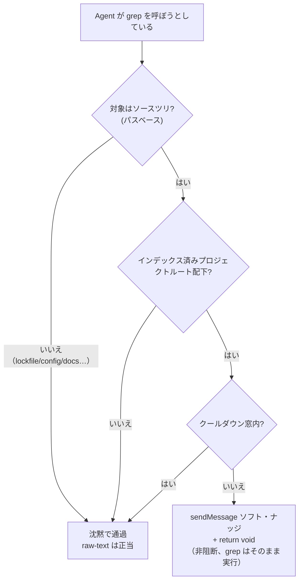

# 知識グラフ優先：意思決定ポイントのソフト・ナッジ・フックでツール選択を是正する

コーディング Agent に構造化されたコード知識グラフ（codebase-memory-mcp、ハイブリッド LSP 基盤で関数・クラス・呼び出し元・被呼び出し先・ルート・クロスサービス境界を解決する）を装備すると、一つの前提が紛れ込む。**Agent は自らそれを使う**、と。実際は違う。完全にインデックス済みでグラフが新鮮かつテキスト検索より厳密に優れたプロジェクトで、Agent は 30 セッション中わずか 4 回しかグラフに触れず、`grep` を 158 回呼んだ。

インデックスが問題ではなかった。新鮮で、完全で、到達可能だった。本当の問題は、**Agent が「検索」を決めた瞬間、より良いツールの存在を知らせるものが何もなかった**ことだ。受動的なドキュメント（「グラフを優先せよ、grep は禁止」）は通用しない――30 セッション中 26 がそれを無視した。

本記事は本番環境で稼働する修正を記録する。**grep の意思決定ポイントで一行のナッジを注入する、非阻断型の `PreToolUse` フック**である。ツールのチュートリアルではなく「診断とフロー」に焦点を当てる――なぜ能力が活性化しないのか、なぜルール強化が間違った介入レイヤーなのか、ソフト・ナッジをどう設計するか、構造的検索をパターンではなくパスでどう見分けるか、そしてプローブからランタイムまでどう検証するか。

> 推奨される読み順：まずパズルとデータを把握し、次に根本原因と「ルールがなぜ効かないか」に入り、最後にフック設計・API 契約・検証を再利用可能なエンジニアリング・パターンとして手元に置く。

---

## 一、パズル：能力は揃っているのに、誰も使わない

`codebase-memory-mcp` はプロジェクトをハイブリッド LSP 知識グラフにインデックスする。構造的な問い――*定義の検索、X の呼び出し元、X が呼ぶもの、デッドコード、モジュール境界*――に対しては、テキスト検索には見えないクロスファイルの型関係を解決できる分、`grep` より厳密に速く、より完全だ。

監査対象のプロジェクトは完全にインデックスされていた。それでも 30 セッションにわたり、Agent はグラフが存在しないかのように振る舞った。インデックス自体に問題はなかった。

| 確認項目 | 結果 |
| --- | --- |
| インデックス済み？ | はい――**ノード 34,361 / エッジ 120,215 / 82 MB** |
| 新鮮？ | はい――グラフの `head_sha` が**正確に**ライブの `git HEAD` と一致、状態 `ready` |
| 到達可能？ | はい――`xd://mcp__codebase_memory_mcp_*` デバイス群として露出 |

だから問いは決して「Agent は使えるか」ではなく、「**なぜ使わないのか**」だった。



---

## 二、データ監査：grep と知識グラフの実際の使用量

セッション転写ファイルに計装を仕掛け（各ツール呼び出しは `toolName` と引数を持つ `tool_execution_start` イベントとして記録される）、曖昧さのない答えを得た。

| 指標 | カウント |
| --- | --- |
| `grep` 呼び出し回数 | **158** |
| `codebase-memory` 呼び出し回数 | **22** |
| うち**構造的**な grep（定義/呼び出し元/被呼び出し先/用法の検索） | **約 80%（116–128 回）** |
| うち正当に**raw-text**な grep（lockfile、i18n、設定、ドキュメント、マイグレーション） | 約 10–15% |
| グラフを一度でも使ったセッション数 | **4 / 30** |
| その 22 回のグラフ呼び出しのうち、*単一*のアーキテクチャ探索セッションに集中していたのは | **18 回** |

**集中度こそが決定的な手がかりだ。** グラフは一度の意図的なアーキテクチャ整理で触れられ、その後 26 セッションで完全に忘れられた――1 回につき 16–28 回の `grep` を走らせる大規模リファクタも含め、ほぼすべて構造的だった。「ある Mapper の全呼び出し元を探す」「buildErrorMessage の定義を探す」「管理層の Promise.all の全使用箇所を探す」。いずれも `trace_path` / `search_graph` のほうが得意な仕事だ。

---

## 三、根本原因：受動ドキュメントは事前学習の先験に勝てない

影響度順に並べる。

1. **意思決定点での強制がない（主因）。** 反 grep の命令は*受動的な散文*としてしか存在しなかった――グローバルの `AGENTS.md` と、frontmatter に `globs` も `alwaysApply` も持たない*オンデマンド*のマネージド・スキル（だから自動発火せず、名指しで呼ぶ必要がある）。さらに悪いことに、実際に参照される*プロジェクト*の `AGENTS.md` は codebase-memory について**完全に沈黙**していた。つまり「呼び出し元を探す」瞬間、唯一活動している手がかりは `grep` へのモデルの事前学習の先験だけだった。データは、受動的な散文がその先験を覆せないことを示している。
2. **ツール表面の摩擦（寄与）。** `grep` は単一の `pattern` 引数を持つ一等の呼び出し1回だ。グラフのクエリは*JSON オブジェクトを手組みして `xd://` デバイスに書き込む*ことだ。より高い活性化コストは、確実に抵抗最小の経路に負ける。
3. **陳腐化/未インデックス――除外済み**（上表参照）。

---

## 四、なぜ「もっと良いルールを書く」ではダメなのか

直感は `AGENTS.md` の表現を強化するか、`alwaysApply` の TTSR ルールを追加することだ。*この*問題では、どちらも間違ったレイヤーになる。

- **ルールはターン単位・ファイルパス単位で注入され、ツール呼び出し単位ではない。** `alwaysApply` ルールは*毎ターン*リマインダを再注入する――まさにデータがチューニング・アウトすると示した「受動ドキュメントの反復」だ。`globs` でスコープしたルールは、一致するファイルが*編集/読み取り*された時に発火し、`grep` が走ろうとする瞬間ではない。
- **欠陥はツール意思決定の瞬間にあり**、そこに座れるのは `PreToolUse` フックだけだ。明確な「禁止」の散文を 30 セッション中 26 が無視した事実こそ、「散文を増やしても有効な介入にはならない」証拠である。

正しい介入の単位はこうだ。「Agent がソースツリに対して `grep` を呼ぼうとした瞬間に、より良い選択肢を浮かび上がらせる――ただし阻断しない。」

---

## 五、解法：ソフトな PreToolUse フック

### 5.1 表面の決定：ソフト、ハードではなく

omp の `tool_call` イベント（`PreToolUse` の等価物）は**2 つ**のチャネルをサポートし、両者は混同されやすい。

| チャネル | 仕組み | 効果 |
| --- | --- | --- |
| **ハード**（戻り型） | `return { block, reason }` | 呼び出しを阻断。Agent はそれを回避して再試行しなければならない。リスク：正当な `grep` の誤判定阻断。 |
| **ソフト**（副作用） | `pi.sendMessage({ customType, content, display, attribution })` **+ `return void`** | **LLM コンテキストに参加する**メッセージを注入。呼び出しはそのまま進む。誤判定リスクゼロ。 |

ソフト・チャネルは自明でないほうだ。`ToolCallEventResult` という戻り型は阻断指向なので、ざっと読むと「PreToolUse は阻断しかできない」と結論しがちだ。だが `pi.sendMessage()` は基礎の `HookAPI` にあり、`tool_call` を含む*任意の*イベントから呼べる。そして明示的に「LLM にメッセージ内容を見せたい時」のためのものだ。`void` を返すとは「阻断なし――続行」を意味する。この組み合わせこそ真の非阻断ナッジである。

我々は**ソフト**を選んだ。「阻断ではなく想起させる」を尊重し、正当な raw-text の `grep` を絶対に壊さず、最悪でも沈黙の no-op であって、ツールを引っ掛けることはない。

### 5.2 検出：パターンではなくパスベース

最初の述語草案は、コードファイルの拡張子か空でない pattern を要求した。ユニットテストが即座に欠陥を捉えた。構造的 grep のうち **59** しか検出できず、*まさにアンチパターンである 73 件を見逃した*――本物のアンチパターン grep は**ソースディレクトリ**（`backend-spring/src`）にスコープを絞り、**拡張子がなく**、しばしば**pattern が空**だからだ。正しい検出は**パスベース**である。ソースツリにスコープされた `grep` は、*それ自体が*構造的シグナルだ。

| 述語バージョン | 検出した構造的 grep | 判定 |
| --- | --- | --- |
| 拡張子または pattern を要求 | 59 / 158 | **不良**――ディレクトリ指定の grep を見逃す |
| **ソースツリへのパス かつ raw-text でない** | **116 / 158** | 手作業のベースライン（約 127）に一致。差は保守的（リポジトリ全体/`src` なしのモジュールルート） |

### 5.3 許可リスト

| `grep` の対象 | 挙動 |
| --- | --- |
| `backend-spring/src`、`console/src`、`management/src`、`shared/*/src` | **ナッジ**（構造的） |
| `**/pnpm-lock.yaml`、`**/*.json/yaml/toml`、`**/*.md`、`migrations/`、`locales/`、`i18n/`、`wiki/`、`dist/build/target/`、`node_modules/`、`.omp/`、`*.log`、`*.css/scss`、`pom.xml`、`docker-compose*`、`tsconfig*`、`vite.config*` | **沈黙**（raw-text は正当） |

raw-text はソースツリの*内部*でも勝つ（例：`management/src/i18n/locales` → 沈黙）。ナッジはさらに 10 分のクールダウン（スパム防止）を持ち、インデックス済みのプロジェクトルート配下でのみ発火する。



---

## 六、実装：フックのコードと API 契約

フックは `hooks/pre/graph-first-nudge.ts` に配置する（omp は**セッション開始時**に `hooks/pre/*.ts` を自動ロードする――ホットリロードではない。新規追加のフックは実行中のセッションから見えず、新しいセッションで検証が必要）。以下は公開用にサニタイズした実装で、インデックスルートは実行時に CLI から発見し、機械固有のパスを一切ハードコードしない。

```ts
import type { HookAPI } from "@oh-my-pi/pi-coding-agent/extensibility/hooks";

// 一行のリマインダ：構造的検索ではグラフを優先し、grep は raw-text のフォールバックにのみ使う。
const REMINDER =
  "codebase-memory nudge: this project is indexed in the code knowledge graph. " +
  "For STRUCTURAL lookups — find definition, callers, callees, references, type, " +
  "module/package boundary — use the graph FIRST, then grep only as a raw-text fallback:\n" +
  "  - xd://mcp__codebase_memory_mcp_search_graph    (query or name_pattern -> qualified_name)\n" +
  "  - xd://mcp__codebase_memory_mcp_trace_path       (function_name + direction inbound/outbound)\n" +
  "  - xd://mcp__codebase_memory_mcp_get_architecture (clusters / layers / packages)\n" +
  "Raw-text grep on lockfiles, config, docs, i18n, migrations, logs, or generated output is fine.";

// パスベース：ソースツリにスコープされた grep こそが構造的シグナル。
// これらのソースツリ接頭辞はプロジェクトのレイアウトに合わせて調整する。
const SOURCE_TREE_RE = /(backend-spring[\\/]src|console[\\/]src|management[\\/]src|shared[\\/].*?[\\/]src)/;
const RAW_TEXT_RE =
  /(lock|\.json|\.yaml|\.yml|\.toml|\.env|\.mdx?|migrations|locales|i18n|wiki|[\\/]dist[\\/]|[\\/]build[\\/]|[\\/]target[\\/]|node_modules|\.omp|sessions|\.log|\.css|\.scss|pom\.xml|docker-compose|tsconfig|vite\.config|\.sh$)/;

let indexedRoots: string[] = [];   // 実行時に cli list_projects から埋める
let lastNudgeAt = 0;
const COOLDOWN_MS = 10 * 60 * 1000;

function norm(p: string) {
  return p.replace(/\\/g, "/").replace(/^~/, process.env.HOME ?? "~");
}
function isUnderIndexedRoot(cwd: string) {
  const c = norm(cwd);
  return indexedRoots.some(r => { const root = norm(r); return c === root || c.startsWith(root + "/"); });
}
function isStructuralGrep(input: Record<string, unknown>) {
  const path = norm(String(input.path ?? "")), pattern = String(input.pattern ?? "");
  if (!SOURCE_TREE_RE.test(path)) return false;
  if (RAW_TEXT_RE.test(path) || RAW_TEXT_RE.test(pattern)) return false;
  return true;
}

export default function graphFirstNudge(pi: HookAPI) {
  // セッション開始時にインデックスルートを更新（機械固有パスのハードコード不要）
  pi.on("session_start", async () => {
    try {
      const res = await pi.exec("codebase-memory-mcp", ["cli", "list_projects"]);
      const roots = [...String(res.stdout ?? "").matchAll(/"root_path"\s*:\s*"([^"]+)"/g)].map(m => m[1]);
      if (roots.length) indexedRoots = roots;
    } catch { /* 空リストを保持。フックは no-op に退化 */ }
  });

  pi.on("tool_call", async (event, ctx) => {
    try {
      if (event.toolName !== "grep") return;
      if (!isStructuralGrep(event.input)) return;
      if (!isUnderIndexedRoot(ctx.cwd)) return;
      if (Date.now() - lastNudgeAt < COOLDOWN_MS) return;
      lastNudgeAt = Date.now();
      pi.sendMessage({                     // ソフト：LLM コンテキストに参加、非阻断
        customType: "graph-first-nudge",
        content: REMINDER, display: true, attribution: "agent",
      });
      // return void → grep は通常どおり実行
    } catch { /* ナッジで grep を壊すことは絶対にない */ }
  });
}
```

### 6.1 フック API 契約（型定義と照合済み）

| シンボル | 形 | 出典 |
| --- | --- | --- |
| `ToolCallEvent` | `{ type:"tool_call", toolName, toolCallId, input: Record<string,unknown> }` | `hooks/types.d.ts` |
| `HookContext.cwd` | `string`――プロジェクトルート | `hooks/types.d.ts` |
| `ToolCallEventResult` | `{ block?, reason? }`――**ハード**経路 | `shared-events.d.ts` |
| `HookAPI.sendMessage` | **LLM コンテキストに参加する** `CustomMessageEntry` を注入。`triggerTurn` の既定は `false`（ループ途中でも安全） | `hooks/types.d.ts` |
| フックの位置 | `hooks/{pre,post}/*.ts`（グローバル）/ `.omp/hooks/{pre,post}/*.ts`（プロジェクト）。セッション開始時にロード | `hooks/loader.d.ts` |

間違えやすい二点。(1) `tool_call` からの `sendMessage` は**ソフト**・チャネルであり、パッケージ内の正規用法であって未検証ではない。(2) フックは**起動時**にロードされるため、新規追加のフックは実行中のセッションから見えず、新しいセッションで検証しなければならない。

---

## 七、検証：プローブからランタイムへ

修正は三層で証明しなければならず、いずれも省略できない。

```bash
# 1. 前提証明：グラフが grep が探していた情報を瞬時に返す
#    （例：Mapper シンボルを検索し、ファイルと行範囲付きの qualified 結果を得る）
codebase-memory-mcp cli search_graph '{"project":"PROJECT","query":"SomeMapper"}'

# 2. 論理証明：mock-pi の自己プローブで合成イベントに対し個別に表明
bun /tmp/graph-first-nudge.probe.mjs   # 期待：6/6 PASS

# 3. ランタイム証明：新しいセッションでソースツリを grep し、ナッジが描画され
#    grep も通常どおり返ることを確認（非阻断のエンドツーエンド確認）
```

1. **mock-pi 自己プローブ**――ファクトリをインポートし、mock `pi` にハンドラを登録し、6 つの合成 `tool_call` イベントを発火。結果：**6 / 6 PASS**（構造的 → ナッジ。lockfile / ソースツリ内 i18n / 非 grep / 未インデックス cwd / クールダウン再発火 → 沈黙）。
2. **前提証明**――ある Mapper シンボルに `search_graph` を呼ぶと、**106** 件の qualified な結果（ファイルと行範囲付き）が瞬時に返った。まさに過去3回の `grep` が苦心して探していた情報である。
3. **ライブ・ランタイムテスト**――新しいセッションで `backend-spring/src` に対し `grep class.*Service` を走らせるとフックが発火。`graph-first-nudge` ブロックが描画され（`[P] graph-first-nudge`）、**かつ**完全な grep 結果がその下に返ってきた――非阻断がエンドツーエンドで確認された。

---

## 八、教訓と結語

この修正で最も難しかったのはフックを書くことではない。**能力は活性化と同じではない**と認識することだった。残す価値のある教訓は五つ。

- **能力 ≠ 活性化。** より優れ、新鮮で、到達可能なツールも、意思決定の瞬間にそれを想起させるものがなければ無価値だ。*可用性*ではなく*使用率*を測れ。
- **意思決定点のフックが受動ドキュメントに勝る。** モデルの事前学習の先験が一方を向いている時、散文――「禁止」の散文でさえ――は通用しない（30 セッション中 26）。合図を決定が下される場所に置け。
- **歯が必要でない限りソフト・チャネルを優先せよ。** `sendMessage` + `return void` は、誤判定阻断のリスクを一度も冒さずに誘導する。誤った呼び出しが本当に回復不能な時だけ `{block, reason}` に手を伸ばせ。
- **安定したシグナルで検出せよ。**「この `grep` は構造的か」に対する安定シグナルは*パスのスコープ*であり、pattern のテストでもファイル拡張子でもない。本物のアンチパターン grep はディレクトリを指名し、pattern を空のままにする。
- **実行で検証し、次にランタイムで検証せよ。** mock-pi プローブは論理を証明し、本物のセッションだけがロードと到達を証明する。fail-soft で出荷し、両者の隙間を無害に保て。

> このパターンは「grep を超えるグラフ」にとどまらない。モデルにより強いツールがありながら、より弱いデフォルトに退き続ける場面すべて――テキスト検索より LSP 移動、コミット前のテスト実行、手編集より型認識リファクタ――に同じ意思決定点のソフト・ナッジが適用できる。介入の単位は常に*決定が下されるその瞬間*である。
