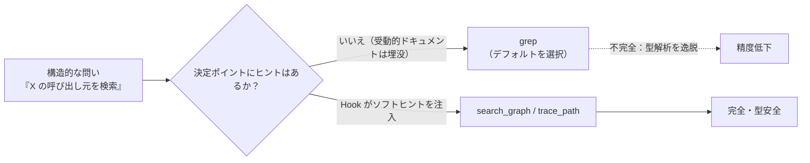

# ナレッジグラフ優先：意思決定ポイントのソフトヒント Hook によるツール選択の是正

コードナレッジグラフ（`codebase-memory-mcp`：関数、クラス、呼び出し関係、ルーティングを解析可能）を Coding Agent に導入した際、**Agent は主的にこれを利用するか？** という疑問が生じます。実際のデータによれば、答えは「いいえ」です。グラフが新鮮でテキスト検索より優れているプロジェクトにおいても、30 セッションの中で Agent がグラフに触れたのはわずか 4 回であり、`grep` は 158 回呼び出されていました。

問題はインデックスではありませんでした。真の原因は、**Agent が「検索」を決定したその瞬間に、より良いツールが存在することを示すプロンプトが存在しなかった** ことにあります。受動的なドキュメント（「グラフを優先し、grep を避けてください」）は無視されがちです。

本記事では、**非遮断の `PreToolUse` Hook を使用し、`grep` 実行の意思決定ポイントでソフトヒントを注入する** 実践的な解決策を記録します。

---

## 一、謎：準備された機能と使われない現実

`codebase-memory-mcp` はプロジェクトをハイブリッド LSP ナレッジグラフとしてインデックス化します。「定義の検索」「X の呼び出し元」「死にコード」といった構造的な問いに対して、ファイルを超えた型関係を解析できるため、`grep` より高速かつ完全です。

監査対象のプロジェクトは完全にインデックス化されていましたが、30 セッションにおいて Agent はグラフが存在しないかのように振る舞いました：

| チェック項目 | 結果 |
| --- | --- |
| インデックス化済みか？ | はい — **34,361 ノード / 120,215 エッジ / 82 MB** |
| 新鮮か？ | はい — グラフの `head_sha` は `git HEAD` と完全一致 |
| 到達可能か？ | はい — `xd://mcp__codebase_memory_mcp_*` デバイスとして露出 |

したがって、問題は「使えるか」ではなく**「なぜ使わないのか」** でした。

```mermaid
flowchart LR
  Q["構造的な問い<br/>『X の呼び出し元を検索』"] --> DEC{"決定ポイントにヒントはあるか？"}
  DEC -- "いいえ（受動的ドキュメントは埋没）" --> GRP["grep<br/>（デフォルトを選択）"]
  DEC -- "Hook がソフトヒントを注入" --> GPH["search_graph / trace_path"]
  GRP -. "不完全：型解析を逸脱" .-> R1["精度低下"]
  GPH --> R2["完全・型安全"]
```

---

## 二、データ監査：grep とナレッジグラフの実際の利用状況

セッションログの分析により、明確な回答が得られました：

| 指標 | 件数 |
| --- | --- |
| `grep` 呼び出し回数 | **158** |
| `codebase-memory` 呼び出し回数 | **22** |
| うち **構造的** な grep（定義 / 呼び出し元の検索） | **約 80%（116–128 回）** |
| うち **生のテキスト** 検索（i18n, 設定, ログ） | 約 10–15% |
| グラフを利用したセッション数 | **4 / 30** |
| グラフ呼び出しの **単一アーキテクチャセッション** への集中度 | **18 回** |

グラフ呼び出しの大部分は 1 回の意図的なアーキテクチャ整理に集中し、残りの 26 セッションでは完全に忘却されていました。

---

## 三、根本原因：受動的ドキュメントは学習済みの事前知識に勝てない

影響度順の根本原因：

1. **意思決定ポイントでの強制力の欠如（主因）。** 反 grep のルールは `AGENTS.md` 内の受動的な文章としてしか存在せず、検索を決断した瞬間にモデルが持つ `grep` の事前知識に敗北しました。
2. **ツールの呼び出し摩擦（副因）。** `grep` は単一引数のシンプルな呼び出しですが、グラフ検索は JSON ペイロードの構築が必要でした。
3. **鮮度・インデックス未完了 — 排除済み。**

---

## 四、なぜ「ルールの強化」では解決しないのか

`AGENTS.md` の表現を強化したり `alwaysApply` ルールを追加するアプローチは、階層が異なります：

- **ルールはターンごとまたはファイルパスごとに注入され、ツール呼び出しごとではない。**
- **欠陥はツール選択を決める瞬間に発生する** ため、`PreToolUse` Hook のみがその位置で干渉できます。

---

## 五、解決策：ソフト PreToolUse Hook

### 5.1 通路の選択：ハードではなくソフト

OMP の `tool_call` イベントは 2 種類のチャネルをサポートします：

| チャネル | メカニズム | 効果 |
| --- | --- | --- |
| **ハード**（戻り値） | `return { block, reason }` | 呼び出しを遮断。正規の `grep` を誤遮断するリスク。 |
| **ソフト**（副作用） | `pi.sendMessage(...)` + `return void` | LLM コンテキストにメッセージを注入し、実行は継続。誤遮断リスクゼロ。 |

誤遮断を防ぎつつ適切なガイドを提供するため、**ソフト** チャネルを選択しました。

### 5.2 パスベースの検出

拡張子によるフィルタリングではなく、ソースディレクトリ（`backend-spring/src`）への範囲指定を検知する **パスベースの検出** を導入し、構造的検索のシグナルを正確に捉えます。

---

## 六、まとめ

このパターンは「グラフ vs grep」に留まりません。Agent がより優れたツールを持ちながら弱いデフォルトに戻ってしまうあらゆる場面で、意思決定ポイントにおけるソフトヒント Hook は非破壊的で極めて効果的な介入メカニズムとなります。
