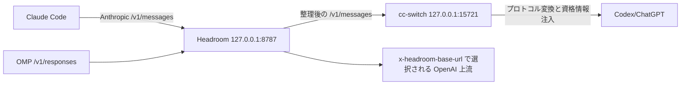

このページは、特定の Headroom provider proxy デプロイにおける共存契約を記録する。Claude Code は cc-switch に直接要求を渡さず、まず Headroom を経由する。OMP の Responses パスも同じ Headroom 入口に入り、request 単位の上流ルーティングを受ける。結論は、**1 リクエストに整理責任者は 1 つだけ**ということだ。Headroom が圧縮と整理を担当し、cc-switch は Anthropic↔OpenAI プロトコル変換と資格情報注入だけを担当する。本ページはバージョン依存の `provisional` 総合であり、すべての Headroom または cc-switch バージョンのデフォルト挙動ではない。

## チェーンと責任境界



| パス        | プロトコルと入口                                | Headroom の責務                        | 後続段                                                     | 推測してはいけないこと                       |
| ----------- | ----------------------------------------------- | -------------------------------------- | ---------------------------------------------------------- | -------------------------------------------- |
| OMP         | OpenAI `/v1/responses`、入口 `127.0.0.1:8787`   | request 単位の情報で整理しルーティング | `x-headroom-base-url` が指定する OpenAI 上流               | OMP discovery が必ず Headroom に引き継がれる |
| Claude Code | Anthropic `/v1/messages`、入口 `127.0.0.1:8787` | リクエスト内容を整理                   | cc-switch `127.0.0.1:15721` がプロトコル変換と資格情報注入 | cc-switch が圧縮を担当する                   |

したがって、同じ provider に別の application-level compression bridge を重ねてはならない。そうしないと、リクエストが二つの段で順に整理され、savings、キャッシュプレフィックス、失敗原因の帰属が難しくなる。

## cc-switch reconciler

cc-switch proxy モードは `~/.claude/settings.json` の `ANTHROPIC_BASE_URL` を `http://127.0.0.1:15721` に書き込む。Headroom で `HEADROOM_CC_SWITCH_RECONCILE=1` を有効にすると、reconciler は次の復旧チェーンを構築する：

1. cc-switch が書き込んだ `15721` を読み、Headroom の現在の Anthropic 上流として保存する。この上流は request ごとに読み取られ、proxy の再起動は不要。
2. `ANTHROPIC_BASE_URL` を `http://127.0.0.1:8787` に戻し、他の環境フィールド、hooks、プラグイン設定は保持する。
3. すでに 8787 の場合は書き込みをスキップし、watcher の自己トリガーを防ぐ。
4. Claude Official（`{"env":{}}`）に切り替えた場合は OAuth 保護のためデフォルトで直結を許可し、`HEADROOM_CC_SWITCH_ROUTE_OFFICIAL=1` を明示的に設定したときだけ Headroom 経由を強制する。

資格情報は Claude Code → Headroom → cc-switch の順にそのまま渡る。Headroom は実際の Codex 資格情報を読み取らず保存もしない。OMP の `/v1/responses` と Claude Code の `/v1/messages` は異なるプロトコルルートを使い、Anthropic 上流の状態を共有しない。

## systemd のセキュリティ上のトレードオフ

元の unit は `ProtectHome=tmpfs` でユーザー home を隠していた。reconciler が `settings.json` を書き戻せるようにするため、次を追加する：

```ini
BindPaths=%h/.claude
```

`BindPaths` はデフォルトで書き込み可能な bind なので、実際の `~/.claude` がサービスの mount namespace にマッピングされる。代償として、proxy サービスがそのディレクトリのセッション履歴、`.mcp.json` などのファイルを読み取れる。サービスは依然として現在のユーザーで実行され、`NoNewPrivileges`、`ProtectSystem=strict`、`PrivateDevices`、`UMask=0077` などの制限も維持される。これは権限昇格ではないが、`ProtectHome=tmpfs` と比べた defense-in-depth の後退ではある。

### ロールバック

1. Claude Code の新規リクエストを止め、ロールバック中に reconciler が再トリガーされるのを防ぐ。
2. 設定から `HEADROOM_CC_SWITCH_RECONCILE=1` を削除する。
3. unit の `BindPaths=%h/.claude` を削除し、user unit を再インストール／再ロードしてサービスを再起動する。
4. 設定バックアップから `~/.claude/settings.json` の元の `ANTHROPIC_BASE_URL`（`http://127.0.0.1:15721`）を復元する。

ロールバック前に設定バックアップを保持し、空オブジェクトでユーザーの hooks、プラグイン、その他の環境フィールドを上書きしない。

## 最小検証

検証はランタイム上流と実際のリクエストチェーンの両方を対象にしなければならない：

```bash
curl --fail --silent http://127.0.0.1:8787/admin/upstream
```

期待されるコア結果は `cc_switch_reconcile=true` で、`anthropic` と `captured_upstream` の両方が `http://127.0.0.1:15721` を指すこと。その後、`var/headroom/logs/proxy.log` に次の両方が存在することを確認する：

```text
path=http://127.0.0.1:15721/v1/messages
path=/v1/messages status=200
```

`/health` や HTTP 200 だけでは、リクエストが cc-switch に到達したことを証明できない。`settings.json` を読むだけでもランタイム上流の証拠の代わりにはならない。プロジェクトの `./bin/validate` は `PASS validation` で終わるべきでもある。

## 証拠と不確実性

- **情報源の事実**：固定プロジェクトコミットと同日の脱同定化されたランタイム観測が、二つのパス、reconciler の書き戻し方向、`BindPaths` のセキュリティコスト、`/v1/messages → 127.0.0.1:15721` の成功リクエストチェーンを確認した。
- **本ページの総合**：共存問題を「Headroom の単一整理 ＋ cc-switch のプロトコル／資格情報変換」としてまとめ、静的設定、ランタイム上流、実際のリクエスト、systemd の分離を別々に検証する。
- **不確実性**：ポート、環境変数、settings schema、ログフィールド、Headroom/cc-switch の書き換え時機はバージョンにより変わり得る。本ページはバージョン間互換性を主張せず、一度のデプロイ証拠を公式デフォルト契約へ拡張もしない。

## 関連ページ

- [Headroom 単一ポート総合](/ja/note/headroom-single-port-evolution)
- [Headroom ルート永続化の総合](/ja/note/omp-headroom-persistence)
- [Headroom 0.34 圧縮・取得契約](/ja/note/headroom-compress-retrieve-contract)
