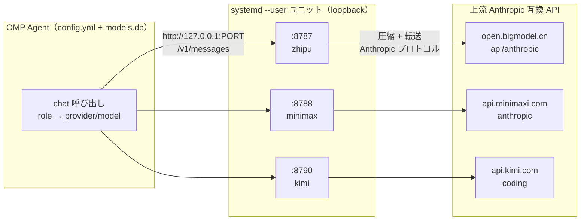
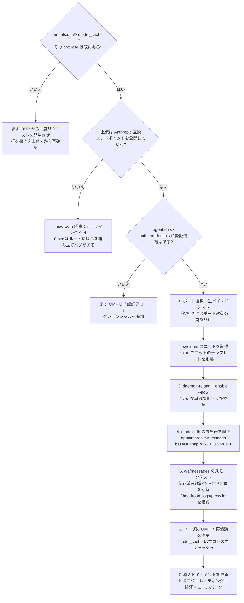

# Headroom × OMP：カスタムモデルプロバイダの導入とガバナンス全フロー

複数の大規模言語モデルプロバイダを Agent フレームワークで編成しようとすると、すぐに現実の壁にぶつかる。プロバイダごとにプロトコル、認証、キャッシュ能力がバラバラだ。中国圏のプロバイダ（Zhipu、MiniMax、Kimi）は Anthropic 互換エンドポイントを提供していることが多いが、プロンプトキャッシュ、コンテキスト圧縮、ツール結果キャッシュの対応度はまちまちである。一方でトラフィックを上流に直接流すと、統一的なガバナンスを行える中間層を手放すことになる。

本記事では、本番環境で稼働している構成を記録する。**Headroom 圧縮プロキシ層を経由して、カスタムモデルプロバイダを OMP（Oh My Pi）Agent フレームワークに統合する**方法である。インストール手順ではなく「フロー」――どう導入し、どうルーティングし、どう制約をかけ、どう運用するか、そしてどこに罠があるかに焦点を当てる。

> 推奨される読み順：まず全体アーキテクチャと四層アーティファクトを把握し、次に導入フローに入り、最後に制約実施と運用の罠を日常のリファレンスとして手元に置く。

---

## 一、背景：なぜ圧縮プロキシ層が必要なのか？

OMP は、ロール（role）に基づいてリクエストを異なる provider/model にルーティングする Agent オーケストレーションフレームワークである。理想的には、すべてのプロバイダが以下を備えているべきだ：

- **プロンプトキャッシュ**：繰り返されるシステムプロンプトやツール定義を再課金しない；
- **コンテキスト圧縮**：長すぎる会話を自動圧縮し、重要な情報を残す；
- **ツール結果キャッシュ**：同じツール呼び出しの結果を再利用し、レイテンシとコストを下げる。

しかし現実には、すべての上流がこれらをネイティブにサポートしているわけではない。Headroom の役割はこの隙間を埋めることだ。ローカルリバースプロキシとして、通過するすべてのトラフィックに対して透過的に圧縮、キャッシュ、プロトコル正規化を行い、OMP 側がプロバイダごとの能力差を意識しなくて済むようにする。

重要な設計原則が一つある：**ガバナンスが必要なプロバイダだけをプロキシ経由にし、それ以外は直接接続する**。本構成では、三つの中国圏プロバイダだけが Headroom を経由し、それ以外（Vertex Claude、ローカル Ollama、LM Studio、llama.cpp など）はすべて直接接続で一切変更しない。これにより能力を統一しつつ、プロキシの複雑さと影響範囲を最小集合に抑える。

---

## 二、全体アーキテクチャ：四層アーティファクトと責務の境界

OMP は三つの中国圏プロバイダを、プロバイダごとの Headroom 圧縮プロキシ経由でルーティングする。それ以外のプロバイダはすべて直接接続である。



このアーキテクチャを理解する鍵は、**四つのアーティファクトがそれぞれ何を担い、何を担わないか**を明確にすることだ。責務が曖昧になると、トラブルシューティングは立ち行かなくなる。

| 層 | アーティファクト（ファイル/オブジェクト） | 担うもの | 担わないもの |
| --- | --- | --- | --- |
| **1. ロール→モデル束縛** | `config.yml`（`modelRoles`、`task.agentModelOverrides`、`retry.fallbackChains`） | 各 OMP ロールが使う provider/model；モデル障害時のフォールバックグラフ | ネットワークルーティング |
| **2. モデル→ルート束縛** | `models.db` テーブル `model_cache`（`provider_id`、`models[].api`、`models[].baseUrl`） | 各 provider のモデルごとにプロトコル（`anthropic-messages` / `openai-completions`）+ base URL | 認証、ロール割り当て |
| **3. プロキシプロセス** | systemd ユニット `headroom-proxy-*.service`（プロバイダごとに一つ） | 待受ポート、上流 URL、provider 名、プロキシ環境、再起動ポリシー | モデルの有無 |
| **4. 上流 API** | プロバイダの Anthropic 互換エンドポイント | 実際のモデル推論 | Headroom の存在を知っているか |

この四層に加え、二つの**直交する**関心事がある：

- **クレデンシャルストア**（`agent.db` テーブル `auth_credentials`）：Headroom は OMP が送る認証ヘッダ（`x-api-key` または `Authorization: Bearer`）を転送するだけで、**自ら認証を注入することはない**。OAuth 行は `{access, refresh, expires}` を格納し、api_key 行は `{"key":"..."}` を格納する。
- **CLI プロファイル**（`~/.config/claude-profile/*.json`）：独立した `claude` CLI 専用であり、OMP 自身は読み込まない。

> ルーティング問題のトラブルシューティングにおける第一歩は、症状がどの層に属するかを特定することである。束縛の誤り（層 1）、ルートの誤り（層 2）、プロキシの停止（層 3）、上流の利用不可（層 4）のいずれか。

---

## 三、エンドツーエンドの導入フロー：新しいカスタムプロバイダを追加する

新しいプロバイダの導入とは、本質的に四層のアーティファクトを順に所定の位置に置くことである。以下の決定木は全体フローを示し、各ステップがどの層の問題を解決するかを明示する。



このフローには、**決定木で展開されていないが間違いやすい**ポイントがいくつかある。個別に説明する：

### 3.1 ポート選択：まず生バインドテストを行う

`ss` や `/proc/net/tcp` がポート空きと報告するからといって、それを鵜呑みにしてはいけない。WSL2 のミラードネットワークでは、「システムはポート空きと見なしているのに、実際にバインドすると `EADDRINUSE` が出る」という不可解な状況が起きる。正しい做法は Python で生バインド検証を行うことだ：

```python
import socket
s = socket.socket(socket.AF_INET, socket.SOCK_STREAM)
s.bind(("127.0.0.1", PORT))  # 例外が出なければ本当に利用可能
s.close()
```

特に一部のポートは Windows 側のデーモンによって「幽霊占有」される。WSL のネットワークスタックからは見えないが、実際にリクエストを送ると認証が剥がされてしまう。こうなったら、8790 以上のポートに切り替える。

### 3.2 models.db のパッチは冪等にする

`models.db` の `model_cache` 行を修正する際、パッチは**冪等**（副作用なしに再実行可能）にし、`authoritative` フィールドを `1` に設定しなければならない。`0` のままだと、OMP は適切なタイミングで同梱の静的レジストリからプロバイダを再取得し、**こっそり `baseUrl` と `api` を元に戻してしまう**。このとき Headroom はトラフィックを一切受け取らず、エラーも出ないため、最も診断困難なサイレント障害となる。

### 3.3 変更後は必ず OMP を再起動する

`model_cache` は OMP の**プロセス内キャッシュ**である。`models.db` を修正しても、実行中の OMP プロセスはその変化を感知せず、再起動しないと反映されない。そして Agent 自身は再起動できない――このステップはユーザに委ねるしかない。

---

## 四、モデル制約の実施：あるプロバイダを「特定モデルのみ使用可」にする

本構成で最も見落とされやすく、かつ最も問題が出やすい部分がこれだ。「あるプロバイダは特定のモデルしか使えない」という業務ポリシー（例：Zhipu プロバイダは `glm-5.2` のみ使用可、MiniMax プロバイダは制限なし）のとき、`config.yml` の**三つの面**をすべて同時にコンプラ順守させなければならず、しかも**順序が重要**である。

### 4.1 三つのモデル参照面

| 面 | 役割 | デフォルトの状態 |
| --- | --- | --- |
| `modelRoles` | ロールごとの主モデル（default/slow/plan/smol/commit/vision/advisor/designer/tiny/task） | 通常は既にコンプラ順守――主ロールは明示的な選択 |
| `task.agentModelOverrides` | サブエージェント単位の上書き（scout/sonic/cavecrew/reviewer/architect/planner/task） | 通常は既にコンプラ順守 |
| `retry.fallbackChains` | ロールごと **かつ** モデルごとのフォールバックリスト | **最も一般的な違反箇所**――時間とともに禁止参照が蓄積する |

最初の二つの面は明示的な設定であり、問題は起きにくい。**本当の地雷原は `retry.fallbackChains` だ**。主ロールを許可されたモデルに移動させても、対応するフォールバックチェーンには古い禁止モデルの参照が残っていることがある。これらは通常時は発火せず（主モデルが失敗したときだけフォールバックが走る）、極めて隠蔽されやすい。

### 4.2 書き換えルール：各違反参照をどう置換するか

「違反参照」のタイプごとに、対応する置換戦略がある：

| 違反参照のタイプ | 置換先 |
| --- | --- |
| 同一プロバイダのテキストモデル（例：`glm-5.1`、`glm-4.7`） | 同等以上の思考段階の許可モデル（例：`glm-5.2:max`） |
| 同一プロバイダのビジョンモデル（例：`glm-5v-turbo`） | **補助プロバイダのみ**――非ビジョンの許可主モデルには絶対に戻さない（`glm-5.2` にネイティブのビジョン能力はない） |
| 同一プロバイダの小/高速モデル（例：`glm-4.5-air`） | 補助プロバイダの高速段階（例：`minimax-code-cn/MiniMax-M2.5-highspeed:low`） |
| もはやどのロールも参照しない死んだチェーンキー | チェーンブロック全体を削除 |

追加で二つのルール：

- **循環フォールバックルール**：あるチェーンのキー自体が `provider/allowed-model:` である場合、そのフォールバックリストに**再び** `provider/allowed-model:` を含めてはならず、補助プロバイダを使うこと。
- **ワイルドカードチェーン**（`provider/*:`）はフォールバック**対象**でありモデル参照ではないため、セーフティネットとして保持する。

### 4.3 必須の検証三連

`config.yml` 編集後、以下の三つのチェックを順に走らせなければならない。いずれも欠かせない：

```bash
# 1. YAML が正しくパースされる
python3 -c "import yaml; yaml.safe_load(open('config.yml')); print('YAML OK')"

# 2. 違反参照ゼロ（パターンはアクティブな制約に合わせて調整）
grep -nE "zhipu-coding-plan/(glm-5\.1|glm-5:|glm-4\.5-air|glm-4\.7|glm-5v-turbo|glm-5-turbo)" config.yml
# 空でなければならない

# 3. 外科的 diff（理論上は retry.fallbackChains のみ変化するはず）
diff config.yml.bak config.yml
```

> **反映タイミング**：OMP はセッション単位で `config.yml` を読み込む――変更は**次のセッションで自動反映**され、再起動は不要である。現在のセッションは旧設定のまま動く。

---

## 五、日常運用：サービス制御とヘルスプローブ

### 5.1 サービス制御

三つのプロキシユニットはいずれも `systemd --user` サービスであり、操作パターンは共通している：

```bash
# 状態確認
systemctl --user status  headroom-proxy-zhipu headroom-proxy-minimax headroom-proxy-kimi

# 再起動 / 停止
systemctl --user restart headroom-proxy-zhipu headroom-proxy-minimax headroom-proxy-kimi
systemctl --user stop    headroom-proxy-zhipu headroom-proxy-minimax headroom-proxy-kimi

# あるユニットのログをリアルタイム追跡
journalctl --user -u headroom-proxy-kimi -f
```

### 5.2 ヘルスと統計のプローブ

各プロキシは二つの主要エンドポイントを公開する：`/livez`（存活プローブ）と `/stats`（圧縮/コスト/レイテンシ統計）。

```bash
# 一括存活確認
for port in 8787 8788 8790; do
  echo "$port: $(curl -fsS http://127.0.0.1:$port/livez)"
done

# 単一プロキシの詳細統計（jq で JSON を整形）
curl -fsS http://127.0.0.1:8787/stats | jq .
# トップレベルキー：summary, agent_usage, savings, requests, tokens, latency,
# overhead, ttfb, prefix_cache, cost, persistent_savings, display_session
```

CLI による代替もある：`headroom doctor --port 8787`。

### 5.3 リクエスト単位のログトレイル

`~/.headroom/logs/proxy.log` がすべてのリクエストを記録する。「ルーティング正しい + 圧縮有効」を確認するには二行を見る：

```text
event=proxy_inbound_request path=/v1/messages   ← Headroom がリクエストを受信
[hr_…] PERF model=<model-id> total_ms=…         ← 転送済み + 圧縮済み
```

繰り返しリクエストで `transforms=none` + `cache_hit_pct=100` が見えれば、キャッシュパイプラインがヒットしている証拠である。

### 5.4 `/readyz` に騙されないこと

`/readyz` の `upstream` チェックは**常に unhealthy を返す**。このプローブが叩くのは設定された上流ではなく、デフォルトの Anthropic URL だからだ。**信頼できるのは `/livez` + 実際のリクエスト流量のみ**であり、`/readyz` は見ないこと。

---

## 六、既知の罠と得られた教訓

以下の表は、本番環境で実際に踏んだ罠を凝縮したものだ。それぞれが診断困難な障害を引き起こしたことがあり、リリース前チェックリストとして扱うことを勧める。

| 罠 | 症状 | 緩和策 |
| --- | --- | --- |
| **WSL2 ミラードネットのポート幽霊占有** | `ss`/`/proc/net/tcp` はポート空きと表示するが、Headroom のバインドで `EADDRINUSE` | Python `socket.bind(("127.0.0.1", PORT))` で生バインドテスト。8789 等のポートは Windows 側デーモンが保持しており、新規プロキシは 8790+ を使う |
| **Headroom の OpenAI ルートパスバグ** | `/paas/v4` や `/coding/v1` の base が誤組み立てされ → 404 | すべてのプロバイダで `api: anthropic-messages` に統一。上流に Anthropic エンドポイントがなければ Headroom 経由でルーティングできない |
| **`RestartSec=3` によるクラッシュループ** | stop/restart 後にユニットが 50 回以上の再起動ループに入る | `RestartSec=8` とし、TCP TIME_WAIT のクリアに十分な時間を与える |
| **OMP が `model_cache` をメモリキャッシュする** | ルーティングパッチを変更しても実行中の OMP に反映されない | ユーザに OMP の再起動を指示する。Agent は自己再起動できない |
| **`authoritative=0` によるサイレントロールバック** | OMP が静的レジストリからプロバイダを再取得し、`baseUrl`+`api` をこっそり戻す。Headroom はトラフィックを受け取らずエラーも出ない | パッチで `authoritative` を `1` に設定する |
| **8789 上の幽霊 Windows プロキシ** | `/livez` は 200 を返すが、実際のリクエストはすべて 401（認証が剥がされる） | `ss -tlnp` でバインドされた PID が自分の systemd ユニットの MainPID か確認する。`/livez` 単体を信じない |
| **context-mode と Headroom の二重圧縮** | モデル出力が過度に簡略化され、コンテキストが欠落する | 一度に一层ずつ無効化して切り分ける：Headroom ユニットを止めるか、`context-mode` プラグインを無効化する |
| **agent.db の OAuth フィールド形状** | コードが `access_token`/`refresh_token` を期待しても見つからない | 行は `{access, refresh, expires}` を格納（`_token` 接尾辞なし）。api_key 行は `{"key":"..."}` を格納 |

---

## 七、結び

複数の異種 LLM プロバイダを統一管理する難しさは、「つなぐこと」にはない。**ガバナンス**にある：

- **導入**を支えるのは明確な四層の責務分割――各アーティファクトが何を担うかを押さえれば、問題の半分は位置づけできる；
- **ガバナンス**を支えるのは三つのモデル参照面の同時コンプラ順守、とりわけ忘れられやすいフォールバックチェーン；
- **安定性**を支えるのは、罠をチェックリストに結晶化することであって、「たまたま壊れなかった」に頼ることではない。

「層別の責務配置、制約の閉ループ化、罠のチェックリスト化」の三本の線を守るだけで、カスタムプロバイダの導入は毎回掘り起こす黒魔術ではなく、再利用可能で監査可能なエンジニアリング能力になる。

> 本記事が焦点を当てるのは「フロー」と「教訓」である。具体的なステップバイステップのコマンド（ポート選択、systemd テンプレート、models.db の冪等パッチ、エンドツーエンドのスモークテスト）は、別途実行可能な SOP として整備し、本ハンドブックと補完し合うべきである。
