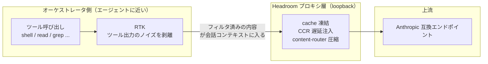

# Headroom 実稼働監査：価値エンジン、ルーティング検証、RTK との合成関係

《Headroom × OMP オンボーディングとガバナンスの全体フロー》に従って圧縮プロキシ層をデプロイすると、ひとつの直感が生まれがちです。**「圧縮プロキシ」と呼ぶ以上、トークンを節約する仕事はこの層が担っているのだろう**。しかし実際の稼働データによる完全な計測は、この直感を覆します——ある本番環境では、能動的圧縮が貢献した節約は 1% 未満であり、真の価値エンジンは別の、見落とされやすいコンポーネントでした。

本稿は、あのオンボーディングフローに対する**実稼働計測の同伴編**です。オンボーディング手順は繰り返さず、デプロイ後にしか浮かび上がらない三つの問いに答えます——価値はどこから来るのか、トラフィックが本当にプロキシを経由しているかどうかを検証するには、そして RTK と Headroom は実際どういう関係なのか。

> 推奨順序：まず《オンボーディングとガバナンスフロー》で四層アーティファクトの構成を理解し、本稿で実稼働計測が設計の直感をどう修正するかを読んでください。

---

## 一、価値の全体像：主戦力は圧縮ではなく RTK

プロキシを経由したトラフィックを「トークンをいくつ節約したか」で分解すると、直感を覆す表が得られます。

| 価値ベクトル | 割合 | 仕組み | 状態 |
| --- | --- | --- | --- |
| **RTK CLI フィルタリング** | **約 86.7% / 数千万トークン** | ツール出力のパターンライブラリがツール結果内のノイズを識別して剥離 | 真の主戦力 |
| プレフィックスキャッシュ安定化 | キャッシュヒット率 100% | cache モードが過去ターンを凍結、CCR がツール注入を遅延 | 設計目標を達成 |
| 能動的圧縮 | 1% 未満 | Read 以外の本文圧縮 | 意図的に優先度を下げている |

言い換えれば、**重量級の仕事をしているのは圧縮ではなく RTK です。**「Headroom」という名前のため、つい「圧縮」の手柄にしたくなりますが、計測データでは能動的圧縮はほとんどトークンを節約していません——その役割は「キャッシュ安定化＋プロトコル正規化」に近く、ツール出力から数十万トークンのノイズを剥がしているのは RTK です。

この認識の修正は重要です。**圧縮率ばかり調整していても、本当の価値のレバーを見逃します。** 最適化すべきは圧縮の keep-ratio ではなく、RTK のフィルタリングパターンライブラリの方です。

---

## 二、圧縮とキャッシュのトレードオフ：cache モードの設計哲学

能動的圧縮の割合がこんなに低いのはなぜか。プロキシがデフォルトで `--mode cache`（`token` ではなく）で動いているからです。

- **`token` モード**：圧縮を優先し、最大節約のために過去ターンを書き換える——しかしこれは**プレフィックスキャッシュを壊し**、プロバイダ側のプロンプトキャッシュヒット率を暴落させる；
- **`cache` モード**（デフォルト）：**過去ターンを凍結**し、圧縮を諦めてでもプレフィックスキャッシュのヒットを保つ。

計測では cache モードのキャッシュヒット率は 100% に近く、会話の進行とともにキャッシュ読取深度が伸び続けます——まさにこのモードの設計目標です。その代償として能動的圧縮は一歩引くため、圧縮の割合が低いのは**意図的なトレードオフであり、故障ではありません**。

> 示唆：チューニングの前に「節約したいのはトークンか、キャッシュヒットのコストか」を先に決める。cache モードは長対話＋プロンプトキャッシュ対応の上流向き、token モードは単発の短いリクエストやキャッシュ非対応の上流向きです。

---

## 三、ルーティング検証：三階層の証拠（スモークテストに騙されない）

「プロキシは設定した、だからトラフィックはこれを経由するはず」——この推論は、デプロイ全体で最も危険な仮定です。計測から分かったのは、ルーティングが実際に効いているかの検証には**三階層の証拠を順に積む**必要があり、一つでも欠けると誤判定するということです。

| 階層 | 検証手段 | 証明できること | 証明できないこと |
| --- | --- | --- | --- |
| **L1 設定** | `models.db` の `baseUrl` が loopback を指すのを読む | オーケストレータが**このモデルを解決すれば**、**必ず**プロキシを経由する | 実行時にオーケストレータが本当にこのモデルを選ぶか |
| **L2 bare-proxy** | loopback ポートに直接 `/v1/messages` を送る | プロキシが起動する、プロトコルが通る、クレデンシャルのパススルーが成功する | オーケストレータ自身のルーティング論理がトラフィックをここへ送るか |
| **L3 オーケストレータ原生** | `proxy.log` の `PERF` 行＋ライブ接続（`ss`）を確認 | オーケストレータが実際に原生トラフィックをプロキシへ送った | （エンドツーエンドのルーティングを証明できる唯一の階層） |

**最もよくある誤判定**：L2（プロキシへの直接スモーク）だけやって「ルーティングOK」と宣言する。しかし L2 はオーケストレータを迂回してプロキシを直接叩く——証明しているのは「プロキシは健康」であって「オーケストレータがトラフィックをプロキシへ送る」ではありません。この差は、トラブルシュート時には致命的です。

### 3.1 サブエージェントのモデルオーバーライドが尊重されないことがある

計測でさらに潜んだ現象も観察されました。オーケストレータの**サブエージェントのモデルオーバーライド**（例えば `scout → あるプロバイダのモデル` と設定）が、ある呼び出しパスでは**尊重されない**——サブエージェントが設定されたモデルではなく親セッションのモデルを継承する。症状は、本来ならプロバイダ A のプロキシポートを経由するはずのサブエージェントが、`proxy.log` には親セッションモデルのトラフィックしか残さない、というものです。

つまり、**L1 設定が正しく、L2 プロキシが健康でも、L3 は失敗する可能性がある**——しかも失敗は沈黙的（オーケストレータはエラーを出さない、プロキシもトラフィックを受け取れない）。調査できるのは L3 だけ——`proxy.log` と `ss -tnp` のライブ接続で、オーケストレータプロセスの送信先が loopback のプロキシポートか、外網の上流 IP への直結かを見るしかありません。

### 3.2 クリーンな L3 検証フロー

```bash
# 1. 対象モデルへのリクエストを一度発火させる（メッセージを一件送る）
# 2. ただちに proxy.log で該当 PERF 行を探す
tail -f ~/.headroom/logs/proxy.log | grep 'PERF model='

# 3. 並行してオーケストレータプロセスのライブ送信接続を見る
ss -tnp state established | grep <オーケストレータ pid>
# 重要な判定：接続先が 127.0.0.1:<プロキシポート> か、外網 IP への直結か
```

`PERF model=<対象モデル>` が現れ、**かつ** `ss` がオーケストレータを loopback プロキシポートへの接続として示したときにだけ、L3 は合格です。どちらかが欠ければ、ルーティングは実際には効いていません。

---

## 四、RTK と Headroom：独立だが合成

RTK が価値の主戦力であるなら、Headroom とはどういう関係なのか。計測から言える正確な表現は、**ふたつの独立したツールであり、Headroom が実行時に RTK を context tool として呼び出している**——決して「RTK は Headroom の組み込みプラグイン」ではありません。



重要な認識（検証済みと未確認を厳格に分ける）：

- **観察された事実**：プロキシの起動ログが、現在アクティブな context tool として RTK を明記している；RTK には独立した設定ディレクトリ（`~/.config/rtk/`、tracking / tee / filters / limits 等の節を含む）がある；オーケストレータのプラグインマニフェストには context-mode しかなく、独立した RTK プラグインはない。
- **文書の主張（本環境での実行時統合としては未検証）**：上流の README は「Headroom が RTK バイナリを同梱し、context tool として RTK を自動選択する」と述べている——これは文書の主張であり、起動ログだけから「自動選択」の論理詳細を逆推することはできない。
- **未確認**：Headroom が RTK を呼び出す具体的な注入フック／プロセス間通信の仕組み、RTK を無効化する確実な方法、`/stats` の RTK 統計フィールドの真のデータソース——この三つはすべて不明とし、確定した結論として書くべきではない。

### 4.1 二種類の異なるインターセプト——混同しない

計測中に「出力が書き換えられた」という二種類の現象にぶつかりますが、これらは**異なるコンポーネント**が行っています。

- **bash インライン HTTP（curl/urllib/...）がサンドボックスツールへリダイレクトされる** → これはオーケストレータの **context-mode** プラグイン；
- **大きなコマンド出力が tee ディレクトリへリダイレクトされる** → これは **RTK**。

両者の責務は異なります。「コマンドの出力がどう変わったのか」を調査するときは、まずどの階層かを見極めましょう——Headroom にまとめて責任を押し付けないこと。

---

## 五、運用の深化：`/livez` の先へ

`/livez` が教えてくれるのは「プロキシプロセスが生きている」ことだけですが、**生きている ≠ 仕事している ≠ 正しく仕事している**のです。Headroom にはデプロイ後に覚えておく価値のある、より深い CLI プローブ群が同梱されています。

```bash
# 公式ヘルスチェック（/livez を超え、claude/codex/shell がプロキシ経由か、予算設定があるかも報告）
headroom doctor --port 8787

# 設計内部のビュー：圧縮戦略、キャッシュヒット、transform 分解、TOIN 学習状態、実行可能な提案
headroom perf

# 永続的な 30 日節約台帳
headroom savings

# Read ツールトラフィックの圧縮機会を監査（「まだ節約できていないトークンがどれだけあるか」を定量化）
headroom audit-reads
```

### 5.1 `/stats` の見落とされがちな宝物

`/stats` が返す JSON のうち、`summary` 以外にもいくつか日常的に注目すべきフィールドがあります。

- **`cli_filtering`**：RTK の貢献度（節約パーセント、コマンド数）——真の価値の主戦力のリアルタイムの数値；
- **`config`**：プロキシが**実行時に解決した**圧縮ポリシー（例えば `compress_user_messages=true`、`compress_system_messages=false`——システムプロンプトを保護し、ユーザターンだけ圧縮）。これらはユニットファイルには見えない Headroom 内部のデフォルトです；
- **`prefix_cache`**：キャッシュヒットの詳細（読取/書込トークン、bust 回数）——cache モードが本当にキャッシュを保っているかはここを見る。

### 5.2 `/readyz` に騙されない

`/readyz` は上流チェックで**永遠に unhealthy を報告します**——設定された上流ではなくデフォルトの Anthropic URL を探すからです。**信頼するのは `/livez` ＋実際のリクエストトラフィックだけ**。

---

## 六、結語

圧縮プロキシ層をデプロイするのは始まりにすぎません。実稼働の計測は、デプロイ前に持ちがちな三つの直感を修正します。

- **価値の源泉**：圧縮ではなく RTK。圧縮率ばかり調整するのは間違った方向；
- **ルーティング検証**：bare-proxy のスモークが通る ≠ オーケストレータ原生ルーティングが通る。`proxy.log` ＋ライブ接続の階層まで落ちて初めて意味があり、サブエージェントのモデルオーバーライドは沈黙的に失敗することもある；
- **コンポーネント関係**：RTK と Headroom は独立ツールの合成であり、包含ではない。二種類のインターセプト（context-mode と RTK）は責務が異なる——トラブルシュートではまず階層を見極める。

この三本の線を守れば、「圧縮プロキシ層をデプロイした」は「設定したから効いているはず」という錯覚にとどまらず、観測可能、検証可能、最適化可能なエンジニアリング能力へと変わります。

> 本稿は《Headroom × OMP オンボーディングとガバナンスフロー》の実稼働計測同伴編です。前者は「どうオンボードするか」を、本稿は「オンボード後に実際に何をしているか、本当にしているかをどう検証するか」を扱います。
