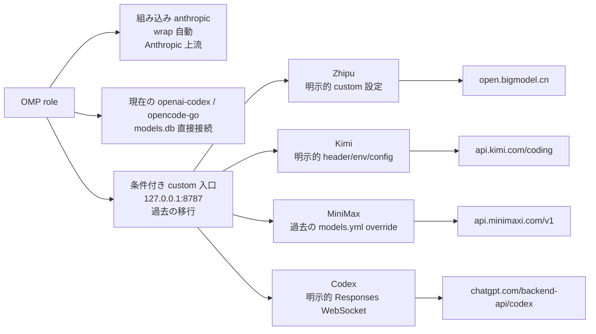

# Headroom 単一ポート移行：Zhipu・Kimi・MiniMax・Codex を 8787 に統合

この記事は過去の単一ポート移行を記録するものである。公式の `headroom wrap omp` の自動範囲はより狭く、OMP 組み込みの `anthropic` provider だけを wrapper 管理の設定へ注入する。現在の `openai-codex` と `opencode-go` の role は `models.db` の直接接続エントリを使い、wrap が自動的に loopback へ変更することはない。

以下の Zhipu、Kimi、MiniMax、Codex の loopback ルートは過去の移行証拠である。明示的な custom provider 設定がある場合だけ成立し、`headroom wrap omp` のデフォルト結果ではない。

現在の起動には[公式 Headroom README](https://github.com/headroomlabs-ai/headroom/blob/main/README.md)と公式 wrapper を使い、常駐サービスは使わない。

```bash
# 公式 CLI は一度だけインストールする（Python 3.13+）
uv tool install --python 3.13 "headroom-ai[all]"

# OMP の推奨起動入口：セッションとローカルプロキシを wrap に管理させる
headroom wrap omp

# wrapped セッションの実行中に別ターミナルで検証する
headroom doctor
headroom perf
headroom dashboard
```

`headroom wrap omp` は OMP を起動し、そのセッションに必要なローカルプロキシのライフサイクルを管理する。OMP の通常起動に使う入口はこれだけを推奨する。通常は、旧式の `~/.config/systemd/user/headroom-proxy.service` を作成・保守したり、provider ごとの unit を有効化したり、`headroom proxy --port 8787` を手動実行したりしてはいけない。これらの systemd と直接プロキシの経路は過去の移行用であり、日常の起動方法としては推奨しない。

```text
過去の custom-provider 構成（wrap-only のデフォルトではない。自動範囲は組み込み `anthropic` のみ）
OMP（headroom wrap omp が起動）
      │
      ├─ 組み込み `anthropic` → wrapper 管理ルート（自動；Anthropic 上流）
      ├─ 現在の `openai-codex` / `opencode-go` → `models.db` の直接接続
      │
      ▼
条件付き custom Headroom 入口（過去の移行；127.0.0.1:8787）
      ├─ Zhipu    → https://open.bigmodel.cn/api/coding/paas/v4/chat/completions
      ├─ Kimi     → https://api.kimi.com/coding/v1/messages
      ├─ MiniMax  → https://api.minimaxi.com/v1/chat/completions
      └─ Codex WS → wss://chatgpt.com/backend-api/codex/responses
```

wrapper は active session のライフサイクルを管理するが、プロセス終了だけでは route state は自動復元されない。終了時は明示的に `headroom unwrap omp` を実行すること。デフォルトでは wrapper 管理の route state を削除し、ローカルプロキシを停止する。プロキシを意図的に残す場合だけ `headroom unwrap omp --no-stop-proxy` を使い、それ以外では loopback ルートが残る可能性がある。

## 1. 複数ポートから単一ポートへ移行した理由

以前の構成では provider ごとに Headroom の systemd サービスを起動していた。この旧トポロジーは廃止済みで推奨しない。固定の `*_TARGET_API_URL` を各プロセスに設定しやすい一方、次の問題があった。

- systemd ユニット、ポート、ログファイル、ライフサイクルが増える。
- OMP と Kimi CLI が provider ごとに異なる loopback アドレスを覚える必要がある。
- provider ごとの再起動、プロキシ、SOCKS 設定がずれやすい。
- ポートがルートを表し、リクエスト自身が provider の事実を持たない。

現在の構成では責務を分け直す。

1. **クライアント**が provider を選び、モデルメタデータまたはカスタムヘッダーで上流情報を書き込む。
2. **Headroom**がプロトコル判定、圧縮、キャッシュ、転送を担当する。
3. **`headroom wrap omp`**が OMP セッションに必要なローカルプロキシのライフサイクルを管理する。

これにより、ポートは「ローカル Headroom の入口」だけを表し、「固定された一つの provider」を表さなくなる。

## 2. 最終的な単一ポート構成



以下のルートは過去または条件付きの custom provider ルートであり、`headroom wrap omp` が自動作成する四つのルートではない。wrap-only が自動的に扱うのは組み込み `anthropic` provider で、デフォルトは設定された Anthropic 上流のままである。Kimi へ暗黙に向けることはない。現在の `openai-codex` と `opencode-go` は、明示的に別設定をしない限り直接接続のままである。

| Provider | クライアント側のルーティング | Headroom の上流結果 |
| --- | --- | --- |
| 組み込み `anthropic` | wrapper が自動管理するルート。暗黙の Kimi target はない | 設定された Anthropic 上流 |
| `openai-codex` / `opencode-go` | 現在の `models.db` 直接接続エントリ。loopback へ自動変更しない | 各 provider の設定された直接上流 |
| Zhipu | 過去の custom provider ルート。`x-headroom-*` の明示設定が必要 | `/v4/chat/completions` |
| Kimi | 過去の custom provider ルート。header、環境変数、または provider 設定が必要 | `/coding/v1/messages` |
| MiniMax | 過去の `models.yml` override と custom ルート。wrap には不要 | `/v1/chat/completions` |
| Codex | 過去の custom provider ルート。Responses WebSocket の明示設定が必要 | Codex Responses WebSocket |

これらの過去の `models.db` や provider エントリから現在のルーティングを推測してはいけない。まず active 設定を確認し、日常の起動で DB を手動編集しない。

## 3. 公式 wrap の起動とライフサイクル

通常の OMP セッションでは、README が推奨する `wrap` 経路を使う。

```bash
uv tool install --python 3.13 "headroom-ai[all]"
headroom wrap omp
```

wrapped セッションの実行中に、別ターミナルで公式の検証を行う。

```bash
headroom doctor
headroom perf
headroom dashboard
```

wrapper は現在のセッションに必要なローカルプロキシを管理する。wrap-only が非 Anthropic provider のエントリを自動的に loopback へ変更することはない。`~/.config/systemd/user/headroom-proxy.service` の手動保守、provider ごとの systemd unit、独立した `headroom proxy --port 8787` プロセスは過去の移行経路であり、通常運用には推奨しない。

## 4. 組み込み MiniMax provider の上書き（旧移行証拠）

以前の移行では `models.yml` で組み込み provider を上書きしていた。以下のコードブロックは歴史的な証拠としてだけ残す。現在の `headroom wrap omp` には不要である。プロセス終了だけでは `models.yml` は復元されないため、wrapped セッション後は明示的に `headroom unwrap omp` を実行する（デフォルトはローカルプロキシを停止）。プロキシを意図的に残す場合だけ `--no-stop-proxy` を使い、この override を日常の起動手順に追加してはいけない：

```yaml
# 旧移行の証拠のみ。現在の wrap ライフサイクルには不要。
providers:
  minimax-code-cn:
    baseUrl: http://127.0.0.1:8787/v1
    headers:
      x-headroom-base-url: https://api.minimaxi.com/v1
      x-headroom-original-path: /chat/completions
```

二つのヘッダーは別々の問題を解決する。

- `x-headroom-base-url` は実際の上流を選ぶ。
- `x-headroom-original-path` は `/chat/completions` を保持し、`/v1` の二重連結を防ぐ。

最終ログでは loopback のリクエストだけでなく、実際の上流を確認する必要がある。

```text
event=outbound_request forwarder=streaming
path=https://api.minimaxi.com/v1/chat/completions

event=proxy_inbound_response ... status=200
```

## 5. Kimi の二つのプロトコルとデフォルト先の境界

Kimi の通信には二つの形がある。

- OMP/Kimi CLI の Anthropic Messages リクエスト：`/v1/messages`。
- 一部の OpenAI-compatible クライアントの Chat Completions リクエスト：`/v1/chat/completions`。

過去の移行では Kimi CLI provider を統合ポートへ向け、動的ヘッダーを保持した。

```toml
[providers."managed:kimi-code"]
type = "kimi"
api_key = ""
base_url = "http://127.0.0.1:8787/v1"
custom_headers = { "x-headroom-base-url" = "https://api.kimi.com/coding", "x-headroom-original-path" = "/v1/messages" }

[providers."managed:kimi-code".oauth]
storage = "file"
key = "oauth/kimi-code"
```

ただし、その過去の custom `kimi-code` 経路には実際的な境界がある。一部のリクエストは `x-headroom-base-url` なしで 8787 に到達した。旧 systemd サービス方式では環境変数でデフォルトを与えていた。これは移行の歴史であり、日常の起動要件ではない。`headroom wrap omp` はこの Kimi ルートを自動作成しないため、明示的な provider 設定がある場合だけ使う。

過去のデフォルト target 上書き（明示的な追加設定のみ）:

```text
# 旧設定。headroom wrap omp はこの変数を設定しない。
ANTHROPIC_TARGET_API_URL=https://api.kimi.com/coding
```


### 重要：この過去のデフォルトは副作用のない透明なルーティングではない

過去の custom 設定では、動的ルーティングヘッダーを持たない Anthropic `/v1/messages` リクエストが Anthropic 公式エンドポイントではなく Kimi に送られた。これは旧移行のトレードオフであり、wrap-only の自動動作ではない。通常の `headroom wrap omp` は `ANTHROPIC_TARGET_API_URL` を設定せず、デフォルトは設定された Anthropic 上流である。custom 8787 入口を使う場合は、次のいずれかを明示する必要がある。

- Claude 用の別入口を使う。
- クライアントから正しい `x-headroom-base-url` を明示する。
- `ANTHROPIC_TARGET_API_URL=https://api.kimi.com/coding` を明示的に設定するか、プロキシ層にクライアント識別ベースの条件ルーティングを追加する。

この過去のデフォルトを、すべての Anthropic クライアントに対する透明な互換性として説明してはいけない。

## 6. Codex が通常の OpenAI target を使えない理由

Codex subscription は通常の OpenAI Chat Completions ではなく、過去の custom ルートでは Responses API を WebSocket で利用した。

```text
/v1/responses
→ wss://chatgpt.com/backend-api/codex/responses
```

現在の `openai-codex` role は、明示的に custom provider 設定を追加しない限り、設定された直接上流を使う。custom loopback ルートでは Codex の Responses WebSocket を上書きする汎用 OpenAI target を設定してはいけない。

```ini
OPENAI_TARGET_API_URL=...
```


過去の custom 構成では、Headroom が ChatGPT OAuth の資格情報を検出し、組み込みの `chatgpt_subscription` ルートを使用した。決定的な検証ログは次のとおりである。

```text
WS /v1/responses connecting to wss://chatgpt.com/backend-api/codex/responses
WS /v1/responses completed
last_upstream_type=response.completed
```

## 7. 旧 provider サービス：移行時だけ、非推奨

旧 provider 用 systemd unit と常駐の `headroom-proxy.service` は廃止済みである。ここで触れるのは過去の移行を説明するためだけであり、通常の OMP セッションのために作成・有効化・保守してはいけない。古い unit が残るマシンでは一度だけ残骸を整理し、その後は第 3 節の `headroom wrap omp` ブロックに戻り、それだけを起動入口にする。

移行後に目指す状態は「enabled service が一つあること」ではなく、wrapper がローカルプロキシを管理する active な wrapped OMP セッションである。

## 8. 三層検証：HTTP 200 だけで終わらせない

単一ポート移行には三層の証拠が必要である。

### L1：設定層

自動、現在の直接接続、過去の custom 状態を区別する。

```text
Wrap-only の自動範囲:
anthropic → 組み込み Anthropic provider の wrapper 管理ルート
             （デフォルトは Anthropic 上流。Kimi への暗黙の target はない）

現在の models.db 直接接続:
openai-codex → 設定された直接上流（loopback へ自動変更しない）
opencode-go  → 設定された直接上流（loopback へ自動変更しない）

過去/条件付き custom ルート（明示設定がある場合のみ）:
zhipu-coding-plan → http://127.0.0.1:8787/v1
kimi-code         → http://127.0.0.1:8787/v1
minimax-code-cn   → http://127.0.0.1:8787/v1
openai-codex      → http://127.0.0.1:8787/v1（custom override のみ）
```

### L2：プロトコル層

active な wrapped セッションに保存済みの資格情報で各プロトコルの最小リクエストを送り、上流のレスポンスが返ることを確認する。`/health` の成功や loopback の HTTP 200 だけでは、正しい上流が選ばれた証明にならない。

### L3：オーケストレーターの実トラフィック

以下の四つの selector ループは過去の移行証拠であり、wrap-only の smoke test ではない。別ターミナルで wrapped セッションが実行中で、かつすべての selector に明示的な custom provider 設定がある場合だけ実行する。現在の設定では `openai-codex` と `opencode-go` は直接接続であり、意図的に別設定した場合を除く。

```bash
# 条件付きの過去/custom provider smoke。デフォルトの wrap 構成ではない。
for selector in \
  zhipu-coding-plan/glm-4.7 \
  kimi-code/k3 \
  minimax-code-cn/MiniMax-M3 \
  openai-codex/gpt-5.6-luna; do
  env -u ALL_PROXY -u all_proxy -u HTTP_PROXY -u HTTPS_PROXY \
    omp --no-session --no-tools --no-skills --no-rules --no-extensions \
      --mode=json --model "$selector" -p 'Reply with exactly PONG'
done
```

次に `~/.headroom/logs/proxy.log` で実際の上流を確認する。

| Provider | 決定的な証拠 | 結果 |
| --- | --- | --- |
| Zhipu | `path=https://open.bigmodel.cn/api/coding/paas/v4/chat/completions` | `status=200` |
| Kimi | `path=https://api.kimi.com/coding/v1/messages` | `status=200` |
| MiniMax | `path=https://api.minimaxi.com/v1/chat/completions` | `status=200` |
| Codex | `wss://chatgpt.com/backend-api/codex/responses` | `response.completed` |

## 9. 実行時チェックとロールバック

wrapped セッションの実行中に、別ターミナルで公式チェックを行う。

```bash
headroom doctor
headroom perf
headroom dashboard
```

`headroom doctor` が表示する Claude、Codex、shell-env、budget の一般的な warning は転送失敗と同じ意味ではない。実際の selector、最終的な上流 URL、`~/.headroom/logs/proxy.log` を最終的な証拠とする。loopback の HTTP 200 だけではルーティングを証明できない。

`models.db` の手動編集、reconciler の実行、systemd unit の再起動を日常の起動手順にしてはいけない。これらは旧方式の復旧手段であり、`headroom wrap omp` はセッション用ローカルプロキシと組み込み `anthropic` の自動ルートを管理するが、明示的な custom 設定なしに非 Anthropic provider を loopback へ変更したり、未マークの Anthropic リクエストを Kimi に送ったりはしない。

## 10. この移行から得た原則

1. **一つの入口は一つの固定上流を意味しない**：単一ポートのルーティングはリクエスト単位の provider 情報に依存する。
2. **モデルキャッシュと provider override はクライアント契約の一部である**：宣言は保持するが、`models.db` の手動編集を通常起動にしない。
3. **Codex は特殊プロトコルである**：Responses WebSocket を通常の OpenAI target で上書きしてはいけない。
4. **過去の Kimi デフォルト target には境界がある**：旧 `ANTHROPIC_TARGET_API_URL` または同等の custom ルートを明示設定した場合だけ、未マークの Anthropic リクエストが Kimi に送られた。通常の `headroom wrap omp` は Anthropic 上流を維持する。
5. **上流 URL を検証する**：`127.0.0.1:8787` の 200 は、プロキシが受信したことしか証明しない。
6. **wrapper がライフサイクルを管理する**：旧 systemd unit と常駐 `headroom-proxy.service` は OMP の推奨起動経路ではない。
