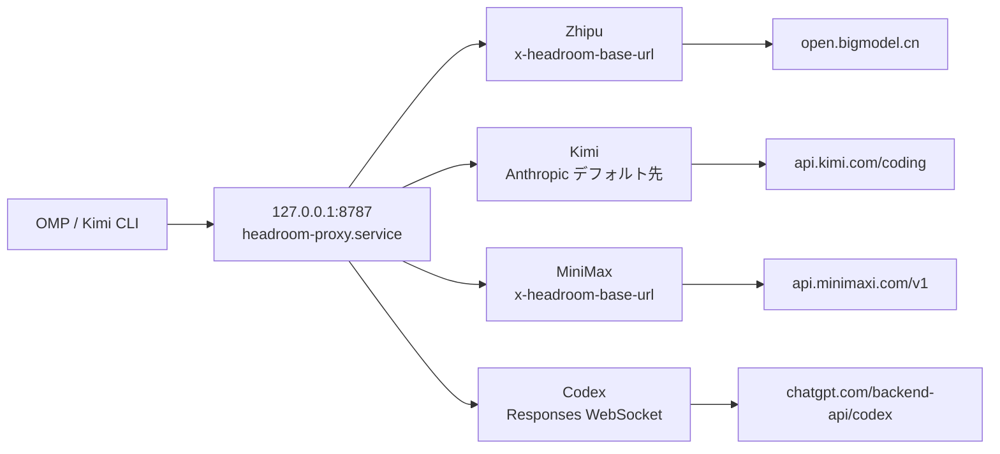

# Headroom 単一ポート移行：Zhipu・Kimi・MiniMax・Codex を 8787 に統合

これは複数のポート番号を同じ値に変更するだけの設定変更ではない。クライアント側のルーティングモデルを変更し、**Headroom は loopback 上の一つのプロキシプロセスだけを持ち、OMP はリクエストに provider と上流情報を付与し、プロキシがプロトコルに応じて転送する**構成にした。

最終的なトポロジーは次のとおりである。

```text
OMP / Kimi CLI
      │
      ▼
127.0.0.1:8787
headroom-proxy.service
      ├─ Zhipu    → https://open.bigmodel.cn/api/coding/paas/v4/chat/completions
      ├─ Kimi     → https://api.kimi.com/coding/v1/messages
      ├─ MiniMax  → https://api.minimaxi.com/v1/chat/completions
      └─ Codex WS → wss://chatgpt.com/backend-api/codex/responses
```

## 1. 複数ポートから単一ポートへ移行した理由

以前の構成では provider ごとに Headroom の systemd サービスを起動していた。各プロセスに固定の `*_TARGET_API_URL` を設定しやすい一方、次の問題があった。

- systemd ユニット、ポート、ログファイル、ライフサイクルが増える。
- OMP と Kimi CLI が provider ごとに異なる loopback アドレスを覚える必要がある。
- provider ごとの再起動、プロキシ、SOCKS 設定がずれやすい。
- ポートがルートを表し、リクエスト自身が provider の事実を持たない。

単一ポート構成では責務を分け直す。

1. **クライアント**が provider を選び、モデルメタデータまたはカスタムヘッダーで上流情報を書き込む。
2. **Headroom**がプロトコル判定、圧縮、キャッシュ、転送を担当する。
3. **systemd**が一つのプロキシプロセスだけを管理する。

これにより、ポートは「ローカル Headroom の入口」だけを表し、「固定された一つの provider」を表さなくなる。

## 2. 最終的な単一ポート構成



現在の OMP provider ルーティングは二つの方式に分かれる。

| Provider | クライアント側のルーティング | Headroom の上流結果 |
| --- | --- | --- |
| Zhipu | `models.db` の `baseUrl` と `x-headroom-*` ヘッダー | `/v4/chat/completions` |
| Kimi | `models.db` / Kimi CLI 設定。ヘッダーなしの Anthropic リクエストはデフォルト先を使用 | `/coding/v1/messages` |
| MiniMax | `~/.omp/agent/models.yml` で組み込み provider を上書きし、`x-headroom-*` ヘッダーを付与 | `/v1/chat/completions` |
| Codex | `models.db` が 8787 を指し、Headroom が ChatGPT subscription を自動判定 | Codex Responses WebSocket |

## 3. 統合 systemd サービス

現在ディスク上にある統合サービスには provider API key を含めていない。また、Codex 固有の WebSocket ルーティングを壊さないように `OPENAI_TARGET_API_URL` も設定していない。

```ini
[Unit]
Description=Headroom Unified Context Optimization Proxy
After=network-online.target
Wants=network-online.target

[Service]
Type=simple
Environment=HOME=%h
Environment=HEADROOM_HOST=127.0.0.1
Environment=ANTHROPIC_TARGET_API_URL=https://api.kimi.com/coding
Environment=ALL_PROXY=
Environment=LITELLM_PROXY=
Environment=all_proxy=
Environment=SOCKS_PROXY=
Environment=socks_proxy=
ExecStart=/home/davidhlp/.local/bin/headroom proxy --port 8787
RestartSec=8
StandardOutput=append:%h/.headroom/logs/headroom-proxy.log
StandardError=append:%h/.headroom/logs/headroom-proxy.log

[Install]
WantedBy=default.target
```

`RestartSec=8` は運用上重要である。再起動後に TCP `TIME_WAIT` ソケットが解放されるまでの時間を確保するためで、短すぎる値は偽のポート競合や再起動ループを作る可能性がある。

## 4. 組み込み MiniMax provider の上書き

MiniMax は OMP の組み込み provider である。動的な `model_cache` 行を手動挿入しても永続的な解決にならないため、最終構成ではサポートされている `models.yml` provider override を使用する。

```yaml
# Managed local override: route the built-in MiniMax provider through Headroom.
providers:
  minimax-code-cn:
    baseUrl: http://127.0.0.1:8787/v1
    headers:
      x-headroom-base-url: https://api.minimaxi.com/v1
      x-headroom-original-path: /chat/completions
```

二つのヘッダーは別々の問題を解決する。

- `x-headroom-base-url` は実際の上流を選ぶ。
- `x-headroom-original-path` は `/chat/completions` を保持し、`/v1` の二重連結を防ぐ。

最終ログでは loopback のリクエストだけでなく、実際の上流を確認する必要がある。

```text
event=outbound_request forwarder=streaming
path=https://api.minimaxi.com/v1/chat/completions

event=proxy_inbound_response ... status=200
```

## 5. Kimi の二つのプロトコルとデフォルト先の境界

Kimi の通信には二つの形がある。

- OMP/Kimi CLI の Anthropic Messages リクエスト：`/v1/messages`。
- 一部の OpenAI-compatible クライアントの Chat Completions リクエスト：`/v1/chat/completions`。

Kimi CLI の provider は統合ポートを指し、動的ヘッダーも保持している。

```toml
[providers."managed:kimi-code"]
type = "kimi"
api_key = ""
base_url = "http://127.0.0.1:8787/v1"
custom_headers = { "x-headroom-base-url" = "https://api.kimi.com/coding", "x-headroom-original-path" = "/v1/messages" }

[providers."managed:kimi-code".oauth]
storage = "file"
key = "oauth/kimi-code"
```

OMP の `kimi-code` 経路には一つの実際的な境界がある。一部のリクエストは 8787 に到達しても `x-headroom-base-url` を持たない。そのため統合サービスには次の設定がある。

```ini
Environment=ANTHROPIC_TARGET_API_URL=https://api.kimi.com/coding
```

### 重要：副作用のない透明なデフォルトではない

動的ルーティングヘッダーを持たない Anthropic `/v1/messages` リクエストは、Anthropic 公式エンドポイントではなく Kimi に送られる。これは Kimi の OMP/Kimi CLI を単一ポートへ接続するための実際のトレードオフである。今後、通常の Claude 通信も 8787 に直接送る場合は、次のいずれかが必要になる。

- Claude 用の別入口を使う。
- クライアントから正しい `x-headroom-base-url` を明示的に送る。
- プロキシ層にクライアント識別ベースの条件ルーティングを追加する。

この設定を、すべての Anthropic クライアントに対する透明な互換性として説明してはいけない。

## 6. Codex が通常の OpenAI target を使えない理由

Codex subscription の通信は通常の OpenAI Chat Completions ではない。Responses API を WebSocket で利用する。

```text
/v1/responses
→ wss://chatgpt.com/backend-api/codex/responses
```

そのため、統合サービスでは次を設定していない。

```ini
OPENAI_TARGET_API_URL=...
```

Headroom は ChatGPT OAuth の資格情報を検出し、組み込みの `chatgpt_subscription` ルートを使用する。決定的な検証ログは次のとおりである。

```text
WS /v1/responses connecting to wss://chatgpt.com/backend-api/codex/responses
WS /v1/responses completed
last_upstream_type=response.completed
```

## 7. 旧 provider サービスの削除

単一ポートへ切り替えた後は、古いプロセスを停止するだけでは不十分である。drop-in ディレクトリと enable 状態も削除する。

```bash
systemctl --user disable --now \
  headroom-proxy-zhipu.service \
  headroom-proxy-kimi.service \
  headroom-proxy-minimax.service \
  headroom-proxy-codex.service \
  headroom-proxy-webui.service || true

rm -rf ~/.config/systemd/user/headroom-proxy-zhipu.service.d
rm -rf ~/.config/systemd/user/headroom-proxy-kimi.service.d
rm -rf ~/.config/systemd/user/headroom-proxy-minimax.service.d
rm -rf ~/.config/systemd/user/headroom-proxy-codex.service.d
rm -rf ~/.config/systemd/user/headroom-proxy-webui.service.d

systemctl --user daemon-reload
systemctl --user enable --now headroom-proxy.service
```

削除後、サービス一覧とポート一覧には一つの対象だけが残るべきである。

```bash
systemctl --user list-unit-files | grep '^headroom'
ss -tlnp | grep -E '127\.0\.0\.1:(8787|8788|8790|8791|8800)'
```

期待される結果は次のとおりである。

```text
headroom-proxy.service enabled
127.0.0.1:8787 LISTEN
```

## 8. 三層検証：HTTP 200 だけで終わらせない

単一ポート移行には三層の証拠が必要である。

### L1：設定層

各 provider が loopback を解決することを確認する。

```text
zhipu-coding-plan → http://127.0.0.1:8787/v1
kimi-code         → http://127.0.0.1:8787/v1
openai-codex      → http://127.0.0.1:8787/v1
minimax-code-cn   → ~/.omp/agent/models.yml → 127.0.0.1:8787/v1
```

### L2：プロトコル層

保存済みの資格情報を使い、各プロトコルの最小リクエストを 8787 に送り、上流のレスポンスが返ることを確認する。`/health` の成功や loopback の HTTP 200 だけでは、正しい上流が選ばれた証明にならない。

### L3：オーケストレーターの実トラフィック

実際の OMP selector を実行する。

```bash
for selector in \
  zhipu-coding-plan/glm-4.7 \
  kimi-code/k3 \
  minimax-code-cn/MiniMax-M3 \
  openai-codex/gpt-5.6-luna; do
  env -u ALL_PROXY -u all_proxy -u HTTP_PROXY -u HTTPS_PROXY \
    omp --no-session --no-tools --no-skills --no-rules --no-extensions \
      --mode=json --model "$selector" -p 'Reply with exactly PONG'
done
```

次に `~/.headroom/logs/proxy.log` で実際の上流を確認する。

| Provider | 決定的な証拠 | 結果 |
| --- | --- | --- |
| Zhipu | `path=https://open.bigmodel.cn/api/coding/paas/v4/chat/completions` | `status=200` |
| Kimi | `path=https://api.kimi.com/coding/v1/messages` | `status=200` |
| MiniMax | `path=https://api.minimaxi.com/v1/chat/completions` | `status=200` |
| Codex | `wss://chatgpt.com/backend-api/codex/responses` | `response.completed` |

## 9. 実行時チェックとロールバック

最終状態では次を確認する。

```bash
systemctl --user is-active headroom-proxy.service
ss -tlnp | grep '127.0.0.1:8787'
headroom doctor --port 8787
headroom perf
headroom savings
```

`headroom doctor` が表示する Claude、Codex、shell-env、budget の一般的な warning は、転送失敗と同じ意味ではない。実際の selector、上流 URL、`proxy.log` を最終的な証拠とする。

`models.db`、Kimi 設定、systemd ユニットを変更する前にコピーを保存する。

```bash
cp ~/.omp/agent/models.db ~/.omp/agent/models.db.pre-unified-single-port-$(date +%Y%m%dT%H%M%S)
cp ~/.kimi-code/config.toml ~/.kimi-code/config.toml.pre-unified-single-port-$(date +%Y%m%dT%H%M%S)
cp ~/.config/systemd/user/headroom-proxy.service ~/.config/systemd/user/headroom-proxy.service.pre-unified-single-port-$(date +%Y%m%dT%H%M%S)
```

ロールバック時はファイルを復元し、`systemctl --user daemon-reload` を実行して、単一の `headroom-proxy.service` を再起動する。廃止した provider ユニットを再び有効化して、旧トポロジーへ戻してはいけない。

## 10. この移行から得た原則

1. **一つの入口は一つの固定上流を意味しない**：単一ポートのルーティングはリクエスト単位の provider 情報に依存する。
2. **モデルキャッシュと provider override はクライアント契約の一部である**：systemd だけを変更しても OMP は自動的にプロキシを使わない。
3. **Codex は特殊プロトコルである**：Responses WebSocket を通常の OpenAI target で上書きしてはいけない。
4. **Kimi のデフォルト先には境界がある**：マークされていない Anthropic リクエストは Kimi に送られる。
5. **上流 URL を検証する**：`127.0.0.1:8787` の 200 は、プロキシが受信したことしか証明しない。
6. **サービス削除も移行の一部である**：旧 unit、drop-in、enable 状態、ログ入口をまとめて確認する。
