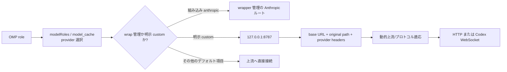

このページの総合的な結論は、単一ポートとはすべての provider が自動的に 8787 へ書き換えられることではない、という点である。明示的に設定した custom provider が一つの loopback 入口を共有し、リクエストレベルの情報で実際の上流を選ぶ。現在の `headroom wrap omp` の自動範囲、OMP のモデル選択、派生状態である `models.db`、Headroom のライフサイクルは分けて考え、過去のルートを現在のデフォルトとは扱わない。

## コアメカニズム

### 1. 単一ポートの因果チェーン



| selector / ルート種別 | デフォルトまたは過去の状態 | 単一ポートの成立条件 | 重要な境界 |
| --- | --- | --- | --- |
| 組み込み `anthropic` | `headroom wrap omp` が自動管理する場合がある | active wrapped session | 自動範囲は全 provider ではない。デフォルト上流は Anthropic のまま |
| `openai-codex`、`opencode-go` | 現在の `models.db` では通常直接接続 | loopback へ入れるには明示 custom provider が必要 | wrap は通常の項目を 8787 へ書き換えない |
| Zhipu / Kimi / MiniMax | 過去の custom ルート | provider 設定、loopback base URL、リクエスト headers がすべて必要 | 旧 Kimi の target override は header なし Anthropic リクエストを誤った上流へ送る可能性がある |
| Codex Responses | 過去の明示 custom ルート | WebSocket の target とプロトコルを一致させる | 通常の OpenAI Chat Completions ルートで Responses WebSocket を置き換えられるとは考えない |

### 2. 複数ポートから収束する理由

- **設定**：ガバナンスが必要な provider に同じ loopback base URL を宣言し、上流 host、original path、プロトコル差はリクエストレベルに残す。
- **運用**：provider ごとのプロキシプロセスやポート unit をなくし、ポート衝突と unit のドリフトを減らす。その代わり単一ポート障害は経由する全 provider に影響する。
- **プロトコル**：HTTP Chat Completions、Anthropic Messages、Codex Responses WebSocket はポートだけでは区別できない。provider、original path、プロトコル metadata を保持する。
- **ライフサイクル**：現在は `headroom wrap omp` が active proxy を起動・所有する経路を推奨する。常駐サービスと手動 `headroom proxy` は移行の背景である。

### 3. ルート証拠の三層

1. **L1 設定**：wrapper 管理の組み込み `anthropic`、`models.db` の直接項目、明示 custom 項目を区別する。
2. **L2 プロトコル**：active wrapped session で宣言済み selector に最小プロトコル要求を送り、loopback 到達性、header 転送、正しいプロトコル応答を確認する。
3. **L3 上流**：プロキシの inbound/outbound ログと最終 HTTP URL または WebSocket `response.completed` を観測する。これが意図した上流に届いた証拠である。

## 適用条件

- 明示設定済みの複数 provider に、圧縮、キャッシュ、プロトコル正規化、統合観測など共通のローカルプロキシ能力が必要である。
- provider 数からポート構成を切り離しながら、provider ごとの path とプロトコル差を保つ移行を行う。
- 「ロールは何を選んだか」「リクエストはどの入口を使ったか」「どの上流が受け取ったか」を別々に答えたい。
- wrapper のセッション単位のライフサイクルを受け入れ、終了時に route state を明示的に片付けられる。

## 非適用とリスク

| 誤用 | 結果 | 境界と対応 |
| --- | --- | --- |
| 8787 を全体のデフォルト入口とみなす | 直接接続の role がプロキシを迂回し、診断を誤る | selector の model/cache 項目と custom 設定の有無を確認する |
| `/health` または HTTP 200 だけを見る | loopback 到達性しか証明できない | L2 プロトコルと L3 最終上流を検証する |
| 旧 provider unit と wrap を同時に有効化する | ポート競合、古い headers、誤解を招くログ | 日常は `headroom wrap omp` だけを使い、旧サービスは移行残留として削除する |
| Codex WebSocket に HTTP ルートを適用する | handshake または Responses event が失敗する | WebSocket URL、path、完了イベントの証拠を保持する |
| 旧 Kimi/Anthropic override に依存する | header なしリクエストが静かに誤った上流へ行く | 旧 override を削除するか、明示 custom-provider ルートを使う |
| プロキシ通過を圧縮 savings と同一視する | 短い要求の zero savings を未経由と誤認する | loopback、プロキシログ、圧縮統計を別々に見る |
| 手動 `models.db` 編集を永続化契約とみなす | プロセスが古い cache を保持し、再起動後に再生成する | cache を派生状態とみなし、新しい wrapped session で検証する |

## 最小検証

```bash
# 現在推奨のセッション入口。公式のバージョン/導入手順を使う
headroom wrap omp
```

wrapped session の実行中に別ターミナルで `headroom doctor` と `headroom perf` を実行し、L1 → L2 → L3 の順に確認する。loopback と最終上流を探るのは selector に明示 custom provider がある場合だけにし、デフォルトの直接接続 selector は直結上流を別途確認する。終了時は、プロキシを意図的に残す場合を除き `headroom unwrap omp` を明示的に実行する。

## 証拠と不確実性

- **情報源の事実**：`legacy-headroom-single-port-evolution` は 127.0.0.1:8787 への過去の収束、動的 headers、MiniMax override、Kimi/Anthropic target の罠、Codex WebSocket を記録する。`legacy-omp-config-and-rules-guide` は role→model、model→入口、リクエストレベルルート、wrapper ライフサイクルを分離する。`legacy-omp-headroom-persistence` は `models.db` を派生 cache と説明する。
- **本ページの総合**：単一ポートを明示 custom ルートの共有入口として定義し、L1/L2/L3 で設定、プロトコル、最終上流の証拠を分けた。
- **未確認**：wrapper が現在自動対象にする provider 集合、header 名、ログフィールド、provider ごとのプロトコル adapter、8787 がデフォルトかどうかは Headroom/OMP のバージョンで変わる。過去の Zhipu、Kimi、MiniMax、Codex ルートはデフォルト保証ではない。

## 関連ページ

- [OMP 設定の階層](/ja/note/omp-config-and-rules-guide)
- [Headroom ルート永続化](/ja/note/omp-headroom-persistence)
- [OMP Hook 拡張](/ja/note/omp-hook-extension-guide)
- [LLM wiki pattern](/ja/note/llm-wiki-pattern)
