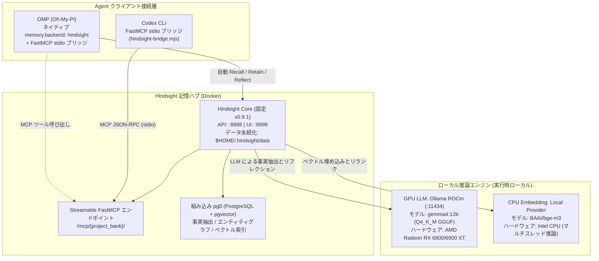

このページでは、Linux 環境における Vectorize Hindsight 記憶システムの**計算資源分担アーキテクチャとコンテナ化デプロイ方式**を記録する。日常の推論と記憶アクセスは完全にオフライン／ローカルで実行し、異種計算資源（GPU LLM + CPU Embedding）の協調、データ永続化権限、サービスのライフサイクルオーケストレーションを重点的に扱う。

---

## 1. システムアーキテクチャと実行トポロジー

ローカル記憶システムは、計算基盤、記憶ハブ、Agent 接続層で構成される。すべてのポートとトラフィックはローカルループバック（`127.0.0.1`）に厳密に限定する：



### コア設計原則

1. **計算資源の精密な分担**：
    - **GPU は LLM に専念**：12B パラメータの `gemma4:12b`（Q4_K_M）を AMD GPU の VRAM にロードし、会話からの事実抽出（Fact Extraction）とメンタルモデルの合成（Reflection）を専任で担当させる。
    - **CPU は Embedding に専念**：`BAAI/bge-m3` を CPU で強制実行し、貴重な GPU VRAM の消費を避けて LLM コンテキスト推論を安定させる。
2. **データの全ライフサイクルをローカル化**：
    - すべてのベクトル、エンティティ関係、文字起こし、モデルキャッシュを `$HOME/.hindsight/` 以下に配置する。

---

## 2. デプロイ手順

### 1. 永続化ディレクトリの計画と権限管理

Hindsight コンテナは非 root ユーザー `hindsight`（UID 1000）で実行されるため、マウントするホストディレクトリには UID 1000 の書き込み権限が必要である：

```bash
mkdir -p ~/.hindsight/data ~/.hindsight/models ~/.hindsight/ollama

# 安全な権限設定：データ・モデルディレクトリの所有権をコンテナ UID 1000 に付与する
sudo chown -R 1000:1000 ~/.hindsight/data ~/.hindsight/models
chmod -R u+rwX,g+rwX ~/.hindsight/data ~/.hindsight/models
```

### 2. Docker Compose オーケストレーション（`~/.hindsight/docker-compose.yml`）

ホストパスには `${HOME}` または絶対パスを使い、非対話環境で Shell のチルダ `~` 展開に依存しない：

```yaml
services:
    # GPU LLM サービス：Ollama ROCm 経由でモデルをロードする
    ollama-gpu:
        image: ollama/ollama:rocm
        container_name: hindsight-ollama-gpu
        restart: unless-stopped
        ports:
            - "127.0.0.1:11434:11434"
        environment:
            - HSA_OVERRIDE_GFX_VERSION=10.3.0 # AMD RDNA2 (gfx1030)
            - ROCR_VISIBLE_DEVICES=0
            - OLLAMA_KEEP_ALIVE=-1
        devices:
            - "/dev/kfd:/dev/kfd"
            - "/dev/dri:/dev/dri"
        volumes:
            - ${HOME}/.hindsight/ollama:/root/.ollama
            - ${HOME}/.hindsight/models:/models:ro

    # Hindsight コアサーバー（Vectorize.io 固定バージョン）
    hindsight:
        image: ghcr.io/vectorize-io/hindsight:v0.9.1
        container_name: hindsight-server
        restart: unless-stopped
        ports:
            - "127.0.0.1:8888:8888" # API と MCP エンドポイント
            - "127.0.0.1:9999:9999" # Web UI コンソール
        environment:
            # --- LLM ドライバー（GPU） ---
            - HINDSIGHT_API_LLM_PROVIDER=ollama
            - HINDSIGHT_API_LLM_BASE_URL=http://ollama-gpu:11434/v1
            - HINDSIGHT_API_LLM_MODEL=gemma4:12b
            # --- Embedding ドライバー（CPU） ---
            - HINDSIGHT_API_EMBEDDINGS_PROVIDER=local
            - HINDSIGHT_API_EMBEDDINGS_LOCAL_MODEL=BAAI/bge-m3
            - HINDSIGHT_API_EMBEDDINGS_LOCAL_FORCE_CPU=true
            # --- モデルウェイト取得設定（初回取得はネットワークが必要、事前キャッシュ後はオフラインで動作可能） ---
            - HF_ENDPOINT=https://huggingface.co
            - HINDSIGHT_API_LOG_LEVEL=info
        volumes:
            - ${HOME}/.hindsight/data:/home/hindsight/.pg0
            - ${HOME}/.hindsight/models:/home/hindsight/.cache/huggingface
        depends_on:
            - ollama-gpu
```

### 3. GGUF モデルのインポートとエイリアス登録

`~/.hindsight/models/Modelfile` を作成する：

```dockerfile
FROM /models/gemma-4-12b-it-Q4_K_M.gguf
TEMPLATE """{{ if .System }}<start_of_turn>system
{{ .System }}<end_of_turn>
{{ end }}{{ if .Prompt }}<start_of_turn>user
{{ .Prompt }}<end_of_turn>
{{ end }}<start_of_turn>model
{{ .Response }}<end_of_turn>
"""
PARAMETER stop "<start_of_turn>"
PARAMETER stop "<end_of_turn>"
PARAMETER num_ctx 8192
```

インポートして検証する：

```bash
docker exec -i hindsight-ollama-gpu ollama create gemma4:12b -f /models/Modelfile
docker exec hindsight-ollama-gpu ollama list
```

---

## 3. 適用条件と境界

- **ハードウェア**：ROCm 対応 AMD GPU（RX 6800/6900 XT または同世代以降など）、16GB 以上の VRAM、BGE-M3 のベクトル抽出に使うマルチコア CPU。
- **ネットワーク境界**：すべてのサービスエンドポイントを `127.0.0.1` ループバックインターフェースにバインドし、認証なしでパブリックネットワークへ公開しない。
- **コールドスタート**：初回のモデルウェイト取得には外部ネットワーク接続、または `~/.hindsight/models` への事前キャッシュが必要である。

---

## 4. 最小検証

1. **コンテナ状態**：`docker ps` を実行し、`hindsight-server` と `hindsight-ollama-gpu` が Up であることを確認する。
2. **GPU VRAM**：`docker exec hindsight-ollama-gpu ollama ps` を実行し、`gemma4:12b` が GPU VRAM に完全にロードされていることを確認する。
3. **ヘルスエンドポイント**：`curl -I http://127.0.0.1:8888/health` が HTTP 200 を返すことを確認する。

---

## 5. 証拠と不確実性

- **ソース事実**：`hindsight-local-deployment-and-agent-integration` の実デプロイ検証に基づく。Ollama ROCm コンテナは `/dev/kfd` と `/dev/dri` をマッピングし、Hindsight は固定 v0.9.1 イメージを使用する。
- **本ページの統合**：計算資源の分担、ディレクトリ権限、Compose オーケストレーションを独立した Concept 仕様として整理した。
- **未確認**：Ubuntu と Fedora/Arch など Linux ディストリビューションごとに ROCm カーネルドライバーの導入方法が異なるため、ホスト環境に合わせて調整する必要がある。

---

## 6. 関連ページ

- [Hindsight 統合メモリアクセス：FastMCP ブリッジと動的マルチプロジェクトルーティング](/note/hindsight-omp-codex-integration)
- [Hindsight ランタイムトラブルシューティングマトリクスと失敗モード](/note/hindsight-troubleshooting)
- [MCP Codebase Memory ワークフロー](/note/mcp-codebase-memory-workflow)
