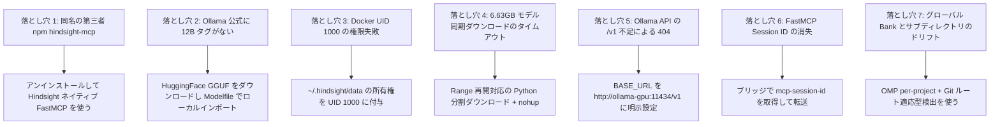

このページでは、Vectorize Hindsight のローカルデプロイと Agent 統合における **7 つの主要な失敗モード、根本原因、解決策、予防策**を体系的にまとめる。さらに、本番を意識した高速巡回 SOP と段階的な判断フローも示す。

---

## 1. 7 つの典型的な失敗モードと調査マトリクス



### 1. 同名の第三者 npm パッケージを誤ってインストールする（`hindsight-mcp`）

- **現象**：`npm install -g hindsight-mcp` 後、README が `https://api.hindsight-ai.com`、PAT Token、Agent UUID を要求し、`create_memory_block` などのツールを定義する。Vectorize のオープンソースエンドポイントには接続できない。
- **根本原因**：npm リポジトリには同名の古い第三者パッケージが存在するが、Vectorize Hindsight の公式成果物ではない。Vectorize Hindsight は FastMCP サービスを内蔵している。
- **解決策**：npm パッケージを完全にアンインストールし、Hindsight が提供するネイティブ `/mcp/{bank}/` エンドポイントへ直接接続する。
- **予防策**：オープンソースプロジェクト周辺のツールを導入する前に、公式リポジトリのエクスポートプロトコルと統合ディレクトリ（`hindsight-integrations/` など）を確認する。

### 2. Ollama 公式リポジトリに `gemma4:12b` タグが存在しない

- **現象**：Hindsight 起動時の LLM 接続確認で `ApiStatusError(ollama/gemma4:12b): HTTP 404: {"message": "model 'gemma4:12b' not found"}` が発生する。
- **根本原因**：当時の Ollama 公式 Registry には `gemma4:31b` しかなく、12B 版は主に `unsloth` や `bartowski` などのコミュニティが HuggingFace 上で GGUF として公開していた。
- **解決策**：HuggingFace から `gemma-4-12b-it-Q4_K_M.gguf` をダウンロードし、`ollama create gemma4:12b -f /models/Modelfile` でインポートする。
- **予防策**：標準外またはコミュニティ量子化モデルを `ollama pull <tag>` に盲目的に依存しない。ローカル GGUF と Modelfile のローカルビルドが最も信頼できる。

### 3. Rootless Docker のボリューム権限失敗（UID 1000）

- **現象**：Hindsight が自動終了し、コンテナログに `[FAIL] The embedded database directory /home/hindsight/.pg0 is not writable by this container (UID 1000).` と出る。
- **根本原因**：Hindsight イメージは安全上の理由から非 root ユーザー `hindsight`（UID 1000）で実行される。自動作成されたホストディレクトリや現在のユーザーが作成したディレクトリは、コンテナ内の pg0 データベースプロセスから書き込めない場合がある。
- **解決策**：`${HOME}/.hindsight/data:/home/hindsight/.pg0` と `${HOME}/.hindsight/models:/home/hindsight/.cache/huggingface` をマッピングし、`sudo chown -R 1000:1000 ~/.hindsight/data ~/.hindsight/models` でホストディレクトリの所有権を明示的に UID 1000 へ付与する。
- **予防策**：非 root コンテナイメージのホストパスをマウントするときは、コンテナ UID を確認して必要な権限を付与する。全体に `777` を付与する方法に頼らない。

### 4. 大容量モデルファイル（6.63GB）のダウンロードタイムアウト

- **現象**：Agent ツールから同期的にダウンロードすると 300 秒のタイムアウトを超え、中途半端な一時ファイルが残る。
- **根本原因**：モデルウェイトは大きく、国際ネットワーク帯域も制限されるため、同期ブロッキング要求はプロセスマネージャーや CLI クライアントのタイムアウトで簡単に終了させられる。
- **解決策**：`urllib.request` と HTTP `Range` ヘッダーを使う専用 Python ダウンローダーで再開可能にし、`nohup python3 ... > download.log 2>&1 &` でバックグラウンド実行する。
- **予防策**：1GB を超えるモデルファイルの取得には、常にバックグラウンドプロセスと再開可能な転送を使う。

### 5. Ollama API の Base URL に `/v1` がない

- **現象**：`HINDSIGHT_API_LLM_BASE_URL=http://ollama-gpu:11434` と設定すると Hindsight が接続できない。
- **根本原因**：Hindsight の `llm_wrapper.py` は `ollama` provider に対して OpenAI 互換プロトコルを使い、デフォルトで `/v1` 以下にリクエストを組み立てる。カスタムコンテナホスト名で `/v1` を省くと 404 になる。
- **解決策**：Docker Compose の環境変数に `/v1` を含む完全な URL を明示する：`HINDSIGHT_API_LLM_BASE_URL=http://ollama-gpu:11434/v1`。
- **予防策**：OpenAI 互換プロトコル経由で Ollama に接続するシステムでは、URL に常に `/v1` を含める。

### 6. FastMCP の Session ID 不足による `Bad Request (-32600)`

- **現象**：簡易 stdio ブリッジの最初の `initialize` は成功するが、その後の `tools/list` や `tools/call` が `Bad Request: Missing session ID` を返す。
- **根本原因**：Hindsight は Streamable FastMCP を使う。最初の `initialize` ハンドシェイク成功後、サーバーはレスポンスヘッダーに `mcp-session-id` を返すため、以後のすべての JSON-RPC POST はこの Session ID を HTTP ヘッダーで転送しなければならない。
- **解決策**：Node.js ブリッジに軽量な状態管理を追加し、最初のレスポンスから `mcp-session-id` を取得して後続要求に付与する。
- **予防策**：HTTP-to-stdio MCP プロキシでは、ハンドシェイクの Session ヘッダーを明示的に処理して転送する。

### 7. グローバルなハードコード Bank とサブディレクトリのルーティングドリフト

- **現象**：`bank: ulticode` のハードコードは別プロジェクトの開発時に事実を汚染する。`process.cwd()` だけで名前を求めると、サブディレクトリ内でプロジェクトを誤認し、メモリが分断される。
- **根本原因**：モノリス／マルチモジュール（Monorepo）プロジェクトでは、作業ディレクトリ（CWD）がサブモジュールの深い階層になることが多く、現在のディレクトリ名は Git リポジトリの実体を表さない。また OMP の `per-project-tagged` モードと Codex の独立 Bank ではルーティングの意味が異なる。
- **解決策**：OMP で `hindsight.scoping: per-project` を設定し、ネイティブロジックも Git ルートごとに Bank を分ける。ブリッジでは `git rev-parse --show-toplevel` を実行してリポジトリルートまで遡り、そこから一意な Bank 名を求める。
- **予防策**：マルチプロジェクトの動的メモリルーティングは「Git ルートパス」を命名アンカーに統一し、相対 CWD に依存しない。

---

## 2. 高速ヘルスチェック SOP

次のコマンドを順番に実行して、基盤と Agent の状態を確認する：

```bash
# 1. GPU 推論コンテナの状態を確認
docker logs hindsight-ollama-gpu | tail -n 20

# 2. GPU メモリとモデルのマッピングを確認
docker exec hindsight-ollama-gpu ollama list

# 3. Hindsight コアサーバーのログとヘルスを確認
docker logs hindsight-server | tail -n 20
curl -I http://127.0.0.1:8888/health

# 4. 永続化データディレクトリの UID 所有権を確認
ls -la ~/.hindsight/data/

# 5. FastMCP stdio ブリッジを検証
node ~/.hindsight/hindsight-bridge.mjs
```

---

## 3. 6 段階の進化と技術判断のまとめ

| 段階 | 中心タスク | 発見した違反・障害 | 最終解決と成果 |
| :--- | :--- | :--- | :--- |
| **段階 1：要件受領とアーキテクチャ設計** | Hindsight の完全ローカルデプロイ、GPU で Gemma-4 12B、CPU で BGE-M3、OMP と Codex の統合を要求された。 | 最初は第三者 npm パッケージで直接ブリッジできないか調査した。 | Docker Compose の二コンテナ構成（Ollama ROCm（GPU）+ Hindsight Core（CPU pg0/BGE-M3））を確立した。 |
| **段階 2：偽情報の排除** | インストール済みの `hindsight-mcp` npm パッケージを調査した。 | `api.hindsight-ai.com` を指し PAT Token を要求する第三者の古いパッケージだった。 | アンインストールし、Vectorize Hindsight ネイティブの Streamable FastMCP `/mcp/{bank}/` エンドポイントを採用した。 |
| **段階 3：コンテナとモデルの準備** | Docker コンテナを起動しモデルを取得した。 | 1. UID 1000 の書き込み権限不足でコンテナが停止；2. Ollama 公式に `gemma4:12b` タグがない；3. 6.63GB の同期ダウンロードがタイムアウトした。 | 1. UID 1000 にディレクトリ所有権を付与；2. 再開可能なバックグラウンドダウンローダーを作成；3. Modelfile で GGUF インポートを構築した。 |
| **段階 4：通信チャネルの統一** | Hindsight と Ollama の通信、Codex ブリッジを構築した。 | 1. Hindsight の LLM チェックが 404；2. FastMCP ブリッジがハンドシェイク後に `Missing session ID (-32600)` を返した。 | 1. BASE_URL に `/v1` を追加；2. ブリッジに `mcp-session-id` ヘッダーの取得・転送を実装した。 |
| **段階 5：メモリ分離とルーティングの進化** | OMP と Codex のメモリ共有・分離を処理した。 | `ulticode` のハードコードは別プロジェクトを汚染し、`process.cwd()` の直接利用は `/services/app/` サブディレクトリで Bank 名をドリフトさせた。 | 1. OMP に `scoping: per-project` を設定；2. ブリッジを `git rev-parse --show-toplevel` で Git ルートへ遡るようにした。 |
| **段階 6：一時領域の削除と規約のアーカイブ** | テスト用 Bank を削除し、全量検証を行った。 | `codex` と `omp` の一時 Bank を削除し、KB 憲法に従って raw スナップショットを補い Index/Log を更新した。 | 知識ベースの全量検証に合格した（`pnpm kb:lint`、`pnpm check`、`pnpm build`）。 |

---

## 4. 証拠と不確実性

- **ソース事実**：`hindsight-local-deployment-and-agent-integration` の raw 記録には、7 つのトラブルシューティングログ、Docker の状態、Session ID ハンドシェイクの特徴、Git toplevel スクリプトの検証が含まれる。
- **本ページの統合**：トラブルシューティングログと経験を、標準的な失敗モードマトリクスと判断の進化表に抽出した。
- **未確認**：新しい Hindsight で MCP 層が SSE ベースの接続維持へ変更されたり、ヘッダー形式が変わったりした場合、ブリッジの取得ロジックを更新する必要がある。

---

## 5. 関連ページ

- [Hindsight のローカル計算資源分担と Docker コンテナ化デプロイ](/note/hindsight-local-deployment)
- [Hindsight 統合メモリアクセス：FastMCP ブリッジと動的マルチプロジェクトルーティング](/note/hindsight-omp-codex-integration)
- [OMP Hook 拡張ガイド](/note/omp-hook-extension-guide)
