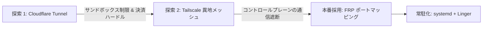

## 1. 問題の背景とコアな要求

リモートワーク、モバイル運用、複数デバイスでのコラボレーション環境において、自宅やラボの社内ネットワーク内にデプロイされた Linux サーバーへ、外部ネットワーク（スマホの Termius やノート PC）からアクセスすることが頻繁に求められます。多層 NAT 隔離、動的 IP の変更、パブリック IPv4 アドレスの枯渇により、直接接続を確立することは困難です。

「高安定性・固定アクセスポイント・コストゼロ」のトンネルソリューションを模索する中で、エンジニアは通常以下のような 3 段階の技術選定の進化を辿ります：



3 つの主要ソリューションの比較：

| 比較項目 | Cloudflare Tunnel | Tailscale / WireGuard | FRP / SakuraFrp |
| :--- | :--- | :--- | :--- |
| **接続プロトコル** | WebSocket / TLS トンネル | UDP 仮想 P2P | ネイティブ TCP / UDP マッピング |
| **クライアント要件** | `cloudflared` の実行が必要 | Tailscale アプリが必要 | 標準 SSH クライアントで直接接続可能 |
| **モバイル適合性** | 制限あり（Termius で ProxyCommand 不可）| 良好（VPN 権限が必要） | **極めて良好**（IP/ドメイン + ポートのみ） |
| **サービス利用ハードル**| Zero Trust 有効化に海外クレジットカードが必要 | コントロールプレーンが地域制限を受けやすい | クレジットカード不要、国内/香港ノード対応 |
| **アクセスポイント安定性**| 独自の CNAME ドメインをバインド | 固定 100.x 内網 IP / ドメイン | 固定パブリックドメイン + 指定マッピングポート |

---

## 2. 探索 1：Cloudflare Tunnel の実践と限界

### 2.1 デスクトップでの動作原理と設定

Cloudflare Tunnel（旧 Argo Tunnel）は、ローカルサーバー上で `cloudflared` デーモンを実行し、Cloudflare のエッジノードに対してアウトバウンドの双方向 WebSocket/TLS 接続を確立します。

デスクトップ環境（macOS/Linux/Windows）では、`~/.ssh/config` に `ProxyCommand` を設定することで、SSH トラフィックを `cloudflared` 経由にカプセル化できます：

```sshconfig
Host ssh.yourdomain.com
    ProxyCommand cloudflared access ssh --hostname %h
    StrictHostKeyChecking accept-new
```

このモードでは、デスクトップの標準 SSH コマンド（例：`ssh <your-username>@ssh.yourdomain.com`）で透明性の高い接続が可能です。

### 2.2 モバイルとネットワークのボトルネック

実際の導入において、本方式は 2 つの大きなボトルネックに直面します：
1. **モバイル版 Termius のサンドボックス制限**：モバイル OS（iOS/Android）のプロセス生成（fork/exec）制限により、Termius バックグラウンドから `cloudflared` を呼び出せません。
2. **Zero Trust の決済ハードル**：Public Hostname に Access ポリシーを適用するには Zero Trust の有効化が必須であり、海外クレジットカード等の登録が求められます。

---

## 3. 探索 2：Tailscale 異地メッシュ接続の課題

Tailscale は WireGuard プロトコルに基づき P2P 仮想 LAN を構築し、デバイスに固定の `100.x.x.x` 内網 IP を割り当てます。しかし特定のネットワーク環境下では、`sudo tailscale up` 実行時に接続がハングアップすることがあります。

### コアな課題：コントロールプレーンの遮断

システムログ `journalctl -u tailscaled -n 30` を確認すると、タイムアウトエラーが頻出します：

```text
logtail: dial "log.tailscale.com:443" failed: dial tcp ... i/o timeout
health(warnable=login-state): error: fetch control key: Get "https://controlplane.tailscale.com/key?v=138": context canceled
```

Tailscale のコントロールプレーン（`controlplane.tailscale.com`）および DERP 中継サーバーは、地域的なネットワーク制限を受けやすい特徴があります。また、基本的な HTTP プロキシ環境変数（`HTTP_PROXY`）では、Tailscale が必要とする下層の UDP/WireGuard トラフィックを中継できず、ハンドシェイクがタイムアウトし続けます。

---

## 4. 本番採用：FRP による汎用ポートマッピング

スマホの Termius から追加依存なしで直接接続し、決済ハードルやネットワーク遮断を回避するためには、TCP プロトコルマッピングに基づく FRP（Fast Reverse Proxy）が最適な選択肢となります。

### 4.1 アーキテクチャと現代的な `frpc.toml` 設定

FRP アーキテクチャでは、パブリックノード上の `frps`（サーバー）がポートをリッスンし、内網サーバー上の `frpc`（クライアント）が常時接続を維持して、パブリックマッピングポートへのトラフィックをローカルの `127.0.0.1:22` に転送します。

FRP v0.60+ では現代的な TOML 設定が導入されました。`~/frpc.toml` を作成します（機密情報はマスキング済み）：

```toml
user = "<YOUR_USER_ID>"
auth.token = "<YOUR_AUTH_TOKEN>"

serverAddr = "frp.example.com"
serverPort = 8088

transport.tls.enable = false
transport.tls.disableCustomTLSFirstByte = false

[[proxies]]
name = "SSH"
type = "tcp"
localIP = "127.0.0.1"
localPort = 22
remotePort = <REMOTE_PORT>
```

### 4.2 トラブルシューティング 1：コマンドライン `-f` フラグの構文エラー

一部のカスタム版 FRP クライアントでは `-f <token>:<id>` のワンライン起動構文が提供されていますが、公式のオープンソース `frpc` バイナリ（例：v0.61.0）では `cobra` パーサーが使用されているため、`-f` を渡すとエラーが発生します：

```text
Error: unknown shorthand flag: 'f' in -f
Usage:
  frpc [flags]
  frpc [command]
```

**解決策**：`-c` / `--config` を使用して標準の `frpc.toml` または `frpc.ini` 設定ファイルを明示的に指定します：

```bash
/path/to/frpc verify -c ~/frpc.toml
/path/to/frpc -c ~/frpc.toml
```

### 4.3 トラブルシューティング 2：ポート省略による接続拒否

接続テスト時に以下のエラーが発生することがあります：

```text
$ ssh <your-username>@frp.example.com
The authenticity of host 'frp.example.com (198.18.0.x)' can't be established.
...
Permission denied (publickey,gssapi-keyex,gssapi-with-mic).
```

**根本原因**：
`-p` パラメータなしで `ssh <your-username>@frp.example.com` を実行すると、SSH クライアントはマッピングされたポート（`<REMOTE_PORT>`）ではなく、リレーサーバー自体の **22 ポート** にデフォルトで接続しようとします。リレーサーバーは未認証ユーザーのログインを拒否します。

**解決策**：パブリックマッピングポート `-p <REMOTE_PORT>` を明示的に指定します：

```bash
ssh -p <REMOTE_PORT> <your-username>@frp.example.com
```

---

## 5. プロダクション級の高可用性デプロイ：systemd と linger 機構

`frpc` を手動で実行している場合、SSH セッションの切断やユーザーのログアウト時にプロセスが `SIGHUP` / `SIGKILL` 信号によって終了してしまいます。そのため、システムサービスとしてのデプロイが必要です。

### 5.1 systemd ユーザーサービスの設定

`~/.config/systemd/user/frpc.service` を作成します：

```ini
[Unit]
Description=FRP Client Security Service
After=network.target network-online.target
Wants=network-online.target

[Service]
Type=simple
ExecStart=/path/to/frpc -c /home/<your-username>/frpc.toml
Restart=always
RestartSec=5s

[Install]
WantedBy=default.target
```

ユーザーサービスをリロードして有効化します：

```bash
systemctl --user daemon-reload
systemctl --user enable --now frpc.service
```

実行状態を確認します：

```bash
systemctl --user status frpc.service
```

起動ログの出力例：
```text
● frpc.service - FRP Client Security Service
     Active: active (running) since Sat 2026-08-01 19:25:40 CST
     Main PID: 146770 (frpc)
...
[I] [client/service.go:287] login to server success, get run id [...]
[I] [client/control.go:168] [s-xxx.SSH] start proxy success
```

### 5.2 必須の防御策：`loginctl enable-linger` の有効化

Linux の systemd はデフォルトで、非 root ユーザーのすべての SSH セッションが終了した際に、そのユーザーの `user@UID.service` インスタンスおよび配下のユーザーサービスを破棄します。

サーバーの再起動やログアウト後も `frpc` をバックグラウンドで常駐させるため、以下を実行します：

```bash
loginctl enable-linger $USER
```

状態を確認します：

```bash
loginctl show-user $USER | grep Linger
# Linger=yes と出力されれば成功です
```

---

## 6. まとめとクライアント接続設定一覧

**FRP ポートマッピング** と **systemd + Linger 常駐** を組み合わせることで、決済ハードルやクライアント環境に依存しない高可用な SSH トンネル構成が完成しました。

### クライアント接続パラメータ参照表

| クライアントタイプ | 設定項目 | 入力値 / 設定内容 |
| :--- | :--- | :--- |
| **スマホ Termius** | Host / Address | `frp.example.com`（ノードのドメイン） |
| | Port | **`<REMOTE_PORT>`**（割り当てられたマッピングポート） |
| | Username | `<your-username>`（Linux システムユーザー名） |
| | Password | Linux システムのパスワード / 秘密鍵 |
| **デスクトップ CLI** | SSH コマンド | `ssh -p <REMOTE_PORT> <your-username>@frp.example.com` |
| **デスクトップ `~/.ssh/config`**| 設定ブロック | `Host my-server`<br>`  HostName frp.example.com`<br>`  Port <REMOTE_PORT>`<br>`  User <your-username>` |
