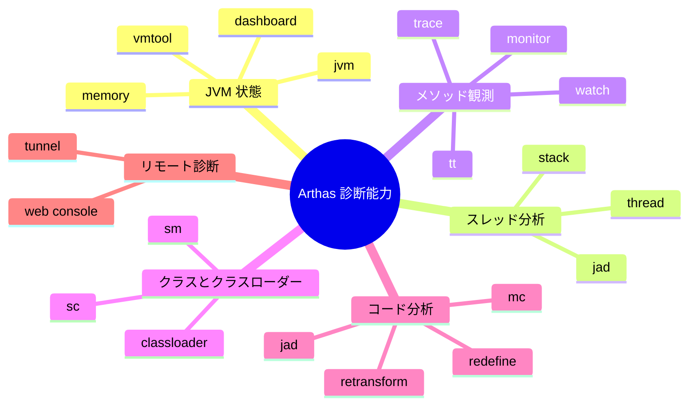
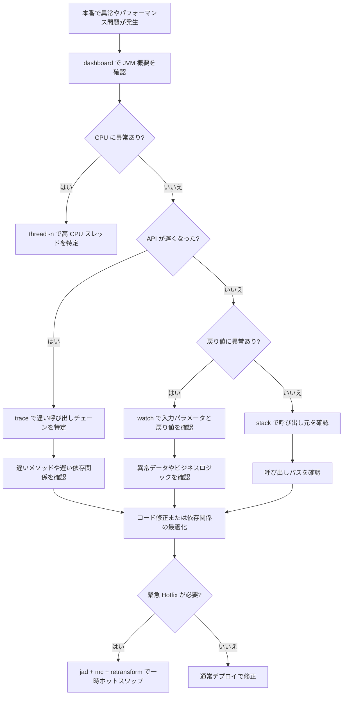
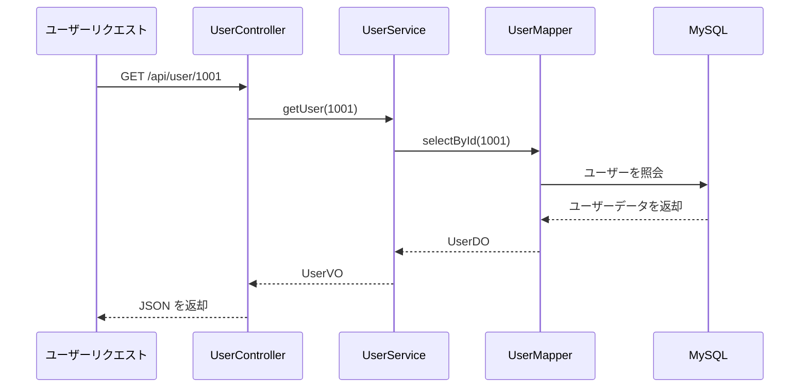
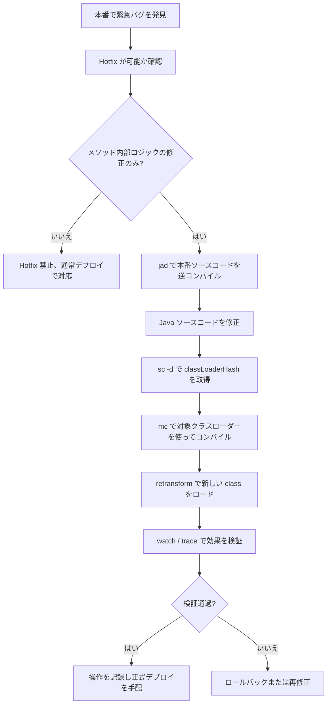
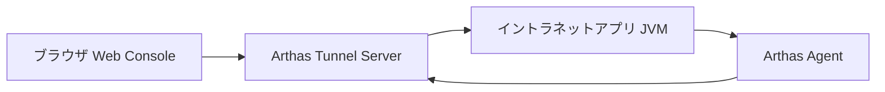
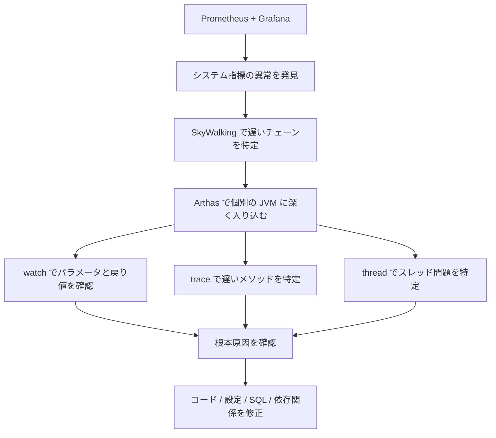
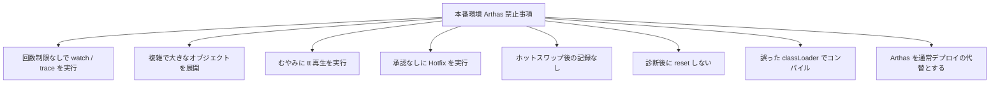
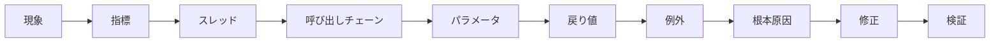

# Arthas 実戦：入門から本番コードホットスワップまで

## 一、はじめに：なぜ Java 本番調査に Arthas が欠かせないのか？

Java 本番環境において、最も苦しい問題は往々にして「コードの書き間違い」ではなく：

* 本番に完全なデバッグ環境がない；
* ログが重要な箇所に出力されていない；
* 問題が特定のトラフィック条件下でのみ偶発的に発生する；
* サービスを安易に再起動できない；
* `jstack`、`jmap` は静的スナップショットしか提供できず、動的な呼び出し過程の観察が困難。

従来の JVM ツールは強力だが、どちらかというと「事後分析」に偏っている。一方、Arthas の価値は：
**実行中の JVM に直接入り込み、メソッド呼び出し、引数、戻り値、例外、所要時間、クラスローディング、スレッド状態をリアルタイムに観測できること。**

一言でまとめると：

> Arthas は Java 本番問題調査の「顕微鏡 ＋ メス」である。

---

## 二、Arthas はどんな問題を解決できるのか？

Arthas は単なる JVM ツールではなく、本番診断プラットフォームのような存在である。



### よくある適用シナリオ

| シナリオ           | 従来の調査手法               | Arthas のアプローチ                      |
| ------------ | -------------------- | ------------------------------ |
| API が突然遅くなる       | ログ確認、モニタリング確認、SQL や RPC を推測 | `trace` で遅いメソッドを直接特定                |
| 引数が異常         | ログ追加、再デプロイ             | `watch` で入力パラメータをリアルタイム観察                 |
| 戻り値が期待と異なる     | デバッグまたはログ追加           | `watch` で戻りオブジェクトを確認                 |
| 本番で例外が発生したがログが不十分   | 例外スタックトレースを検索               | `watch -e` で例外をキャプチャ                |
| CPU 使用率が急上昇       | `top` + `jstack`     | `thread -n` でホットスレッドを迅速特定           |
| 本番コードに小さなバグがある | デプロイして再起動                 | `jad + mc + retransform` で一時ホットフィックス |

---

## 三、Arthas 全体調査フロー

本番問題に直面したら、いきなり `watch` や `trace` を実行せず、「大枠から詳細へ」の順序で調査することを推奨する。



---

## 四、基本コマンドクイックリファレンス

Arthas のコマンドは多数あるが、実戦で最もよく使うのは以下の一群である。

| コマンド            | 機能              | 典型的な用途            |
| ------------- | --------------- | --------------- |
| `dashboard`   | JVM リアルタイム状態確認     | CPU、メモリ、GC、スレッド概要  |
| `thread`      | スレッド状態確認          | CPU 急上昇、デッドロック、ブロッキングの調査 |
| `jad`         | 本番クラスの逆コンパイル          | 現在実行中のコード確認        |
| `sc`          | Search Class    | クラス情報、クラスローダーの検索      |
| `sm`          | Search Method   | メソッドシグネチャの検索          |
| `watch`       | メソッドの入力パラメータ、戻り値、例外の観察   | ビジネスデータ異常の調査        |
| `trace`       | メソッド内部呼び出しの所要時間追跡      | 遅い API の特定           |
| `stack`       | メソッド呼び出しスタック確認         | 誰がこのメソッドを呼び出したかを特定      |
| `monitor`     | メソッド呼び出し統計          | QPS、成功率、平均所要時間の統計 |
| `tt`          | Time Tunnel     | メソッド呼び出しの現場を記録、再生対応   |
| `classloader` | クラスローダー確認          | クラスローディング、コンパイル、ホットスワップ問題の解決  |
| `mc`          | Memory Compiler | オンラインで Java ファイルをコンパイル    |
| `retransform` | クラスバイトコードの再変換        | 本番ホットスワップ           |

---

## 五、主要コマンド応用：OGNL の威力

Arthas の強力さは、大いに OGNL に由来する。

OGNL の正式名称は **Object-Graph Navigation Language** で、次のように理解できる：

> 実行時に Java オブジェクトのプロパティ、メソッド、コレクション、配列にアクセスできる式言語。

Arthas において、OGNL はよく次の用途に使われる：

* メソッドパラメータの確認；
* 戻り値の確認；
* 例外オブジェクトの確認；
* 特定リクエストのフィルタリング；
* オブジェクトフィールドへのアクセス；
* オブジェクトメソッドの呼び出し；
* 複雑な構造の組み合わせ出力。

---

## 六、Watch：単なる「パラメータ確認」ではない

`watch` は Arthas で最もよく使われるコマンドの一つで、メソッドの次の要素を観察するのに適している：

* 入力パラメータ；
* 戻り値；
* 例外；
* 現在のオブジェクト；
* メソッド所要時間。

### 1. 基本構文

```bash
watch クラス名 メソッド名 式 条件
```

例：

```bash
watch com.example.UserService getUser "{params, returnObj}" -x 2
```

意味：

* `params`：メソッドパラメータ；
* `returnObj`：メソッド戻り値；
* `-x 2`：オブジェクト展開深度を 2 に設定。

---

### 2. 入力パラメータと戻り値の観察

```bash
watch com.example.OrderService createOrder "{params, returnObj}" -x 3 -n 5
```

説明：

* `-x 3`：3 レベルまでオブジェクトを展開；
* `-n 5`：5 回だけ観察し、本番での出力過多を防ぐ。

---

### 3. 例外のみ観察

```bash
watch com.example.UserService getUser "{params, throwExp}" -e -x 2 -n 5
```

説明：

* `-e`：メソッドが例外をスローした時のみトリガー；
* `throwExp`：例外オブジェクト。

---

### 4. 所要時間によるフィルタリング

```bash
watch com.example.OrderService createOrder "{params, returnObj}" "#cost > 100" -x 2 -n 5
```

意味：
所要時間が `100ms` を超える呼び出しのみ観察する。

---

### 5. パラメータによるフィルタリング

メソッドのパラメータがオブジェクトで、最初のパラメータに `id` フィールドがあると仮定：

```bash
watch com.example.UserService updateUser "{params, returnObj}" "params[0].id == 1001" -x 3 -n 5
```

意味：
`id = 1001` のリクエストのみ観察する。

---

### 6. オブジェクトフィールドへのアクセス

```bash
watch com.example.UserService getUser "target.userCache" -x 2 -n 5
```

説明：

* `target`：現在のインスタンスオブジェクト；
* `target.userCache`：インスタンスフィールドへのアクセス。

---

## 七、Trace：遅い API の真のボトルネックを特定する

`trace` はメソッド内部の呼び出しチェーンの所要時間を追跡するために使用する。
API が遅いがログからは原因が分からない場合、`trace` が非常に役立つ。

### 1. 基本例

```bash
trace com.example.OrderController createOrder -n 5
```

出力は通常、次のようになる：

```text
`---ts=2026-02-25 10:00:00;thread_name=http-nio-8080-exec-1;id=25;is_daemon=true;priority=5;TCCL=...
    `---[320.112ms] com.example.OrderController:createOrder()
        +---[12.331ms] com.example.OrderService:checkParam()
        +---[250.442ms] com.example.OrderService:saveOrder()
        +---[45.221ms] com.example.PaymentClient:prePay()
```

結果から直ちに分かる：

```text
OrderService.saveOrder() の所要時間は 250ms、これが主要なボトルネックである。
```

---

### 2. 遅いリクエストのみ確認

```bash
trace com.example.OrderController createOrder '#cost > 200' -n 5
```

意味：
所要時間が `200ms` を超えるリクエストのみ追跡する。

---

### 3. JDK メソッドの追跡

デフォルトでは、Arthas は JDK メソッドをスキップする。
JDK 内部の呼び出しを観察する必要がある場合は、次のように追加する：

```bash
trace com.example.OrderController createOrder '#cost > 200' --skipJDKMethod false -n 5
```

注意：
本番環境では慎重に使用すること。JDK メソッドの呼び出しチェーンは非常に長くなる可能性がある。

---

## 八、Stack：誰がこのメソッドを呼び出したのか？

あるメソッドが呼び出されていることは分かっているが、誰が呼び出しているかが分からない場合がある。
その時に `stack` が使える。

```bash
stack com.example.UserService getUser -n 5
```

次の調査に適している：

* あるメソッドがなぜ頻繁に呼び出されているのか；
* あるロジックがどのエントリポイントから入ってきたのか；
* 定期タスク、非同期スレッド、メッセージ消費が異常ロジックをトリガーしていないか。

---

## 九、Monitor：メソッド呼び出し状況の統計

`monitor` はあるメソッドの一定期間内の呼び出し統計を観察するのに適している。

```bash
monitor com.example.OrderService createOrder -c 5
```

意味：
5 秒ごとにメソッド呼び出し状況を統計する。

典型的な出力には以下が含まれる：

| フィールド        | 意味   |
| --------- | ---- |
| timestamp | 統計時刻 |
| class     | クラス名   |
| method    | メソッド名  |
| total     | 呼び出し回数 |
| success   | 成功回数 |
| fail      | 失敗回数 |
| avg-rt    | 平均所要時間 |
| fail-rate | 失敗率  |

次の判断に適している：

* あるメソッドが大量に呼び出されているか；
* 失敗率に異常がないか；
* 平均所要時間が急に上昇していないか。

---

## 十、TT：現場を記録し、呼び出しを再生する

`tt` は Time Tunnel の略で、メソッド呼び出しの現場を記録できる。

### 1. メソッド呼び出しの記録

```bash
tt -t com.example.UserService getUser -n 5
```

### 2. 記録リストの確認

```bash
tt -l
```

### 3. 特定の呼び出しの詳細確認

```bash
tt -i 1000
```

### 4. 再度呼び出しを実行

```bash
tt -i 1000 -p
```

注意：
`tt -p` はメソッドを再実行するため、本番環境では非常に慎重に使うこと。
メソッドが DB 書き込み、在庫引き当て、メッセージ送信、クーポン発行などの副作用を伴う場合、再生は推奨されない。

---

## 十一、本番調査実戦：API 戻り値の異常

### シナリオ

本番ユーザーからのフィードバック：

> ユーザー情報照会 API の戻り値でニックネームが空だが、データベースには確かにニックネームが存在する。

対象 API：

```text
GET /api/user/1001
```

対応メソッド：

```java
com.example.UserService#getUser
```

---

### 調査手順



### 1. 入力パラメータと戻り値の観察

```bash
watch com.example.UserService getUser "{params, returnObj}" "params[0] == 1001" -x 3 -n 5
```

もし次の結果が得られた場合：

```text
params[0] = 1001
returnObj.nickname = null
```

問題は次のいずれかの可能性がある：

* データベースの照会結果が空；
* DO から VO への変換時にフィールドが欠落；
* ビジネスコードが意図的に空に設定；
* シリアライズ前にインターセプトや処理が行われた。

---

### 2. 内部呼び出しの追跡

```bash
trace com.example.UserService getUser '#cost > 0' -n 5
```

出力に次のように表示された場合：

```text
+---[5ms] UserMapper.selectById()
+---[1ms] UserConverter.toVO()
```

次のステップで変換メソッドを観察する：

```bash
watch com.example.UserConverter toVO "{params, returnObj}" -x 3 -n 5
```

もし `params[0].nickname` には値があるが `returnObj.nickname` が空の場合、変換ロジックの問題とほぼ断定できる。

---

## 十二、高度な実戦：本番コードホットスワップ Hotfix

Arthas の最も危険で、かつ最も強力な機能の一つが、オンラインでのコードホットスワップである。

サービスを再起動せずに、修正後の `.class` を実行中の JVM にロードできる。

ただし、次の点を明確にしておく必要がある：

> Arthas Hotfix は一時的な応急処置に適しており、通常のデプロイフローの代わりになるものではない。

---

## 十三、Hotfix の適用境界

### Hotfix に適したシナリオ

| シナリオ         | 適否 |
| ---------- | ---- |
| 単純な非 null チェックの追加   | 適合   |
| 単純な条件分岐の修正   | 適合   |
| 明らかに誤った定数の修正  | 適合   |
| 特定の例外分岐の一時的な無効化 | 慎重に適合 |
| メソッド内部の少量ロジックの修正 | 慎重に適合 |

### Hotfix に不適切なシナリオ

| シナリオ        | 理由                |
| --------- | ----------------- |
| 新規フィールドの追加      | JVM に既にロードされたクラス構造は自由に変更できない |
| 新規メソッドの追加      | 失敗しやすい、または動作が予測不能        |
| メソッドシグネチャの変更    | 呼び出し元との不一致            |
| 継承関係の変更    | クラス構造変化のリスクが極めて高い         |
| 大規模なビジネスリファクタリング   | 制御不能               |
| トランザクション境界の変更を伴う  | データ不整合の可能性         |
| 複数サービス間のプロトコル変更を伴う | 上流下流との非互換            |

---

## 十四、Hotfix フローチャート



---

## 十五、Hotfix 実戦：NullPointerException の修正

### シナリオ

本番コードに null ポインタのリスクがある：

```java
public String getUserName(User user) {
    return user.getName().trim();
}
```

`user` または `user.getName()` が null の場合、`NullPointerException` がスローされる。

目標：
一時的に非 null チェックを追加する。

---

### ステップ 1：本番コードの逆コンパイル

```bash
jad --source-only com.example.UserService > /tmp/UserService.java
```

説明：
本番 JVM で現在実行中のコードを基準にする必要があり、ローカルコードをそのまま使って修正してはならない。

---

### ステップ 2：ソースコードの修正

`/tmp/UserService.java` を修正：

```java
public String getUserName(User user) {
    if (user == null || user.getName() == null) {
        return "";
    }
    return user.getName().trim();
}
```

---

### ステップ 3：クラスローダーの検索

```bash
sc -d com.example.UserService
```

出力の中の次の部分に注目：

```text
classLoaderHash   xxxxxxxx
```

次のコマンドも使える：

```bash
sc -d com.example.UserService | grep classLoaderHash
```

---

### ステップ 4：mc でコンパイル

```bash
mc -c <classLoaderHash> /tmp/UserService.java -d /tmp
```

説明：

* `-c`：クラスローダーを指定；
* `/tmp/UserService.java`：修正後のソースコード；
* `-d /tmp`：コンパイル後の `.class` ファイルの出力先。

---

### ステップ 5：新しいバイトコードのロード

```bash
retransform /tmp/com/example/UserService.class
```

`retransform` が成功すると、新しいメソッドロジックが現在の JVM で有効になる。

---

### ステップ 6：修正効果の検証

```bash
watch com.example.UserService getUserName "{params, returnObj, throwExp}" -x 2 -n 5
```

検証のポイント：

* `NullPointerException` がまだスローされていないか；
* 戻り値が期待通りか；
* 正常なユーザーリクエストに影響がないか。

---

## 十六、Hotfix ロールバック案

本番ホットスワップには必ずロールバック案を用意すること。

### 案 1：元の class で再度 retransform

元の `.class` を事前にバックアップしておいた場合：

```bash
retransform /tmp/backup/com/example/UserService.class
```

### 案 2：再デプロイで上書き

最も確実な方法は：

1. Hotfix の修正をコードリポジトリに同期；
2. 通常のテストフローを実施；
3. サービスを再デプロイ；
4. Arthas の一時変更を上書き。

### 案 3：サービスの再起動

Arthas のホットスワップは現在の JVM メモリ内のクラスにのみ影響する。
コードを永続的に修正していなければ、サービスの再起動後に元のバージョンに戻る。

---

## 十七、retransform と redefine の比較

| 側面       | retransform | redefine |
| -------- | ----------- | -------- |
| 推奨度     | より推奨         | 使用頻度が低い     |
| 複数回修正の対応     | より対応している       | 制限を受けやすい    |
| 使用体験     | より安定         | リスクがより高い     |
| 適用シナリオ     | メソッド内部ロジックの修正    | 単純なクラスの再定義   |
| 本番での推奨     | 慎重に使用        | さらに慎重に使用    |

一般的な推奨：

```text
retransform を優先し、redefine の頻繁な使用は避ける。
```

---

## 十八、リモート診断：Arthas Tunnel

実際の企業環境では、多くのサーバーがイントラネットにあり、直接 SSH ログインできない。
このような場合は Arthas Tunnel でリモート診断ができる。



### 1. Tunnel Server の起動

パブリックネットワークからアクセス可能なマシンで起動：

```bash
java -jar arthas-tunnel-server.jar
```

デフォルトポートは通常以下の通り：

```text
7777: WebSocket 通信
8080: Web コンソール
```

実際のポートは起動設定による。

---

### 2. クライアントから Tunnel Server への接続

対象アプリケーションのマシンで実行：

```bash
java -jar arthas-boot.jar \
  --tunnel-server 'ws://public-ip:7777/ws' \
  --agent-id my-app-001
```

パラメータの説明：

| パラメータ                | 意味               |
| ----------------- | ---------------- |
| `--tunnel-server` | Tunnel Server のアドレス |
| `--agent-id`      | 現在のアプリケーションインスタンス ID        |
| `my-app-001`      | カスタムインスタンス識別子          |

---

### 3. Web インターフェースで複数インスタンスを管理

Arthas Web Console を通じて、異なる `agent-id` のアプリケーションインスタンスを選択して診断できる。

適用シナリオ：

* 複数サーバーの一括診断；
* コンテナ環境でのトラブルシューティング；
* イントラネットマシンに直接 SSH できない場合；
* 運用チームによる Java プロセスの一元管理。

---

## 十九、Arthas と一般的なモニタリングツールの比較

| 側面          | Arthas      | SkyWalking  | Prometheus + Grafana |
| ----------- | ----------- | ----------- | -------------------- |
| 中核的位置づけ        | 単一 JVM の詳細診断  | 分散トレーシング     | 指標モニタリングとアラート              |
| 特定粒度        | メソッドレベル、オブジェクトレベル、スレッドレベル | サービスレベル、API レベル、チェーンレベル | 指標レベル、インスタンスレベル              |
| 即時性         | リアルタイムインタラクティブ        | 準リアルタイム         | 準リアルタイム                  |
| 侵入性         | 低、必要に応じて強化      | 低、Agent が必要  | 中、Exporter または計装が必要    |
| 使用方法        | 一時的な調査        | 長期観測        | 長期モニタリング                 |
| 適した問題        | 本番の難解な問題      | チェーンの遅延、サービス依存の異常  | CPU、メモリ、QPS、エラー率       |
| Hotfix 対応 | 対応          | 非対応         | 非対応                  |

---

## 二十、3 種類のツールの連携方法



推奨組み合わせ：

```text
Prometheus + Grafana：問題の発見を担当
SkyWalking：チェーンの特定を担当
Arthas：JVM 内部に深く入り込んで根本原因を確認
```

---

## 二十一、本番環境のベストプラクティス

### 1. watch / trace には必ず回数制限を設定

本番環境では `-n` の指定を強く推奨：

```bash
watch com.example.OrderService createOrder "{params, returnObj}" -x 2 -n 5
```

次のようにそのまま実行してはならない：

```bash
watch com.example.OrderService createOrder "{params, returnObj}" -x 5
```

理由：

* 高トラフィック下では出力量が膨大になる；
* ターミナルがフリーズする可能性がある；
* 追加の CPU と I/O オーバーヘッドが発生する可能性がある；
* 展開レベルが深すぎると大量のオブジェクトアクセスがトリガーされる可能性がある。

---

### 2. オブジェクト展開深度の制御

推奨：

| シナリオ     | 推奨展開深度 |
| ------ | ------ |
| 単純なパラメータ   | `-x 1` |
| 通常の DTO | `-x 2` |
| ネストされたオブジェクト   | `-x 3` |
| 複雑なオブジェクトグラフ  | 慎重に使用   |

むやみに大きな `-x` を使わないこと。

---

### 3. OGNL 式はできるだけシンプルに

非推奨：

```bash
watch com.example.Service method "params[0].getA().getB().getC().getD().calculate()" -x 5
```

推奨：

```bash
watch com.example.Service method "{params[0].id, params[0].status}" -x 2 -n 5
```

原則：

```text
本番での観察は必要なフィールドのみ確認し、複雑な計算は行わない。
```

---

### 4. 診断終了後は速やかに reset

Arthas の強化ロジックは JVM 内に残り続ける。
診断終了後は次のコマンドを実行することを推奨：

```bash
reset
```

または終了時に：

```bash
stop
```

違い：

| コマンド      | 機能                     |
| ------- | ---------------------- |
| `reset` | すべての強化クラスをリセット                |
| `stop`  | Arthas Server をシャットダウンし、強化もリセット |

---

### 5. ピーク時間帯の高コストコマンド実行を避ける

次のコマンドは本番環境で慎重に使用すること：

| コマンド            | リスク          |
| ------------- | ----------- |
| `trace`       | 呼び出しチェーンが長い場合にオーバーヘッドが大きい  |
| `watch -x 5`  | オブジェクトの展開が深すぎる      |
| `tt -t`       | 呼び出し現場の記録によりメモリを消費 |
| `tt -p`       | ビジネスロジックが重複実行される可能性  |
| `heapdump`    | ディスクとメモリに圧力をかける可能性 |
| `retransform` | 本番コードを変更するためリスクが高い  |

---

## 二十二、本番環境の禁止事項リスト



### 禁止事項のまとめ

1. 本番のピーク時間帯に無計画な `trace` を実行しない。
2. 大きなオブジェクトに過度に深い `-x` を使用しない。
3. 副作用のあるメソッドに `tt -p` を実行しない。
4. バックアップなしで Hotfix を行わない。
5. ホットスワップで新規フィールド、メソッド、継承関係を追加しない。
6. `reset` または `stop` の実行を忘れない。
7. Arthas を長期的な修正案として扱わない。

---

## 二十三、よく使うコマンドテンプレート

### 1. JVM 概要の確認

```bash
dashboard
```

### 2. 高 CPU スレッドの確認

```bash
thread -n 5
```

### 3. 特定スレッドのスタック確認

```bash
thread <threadId>
```

### 4. クラスの逆コンパイル

```bash
jad com.example.UserService
```

### 5. クラスの検索

```bash
sc -d com.example.UserService
```

### 6. メソッドの検索

```bash
sm -d com.example.UserService
```

### 7. メソッドの入力パラメータと戻り値の観察

```bash
watch com.example.UserService getUser "{params, returnObj}" -x 2 -n 5
```

### 8. 例外のみ観察

```bash
watch com.example.UserService getUser "{params, throwExp}" -e -x 2 -n 5
```

### 9. 所要時間によるフィルタリング

```bash
watch com.example.UserService getUser "{params, returnObj}" "#cost > 100" -x 2 -n 5
```

### 10. 遅いメソッドの追跡

```bash
trace com.example.UserController getUser '#cost > 200' -n 5
```

### 11. 呼び出し元の確認

```bash
stack com.example.UserService getUser -n 5
```

### 12. メソッド呼び出し統計

```bash
monitor com.example.UserService getUser -c 5
```

### 13. 強化のリセット

```bash
reset
```

### 14. Arthas の停止

```bash
stop
```

---

## 二十四、Arthas 調査方法論

Arthas は「コマンドをやみくもに試す」ためのものではなく、安定した問題特定手法を形成するためのものである。



推奨調査順序：

1. まず現象を確認：API が遅い、エラー発生、CPU 高騰、メモリ高騰。
2. 次に指標を確認：`dashboard`、モニタリングプラットフォーム。
3. 次にスレッドを確認：`thread -n`。
4. 次に呼び出しチェーンを確認：`trace`。
5. 次にデータを確認：`watch`。
6. 次に呼び出し元を確認：`stack`。
7. 最後に決定：通常デプロイ、設定調整、SQL 最適化、一時 Hotfix。

---

## 二十五、まとめ

Arthas の価値は単に「本番のパラメータが見える」ことではなく、より強力な本番調査能力の構築を支援することにある。

次のことができる：

* `dashboard` で JVM 全体の状態を確認；
* `thread` で高 CPU スレッドを特定；
* `trace` で遅い API 内の遅いメソッドを発見；
* `watch` で入力パラメータ、戻り値、例外を確認；
* `stack` でメソッドの呼び出し元を特定；
* `jad` で本番の実際のコードを確認；
* `mc + retransform` で緊急 Hotfix を完了；
* Tunnel でリモート JVM 診断を実現。

ただし、次のことも忘れてはならない：

> Arthas は本番診断ツールであり、デプロイシステムに代わる万能パッチツールではない。

真に成熟した使い方は：

```text
モニタリングで問題を発見 → トレーシングで範囲を特定 → Arthas で JVM 内部に深く入り込む → 根本原因を確認 → 一時的な応急処置 → 正式デプロイで修正
```

Arthas をマスターすることは、単にコマンドをいくつか覚えることではなく、「コードを書くだけ」から「問題を特定できる、インシデントに対応できる、本番の安定性を守れる」Java エンジニアへとステップアップすることである。