# 一次面接から二次面接へ：Java バックエンドインターン面接振り返り

> **一言まとめ：** 一次面接は「プロジェクトが自分で作ったものか」を検証し、二次面接は「プロジェクトを本番環境に持っていく意識があるか」を判断する。

この記事は、Java バックエンドインターンの二回の面接振り返りに基づいて整理したものだ。単なる面接問題リストではなく、「動くプロジェクト」から「エンジニアリングを語れる」への能力アップグレードの整理である。

もし Java バックエンドインターンや新卒採用を準備している、あるいは自分のプロジェクトを履歴書のアピールポイントにしようとしているなら、この記事は以下の三つのコアな質問に答えるのに役立つ：

1. 面接官は何を追及しているのか？
2. プロジェクトをどう説明すれば「技術スタックの羅列」に見えないか？
3. Redis、Docker、Kafka、WebSocket、JVM トラブルシューティングをどうエンジニアリングらしく語るか？

---

## 1. 面接全体像：一次面接と二次面接の違い

二回の面接の違いは非常に明確だ：

- **一次面接は基礎と真実性を重視**：プロジェクトは自分で書いたものか？コアフローを説明できるか？Java コレクション、キャッシュ、Docker を本当に理解しているか？
- **二次面接はエンジニアリングと本番意識を重視**：なぜこの設計なのか？失敗したらどうするか？本番でどう調査するか？監視、アラート、リトライ、グレードアウトはあるか？

| 項目 | 一次面接 | 二次面接 | 変化傾向 |
|---|---|---|---|
| 面接時間 | 約 30 分 | 約 45 分 | 二次面接はより深く追及 |
| 面接スタイル | プロジェクトの真実性を検証 | エンジニアリングポテンシャルを評価 | 「やったこと」から「担当したこと」へ |
| 技術重点 | Redis、Docker、Java コレクション、API トラブルシューティング | Kafka、WebSocket、Docker ヘルスチェック、JWT、JVM トラブルシューティング | 技術深度が向上 |
| 質問タイプ | 「どう実装したか？」 | 「なぜこの設計か？障害時どうするか？」 | より本番環境に近い |
| 露出した弱点 | Dubbo が不慣れ、コレクション詳細の補強が必要 | 本番障害対応経験不足、エンジニアリングのフォールバック不足 | エンジニアリング表現の補完が必要 |

### 面接問題のレベルアップパス

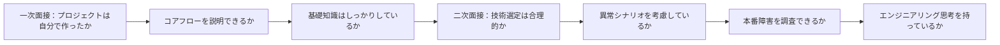

---

## 2. 能力レーダーチャート：面接の注目点がどうアップグレードするか

> 以下は二回の面接の問題密度と追及深度に基づいて整理した主観的な振り返りだ。

| 能力項目 | 一次面接の強度 | 二次面接の強度 | 説明 |
|---|---:|---:|---|
| プロジェクト深度 | 8 | 9 | 両方ともプロジェクトを中心に追及 |
| Java 基礎 | 7 | 5 | 一次面接はコレクション、文字列、Maven 重視 |
| ミドルウェア理解 | 7 | 8 | Redis、Docker、Kafka すべて質問あり |
| アーキテクチャ設計 | 5 | 8 | 二次面接から選定理由を追及 |
| トラブルシューティング能力 | 6 | 9 | 二次面接は CPU 高負荷特定が重点 |
| エンジニアリング思考 | 5 | 9 | 二次面接で本当の差がつく部分 |

## 3. 一次面接振り返り：プロジェクト真実性と基礎の確かさ

一次面接は全体的に難易度が適度で、核心は意図的に意地悪な質問をすることではなく、四つのことを確認することだ：

1. プロジェクトは本当に自分でやったものか；
2. 技術チェーンを入口から出口まで説明できるか；
3. Java 基礎に明らかな穴がないか；
4. 日常的な問題に基本的な調査パスがあるか。

---

### 3.1 Spring Cache 改造：キャッシュ三大問題の解決方法

面接官は Spring Cache 改造ツールがキャッシュ貫通、キャッシュヒット崩壊、キャッシュ雪崩をどう解決するか重点的に追及した。

| 問題 | 典型的リスク | 一般的解決策 | 高品質な表現 |
|---|---|---|---|
| キャッシュ貫通 | 存在しないデータが繰り返し DB にヒット | ブルームフィルター、空値キャッシュ、パラメータ検証 | 「不正な Key を事前遮断 + 空結果の短 TTL フォールバック」 |
| キャッシュヒット崩壊 | ホット Key の期限切れ瞬間に大量リクエストがソースに戻る | 分散ロック、ローカルロック、SingleFlight | 「一つのスレッドだけソースに戻し、他は待機または古い値を返す」 |
| キャッシュ雪崩 | 大量の Key が同時に期限切れし DB 負荷が急増 | TTL ランダム揺らぎ、プリヒート、レート制限グレードアウト | 「期限時間を分散 + ホット Key の非同期更新 + グレードアウト保護」 |

#### キャッシュ保護チェーン図

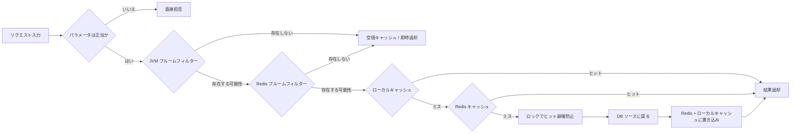

#### 推奨回答テンプレート

> キャッシュチェーンの前にブルームフィルターとパラメータ検証を追加し、明らかに存在しない、または不正な Key を遮断する。DB に本当に存在しないデータについては、短い TTL の空値キャッシュを書き込み、リクエストが繰り返し DB にヒットするのを防ぐ。ホット Key 失効問題については、ローカルロックまたは Redis 分散ロックで SingleFlight メカニズムを実装し、一つのスレッドだけがソースに戻り、他のスレッドは待機、リトライ、または古い値を返す。雪崩問題については、TTL にランダム揺らぎを追加し、ホット Key のプリヒート、非同期更新、レート制限グレードアウトと組み合わせる。

---

### 3.2 OJ コードサンドボックス：Docker でユーザーコードを実行する方法

OJ プロジェクトの核心問題は：**ユーザーが提出したコードをホストマシンで直接実行してはいけない**。

ユーザーコードを直接実行すると、いくつかのリスクがある：

- 悪意あるコードがファイルを削除、機密ディレクトリを読み取る可能性；
- 無限ループが CPU を使い果たす可能性；
- 大きなオブジェクトがメモリを破壊する可能性；
- 複数の提出が同時に実行されるとき、リソースが制御不能になる。

#### コードサンドボックス実行フロー

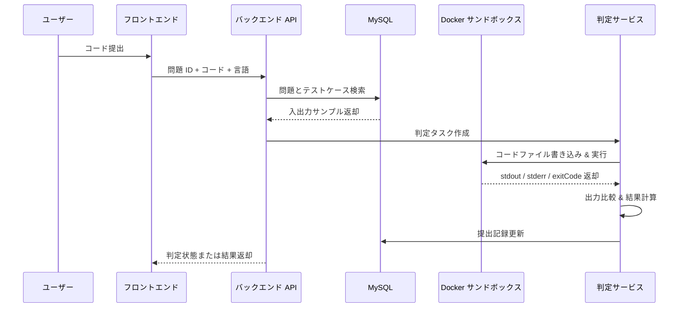

#### Docker サンドボックスで制限すべきこと

| 制限項目 | 目的 | 例 |
|---|---|---|
| CPU | 無限ループによるマシン占有防止 | `--cpus=1` |
| メモリ | OOM によるホストマシン影響防止 | `--memory=256m` |
| 実行時間 | タスクの永久実行防止 | バックエンドで定期的にプロセス kill |
| ファイルシステム | 危険なディレクトリへの書き込み防止 | 一時ディレクトリのみマウント |
| ネットワーク | 外部ネットワークアクセス防止 | `--network=none` |
| プロセス数 | fork 爆弾防止 | pid 数制限 |

#### 推奨回答テンプレート

> ユーザーコードをホストマシンで直接実行せず、事前構築した言語イメージで制限付きコンテナを作成する。バックエンドはユーザーコードとテストケースを一時ディレクトリに書き込み、コンテナにマウントしてスクリプトを実行する。コンテナ側で CPU、メモリ、実行時間、ネットワーク、ファイルアクセス範囲を制限する。実行完了後、バックエンドは stdout、stderr、exitCode を収集し、期待される出力と比較し、最後に提出結果を更新する。

---

### 3.3 フロントエンドボタンが反応しない：バックエンドでの調査方法

この問題は単純に見えるが、非常に実践的だ。「ログを見る」とだけ答えず、レイヤー別に調査する。

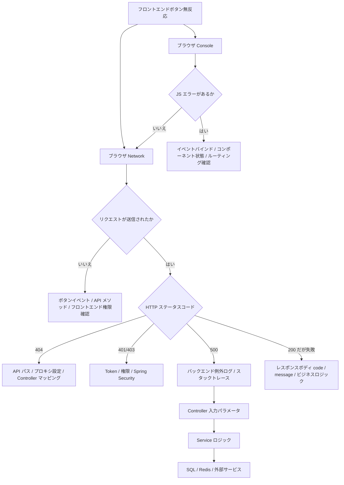

#### 推奨回答テンプレート

> まずブラウザの Console と Network を開く。フロントエンドに JS エラーがあるか確認し、次にリクエストが本当に送信されたか確認する。リクエストが送信されていない場合、ボタンイベント、API カプセル化、フロントエンド権限またはルーティングを優先的に調査する。リクエストが送信された場合、ステータスコードで判断：404 はパスとプロキシ、401/403 は Token と権限、500 はバックエンドログとスタックトレースを確認。200 だがビジネス失敗の場合、レスポンスボディのビジネスコードと message を確認し、Controller、Service、SQL のレイヤー別に特定する。

---

### 3.4 HashSet カスタムオブジェクト重複排除：なぜ equals と hashCode を同時にオーバーライドする必要があるか

| メソッド | 役割 |
|---|---|
| `equals()` | 二つのオブジェクトがビジネス的に等しいか判断 |
| `hashCode()` | オブジェクトのハッシュテーブル内のバケット位置を決定 |
| `equals()` だけオーバーライドした問題 | ビジネス的に等しい二つのオブジェクトが異なるバケットに入り、重複排除が失敗する可能性 |
| 正しい方法 | `equals()` と `hashCode()` を一貫性を保ってオーバーライド |

サンプルコード：

```java
import java.util.Objects;

public class User {
    private Long id;
    private String username;

    @Override
    public boolean equals(Object o) {
        if (this == o) return true;
        if (!(o instanceof User user)) return false;
        return Objects.equals(id, user.id);
    }

    @Override
    public int hashCode() {
        return Objects.hash(id);
    }
}
```

#### 面接表現のポイント

> HashSet の基盤は HashMap に依存している。要素追加時、まず hashCode でバケットを特定し、次に equals で等しいか判断する。equals だけオーバーライドして hashCode をオーバーライドしないと、ビジネス的に等しい二つのオブジェクトの hashCode が異なり、異なるバケットに入り、最終的に HashSet の重複排除が失敗する。

---

## 4. 二次面接振り返り：技術選定とエンジニアリング思考

二次面接の問題は明らかに実際の本番環境に近い。面接官は「何を使ったか」で満足せず、さらに追及する：

- なぜ使うのか？
- 使わなくていいか？
- どんな代償があるか？
- 障害時どうするか？
- 監視、アラート、リトライ、グレードアウトはあるか？

---

### 4.1 WebSocket はなぜ HTTP を置き換えられないか

WebSocket と HTTP は置き換え関係ではなく、適用シナリオが異なる。

| 比較項目 | HTTP | WebSocket |
|---|---|---|
| 通信モデル | リクエスト-レスポンス | 全二重長接続 |
| サーバープッシュ | 自然にはサポートしない、通常ポーリングまたは SSE | サーバーからの能動的プッシュをネイティブサポート |
| 接続コスト | リクエスト終了後、リソース解放が早い | 接続、ハートビート、再接続の維持が必要 |
| 適したシナリオ | CRUD、クエリ、フォーム送信、ファイルアップロード | チャット、共同編集、リアルタイム通知、判定結果プッシュ |
| 主な問題 | リアルタイム性が弱い | 長接続がリソースを占有、ガバナンスが複雑 |

#### WebSocket 通信状態図

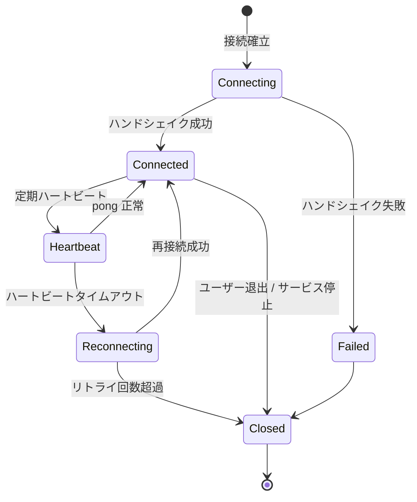

#### 推奨回答テンプレート

> WebSocket はリアルタイムプッシュに適しているが、すべての HTTP リクエストを置き換えるには適さない。WebSocket は長接続であり、接続状態、ハートビート、切断再接続、接続数上限、メモリ占有を維持する必要があるからだ。ほとんどの CRUD リクエストは本来一回のリクエストで一回のレスポンスであり、HTTP の方がシンプルで、ゲートウェイ、キャッシュ、ロードバランシング、監視体系にも適している。私のプロジェクトでは WebSocket は判定結果プッシュまたはチャットメッセージプッシュにのみ使用し、通常の API は引き続き HTTP を使用する。

---

### 4.2 OJ システムになぜ Kafka を導入したか

OJ 判定は典型的な時間のかかるタスクだ。ユーザーがコードを提出した後に同期的に判定すると、ピーク時に以下の問題が発生しやすい：

- API スレッドが長時間占有される；
- Docker 実行リソースが使い果たされる；
- ユーザーリクエストがタイムアウトする；
- 判定サービスと API サービスが相互に影響する。

#### Kafka 非同期判定アーキテクチャ

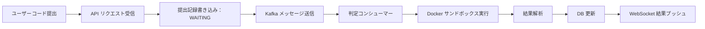

#### Kafka が OJ にもたらす価値

| 価値 | 説明 |
|---|---|
| ピークカット | ピーク時の提出リクエストをまずキューに入れ、コンシューマーが能力に応じて消費 |
| 分離 | API サービスは提出のみ受信、判定サービスは独立して実行タスクを処理 |
| 非同期化 | ユーザーは Docker 実行完了までブロック待機しなくていい |
| 回復可能性 | 消費失敗はリトライ可能、タスクの直接損失を回避 |
| 拡張性 | 複数の判定コンシューマーを水平スケール可能 |

#### 推奨回答テンプレート

> Kafka を導入した理由は技術スタックを豊富に見せるためではなく、判定が時間のかかるタスクだからだ。API サービスは提出の受信、DB への WAITING 状態での保存のみを行い、その後 Kafka メッセージを送信する。判定コンシューマーは自身の処理能力に応じてタスクを消費し、Docker サンドボックスを実行し、最後に結果を更新して WebSocket でプッシュする。これによりピークカット、分離、非同期化が実現でき、後続の判定コンシューマーの水平スケールも容易になる。

---

### 4.3 Docker コンテナが落ちたらどうするか

`restart: always` とだけ答えるのは不十分だ。これは基本的なヘルスチェックだが、本番設計ではヘルスチェック、失敗閾値、再作成、アラート、グレードアウトも考慮する必要がある。

#### コンテナヘルスチェックと障害処理フロー

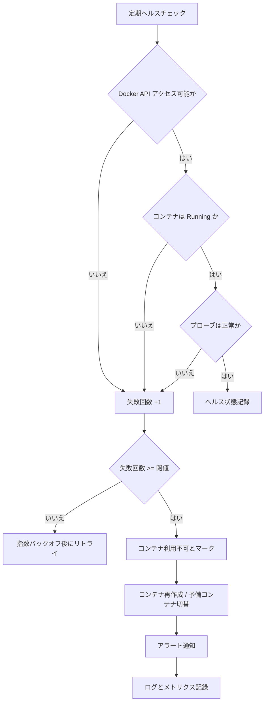

#### エンジニアリング補足ポイント

| 方向 | 説明 |
|---|---|
| リソース制限 | CPU、メモリ、プロセス数、実行時間を制限 |
| ヘルスチェック | 定期的にコンテナ状態とプローブ結果を確認 |
| 失敗リトライ | 一時的な失敗はまずバックオフしてリトライ、即座に死亡判定しない |
| コンテナ再作成 | 複数回失敗後、コンテナを破棄して再作成 |
| アラート通知 | 失敗率、異常終了コード、stderr を記録 |
| グレードアウト戦略 | コンテナプールが利用不可の場合、提出状態を `JUDGE_DELAYED` に設定 |

#### 推奨回答テンプレート

> `restart: always` はコンテナプロセス終了後の自動再起動しか解決できないが、実際のシナリオではヘルスチェックも必要だ。定期的に Docker API でコンテナ状態を確認し、プローブタスクを実行してコンテナがコードを正常に実行できるか確認する。連続失敗が閾値に達したら、コンテナを利用不可とマークし、再作成または予備コンテナに切り替え、同時にログ、メトリクスを記録してアラートを発報する。コンテナプール全体が利用不可の場合、提出状態を遅延判定とマークし、タスクの直接失敗を回避する。

---

### 4.4 責任チェーンパターン：デザインパターンのためのデザインパターンをどう避けるか

二次面接でキャッシュミドルウェアの責任チェーンパターン使用について質問されたが、重点はデザインパターンの定義を暗記することではなく、それが本当に問題を解決したかを説明することだ。

#### キャッシュ責任チェーン設計

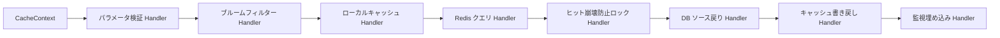

| 設計メリット | 具体的体现 |
|---|---|
| 拡張性 | 後続でレート制限、カナリア、グレードアウト、監視ノードを挿入可能 |
| 可観測性 | 各 Handler でレイテンシ、ヒット率、失敗率を統計可能 |
| 置換可能性 | DB ソース戻り、Redis クエリ、ローカルキャッシュは独立して置換可能 |
| 低侵入 | すべてのロジックを一つの超長 Service メソッドに積み上げない |

#### 境界を積極的に説明

> チェーンが二、三のステップしかない場合、通常の Service またはテンプレートメソッドで十分だ。責任チェーンはステップが多く、プラガブルで、監視と拡張が必要なシナリオに適している。単にデザインパターンを適用するためだけなら、理解コストを増やすだけだ。

この回答は単に「責任チェーンパターンを使った」と言うよりもはるかに成熟している。

---

### 4.5 JWT 認証：ステートレスだけでは不十分

JWT は高頻度の質問だ。「JWT はステートレス、Session はステートフル」とだけ答えるのは不十分で、失効制御とセキュリティ問題も補完する必要がある。

| 比較項目 | Session | JWT |
|---|---|---|
| 状態保存 | サーバー側でセッション保存 | Token 自体にユーザー情報を含む |
| 分散サポート | Session 共有または Redis が必要 | 分散システムに自然に適合 |
| サーバー制御 | 能動的失効が容易 | 能動的失効が面倒 |
| セキュリティリスク | Session ID 漏洩 | Token 漏洩後、有効期間内は使用可能 |
| 一般的解決策 | Redis Session | Access Token + Refresh Token + ブラックリスト |

#### JWT 認証フロー

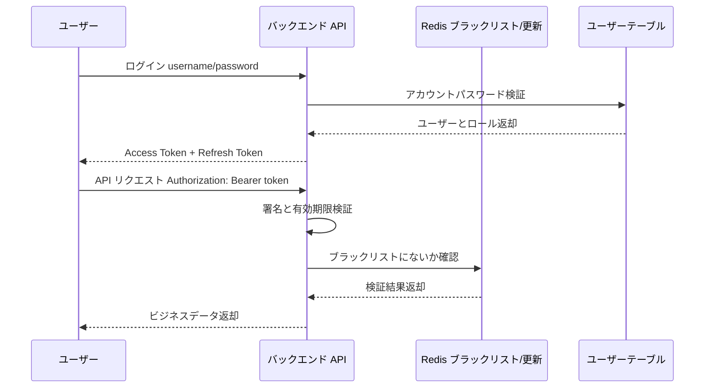

#### 推奨回答テンプレート

> JWT の利点はステートレスで、分散システムに適しており、サーバー側で Session を保存する必要がないことだ。しかし、発行後は有効期限前の能動的失効が難しいという問題がある。そのため本番では通常、Access Token の有効期限を短く設定し、Refresh Token で更新を組み合わせる。ユーザーがログアウト、パスワード変更、アカウント停止の場合、Token の jti を Redis ブラックリストに入れ、API 認証時に追加でブラックリストを確認する。

---

## 5. 本番障害対応：CPU 高負荷の特定方法

二次面接で最も重要な質問は：

> Linux であるマシンの負荷が極端に高い場合、どのプロセスが原因かどう調査するか？プロセス ID を取得した後、さらにどう特定するか？

当時「直接 `kill -9`」と答えた場合、実際の本番環境では非常に危険だ。

---

### 5.1 なぜ直接 kill -9 してはいけないか

| リスク | 説明 |
|---|---|
| データ不整合 | 実行中のトランザクション、ファイル書き込み、メッセージ消費が強制中断される可能性 |
| 現場消失 | スレッドスタック、ヒープ情報、GC 状態が採取される前に消える |
| 障害拡大 | コアサービスを kill すると大量のリクエストが失敗する可能性 |
| 振り返り不可 | 証拠チェーンがなく、後続で根本原因の特定が困難 |

正しいアプローチは：**まず現場を保存し、次に問題を特定し、最後に止血方法を決定する。**

---

### 5.2 CPU 高負荷調査フロー

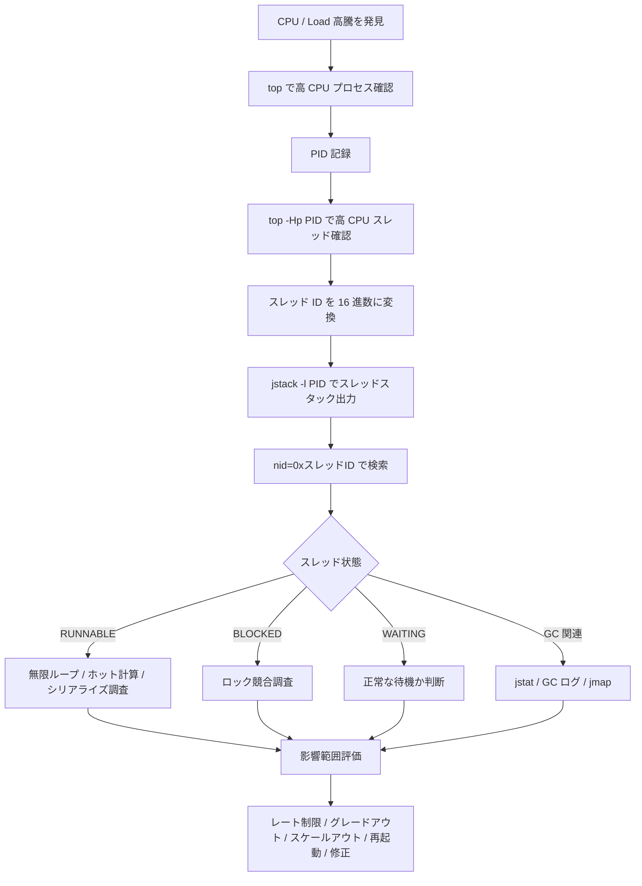

---

### 5.3 よく使うコマンドリスト

```bash
# 1. 全体負荷と高 CPU プロセス確認
top

# 2. 特定 Java プロセス内のスレッド別 CPU 使用率確認
top -Hp <pid>

# 3. 10 進数スレッド ID を 16 進数に変換
printf "%x\n" <tid>

# 4. Java スレッドスタック出力
jstack -l <pid> > jstack.log

# 5. jstack で該当スレッドを検索
 grep -n "nid=0x<hex_tid>" jstack.log

# 6. GC 使用状況確認
jstat -gcutil <pid> 1000 10

# 7. ヒープメモリ概要確認
jmap -heap <pid>

# 8. プロセスが開いているファイルとポート確認
lsof -p <pid>

# 9. システムコール状況確認
strace -p <pid>
```

---

### 5.4 面接回答テンプレート

> 最初にプロセスを kill せず、まず現場を保存する。まず `top` で高 CPU の Java プロセスを見つけ、`top -Hp <pid>` で具体的な高 CPU スレッドを見つけ、スレッド ID を 16 進数に変換し、`jstack` でスレッドスタックを出力し、スタックファイル内で `nid` から該当スレッドを特定する。次にスレッド状態を確認：`RUNNABLE` の場合、無限ループ、複雑な計算、頻繁なシリアライズなどのホットコードを重点的に調査；`BLOCKED` の場合、ロック競合を調査；頻繁な GC に伴う場合、`jstat`、GC ログ、ヒープダンプと組み合わせて分析する。原因確認後、影響範囲に応じてレート制限、グレードアウト、スケールアウト、再起動、またはコード修正を選択する。

---

## 6. 高頻度問題分類整理

### 6.1 プロジェクト関連問題

| 問題 | 評価ポイント | 回答のポイント |
|---|---|---|
| 最も難易度の高かったプロジェクトは何か | プロジェクト深度 | ビジネス複雑さ + 技術的難点 + 自分の担当部分 |
| OJ コードサンドボックスの実装方法 | Docker 実践 | イメージ、コンテナ、スクリプト、リソース制限、セキュリティ分離 |
| Kafka がプロジェクトで解決する問題 | 非同期アーキテクチャ | ピークカット、分離、リトライ、コンシューマースケールアウト |
| WebSocket をなぜ使うか | リアルタイム通信 | 判定結果プッシュ、長接続コスト、HTTP との比較 |
| コンテナが落ちたらどうするか | エンジニアリングフォールバック | ヘルスチェック、指数バックオフ、再作成、アラート |

### 6.2 基礎関連問題

| 問題 | 標準回答方向 |
|---|---|
| ArrayList vs LinkedList | 動的配列 vs 双方向連結リスト；クエリ、挿入、削除の計算量；実際は ArrayList がより一般的 |
| HashSet カスタムオブジェクト重複排除 | equals と hashCode を同時にオーバーライド |
| 文字列反転 | 双ポインタ、StringBuilder reverse、逆順走査 |
| Maven よく使うコマンド | clean、compile、test、package、install、deploy |
| Dubbo vs Spring Cloud | RPC フレームワーク vs マイクロサービスエコシステム；通信プロトコル、サービスガバナンス、使用シナリオ |

### 6.3 エンジニアリング関連問題

| 問題 | 高品質回答キーワード |
|---|---|
| フロントエンドボタンエラーの調査方法 | Console、Network、ステータスコード、ログ、ブレークポイント、チェーントレーシング |
| 本番 CPU 高負荷の調査方法 | top、top -Hp、jstack、nid、スレッド状態、GC |
| JWT vs Session | ステートレス、分散、ブラックリスト、更新、Token 失効制御 |
| Excel エクスポートパフォーマンス最適化 | 非同期タスク、ストリーミング書き込み、ページネーションクエリ、レート制限、重複提出防止 |
| デザインパターンが過剰設計か | シナリオ境界、拡張性、可観測性、複雑さとメリットの比率 |

---

## 7. プロジェクト表現アップグレード：OJ プロジェクトの再パッケージ方法

多くの人のプロジェクトは実際には悪くないが、面接での表現が以下のようになりがちだ：

> Spring Boot、Redis、Docker、Kafka、WebSocket を使いました。

この発言の問題は：**技術スタックを羅列しているだけで、ビジネス問題も技術的価値も語っていない。**

より良い表現方法は：

> 私が作ったのは LeetCode 類似のオンライン判定システムで、コアの難点はユーザーコードの安全な実行、ピーク時の非同期判定、判定結果のリアルタイムプッシュ、および判定コンテナの安定性と可観測性の確保です。

---

### 7.1 プロジェクトアーキテクチャ図

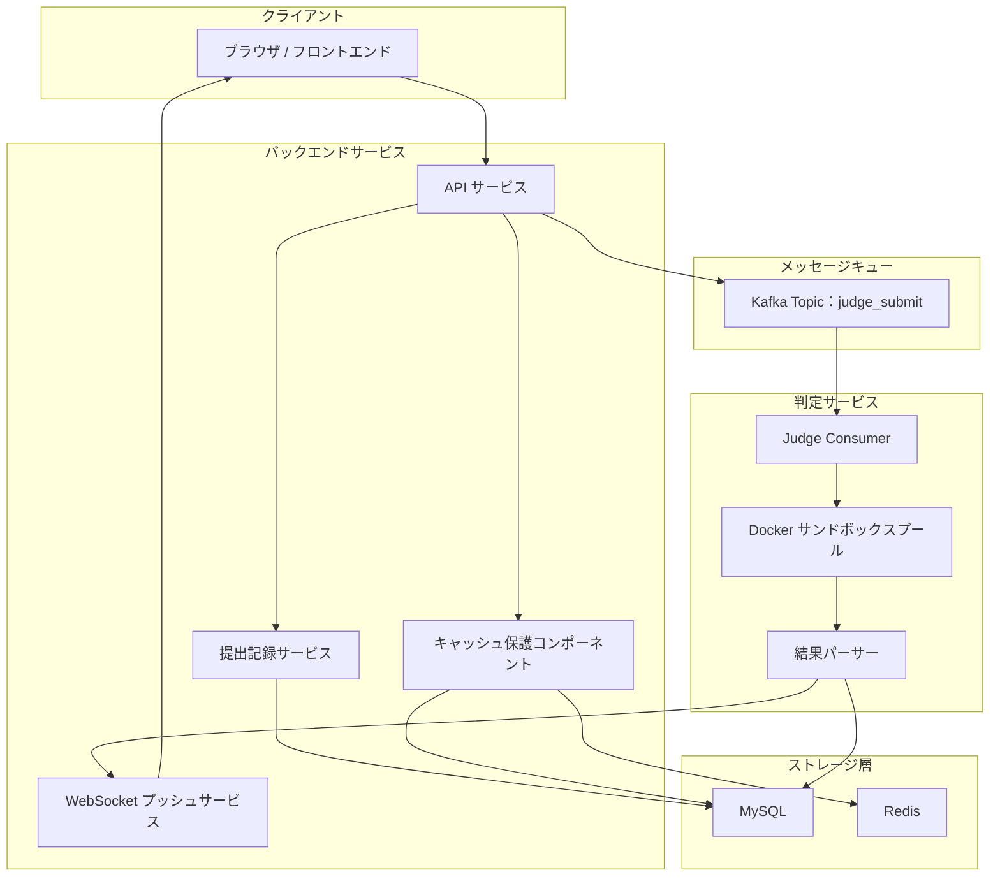

---

### 7.2 プロジェクトハイライト表現表

| ハイライト | 未熟な表現 | 成熟した表現 |
|---|---|---|
| Docker サンドボックス | Docker でコードを実行しました | Docker でユーザーコード実行環境を分離し、CPU、メモリ、時間、ネットワーク、ファイルシステム権限を制限しました |
| Kafka | Kafka を使いました | Kafka で提出リクエストと判定実行を分離し、ピーク時の同期判定によるスレッドブロック問題を解決しました |
| WebSocket | WebSocket を使いました | WebSocket で判定結果をプッシュし、フロントエンドの頻繁なポーリングを回避し、ユーザー体験を向上させました |
| Redis | Redis キャッシュを使いました | Redis + ローカルキャッシュ + ブルームフィルターでホットデータを保護し、貫通、ヒット崩壊、雪崩問題を処理しました |
| 監視フォールバック | 例外処理をしました | コンテナ実行レイテンシ、失敗率、終了コード、stderr を記録し、異常時にリトライ、グレードアウト、アラートを行います |

---

### 7.3 面接プロジェクト説明構造

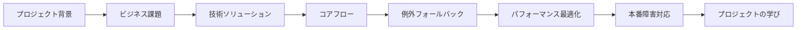

この順序で説明することを推奨：

1. **プロジェクト背景**：これはどういうシステムで、何を解決するのか。
2. **ビジネス課題**：同期判定が遅い、ユーザーコードが安全でない、ピーク時にリクエストが多い。
3. **技術ソリューション**：Docker サンドボックス、Kafka 非同期、WebSocket プッシュ、Redis キャッシュ。
4. **コアフロー**：ユーザーがコードを提出してから最終的に結果が返るまでの完全なチェーン。
5. **例外フォールバック**：タイムアウト、コンテナ失敗、メッセージ消費失敗、重複提出。
6. **パフォーマンス最適化**：キャッシュ、非同期、レート制限、コンテナプール。
7. **本番障害対応**：ログ、メトリクス、スレッドスタック、GC、コンテナ状態。
8. **プロジェクトの学び**：機能を動かすことから本番利用可能性を考慮することへ。

---

## 8. 面接前補完ロードマップ

「学生プロジェクト」から「企業利用可能プロジェクト」にアップグレードする場合、以下の順序で補完することを推奨。

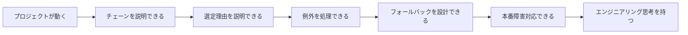

| 段階 | 目標 | 推奨補完内容 |
|---|---|---|
| 第 1 段階 | プロジェクトチェーンを明確に説明 | リクエスト入口、コアフロー、DB テーブル、主要 API |
| 第 2 段階 | 技術選定を明確に説明 | なぜ Redis、Docker、Kafka、WebSocket を使うか |
| 第 3 段階 | 例外シナリオを完全に説明 | タイムアウト、失敗、リトライ、冪等性、レート制限、グレードアウト |
| 第 4 段階 | 本番障害対応を専門的に説明 | top、jstack、jmap、jstat、Arthas、ログ特定 |
| 第 5 段階 | エンジニアリング表現を成熟させる | 監視、アラート、カナリア、災害復旧、キャパシティ評価、負荷テスト |

---

## 9. 最終まとめ

この二回の面接の最大の教訓は：

> 一次面接は基礎があるかを決定し、二次面接はエンジニアリングポテンシャルがあるかを決定する。

一次面接では、プロジェクトが本物で、基礎がしっかりしていて、調査思考が明確であれば、基本的に会話が続く。二次面接では、面接官は徐々に問題を実際の本番環境に押し進める：

- コンテナが落ちたらどうするか？
- Kafka はなぜ必要か？
- WebSocket をなぜ濫用してはいけないか？
- 本番で CPU が高騰したらどう特定するか？
- デザインパターンは過剰設計ではないか？

本当に差がつくのは「技術用語をどれだけ知っているか」ではなく、以下の五つのことだ：

1. **プロジェクトチェーンをクローズドループで説明できる**：リクエスト入力から結果返却まで、各ステップで誰が担当し、データがどう流れるか。
2. **技術選定理由を説明できる**：なぜこのコンポーネントを使うのか、何を解決するのか、どんな代償があるか。
3. **失敗シナリオを考慮できる**：タイムアウト、例外、リトライ、冪等性、リソース枯渇、サービスグレードアウト。
4. **本番現場を保存できる**：まず特定、証拠採取、影響評価、その後再起動または止血を決定。
5. **本番への敬意を示せる**：本番環境は個人サーバーではなく、感覚で直接 `kill -9` してはいけない。

最後に Java バックエンドインターンを準備している学生に一言：

> プロジェクトは技術スタックの羅列ではなく、ビジネス問題、技術ソリューション、例外フォールバック、本番障害対応を明確に語ることだ。この四つを明確に語れれば、面接での競争力は明らかに向上する。

---

## 付録：面接前セルフチェックリスト

| チェック項目 | 回答できるか |
|---|---|
| 1 分でプロジェクト背景とコアの難点を紹介できるか | ☐ |
| プロジェクトのコアアーキテクチャ図を描けるか | ☐ |
| 一回のリクエストの完全なチェーンを説明できるか | ☐ |
| Redis キャッシュ貫通、ヒット崩壊、雪崩の処理方法を説明できるか | ☐ |
| Docker サンドボックスのセキュリティ制限を説明できるか | ☐ |
| Kafka のピークカット、分離、リトライの価値を説明できるか | ☐ |
| WebSocket と HTTP の適用境界を説明できるか | ☐ |
| JWT の能動的失効方法に回答できるか | ☐ |
| CPU 高負荷調査フローを完全に説明できるか | ☐ |
| プロジェクトにどのような例外フォールバックと監視ポイントがあるか説明できるか | ☐ |
